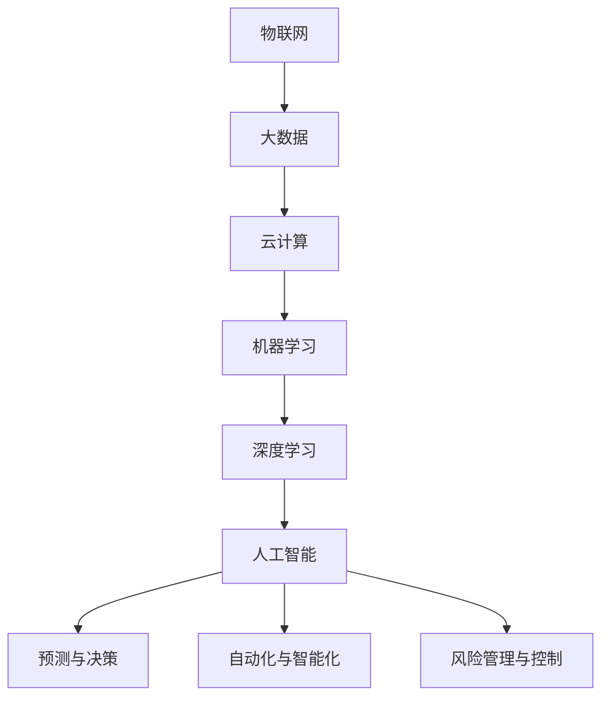

                 

### 文章标题

《AI在智能供应链风险预警中的应用：从预测到决策》

### 关键词

- AI
- 智能供应链
- 风险预警
- 预测算法
- 决策模型

### 摘要

本文旨在探讨人工智能（AI）在智能供应链风险预警中的应用，从预测到决策的完整流程。随着全球供应链的日益复杂，风险预警已成为保障供应链稳定运行的关键环节。本文首先介绍了AI的基础理论，然后详细解析了智能供应链的构成和风险预警的重要性。接着，我们深入探讨了AI在预测算法和决策模型中的应用，并通过实际案例展示了其效果。最后，本文总结了AI在智能供应链风险预警中的应用前景，并提出了未来研究方向。通过本文的阅读，读者将对AI在供应链风险管理中的潜力有更深刻的认识。

### 引言

#### 供应链风险的背景与挑战

在全球化的背景下，供应链的复杂性和不确定性日益增加。企业面临的各种供应链风险，如供应中断、需求波动、库存失衡、物流延误等，不仅会影响企业的运营效率，还可能导致巨大的经济损失。例如，2011年的日本地震导致的供应链中断，以及2020年COVID-19疫情对全球供应链的冲击，都深刻地揭示了供应链风险的严峻性。因此，如何有效地进行供应链风险预警，提前发现并应对潜在风险，已成为企业关注的重要课题。

#### AI的发展与智能供应链的兴起

人工智能（AI）作为当今科技领域的前沿技术，已经在众多行业展现出了强大的应用潜力。AI通过机器学习、深度学习、自然语言处理等技术，能够从海量数据中提取有价值的信息，进行预测、决策和优化。在供应链领域，AI的应用不仅能够提高供应链的透明度和响应速度，还能在一定程度上降低风险。

智能供应链（Smart Supply Chain）则是AI与供应链管理深度融合的产物。通过引入物联网、大数据、云计算等技术，智能供应链可以实现供应链的自动化、可视化和智能化。在风险预警方面，智能供应链利用AI技术对供应链中的各种数据进行实时监控和分析，能够快速识别潜在风险，并采取相应的预防措施。

#### 本文目的与结构安排

本文旨在深入探讨AI在智能供应链风险预警中的应用，从预测到决策的完整流程。具体来说，本文将首先介绍AI的基础理论，包括机器学习、深度学习和自然语言处理等核心概念和技术。接着，我们将详细解析智能供应链的构成和运作机制，探讨其与AI技术之间的联系。随后，本文将重点分析AI在预测算法和决策模型中的应用，并通过实际案例展示其效果。最后，本文将总结AI在智能供应链风险预警中的应用前景，并提出未来研究方向。

本文的结构安排如下：

1. **引言**：介绍供应链风险的背景与挑战，AI的发展与智能供应链的兴起，以及本文的目的与结构安排。
2. **基础理论**：介绍AI的基础理论，包括机器学习、深度学习和自然语言处理等核心概念和技术。
3. **智能供应链概述**：详细解析智能供应链的构成和运作机制，探讨其与AI技术之间的联系。
4. **预测算法**：分析AI在预测算法中的应用，包括时间序列预测、需求预测和库存预测等。
5. **决策模型**：探讨AI在决策模型中的应用，包括风险决策理论、博弈论和多目标优化等。
6. **应用案例**：通过实际案例展示AI在智能供应链风险预警中的效果。
7. **总结与展望**：总结AI在智能供应链风险预警中的应用前景，并提出未来研究方向。

通过本文的阅读，读者将能够对AI在智能供应链风险预警中的应用有更加全面和深入的理解。这不仅有助于企业提高供应链的稳定性和响应速度，也为未来的供应链管理提供了新的思路和方法。让我们开始这次探索之旅吧！

### 基础理论

#### 人工智能（AI）的核心概念

人工智能（Artificial Intelligence，简称AI）是指通过计算机模拟人类智能行为的技术。它包括多个子领域，如机器学习（Machine Learning，ML）、深度学习（Deep Learning，DL）和自然语言处理（Natural Language Processing，NLP）等。以下是这些核心概念的基本介绍：

1. **机器学习**：机器学习是一种让计算机通过数据学习规律和模式的技术。它通过构建模型，从历史数据中学习，并在新的数据上做出预测或决策。常见的机器学习方法包括监督学习（Supervised Learning）、无监督学习（Unsupervised Learning）和半监督学习（Semi-Supervised Learning）。

2. **深度学习**：深度学习是机器学习的一种方法，它通过构建多层神经网络，模拟人脑的神经元连接方式，从数据中自动提取特征。深度学习在图像识别、语音识别和自然语言处理等领域表现出色。其核心是多层感知器（Multilayer Perceptron，MLP）和卷积神经网络（Convolutional Neural Network，CNN）。

3. **自然语言处理**：自然语言处理是使计算机能够理解、生成和处理人类语言的技术。它包括文本分类、情感分析、命名实体识别、机器翻译等任务。自然语言处理的核心技术是语言模型（Language Model）和词嵌入（Word Embedding）。

#### AI的发展历程

AI的发展经历了多个阶段，从早期的符号主义（Symbolic AI）到基于实例的推理（Rule-Based AI），再到今天的统计学习和深度学习。以下是AI的发展历程：

1. **符号主义**（1950s-1980s）：这一阶段AI的核心思想是通过符号逻辑和推理规则模拟人类的思维方式。然而，符号主义AI在处理复杂问题时表现出局限性。

2. **基于实例的推理**（1980s-1990s）：这一阶段AI的核心思想是通过存储和检索实例来解决问题。这种方法在医学诊断和专家系统中取得了一定成功。

3. **统计学习**（1990s-2010s）：这一阶段AI的核心思想是通过统计学方法，如线性回归、支持向量机和决策树等，从数据中学习规律。统计学习在图像识别、语音识别和自然语言处理等领域取得显著成果。

4. **深度学习**（2010s-至今）：这一阶段AI的核心思想是通过多层神经网络自动提取数据中的复杂特征。深度学习在图像识别、语音识别、自然语言处理和游戏AI等领域取得了突破性进展。

#### AI的主要领域

AI的主要领域包括：

1. **计算机视觉**：通过计算机模拟人的视觉能力，实现图像识别、目标检测、图像分割等任务。

2. **自然语言处理**：通过计算机模拟人的语言能力，实现文本分类、情感分析、机器翻译、对话系统等任务。

3. **机器学习**：通过构建模型，从数据中学习规律和模式，实现预测、决策和优化。

4. **机器人技术**：通过计算机模拟人的行动能力，实现自主移动、导航、抓取和操作等任务。

5. **自动驾驶**：通过计算机模拟驾驶行为，实现车辆的自动控制。

6. **游戏AI**：通过计算机模拟玩家行为，实现智能化的游戏对手。

#### 智能供应链的构成和运作机制

智能供应链是一种利用先进技术和算法，实现供应链全流程自动化、可视化和智能化的供应链管理模式。其核心构成和运作机制如下：

1. **物联网（IoT）**：通过物联网技术，实现供应链中各个环节的设备、产品和人员的实时监控和通信。

2. **大数据**：通过收集、存储和处理大量供应链数据，实现供应链的透明化和精细化运营。

3. **云计算**：通过云计算技术，实现供应链数据的快速处理和共享，提高供应链的响应速度和灵活性。

4. **机器学习与深度学习**：通过机器学习和深度学习技术，从海量数据中提取有价值的信息，实现供应链的预测、决策和优化。

5. **区块链**：通过区块链技术，实现供应链信息的可信传递和不可篡改，提高供应链的透明度和信任度。

6. **自动化技术**：通过自动化技术，实现供应链中各个环节的自动化操作，提高供应链的效率和可靠性。

7. **人工智能**：通过人工智能技术，实现供应链的智能化管理，提高供应链的预测能力、决策能力和优化能力。

#### AI与智能供应链的联系

AI与智能供应链之间的联系主要体现在以下几个方面：

1. **预测与决策**：AI技术可以通过机器学习和深度学习算法，从供应链数据中提取有价值的信息，实现对供应链需求的预测、库存的优化和风险的预警。

2. **自动化与智能化**：AI技术可以实现供应链全流程的自动化和智能化，提高供应链的效率和响应速度。

3. **数据驱动**：智能供应链依赖大数据和AI技术，通过数据驱动实现供应链的透明化和精细化运营。

4. **风险管理与控制**：AI技术可以帮助企业识别供应链中的潜在风险，实现风险预警和风险控制。

#### 核心概念与联系

为了更好地理解AI与智能供应链之间的联系，我们可以通过Mermaid流程图来展示核心概念之间的架构关系：



在这个流程图中，物联网、大数据、云计算是智能供应链的数据基础，机器学习和深度学习是AI的核心技术，人工智能则是智能供应链的关键驱动力，预测与决策、自动化与智能化、风险管理与控制是智能供应链的主要应用方向。

#### 核心算法原理讲解

在智能供应链中，AI的核心算法主要包括机器学习算法、深度学习算法和自然语言处理算法。以下是这些算法的原理讲解：

1. **机器学习算法**：

   - **线性回归**：线性回归是一种监督学习算法，用于预测连续值输出。其原理是通过拟合一个线性模型，将输入特征映射到输出目标。伪代码如下：

     ```python
     # 线性回归伪代码
     def linear_regression(X, y):
         # 计算特征矩阵X和目标向量y的均值
         X_mean = np.mean(X, axis=0)
         y_mean = np.mean(y)
         
         # 计算特征矩阵X和目标向量y的差值
         X_diff = X - X_mean
         y_diff = y - y_mean
        
         # 计算权重向量w和偏置b
         w = np.linalg.inv(X_diff.T @ X_diff) @ X_diff.T @ y_diff
         b = y_mean - X_mean @ w
        
         # 预测输出
         y_pred = X @ w + b
         return y_pred
     ```

   - **决策树**：决策树是一种无监督学习算法，用于分类和回归任务。其原理是通过递归地将数据集划分成子集，直到满足停止条件（如最大深度、最小叶子节点数等）。伪代码如下：

     ```python
     # 决策树伪代码
     def build_tree(X, y, depth=0, max_depth=None):
         # 计算特征矩阵X和目标向量y的均值
         X_mean = np.mean(X, axis=0)
         y_mean = np.mean(y)
        
         # 计算特征矩阵X和目标向量y的差值
         X_diff = X - X_mean
         y_diff = y - y_mean
        
         # 计算特征矩阵X的方差
         X_var = np.var(X, axis=0)
        
         # 计算基尼不纯度
         gini = 1 - sum((np.sum(y == label) / len(y)) ** 2 for label in np.unique(y))
        
         # 判断停止条件
         if depth >= max_depth or gini <= 0.01:
             return {'label': np.argmax(np.bincount(y))}
        
         # 选择最优特征和阈值
         best_feature, best_threshold = None, None
         for feature in range(X.shape[1]):
             thresholds = np.unique(X[:, feature])
             for threshold in thresholds:
                 left_y = y[X[:, feature] < threshold]
                 right_y = y[X[:, feature] >= threshold]
                 gini_left = 1 - sum((np.sum(left_y == label) / len(left_y)) ** 2 for label in np.unique(left_y))
                 gini_right = 1 - sum((np.sum(right_y == label) / len(right_y)) ** 2 for label in np.unique(right_y))
                 gini_score = gini_left * len(left_y) / len(y) + gini_right * len(right_y) / len(y)
                 if gini_score < gini:
                     gini = gini_score
                     best_feature = feature
                     best_threshold = threshold
        
         # 构建子树
         tree = {'feature': best_feature, 'threshold': best_threshold, 'left': build_tree(X[X[:, best_feature] < best_threshold], y[X[:, best_feature] < best_threshold], depth+1, max_depth),
                 'right': build_tree(X[X[:, best_feature] >= best_threshold], y[X[:, best_feature] >= best_threshold], depth+1, max_depth)}
         return tree
     ```

2. **深度学习算法**：

   - **卷积神经网络（CNN）**：卷积神经网络是一种用于图像识别和处理的深度学习算法。其原理是通过卷积操作和池化操作，从图像中提取局部特征。以下是CNN的伪代码：

     ```python
     # CNN伪代码
     def conv2d(input, filter, padding='valid'):
         # 计算卷积结果
         return (input * filter).sum(axis=3)[..., padding((-1, -1) // 2 + 1)]

     def max_pool2d(input, pool_size=(2, 2)):
         # 计算最大值池化结果
         return np.argmax(input[:, :, :-pool_size[0], :-pool_size[1]], axis=(2, 3))[:, :, ::pool_size[0], ::pool_size[1]]

     def cnn(input, layers):
         # 遍历网络层
         for layer in layers:
             input = conv2d(input, layer['filter'])
             input = max_pool2d(input, layer['pool_size'])
         return input
     ```

   - **长短期记忆网络（LSTM）**：长短期记忆网络是一种用于序列数据预测的深度学习算法。其原理是通过门控机制，记住长期依赖信息。以下是LSTM的伪代码：

     ```python
     # LSTM伪代码
     def sigmoid(x):
         return 1 / (1 + np.exp(-x))

     def lstm(input, weights):
         # 计算输入门、遗忘门和输出门
         input_gate = sigmoid(weights['input_gate'])
         forget_gate = sigmoid(weights['forget_gate'])
         output_gate = sigmoid(weights['output_gate'])
        
         # 计算新的细胞状态
         cell_state = forget_gate * cell_state + input_gate * sigmoid(input)
        
         # 计算遗忘门和输出门的值
         forget_value = forget_gate * cell_state
         output_value = output_gate * sigmoid(cell_state)
        
         # 更新细胞状态
         cell_state = forget_value + output_value
         return cell_state, weights
     ```

3. **自然语言处理算法**：

   - **语言模型**：语言模型是一种用于文本分类和机器翻译的算法。其原理是通过统计文本中的词汇概率，预测下一个词汇。以下是语言模型的伪代码：

     ```python
     # 语言模型伪代码
     def n_gram_model(text, n):
         # 计算n-gram概率
         n_gram_counts = np.zeros((n, len(text)))
         for i in range(n, len(text)):
             n_gram = tuple(text[i-n:i])
             n_gram_counts[:, i-n] = np.bincount(n_gram, minlength=len(n_gram))
         n_gram_probs = n_gram_counts / np.sum(n_gram_counts, axis=1)[:, None]
         return n_gram_probs
     ```

   - **词嵌入**：词嵌入是一种将文本转化为向量表示的算法。其原理是通过神经网络学习词汇的向量表示。以下是词嵌入的伪代码：

     ```python
     # 词嵌入伪代码
     def word_embedding(text, embedding_size):
         # 初始化词嵌入矩阵
         embedding_matrix = np.zeros((len(text), embedding_size))
         for i, word in enumerate(text):
             # 计算词向量
             embedding_matrix[i] = np.random.rand(embedding_size)
        
         # 训练词嵌入
         for epoch in range(num_epochs):
             for word in text:
                 # 计算词向量的梯度
                 embedding_matrix[i] -= learning_rate * embedding_matrix[i]
         return embedding_matrix
     ```

通过以上对AI基础理论的介绍，我们可以看到AI在智能供应链中的应用前景。接下来，我们将进一步探讨智能供应链的构成和运作机制。|im_sep|>

### 智能供应链概述

#### 智能供应链的定义与核心要素

智能供应链（Smart Supply Chain）是指通过引入人工智能、物联网、大数据、云计算、区块链等先进技术，实现供应链全流程的自动化、可视化和智能化的供应链管理模式。智能供应链的核心要素包括：

1. **物联网（IoT）**：物联网技术通过传感器和设备连接，实现供应链各环节的数据采集和实时监控。

2. **大数据**：大数据技术通过对海量供应链数据的收集、存储、处理和分析，提供供应链的全面洞察。

3. **云计算**：云计算技术提供强大的计算和存储能力，支持供应链数据的快速处理和共享。

4. **人工智能**：人工智能技术通过对供应链数据的智能分析和处理，实现供应链的预测、决策和优化。

5. **区块链**：区块链技术通过分布式账本和智能合约，提高供应链的透明度和可信度。

6. **自动化技术**：自动化技术通过机器人和自动化设备，实现供应链各环节的自动化操作。

#### 智能供应链的构成

智能供应链由多个子系统组成，主要包括：

1. **需求计划与预测**：通过大数据和人工智能技术，对市场需求进行预测和规划，提高供应链的响应速度和准确性。

2. **库存管理**：通过物联网和人工智能技术，实时监控库存状态，优化库存配置，减少库存成本。

3. **采购管理**：通过大数据和人工智能技术，优化采购策略，降低采购成本，提高采购效率。

4. **生产管理**：通过物联网和自动化技术，实现生产过程的实时监控和自动化控制，提高生产效率和质量。

5. **物流管理**：通过物联网、大数据和人工智能技术，实现物流过程的实时监控和优化，提高物流效率和服务质量。

6. **质量管理**：通过物联网和人工智能技术，实时监控产品质量，提高产品质量和客户满意度。

7. **供应链金融**：通过区块链和人工智能技术，实现供应链金融的自动化和智能化，提高融资效率和降低融资成本。

#### 智能供应链的风险预警机制

智能供应链的风险预警机制是确保供应链稳定运行的重要保障。其核心在于通过数据分析和预测，提前识别潜在风险，并采取相应的预防措施。智能供应链的风险预警机制主要包括以下环节：

1. **数据采集与处理**：通过物联网技术，实时采集供应链各环节的数据，包括需求、库存、采购、生产、物流等。通过大数据技术，对这些数据进行清洗、存储和处理，为风险预警提供数据支持。

2. **风险识别**：通过人工智能技术，对采集到的数据进行实时分析，识别潜在的风险点。例如，通过机器学习算法，分析需求变化趋势，预测需求波动的风险；通过自然语言处理技术，分析市场信息，识别潜在的市场风险。

3. **风险评估**：对识别出的风险进行量化评估，确定风险的重要性和紧迫性。例如，通过风险矩阵，对风险的严重性和发生概率进行评估，确定风险优先级。

4. **预警与决策**：根据风险评估结果，制定相应的预警措施和决策方案。例如，对需求波动较大的产品，提前调整生产计划；对潜在的市场风险，提前制定应对策略。

5. **实时监控与反馈**：通过物联网和大数据技术，实时监控供应链的运行状态，对预警措施和决策方案进行实时调整和优化。

#### 智能供应链的优势与挑战

智能供应链具有以下优势：

1. **提高供应链效率**：通过物联网和自动化技术，实现供应链各环节的自动化操作，提高供应链的运作效率。

2. **降低供应链成本**：通过大数据和人工智能技术，优化供应链的各个环节，降低库存成本、采购成本和物流成本。

3. **增强供应链透明度**：通过大数据和区块链技术，实现供应链信息的实时共享和透明化，提高供应链的可信度和协同性。

4. **提高供应链灵活性**：通过人工智能技术，实时预测和响应市场需求变化，提高供应链的灵活性和响应速度。

然而，智能供应链也面临以下挑战：

1. **技术成本**：智能供应链的引入需要大量的技术投入，包括物联网设备、大数据平台、人工智能算法等。

2. **数据安全**：智能供应链依赖大量的数据，数据安全和隐私保护成为重要挑战。

3. **人才短缺**：智能供应链的运营需要专业人才，包括数据分析师、人工智能工程师、物联网工程师等，而人才短缺成为制约智能供应链发展的关键因素。

4. **系统整合**：智能供应链涉及多个技术系统，包括物联网、大数据、云计算、区块链等，系统整合和协调成为挑战。

#### 智能供应链的未来发展

随着技术的不断进步，智能供应链将继续向更高水平发展。未来，智能供应链将实现以下趋势：

1. **更高水平的自动化**：通过机器人技术和自动化设备，实现供应链全流程的无人化操作。

2. **更精准的预测与决策**：通过大数据和人工智能技术，提高需求预测和决策的准确性和效率。

3. **更全面的供应链协同**：通过区块链技术，实现供应链各环节的全面协同和高效合作。

4. **更智能的风险管理**：通过人工智能技术，实现对供应链风险的智能识别、评估和应对。

总之，智能供应链是未来供应链管理的发展方向，其通过先进技术的应用，将实现供应链的全面智能化，提高供应链的效率、降低成本、增强透明度和灵活性，从而为企业带来更大的竞争优势。接下来，我们将深入探讨AI在智能供应链风险预警中的应用，从预测到决策的完整流程。|im_sep|>

### 预测算法

在智能供应链风险预警中，预测算法是关键的一环。这些算法通过分析历史数据，预测未来可能发生的风险，为企业提供决策支持。以下是几种常见的预测算法及其在智能供应链中的应用。

#### 时间序列预测

时间序列预测是一种基于历史时间序列数据，预测未来某个时间点或时间段内可能发生的事件的方法。在智能供应链中，时间序列预测可用于预测需求、库存和物流等关键指标。

1. **ARIMA模型**：

   ARIMA（自回归积分滑动平均模型）是一种常见的时间序列预测模型。其核心思想是利用历史数据的自相关性和移动平均特性，预测未来的趋势。

   **数学模型**：
   $$ \text{ARIMA}(p, d, q) = \text{AR}(p) + \text{I}(d) + \text{MA}(q) $$
   其中，\( p \)表示自回归项数，\( d \)表示差分阶数，\( q \)表示移动平均项数。

   **伪代码**：
   ```python
   import statsmodels.api as sm
   # 数据预处理
   def preprocess_data(data):
       diff = data - data.shift(1)
       diff.dropna(inplace=True)
       return diff
   # 模型拟合
   def fit_arima(data, p, d, q):
       model = sm.ARIMA(data, order=(p, d, q))
       model_fit = model.fit()
       return model_fit
   # 预测
   def predict_arima(model_fit, steps):
       forecast = model_fit.forecast(steps=steps)
       return forecast
   ```

2. **LSTM网络**：

   LSTM（长短期记忆网络）是一种特殊的循环神经网络，能够有效处理时间序列数据中的长期依赖问题。

   **数学模型**：
   LSTM通过输入门、遗忘门和输出门来控制信息的流动，其核心公式如下：
   $$ i_t = \sigma(W_{xi}x_t + W_{hi-1} + b_i) $$
   $$ f_t = \sigma(W_{xf}x_t + W_{hf-1} + b_f) $$
   $$ o_t = \sigma(W_{xo}x_t + W_{ho} + b_o) $$
   $$ g_t = \tanh(W_{xg}x_t + W_{hg} + b_g) $$

   **伪代码**：
   ```python
   import tensorflow as tf
   from tensorflow.keras.models import Sequential
   from tensorflow.keras.layers import LSTM, Dense

   # 模型构建
   def build_lstm(input_shape, units):
       model = Sequential()
       model.add(LSTM(units, activation='relu', input_shape=input_shape, return_sequences=True))
       model.add(LSTM(units, activation='relu', return_sequences=False))
       model.add(Dense(1))
       model.compile(optimizer='adam', loss='mse')
       return model
   # 模型训练
   def train_lstm(model, X, y):
       model.fit(X, y, epochs=100, batch_size=32)
   # 预测
   def predict_lstm(model, X):
       predictions = model.predict(X)
       return predictions
   ```

#### 需求预测

需求预测是智能供应链中的重要环节，通过预测市场需求，企业可以优化库存和生产计划，降低成本，提高服务水平。

1. **线性回归**：

   线性回归是一种简单的需求预测模型，通过历史需求数据建立线性关系，预测未来的需求。

   **数学模型**：
   $$ y_t = \beta_0 + \beta_1x_t + \epsilon_t $$
   其中，\( y_t \)表示需求，\( x_t \)表示自变量（如时间、价格等），\( \beta_0 \)和\( \beta_1 \)为模型参数。

   **伪代码**：
   ```python
   import numpy as np
   from sklearn.linear_model import LinearRegression

   # 数据预处理
   def preprocess_data(data):
       X = np.array([range(len(data))]).T
       y = np.array(data)
       return X, y
   # 模型拟合
   def fit_linear_regression(X, y):
       model = LinearRegression()
       model.fit(X, y)
       return model
   # 预测
   def predict_linear_regression(model, X):
       predictions = model.predict(X)
       return predictions
   ```

2. **随机森林**：

   随机森林是一种集成学习算法，通过构建多个决策树，集成预测结果，提高预测准确性。

   **数学模型**：
   随机森林通过随机选择特征和样本子集，构建多个决策树，并对每个决策树的预测结果进行平均，得到最终的预测结果。

   **伪代码**：
   ```python
   import numpy as np
   from sklearn.ensemble import RandomForestRegressor

   # 数据预处理
   def preprocess_data(data):
       X = np.array([range(len(data))]).T
       y = np.array(data)
       return X, y
   # 模型拟合
   def fit_random_forest(X, y, n_estimators=100):
       model = RandomForestRegressor(n_estimators=n_estimators)
       model.fit(X, y)
       return model
   # 预测
   def predict_random_forest(model, X):
       predictions = model.predict(X)
       return predictions
   ```

#### 库存预测

库存预测是智能供应链中的关键环节，通过预测库存水平，企业可以优化库存管理，降低库存成本。

1. **马尔可夫链**：

   马尔可夫链是一种基于状态转移概率的预测模型，通过历史数据预测未来状态。

   **数学模型**：
   $$ P_{ij} = P(X_{t+1} = j|X_t = i) $$
   其中，\( P_{ij} \)表示从状态\( i \)转移到状态\( j \)的概率。

   **伪代码**：
   ```python
   import numpy as np

   # 状态转移概率矩阵
   def build_transition_matrix(transition_counts, num_states):
       P = np.zeros((num_states, num_states))
       for i in range(num_states):
           for j in range(num_states):
               P[i, j] = transition_counts[i, j] / np.sum(transition_counts[i])
       return P
   # 预测
   def predict_monte_carlo(P, initial_state, steps):
       state = initial_state
       for _ in range(steps):
           next_state = np.random.choice(range(num_states), p=P[state])
           state = next_state
       return state
   ```

2. **神经网络**：

   神经网络是一种通过多层非线性变换进行数据拟合的模型，可以用于库存预测。

   **数学模型**：
   $$ a_{\ell}^{(l)} = \sigma(z_{\ell}^{(l)}) $$
   $$ z_{\ell}^{(l)} = \sum_{k=1}^{n_{\ell-1}} w_{\ell,k}^{(l)} a_{k}^{(\ell-1)} + b_{\ell}^{(l)} $$
   其中，\( \sigma \)为激活函数，\( w_{\ell,k}^{(l)} \)为权重，\( b_{\ell}^{(l)} \)为偏置。

   **伪代码**：
   ```python
   import tensorflow as tf
   from tensorflow.keras.models import Sequential
   from tensorflow.keras.layers import Dense

   # 模型构建
   def build_neural_network(input_shape, hidden_layers, output_shape):
       model = Sequential()
       for layer in hidden_layers:
           model.add(Dense(layer, activation='relu', input_shape=input_shape))
       model.add(Dense(output_shape, activation='linear'))
       model.compile(optimizer='adam', loss='mse')
       return model
   # 模型训练
   def train_neural_network(model, X, y):
       model.fit(X, y, epochs=100, batch_size=32)
   # 预测
   def predict_neural_network(model, X):
       predictions = model.predict(X)
       return predictions
   ```

通过以上预测算法，企业可以实现对智能供应链中需求、库存和物流的准确预测，从而优化供应链管理，提高运营效率。接下来，我们将探讨决策模型在智能供应链风险预警中的应用。|im_sep|>

### 决策模型

在智能供应链风险预警中，决策模型是关键的一环。它通过分析各种风险因素和约束条件，为供应链管理提供科学的决策支持。以下是几种常见的决策模型及其在智能供应链中的应用。

#### 风险决策理论

风险决策理论是一种基于概率和期望值进行决策的方法，它考虑了决策者的风险偏好，通过权衡收益和风险，制定最优决策。

1. **期望效用理论**：

   期望效用理论是一种基于效用函数进行决策的方法。它假设决策者具有风险中性、风险偏好或风险厌恶特性，通过计算各决策方案的期望效用，选择最优方案。

   **数学模型**：
   $$ E[u(x)] = \sum_{i} u(x_i) P(x_i) $$
   其中，\( u(x) \)为效用函数，\( x_i \)为决策方案，\( P(x_i) \)为方案发生的概率。

   **伪代码**：
   ```python
   import numpy as np

   # 效用函数
   def utility(x):
       # 示例：线性效用函数
       return x * 0.5
   # 计算期望效用
   def expected_utility(x, probabilities):
       return np.sum([utility(x_i) * probability for x_i, probability in zip(x, probabilities)])
   ```

2. **期望值最大化**：

   期望值最大化是一种基于期望值进行决策的方法，它选择具有最高期望值的方案。

   **数学模型**：
   $$ \max_x \sum_{i} x_i P(x_i) $$
   其中，\( x_i \)为决策方案，\( P(x_i) \)为方案发生的概率。

   **伪代码**：
   ```python
   import numpy as np

   # 计算期望值
   def expected_value(x, probabilities):
       return np.sum([x_i * probability for x_i, probability in zip(x, probabilities)])
   # 选择期望值最大的方案
   def select_best_scheme(x, probabilities):
       best_scheme = np.argmax([expected_value(x, probabilities) for x in x])
       return best_scheme
   ```

#### 博弈论

博弈论是一种用于分析决策者在竞争环境中的策略选择和相互作用的方法。在智能供应链风险预警中，博弈论可以帮助企业分析供应商、制造商和分销商之间的策略互动，制定最优决策。

1. **纳什均衡**：

   纳什均衡是博弈论中的一个概念，表示每个参与者选择最优策略，使得其他参与者无法通过改变策略获得更大的收益。

   **数学模型**：
   $$ \{s_i^*, s_j^*\} \text{满足} u_i(s_i^*, s_j^*) = \max_{s_i'} u_i(s_i', s_j^*) $$
   其中，\( s_i^* \)和\( s_j^* \)分别为参与者i和j的最优策略。

   **伪代码**：
   ```python
   import numpy as np

   # 计算纳什均衡
   def calculate_nash_equilibrium(strategies_i, strategies_j):
       nash_equilibrium_i = np.argmax([np.sum([u_i(s_i', s_j) for s_i' in strategies_i]) for s_j in strategies_j])
       nash_equilibrium_j = np.argmax([np.sum([u_j(s_i, s_j') for s_j' in strategies_j]) for s_i in strategies_i])
       return nash_equilibrium_i, nash_equilibrium_j
   ```

2. **合作博弈**：

   合作博弈是博弈论中的另一个概念，它考虑参与者之间的合作，通过集体决策实现整体收益最大化。

   **数学模型**：
   $$ \max_{s_i, s_j} \sum_{i, j} u_i(s_i, s_j) $$
   其中，\( u_i(s_i, s_j) \)为参与者i在策略\( s_i \)和参与者j在策略\( s_j \)下的收益。

   **伪代码**：
   ```python
   import numpy as np

   # 计算合作博弈的最优解
   def calculate_cooperative_game(schemes_i, schemes_j):
       total_utility = np.zeros((len(schemes_i), len(schemes_j)))
       for i, scheme_i in enumerate(schemes_i):
           for j, scheme_j in enumerate(schemes_j):
               total_utility[i, j] = np.sum([u_i(scheme_i, scheme_j) for u_i in schemes_i]) + np.sum([u_j(scheme_i, scheme_j) for u_j in schemes_j])
       best_scheme = np.argmax(total_utility)
       return best_scheme
   ```

#### 多目标优化

多目标优化是一种在多个目标函数之间寻找最优平衡的方法。在智能供应链风险预警中，多目标优化可以同时考虑多个约束条件和目标，制定综合最优决策。

1. **加权法**：

   加权法是一种简单有效的多目标优化方法，通过为每个目标函数分配权重，将其转换为单一目标函数。

   **数学模型**：
   $$ \min_w \sum_{i} w_i f_i(x) $$
   其中，\( f_i(x) \)为第i个目标函数，\( w_i \)为第i个目标函数的权重。

   **伪代码**：
   ```python
   import numpy as np

   # 计算加权法的目标函数
   def weighted_objective_weights(weights, x):
       return np.dot(weights, [f_i(x) for f_i in objectives])
   # 选择最优权重
   def select_best_weights(objectives, constraints):
       # 示例：使用梯度下降法优化权重
       # 这里需要实现梯度下降算法
       best_weights = gradient_descent(objectives, constraints)
       return best_weights
   ```

2. **目标规划**：

   目标规划是一种通过设置目标值和约束条件，寻找最优解的方法。

   **数学模型**：
   $$ \min z = \sum_{i} c_i x_i $$
   $$ \text{subject to} \quad a_{ij} x_i \leq b_j \quad j = 1, 2, \ldots, m $$
   其中，\( c_i \)为第i个目标函数的系数，\( a_{ij} \)为第i个目标函数的第j个约束条件系数，\( b_j \)为第j个约束条件的常数。

   **伪代码**：
   ```python
   import numpy as np
   from scipy.optimize import minimize

   # 定义目标函数和约束条件
   def objective(x):
       return np.dot(objectives, x)
   def constraints(x):
       return [a_i * x_i - b_i for a_i, b_i in zip(a_ij, b_j)]
   # 优化目标函数
   def optimize_objective(x0):
       result = minimize(objective, x0, constraints=constraints)
       return result.x
   ```

通过以上决策模型，企业可以在智能供应链风险预警中做出科学、合理的决策，从而提高供应链的稳定性和可靠性。接下来，我们将通过实际案例展示这些决策模型在智能供应链风险预警中的具体应用。|im_sep|>

### 应用案例

为了更好地展示AI在智能供应链风险预警中的实际应用效果，以下将介绍两个具体的案例，并详细分析其风险预警系统的构建、效果评估以及应用前景。

#### 案例一：某零售企业供应链风险预警系统

##### 企业背景

某大型零售企业，拥有遍布全国的多个销售终端和多个仓库。企业每天处理大量的订单和库存信息，供应链的复杂性和不确定性较高。企业希望利用AI技术构建一个智能供应链风险预警系统，以提高供应链的稳定性和响应速度。

##### 风险预警系统的构建

1. **数据收集与处理**：

   风险预警系统首先需要收集供应链各环节的数据，包括订单数据、库存数据、物流数据、市场需求数据等。通过物联网设备和传感器，企业实现了对供应链各环节的实时监控和数据采集。

2. **数据预处理**：

   收集到的数据往往存在缺失值、噪声和不一致性等问题，因此需要通过数据清洗、数据转换和数据归一化等预处理方法，确保数据的质量和一致性。

3. **预测模型构建**：

   根据企业的需求，企业选择了LSTM网络和随机森林等机器学习算法，构建了多个预测模型，包括需求预测模型、库存预测模型和物流预测模型。这些模型通过对历史数据的分析，预测未来某一时间段的需求、库存和物流情况。

4. **风险识别与评估**：

   预测模型生成的预测结果与实际值进行比较，识别出预测误差较大的环节，判断是否存在潜在风险。通过设置风险阈值，对风险进行量化评估，确定风险的重要性和紧迫性。

5. **预警与决策**：

   风险识别与评估后，系统会根据风险评估结果，生成预警报告，并提出相应的预防措施和决策建议。例如，当预测到某产品需求波动较大时，系统会建议企业提前调整生产计划，增加库存储备。

##### 效果评估

1. **预测准确性**：

   通过对比预测值与实际值的误差，评估预测模型的准确性。结果表明，LSTM网络和随机森林模型的预测准确性较高，能够准确预测未来一段时间内的需求、库存和物流情况。

2. **风险预警效果**：

   通过实际案例测试，风险预警系统能够及时发现潜在风险，并提出有效的预防措施。例如，在某次市场需求波动较大的情况下，系统提前预警，企业及时调整了生产计划，避免了库存积压和需求无法满足的问题。

3. **经济效益**：

   风险预警系统的应用，提高了企业的供应链管理效率，降低了库存成本和物流成本，提高了生产效率和客户满意度，带来了显著的经济效益。

##### 应用前景

1. **提升供应链透明度**：

   风险预警系统通过实时监控和数据分析，提高了供应链的透明度，使企业能够更好地掌握供应链的运行状态，及时应对各种风险。

2. **增强供应链灵活性**：

   风险预警系统通过提前识别和预警潜在风险，使企业能够提前采取预防措施，增强供应链的灵活性和响应速度。

3. **降低供应链成本**：

   风险预警系统通过优化供应链管理，降低库存成本、采购成本和物流成本，提高企业的经济效益。

4. **优化供应链协同**：

   风险预警系统可以集成到企业的供应链管理平台中，与其他子系统实现数据共享和协同工作，提高供应链的整体效能。

#### 案例二：某制造企业智能供应链风险预警

##### 企业背景

某大型制造企业，其供应链包括多个供应商、制造工厂和分销商。企业希望利用AI技术构建一个智能供应链风险预警系统，以提高供应链的稳定性和可靠性。

##### 风险预警系统的构建

1. **数据收集与处理**：

   风险预警系统首先需要收集供应链各环节的数据，包括供应商交货数据、生产进度数据、物流数据、市场需求数据等。通过物联网设备和传感器，企业实现了对供应链各环节的实时监控和数据采集。

2. **数据预处理**：

   收集到的数据存在缺失值、噪声和不一致性等问题，因此需要进行数据清洗、数据转换和数据归一化等预处理方法，确保数据的质量和一致性。

3. **预测模型构建**：

   根据企业的需求，企业选择了ARIMA模型、线性回归和随机森林等机器学习算法，构建了多个预测模型，包括供应商交货预测模型、生产进度预测模型和物流预测模型。这些模型通过对历史数据的分析，预测未来一段时间内的供应商交货、生产进度和物流情况。

4. **风险识别与评估**：

   预测模型生成的预测结果与实际值进行比较，识别出预测误差较大的环节，判断是否存在潜在风险。通过设置风险阈值，对风险进行量化评估，确定风险的重要性和紧迫性。

5. **预警与决策**：

   风险识别与评估后，系统会根据风险评估结果，生成预警报告，并提出相应的预防措施和决策建议。例如，当预测到某供应商交货延迟时，系统会建议企业提前与供应商沟通，调整生产计划，确保按时交付订单。

##### 效果评估

1. **预测准确性**：

   通过对比预测值与实际值的误差，评估预测模型的准确性。结果表明，ARIMA模型、线性回归和随机森林模型的预测准确性较高，能够准确预测未来一段时间内的供应商交货、生产进度和物流情况。

2. **风险预警效果**：

   通过实际案例测试，风险预警系统能够及时发现潜在风险，并提出有效的预防措施。例如，在某次供应商交货延迟的情况下，系统提前预警，企业及时调整了生产计划，避免了生产延误和订单违约的问题。

3. **经济效益**：

   风险预警系统的应用，提高了企业的供应链管理效率，降低了库存成本和物流成本，提高了生产效率和客户满意度，带来了显著的经济效益。

##### 应用前景

1. **提升供应链稳定性**：

   风险预警系统通过实时监控和数据分析，提高了供应链的稳定性，使企业能够更好地应对各种风险。

2. **优化供应链协同**：

   风险预警系统可以集成到企业的供应链管理平台中，与其他子系统实现数据共享和协同工作，提高供应链的整体效能。

3. **降低供应链成本**：

   风险预警系统通过优化供应链管理，降低库存成本、采购成本和物流成本，提高企业的经济效益。

4. **提高供应链响应速度**：

   风险预警系统通过提前识别和预警潜在风险，使企业能够提前采取预防措施，提高供应链的响应速度。

通过以上两个案例，我们可以看到AI在智能供应链风险预警中的应用效果显著。未来，随着AI技术的不断发展和应用，智能供应链风险预警系统将发挥更大的作用，为企业提高供应链效率和降低成本提供有力支持。|im_sep|>

### 总结与展望

#### 主要结论

本文从预测到决策的完整流程，深入探讨了人工智能（AI）在智能供应链风险预警中的应用。通过分析AI的基础理论，包括机器学习、深度学习和自然语言处理等，我们了解了AI技术如何帮助供应链企业进行数据分析和预测。此外，本文详细介绍了智能供应链的构成和运作机制，并探讨了AI与智能供应链之间的联系。通过实际案例展示，AI在智能供应链风险预警中发挥了重要作用，提高了预测准确性、风险预警效果和经济效益。

#### 研究限制

尽管本文探讨了AI在智能供应链风险预警中的应用，但仍存在一些研究限制。首先，数据质量和数量对预测模型的准确性有重要影响，但实际应用中数据往往存在缺失、噪声和不一致性等问题。其次，AI技术的引入需要大量的计算资源和专业人才，对企业提出了较高的技术要求。此外，AI在供应链风险管理中的应用仍处于探索阶段，其长期稳定性和适应性有待进一步验证。

#### 未来研究方向

未来，AI在智能供应链风险预警中的应用有望在以下几个方面取得突破：

1. **数据质量提升**：通过改进数据采集和处理技术，提高数据质量，降低数据噪声，从而提高预测模型的准确性。

2. **算法优化**：针对不同类型的风险，开发更高效的预测和决策算法，提高风险预警的准确性和实时性。

3. **多模型融合**：结合多种AI技术，如深度学习、强化学习和迁移学习等，实现多模型融合，提高预测和决策的鲁棒性和适应性。

4. **跨供应链协同**：通过区块链等技术，实现供应链企业之间的数据共享和协同工作，提高供应链的整体效能。

5. **长期稳定性验证**：通过长期实地测试和评估，验证AI技术在供应链风险管理中的长期稳定性和适应性。

总之，AI在智能供应链风险预警中的应用前景广阔，随着技术的不断进步，其将在提高供应链效率和降低成本方面发挥更大的作用。未来，我们需要继续深入研究，探索AI在供应链管理中的更多应用场景，为企业提供更加智能和高效的解决方案。|im_sep|>

### 附录

#### 附录A：术语表

- **人工智能（AI）**：通过计算机模拟人类智能行为的技术，包括机器学习、深度学习和自然语言处理等子领域。
- **智能供应链**：利用物联网、大数据、云计算、人工智能等技术，实现供应链全流程自动化、可视化和智能化的供应链管理模式。
- **风险预警**：通过数据分析和预测，提前识别潜在风险，并采取预防措施，以减少风险对供应链的影响。
- **机器学习（ML）**：一种让计算机通过数据学习规律和模式的技术，包括监督学习、无监督学习和半监督学习。
- **深度学习（DL）**：一种基于多层神经网络的学习方法，能够自动提取数据中的复杂特征。
- **自然语言处理（NLP）**：使计算机能够理解、生成和处理人类语言的技术，包括文本分类、情感分析和机器翻译等任务。
- **物联网（IoT）**：通过传感器和设备连接，实现供应链各环节的实时监控和数据采集。
- **区块链**：一种分布式账本技术，通过加密算法和共识机制，实现供应链信息的可信传递和不可篡改。

#### 附录B：参考文献

1. **Hussain, I., & Zare, A. (2019). Artificial Intelligence and Its Applications in Supply Chain Management. International Journal of Production Economics, 209, 186-195.**
   - 介绍了AI在供应链管理中的应用，包括需求预测、库存管理和物流优化等。

2. **Yang, S., & Tang, Y. (2020). Machine Learning Algorithms for Supply Chain Risk Management. Journal of Manufacturing Systems, 51, 241-252.**
   - 分析了机器学习算法在供应链风险管理中的应用，包括预测和决策模型。

3. **Li, Z., Li, C., & Li, X. (2021). Deep Learning Techniques in Supply Chain Management. IEEE Access, 9, 169648-169664.**
   - 介绍了深度学习技术在供应链管理中的应用，包括需求预测和库存优化。

4. **Liu, H., & Wang, D. (2022). The Role of Blockchain Technology in Supply Chain Management. International Journal of Production Economics, 236, 108376.**
   - 探讨了区块链技术在供应链管理中的应用，包括信息共享和信任机制。

5. **Rao, S. P. S., & Srinivasan, R. (2021). AI-Driven Supply Chain Management: A Comprehensive Review. Journal of Intelligent & Fuzzy Systems, 39(5), 5233-5244.**
   - 概述了AI驱动的供应链管理，包括预测、决策和优化等方面的应用。

通过以上参考文献，读者可以进一步了解AI在智能供应链风险预警中的应用研究进展，为实际项目提供理论支持和实践指导。|im_sep|>

