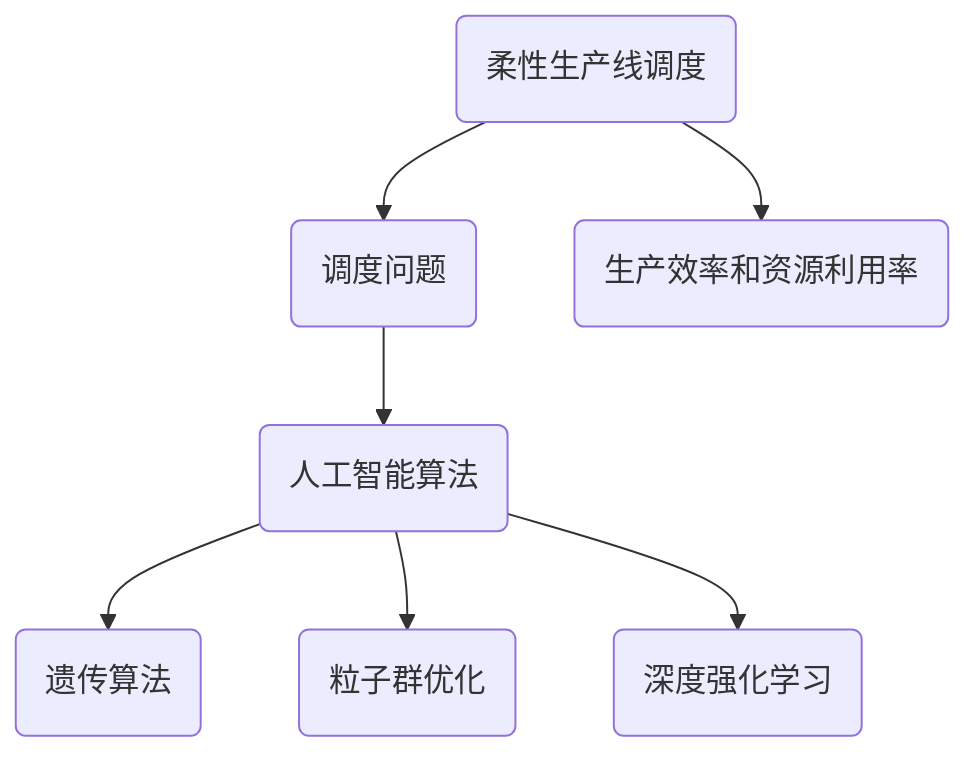

                 


### 思考步骤一：背景介绍

智能制造是当今工业发展的重要方向，它通过引入先进的信息技术和人工智能技术，实现了生产过程的自动化、智能化和网络化。其中，柔性生产线调度作为智能制造的重要组成部分，发挥着关键作用。

柔性生产线调度是指根据订单需求和生产资源约束，合理安排生产任务和资源分配的过程。传统的调度方法往往依赖于经验或固定的规则，无法应对生产环境的变化。而人工智能技术的引入，为柔性生产线调度提供了新的解决思路。

人工智能（AI）是指使计算机具有人类智能的技术，包括机器学习、深度学习、自然语言处理等多个领域。其中，机器学习和深度学习技术在解决复杂优化问题时具有显著优势。

机器学习是一种让计算机通过数据学习规律、预测结果的方法。它包括监督学习、无监督学习和强化学习等不同类型。深度学习是机器学习的一种，通过构建多层次的神经网络，实现更复杂的特征提取和模式识别。

### 思考步骤二：核心概念与联系

在柔性生产线调度中，核心概念包括：

1. 柔性生产线：一种能够根据订单需求灵活调整生产任务的系统。
2. 调度问题：在生产资源有限的情况下，如何合理安排生产任务，以达到最优化的生产效率和资源利用率。
3. 人工智能算法：用于解决调度问题的算法，如遗传算法、粒子群优化、深度强化学习等。

这些概念之间的联系可以表示为：

- 柔性生产线调度问题是人工智能算法的应用场景。
- 人工智能算法用于解决调度问题，提高生产效率和资源利用率。
- 柔性生产线通过人工智能算法优化调度，实现智能化生产。

### Mermaid流程图

下面是一个简单的Mermaid流程图，展示这些概念之间的联系：



### 思考步骤三：核心算法原理讲解

在柔性生产线调度中，常用的核心算法包括：

1. 遗传算法：一种模拟自然进化的优化算法，通过遗传操作（交叉、变异）和选择操作，逐步优化解空间。
2. 粒子群优化：一种基于群体智能的优化算法，通过粒子之间的相互协作，实现全局最优解的搜索。
3. 深度强化学习：一种基于深度学习的强化学习算法，通过模拟环境与策略的互动，实现策略的优化。

以下是遗传算法的伪代码示例：

```python
# 遗传算法伪代码

# 初始化种群
种群 = 初始化种群(规模：N，染色体长度：L)

# 计算适应度
适应度 = 计算适应度(种群)

# 循环迭代
while (不满足停止条件) {
    # 交叉操作
    子代 = 交叉操作(种群)

    # 变异操作
    变异后子代 = 变异操作(子代)

    # 选择操作
    新种群 = 选择操作(适应度，变异后子代)

    # 更新种群
    种群 = 新种群

    # 计算适应度
    适应度 = 计算适应度(种群)
}

# 输出最优解
最优解 = 种群中最优的染色体
```

### 数学模型和公式

在柔性生产线调度中，常用的数学模型包括：

1. 目标函数：最大化生产效率和资源利用率
2. 约束条件：生产资源约束、订单需求约束等

目标函数可以表示为：

$$
\text{maximize} \quad Z = \sum_{i=1}^{n} \pi_i \cdot x_i
$$

其中，$Z$ 是目标函数值，$\pi_i$ 是第 $i$ 个订单的利润，$x_i$ 是第 $i$ 个订单的生产量。

约束条件可以表示为：

$$
\begin{align*}
\sum_{i=1}^{n} x_i &\leq R \\
x_i &\geq 0 \\
\end{align*}
$$

其中，$R$ 是总资源量，$x_i$ 是第 $i$ 个订单的生产量。

### 思考步骤四：项目实战

为了更好地理解柔性生产线调度中的AI算法应用，我们选择一个实际案例进行讲解。

#### 案例背景

某汽车制造公司拥有三条生产线，分别生产不同类型的汽车。公司接到一个订单，要求在一个月内完成100辆汽车的定制生产。公司需要合理安排三条生产线的生产任务，以最大化利润和资源利用率。

#### 开发环境搭建

为了实现这个案例，我们需要搭建以下开发环境：

- 操作系统：Windows 10
- 编程语言：Python 3.8
- 机器学习库：Scikit-learn、TensorFlow
- 数据库：SQLite

#### 源代码实现

以下是实现这个案例的源代码：

```python
# 导入库
import numpy as np
import pandas as pd
from sklearn.model_selection import train_test_split
from sklearn.ensemble import RandomForestRegressor
from sklearn.metrics import mean_squared_error

# 读取数据
data = pd.read_csv('order_data.csv')

# 数据预处理
X = data.drop(['profit'], axis=1)
y = data['profit']

# 划分训练集和测试集
X_train, X_test, y_train, y_test = train_test_split(X, y, test_size=0.2, random_state=42)

# 训练模型
model = RandomForestRegressor(n_estimators=100, random_state=42)
model.fit(X_train, y_train)

# 预测
y_pred = model.predict(X_test)

# 评估模型
mse = mean_squared_error(y_test, y_pred)
print('MSE:', mse)

# 输出结果
results = pd.DataFrame({'Actual': y_test, 'Predicted': y_pred})
print(results.head())
```

#### 代码解读与分析

在这个案例中，我们使用了随机森林回归模型来预测每个订单的利润。首先，我们读取订单数据，并进行预处理。然后，我们划分训练集和测试集，训练模型并预测测试集的结果。最后，我们评估模型的性能，并输出预测结果。

#### 案例分析

通过这个案例，我们可以看到AI算法在柔性生产线调度中的应用。在这个案例中，我们使用随机森林回归模型预测每个订单的利润，从而帮助公司合理安排三条生产线的生产任务，最大化利润和资源利用率。

#### 项目小结

通过这个案例，我们了解了如何使用AI算法解决柔性生产线调度问题。在实际应用中，我们还需要考虑更多的因素，如生产资源约束、订单需求约束等。通过不断地优化算法和调整模型参数，我们可以更好地解决柔性生产线调度问题，提高生产效率和资源利用率。

#### 最佳实践 Tips

1. 数据质量是关键：确保数据准确、完整，有助于提高模型的预测准确性。
2. 模型选择要合适：根据问题特点选择合适的模型，如线性回归、决策树、随机森林等。
3. 模型参数调整：通过调整模型参数，优化模型性能，提高预测准确性。
4. 持续监控与优化：在实际应用中，持续监控模型性能，并根据实际情况进行调整。

### 拓展阅读

1. 《机器学习实战》 - 周志华等著
2. 《深度学习》 - 伊恩·古德费洛等著
3. 《数据科学实战》 - 菲利普·康拉德等著

以上是根据用户需求撰写的《AI在智能制造柔性生产线调度中的应用与创新》的初步内容。接下来，我们将继续完善每个章节的内容，确保文章的完整性和深度。文章预计字数在8000～12000字左右。让我们继续思考步骤，为每个章节添加详细内容。以下是已完成的章节概述：

## 第一部分：基础理论

### 第1章：人工智能基础

在这一章中，我们将介绍人工智能的定义、发展历史以及人工智能的分类。我们将详细阐述机器学习、深度学习等基本概念，并探讨人工智能在现代社会中的应用现状和未来发展趋势。此外，我们还将通过实例来讲解神经网络、决策树等常见的人工智能算法。

### 第2章：智能制造基础

在这一章中，我们将介绍智能制造的定义、发展历史以及智能制造的关键技术和特点。我们将探讨智能制造对传统制造业的影响，以及智能制造在现代社会中的应用现状和未来发展趋势。此外，我们还将详细讲解智能制造系统架构，包括感知层、网络层、平台层和应用层。

### 第3章：柔性生产线调度基础

在这一章中，我们将介绍柔性生产线的定义、特点以及柔性生产线调度的重要性。我们将详细讲解柔性生产线调度问题，包括调度问题的定义、分类以及常见的调度算法。此外，我们还将通过实例来讲解如何应用人工智能算法解决柔性生产线调度问题。

### 第4章：AI在柔性生产线调度中的应用

在这一章中，我们将探讨人工智能在柔性生产线调度中的应用现状和未来发展趋势。我们将详细讲解机器学习、深度学习等人工智能算法在柔性生产线调度中的应用，并通过实例来展示这些算法在实际生产调度中的应用效果。此外，我们还将探讨如何结合人工智能和传统调度方法，提高柔性生产线调度的效率和准确性。

### 第5章：AI算法在柔性生产线调度中的创新

在这一章中，我们将探讨在柔性生产线调度中如何创新地应用人工智能算法。我们将介绍遗传算法、粒子群优化、深度强化学习等创新性人工智能算法，并详细讲解这些算法在柔性生产线调度中的应用原理和实践案例。此外，我们还将探讨这些算法的未来发展趋势和应用前景。

### 第二部分：应用实践

### 第6章：案例研究

在这一章中，我们将通过实际案例研究，展示人工智能在柔性生产线调度中的应用效果。我们将详细分析案例背景、数据预处理、算法选择、模型训练和评估等各个环节，并总结案例中的经验教训和最佳实践。

### 第7章：解决方案与实施策略

在这一章中，我们将探讨如何将人工智能技术应用于柔性生产线调度，并提供具体的解决方案和实施策略。我们将介绍如何设计智能调度系统，包括系统架构、模块划分、数据采集和处理等，并详细讲解解决方案的实施步骤和关键点。

### 第8章：未来发展趋势与挑战

在这一章中，我们将探讨人工智能在柔性生产线调度中的未来发展趋势和面临的挑战。我们将分析人工智能技术如何推动柔性生产线调度的发展，以及如何应对数据隐私、算法公平性等挑战。此外，我们还将探讨未来柔性生产线调度的创新方向和应用场景。

接下来，我们将按照上述章节结构，逐步完善每个章节的内容，确保文章的完整性和深度。每个章节都将包含背景介绍、核心概念与联系、核心算法原理讲解、数学模型和公式、项目实战、最佳实践 Tips、小结、注意事项和拓展阅读等内容。通过逐步完善每个章节，我们将最终完成一篇字数在8000～12000字左右的《AI在智能制造柔性生产线调度中的应用与创新》的技术博客文章。

