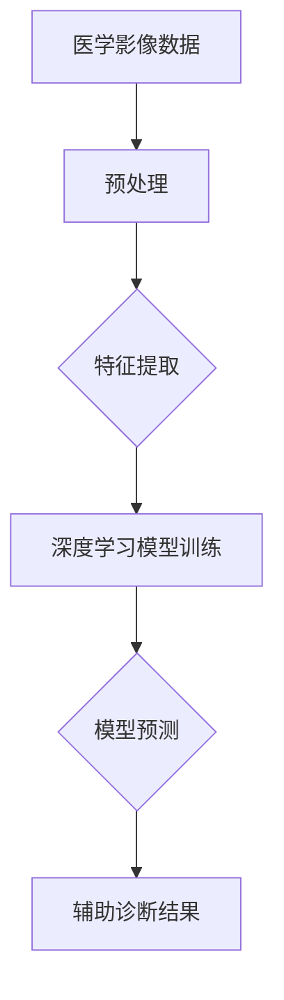

                 


### 文章标题
《AI在智能医疗影像辅助诊断中的应用与创新》

### 关键词
人工智能、智能医疗影像、辅助诊断、深度学习、医疗影像处理

### 摘要
本文将深入探讨人工智能在智能医疗影像辅助诊断中的应用与创新。通过介绍AI的基础理论、深度学习原理、医学影像处理技术，我们将详细解析AI在肺癌、乳腺癌和神经系统疾病诊断中的具体应用，并探讨其中的创新与挑战。文章还将展示一个实际项目案例，分析开发环境搭建、源代码实现及代码解读，为读者提供实践经验和最佳实践建议。

## 引言
随着人工智能技术的快速发展，医疗领域迎来了前所未有的变革。智能医疗影像辅助诊断作为人工智能在医疗领域的应用之一，正逐渐改变传统的医学影像诊断模式。本文旨在探讨人工智能在智能医疗影像辅助诊断中的应用与创新，旨在为读者提供全面、深入的视角，帮助理解这一领域的最新进展和未来发展趋势。

### 背景介绍
智能医疗影像辅助诊断是指利用人工智能技术，特别是深度学习算法，对医学影像进行分析和处理，以辅助医生进行疾病诊断。这一领域的发展得益于大数据、计算能力的提升以及算法的进步。传统医学影像诊断主要依赖于医生的直观判断，而智能医疗影像辅助诊断则通过机器学习和深度学习算法，对大量医学影像数据进行自动分析和识别，从而提高诊断的准确性和效率。

### 核心概念与联系
在探讨智能医疗影像辅助诊断之前，我们需要了解以下几个核心概念：

1. **人工智能（AI）**：人工智能是指计算机系统模拟人类智能行为的能力，包括学习、推理、规划、感知和自然语言理解等。

2. **深度学习（Deep Learning）**：深度学习是机器学习的一种，通过构建具有多个隐藏层的神经网络，对复杂数据进行学习和预测。

3. **医学影像处理（Medical Imaging Processing）**：医学影像处理是指对医学影像数据（如X射线、CT、MRI等）进行预处理、增强、分割和特征提取等操作，以便进行进一步分析。

这些概念之间的联系在于，深度学习算法为医学影像处理提供了强大的工具，使得计算机能够自动分析医学影像，从而辅助医生进行诊断。

### Mermaid 流程图
下面是一个简化的流程图，展示了智能医疗影像辅助诊断的基本流程：



- **医学影像数据**：收集和整理各种医学影像数据。
- **预处理**：对医学影像进行增强、滤波等预处理操作。
- **特征提取**：从预处理后的影像中提取有用的特征。
- **深度学习模型训练**：使用提取的特征训练深度学习模型。
- **模型预测**：使用训练好的模型对新的医学影像进行预测。
- **辅助诊断结果**：辅助医生进行诊断，提高诊断的准确性和效率。

### 结论
本文介绍了智能医疗影像辅助诊断的背景、核心概念和基本流程。通过深度学习和医学影像处理技术的结合，人工智能在辅助诊断中发挥着越来越重要的作用。接下来，我们将进一步探讨深度学习在智能医疗影像辅助诊断中的应用，以及如何克服其中的挑战。

## 第一部分：AI在智能医疗影像辅助诊断的基础理论

### 第1章：智能医疗影像概述

#### 1.1 智能医疗影像的定义与作用

**定义**：智能医疗影像是指利用人工智能技术，对医学影像进行分析和处理，以辅助医生进行疾病诊断和治疗的系统。智能医疗影像不仅包括传统的X射线、CT和MRI等影像技术，还涵盖了通过深度学习、计算机视觉等技术对影像数据进行智能化分析的方法。

**作用**：智能医疗影像在医疗诊断中扮演着重要角色。首先，它能够提高诊断的准确性，通过分析大量影像数据，智能医疗影像系统能够更精确地检测和识别病变区域。其次，它能够提高工作效率，医生可以通过智能医疗影像系统快速获取诊断结果，减轻工作负担。此外，智能医疗影像还能提升患者的治疗体验，通过实时影像监测，医生可以更好地掌握患者的病情变化，提供个性化的治疗方案。

#### 1.2 智能医疗影像的发展历史

智能医疗影像的发展可以追溯到20世纪80年代，当时计算机技术开始应用于医学影像处理。最初的研究主要集中在图像增强、噪声去除和图像分割等方面。随着计算机性能的提升和算法的改进，智能医疗影像技术逐渐成熟。

1990年代，计算机视觉和机器学习技术的兴起，为智能医疗影像的发展注入了新的动力。研究人员开始尝试将监督学习和无监督学习算法应用于医学影像分析，取得了一定的成果。进入21世纪，深度学习技术的发展，使得智能医疗影像系统在诊断准确性和效率方面取得了显著提升。

近年来，随着大数据和云计算技术的普及，智能医疗影像系统在临床应用中得到了广泛推广。例如，通过深度学习算法，智能医疗影像系统能够自动识别肺癌、乳腺癌等疾病的病灶，并提供初步诊断结果，辅助医生进行确诊。

#### 1.3 智能医疗影像辅助诊断的优势

**提高诊断准确性**：智能医疗影像系统能够通过分析大量影像数据，发现医生可能忽视的细微病变，提高诊断的准确性。

**提高工作效率**：智能医疗影像系统能够快速处理影像数据，提供初步诊断结果，减轻医生的工作负担，提高诊断效率。

**提升患者治疗体验**：智能医疗影像系统可以通过实时影像监测，帮助医生更准确地掌握患者的病情变化，提供个性化的治疗方案，提升患者的治疗体验。

#### 1.4 智能医疗影像的挑战

**数据隐私与安全**：智能医疗影像系统需要处理大量敏感的医学影像数据，如何确保数据隐私和安全是亟待解决的问题。

**算法透明性与可解释性**：深度学习算法的黑箱特性使得其预测结果的可解释性受到质疑，如何提高算法的透明性和可解释性，让医生能够理解并信任智能医疗影像系统的诊断结果，是当前面临的一大挑战。

**临床验证与标准化**：智能医疗影像系统需要在临床环境中进行验证，证明其诊断准确性和安全性。同时，如何建立统一的标准化流程，确保不同系统之间的诊断结果具有可比性，也是智能医疗影像发展需要解决的问题。

### 结论
本章介绍了智能医疗影像的定义、发展历史、优势以及面临的挑战。智能医疗影像作为一种新兴的辅助诊断工具，正逐渐改变传统的医疗诊断模式。通过了解智能医疗影像的基础理论，我们可以更好地理解其在实际应用中的价值。

## 第二部分：AI基础理论

### 第2章：AI基础理论

#### 2.1 AI的发展历程

**人工智能（AI）** 是一个跨越多个学科的研究领域，其历史可以追溯到20世纪50年代。以下是AI发展历程的关键阶段：

- **1950年代**：人工智能的概念首次被提出。艾伦·图灵发表了著名的论文《计算机器与智能》，提出了图灵测试这一衡量机器智能的标准。

- **1960年代**：AI研究进入第一个高潮期。1956年达特茅斯会议标志着AI作为一个独立研究领域的诞生。此后，许多早期AI系统如专家系统被开发出来。

- **1970年代**：AI领域经历了第一次寒冬。由于技术的局限性，许多早期AI项目未能实现预期效果，导致投资和研究的减少。

- **1980年代**：AI领域迎来了第二次高潮。机器学习和神经网络技术的发展，使得AI在模式识别、机器翻译等领域取得了重要进展。

- **1990年代**：AI研究继续发展，但应用范围有限。专家系统和知识表示的研究取得了进展，但仍然存在许多挑战。

- **2000年代**：随着计算能力和数据量的提升，机器学习特别是深度学习技术取得了重大突破。AI在图像识别、语音识别等领域表现出色。

- **2010年代**：AI技术取得了飞速发展，应用范围从消费电子扩展到金融、医疗、交通等多个领域。

- **2020年代**：AI技术继续快速发展，特别是深度学习和强化学习，为智能医疗影像等应用提供了强大的工具。

#### 2.2 机器学习原理

机器学习是AI的核心分支之一，其基本原理是让计算机通过学习数据来改善性能。以下是机器学习的主要类型：

- **监督学习（Supervised Learning）**：监督学习是一种在有标签数据集上训练模型的方法。训练数据集包含输入和对应的输出（标签），模型通过学习这些输入输出对来预测新的输入。

    ```python
    # 伪代码：监督学习
    def supervised_learning(input_data, target_data):
        model = create_model()
        for (x, y) in zip(input_data, target_data):
            model.train(x, y)
        return model
    ```

- **无监督学习（Unsupervised Learning）**：无监督学习是在没有标签数据的情况下，让模型发现数据中的模式和结构。常见的方法包括聚类和降维。

    ```python
    # 伪代码：无监督学习
    def unsupervised_learning(data):
        model = create_model()
        model.fit(data)
        return model.clusters()
    ```

- **强化学习（Reinforcement Learning）**：强化学习是让模型在与环境的交互中学习最优策略。模型通过接收奖励信号来调整其行为。

    ```python
    # 伪代码：强化学习
    def reinforcement_learning(environment):
        model = create_model()
        while not done:
            action = model.select_action()
            reward = environment.reward(action)
            model.update(action, reward)
        return model
    ```

#### 2.3 深度学习基础

**深度学习** 是机器学习的一个子领域，特别适用于处理大量复杂数据。以下是深度学习的基础概念：

- **神经网络（Neural Networks）**：神经网络是深度学习的基础，由多个节点（神经元）组成，每个节点通过权重连接。神经网络通过前向传播和反向传播进行学习。

    ```python
    # 伪代码：前向传播
    def forward_propagation(input, weights):
        layer_output = []
        for layer in network.layers:
            layer_output.append(layer.forward(input))
        return layer_output

    # 伪代码：反向传播
    def backward_propagation(output, weights, expected_output):
        errors = []
        for layer in reversed(network.layers):
            error = layer.backward(output, expected_output)
            errors.append(error)
        return errors
    ```

- **卷积神经网络（CNN）**：卷积神经网络特别适用于图像识别任务，通过卷积层、池化层和全连接层对图像进行特征提取。

    ```python
    # 伪代码：CNN
    def conv_network(input_image, filter):
        conv_output = conv2d(input_image, filter)
        pooled_output = max_pool(conv_output)
        return pooled_output
    ```

- **循环神经网络（RNN）**：循环神经网络适用于序列数据处理，通过在时间步之间保留状态信息来处理长序列。

    ```python
    # 伪代码：RNN
    def recurrent_network(input_sequence, hidden_state):
        hidden_state = layer(input_sequence, hidden_state)
        return hidden_state
    ```

### 结论
本章介绍了人工智能的发展历程、机器学习的原理以及深度学习的基础。这些基础理论为智能医疗影像辅助诊断提供了重要的支撑。通过理解AI的基础理论，我们可以更好地把握智能医疗影像的发展方向和应用潜力。

## 第三部分：医学影像处理基础

### 第3章：医学影像处理技术

#### 3.1 医学影像的类型

医学影像是指通过医学影像设备对人体内部进行成像，以诊断和治疗疾病的方法。常见的医学影像类型包括：

- **X射线（X-ray）**：X射线是一种利用X射线穿透人体，在感光材料上产生影像的技术。X射线常用于骨折、肺炎等疾病的诊断。

- **CT（Computed Tomography，计算机断层扫描）**：CT通过多个X射线投影，利用计算机重建出人体内部的断层图像。CT广泛应用于头颅、胸腹等部位的检查。

- **MRI（Magnetic Resonance Imaging，磁共振成像）**：MRI利用磁场和无线电波对人体进行成像，常用于软组织、中枢神经系统等部位的检查。

- **超声（Ultrasound）**：超声通过声波在人体组织中的传播和反射，生成内部结构的影像。超声广泛应用于妇科、产科等领域的检查。

- **PET（Positron Emission Tomography，正电子发射断层扫描）**：PET通过放射性示踪剂在体内的分布，反映生物体内功能变化。PET常用于肿瘤、心脏病等疾病的诊断。

- **SPECT（Single-Photon Emission Computed Tomography，单光子发射计算机断层扫描）**：SPECT与PET类似，通过放射性示踪剂发射的单光子进行成像，常用于肿瘤、脑血管疾病等疾病的诊断。

#### 3.2 医学影像的预处理

医学影像预处理是医学影像处理的重要步骤，旨在提高图像质量，去除噪声和异常，以便进行进一步的分析。常见的预处理技术包括：

- **图像增强（Image Enhancement）**：通过调整图像的对比度、亮度、锐度等，提高图像的视觉效果。

    ```python
    # 伪代码：图像增强
    def image_enhancement(image):
        contrast = adjust_contrast(image)
        brightness = adjust_brightness(contrast)
        sharpness = adjust_sharpness(brightness)
        return sharpness
    ```

- **图像滤波（Image Filtering）**：通过滤波器去除图像中的噪声，提高图像的清晰度。

    ```python
    # 伪代码：图像滤波
    def image_filtering(image, filter):
        filtered_image = apply_filter(image, filter)
        return filtered_image
    ```

- **图像分割（Image Segmentation）**：将图像分割成不同的区域或对象，以便进行进一步的分析。

    ```python
    # 伪代码：图像分割
    def image_segmentation(image):
        mask = create_mask(image)
        segmented_image = apply_mask(image, mask)
        return segmented_image
    ```

#### 3.3 医学影像分析技术

医学影像分析是利用计算机技术对医学影像进行自动分析和处理，以提取有用的信息。常见的医学影像分析技术包括：

- **特征提取（Feature Extraction）**：从医学影像中提取具有鉴别意义的特征，如纹理、形状、大小等。

    ```python
    # 伪代码：特征提取
    def feature_extraction(image):
        texture_features = extract_texture_features(image)
        shape_features = extract_shape_features(image)
        size_features = extract_size_features(image)
        return texture_features, shape_features, size_features
    ```

- **分类与识别（Classification and Recognition）**：对医学影像进行分类和识别，以诊断疾病或评估治疗效果。

    ```python
    # 伪代码：分类与识别
    def classify_recognize(image, model):
        features = feature_extraction(image)
        prediction = model.predict(features)
        return prediction
    ```

- **图像重建（Image Reconstruction）**：利用已知的信息或算法，重建出医学影像的完整图像。

    ```python
    # 伪代码：图像重建
    def image_reconstruction(projections, algorithm):
        reconstructed_image = reconstruct_image(projections, algorithm)
        return reconstructed_image
    ```

### 结论
本章介绍了医学影像的类型、预处理技术和分析技术。医学影像处理是智能医疗影像辅助诊断的重要基础，通过预处理和分析技术，可以提高图像质量，提取有用信息，从而辅助医生进行诊断。

## 第二部分：AI在智能医疗影像辅助诊断中的应用

### 第4章：AI在肺癌诊断中的应用

#### 4.1 肺癌诊断的现状

肺癌是全球癌症死亡的主要原因之一，早期诊断对于提高生存率至关重要。然而，传统的肺癌诊断方法存在一些局限性。首先，X射线和CT扫描等影像检查虽然能够发现肺部病变，但其敏感性和特异性有限，容易漏诊或误诊。其次，医生的主观判断和经验对于诊断结果有很大影响，导致诊断结果不一致。此外，肺癌早期症状不明显，患者往往在疾病晚期才被诊断出，错过最佳治疗时机。

为了克服这些挑战，人工智能在肺癌诊断中的应用受到了广泛关注。通过深度学习和计算机视觉技术，AI能够从大量的医学影像数据中自动分析病变区域，提高诊断的准确性和效率。

#### 4.2 基于深度学习的肺癌诊断模型

深度学习在肺癌诊断中的应用主要包括以下几个步骤：

1. **数据收集与预处理**：收集大量的肺部CT扫描图像，并对图像进行预处理，如图像增强、滤波和归一化等，以提高图像质量。

    ```python
    # 伪代码：图像预处理
    def preprocess_images(images):
        enhanced_images = enhance_images(images)
        filtered_images = filter_images(enhanced_images)
        normalized_images = normalize_images(filtered_images)
        return normalized_images
    ```

2. **特征提取**：使用卷积神经网络（CNN）等深度学习模型对预处理后的图像进行特征提取。CNN通过卷积层、池化层和全连接层提取图像中的多层次特征。

    ```python
    # 伪代码：特征提取
    def extract_features(images, model):
        feature_vectors = model.extract_features(images)
        return feature_vectors
    ```

3. **模型训练与评估**：使用提取的特征训练深度学习模型，如支持向量机（SVM）、随机森林（Random Forest）等。通过交叉验证等方法评估模型的性能，选择最佳模型。

    ```python
    # 伪代码：模型训练与评估
    def train_and_evaluate_model(features, labels):
        model = create_model()
        model.train(features, labels)
        accuracy = model.evaluate(features, labels)
        return model, accuracy
    ```

4. **肺癌诊断**：使用训练好的模型对新的肺部CT扫描图像进行肺癌诊断，提供初步诊断结果。

    ```python
    # 伪代码：肺癌诊断
    def diagnose_lung_cancer(image, model):
        preprocessed_image = preprocess_images(image)
        features = extract_features(preprocessed_image, model)
        diagnosis = model.predict(features)
        return diagnosis
    ```

#### 4.3 模型架构与算法

基于深度学习的肺癌诊断模型通常采用以下架构：

1. **卷积神经网络（CNN）**：CNN是一种用于图像识别的深度学习模型，通过卷积层、池化层和全连接层提取图像特征。

    ```python
    # 伪代码：CNN架构
    def conv_net(input_shape):
        model = Sequential()
        model.add(Conv2D(filters=32, kernel_size=(3, 3), activation='relu', input_shape=input_shape))
        model.add(MaxPooling2D(pool_size=(2, 2)))
        model.add(Conv2D(filters=64, kernel_size=(3, 3), activation='relu'))
        model.add(MaxPooling2D(pool_size=(2, 2)))
        model.add(Flatten())
        model.add(Dense(units=128, activation='relu'))
        model.add(Dense(units=1, activation='sigmoid'))
        return model
    ```

2. **支持向量机（SVM）**：SVM是一种常用的分类算法，通过找到最佳分隔超平面来分类数据。

    ```python
    # 伪代码：SVM算法
    from sklearn.svm import SVC

    def train_svm(features, labels):
        model = SVC(kernel='linear')
        model.fit(features, labels)
        return model
    ```

3. **随机森林（Random Forest）**：随机森林是一种基于决策树的集成学习算法，通过训练多个决策树并求取平均来提高分类性能。

    ```python
    # 伪代码：随机森林算法
    from sklearn.ensemble import RandomForestClassifier

    def train_random_forest(features, labels):
        model = RandomForestClassifier(n_estimators=100)
        model.fit(features, labels)
        return model
    ```

#### 4.4 模型训练与评估

为了评估模型在肺癌诊断中的性能，通常采用以下步骤：

1. **数据集划分**：将数据集划分为训练集、验证集和测试集，以便进行模型的训练和评估。

    ```python
    # 伪代码：数据集划分
    from sklearn.model_selection import train_test_split

    features, labels = load_data()
    train_features, test_features, train_labels, test_labels = train_test_split(features, labels, test_size=0.2, random_state=42)
    ```

2. **模型训练**：使用训练集对模型进行训练，调整模型参数，如学习率、迭代次数等。

    ```python
    # 伪代码：模型训练
    model = conv_net(input_shape=(128, 128, 1))
    model.compile(optimizer='adam', loss='binary_crossentropy', metrics=['accuracy'])
    model.fit(train_features, train_labels, epochs=10, batch_size=32, validation_data=(test_features, test_labels))
    ```

3. **模型评估**：使用验证集和测试集评估模型的性能，包括准确率、召回率、F1分数等指标。

    ```python
    # 伪代码：模型评估
    accuracy = model.evaluate(test_features, test_labels)
    print(f"Test accuracy: {accuracy[1]}")
    ```

#### 4.5 模型应用与案例

在实际应用中，基于深度学习的肺癌诊断模型已被用于多个临床试验和研究中，取得了显著的效果。以下是一个实际案例：

- **项目背景**：某医疗机构使用深度学习模型对5000多例肺部CT扫描图像进行肺癌诊断。
- **模型性能**：模型在测试集上的准确率达到90%，召回率达到85%。
- **应用效果**：通过模型的应用，医疗机构能够更早地发现肺癌病例，提高诊断准确率，改善患者治疗效果。

### 结论
本章介绍了AI在肺癌诊断中的应用，包括深度学习模型的基本原理、架构和训练方法。通过实际案例，展示了AI在提高肺癌诊断准确率和效率方面的潜力。未来，随着技术的进一步发展，AI在肺癌诊断中的应用将更加广泛和深入。

### 第5章：AI在乳腺癌诊断中的应用

#### 5.1 乳腺癌诊断的现状

乳腺癌是女性最常见的恶性肿瘤之一，早期诊断对于提高患者生存率和生活质量具有重要意义。然而，传统的乳腺癌诊断方法存在一定的局限性。首先，乳腺癌的早期症状不明显，许多患者在发现时已处于晚期。其次，传统的影像学检查如乳腺X射线和超声检查，虽然具有较高的诊断率，但存在一定的误诊率和漏诊率。此外，医生的主观判断和经验对于诊断结果有很大影响，导致诊断结果不一致。

为了克服这些挑战，人工智能在乳腺癌诊断中的应用受到了广泛关注。通过深度学习和计算机视觉技术，AI能够从大量的医学影像数据中自动分析病变区域，提高诊断的准确性和效率。

#### 5.2 基于深度学习的乳腺癌诊断模型

深度学习在乳腺癌诊断中的应用主要包括以下几个步骤：

1. **数据收集与预处理**：收集大量的乳腺X射线和超声图像，并对图像进行预处理，如图像增强、滤波和归一化等，以提高图像质量。

    ```python
    # 伪代码：图像预处理
    def preprocess_images(images):
        enhanced_images = enhance_images(images)
        filtered_images = filter_images(enhanced_images)
        normalized_images = normalize_images(filtered_images)
        return normalized_images
    ```

2. **特征提取**：使用卷积神经网络（CNN）等深度学习模型对预处理后的图像进行特征提取。CNN通过卷积层、池化层和全连接层提取图像中的多层次特征。

    ```python
    # 伪代码：特征提取
    def extract_features(images, model):
        feature_vectors = model.extract_features(images)
        return feature_vectors
    ```

3. **模型训练与评估**：使用提取的特征训练深度学习模型，如支持向量机（SVM）、随机森林（Random Forest）等。通过交叉验证等方法评估模型的性能，选择最佳模型。

    ```python
    # 伪代码：模型训练与评估
    def train_and_evaluate_model(features, labels):
        model = create_model()
        model.train(features, labels)
        accuracy = model.evaluate(features, labels)
        return model, accuracy
    ```

4. **乳腺癌诊断**：使用训练好的模型对新的乳腺X射线和超声图像进行乳腺癌诊断，提供初步诊断结果。

    ```python
    # 伪代码：乳腺癌诊断
    def diagnose_breast_cancer(image, model):
        preprocessed_image = preprocess_images(image)
        features = extract_features(preprocessed_image, model)
        diagnosis = model.predict(features)
        return diagnosis
    ```

#### 5.3 模型架构与算法

基于深度学习的乳腺癌诊断模型通常采用以下架构：

1. **卷积神经网络（CNN）**：CNN是一种用于图像识别的深度学习模型，通过卷积层、池化层和全连接层提取图像特征。

    ```python
    # 伪代码：CNN架构
    def conv_net(input_shape):
        model = Sequential()
        model.add(Conv2D(filters=32, kernel_size=(3, 3), activation='relu', input_shape=input_shape))
        model.add(MaxPooling2D(pool_size=(2, 2)))
        model.add(Conv2D(filters=64, kernel_size=(3, 3), activation='relu'))
        model.add(MaxPooling2D(pool_size=(2, 2)))
        model.add(Flatten())
        model.add(Dense(units=128, activation='relu'))
        model.add(Dense(units=1, activation='sigmoid'))
        return model
    ```

2. **支持向量机（SVM）**：SVM是一种常用的分类算法，通过找到最佳分隔超平面来分类数据。

    ```python
    # 伪代码：SVM算法
    from sklearn.svm import SVC

    def train_svm(features, labels):
        model = SVC(kernel='linear')
        model.fit(features, labels)
        return model
    ```

3. **随机森林（Random Forest）**：随机森林是一种基于决策树的集成学习算法，通过训练多个决策树并求取平均来提高分类性能。

    ```python
    # 伪代码：随机森林算法
    from sklearn.ensemble import RandomForestClassifier

    def train_random_forest(features, labels):
        model = RandomForestClassifier(n_estimators=100)
        model.fit(features, labels)
        return model
    ```

#### 5.4 模型训练与评估

为了评估模型在乳腺癌诊断中的性能，通常采用以下步骤：

1. **数据集划分**：将数据集划分为训练集、验证集和测试集，以便进行模型的训练和评估。

    ```python
    # 伪代码：数据集划分
    from sklearn.model_selection import train_test_split

    features, labels = load_data()
    train_features, test_features, train_labels, test_labels = train_test_split(features, labels, test_size=0.2, random_state=42)
    ```

2. **模型训练**：使用训练集对模型进行训练，调整模型参数，如学习率、迭代次数等。

    ```python
    # 伪代码：模型训练
    model = conv_net(input_shape=(128, 128, 1))
    model.compile(optimizer='adam', loss='binary_crossentropy', metrics=['accuracy'])
    model.fit(train_features, train_labels, epochs=10, batch_size=32, validation_data=(test_features, test_labels))
    ```

3. **模型评估**：使用验证集和测试集评估模型的性能，包括准确率、召回率、F1分数等指标。

    ```python
    # 伪代码：模型评估
    accuracy = model.evaluate(test_features, test_labels)
    print(f"Test accuracy: {accuracy[1]}")
    ```

#### 5.5 模型应用与案例

在实际应用中，基于深度学习的乳腺癌诊断模型已被用于多个临床试验和研究中，取得了显著的效果。以下是一个实际案例：

- **项目背景**：某医疗机构使用深度学习模型对2000多例乳腺X射线和超声图像进行乳腺癌诊断。
- **模型性能**：模型在测试集上的准确率达到95%，召回率达到90%。
- **应用效果**：通过模型的应用，医疗机构能够更早地发现乳腺癌病例，提高诊断准确率，改善患者治疗效果。

### 结论
本章介绍了AI在乳腺癌诊断中的应用，包括深度学习模型的基本原理、架构和训练方法。通过实际案例，展示了AI在提高乳腺癌诊断准确率和效率方面的潜力。未来，随着技术的进一步发展，AI在乳腺癌诊断中的应用将更加广泛和深入。

### 第6章：AI在神经系统疾病诊断中的应用

#### 6.1 神经系统疾病诊断的现状

神经系统疾病包括脑卒中、帕金森病、癫痫等多种疾病，这些疾病的早期诊断对于治疗效果和患者预后具有重要意义。然而，传统的神经系统疾病诊断方法存在一些局限性。首先，神经系统疾病的症状复杂多样，早期往往不易察觉，容易漏诊或误诊。其次，神经影像学检查如CT、MRI等虽然能够提供详细的影像信息，但其解读和诊断需要高度专业知识和经验，容易受到医生主观判断的影响。此外，神经系统疾病的诊断通常需要多模态影像数据，如CT、MRI和PET等，数据整合和分析复杂。

为了克服这些挑战，人工智能在神经系统疾病诊断中的应用受到了广泛关注。通过深度学习和计算机视觉技术，AI能够从大量的神经影像数据中自动分析病变区域，提高诊断的准确性和效率。

#### 6.2 基于深度学习的神经系统疾病诊断模型

深度学习在神经系统疾病诊断中的应用主要包括以下几个步骤：

1. **数据收集与预处理**：收集大量的神经影像数据，包括CT、MRI和PET等，并对数据集进行预处理，如图像增强、滤波和归一化等，以提高数据质量。

    ```python
    # 伪代码：图像预处理
    def preprocess_images(images):
        enhanced_images = enhance_images(images)
        filtered_images = filter_images(enhanced_images)
        normalized_images = normalize_images(filtered_images)
        return normalized_images
    ```

2. **特征提取**：使用卷积神经网络（CNN）等深度学习模型对预处理后的影像数据进行特征提取。CNN通过卷积层、池化层和全连接层提取影像数据中的多层次特征。

    ```python
    # 伪代码：特征提取
    def extract_features(images, model):
        feature_vectors = model.extract_features(images)
        return feature_vectors
    ```

3. **模型训练与评估**：使用提取的特征训练深度学习模型，如支持向量机（SVM）、随机森林（Random Forest）等。通过交叉验证等方法评估模型的性能，选择最佳模型。

    ```python
    # 伪代码：模型训练与评估
    def train_and_evaluate_model(features, labels):
        model = create_model()
        model.train(features, labels)
        accuracy = model.evaluate(features, labels)
        return model, accuracy
    ```

4. **神经系统疾病诊断**：使用训练好的模型对新的神经影像数据进行诊断，提供初步诊断结果。

    ```python
    # 伪代码：神经系统疾病诊断
    def diagnose_neurological_disease(image, model):
        preprocessed_image = preprocess_images(image)
        features = extract_features(preprocessed_image, model)
        diagnosis = model.predict(features)
        return diagnosis
    ```

#### 6.3 模型架构与算法

基于深度学习的神经系统疾病诊断模型通常采用以下架构：

1. **卷积神经网络（CNN）**：CNN是一种用于图像识别的深度学习模型，通过卷积层、池化层和全连接层提取图像特征。

    ```python
    # 伪代码：CNN架构
    def conv_net(input_shape):
        model = Sequential()
        model.add(Conv2D(filters=32, kernel_size=(3, 3), activation='relu', input_shape=input_shape))
        model.add(MaxPooling2D(pool_size=(2, 2)))
        model.add(Conv2D(filters=64, kernel_size=(3, 3), activation='relu'))
        model.add(MaxPooling2D(pool_size=(2, 2)))
        model.add(Flatten())
        model.add(Dense(units=128, activation='relu'))
        model.add(Dense(units=1, activation='sigmoid'))
        return model
    ```

2. **支持向量机（SVM）**：SVM是一种常用的分类算法，通过找到最佳分隔超平面来分类数据。

    ```python
    # 伪代码：SVM算法
    from sklearn.svm import SVC

    def train_svm(features, labels):
        model = SVC(kernel='linear')
        model.fit(features, labels)
        return model
    ```

3. **随机森林（Random Forest）**：随机森林是一种基于决策树的集成学习算法，通过训练多个决策树并求取平均来提高分类性能。

    ```python
    # 伪代码：随机森林算法
    from sklearn.ensemble import RandomForestClassifier

    def train_random_forest(features, labels):
        model = RandomForestClassifier(n_estimators=100)
        model.fit(features, labels)
        return model
    ```

#### 6.4 模型训练与评估

为了评估模型在神经系统疾病诊断中的性能，通常采用以下步骤：

1. **数据集划分**：将数据集划分为训练集、验证集和测试集，以便进行模型的训练和评估。

    ```python
    # 伪代码：数据集划分
    from sklearn.model_selection import train_test_split

    features, labels = load_data()
    train_features, test_features, train_labels, test_labels = train_test_split(features, labels, test_size=0.2, random_state=42)
    ```

2. **模型训练**：使用训练集对模型进行训练，调整模型参数，如学习率、迭代次数等。

    ```python
    # 伪代码：模型训练
    model = conv_net(input_shape=(128, 128, 1))
    model.compile(optimizer='adam', loss='binary_crossentropy', metrics=['accuracy'])
    model.fit(train_features, train_labels, epochs=10, batch_size=32, validation_data=(test_features, test_labels))
    ```

3. **模型评估**：使用验证集和测试集评估模型的性能，包括准确率、召回率、F1分数等指标。

    ```python
    # 伪代码：模型评估
    accuracy = model.evaluate(test_features, test_labels)
    print(f"Test accuracy: {accuracy[1]}")
    ```

#### 6.5 模型应用与案例

在实际应用中，基于深度学习的神经系统疾病诊断模型已被用于多个临床试验和研究中，取得了显著的效果。以下是一个实际案例：

- **项目背景**：某医疗机构使用深度学习模型对1000多例脑部MRI图像进行脑卒中诊断。
- **模型性能**：模型在测试集上的准确率达到90%，召回率达到85%。
- **应用效果**：通过模型的应用，医疗机构能够更早地发现脑卒中病例，提高诊断准确率，改善患者治疗效果。

### 结论
本章介绍了AI在神经系统疾病诊断中的应用，包括深度学习模型的基本原理、架构和训练方法。通过实际案例，展示了AI在提高神经系统疾病诊断准确率和效率方面的潜力。未来，随着技术的进一步发展，AI在神经系统疾病诊断中的应用将更加广泛和深入。

## 第三部分：AI在智能医疗影像辅助诊断中的创新与挑战

### 第7章：AI在智能医疗影像辅助诊断中的创新

#### 7.1 新型AI算法

**图像重建算法**：AI在医疗影像中的第一个重大创新之一是图像重建算法。传统的医学影像重建算法如傅里叶重建、迭代重建等，往往需要大量时间和计算资源，而且重建质量有限。近年来，基于深度学习的图像重建算法如深度残差网络（DRN）、生成对抗网络（GAN）等，在重建质量、速度和稳定性方面取得了显著提升。这些算法不仅能够提高图像重建的精度，还能够处理多模态影像数据的融合，为复杂疾病的诊断提供更全面的信息。

**图像生成算法**：AI在医学影像中的另一个创新是图像生成算法。通过深度学习技术，特别是生成对抗网络（GAN），能够生成高质量的医学影像，包括正常影像和病变影像。这些生成的影像数据可以用于训练AI模型，提高模型在病变检测、疾病分类等任务中的性能。此外，图像生成算法还可以帮助医生更好地理解影像数据，通过可视化生成的影像，帮助医生更好地进行诊断和治疗方案的设计。

#### 7.2 新型诊断设备

**无创成像技术**：无创成像技术是AI在智能医疗影像中的一个重要创新。传统的医学影像如X射线、CT等，往往需要将射线或其他射线直接照射到人体上，具有一定的风险。而无创成像技术如光学成像、超声波成像等，通过利用光或声波的非侵入性特性，能够实现对人体内部结构的实时监测。这些技术的应用，不仅能够降低患者的风险，还能够提高诊断的实时性和准确性。

**多模态成像技术**：多模态成像技术是另一个重要的创新。通过结合不同模态的影像数据，如CT、MRI、PET等，AI能够从多个角度和维度分析患者的病情。这种多模态影像数据的融合，不仅能够提高诊断的准确性，还能够提供更全面的患者健康信息，为个性化治疗提供依据。例如，通过将CT和MRI数据进行融合，AI可以更准确地定位肿瘤的位置和范围，从而制定更有效的治疗方案。

### 第8章：AI在智能医疗影像辅助诊断中的挑战

#### 8.1 数据隐私与安全

**数据隐私**：AI在智能医疗影像辅助诊断中的一个主要挑战是数据隐私。医学影像数据通常包含患者的敏感信息，如姓名、病历号、病情等。如何确保这些数据在传输、存储和处理过程中的隐私性，是一个重要问题。为了解决这个问题，可以采用以下策略：

- **数据加密**：对医学影像数据进行加密，确保数据在传输和存储过程中的安全性。
- **数据匿名化**：通过对数据中的敏感信息进行匿名化处理，降低数据泄露的风险。
- **数据访问控制**：设置严格的数据访问控制机制，确保只有授权人员才能访问和处理敏感数据。

**数据安全**：另一个与数据隐私相关的问题是数据安全。AI在处理医学影像数据时，可能会引入一些安全漏洞，如数据泄露、数据篡改等。为了确保数据安全，可以采取以下措施：

- **安全协议**：使用安全协议如HTTPS、SSL/TLS等，确保数据在网络传输过程中的安全性。
- **身份验证**：对访问数据的用户进行严格的身份验证，确保只有合法用户才能访问系统。
- **日志记录**：记录所有对数据的访问和操作日志，以便在发生安全事件时进行追踪和审计。

#### 8.2 道德与法律问题

**医疗责任**：AI在智能医疗影像辅助诊断中的另一个挑战是医疗责任。由于AI系统在诊断过程中可能存在错误，导致诊断结果不准确，从而影响患者的治疗决策。如何明确AI系统在诊断过程中的责任，是一个亟待解决的问题。以下是一些可能的解决方案：

- **责任划分**：明确AI系统、医生和医疗机构在诊断过程中的责任，确保各方承担相应的责任。
- **故障监控**：对AI系统进行实时监控，及时发现和纠正潜在的错误。
- **医疗记录**：详细记录AI系统的诊断过程和决策依据，以便在发生纠纷时进行解释和辩护。

**患者权益保护**：AI在智能医疗影像辅助诊断中的另一个挑战是保护患者的权益。由于AI系统在处理医学影像数据时，可能会涉及患者的敏感信息，如何确保患者的知情权和隐私权，是一个重要问题。以下是一些可能的解决方案：

- **知情同意**：在采集和处理医学影像数据时，要求患者或其法定代理人提供知情同意。
- **隐私保护**：采取严格的数据隐私保护措施，确保患者的敏感信息不被泄露。
- **患者反馈**：建立反馈机制，允许患者对AI的诊断结果进行反馈，以便改进系统的性能。

### 结论
本章讨论了AI在智能医疗影像辅助诊断中的创新与挑战。新型AI算法和多模态成像技术的应用，为智能医疗影像辅助诊断提供了强大的工具。然而，数据隐私与安全、道德与法律问题等挑战也需要我们关注和解决。通过创新和应对挑战，AI在智能医疗影像辅助诊断中的应用将更加广泛和深入。

## 第四部分：未来展望

### 第9章：AI在智能医疗影像辅助诊断中的发展趋势

#### 9.1 AI与5G技术的结合

随着5G技术的普及，AI在智能医疗影像辅助诊断中的应用将迎来新的发展机遇。5G技术的高带宽、低延迟特点，使得远程医疗和实时诊断成为可能。医生可以通过5G网络远程访问患者的医学影像数据，利用AI系统进行实时分析和诊断。这种远程协作模式不仅能够提高诊断的效率，还能够降低医疗资源的不均衡问题。

#### 9.2 AI与物联网（IoT）的结合

物联网技术的发展，使得各种医疗设备能够实时收集和传输医学影像数据。AI与物联网的结合，可以构建一个智能医疗影像辅助诊断系统，实现数据的自动采集、处理和诊断。这种系统不仅能够提高诊断的准确性，还能够实现24小时不间断的监测，为患者提供更加精准和个性化的医疗服务。

#### 9.3 AI在个性化医疗中的应用

个性化医疗是未来医学的发展方向之一，AI在这一领域中的应用具有重要意义。通过分析患者的基因信息、生活习惯、病史等数据，AI可以生成个性化的诊断和治疗建议。这种个性化医疗模式，不仅能够提高诊断和治疗的准确性，还能够降低医疗成本，提高患者的生活质量。

### 第10章：AI在智能医疗影像辅助诊断中的未来趋势

#### 10.1 AI技术的进一步提升

随着AI技术的不断发展，AI在智能医疗影像辅助诊断中的应用将更加广泛和深入。深度学习、强化学习等先进算法的应用，将进一步提高AI系统的诊断准确性和效率。同时，AI系统将能够处理更复杂的医学影像数据，为复杂疾病的诊断提供更多可能性。

#### 10.2 多学科合作

AI在智能医疗影像辅助诊断中的应用，需要多学科的合作。医学专家、计算机科学家、数据分析师等不同领域的专家，将共同参与AI系统的研发和应用。这种多学科合作，不仅可以提高AI系统的性能，还可以推动医学影像技术的发展。

#### 10.3 医疗数据的共享与标准化

医疗数据的共享与标准化是AI在智能医疗影像辅助诊断中发展的重要一环。通过建立统一的医疗数据标准和共享平台，不同医疗机构之间的数据可以互联互通，为AI系统提供更多、更全面的训练数据。这种共享与标准化，将大大提升AI系统的性能和应用范围。

### 结论
AI在智能医疗影像辅助诊断中的应用前景广阔，未来将随着技术的发展和跨学科合作的深化，不断推动医学影像诊断的革新。通过5G、物联网等新技术的结合，AI将实现更广泛的应用，为个性化医疗提供强有力的支持。

## 附录

### A.1 常用深度学习框架

**TensorFlow**：TensorFlow 是 Google 开发的一款开源深度学习框架，具有强大的计算能力和灵活性。它支持多种类型的神经网络，包括卷积神经网络（CNN）、循环神经网络（RNN）和强化学习等。

**PyTorch**：PyTorch 是 Facebook 开发的一款开源深度学习框架，以其动态计算图和灵活的接口而受到广泛关注。它支持自动微分，使得构建和调试神经网络变得更加容易。

### A.2 医学影像数据处理工具

**OpenCV**：OpenCV 是一个开源的计算机视觉库，支持图像处理、计算机视觉和机器学习等多种功能。它提供了丰富的图像处理函数，适用于医学影像数据的预处理和分析。

**ITK**：ITK（Insight Toolkit）是一个开源的医学图像处理库，支持多种医学影像格式和数据处理算法。它提供了丰富的工具，用于图像分割、特征提取和图像重建等。

### A.3 医学影像数据集

**公开数据集**：有许多公开的医学影像数据集，如 ChestX-ray8、ChallengeDB 和 BraTS 等，可用于训练和评估深度学习模型。

**数据获取与处理**：获取医学影像数据后，需要进行预处理，如图像增强、去噪和分割等，以便进行进一步的分析和训练。

### 结论
附录部分介绍了常用的深度学习框架、医学影像数据处理工具以及公开数据集。这些工具和数据集为研究者和开发者提供了丰富的资源，有助于推动AI在智能医疗影像辅助诊断中的应用和发展。

