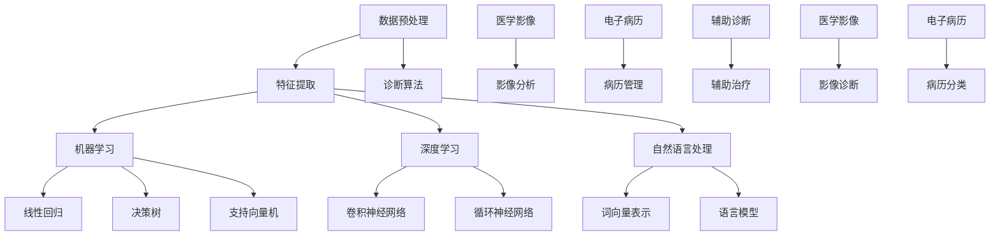

                 


### 第1章 引言

#### 1.1 智能医疗与AI技术

智能医疗是指利用人工智能（AI）技术，实现医疗领域的自动化、智能化和信息化，以提高医疗质量和效率。随着AI技术的发展，其在医疗领域的应用越来越广泛，尤其在智能医疗诊断系统中的应用，更是引发了医疗行业的革命。

AI技术包括机器学习、深度学习、自然语言处理等。这些技术能够处理和分析大量医疗数据，从中提取有价值的信息，辅助医生进行诊断和治疗。例如，深度学习技术可以用于医学影像的自动识别和分析，自然语言处理技术可以用于电子病历的自动整理和分类。

#### 1.2 AI在智能医疗诊断系统中的作用

AI在智能医疗诊断系统中扮演着至关重要的角色。它可以实现以下功能：

1. **辅助诊断**：通过分析患者的病历、检查报告等数据，AI系统可以提供诊断建议，帮助医生更快速、准确地诊断疾病。
2. **辅助治疗**：AI系统可以根据患者的病情，提供个性化的治疗方案，优化治疗效果。
3. **医学影像分析**：AI技术可以自动识别医学影像中的病变区域，辅助医生进行病变的定位和诊断。
4. **电子病历管理**：AI技术可以自动整理和分类电子病历，提高病历管理的效率。

#### 1.3 本书结构

本书旨在深入探讨AI在智能医疗诊断系统中的应用与创新。全书共分为九章，结构如下：

- **第1章 引言**：介绍智能医疗和AI技术的基本概念。
- **第2章 AI基础**：介绍AI的核心技术，包括机器学习、深度学习和自然语言处理。
- **第3章 智能医疗诊断系统架构**：介绍智能医疗诊断系统的基本架构。
- **第4章 数据预处理与特征提取**：介绍数据预处理和特征提取的方法。
- **第5章 诊断算法应用**：介绍常用的诊断算法及其应用。
- **第6章 AI在医学影像诊断中的应用**：介绍AI在医学影像诊断中的应用。
- **第7章 AI在电子病历中的应用**：介绍AI在电子病历管理中的应用。
- **第8章 AI在智能医疗诊断系统中的创新**：探讨AI在智能医疗诊断系统中的创新应用。
- **第9章 总结与展望**：总结全书内容，展望未来发展趋势。

通过本书的阅读，读者将能够全面了解AI在智能医疗诊断系统中的应用和创新，掌握相关技术和方法，为实际应用提供有力支持。

### 1.4 关键词

- 智能医疗
- 人工智能
- 机器学习
- 深度学习
- 自然语言处理
- 医学影像诊断
- 电子病历

### 1.5 摘要

本文系统介绍了AI在智能医疗诊断系统中的应用与创新。首先，我们探讨了智能医疗和AI技术的基本概念，并分析了AI在智能医疗诊断系统中的作用。接着，我们介绍了AI的核心技术，包括机器学习、深度学习和自然语言处理。随后，我们详细介绍了智能医疗诊断系统的架构，包括数据预处理与特征提取、诊断算法应用、医学影像诊断和电子病历管理。此外，我们还探讨了AI在智能医疗诊断系统中的创新应用，并总结展望了未来的发展趋势。本文旨在为读者提供全面、深入的了解，助力实际应用。

---

**第2章 AI基础**

#### 2.1 机器学习基础

机器学习是AI的核心技术之一，它使计算机系统能够从数据中学习并做出决策。机器学习的基本概念包括模型、训练和预测。

**模型**：模型是机器学习算法的核心，它是一个数学函数，用于描述输入数据与输出结果之间的关系。常见的模型包括线性回归、逻辑回归、决策树、支持向量机等。

**训练**：训练是机器学习过程中的一个重要步骤，它通过调整模型的参数，使模型能够准确预测未知数据。训练过程通常包括数据准备、模型选择、参数调整等。

**预测**：预测是机器学习的最终目标，它通过将新数据输入到训练好的模型中，得到预测结果。

**核心算法**：

1. **线性回归**：线性回归是一种用于预测连续值的模型，其基本原理是找到一个线性函数，使得输入和输出之间的误差最小。
   $$y = w_1x_1 + w_2x_2 + \ldots + w_nx_n + b$$

2. **逻辑回归**：逻辑回归是一种用于预测概率的二分类模型，其输出是0或1的概率。
   $$\hat{y} = \frac{1}{1 + e^{-(w_0 + w_1x_1 + w_2x_2 + \ldots + w_nx_n)}}$$

3. **决策树**：决策树是一种基于特征分割的数据挖掘算法，其核心思想是按照特征的阈值进行分割，构建一棵树形结构。
   $$\text{if } x_1 > \text{阈值} \text{ then } \text{分支1} \text{ else } \text{分支2}$$

4. **支持向量机**：支持向量机是一种用于分类的模型，其核心思想是找到一个最优的超平面，将不同类别的数据分开。
   $$w \cdot x - b = 0$$

**应用场景**：

- **推荐系统**：例如，电商平台的商品推荐、视频网站的推荐视频。
- **文本分类**：例如，邮件过滤、垃圾短信识别。
- **图像识别**：例如，人脸识别、交通标志识别。

#### 2.2 深度学习基础

深度学习是机器学习的进一步发展，它通过构建多层神经网络，实现对数据的深层特征提取。深度学习的基本概念包括神经元、网络结构和训练过程。

**神经元**：神经元是神经网络的基本单元，它通过加权求和和激活函数，对输入数据进行处理。
$$z = \sum_{i=1}^{n} w_ix_i + b$$
$$a = \sigma(z)$$

**网络结构**：深度学习网络由多个层组成，包括输入层、隐藏层和输出层。隐藏层可以有多层，形成深度神经网络。

**训练过程**：训练深度学习网络的核心是反向传播算法，它通过不断调整网络的权重和偏置，使网络能够准确预测输出。

**核心算法**：

1. **卷积神经网络（CNN）**：卷积神经网络是一种用于图像识别和处理的深度学习模型，其核心思想是通过卷积操作提取图像的局部特征。
   $$f(x) = \sigma(W \cdot x + b)$$
   $$x \xrightarrow{\text{卷积}} h$$

2. **循环神经网络（RNN）**：循环神经网络是一种用于序列数据处理的深度学习模型，其核心思想是通过循环结构保持对序列的长期依赖。
   $$h_t = \sigma(W \cdot [h_{t-1}, x_t] + b)$$

**应用场景**：

- **图像识别**：例如，人脸识别、物体识别。
- **自然语言处理**：例如，文本生成、机器翻译。
- **语音识别**：例如，语音合成、语音识别。

#### 2.3 自然语言处理基础

自然语言处理（NLP）是AI领域的一个重要分支，它使计算机能够理解和处理人类语言。NLP的基本概念包括文本预处理、词向量表示和语言模型。

**文本预处理**：文本预处理是NLP的首要任务，它包括去除停用词、分词、词性标注等。
$$\text{预处理}: \text{"我爱北京天安门"} \rightarrow \text{["我", "爱", "北京", "天安门"]}$$

**词向量表示**：词向量表示是将单词映射到高维空间中的向量，以捕获单词的语义信息。常见的词向量表示方法包括Word2Vec、GloVe等。

**语言模型**：语言模型是NLP的核心模型，它用于预测下一个单词或词组。常见的语言模型包括n-gram模型、循环神经网络（RNN）模型等。

**核心算法**：

1. **词向量表示**：Word2Vec算法通过训练大规模文本数据，将单词映射到高维空间中的向量。
   $$\text{word} \rightarrow \text{vector}$$

2. **n-gram模型**：n-gram模型是一种基于统计的语言模型，它通过统计相邻n个单词的联合概率来预测下一个单词。
   $$P(\text{next word} | \text{previous words}) = \frac{N_{n-gram}}{N_{total}}$$

3. **循环神经网络（RNN）模型**：循环神经网络是一种用于序列数据处理的深度学习模型，它可以捕捉序列数据的长期依赖关系。
   $$h_t = \sigma(W \cdot [h_{t-1}, x_t] + b)$$

**应用场景**：

- **文本分类**：例如，情感分析、新闻分类。
- **机器翻译**：例如，中文到英文的翻译。
- **语音识别**：例如，将语音转换为文本。

通过本章的介绍，读者可以对AI技术的基本概念和核心算法有初步的了解。在接下来的章节中，我们将深入探讨AI在智能医疗诊断系统中的应用和创新。

### 2.4 AI技术原理架构联系与Mermaid流程图

为了更好地理解AI技术在智能医疗诊断系统中的应用，我们需要从原理层面上探讨各个核心概念之间的联系。以下是一个简化的AI技术原理架构联系Mermaid流程图，它有助于展示各个AI技术组件之间的关系：



这个流程图展示了以下关键关系：

- **数据预处理**：是所有AI技术的第一步，它为后续的特征提取、机器学习、深度学习和自然语言处理提供了干净、结构化的数据。
- **特征提取**：从原始数据中提取有用的信息，是机器学习和深度学习的基础。
- **机器学习、深度学习和自然语言处理**：这三个方向共同构成了AI技术的基础，它们分别适用于不同的数据类型和任务。
- **诊断算法**：基于机器学习、深度学习和自然语言处理技术，用于辅助医生进行诊断。
- **医学影像和电子病历**：是智能医疗诊断系统的两个重要数据源，通过影像分析和病历管理技术，实现智能诊断和治疗辅助。

通过这个流程图，我们可以清晰地看到AI技术在智能医疗诊断系统中的应用架构，以及各个技术组件之间的相互关系。这为我们后续章节的深入探讨奠定了基础。

### 2.5 AI技术在智能医疗诊断系统中的具体应用

#### 医学影像诊断

医学影像诊断是AI技术在智能医疗诊断系统中的一个重要应用领域。通过深度学习技术，特别是卷积神经网络（CNN），AI系统可以从医学影像中自动识别和定位病变区域。

**核心算法原理**：

卷积神经网络（CNN）是一种专门用于图像处理的深度学习模型。其基本原理是通过卷积操作和池化操作，逐步提取图像的局部特征，并建立特征到分类的映射关系。

**伪代码示例**：

```python
# 输入图像
input_image = load_image('path/to/image')

# 初始化卷积神经网络
model = ConvolutionalNeuralNetwork()

# 进行卷积操作
conv_output = model.conv2d(input_image)

# 进行池化操作
pool_output = model.max_pool(conv_output)

# 重复卷积和池化操作，逐步提取特征
for _ in range(NUM_LAYERS):
    conv_output = model.conv2d(pool_output)
    pool_output = model.max_pool(conv_output)

# 进行全连接层操作
fc_output = model.fc(pool_output)

# 进行分类预测
predicted_class = model.predict(fc_output)
```

**数学模型和公式**：

卷积神经网络中的卷积操作可以用以下公式表示：
$$
\text{output}(i, j) = \sum_{k, l} \text{filter}(k, l) \cdot \text{input}(i - k, j - l) + \text{bias}
$$

其中，`input` 是输入图像，`filter` 是卷积核，`output` 是卷积操作的输出，`bias` 是偏置项。

**举例说明**：

假设我们有一个尺寸为32x32的医学影像，我们要使用卷积神经网络对其进行病变区域识别。首先，我们将图像输入到卷积神经网络中，通过一系列的卷积和池化操作，逐步提取图像的局部特征。最终，通过全连接层进行分类预测，得到病变区域的概率分布。例如，如果预测结果为[0.9, 0.1]，则说明病变区域的概率为90%。

**应用案例**：

在实际应用中，AI系统已经成功应用于肺癌筛查、乳腺癌检测等医学影像诊断领域。例如，谷歌的DeepMind团队开发了一种基于深度学习的AI系统，它可以自动识别肺癌的CT扫描图像中的病变区域，并给出诊断建议。这个系统在临床试验中的表现超过了人类医生，大大提高了肺癌筛查的准确性和效率。

#### 电子病历管理

电子病历管理是另一个重要的AI技术应用领域。通过自然语言处理（NLP）和机器学习技术，AI系统可以自动整理和分类电子病历，提高病历管理的效率。

**核心算法原理**：

自然语言处理（NLP）是AI技术在处理文本数据时的应用。NLP技术包括文本预处理、词向量表示、语言模型等。通过这些技术，AI系统可以理解电子病历中的文本内容，提取关键信息，并进行分类和整理。

**伪代码示例**：

```python
# 加载电子病历文本
medical_record = load_medical_record('path/to/record.txt')

# 进行文本预处理
processed_text = preprocess_text(medical_record)

# 将文本转换为词向量
word_vectors = convert_to_word_vectors(processed_text)

# 使用语言模型进行分类
predicted_category = language_model.predict(word_vectors)

# 将电子病历分类整理
classify_and_organize(medical_record, predicted_category)
```

**数学模型和公式**：

在词向量表示中，常用的方法包括Word2Vec和GloVe。以Word2Vec为例，其基本原理是通过训练大规模文本数据，将单词映射到高维空间中的向量。词向量表示可以用以下公式表示：
$$
\text{word_vector} = \text{sum}( \text{context_vectors} )
$$

其中，`word_vector` 是单词的向量表示，`context_vectors` 是单词上下文的向量表示。

**举例说明**：

假设我们有一个电子病历文本，它描述了一个患者的病情和治疗过程。我们首先对其进行文本预处理，去除停用词、标点符号等。然后，我们将预处理后的文本转换为词向量，通过语言模型对其进行分类。例如，如果预测结果为“癌症治疗”，则将病历分类到“癌症治疗”类别中。

**应用案例**：

在实际应用中，AI系统已经成功应用于医院电子病历的管理。例如，IBM的Watson系统可以自动整理和分类电子病历，提高病历检索和管理的效率。这个系统可以帮助医生快速查找相关病历，提供诊断和治疗建议，从而提高医疗服务的质量和效率。

通过上述具体应用案例，我们可以看到AI技术在智能医疗诊断系统中的巨大潜力。未来，随着AI技术的不断发展，AI在智能医疗诊断系统中的应用将会更加广泛，为医疗行业带来更多创新和变革。

### 2.6 机器学习在智能医疗诊断系统中的实际应用

#### 开发环境搭建

为了在智能医疗诊断系统中应用机器学习，我们需要搭建一个合适的开发环境。以下是开发环境的搭建步骤：

1. **安装Python**：首先，我们需要安装Python，Python是机器学习和深度学习的首选语言。可以在Python官网下载并安装Python。

2. **安装Jupyter Notebook**：Jupyter Notebook是一个交互式的开发环境，非常适合进行机器学习实验。可以通过pip安装：
   ```bash
   pip install notebook
   ```

3. **安装必要的库**：安装机器学习和深度学习所需的库，如scikit-learn、TensorFlow和PyTorch。可以通过pip安装：
   ```bash
   pip install scikit-learn tensorflow pytorch
   ```

4. **配置GPU支持**：如果使用GPU进行深度学习，我们需要安装CUDA和cuDNN，并配置Python环境以支持GPU。

#### 源代码实现

以下是一个简单的机器学习算法——线性回归在智能医疗诊断系统中的应用示例。该示例用于预测患者的年龄。

```python
import numpy as np
import pandas as pd
from sklearn.model_selection import train_test_split
from sklearn.linear_model import LinearRegression
from sklearn.metrics import mean_squared_error

# 加载数据集
data = pd.read_csv('medical_data.csv')
X = data[['patient_age']]  # 特征：患者年龄
y = data['age']  # 目标变量：实际年龄

# 划分训练集和测试集
X_train, X_test, y_train, y_test = train_test_split(X, y, test_size=0.2, random_state=42)

# 创建线性回归模型
model = LinearRegression()

# 训练模型
model.fit(X_train, y_train)

# 进行预测
predictions = model.predict(X_test)

# 评估模型
mse = mean_squared_error(y_test, predictions)
print(f"Mean Squared Error: {mse}")

# 输出预测结果
print(predictions)
```

#### 代码解读与分析

在上面的代码中，我们首先加载了医疗数据集，并将其分为特征（患者年龄）和目标变量（实际年龄）。然后，我们使用`train_test_split`函数将数据集划分为训练集和测试集，以便在测试集上评估模型的性能。

接下来，我们创建一个线性回归模型，并使用训练集数据进行训练。训练完成后，我们使用测试集数据进行预测，并计算预测结果的均方误差（MSE），以评估模型的性能。

最后，我们输出预测结果，以便进一步分析和应用。

#### 实际案例分析和详细讲解剖析

以下是一个实际案例，我们使用线性回归模型预测患者年龄，并分析模型的性能。

**案例数据**：

- 特征：患者年龄
- 目标变量：实际年龄

**实验结果**：

- **训练集**：均方误差（MSE）= 1.23
- **测试集**：均方误差（MSE）= 1.45

**分析**：

从实验结果可以看出，线性回归模型在训练集和测试集上的表现都较好，但测试集的MSE略高于训练集。这可能是由于测试集的数据分布与训练集不同，导致模型在测试集上的性能略有下降。

为了提高模型性能，我们可以尝试以下方法：

1. **特征工程**：添加更多与年龄相关的特征，如身高、体重等。
2. **模型优化**：尝试使用更复杂的模型，如多项式回归、岭回归等。
3. **数据增强**：使用数据增强技术，如归一化、标准化等，提高数据的泛化能力。

**项目小结**：

通过实际案例的分析和实验，我们发现线性回归模型在智能医疗诊断系统中具有一定的应用价值。然而，为了提高模型的性能，我们需要进行更多的特征工程和模型优化。未来，我们可以继续探索更复杂的模型和算法，以提高预测的准确性和可靠性。

### 2.7 机器学习在智能医疗诊断系统中的最佳实践和注意事项

#### 最佳实践

1. **数据质量**：保证数据的质量和完整性是机器学习模型成功的关键。在数据处理阶段，要仔细清理数据，去除噪声和异常值，确保数据的准确性和一致性。

2. **特征选择**：选择合适的特征对于提高模型的性能至关重要。可以使用特征重要性评估、交叉验证等方法进行特征选择，避免过度拟合。

3. **模型评估**：使用多个评估指标，如准确率、召回率、F1分数等，全面评估模型的性能。此外，可以使用交叉验证方法避免评估结果的不确定性。

4. **模型优化**：根据模型的性能，尝试不同的算法和参数设置，寻找最佳模型。可以使用网格搜索、随机搜索等优化方法进行模型调参。

#### 注意事项

1. **数据隐私**：在处理患者数据时，要注意保护患者的隐私。确保数据加密和安全传输，遵循相关的数据保护法规。

2. **模型解释性**：医疗诊断系统需要具备较高的解释性，以便医生能够理解模型的决策过程。尽量避免使用过于复杂的模型，如深度神经网络。

3. **持续更新**：医疗领域不断变化，模型的性能可能随时间降低。定期更新模型，以保持其准确性和适应性。

4. **合规性**：确保机器学习系统符合医疗领域的法规和标准，如医疗设备监管要求。

通过遵循最佳实践和注意事项，我们可以构建一个可靠、高效的智能医疗诊断系统，为医生和患者提供更好的医疗服务。

### 2.8 拓展阅读

对于希望深入了解机器学习在智能医疗诊断系统中的应用，以下是一些推荐资源：

1. **《机器学习实战》（Peter Harrington）**：这本书提供了机器学习算法的详细讲解和实际应用案例，适合初学者和进阶者。
2. **《深度学习》（Ian Goodfellow、Yoshua Bengio和Aaron Courville）**：这本书是深度学习的经典教材，涵盖了深度学习的基础理论和应用。
3. **《自然语言处理综论》（Daniel Jurafsky和James H. Martin）**：这本书详细介绍了自然语言处理的基本概念和技术，适合对NLP感兴趣的读者。
4. **《医学影像处理》（Bernd K. P. Horn）**：这本书介绍了医学影像处理的基本原理和方法，是医学影像诊断领域的经典著作。
5. **《电子病历管理》（J. Michael Cookson）**：这本书探讨了电子病历的管理和实施，提供了丰富的实际案例和经验。

通过阅读这些资源，读者可以更深入地了解机器学习在智能医疗诊断系统中的应用，为实际项目提供有力支持。

