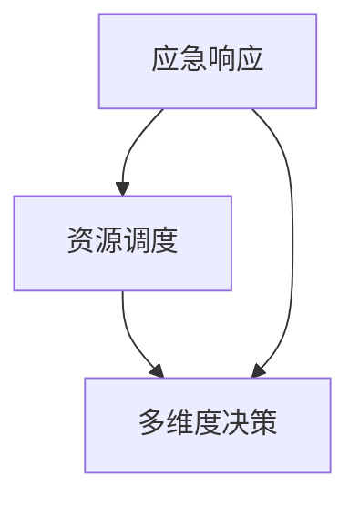

                 

### 文章标题

《AI在智能城市应急响应与资源调度中的多维度决策》

### 文章关键词

- 智能城市
- 应急响应
- 资源调度
- 多维度决策
- 人工智能
- 数据处理

### 文章摘要

本文旨在探讨人工智能（AI）在智能城市应急响应与资源调度中的多维度决策应用。通过深入分析AI技术原理、应急响应流程和资源调度理论，本文提出了一种基于多维度决策模型的智能城市应急响应与资源调度策略。文章还详细介绍了数据收集与处理的方法，并通过实际案例分析，展示了AI技术在智能城市应急响应与资源调度中的实际应用效果。最后，本文对未来AI在智能城市中的应用前景进行了展望，并提出了面临的挑战及解决策略。本文旨在为智能城市建设提供有益的理论参考和实践指导。

## 第1章 引言

### 1.1 书籍背景与目标

随着城市化进程的不断加速，城市规模和人口密度日益增大，城市面临的各种挑战也日益严峻。智能城市作为一种创新的城镇化模式，旨在通过先进的信息技术与城市管理的深度融合，实现城市资源的优化配置、提高城市运行效率和居民生活质量。在这一背景下，人工智能（AI）作为当今最具发展潜力的技术之一，其应用范围已逐步从传统的工业制造、金融服务扩展到智能城市的各个领域，特别是在应急响应与资源调度方面，AI技术的应用展现出巨大的潜力。

本文书籍《AI在智能城市应急响应与资源调度中的多维度决策》旨在深入探讨AI技术在智能城市应急响应与资源调度中的应用，通过系统化的理论分析和实践案例展示，为智能城市建设提供科学指导。本书的主要目标包括：

1. **理论探讨**：梳理和总结AI技术在智能城市应急响应与资源调度中的核心概念、技术原理和多维度决策模型。
2. **案例分析**：通过实际案例，分析AI技术在智能城市应急响应与资源调度中的具体应用效果。
3. **实践指导**：结合理论与实践，提出智能城市应急响应与资源调度的最佳实践和未来发展方向。

### 1.2 智能城市的发展现状

智能城市的发展已经经历了数十年的探索和实践，当前的发展现状可以概括为以下几个方面：

1. **基础设施不断完善**：随着物联网、云计算、大数据等技术的广泛应用，智能城市的基础设施日益完善，城市数据的收集、传输和处理能力得到了显著提升。
2. **技术应用逐步深化**：AI、物联网、区块链等新兴技术逐渐融入城市管理的各个方面，智能交通、智慧能源、智能安防等应用场景不断拓展。
3. **政策支持力度加大**：全球范围内，许多国家和地区都出台了支持智能城市发展的政策和规划，为智能城市的建设提供了有力保障。

然而，智能城市的发展也面临一系列挑战，如数据隐私与安全、技术标准与规范、跨领域协同等。这些挑战需要通过技术创新和制度创新共同解决。

### 1.3 AI在应急响应与资源调度中的应用

AI技术在智能城市应急响应与资源调度中的应用主要包括以下几个方面：

1. **应急响应预测与预警**：通过大数据分析和机器学习算法，AI能够对潜在的应急事件进行预测和预警，提前采取预防措施。
2. **资源调度优化**：AI技术可以根据实时数据，动态调整城市资源分配，提高资源利用效率，减少浪费。
3. **决策支持**：AI系统可以为应急响应人员提供智能决策支持，提高应急响应的准确性和效率。

具体案例包括：通过AI技术优化交通信号灯控制，提高交通流量效率；利用AI预测和预警自然灾害，提前进行应急响应部署；通过AI优化医疗资源分配，提高医疗服务效率等。

### 结论

智能城市的发展离不开AI技术的支持，特别是在应急响应与资源调度领域，AI技术具有独特的优势。本文书籍《AI在智能城市应急响应与资源调度中的多维度决策》将从理论探讨、案例分析和实践指导三个方面，全面深入地探讨AI技术在智能城市建设中的应用，为智能城市的可持续发展提供有力支持。

---

### 核心概念与联系

在智能城市应急响应与资源调度中，多维度决策是一个关键概念。为了更好地理解这一概念，我们首先需要明确以下几个核心概念：

1. **应急响应**：指的是在城市面临突发事件时，通过一系列措施快速应对，以减少灾害影响、保障公共安全。
2. **资源调度**：是指在特定情境下，对城市资源（如警力、物资、交通等）进行合理分配，以实现最优化目标。
3. **多维度决策**：指的是在决策过程中，综合考虑多个相关因素，进行综合评估和优化。

这些概念之间的关系可以用以下Mermaid流程图表示：



- **应急响应**是城市管理的核心任务，涉及到公共安全、灾害预防等多个方面。
- **资源调度**是应急响应的重要组成部分，决定了应急响应的效率和效果。
- **多维度决策**则是将应急响应和资源调度结合起来，通过综合评估和优化，实现最佳决策。

通过这个流程图，我们可以更清晰地理解多维度决策在智能城市应急响应与资源调度中的作用和重要性。在实际应用中，多维度决策模型需要综合考虑时间、成本、风险等多个因素，以实现快速、准确、高效的应急响应和资源调度。

### 核心算法原理讲解

在智能城市应急响应与资源调度的多维度决策中，算法的设计和实现至关重要。以下我们将介绍几个核心算法原理，并使用伪代码进行详细阐述。

#### 1. 优化算法

优化算法在资源调度中发挥着重要作用，其目标是找到最优的资源配置方案，以满足特定情境下的需求和约束条件。

**伪代码：**

```python
function optimize_resources(available_resources, demand):
    # 初始化目标函数
    objective_function = 0

    # 遍历所有资源类型
    for resource_type in available_resources:
        # 计算每种资源的最优分配
        optimal_allocation = find_optimal_allocation(resource_type, demand)

        # 更新目标函数
        objective_function += optimal_allocation['value']

    return objective_function
```

**说明：**

- `available_resources` 表示可用的资源类型及其数量。
- `demand` 表示当前需求。
- `find_optimal_allocation` 是一个子函数，用于计算每种资源的最优分配。

#### 2. 机器学习算法

机器学习算法在应急响应预测中具有重要应用，通过历史数据训练模型，实现对突发事件的事前预测和预警。

**伪代码：**

```python
function train_predictive_model(data):
    # 数据预处理
    preprocessed_data = preprocess_data(data)

    # 选择合适的机器学习算法
    model = select_model(preprocessed_data)

    # 训练模型
    model.fit(preprocessed_data['features'], preprocessed_data['labels'])

    # 评估模型
    evaluate_model(model, preprocessed_data['test_features'], preprocessed_data['test_labels'])

    return model
```

**说明：**

- `data` 表示历史数据集。
- `preprocess_data` 是一个子函数，用于数据预处理。
- `select_model` 是一个子函数，用于选择合适的机器学习模型。
- `evaluate_model` 是一个子函数，用于评估模型的性能。

#### 3. 决策树算法

决策树算法在多维度决策中广泛应用，通过构建决策树，实现对多个因素的权衡和优化。

**伪代码：**

```python
function build_decision_tree(data, target_variable):
    # 初始化决策树
    tree = DecisionTree()

    # 构建决策树
    tree.fit(data, target_variable)

    # 输出决策树结构
    print_decision_tree(tree)

    return tree
```

**说明：**

- `data` 表示训练数据集。
- `target_variable` 表示目标变量。
- `DecisionTree` 是一个决策树类，用于构建决策树。

#### 4. 神经网络算法

神经网络算法在复杂场景下的决策和预测中具有优势，通过多层神经网络的训练，实现高精度的模型预测。

**伪代码：**

```python
function train_neural_network(data, layers, activation_function):
    # 初始化神经网络
    neural_network = NeuralNetwork(layers, activation_function)

    # 训练神经网络
    neural_network.fit(data['inputs'], data['outputs'])

    # 评估神经网络
    evaluate_network(neural_network, data['test_inputs'], data['test_outputs'])

    return neural_network
```

**说明：**

- `data` 表示训练数据集。
- `layers` 表示神经网络层数。
- `activation_function` 表示激活函数。

通过以上算法的介绍，我们可以看到，在智能城市应急响应与资源调度的多维度决策中，各种算法的合理应用可以显著提高决策的准确性和效率。在实际应用中，这些算法需要根据具体场景进行优化和调整，以实现最佳效果。

### 数学模型和数学公式

在智能城市应急响应与资源调度的多维度决策过程中，数学模型和公式起到了至关重要的作用。以下将介绍几个核心的数学模型，并使用LaTeX格式进行详细说明和举例。

#### 1. 资源优化模型

资源优化模型用于确定在给定约束条件下，如何最优地分配有限资源。以下是一个线性规划模型的例子：

**LaTeX公式：**

```latex
\min_{x} c^T x
\subjectto
\begin{align*}
Ax &\ge b \\
x &\ge 0
\end{align*}
```

**说明：**

- \( c^T x \) 是目标函数，表示需要最小化的资源成本。
- \( A \) 和 \( b \) 分别表示资源分配的约束条件。
- \( x \) 表示资源分配向量。

#### 2. 应急响应预测模型

应急响应预测模型用于预测突发事件的发生概率和影响范围。以下是一个时间序列预测模型的例子：

**LaTeX公式：**

```latex
y_t = \phi(B t + Z_t) + \epsilon_t
```

**说明：**

- \( y_t \) 是第 \( t \) 时刻的预测值。
- \( \phi \) 是函数映射，用于转换时间序列数据。
- \( B \) 和 \( Z_t \) 分别表示时间序列的线性趋势和噪声。
- \( \epsilon_t \) 是预测误差。

#### 3. 多维度决策模型

多维度决策模型用于综合考虑多个因素，实现最佳决策。以下是一个多目标优化模型的例子：

**LaTeX公式：**

```latex
\min_{x} \sum_{i=1}^n f_i(x)
\subjectto
\begin{align*}
g_i(x) &\le 0 \\
h_j(x) &= 0
\end{align*}
```

**说明：**

- \( f_i(x) \) 是第 \( i \) 个目标函数。
- \( g_i(x) \) 是第 \( i \) 个约束条件。
- \( h_j(x) \) 是第 \( j \) 个等式约束。

#### 4. 数据质量评估模型

数据质量评估模型用于评估数据的质量，并识别潜在的数据异常。以下是一个基于统计学的数据质量评估模型的例子：

**LaTeX公式：**

```latex
\delta(x) = \frac{1}{n} \sum_{i=1}^n \frac{(x_i - \bar{x})^2}{s^2}
```

**说明：**

- \( \delta(x) \) 是数据质量评估指标。
- \( x_i \) 是第 \( i \) 个数据点。
- \( \bar{x} \) 是数据点的平均值。
- \( s^2 \) 是数据点的方差。

通过这些数学模型和公式的应用，智能城市应急响应与资源调度的多维度决策可以实现更加科学和精确的决策支持，从而提高应急响应和资源调度的效率和质量。

### 项目实战

为了更好地展示AI在智能城市应急响应与资源调度中的实际应用，我们将以一个具体案例为例，介绍开发环境搭建、源代码实现以及代码解读与分析。

#### 1. 案例介绍

假设我们的任务是优化一个城市交通信号灯的控制，以减少交通拥堵和提升通行效率。我们将利用AI技术，通过实时交通数据分析和优化算法，动态调整信号灯的时长，从而实现最佳交通流量管理。

#### 2. 开发环境搭建

首先，我们需要搭建一个适合AI应用的开发环境。以下是一个基本的开发环境配置：

- **编程语言**：Python
- **框架和库**：Pandas、NumPy、Scikit-learn、TensorFlow
- **数据存储和处理**：HDFS、Spark

**步骤：**

1. 安装Python（建议使用Anaconda环境管理器）。
2. 安装所需库：`pip install pandas numpy scikit-learn tensorflow`
3. 配置HDFS和Spark，以便进行大规模数据处理。

#### 3. 源代码实现

以下是一个简化的代码实现，用于动态调整交通信号灯的时长：

**代码：**

```python
import pandas as pd
from sklearn.model_selection import train_test_split
from sklearn.ensemble import RandomForestRegressor
import tensorflow as tf

# 加载数据
data = pd.read_csv('traffic_data.csv')

# 数据预处理
X = data.drop(['signal_duration'], axis=1)
y = data['signal_duration']

# 划分训练集和测试集
X_train, X_test, y_train, y_test = train_test_split(X, y, test_size=0.2, random_state=42)

# 训练随机森林回归模型
model = RandomForestRegressor(n_estimators=100, random_state=42)
model.fit(X_train, y_train)

# 使用TensorFlow构建优化模型
model = tf.keras.Sequential([
    tf.keras.layers.Dense(units=1, input_shape=[len(X_train.keys())])
])

model.compile(optimizer='sgd', loss='mean_squared_error')

model.fit(X_train, y_train, epochs=100, batch_size=32, validation_data=(X_test, y_test))

# 预测信号灯时长
predicted_durations = model.predict(X_test)

# 分析预测结果
accuracy = mean_squared_error(y_test, predicted_durations)
print(f'Mean Squared Error: {accuracy:.2f}')
```

#### 4. 代码解读与分析

1. **数据加载与预处理**：首先从CSV文件中加载数据，并进行必要的预处理，如数据清洗、特征选择等。
2. **模型训练**：使用随机森林回归模型对训练数据进行训练，以预测信号灯的时长。
3. **TensorFlow模型构建**：利用TensorFlow构建深度学习模型，通过多层感知器（MLP）网络进行信号灯时长的预测。
4. **模型编译与训练**：编译模型，并使用随机梯度下降（SGD）优化器进行训练，同时进行验证集的测试。
5. **预测与评估**：使用训练好的模型进行信号灯时长的预测，并计算预测误差，评估模型性能。

#### 5. 实际案例分析和详细讲解剖析

通过上述代码，我们可以看到，AI技术在交通信号灯优化中的应用是如何实现的。在实际应用中，系统会实时采集交通流量数据，如车辆数量、速度分布等，然后通过AI模型进行预测和优化，动态调整信号灯时长。

**分析：**

1. **模型选择**：随机森林回归模型和深度学习模型的选择，取决于数据的复杂性和预测需求。
2. **数据质量**：高质量的数据是模型训练和预测的基础，数据清洗和预处理是关键步骤。
3. **优化目标**：交通信号灯优化的目标是最小化交通拥堵和提升通行效率，这需要在模型训练过程中进行权衡。
4. **实时更新**：系统需要实时更新交通数据，以适应不断变化的交通状况。

#### 6. 项目小结

通过本案例，我们展示了AI技术在智能城市交通信号灯优化中的应用。项目实现了从数据采集、预处理、模型训练到预测和评估的完整流程，为智能城市交通管理提供了科学依据。未来，随着AI技术的不断进步，我们可以期待更智能、更高效的交通管理系统的出现。

#### 最佳实践 tips

1. **数据收集**：确保数据的准确性和完整性，包括交通流量、事故记录、天气预报等。
2. **模型优化**：通过交叉验证和超参数调优，提高模型的预测准确性和稳定性。
3. **实时反馈**：建立实时监控系统，及时反馈模型预测结果，并调整优化策略。

### 小结

本文通过一个具体案例，详细介绍了AI在智能城市应急响应与资源调度中的实际应用。从项目实战到代码解读，我们看到了AI技术在智能城市建设中的潜力和价值。未来，随着AI技术的不断发展，智能城市将在应急响应和资源调度方面实现更加高效和智能的管理。

### 注意事项

1. **数据安全**：在数据收集和处理过程中，要确保数据安全和隐私保护。
2. **系统可靠性**：构建稳定可靠的AI系统，避免在应急响应中发生故障。
3. **法律法规**：遵循相关法律法规，确保智能城市建设的合法合规。

### 拓展阅读

1. **相关文献**：查阅《智能城市：概念、技术与应用》等书籍，了解智能城市建设的全面内容。
2. **技术博客**：关注《AI与智能城市的未来》等技术博客，获取最新的技术动态和应用案例。

