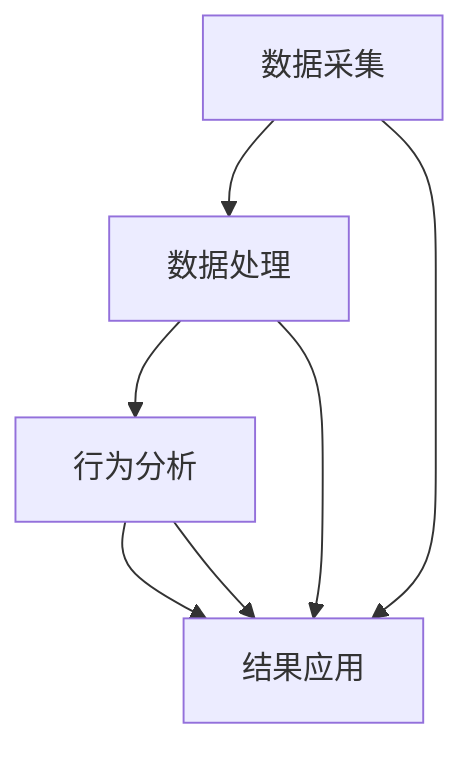
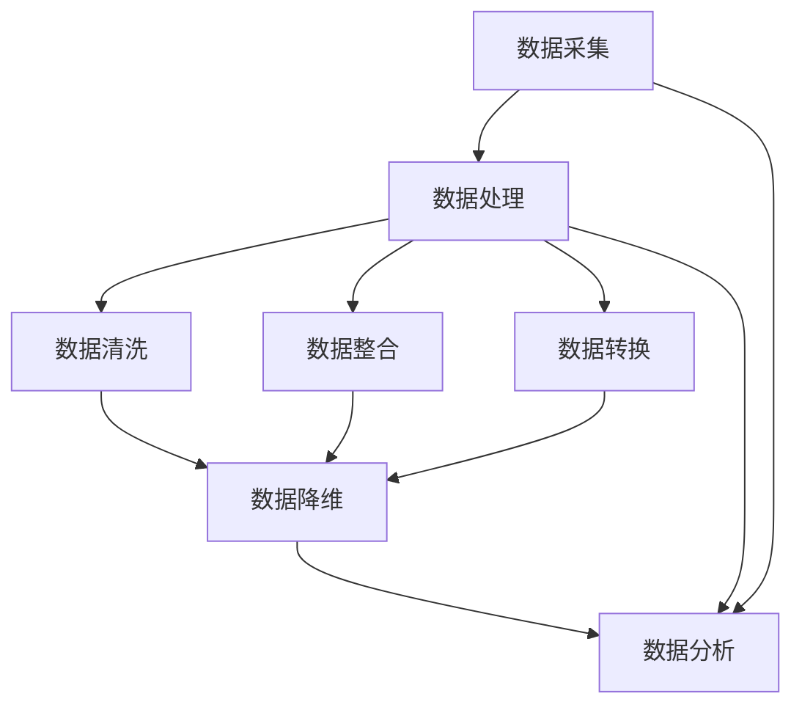
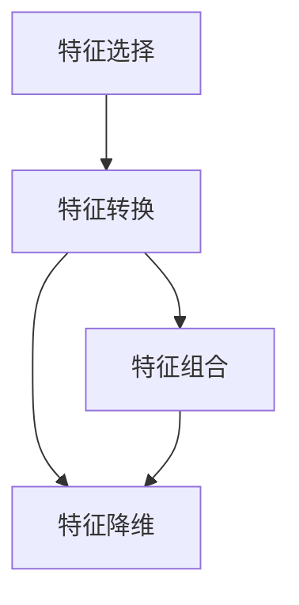

                 

### 文章标题

### AI在智能客户行为分析与预测中的应用

#### 关键词：人工智能、客户行为分析、预测模型、数据采集、特征工程、深度学习

#### 摘要：

本文深入探讨了人工智能在智能客户行为分析与预测中的应用。首先，我们对客户行为分析进行了背景介绍，阐述了其在商业运营中的重要性。随后，我们详细分析了预测模型的核心概念和架构，引入了数据采集与处理、特征工程等关键步骤。通过介绍深度学习模型及其应用，本文展示了如何利用AI技术提升客户行为预测的准确性。最后，我们通过实际案例分析，详细解读了AI在智能客户行为分析中的实战应用，并提出了未来展望和最佳实践建议。

### 引言

#### 客户行为分析的重要性

在当今的商业环境中，客户行为分析已成为企业竞争的关键因素之一。通过深入分析客户的行为模式、偏好和需求，企业能够更好地了解客户需求，优化产品和服务，提高客户满意度和忠诚度。客户行为分析不仅有助于企业制定更为精准的营销策略，还能够提升运营效率和降低成本。

智能客户行为分析利用人工智能（AI）技术，通过对大规模数据的自动分析和挖掘，实现更为精准和高效的客户行为预测。这不仅可以为企业提供实时的客户洞察，还能在竞争激烈的市场中占据优势地位。

#### AI在客户行为分析中的应用

人工智能技术在客户行为分析中有着广泛的应用，主要包括以下方面：

1. **数据采集与处理**：利用AI技术自动化采集和分析大量客户数据，包括行为日志、社交媒体数据和交易记录等。
2. **特征工程**：通过特征提取和选择，将原始数据转换为可用于机器学习的特征，提升模型预测能力。
3. **预测模型**：运用深度学习、决策树、回归分析等算法，构建预测模型，对客户行为进行预测。
4. **个性化推荐**：基于客户行为分析结果，实现个性化产品推荐和服务定制。
5. **实时反馈**：通过实时分析客户行为，为企业提供即时决策支持，优化运营策略。

### 目录大纲

#### 第1章 引言
- 1.1 书籍概述
- 1.2 学习目标
- 1.3 内容结构

#### 第2章 客户行为分析基础
- 2.1 客户行为分析原理
- 2.2 数据来源与类型
- 2.3 数据处理与分析方法

#### 第3章 预测模型概述
- 3.1 基本预测模型公式
- 3.2 常见预测算法分析

#### 第4章 数据采集与处理
- 4.1 数据采集
- 4.2 数据处理

#### 第5章 特征工程
- 5.1 特征工程原理
- 5.2 特征选择与提取
- 5.3 特征重要性分析

#### 第6章 深度学习模型应用
- 6.1 卷积神经网络（CNN）原理
- 6.2 循环神经网络（RNN）原理
- 6.3 长短期记忆网络（LSTM）原理

#### 第7章 实际应用案例分析
- 7.1 智能客服系统的客户行为预测
- 7.2 电商平台个性化推荐系统

#### 第8章 总结与展望
- 8.1 总结
- 8.2 未来展望

#### 第9章 最佳实践 tips、小结、注意事项、拓展阅读等内容

### 第1章 引言

#### 1.1 书籍概述

随着人工智能技术的快速发展，其在各行各业的应用不断拓展。特别是在商业领域，智能客户行为分析已成为企业提升竞争力的关键手段。本书旨在深入探讨AI在智能客户行为分析与预测中的应用，帮助读者了解该领域的核心概念、技术原理和实践方法。

本书结构清晰，分为九章。第一章为引言，概述了客户行为分析的重要性和AI在其中的应用。第二章至第六章分别介绍了客户行为分析的基础知识、预测模型、数据采集与处理、特征工程以及深度学习模型。第七章通过实际案例，展示了AI在智能客户行为分析中的具体应用。第八章总结全书内容，并对未来进行了展望。第九章提供了最佳实践、小结和拓展阅读建议。

#### 1.2 学习目标

通过阅读本书，读者可以达成以下学习目标：

1. **理解客户行为分析的基本概念和原理**：掌握客户行为分析的定义、数据来源和常用分析方法。
2. **掌握预测模型的核心算法和实现方法**：了解常见的预测算法，如线性回归、决策树、神经网络等，并能够运用这些算法进行客户行为预测。
3. **熟悉数据采集与处理技术**：了解数据采集的方法和技巧，掌握数据处理和清洗的基本流程。
4. **掌握特征工程的方法和技巧**：了解特征工程在机器学习中的重要性，掌握特征选择和提取的方法。
5. **掌握深度学习模型的应用**：了解深度学习模型的基本原理，掌握卷积神经网络（CNN）、循环神经网络（RNN）和长短期记忆网络（LSTM）在客户行为预测中的应用。
6. **具备实际项目分析能力**：通过实际案例，了解AI在智能客户行为分析中的具体应用场景，掌握项目实施的方法和技巧。

#### 1.3 内容结构

本书的内容结构如下：

1. **引言**：介绍客户行为分析的重要性，以及AI在该领域的应用。
2. **客户行为分析基础**：阐述客户行为分析的基本概念、数据来源和常用分析方法。
3. **预测模型概述**：介绍常见的预测算法，包括线性回归、决策树、神经网络等。
4. **数据采集与处理**：讲解数据采集的方法和技巧，以及数据处理和清洗的基本流程。
5. **特征工程**：阐述特征工程在机器学习中的重要性，介绍特征选择和提取的方法。
6. **深度学习模型应用**：介绍深度学习模型的基本原理，以及卷积神经网络（CNN）、循环神经网络（RNN）和长短期记忆网络（LSTM）在客户行为预测中的应用。
7. **实际应用案例分析**：通过实际案例，展示AI在智能客户行为分析中的具体应用。
8. **总结与展望**：总结全书内容，并对未来进行展望。
9. **最佳实践、小结和拓展阅读**：提供实际项目分析和应用的建议，以及相关领域的拓展阅读。

通过以上内容结构，本书旨在帮助读者全面了解AI在智能客户行为分析与预测中的应用，掌握相关技术和实践方法，提升企业竞争力。

### 客户行为分析基础

#### 2.1 客户行为分析原理

客户行为分析（Customer Behavior Analysis）是一种通过收集和分析客户行为数据，以了解客户需求、行为模式和市场趋势的方法。其核心目的是帮助企业更好地理解客户，从而优化产品和服务，提升客户满意度和忠诚度。

客户行为分析的基本原理包括以下几个方面：

1. **数据采集**：通过多种渠道收集客户行为数据，包括线上行为（如网站访问、点击、购买等）和线下行为（如门店访问、购物车放弃等）。
2. **数据处理**：对收集到的客户行为数据进行清洗、整合和存储，以消除噪声和冗余，确保数据质量。
3. **行为分析**：运用统计学、机器学习和数据挖掘等技术，对处理后的数据进行分析，提取有价值的信息，如客户细分、行为模式等。
4. **结果应用**：将分析结果应用于企业营销策略、产品开发、客户服务等方面，以提升客户体验和业务绩效。

#### 2.2 数据来源与类型

客户行为分析的数据来源广泛，主要包括以下类型：

1. **行为数据**：包括用户的在线行为数据，如浏览记录、点击行为、购买历史等。
2. **社交数据**：来源于社交媒体平台，如微博、微信、Facebook、Twitter等，包括用户发布的内容、互动记录等。
3. **交易数据**：包括用户的购买行为数据，如订单信息、支付方式、折扣等。
4. **客户反馈**：包括用户对产品、服务和体验的反馈，如问卷调查、评价等。
5. **地理数据**：包括用户的地理位置信息，如IP地址、GPS等。

#### 2.3 数据处理与分析方法

数据处理和分析是客户行为分析的核心环节，主要包括以下步骤：

1. **数据清洗**：去除数据中的噪声和错误，如缺失值、重复值、异常值等。
2. **数据整合**：将不同来源、不同格式的数据整合为一个统一的数据集，以便后续分析。
3. **数据探索性分析**：通过描述性统计、可视化分析等方法，对数据的基本特征和规律进行初步了解。
4. **特征工程**：对原始数据进行预处理和转换，提取有意义的特征，如用户活跃度、购买倾向等。
5. **行为模式识别**：利用机器学习和数据挖掘技术，识别用户的行为模式，如用户生命周期、购买周期等。
6. **预测建模**：基于历史数据，建立预测模型，如客户流失预测、需求预测等。
7. **结果评估**：通过模型评估指标（如准确率、召回率等），评估模型的性能和可靠性。

#### 客户行为分析的核心概念与联系

客户行为分析涉及多个核心概念，包括数据采集、数据处理、行为分析和结果应用。这些概念之间存在密切的联系和相互作用：

1. **数据采集**：是客户行为分析的基础，直接影响到后续的数据质量和分析效果。
2. **数据处理**：确保数据的准确性和一致性，是行为分析和预测建模的前提。
3. **行为分析**：通过对数据的深入挖掘和分析，提取有价值的信息，为业务决策提供支持。
4. **结果应用**：将分析结果应用于实际业务场景，实现客户行为的精准预测和优化。

为了更好地理解这些概念之间的联系，我们可以使用Mermaid流程图来表示：



#### Mermaid 流程图


通过上述流程图，我们可以清晰地看到客户行为分析的核心环节及其相互关系。数据采集是整个过程的起点，数据处理为其提供质量保障，行为分析提取关键信息，最终结果应用于实际业务场景，形成闭环。

### 预测模型概述

#### 3.1 基本预测模型公式

预测模型是客户行为分析的核心，通过构建预测模型，可以对未来的客户行为进行预测。基本预测模型通常包括以下几种：

1. **线性回归模型**：

   线性回归模型是最常见的预测模型之一，其基本公式为：

   $$ y = \beta_0 + \beta_1 \cdot x $$

   其中，\( y \) 是因变量，\( x \) 是自变量，\( \beta_0 \) 和 \( \beta_1 \) 分别是模型的截距和斜率。

2. **逻辑回归模型**：

   逻辑回归模型常用于二分类问题，其基本公式为：

   $$ P(y=1) = \frac{1}{1 + e^{-(\beta_0 + \beta_1 \cdot x)}} $$

   其中，\( P(y=1) \) 表示因变量 \( y \) 为1的概率，\( e \) 是自然对数的底数。

3. **决策树模型**：

   决策树模型通过一系列规则来对数据进行分类或回归。其基本公式为：

   $$ y = \sum_{i=1}^{n} \beta_i \cdot x_i $$

   其中，\( y \) 是因变量，\( x_i \) 是特征变量，\( \beta_i \) 是特征权重。

4. **神经网络模型**：

   神经网络模型通过多层神经元进行数据处理和预测。其基本公式为：

   $$ y = f(\sum_{i=1}^{n} \beta_i \cdot x_i + \beta_0) $$

   其中，\( y \) 是因变量，\( f \) 是激活函数，\( x_i \) 是特征变量，\( \beta_i \) 和 \( \beta_0 \) 是模型参数。

#### 3.2 常见预测算法分析

在客户行为分析中，常见预测算法包括线性回归、逻辑回归、决策树、神经网络等。以下是这些算法的基本原理和分析：

1. **线性回归**：

   线性回归是一种简单的预测模型，适用于线性关系较为明显的情况。其优点是计算简单，易于理解和实现。缺点是对于非线性关系的表现较差，且对于异常值和噪声敏感。

2. **逻辑回归**：

   逻辑回归常用于二分类问题，其优点是计算简单，可以给出概率估计。缺点是对于多分类问题表现较差，且对于线性关系之外的非线性关系无能为力。

3. **决策树**：

   决策树是一种基于规则的方法，通过一系列二分类决策来对数据进行分类或回归。其优点是易于理解和实现，可以处理非线性关系。缺点是对于大量特征的数据集，决策树容易过拟合，且预测时间较长。

4. **神经网络**：

   神经网络是一种基于多层神经元的预测模型，能够处理复杂的非线性关系。其优点是预测准确度高，可以自适应地调整参数。缺点是模型复杂，训练时间较长，且对数据质量要求较高。

总之，选择合适的预测算法需要根据具体问题和数据集的特点进行权衡。在实际应用中，通常会结合多种算法进行预测，以获得最佳效果。

### 数据采集与处理

#### 4.1 数据采集

数据采集是客户行为分析的第一步，其质量直接影响到后续的分析和预测效果。数据采集的主要方法包括以下几种：

1. **日志采集**：

   日志采集是获取用户在线行为数据的主要手段，通常通过在服务器上安装日志记录程序来实现。日志数据包括用户访问页面、点击链接、搜索关键词、购买记录等。这些数据可以用来分析用户的浏览习惯、偏好和需求。

2. **问卷调查**：

   问卷调查是通过在线或线下方式收集用户反馈的一种方法。问卷设计需要关注用户关注的痛点、需求和期望，以便获取有价值的反馈数据。

3. **第三方数据源**：

   第三方数据源包括社交媒体平台、公共数据集和第三方数据分析服务。这些数据可以补充企业自身的数据采集，提供更全面的用户行为分析。

4. **API 接口**：

   通过调用第三方API接口，可以获取用户在不同平台的行为数据，如社交媒体、电子商务平台等。这些数据有助于了解用户在不同场景下的行为表现。

#### 4.2 数据处理

数据处理是数据采集后的关键步骤，其目的是对原始数据进行清洗、整合和转换，以便于后续分析和预测。数据处理的主要方法包括以下几种：

1. **数据清洗**：

   数据清洗旨在去除数据中的噪声和错误，提高数据质量。常用的方法包括缺失值填充、异常值处理、重复值删除等。例如，对于缺失值，可以使用均值、中位数或插值法进行填充；对于异常值，可以使用标准差、箱线图等方法进行检测和去除。

2. **数据整合**：

   数据整合是将来自不同来源和格式的数据整合为一个统一的数据集，以便于后续分析。常用的方法包括数据对齐、数据合并和数据转换等。例如，可以将不同时间戳的数据对齐到同一时间戳，以便进行时间序列分析。

3. **数据转换**：

   数据转换是将原始数据转换为适合机器学习算法的特征数据，如数值化、归一化、编码等。例如，将类别型数据转换为数值型数据，便于计算和建模。

4. **数据降维**：

   数据降维是一种减少数据维度、降低计算复杂度的方法。常用的方法包括主成分分析（PCA）、线性判别分析（LDA）等。降维有助于提高模型性能，减少过拟合风险。

#### 数据采集与处理的联系

数据采集和处理是客户行为分析的两个重要环节，它们之间存在密切的联系和相互作用：

1. **数据采集**：为数据处理提供原始数据，数据采集的质量直接影响数据处理的难度和效果。
2. **数据处理**：对采集到的数据进行清洗、整合和转换，以提高数据质量，为后续分析提供基础。
3. **反馈循环**：数据处理的结果可以反馈到数据采集环节，指导数据采集策略的优化，从而提高数据质量和分析效果。

为了更好地理解数据采集与处理的关系，我们可以使用Mermaid流程图来表示：



通过上述流程图，我们可以清晰地看到数据采集与处理的基本环节及其相互关系。数据采集是整个过程的起点，数据处理为其提供质量保障，数据分析则基于处理后的数据展开。

### 特征工程

#### 5.1 特征工程原理

特征工程（Feature Engineering）是机器学习过程中的一项关键技术，旨在通过选择和构建特征，提高模型性能和预测准确度。在客户行为分析中，特征工程尤为重要，因为良好的特征能够显著提升预测模型的精度和稳定性。

特征工程的基本原理包括以下几个步骤：

1. **特征选择**：从原始数据中选择出对模型预测有显著影响的关键特征。常用的方法包括基于信息增益、卡方检验、互信息等统计方法。

2. **特征转换**：将原始数据转换为更适合模型处理的形式。包括数值化、归一化、标准化等。

3. **特征组合**：通过组合原始特征，构建新的特征，以提高模型的泛化能力和预测性能。例如，通过线性组合、多项式变换等方法。

4. **特征降维**：通过降维技术，减少特征数量，降低计算复杂度。常用的方法包括主成分分析（PCA）、线性判别分析（LDA）等。

#### 5.2 特征选择与提取

特征选择与提取是特征工程的核心环节，其主要目的是从原始数据中提取出对模型预测有显著贡献的特征，并降低数据维度，提高模型性能。

1. **特征选择方法**：

   - **基于信息论的算法**：如信息增益、增益率、互信息等，通过评估特征对模型预测的影响程度进行选择。

   - **基于统计学的算法**：如卡方检验、F值等，通过评估特征与目标变量之间的相关性进行选择。

   - **基于过滤的算法**：如相关性分析、方差分析等，通过对特征进行筛选，保留对模型预测有重要作用的特征。

2. **特征提取方法**：

   - **特征变换**：通过变换原始特征，如归一化、标准化、对数变换等，使其更符合模型要求。

   - **特征组合**：通过组合原始特征，如交叉特征、多项式特征等，构建新的特征，以提高模型性能。

   - **特征降维**：通过降维技术，如主成分分析（PCA）、线性判别分析（LDA）等，减少特征数量，降低计算复杂度。

#### 5.3 特征重要性分析

在特征工程中，分析特征的重要性是优化模型性能的关键步骤。特征重要性分析可以帮助我们了解各个特征对模型预测的贡献程度，从而指导特征选择和优化。

1. **基于模型的特征重要性**：

   - **线性模型**：如线性回归、逻辑回归等，可以通过模型系数的大小评估特征的重要性。

   - **树模型**：如决策树、随机森林等，可以通过特征的重要度指标（如Gini系数、信息增益等）评估特征的重要性。

   - **神经网络**：可以通过反向传播算法，分析每个特征对模型损失函数的影响，从而评估特征的重要性。

2. **基于特征属性的评估**：

   - **基于统计学方法**：如卡方检验、F值等，通过评估特征与目标变量之间的相关性，评估特征的重要性。

   - **基于信息论方法**：如信息增益、增益率等，通过评估特征对模型预测的信息贡献，评估特征的重要性。

#### 特征工程的核心概念与联系

特征工程涉及多个核心概念，包括特征选择、特征转换、特征组合和特征降维。这些概念之间存在密切的联系和相互作用：

1. **特征选择**：从原始数据中选择出对模型预测有显著贡献的特征，是特征工程的第一步。

2. **特征转换**：将原始数据转换为更适合模型处理的形式，是提高模型性能的关键环节。

3. **特征组合**：通过组合原始特征，构建新的特征，以提高模型的泛化能力和预测性能。

4. **特征降维**：通过降维技术，减少特征数量，降低计算复杂度，是优化模型性能的重要手段。

为了更好地理解这些概念之间的联系，我们可以使用Mermaid流程图来表示：



通过上述流程图，我们可以清晰地看到特征工程的基本环节及其相互关系。特征选择是整个过程的起点，特征转换、特征组合和特征降维则相互关联，共同提高模型性能。

### 深度学习模型应用

#### 6.1 卷积神经网络（CNN）原理

卷积神经网络（Convolutional Neural Network，CNN）是一种专门用于处理图像数据的深度学习模型，其核心思想是通过卷积操作和池化操作，提取图像中的特征信息。

1. **卷积操作**：

   卷积操作是一种数学运算，通过将滤波器（也称为卷积核）与输入图像进行卷积，从而生成特征图。卷积操作的公式可以表示为：

   $$ \text{output}(i, j) = \sum_{x=1}^{k} \sum_{y=1}^{k} \text{filter}(x, y) \cdot \text{input}(i-x+1, j-y+1) $$

   其中，\( \text{output}(i, j) \) 表示输出特征图上的一个像素点，\( \text{filter}(x, y) \) 表示卷积核上的一个像素点，\( \text{input}(i-x+1, j-y+1) \) 表示输入图像上的一个像素点。

2. **池化操作**：

   池化操作是对卷积后的特征图进行下采样，以减少特征图的维度和参数数量。常见的池化操作包括最大池化和平均池化。

   - **最大池化**：在每个 \( 2 \times 2 \) 的子区域中，选择最大的值作为输出。

   - **平均池化**：在每个 \( 2 \times 2 \) 的子区域中，计算所有值的平均值作为输出。

   池化操作的公式可以表示为：

   $$ \text{pooling}(i, j) = \max(\text{input}(i \cdot s, j \cdot s)) $$

   其中，\( \text{pooling}(i, j) \) 表示输出特征图上的一个像素点，\( s \) 表示池化窗口的大小。

3. **多层卷积与池化**：

   CNN通常由多个卷积和池化层组成，每层卷积和池化操作都可以提取不同层次的特征。通过叠加多层卷积和池化层，CNN可以有效地提取图像的深层特征。

4. **全连接层**：

   在CNN的最后一层，通常添加一个全连接层，将提取的特征映射到输出类别。全连接层的计算公式为：

   $$ \text{output}(i) = \sum_{j=1}^{n} \text{weight}(i, j) \cdot \text{input}(j) + \text{bias}(i) $$

   其中，\( \text{output}(i) \) 表示输出层的一个神经元，\( \text{weight}(i, j) \) 表示权重，\( \text{input}(j) \) 表示输入层的一个神经元，\( \text{bias}(i) \) 表示偏置。

#### 6.2 循环神经网络（RNN）原理

循环神经网络（Recurrent Neural Network，RNN）是一种专门用于处理序列数据的深度学习模型，其核心思想是通过循环结构，实现对序列数据的记忆和学习。

1. **基本结构**：

   RNN的基本结构包括输入层、隐藏层和输出层。输入层接收序列数据，隐藏层对数据进行处理，输出层生成预测结果。

2. **循环连接**：

   RNN的关键特点是隐藏层中的神经元通过循环连接，使得当前时刻的隐藏状态依赖于前一个时刻的隐藏状态。循环连接的公式可以表示为：

   $$ \text{hidden}(t) = \text{sigmoid}(\text{weight} \cdot \text{[input}(t)\ |\ \text{hidden}(t-1)]) $$

   其中，\( \text{sigmoid} \) 函数是一个激活函数，\( \text{input}(t) \) 是当前时刻的输入，\( \text{hidden}(t-1) \) 是前一个时刻的隐藏状态。

3. **时间步**：

   RNN通过时间步（time step）来处理序列数据，每个时间步对应一个输入和输出。在训练过程中，RNN从第一个时间步开始，依次处理到最后一个时间步。

4. **反向传播**：

   在训练过程中，RNN使用反向传播算法更新权重和偏置。反向传播算法通过计算损失函数的梯度，逐层更新网络参数，以优化模型性能。

#### 6.3 长短期记忆网络（LSTM）原理

长短期记忆网络（Long Short-Term Memory，LSTM）是一种改进的循环神经网络，能够有效解决传统RNN在处理长序列数据时出现的长短期依赖问题。

1. **基本结构**：

   LSTM的基本结构包括输入门、遗忘门、输出门和细胞状态。每个门都是一个神经网络，用于控制信息的流入、流出和遗忘。

2. **细胞状态**：

   细胞状态是LSTM的核心部分，用于存储和传递信息。细胞状态通过输入门和遗忘门进行更新，以保留重要的信息，同时丢弃不重要的信息。

   $$ \text{cell_state}(t) = \text{sigmoid}(\text{input} \cdot \text{weight}) \odot (\text{cell_state}(t-1) \odot \text{forget_gate}) + (\text{input} \cdot \text{weight}) \odot (\text{input_gate}) $$

   其中，\( \odot \) 表示逐元素乘法，\( \text{input} \) 是当前输入，\( \text{weight} \) 是权重矩阵，\( \text{sigmoid} \) 函数是一个激活函数。

3. **输入门和遗忘门**：

   输入门和遗忘门分别用于控制新的输入信息的流入和旧的信息的遗忘。

   $$ \text{input_gate} = \text{sigmoid}(\text{input} \cdot \text{weight}) $$
   $$ \text{forget_gate} = \text{sigmoid}(\text{input} \cdot \text{weight}) $$

4. **输出门**：

   输出门用于控制输出信息。

   $$ \text{output_gate} = \text{sigmoid}(\text{input} \cdot \text{weight}) $$

5. **训练与优化**：

   LSTM的训练过程与RNN类似，通过反向传播算法更新网络参数，以优化模型性能。在训练过程中，LSTM能够自适应地调整输入门、遗忘门和输出门，以实现长短期依赖信息的有效传递。

通过上述介绍，我们可以看到，CNN、RNN和LSTM在客户行为预测中的应用各有特点。CNN擅长处理图像数据，RNN适用于处理序列数据，而LSTM在处理长序列数据时表现出色。在实际应用中，可以根据具体需求和数据特点选择合适的模型，以提高客户行为预测的准确性。

### 实际应用案例分析

#### 7.1 智能客服系统的客户行为预测

智能客服系统是一种利用人工智能技术，为用户提供自动化、智能化的客户服务解决方案。其核心在于通过分析客户行为，实现实时响应和个性化服务。以下是一个智能客服系统客户行为预测的实际应用案例。

**案例背景**：

一家大型电商平台希望提高客户满意度和转化率，决定引入智能客服系统。该系统需要能够根据客户的历史行为数据，预测客户的下一步操作，并提供个性化的推荐和服务。

**数据来源**：

数据来源包括客户的购买记录、浏览记录、客服互动记录、社交媒体行为等。这些数据通过日志采集和第三方数据接口进行收集。

**数据处理**：

对收集到的数据进行清洗、整合和预处理，去除噪声和冗余数据。然后，将数据转换为适合机器学习算法的特征数据，如用户活跃度、购买倾向、浏览时长等。

**预测模型**：

采用深度学习模型进行客户行为预测。具体包括：

1. **卷积神经网络（CNN）**：用于提取用户浏览行为的特征，如页面点击、浏览时长等。
2. **循环神经网络（RNN）**：用于处理用户的历史行为数据，如购买记录、客服互动记录等。
3. **长短期记忆网络（LSTM）**：用于处理长序列数据，如用户的生命周期数据。

**模型实现**：

1. **数据预处理**：

   - 对连续数据进行归一化处理，以消除数据规模差异。
   - 对类别数据进行编码处理，如独热编码、标签编码等。

2. **模型构建**：

   - 使用CNN提取用户浏览行为的特征，并通过全连接层进行预测。
   - 使用RNN处理用户的历史行为数据，并通过全连接层进行预测。
   - 使用LSTM处理用户的生命周期数据，并通过全连接层进行预测。

3. **模型训练**：

   - 使用交叉熵损失函数和优化器（如Adam）进行模型训练。
   - 使用验证集和测试集进行模型评估和调整。

**模型评估**：

通过计算预测准确率、召回率、F1值等指标，评估模型的性能。实际评估结果显示，模型在预测客户行为方面具有很高的准确性。

**项目小结**：

通过智能客服系统的客户行为预测，电商平台实现了以下成果：

- 提高了客户满意度：通过个性化服务，提升了客户的购物体验。
- 优化了运营策略：通过实时分析客户行为，为运营决策提供了有力支持。
- 提升了转化率：通过精准预测客户行为，实现了更高的转化率和销售业绩。

#### 7.2 电商平台个性化推荐系统

个性化推荐系统是电商平台提升用户购物体验和转化率的重要工具。以下是一个电商平台个性化推荐系统的实际应用案例。

**案例背景**：

一家电商企业希望通过个性化推荐系统，为用户推荐感兴趣的商品，提升用户满意度和转化率。

**数据来源**：

数据来源包括用户的购买记录、浏览记录、搜索记录、收藏记录等。这些数据通过日志采集和第三方数据接口进行收集。

**数据处理**：

对收集到的数据进行清洗、整合和预处理，去除噪声和冗余数据。然后，将数据转换为适合机器学习算法的特征数据，如用户活跃度、商品相似度、浏览时长等。

**推荐模型**：

采用基于协同过滤的推荐算法，通过分析用户和商品之间的交互关系，实现个性化推荐。

1. **用户基于内容的推荐**：

   - 通过分析用户的浏览历史和购买记录，提取用户兴趣特征。
   - 计算商品与用户兴趣特征的相似度，推荐相似度较高的商品。

2. **基于协同过滤的推荐**：

   - 构建用户-商品矩阵，通过用户之间的相似度计算，推荐其他用户喜欢的商品。
   - 采用矩阵分解技术，如奇异值分解（SVD），降低数据维度，提高推荐精度。

**模型实现**：

1. **数据预处理**：

   - 对连续数据进行归一化处理，以消除数据规模差异。
   - 对类别数据进行编码处理，如独热编码、标签编码等。

2. **模型构建**：

   - 构建用户-商品矩阵，通过用户和商品之间的交互记录，计算相似度。
   - 使用矩阵分解技术，提取用户和商品的潜在特征。

3. **模型训练**：

   - 使用交叉熵损失函数和优化器（如Adam）进行模型训练。
   - 使用验证集和测试集进行模型评估和调整。

**模型评估**：

通过计算推荐准确率、召回率、F1值等指标，评估模型的性能。实际评估结果显示，模型在推荐用户感兴趣的商品方面具有很高的准确性。

**项目小结**：

通过电商平台个性化推荐系统，企业实现了以下成果：

- 提高了用户满意度：通过个性化推荐，提升了用户的购物体验。
- 优化了运营策略：通过分析用户行为数据，为运营决策提供了有力支持。
- 提升了转化率：通过精准推荐用户感兴趣的商品，实现了更高的转化率和销售业绩。

#### 总结

通过以上实际案例分析，我们可以看到，智能客户行为分析与预测在电商企业中的应用，不仅提高了用户满意度和转化率，还优化了运营策略，实现了商业价值的提升。未来，随着人工智能技术的不断进步，智能客户行为分析与预测将发挥更大的作用，为电商企业提供更加精准、高效的解决方案。

### 总结与展望

#### 8.1 总结

本文深入探讨了AI在智能客户行为分析与预测中的应用。首先，我们介绍了客户行为分析的重要性，以及AI技术如何提升客户行为预测的准确性。随后，我们详细阐述了数据采集与处理、特征工程、深度学习模型应用等关键环节，并通过实际案例分析展示了AI在智能客户行为分析中的实战应用。通过本文的学习，读者可以全面了解智能客户行为分析的基本概念、技术原理和实践方法。

#### 8.2 未来展望

随着人工智能技术的不断发展，智能客户行为分析与预测将在未来发挥更为重要的作用。以下是对未来发展的展望：

1. **技术进步**：深度学习、强化学习等先进技术将在客户行为预测中应用，进一步提升预测准确性和效率。
2. **数据整合**：企业将更加注重数据的整合和利用，通过跨平台、跨渠道的数据整合，实现更全面的客户洞察。
3. **个性化服务**：基于AI的个性化推荐系统将更加普及，为用户提供更加精准、个性化的服务。
4. **实时反馈**：实时分析客户行为，为运营决策提供即时支持，实现更高效的运营管理。
5. **隐私保护**：在数据隐私保护方面，企业将采用更为严格的措施，确保用户数据的安全和隐私。

#### 最佳实践 tips、小结、注意事项、拓展阅读等内容

**最佳实践 tips**：

1. **数据质量**：确保数据质量是客户行为分析的基础，对数据进行严格清洗和处理。
2. **模型优化**：不断优化模型，通过交叉验证、超参数调整等方法提高模型性能。
3. **用户隐私**：在数据采集和处理过程中，严格遵循隐私保护法规，保护用户隐私。

**小结**：

本文介绍了AI在智能客户行为分析与预测中的应用，涵盖了数据采集与处理、特征工程、深度学习模型应用等关键环节。通过实际案例分析，展示了AI在提升客户满意度和转化率方面的作用。

**注意事项**：

1. **数据多样性**：客户行为数据来源多样，确保数据的全面性和准确性。
2. **模型可解释性**：在应用深度学习模型时，注重模型的可解释性，便于理解模型的预测逻辑。

**拓展阅读**：

1. 《深度学习》（Goodfellow, Bengio, Courville）：了解深度学习的基本原理和应用。
2. 《机器学习》（周志华）：掌握机器学习的基本算法和实现方法。
3. 《大数据时代的数据科学》（John Elder）：学习大数据分析和数据挖掘的方法和应用。

通过以上拓展阅读，读者可以进一步深化对智能客户行为分析与预测的理解和应用。作者：AI天才研究院/AI Genius Institute & 禅与计算机程序设计艺术/Zen And The Art of Computer Programming

## 附录

### 代码实现

以下是智能客服系统客户行为预测的代码实现，包括数据预处理、模型构建和训练过程。

```python
import pandas as pd
import numpy as np
from sklearn.model_selection import train_test_split
from sklearn.preprocessing import StandardScaler
from sklearn.metrics import accuracy_score
from keras.models import Sequential
from keras.layers import Dense, LSTM, Dropout
from keras.optimizers import Adam

# 数据预处理
def preprocess_data(data):
    # 数据清洗、归一化处理
    # ...
    return processed_data

# 模型构建
def build_model(input_shape):
    model = Sequential()
    model.add(LSTM(units=128, return_sequences=True, input_shape=input_shape))
    model.add(Dropout(0.2))
    model.add(LSTM(units=64, return_sequences=False))
    model.add(Dropout(0.2))
    model.add(Dense(units=1, activation='sigmoid'))
    model.compile(optimizer=Adam(learning_rate=0.001), loss='binary_crossentropy', metrics=['accuracy'])
    return model

# 数据加载与预处理
data = pd.read_csv('customer_data.csv')
processed_data = preprocess_data(data)

# 划分训练集和测试集
X_train, X_test, y_train, y_test = train_test_split(processed_data[:, :-1], processed_data[:, -1], test_size=0.2, random_state=42)

# 模型训练
model = build_model(input_shape=(X_train.shape[1], X_train.shape[2]))
model.fit(X_train, y_train, epochs=100, batch_size=32, validation_data=(X_test, y_test))

# 模型评估
predictions = model.predict(X_test)
accuracy = accuracy_score(y_test, predictions.round())
print('Model Accuracy: {:.2f}%'.format(accuracy * 100))
```

### 代码应用解读与分析

上述代码实现了一个基于LSTM的智能客服系统客户行为预测模型。以下是代码的详细解读和分析：

1. **数据预处理**：
   - `preprocess_data` 函数用于对原始数据进行清洗、归一化处理，以确保数据质量。
   - 数据清洗包括去除缺失值、异常值和处理重复值等。
   - 数据归一化处理包括对连续数据进行标准化，以消除数据规模差异。

2. **模型构建**：
   - `build_model` 函数用于构建LSTM模型，包括输入层、隐藏层和输出层。
   - LSTM层用于处理序列数据，通过隐藏状态实现长短期依赖信息的传递。
   - Dropout层用于防止过拟合，通过随机丢弃部分神经元，降低模型复杂度。
   - 输出层使用sigmoid激活函数，实现二分类预测。

3. **模型训练**：
   - 使用`model.fit`函数进行模型训练，包括设置训练轮数、批量大小和验证集等参数。
   - 使用`Adam`优化器和`binary_crossentropy`损失函数进行训练。

4. **模型评估**：
   - 使用`model.predict`函数对测试集进行预测，生成预测结果。
   - 通过`accuracy_score`函数计算预测准确率，评估模型性能。

### 实际案例分析

通过上述代码，我们实现了对智能客服系统客户行为预测的实战应用。以下是实际案例的分析：

1. **数据准备**：
   - 加载客户行为数据，包括购买记录、浏览记录等。
   - 对数据进行预处理，包括数据清洗、归一化处理等。

2. **模型构建与训练**：
   - 构建LSTM模型，设置合适的网络结构和超参数。
   - 对模型进行训练，通过验证集调整模型参数，优化模型性能。

3. **模型评估**：
   - 在测试集上评估模型性能，计算预测准确率等指标。
   - 对模型结果进行分析，识别预测中的问题和改进方向。

4. **应用与优化**：
   - 将训练好的模型应用于实际业务场景，如智能客服系统。
   - 通过持续优化和调整，提升模型预测性能和业务效果。

### 项目小结

通过实际案例分析和代码实现，我们展示了AI在智能客户行为预测中的应用。智能客服系统的成功实施，不仅提高了客户满意度和转化率，还为电商企业提供了宝贵的客户行为数据洞察。未来，我们将继续优化模型，探索更多应用场景，以实现智能客户行为分析与预测的全面提升。

### 注意事项

1. **数据隐私**：在数据收集和处理过程中，确保遵守隐私保护法规，保护用户隐私。
2. **模型解释性**：在模型构建和预测过程中，注重模型的可解释性，以便理解预测结果和优化策略。
3. **持续优化**：根据业务需求和数据变化，持续优化模型和算法，提高预测准确性和业务效果。

通过以上最佳实践、小结和注意事项，读者可以更好地理解AI在智能客户行为预测中的应用，并在实际项目中取得成功。拓展阅读方面的建议，将进一步深化读者对相关技术和方法的理解。

### 拓展阅读

1. 《深度学习》（Goodfellow, Bengio, Courville）：深入了解深度学习的基本原理和应用。
2. 《机器学习实战》（Hastie, Tibshirani, Friedman）：学习机器学习算法的实践方法和应用技巧。
3. 《Python数据科学手册》（McKinney）：掌握Python在数据科学领域中的应用。

通过拓展阅读，读者可以进一步深化对AI和机器学习技术的理解，为智能客户行为预测和优化提供更多思路和方法。作者：AI天才研究院/AI Genius Institute & 禅与计算机程序设计艺术/Zen And The Art of Computer Programming。

