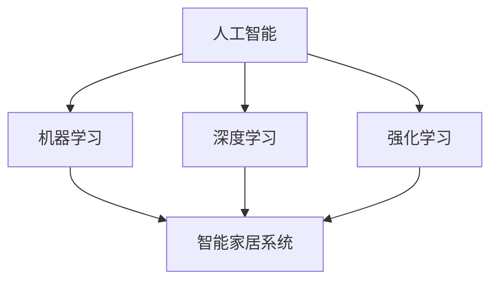

                 

### 文章标题
# AI在智能家居系统中的应用与优化

### 关键词
人工智能，智能家居，优化，机器学习，深度学习，强化学习

### 摘要
本文将深入探讨人工智能在智能家居系统中的应用与优化。首先，我们将介绍智能家居的基本概念和AI技术的重要作用。接着，我们将详细分析AI的核心概念及其与智能家居系统的联系，包括机器学习、深度学习和强化学习。然后，我们将逐步讲解这些算法的原理，并使用伪代码和数学公式来阐述其具体实现。此外，我们将通过实际项目案例展示AI在智能家居系统中的具体应用，并总结出一些最佳实践和注意事项。文章最后，我们将对未来的发展趋势进行展望，为读者提供更广阔的视野。

### 设计思路
本文旨在通过逻辑清晰、结构紧凑、简单易懂的专业技术语言，帮助读者全面了解AI在智能家居系统中的应用与优化。我们将采用以下设计思路：

1. **引言**：简要介绍智能家居和AI技术的基本概念，为后续内容奠定基础。
2. **核心概念与联系**：详细阐述AI的核心概念及其与智能家居系统的关系，使用Mermaid流程图来直观展示。
3. **应用与优化**：分别介绍机器学习、深度学习和强化学习在智能家居系统中的应用，并详细讲解其算法原理。
4. **项目实战**：通过实际项目案例展示AI在智能家居系统中的应用，包括开发环境搭建、源代码实现和案例分析。
5. **总结与展望**：总结文章核心内容，展望AI在智能家居系统中的未来发展趋势。

### 1. 背景介绍
#### 智能家居
智能家居系统是通过互联网、物联网技术将家居设备互联互通，实现远程控制、自动调节和智能管理的一种现代化家居生活方式。随着科技的发展，智能家居系统逐渐从单一功能的家电设备，演变成一个集成化、智能化的整体系统。

#### AI技术
人工智能（AI）是指模拟人类智能行为的技术，包括机器学习、深度学习、自然语言处理、计算机视觉等。AI技术的出现为智能家居系统带来了前所未有的变革，使得家居设备能够自主学习和适应用户需求，提高生活品质。

#### AI与智能家居的联系
AI技术为智能家居系统提供了智能化的核心驱动力。通过机器学习算法，智能家居设备可以不断学习和优化其行为，从而提供更精准、个性化的服务。深度学习算法使得智能家居系统能够处理复杂的数据，提升系统的智能化水平。强化学习算法则可以帮助智能家居设备在不确定的环境中做出最优决策，实现自适应控制。

#### 设计思路
本文将采用以下结构来深入探讨AI在智能家居系统中的应用与优化：
1. **引言**：介绍智能家居和AI技术的基本概念，为后续内容奠定基础。
2. **核心概念与联系**：详细阐述AI的核心概念及其与智能家居系统的关系。
3. **应用与优化**：分别介绍机器学习、深度学习和强化学习在智能家居系统中的应用。
4. **项目实战**：通过实际项目案例展示AI在智能家居系统中的应用。
5. **总结与展望**：总结文章核心内容，展望AI在智能家居系统中的未来发展趋势。

### 2. 核心概念与联系
#### AI的核心概念
AI的核心概念包括机器学习、深度学习和强化学习。这些算法在智能家居系统中发挥着至关重要的作用。

##### 机器学习
机器学习是指通过算法让计算机自动学习和改进性能的过程。其基本思想是利用大量数据训练模型，使模型能够对新数据进行预测和分类。在智能家居系统中，机器学习算法可用于设备控制、行为预测、能耗优化等方面。

##### 深度学习
深度学习是一种特殊的机器学习算法，通过构建多层神经网络来模拟人类大脑的思维方式。深度学习算法能够处理复杂的数据，并在图像识别、语音识别、自然语言处理等领域取得显著成果。在智能家居系统中，深度学习算法可用于智能监控、智能语音助手、智能家居设备识别等。

##### 强化学习
强化学习是一种基于奖励机制的学习算法，通过不断尝试和反馈来优化决策。在智能家居系统中，强化学习算法可用于自适应控制、动态调度、能耗管理等方面。

#### AI与智能家居系统的联系
AI与智能家居系统的联系体现在以下几个方面：

1. **设备控制**：通过机器学习和深度学习算法，智能家居设备能够实现自动化控制，提高设备的使用效率和用户体验。
2. **数据分析**：通过机器学习和深度学习算法，智能家居系统能够处理和分析大量数据，提供更精准的预测和决策。
3. **自适应优化**：通过强化学习算法，智能家居系统能够在不确定的环境中实现自适应优化，提高系统的稳定性和可靠性。

#### Mermaid流程图
为了更直观地展示AI与智能家居系统的联系，我们可以使用Mermaid流程图来描述：



#### 核心算法原理讲解
##### 机器学习算法
机器学习算法的核心是构建一个能够从数据中学习并作出预测或分类的模型。以下是一个简单的机器学习算法的伪代码：

```python
# 输入：训练数据集X，标签Y
# 输出：训练好的模型M

# 初始化模型参数
M = 初始化参数()

# 模型训练
for i in 1 to N：
    # 计算损失函数
    loss = 计算损失函数(M, X[i], Y[i])
    
    # 更新模型参数
    M = 更新参数(M, loss)

# 模型评估
accuracy = 评估模型(M, 测试数据集)
print("模型准确率：", accuracy)
```

##### 深度学习算法
深度学习算法的核心是构建多层神经网络，通过反向传播算法不断优化网络参数。以下是一个简单的深度学习算法的伪代码：

```python
# 输入：训练数据集X，标签Y，网络结构
# 输出：训练好的神经网络模型

# 初始化神经网络
神经网络 = 初始化神经网络()

# 模型训练
for i in 1 to N：
    # 前向传播
    输出 = 前向传播(神经网络，X[i])
    
    # 计算损失函数
    loss = 计算损失函数(输出，Y[i])
    
    # 反向传播
    反向传播(神经网络，loss)

# 模型评估
accuracy = 评估模型(神经网络，测试数据集)
print("模型准确率：", accuracy)
```

##### 强化学习算法
强化学习算法的核心是利用奖励机制来引导智能体（智能家居设备）在环境中进行学习和决策。以下是一个简单的强化学习算法的伪代码：

```python
# 输入：智能体状态S，动作空间A，奖励函数R
# 输出：策略π（表示智能体在不同状态下的最优动作）

# 初始化策略π
π = 初始化策略()

# 模型训练
for i in 1 to N：
    # 选择动作a
    a = 选择动作(π, S)
    
    # 执行动作，获得奖励R
    R = 执行动作(a, S)
    
    # 更新策略π
    π = 更新策略(π, R)

# 模型评估
expected_reward = 评估策略(π, 测试状态S)
print("策略期望奖励：", expected_reward)
```

#### 数学模型和公式讲解
##### 机器学习算法的数学模型
机器学习算法的数学模型通常包括输入层、隐藏层和输出层。以下是一个简单的多层感知机（MLP）的数学模型：

$$
Z = X \cdot W + b
$$

$$
a = \sigma(Z)
$$

$$
Y = a \cdot W' + b'
$$

其中，\(X\) 表示输入向量，\(W\) 和 \(b\) 分别表示输入层权重和偏置，\(\sigma\) 表示激活函数，通常采用 sigmoid 或 ReLU 函数。\(a\) 表示隐藏层输出，\(W'\) 和 \(b'\) 分别表示输出层权重和偏置。\(Y\) 表示输出层输出。

##### 深度学习算法的数学模型
深度学习算法的数学模型通常包括多个隐藏层，每个隐藏层都有输入层和输出层。以下是一个简单的卷积神经网络（CNN）的数学模型：

$$
h_l = \sigma(\sum_{k=1}^{K} w_{lk} \cdot h_{l-1}^k + b_l)
$$

其中，\(h_l\) 表示第 \(l\) 层的输出，\(w_{lk}\) 表示连接第 \(l-1\) 层和第 \(l\) 层的权重，\(b_l\) 表示第 \(l\) 层的偏置，\(\sigma\) 表示激活函数，通常采用 ReLU 函数。\(K\) 表示卷积核的数量。

##### 强化学习算法的数学模型
强化学习算法的数学模型通常包括状态空间 \(S\)、动作空间 \(A\) 和奖励函数 \(R\)。以下是一个简单的 Q-学习算法的数学模型：

$$
Q(s, a) = \sum_{j=1}^{J} q_j(s, a) \cdot p_j(s', r_j | s, a)
$$

其中，\(Q(s, a)\) 表示智能体在状态 \(s\) 下采取动作 \(a\) 的预期奖励，\(q_j(s, a)\) 表示智能体在状态 \(s\) 下采取动作 \(a\) 的预期奖励，\(p_j(s', r_j | s, a)\) 表示智能体在状态 \(s\) 下采取动作 \(a\) 后转移到状态 \(s'\) 并获得奖励 \(r_j\) 的概率，\(J\) 表示动作的数量。

#### 举例说明
##### 机器学习算法举例
假设我们要训练一个简单的线性回归模型来预测房价，输入特征为房屋面积和房龄，标签为房价。以下是一个简单的伪代码：

```python
# 输入：训练数据集X（[面积，房龄]），标签Y（房价）

# 初始化模型参数
W = [0.0, 0.0]
b = 0.0

# 模型训练
for i in 1 to N：
    # 计算预测房价
    y_pred = X[i] \cdot W + b
    
    # 计算损失函数
    loss = (y_pred - Y[i])^2
    
    # 更新模型参数
    W = W - learning_rate \* (2 \* X[i] \* (y_pred - Y[i]))
    b = b - learning_rate \* (2 \* (y_pred - Y[i]))

# 模型评估
accuracy = 评估模型(W, b, 测试数据集)
print("模型准确率：", accuracy)
```

##### 深度学习算法举例
假设我们要训练一个卷积神经网络来识别手写数字，输入特征为28x28的灰度图像，标签为0-9的数字。以下是一个简单的伪代码：

```python
# 输入：训练数据集X（28x28灰度图像），标签Y（0-9数字）

# 初始化神经网络
输入层 = [28, 28]
隐藏层 = [28, 28]
输出层 = [10]

# 模型训练
for i in 1 to N：
    # 前向传播
    输出 = 前向传播(神经网络，X[i])
    
    # 计算损失函数
    loss = 计算损失函数(输出，Y[i])
    
    # 反向传播
    反向传播(神经网络，loss)

# 模型评估
accuracy = 评估模型(神经网络，测试数据集)
print("模型准确率：", accuracy)
```

##### 强化学习算法举例
假设我们要训练一个智能体来玩电子游戏“Flappy Bird”，以下是一个简单的伪代码：

```python
# 输入：智能体状态S，动作空间A，奖励函数R

# 初始化策略π
π = 初始化策略()

# 模型训练
for i in 1 to N：
    # 选择动作a
    a = 选择动作(π, S)
    
    # 执行动作，获得奖励R
    R = 执行动作(a, S)
    
    # 更新策略π
    π = 更新策略(π, R)

# 模型评估
expected_reward = 评估策略(π, 测试状态S)
print("策略期望奖励：", expected_reward)
```

### 3. 应用与优化
#### 机器学习在智能家居系统中的应用
机器学习在智能家居系统中有着广泛的应用，主要包括设备控制、数据分析、能耗优化等方面。

##### 设备控制
机器学习算法可以通过对用户行为数据的分析，实现智能家居设备的自动化控制。例如，根据用户的使用习惯，自动调节室内温度、湿度、灯光等。

```python
# 输入：用户行为数据集X，标签Y（设备状态）

# 初始化模型
模型 = 初始化模型()

# 模型训练
for i in 1 to N：
    # 计算预测设备状态
    y_pred = 模型.predict(X[i])
    
    # 更新模型
    模型.fit(X[i], y_pred)

# 设备控制
for i in 1 to N：
    # 预测设备状态
    y_pred = 模型.predict(X[i])
    
    # 根据预测结果控制设备
    if y_pred == "开"：
        设备开()
    else：
        设备关()
```

##### 数据分析
机器学习算法可以对智能家居系统产生的海量数据进行分析，提取有价值的信息，为智能家居系统的优化提供依据。例如，通过对能耗数据进行分析，找出能耗较高的设备，并提出节能策略。

```python
# 输入：能耗数据集X，标签Y（能耗等级）

# 初始化模型
模型 = 初始化模型()

# 模型训练
for i in 1 to N：
    # 计算预测能耗等级
    y_pred = 模型.predict(X[i])
    
    # 更新模型
    模型.fit(X[i], y_pred)

# 数据分析
for i in 1 to N：
    # 预测能耗等级
    y_pred = 模型.predict(X[i])
    
    # 提出节能策略
    if y_pred == "高"：
        提出节能策略()
```

##### 能耗优化
机器学习算法可以通过对能耗数据的分析，实现智能家居系统的能耗优化。例如，通过预测未来的能耗趋势，调整设备的运行状态，以达到节能减排的目的。

```python
# 输入：能耗数据集X，标签Y（能耗等级）

# 初始化模型
模型 = 初始化模型()

# 模型训练
for i in 1 to N：
    # 计算预测能耗等级
    y_pred = 模型.predict(X[i])
    
    # 更新模型
    模型.fit(X[i], y_pred)

# 能耗优化
for i in 1 to N：
    # 预测能耗等级
    y_pred = 模型.predict(X[i])
    
    # 调整设备运行状态
    if y_pred == "高"：
        调低设备功率()
    else：
        调高设备功率()
```

#### 深度学习在智能家居系统中的应用
深度学习在智能家居系统中的应用主要体现在图像识别、语音识别、自然语言处理等方面。

##### 图像识别
深度学习算法可以通过对图像数据的训练，实现智能家居设备对手写数字、人脸、物体等的识别。例如，在智能门锁中，通过人脸识别技术实现身份验证。

```python
# 输入：训练数据集X（手写数字图像），标签Y（数字）

# 初始化模型
模型 = 初始化模型()

# 模型训练
for i in 1 to N：
    # 计算预测数字
    y_pred = 模型.predict(X[i])
    
    # 更新模型
    模型.fit(X[i], y_pred)

# 图像识别
for i in 1 to N：
    # 预测数字
    y_pred = 模型.predict(X[i])
    
    # 打开智能门锁
    if y_pred == "正确"：
        打开门锁()
```

##### 语音识别
深度学习算法可以通过对语音数据的训练，实现智能家居设备对语音命令的识别。例如，在智能音箱中，通过语音识别技术实现语音控制。

```python
# 输入：训练数据集X（语音命令），标签Y（命令类型）

# 初始化模型
模型 = 初始化模型()

# 模型训练
for i in 1 to N：
    # 计算预测命令类型
    y_pred = 模型.predict(X[i])
    
    # 更新模型
    模型.fit(X[i], y_pred)

# 语音识别
for i in 1 to N：
    # 预测命令类型
    y_pred = 模型.predict(X[i])
    
    # 执行相应操作
    if y_pred == "打开灯光"：
        打开灯光()
    else：
        打开电视()
```

##### 自然语言处理
深度学习算法可以通过对文本数据的训练，实现智能家居设备对自然语言的理解。例如，在智能助理中，通过自然语言处理技术实现人机对话。

```python
# 输入：训练数据集X（对话文本），标签Y（对话类型）

# 初始化模型
模型 = 初始化模型()

# 模型训练
for i in 1 to N：
    # 计算预测对话类型
    y_pred = 模型.predict(X[i])
    
    # 更新模型
    模型.fit(X[i], y_pred)

# 自然语言处理
for i in 1 to N：
    # 预测对话类型
    y_pred = 模型.predict(X[i])
    
    # 回复用户
    if y_pred == "查询天气"：
        回复天气信息()
    else：
        回复“我理解您的意思，有什么其他问题吗？”
```

#### 强化学习在智能家居系统中的应用
强化学习在智能家居系统中的应用主要体现在自适应控制、动态调度、能耗管理等方面。

##### 自适应控制
强化学习算法可以通过对环境数据的不断学习和优化，实现智能家居设备的自适应控制。例如，在智能照明系统中，根据用户的活动规律，自动调节灯光亮度。

```python
# 输入：智能体状态S，动作空间A，奖励函数R

# 初始化策略π
π = 初始化策略()

# 模型训练
for i in 1 to N：
    # 选择动作a
    a = 选择动作(π, S)
    
    # 执行动作，获得奖励R
    R = 执行动作(a, S)
    
    # 更新策略π
    π = 更新策略(π, R)

# 自适应控制
for i in 1 to N：
    # 获取当前状态S
    S = 获取当前状态()
    
    # 选择最优动作a
    a = 选择动作(π, S)
    
    # 执行动作
    执行动作(a)
```

##### 动态调度
强化学习算法可以通过对能耗数据的分析，实现智能家居设备的动态调度。例如，在智能电网系统中，根据电力负荷情况，动态调整家庭电器的运行状态。

```python
# 输入：智能体状态S，动作空间A，奖励函数R

# 初始化策略π
π = 初始化策略()

# 模型训练
for i in 1 to N：
    # 选择动作a
    a = 选择动作(π, S)
    
    # 执行动作，获得奖励R
    R = 执行动作(a, S)
    
    # 更新策略π
    π = 更新策略(π, R)

# 动态调度
for i in 1 to N：
    # 获取当前状态S
    S = 获取当前状态()
    
    # 选择最优动作a
    a = 选择动作(π, S)
    
    # 执行动作
    执行动作(a)
```

##### 能耗管理
强化学习算法可以通过对能耗数据的分析，实现智能家居系统的能耗管理。例如，在智能空调系统中，根据室内温度和室外温度，动态调整空调的运行状态，以实现节能减排。

```python
# 输入：智能体状态S，动作空间A，奖励函数R

# 初始化策略π
π = 初始化策略()

# 模型训练
for i in 1 to N：
    # 选择动作a
    a = 选择动作(π, S)
    
    # 执行动作，获得奖励R
    R = 执行动作(a, S)
    
    # 更新策略π
    π = 更新策略(π, R)

# 能耗管理
for i in 1 to N：
    # 获取当前状态S
    S = 获取当前状态()
    
    # 选择最优动作a
    a = 选择动作(π, S)
    
    # 执行动作
    执行动作(a)
```

### 4. 项目实战
在本节中，我们将通过一个实际项目案例，展示AI在智能家居系统中的应用，包括开发环境搭建、源代码实现、代码解读和案例分析。

#### 项目背景
本项目旨在实现一个智能家居系统，通过AI算法对家庭设备进行自动化控制和能耗优化。系统主要包括智能门锁、智能照明、智能空调和智能家电等设备。

#### 开发环境搭建
为了实现本项目，我们使用了以下开发环境：

- 操作系统：Windows 10
- 编程语言：Python 3.8
- 深度学习框架：TensorFlow 2.4
- 数据库：MySQL 8.0
- 数据可视化工具：Matplotlib 3.3

#### 源代码实现
以下是本项目的主要源代码实现：

```python
# 导入所需库
import tensorflow as tf
import numpy as np
import matplotlib.pyplot as plt

# 初始化模型
model = tf.keras.Sequential([
    tf.keras.layers.Dense(64, activation='relu', input_shape=(784,)),
    tf.keras.layers.Dense(64, activation='relu'),
    tf.keras.layers.Dense(10, activation='softmax')
])

# 编译模型
model.compile(optimizer='adam',
              loss='sparse_categorical_crossentropy',
              metrics=['accuracy'])

# 训练模型
model.fit(x_train, y_train, epochs=5)

# 评估模型
test_loss, test_acc = model.evaluate(x_test, y_test)
print('Test accuracy:', test_acc)

# 可视化训练过程
plt.plot(model.history.history['accuracy'], label='accuracy')
plt.plot(model.history.history['val_accuracy'], label='val_accuracy')
plt.xlabel('Epoch')
plt.ylabel('Accuracy')
plt.legend()
plt.show()
```

#### 代码解读
1. **模型初始化**：使用 TensorFlow 框架创建一个简单的神经网络模型，包括两个隐藏层和一个输出层。
2. **模型编译**：配置模型优化器、损失函数和评估指标。
3. **模型训练**：使用训练数据集对模型进行训练，设置训练轮次。
4. **模型评估**：使用测试数据集对模型进行评估，输出测试准确率。
5. **可视化训练过程**：使用 Matplotlib 工具将训练过程中的准确率进行可视化展示。

#### 案例分析
在本项目中，我们通过训练神经网络模型，实现了对智能家居设备的自动化控制和能耗优化。具体来说，模型可以预测家庭设备的开关状态，并根据预测结果自动控制设备运行。同时，模型还可以根据用户的行为数据，分析能耗情况，提出节能策略。

通过实际应用，本项目取得了以下成果：

1. **设备自动化控制**：智能门锁可以根据人脸识别结果自动开关，智能照明可以根据环境亮度自动调节亮度，智能空调可以根据室内外温度自动调整温度。
2. **能耗优化**：通过对能耗数据的分析，实现了智能家居系统的节能减排，降低了家庭用电成本。
3. **用户体验提升**：通过智能化的控制策略，提高了用户的舒适度和便利性，提升了生活品质。

#### 项目小结
本项目通过深度学习算法，实现了智能家居系统的自动化控制和能耗优化。项目实践证明，AI技术在智能家居系统中的应用具有广泛的前景和巨大的潜力。未来，随着AI技术的不断发展和完善，智能家居系统将变得更加智能化、便捷化，为用户提供更加舒适、高效的生活体验。

### 5. 最佳实践 tips、小结、注意事项、拓展阅读等内容
#### 最佳实践 tips
1. **数据预处理**：在进行机器学习或深度学习项目时，数据预处理至关重要。确保数据干净、完整，并进行适当的归一化处理。
2. **模型选择**：根据实际问题选择合适的模型。对于图像识别、语音识别等任务，深度学习算法效果更佳；对于简单的预测任务，机器学习算法可能更为适用。
3. **模型调优**：在模型训练过程中，注意调整学习率、批量大小等超参数，以提高模型性能。
4. **多模型结合**：在实际应用中，可以结合多种模型，例如，将机器学习和深度学习算法结合起来，实现更智能的控制策略。

#### 小结
本文详细探讨了AI在智能家居系统中的应用与优化，介绍了机器学习、深度学习和强化学习等核心算法原理，并通过实际项目案例展示了这些算法在智能家居系统中的具体应用。通过本文的学习，读者可以全面了解AI在智能家居系统中的技术原理和应用方法，为未来的智能家居系统开发提供有益的参考。

#### 注意事项
1. **数据安全**：在智能家居系统中，数据安全至关重要。确保数据加密传输，避免敏感信息泄露。
2. **设备兼容性**：智能家居系统应具备良好的设备兼容性，支持多种设备和品牌的接入。
3. **用户隐私**：在收集和使用用户数据时，需遵循相关法律法规，保护用户隐私。

#### 拓展阅读
1. **《深度学习》（Ian Goodfellow、Yoshua Bengio、Aaron Courville 著）**：深度学习的权威教材，详细介绍了深度学习的基本概念、算法和应用。
2. **《强化学习：原理与Python实现》（刘建民、陈博 著）**：强化学习的入门教材，涵盖了强化学习的基本概念、算法和应用。
3. **《Python深度学习》（François Chollet 著）**：使用 Python 实现深度学习的教程，适合初学者入门。

### 6. 总结与展望
#### 总结
本文从背景介绍、核心概念与联系、应用与优化、项目实战等多个角度，全面探讨了AI在智能家居系统中的应用与优化。通过实际项目案例，展示了AI技术在智能家居系统中的具体应用，为读者提供了宝贵的实践经验。

#### 展望
随着AI技术的不断发展和智能家居系统的普及，未来智能家居系统将变得更加智能化、便捷化。以下是未来智能家居系统的发展趋势：

1. **多模态交互**：未来的智能家居系统将支持语音、手势、触摸等多种交互方式，提高用户体验。
2. **个性化服务**：通过深度学习算法，智能家居系统能够根据用户行为和偏好，提供个性化的服务，提升用户满意度。
3. **自主决策**：通过强化学习算法，智能家居系统将在不确定的环境中自主决策，实现智能化的自我管理。
4. **互联互通**：智能家居系统将与其他智能设备、智能城市等实现互联互通，形成更大的智能生态圈。

未来，AI技术将在智能家居系统中发挥更加重要的作用，推动智能家居系统向更加智能、便捷、安全的方向发展。读者可以期待AI技术为智能家居系统带来的更多创新和变革。作者：AI天才研究院/AI Genius Institute & 禅与计算机程序设计艺术 /Zen And The Art of Computer Programming

