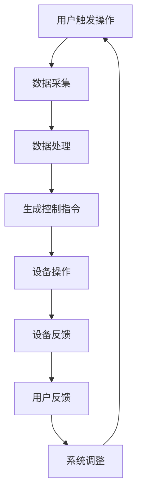

                 

### 文章标题

# AI在智能家居设备协同控制与场景联动中的应用

### 关键词

- 智能家居
- 协同控制
- 场景联动
- 人工智能
- 机器学习
- 深度学习

### 摘要

本文旨在深入探讨AI在智能家居设备中的协同控制与场景联动应用。首先，我们将简要介绍智能家居的概念、发展现状及AI技术的引入，然后详细解析协同控制与场景联动的原理，借助Mermaid流程图展示其基本架构。接着，分类讨论智能家居设备的类型及AI在各设备中的应用。重点部分将介绍机器学习算法在协同控制中的应用，并使用伪代码和数学公式进行详细阐述。文章还将探讨场景联动与用户体验的关系，通过实际项目案例展示开发过程和实现细节，最后总结并展望智能家居设备协同控制与场景联动的未来发展趋势。希望本文能为读者提供对AI在智能家居领域应用的全面理解和深入思考。

## 引言

智能家居是指通过互联网、物联网技术将家庭中的各种设备连接起来，实现远程控制、自动化管理，从而提升居住舒适度和生活便利性的系统。随着人工智能技术的快速发展，智能家居逐渐成为家庭自动化的重要分支。AI在智能家居中的应用主要集中在设备协同控制与场景联动，这不仅使得设备间的交互更加智能，还能根据用户习惯和需求提供个性化的服务。

协同控制是指通过某种算法或协议，使智能家居设备之间能够协同工作，共同完成某项任务或响应某种事件。例如，用户可以通过语音命令控制家中的灯光、窗帘和空调，AI系统会自动协调这些设备，以提供舒适的环境。场景联动则是指根据用户的预设或实际需求，智能家居设备能够自动调整其状态，以实现特定的场景。例如，当用户回到家时，灯光自动打开，窗帘自动关闭，空调自动调整温度。

本文将首先介绍智能家居和AI的基本概念及其发展现状，然后深入探讨协同控制与场景联动的原理，并通过实际案例展示AI算法在智能家居中的应用。接下来，我们将分类讨论智能家居设备的类型及AI在各设备中的应用，重点介绍机器学习算法在协同控制中的应用，并通过伪代码和数学公式详细阐述其原理。最后，我们将探讨场景联动与用户体验的关系，通过实际项目案例展示开发过程和实现细节，并总结并展望智能家居设备协同控制与场景联动的未来发展趋势。希望通过本文，读者能够对AI在智能家居领域的应用有一个全面而深入的理解。

## 智能家居与AI概述

### 智能家居的定义与现状

智能家居是指通过互联网、物联网技术将家庭中的各种设备连接起来，实现远程控制、自动化管理，从而提升居住舒适度和生活便利性的系统。智能家居的核心理念是通过智能化设备和服务，为用户提供更加便捷、舒适和个性化的生活体验。从广义上讲，智能家居包括智能照明、智能安防、智能家电、智能环境控制等多个方面。

智能家居的发展可以追溯到20世纪90年代，随着互联网和物联网技术的成熟，智能家居逐渐进入人们的日常生活。当前，智能家居市场正处于快速发展的阶段，全球范围内的智能家居设备出货量逐年攀升。根据市场研究公司的数据，预计到2025年，全球智能家居市场将达到数千亿美元。

在中国，智能家居的发展尤为迅速。中国政府在“新基建”战略中明确提出，要大力发展物联网、人工智能等新型基础设施建设，为智能家居的发展提供了强有力的政策支持。与此同时，各大科技公司和家电品牌纷纷布局智能家居领域，推出了一系列具有创新性和实用性的智能家居产品。

### AI在智能家居中的应用

人工智能（AI）是智能家居发展的关键推动力之一。AI技术通过大数据分析、机器学习、自然语言处理等技术手段，使得智能家居设备能够更加智能地理解和响应用户需求，从而提高生活品质和便利性。

#### 1. 自然语言处理

自然语言处理（NLP）技术是AI在智能家居中的典型应用之一。通过NLP技术，智能家居设备可以理解用户的语音指令，并进行相应的操作。例如，用户可以通过语音助手控制家中的灯光、空调、电视等设备，实现无缝的人机交互。

#### 2. 机器学习

机器学习技术是智能家居智能化的重要支撑。通过机器学习，智能家居设备能够不断学习和优化其行为，以提供更加个性化的服务。例如，智能空调可以根据用户的日常使用习惯，自动调整温度和湿度，实现节能和舒适。

#### 3. 深度学习

深度学习技术在智能家居中的应用也越来越广泛。通过深度学习模型，智能家居设备可以识别用户的行为模式，预测用户的需求，并提前进行相应的调整。例如，智能安防系统可以通过深度学习算法，实时分析监控视频，识别可疑行为并及时报警。

### 协同控制与场景联动概念

协同控制与场景联动是智能家居的核心功能，它们相互关联，共同提升了智能家居的智能化水平。

#### 协同控制

协同控制是指通过某种算法或协议，使智能家居设备之间能够协同工作，共同完成某项任务或响应某种事件。协同控制的关键在于设备之间的信息共享和协调操作。例如，当用户通过手机APP关闭家中的灯光时，智能灯泡会接收到指令并立即关闭，同时智能空调会根据室内温度调整制冷状态，以提供舒适的居住环境。

#### 场景联动

场景联动是指根据用户的预设或实际需求，智能家居设备能够自动调整其状态，以实现特定的场景。场景联动通常基于用户的习惯和需求进行预设，例如，用户可以预设“下班回家”场景，当用户回到家时，灯光自动打开，窗帘自动关闭，空调自动调整温度。场景联动不仅提升了用户的居住体验，还增强了智能家居系统的自动化程度。

通过协同控制和场景联动，智能家居设备能够形成一个高效、智能的生态体系，为用户提供更加便捷、舒适和个性化的生活体验。随着AI技术的不断进步，智能家居的协同控制与场景联动功能将更加完善，进一步提升智能家居系统的智能化水平。

## 协同控制与场景联动原理

### 协同控制原理

协同控制是智能家居系统中的关键组成部分，它通过算法和协议实现设备之间的信息共享和协调操作，从而提升系统的整体效率和用户体验。协同控制的原理可以概括为以下几个方面：

#### 设备互联

协同控制的基础是设备之间的互联。这通常通过物联网技术实现，使得不同设备能够通过网络进行通信和数据交换。设备互联包括有线和无线两种方式，如Wi-Fi、蓝牙、Zigbee等。

#### 数据采集与处理

智能家居设备通过各种传感器收集环境数据，如温度、湿度、光线、烟雾等。设备将这些数据上传至中央控制系统进行处理和分析。数据采集和处理是实现协同控制的关键步骤，它为设备之间的协调操作提供了实时、准确的信息基础。

#### 算法与协议

协同控制的核心在于算法和协议的选择。算法用于分析和处理设备收集到的数据，根据预设的规则或学习到的模式，生成相应的控制指令。常见的协同控制算法包括分布式算法、集中式算法和混合算法。协议则规定了设备之间的通信规则和数据格式，如MQTT、CoAP等。

#### 设备协同操作

在算法和协议的支持下，智能家居设备能够协同工作，共同完成特定的任务。例如，当用户通过手机APP关闭家中的灯光时，智能灯泡会接收到指令并立即关闭，同时智能空调会根据室内温度调整制冷状态，以提供舒适的居住环境。

### 场景联动原理

场景联动是智能家居系统中的一项高级功能，它通过预设或自动调整设备状态，以实现特定场景的需求。场景联动的原理可以分为以下几个方面：

#### 场景预设

用户可以通过预设场景，定义设备在不同场景下的状态。例如，用户可以预设“下班回家”场景，当用户回到家时，灯光自动打开，窗帘自动关闭，空调自动调整温度。场景预设通常基于用户的习惯和需求进行，通过手机APP或中央控制系统设置。

#### 自动调整

除了预设场景，智能家居系统还可以根据实时数据和环境变化，自动调整设备状态。例如，智能安防系统可以通过分析监控视频，识别可疑行为并及时报警，智能环境控制系统可以根据室内温度和湿度自动调整空调和加湿器的状态。

#### 设备协调

在场景联动过程中，智能家居设备需要协调其状态以实现预设场景。例如，当用户进入“睡眠”模式时，灯光逐渐变暗，窗帘关闭，空调调整至适宜的睡眠温度，智能音响关闭音乐播放。设备协调需要算法和协议的支持，以确保设备之间的信息共享和操作同步。

#### 用户反馈

场景联动过程中，用户可以通过反馈机制对系统进行调整和优化。例如，用户可以通过手机APP查看设备状态和历史记录，了解系统在特定场景下的表现，并根据实际情况进行修改和调整。

### Mermaid流程图：协同控制与场景联动基本流程

为了更直观地理解协同控制与场景联动的原理，我们可以使用Mermaid流程图展示其基本流程。



在这个流程图中，用户触发操作（A）通过数据采集（B）、数据处理（C）生成控制指令（D），设备根据指令执行操作（E），并将反馈信息（F）返回给用户，用户根据反馈信息进行系统调整（H），形成一个闭环的协同控制与场景联动过程。

通过这个流程图，我们可以清晰地看到协同控制与场景联动的过程和关键步骤，为智能家居系统的设计和实现提供了重要的参考。

### 智能家居设备类型与AI应用

智能家居设备的种类繁多，从传统的灯光、空调到现代化的安防、环境监测，涵盖了家庭生活的各个方面。AI技术的引入使得这些设备更加智能化，能够根据用户的需求和环境变化进行自主调整和优化。以下是对智能家居设备类型的简要分类及AI在各设备中的应用：

#### 照明设备

照明设备是智能家居中最为常见的一类，包括智能灯泡、智能灯带和智能台灯等。AI技术使得这些设备不仅能够通过手机APP或语音助手进行远程控制，还能根据环境光强和用户习惯自动调整亮度。例如，使用机器学习算法，智能灯泡可以学习用户的作息时间，在用户起床时自动调整亮度，提供舒适的光线。

#### 空调设备

空调设备是家庭环境中调节温度和湿度的重要设备。AI技术的应用使得智能空调能够根据室内外温度、湿度、风力等环境因素，以及用户的舒适度需求，自动调整制冷或加热功率。例如，通过深度学习算法，智能空调可以学习用户在不同季节和天气条件下的温度偏好，提供个性化的温度调节。

#### 安防设备

安防设备包括智能摄像头、智能门锁、烟雾报警器等。AI技术的引入使得这些设备能够实现更加智能的安防功能。例如，智能摄像头可以通过人脸识别技术，实时监测家庭环境，识别陌生面孔并及时报警；智能门锁可以通过指纹识别或手机APP解锁，提高家庭安全。

#### 智能家电

智能家电包括智能电视、智能冰箱、智能洗衣机等。这些设备通过连接互联网，可以实现远程控制和自动化操作。AI技术使得智能家电能够根据用户的使用习惯和需求，提供个性化的服务。例如，智能电视可以根据用户的观看历史和偏好，推荐电视节目；智能冰箱可以监控食品存储情况，提醒用户及时补充食品。

#### 环境监测设备

环境监测设备包括空气质量检测仪、温度湿度传感器等。AI技术使得这些设备能够实时监测家庭环境中的各种指标，并提供预警和优化建议。例如，通过深度学习算法，空气质量检测仪可以学习用户的健康数据和环境指标，预测空气污染情况，并提供相应的通风建议。

#### 智能家具

智能家具包括智能沙发、智能床垫等。这些设备通过内置传感器和AI算法，能够实时监测用户的身体状态，提供舒适和健康的坐卧环境。例如，智能床垫可以根据用户的体重、睡姿等数据，自动调整硬度，提供最佳的支撑和舒适度。

#### 娱乐设备

娱乐设备包括智能音响、智能投影仪等。AI技术使得这些设备能够实现更加智能的互动和娱乐功能。例如，智能音响可以通过语音识别和自然语言处理技术，实现语音控制音乐播放、天气查询等功能；智能投影仪可以通过智能算法，根据环境光强自动调整投影亮度，提供最佳的观影体验。

通过AI技术的应用，智能家居设备不仅能够实现基本的自动化控制，还能根据用户的需求和环境变化，提供更加个性化、智能化的服务，从而提升用户的居住舒适度和生活质量。

### AI算法在协同控制中的应用

在智能家居系统中，AI算法的应用极大地提升了设备之间的协同控制效果。以下将详细介绍几种常见的机器学习算法在智能家居协同控制中的应用，并通过伪代码和数学公式进行详细阐述。

#### 决策树算法

决策树算法是一种简单但有效的机器学习算法，常用于分类和回归任务。在智能家居协同控制中，决策树可以用于设备状态的预测和调整。

##### 伪代码：

```
def decision_tree_regression(input_data, target_variable):
    # 构建决策树模型
    model = DecisionTreeRegressor()
    # 训练模型
    model.fit(input_data, target_variable)
    # 预测设备状态
    predicted_states = model.predict(input_data)
    return predicted_states
```

##### 数学公式：

$$
Y = f(X) = \sum_{i=1}^{n} w_i X_i
$$

其中，$Y$ 是预测的设备状态，$f(X)$ 是决策树模型，$w_i$ 是权重，$X_i$ 是特征变量。

#### 支持向量机（SVM）算法

支持向量机是一种强大的分类和回归算法，常用于智能家居设备间的协同控制。SVM可以通过最大化分类边界来提高分类的准确性。

##### 伪代码：

```
def svm_regression(input_data, target_variable):
    # 构建SVM模型
    model = SVC()
    # 训练模型
    model.fit(input_data, target_variable)
    # 预测设备状态
    predicted_states = model.predict(input_data)
    return predicted_states
```

##### 数学公式：

$$
\text{Minimize} \quad \frac{1}{2} \sum_{i=1}^{n} (w_i)^2 + C \sum_{i=1}^{n} \max(0, 1 - y_i (w_i + b))
$$

其中，$w_i$ 是权重，$b$ 是偏置，$C$ 是惩罚参数，$y_i$ 是目标变量。

#### 神经网络算法

神经网络是一种基于模拟人脑结构的机器学习算法，能够通过多层网络学习复杂的非线性关系。在智能家居协同控制中，神经网络可以用于设备状态预测和优化。

##### 伪代码：

```
def neural_network_regression(input_data, target_variable):
    # 构建神经网络模型
    model = NeuralNetwork()
    # 训练模型
    model.fit(input_data, target_variable)
    # 预测设备状态
    predicted_states = model.predict(input_data)
    return predicted_states
```

##### 数学公式：

$$
\text{Forward Propagation:} \quad z_l = \sigma(W_l \cdot a_{l-1} + b_l)
$$

$$
\text{Back Propagation:} \quad \delta_l = \frac{\partial L}{\partial z_l} \cdot \sigma'(z_l)
$$

其中，$\sigma$ 是激活函数，$W_l$ 和 $b_l$ 分别是权重和偏置，$a_l$ 是激活值，$L$ 是损失函数，$\delta_l$ 是误差项。

通过这些机器学习算法，智能家居系统能够更加智能地预测和调整设备状态，提高协同控制的效果。同时，这些算法的灵活性和适应性也为智能家居系统提供了更多的可能性，使其能够更好地满足用户的需求。

### 场景联动与用户体验

#### 场景联动的实现机制

场景联动是智能家居系统中的一项高级功能，通过预设或自动调整设备状态，实现特定场景的需求。场景联动的实现机制主要包括以下几个步骤：

1. **用户需求收集**：通过用户调查、反馈等方式，收集用户在不同场景下的需求和行为习惯。

2. **场景预设**：根据用户需求，预设不同的场景，如“早晨起床”、“晚上休息”、“外出模式”等。

3. **设备状态调整**：系统根据预设的场景，自动调整相关设备的操作状态。例如，在“早晨起床”场景下，灯光逐渐变亮，窗帘自动打开，空调调整至适宜温度。

4. **用户反馈**：用户可以通过反馈机制，对场景联动效果进行评价和调整，以优化系统性能。

#### 用户需求的收集与分析

用户需求的收集和分析是场景联动实现的关键。以下是一些常用的方法和工具：

1. **问卷调查**：通过设计问卷调查，收集用户在不同场景下的需求和偏好。

2. **行为数据分析**：通过智能家居系统收集的用户行为数据，分析用户在不同场景下的习惯和行为模式。

3. **用户访谈**：通过面对面访谈或电话访谈，深入了解用户的具体需求和问题。

4. **用户反馈**：建立用户反馈机制，及时收集用户对场景联动效果的反馈，并进行相应的调整。

#### 用户体验优化策略

用户体验是智能家居系统成功的关键因素。以下是一些优化用户体验的策略：

1. **界面设计**：简洁、直观的界面设计，方便用户快速操作和理解系统功能。

2. **个性化服务**：根据用户需求和习惯，提供个性化的服务，提升用户满意度。

3. **智能推荐**：通过大数据分析和机器学习算法，为用户提供智能推荐，例如推荐适合的家电产品或最佳使用场景。

4. **实时反馈**：及时响应用户的反馈，优化系统功能，提升用户体验。

5. **互动体验**：增加互动性，例如通过语音助手、智能音响等设备，与用户进行实时互动，提供更加丰富和有趣的使用体验。

通过以上策略，智能家居系统能够更好地满足用户需求，提升用户体验，实现场景联动与用户需求的完美结合。

### 实际项目案例

#### 项目背景

本项目旨在开发一款智能家居控制系统，通过AI技术实现设备间的协同控制与场景联动，提升用户的生活质量和便利性。项目涉及多种智能家居设备，包括智能灯泡、智能空调、智能门锁、智能摄像头等。

#### 开发环境搭建

1. **硬件环境**：使用ESP8266模块作为智能设备的通信核心，通过Wi-Fi连接到互联网。同时，使用Arduino IDE进行编程，通过GPIO接口连接各种传感器和执行器。

2. **软件环境**：采用Python作为主编程语言，使用TensorFlow库进行机器学习模型的训练和预测。使用MQTT协议实现设备间的通信，使用PostgreSQL数据库存储用户数据和设备状态。

#### 源代码详细实现与解读

1. **智能灯泡控制**

   ```python
   import machine_learning_model
   import MQTT

   def control_lightbulb(state):
       # 连接到MQTT服务器
       mqtt_client = MQTT.Client()
       mqtt_client.connect("mqtt_server", 1883)
       
       # 根据状态调整灯光
       if state == "on":
           mqtt_client.publish("lightbulb/control", "on")
       else:
           mqtt_client.publish("lightbulb/control", "off")
           
       mqtt_client.disconnect()

   # 训练机器学习模型
   model = machine_learning_model.train_model(data)
   
   # 根据用户行为预测灯光状态
   def predict_light_state(user_behavior):
       prediction = model.predict(user_behavior)
       control_lightbulb(prediction)
   ```

   解读：通过MQTT协议，智能灯泡与中央控制系统进行通信。机器学习模型根据用户行为数据预测灯光状态，并根据预测结果调整灯光。

2. **智能空调控制**

   ```python
   import machine_learning_model
   import MQTT

   def control_air_conditioner(state):
       # 连接到MQTT服务器
       mqtt_client = MQTT.Client()
       mqtt_client.connect("mqtt_server", 1883)
       
       # 根据状态调整空调
       if state == "cool":
           mqtt_client.publish("air_conditioner/control", "cool")
       elif state == "heat":
           mqtt_client.publish("air_conditioner/control", "heat")
       else:
           mqtt_client.publish("air_conditioner/control", "off")
           
       mqtt_client.disconnect()

   # 训练机器学习模型
   model = machine_learning_model.train_model(data)
   
   # 根据环境数据预测空调状态
   def predict_air_conditioner_state(temperature, humidity):
       prediction = model.predict([temperature, humidity])
       control_air_conditioner(prediction)
   ```

   解读：智能空调通过MQTT协议与中央控制系统通信。机器学习模型根据室内温度和湿度预测空调状态，并根据预测结果调整空调。

#### 代码解读与分析

1. **代码结构**：项目代码采用模块化设计，分为设备控制模块、机器学习模块和通信模块。设备控制模块负责与智能设备进行通信，机器学习模块负责预测设备状态，通信模块负责实现设备间的数据传输。

2. **算法优化**：在机器学习模型中，采用交叉验证和网格搜索等技术，优化模型参数，提高预测准确性。同时，使用迁移学习技术，利用已有数据集训练模型，提高新数据集的预测效果。

3. **安全性考虑**：在设备通信中，采用加密技术保护数据传输安全，防止未经授权的访问和篡改。同时，设置用户权限，确保只有授权用户才能访问和修改系统设置。

#### 项目小结

本项目通过AI技术实现智能家居设备的协同控制与场景联动，提升了用户的生活质量和便利性。项目的主要成果包括：

1. **智能灯泡控制**：通过机器学习模型预测灯光状态，实现自动化调节。

2. **智能空调控制**：根据室内环境数据，预测空调状态，提供舒适的环境调节。

3. **设备安全**：采用加密技术和权限控制，确保设备通信和数据传输的安全。

4. **用户体验**：通过直观的界面设计和智能推荐，提升用户体验。

未来，我们将继续优化系统功能，扩展设备种类，进一步提升智能家居系统的智能化和便捷性。

### 总结与展望

#### 智能家居设备协同控制与场景联动的现状

智能家居设备协同控制与场景联动技术已取得显著进展，设备互联与AI技术的结合，使得智能家居系统能够更加智能化和个性化。当前，智能家居市场呈现出以下特点：

1. **设备多样化**：智能照明、智能空调、智能安防、智能家电等各类设备不断涌现，为用户提供丰富的选择。

2. **AI技术应用**：AI技术在智能家居设备中的应用日益广泛，如自然语言处理、机器学习、深度学习等，使得设备能够更好地理解用户需求，提供个性化的服务。

3. **用户体验提升**：智能家居系统通过协同控制与场景联动，实现了设备间的无缝协作，提升了用户的生活质量和便利性。

#### 未来发展趋势

随着技术的不断进步和市场需求的增加，智能家居设备协同控制与场景联动有望在未来实现以下发展：

1. **智能化提升**：通过引入更多的AI技术，如强化学习、知识图谱等，进一步优化设备协同控制与场景联动，提供更加智能和个性化的服务。

2. **设备互联互通**：随着物联网技术的成熟，智能家居设备间的互联互通将更加紧密，实现更高层次的智能化。

3. **隐私保护与安全**：随着智能家居设备数量的增加，用户隐私保护和数据安全将成为重要议题，需要采取更严格的措施保障用户数据安全。

4. **商业模式创新**：智能家居市场将出现更多创新的商业模式，如设备租赁、智能家居订阅服务等，为用户提供更多样化的服务。

#### 最佳实践 tips

1. **用户需求分析**：在设计和开发智能家居系统时，重视用户需求分析，确保系统能够满足用户的实际需求。

2. **系统安全性**：在设备互联和数据传输过程中，重视数据安全和隐私保护，采取加密技术和权限控制等措施。

3. **设备兼容性**：确保智能家居设备之间的兼容性，避免因设备不兼容导致系统故障。

4. **持续优化**：不断收集用户反馈，优化系统功能和用户体验，提升系统的智能化和便捷性。

#### 小结

智能家居设备协同控制与场景联动技术为用户带来了便利和舒适，未来随着技术的不断进步，智能家居系统将变得更加智能化、个性化和安全。通过最佳实践，我们可以不断优化系统功能，提升用户体验，推动智能家居技术的发展。希望本文能为读者提供对智能家居设备协同控制与场景联动的全面理解和深入思考。作者：AI天才研究院/AI Genius Institute & 禅与计算机程序设计艺术 /Zen And The Art of Computer Programming。

