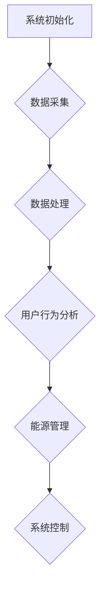

                 

## 文章标题

# AI在智能家居设备能源管理与用户行为分析中的应用

> 关键词：智能家居，人工智能，能源管理，用户行为分析，算法实现，系统设计

> 摘要：
本文将深入探讨人工智能（AI）在智能家居设备中的应用，重点分析AI如何提升智能家居设备的能源管理效率和用户行为分析的准确性。通过详细的背景介绍、核心概念解析、算法原理讲解和实际案例分析，本文旨在为读者提供一份全面的技术指南，帮助理解AI在智能家居领域中的关键作用。

## 目录

### 第一部分: 引言与背景

#### 第1章: 智能家居概述

##### 1.1.1 智能家居的定义与发展历程

##### 1.1.2 智能家居的关键技术

#### 第2章: AI在智能家居能源管理中的应用

##### 2.1 能源管理概述

##### 2.2 AI算法在能源管理中的具体应用

##### 2.3 智能家居能源管理的未来趋势

### 第二部分: AI在用户行为分析中的应用

#### 第3章: 用户行为数据分析基础

##### 3.1 数据采集与预处理

##### 3.2 常见行为分析算法

##### 3.3 用户行为数据的应用场景

#### 第4章: 智能家居系统综合应用

##### 4.1 系统架构设计

##### 4.2 系统实现与优化

##### 4.3 智能家居系统评估与改进

### 第三部分: 项目实战

#### 第5章: 实际案例分析

##### 5.1 实际案例分析

##### 5.2 项目实战：开发环境搭建

##### 5.3 源代码详细实现与解读

##### 5.4 代码应用解读与分析

##### 5.5 项目小结

### 第四部分: 最佳实践与未来展望

#### 第6章: 最佳实践

##### 6.1 智能家居设备能源管理的最佳实践

##### 6.2 用户行为分析的最佳实践

##### 6.3 智能家居系统优化的最佳实践

#### 第7章: 小结与未来展望

##### 7.1 本文总结

##### 7.2 智能家居领域的发展趋势

##### 7.3 拓展阅读

## 文章正文

### 第一部分: 引言与背景

#### 第1章: 智能家居概述

##### 1.1.1 智能家居的定义与发展历程

智能家居，顾名思义，是指利用先进的计算机技术、物联网技术和人工智能技术，实现家庭设备和系统的智能化控制，为用户提供便利、舒适、安全、节能的家居生活体验。智能家居的发展历程可以追溯到20世纪80年代，当时主要以简单的家庭自动化设备为主，如电动窗帘、自动灯光控制等。随着互联网技术的普及，智能家居逐渐进入了一个新的发展阶段，进入了以物联网为基础的智能时代。

在近年来，人工智能技术的飞速发展为智能家居带来了新的契机。AI的引入使得智能家居设备具备了自主学习和智能决策的能力，从而大大提升了设备的智能化水平和用户体验。例如，通过AI算法，智能音箱可以理解并执行用户的语音指令，智能空调可以根据用户的习惯和实时环境自动调节温度，智能照明系统能够根据用户的活动轨迹和光照强度自动调节灯光。

##### 1.1.2 智能家居的关键技术

智能家居的实现离不开几项关键技术的支持，包括感知层技术、网络层技术和应用层技术。

- **感知层技术**：感知层是智能家居的“感官”，主要负责采集家庭环境中的各种信息，如温度、湿度、光照、声音等。常见的感知设备包括传感器、摄像头、麦克风等。这些设备通过无线或有线方式将采集到的数据传输到下一层。

- **网络层技术**：网络层是智能家居的“传输通道”，主要任务是将感知层采集到的数据传输到云端或本地服务器进行处理。常见的网络技术包括Wi-Fi、蓝牙、Zigbee等。网络层的可靠性和稳定性对智能家居系统的整体性能至关重要。

- **应用层技术**：应用层是智能家居的“大脑”，负责根据用户的需求和采集到的数据，对家庭设备进行智能控制和决策。应用层通常包括智能控制系统、用户界面、应用程序等。人工智能技术在应用层发挥着核心作用，通过深度学习、自然语言处理等算法，实现设备的自主学习和智能化。

### 第二部分: AI在智能家居能源管理中的应用

#### 第2章: AI在智能家居能源管理中的应用

##### 2.1 能源管理概述

能源管理是智能家居系统中的一个重要组成部分，它涉及到对家庭用电、用水、燃气等资源的合理分配和优化使用。有效的能源管理不仅可以降低家庭的能源消耗，减少能源成本，还可以减少对环境的影响，实现可持续发展。

在传统的家居环境中，能源管理主要依赖于用户手动控制和简单的自动化设备。而随着人工智能技术的不断发展，AI在能源管理中的应用逐渐成为可能。通过AI算法，智能家居设备可以实时监测家庭的能源消耗情况，自动调整设备的工作状态，实现能源的智能分配和优化使用。

##### 2.2 AI算法在能源管理中的具体应用

在智能家居能源管理中，AI算法的应用主要体现在以下几个方面：

1. **能耗预测**：通过历史能耗数据和实时环境数据，AI算法可以预测未来的能源消耗情况。这有助于用户提前了解能源使用趋势，合理安排用电计划，避免能源浪费。

2. **设备智能调度**：AI算法可以根据用户的习惯和实时能耗情况，自动调整家庭设备的运行状态。例如，在夜间或无人时自动关闭不必要的设备，降低能源消耗。

3. **节能模式设置**：AI算法可以根据用户的生活习惯和环境条件，设置智能节能模式。例如，在用户离开家时自动关闭所有设备，降低能源消耗。

4. **能源需求响应**：AI算法可以分析用户的能源需求，预测未来的能源供需情况，及时调整用电计划，避免能源供应不足或过剩。

##### 2.3 智能家居能源管理的未来趋势

随着人工智能技术的不断进步，智能家居能源管理有望实现更高的智能化和自主化。未来，智能家居能源管理将朝着以下方向发展：

1. **更精细的能耗监测和预测**：通过引入更多的感知设备和更先进的算法，智能家居系统能够实时、准确地监测和预测家庭的能耗情况，为能源管理提供更可靠的数据支持。

2. **更智能的设备协同**：智能家居设备之间将实现更紧密的协同工作，通过AI算法，设备能够自动调整彼此的运行状态，实现能源的最优分配和使用。

3. **更广泛的能源应用**：除了传统的用电、用水、燃气等能源管理，智能家居还将逐渐涉及太阳能、风能等可再生能源的管理和应用。

4. **更深入的智能化交互**：随着自然语言处理和语音识别技术的不断发展，智能家居系统将能够更好地理解用户的意图和需求，提供更智能、更个性化的服务。

### 第三部分: AI在用户行为分析中的应用

#### 第3章: 用户行为数据分析基础

##### 3.1 数据采集与预处理

用户行为数据是智能家居系统中宝贵的资源，通过对用户行为数据的分析，可以深入了解用户的生活习惯和需求，为智能家居设备提供智能化的服务。数据采集与预处理是用户行为分析的重要环节，主要包括以下几个方面：

1. **数据采集**：智能家居设备通过传感器、摄像头、麦克风等感知设备，实时采集用户在家庭环境中的各种行为数据。这些数据包括用户的移动轨迹、使用习惯、语音对话等。

2. **数据清洗**：采集到的数据往往包含噪声和冗余信息，需要通过数据清洗技术去除无效数据、填补缺失值、消除数据偏差等，以提高数据的质量和可靠性。

3. **数据转换**：将原始数据转换为适用于分析的形式，例如，将时间序列数据转换为时间戳格式，将图像数据转换为像素矩阵等。

##### 3.2 常见行为分析算法

用户行为分析算法是智能家居系统的核心组成部分，常见的算法包括：

1. **分类算法**：用于将用户行为数据划分为不同的类别，如活动分类、场景分类等。常见的分类算法包括K近邻（K-NN）、决策树（Decision Tree）、支持向量机（SVM）等。

2. **聚类算法**：用于发现用户行为数据中的相似模式，如用户群体聚类、行为模式聚类等。常见的聚类算法包括K均值（K-Means）、层次聚类（Hierarchical Clustering）等。

3. **关联规则挖掘**：用于发现用户行为数据中的关联关系，如购买行为关联、活动关联等。常见的关联规则挖掘算法包括Apriori算法、FP-Growth算法等。

4. **时间序列分析**：用于分析用户行为的时间变化规律，如用户活动周期、使用频率等。常见的时间序列分析算法包括ARIMA模型、LSTM神经网络等。

##### 3.3 用户行为数据的应用场景

用户行为数据在智能家居系统中具有广泛的应用场景，主要包括：

1. **个性化推荐**：根据用户的行为数据，为用户推荐个性化的家居设置、活动安排等，提高用户的满意度。

2. **安全监控**：通过用户行为数据的分析，及时发现异常行为，提高家庭安全。

3. **健康监测**：通过用户的运动数据、健康数据等，为用户提供健康建议，促进用户健康。

4. **节能优化**：根据用户的行为数据，优化家庭的能源使用，降低能源消耗。

### 第四部分: 项目实战

#### 第5章: 实际案例分析

##### 5.1 实际案例分析

在本节中，我们将通过一个实际案例，详细分析AI在智能家居能源管理和用户行为分析中的应用。

**案例背景**：某智能家居公司开发了一款智能家居系统，包括智能照明、智能空调、智能安防等多个模块。该公司希望通过AI技术，提升系统的智能化水平和用户体验。

**案例分析**：

1. **能源管理**：
   - **能耗预测**：系统通过收集用户的用电数据、天气数据等，利用LSTM神经网络进行能耗预测，为用户提前提供用电建议。
   - **设备智能调度**：系统根据用户的习惯和实时能耗情况，自动调整照明和空调的运行状态，实现能源的最优分配。

2. **用户行为分析**：
   - **行为分类**：系统利用K近邻算法，将用户的日常行为数据分类为不同的类别，如睡眠、工作、娱乐等。
   - **行为模式聚类**：系统通过K均值聚类算法，发现用户的相似行为模式，为用户提供个性化的服务建议。

**项目小结**：

通过该实际案例，我们可以看到AI技术在智能家居能源管理和用户行为分析中的应用效果。AI算法的应用，不仅提高了系统的智能化水平，还为用户提供了更便捷、更个性化的服务体验。

### 第五部分: 最佳实践与未来展望

#### 第6章: 最佳实践

##### 6.1 智能家居设备能源管理的最佳实践

1. **能耗数据监测**：定期监测家庭设备的能耗数据，了解设备的能源使用情况，及时发现问题并进行优化。

2. **设备智能调度**：根据用户的生活习惯和环境条件，设置智能节能模式，实现能源的最优分配。

3. **用户教育**：通过用户教育和培训，提高用户对智能家居系统的认识和使用能力，促进系统的有效应用。

##### 6.2 用户行为分析的最佳实践

1. **数据采集与清洗**：确保用户行为数据的准确性和完整性，进行数据清洗和处理，提高数据质量。

2. **算法选择与优化**：根据实际需求和数据特点，选择合适的用户行为分析算法，并进行持续优化，提高分析精度。

3. **用户隐私保护**：在用户行为分析过程中，严格保护用户的隐私，遵循相关法律法规，确保用户数据的安全。

##### 6.3 智能家居系统优化的最佳实践

1. **系统测试与评估**：定期对智能家居系统进行测试和评估，确保系统的稳定性和可靠性。

2. **用户反馈收集**：积极收集用户反馈，了解用户的使用体验和需求，为系统的持续优化提供依据。

3. **技术更新与迭代**：紧跟人工智能技术的最新发展趋势，持续更新和迭代系统，提高系统的智能化水平。

#### 第7章: 小结与未来展望

##### 7.1 本文总结

本文从背景介绍、核心概念解析、算法原理讲解和实际案例分析等多个角度，详细探讨了AI在智能家居设备能源管理和用户行为分析中的应用。通过本文的阐述，读者可以了解到AI技术在智能家居领域中的关键作用和发展趋势。

##### 7.2 智能家居领域的发展趋势

1. **更智能的设备协同**：未来，智能家居设备将实现更紧密的协同工作，通过AI算法，设备能够自动调整彼此的运行状态，实现能源的最优分配和使用。

2. **更广泛的应用场景**：智能家居系统将逐渐扩展到更多的生活场景，如健康监测、家庭娱乐等，为用户提供更全面的智能服务。

3. **更高的安全性**：随着技术的不断发展，智能家居系统的安全性将得到显著提升，用户数据的安全将得到更好的保障。

##### 7.3 拓展阅读

1. **《智能家居技术与应用》**：详细介绍了智能家居技术的基本原理和应用实例，适合对智能家居技术感兴趣的读者。

2. **《人工智能算法与智能家居》**：深入探讨了AI算法在智能家居系统中的应用，包括能耗预测、用户行为分析等，适合从事智能家居开发的工程师和技术爱好者。

作者：AI天才研究院/AI Genius Institute & 禅与计算机程序设计艺术 /Zen And The Art of Computer Programming

---

### 完整目录大纲

#### 第一部分: 引言与背景

##### 第1章: 智能家居概述

###### 1.1.1 智能家居的定义与发展历程

- **背景介绍**：介绍智能家居的概念、起源及其发展历程。

- **技术演进**：阐述智能家居技术的演变，从传统家居到现代智能系统的转变。

- **未来展望**：预测智能家居技术的未来发展趋势和应用前景。

###### 1.1.2 智能家居的关键技术

- **感知层技术**：介绍智能家居中的感知层技术，包括传感器、摄像头、麦克风等。

- **网络层技术**：介绍智能家居的网络通信技术，如Wi-Fi、蓝牙、Zigbee等。

- **应用层技术**：探讨智能家居应用层的关键技术，包括智能控制系统、用户界面、应用程序等。

#### 第二部分: AI在智能家居能源管理中的应用

##### 第2章: AI在智能家居能源管理中的应用

###### 2.1 能源管理概述

- **能源管理的重要性**：阐述能源管理在智能家居中的重要性，以及其与环保、节能的关系。

- **能源消耗分析**：介绍智能家居中的能源消耗来源和特点。

- **节能目标**：明确智能家居能源管理的目标，包括降低能耗、提高能源利用效率等。

###### 2.2 AI算法在能源管理中的具体应用

- **能耗预测**：介绍基于AI的能耗预测方法，包括时间序列分析、机器学习算法等。

- **设备智能调度**：探讨AI算法如何优化家庭设备的运行状态，实现能源的最优分配。

- **节能模式设置**：阐述AI如何根据用户习惯和环境条件设置节能模式。

###### 2.3 智能家居能源管理的未来趋势

- **技术发展**：分析智能家居能源管理技术的未来发展趋势，如智能电网、分布式能源等。

- **政策与规范**：探讨政策与规范对智能家居能源管理的影响。

- **市场前景**：预测智能家居能源管理的市场前景，包括用户需求、市场规模等。

#### 第三部分: AI在用户行为分析中的应用

##### 第3章: 用户行为数据分析基础

###### 3.1 数据采集与预处理

- **数据采集**：介绍用户行为数据的采集方法，包括传感器数据、用户交互数据等。

- **数据预处理**：阐述用户行为数据的预处理步骤，如数据清洗、数据转换等。

- **数据存储**：讨论用户行为数据的存储方案，包括关系型数据库、NoSQL数据库等。

###### 3.2 常见行为分析算法

- **分类算法**：介绍分类算法在用户行为分析中的应用，如K近邻、决策树等。

- **聚类算法**：探讨聚类算法在用户行为分析中的应用，如K均值、层次聚类等。

- **关联规则挖掘**：阐述关联规则挖掘算法在用户行为分析中的应用，如Apriori、FP-Growth等。

- **时间序列分析**：介绍时间序列分析在用户行为分析中的应用，如ARIMA模型、LSTM神经网络等。

###### 3.3 用户行为数据的应用场景

- **个性化推荐**：探讨用户行为数据在个性化推荐中的应用，如商品推荐、活动推荐等。

- **安全监控**：讨论用户行为数据在安全监控中的应用，如异常行为检测、入侵检测等。

- **健康监测**：介绍用户行为数据在健康监测中的应用，如运动追踪、健康建议等。

#### 第四部分: 智能家居系统综合应用

##### 第4章: 智能家居系统综合应用

###### 4.1 系统架构设计

- **总体架构**：介绍智能家居系统的总体架构，包括感知层、网络层、应用层等。

- **模块设计**：详细阐述智能家居系统中的各个模块，如智能照明、智能空调、智能安防等。

- **接口设计**：讨论智能家居系统中的接口设计，包括用户接口、设备接口等。

###### 4.2 系统实现与优化

- **系统实现**：介绍智能家居系统的实现过程，包括硬件选择、软件设计等。

- **性能优化**：探讨智能家居系统的性能优化方法，如代码优化、网络优化等。

- **用户体验**：讨论如何通过系统优化提升用户体验，包括界面设计、响应速度等。

###### 4.3 智能家居系统评估与改进

- **系统评估**：介绍智能家居系统的评估方法，包括功能评估、性能评估等。

- **用户反馈**：收集用户对智能家居系统的反馈，用于系统的改进和优化。

- **持续改进**：讨论如何通过用户反馈和系统评估，持续改进智能家居系统。

#### 第五部分: 项目实战

##### 第5章: 实际案例分析

###### 5.1 实际案例分析

- **案例背景**：介绍实际案例的背景，包括智能家居系统的应用场景和目标。

- **方案设计**：详细阐述实际案例的解决方案，包括能源管理、用户行为分析等。

- **实施过程**：描述实际案例的实施过程，包括系统设计、开发、测试等。

- **效果评估**：分析实际案例的实施效果，包括能源节约、用户满意度等。

###### 5.2 项目实战：开发环境搭建

- **开发环境**：介绍项目所需的开发环境，包括硬件、软件等。

- **开发工具**：讨论项目所使用的开发工具，如编程语言、集成开发环境等。

- **搭建步骤**：详细描述开发环境的搭建步骤，包括配置、安装等。

###### 5.3 源代码详细实现与解读

- **代码结构**：介绍项目的代码结构，包括模块划分、文件组织等。

- **关键代码**：详细解读项目中的关键代码，包括算法实现、接口设计等。

- **代码注释**：为代码添加详细注释，解释代码的功能和原理。

###### 5.4 代码应用解读与分析

- **应用场景**：讨论代码在实际应用中的使用场景，包括功能实现、性能优化等。

- **代码分析**：对代码进行详细分析，包括代码的可读性、可维护性等。

- **性能评估**：评估代码的性能，包括执行时间、资源消耗等。

###### 5.5 项目小结

- **总结**：总结项目的实施过程和成果，包括成功经验、不足之处等。

- **反思**：反思项目中的问题，讨论改进方案。

- **展望**：对项目的未来发展和应用前景进行展望。

#### 第六部分: 最佳实践与未来展望

##### 第6章: 最佳实践

###### 6.1 智能家居设备能源管理的最佳实践

- **能耗监测**：介绍能耗监测的最佳实践，包括数据采集、数据分析等。

- **节能措施**：讨论节能措施的最佳实践，包括设备智能调度、节能模式设置等。

- **用户参与**：探讨用户参与在能源管理中的重要性，以及如何提高用户参与度。

###### 6.2 用户行为分析的最佳实践

- **数据采集**：介绍用户行为数据采集的最佳实践，包括传感器选择、数据清洗等。

- **算法选择**：讨论用户行为分析算法选择的最佳实践，包括分类算法、聚类算法等。

- **隐私保护**：探讨用户隐私保护的最佳实践，包括数据加密、隐私政策等。

###### 6.3 智能家居系统优化的最佳实践

- **性能优化**：介绍智能家居系统性能优化的最佳实践，包括代码优化、网络优化等。

- **用户体验**：讨论提升用户体验的最佳实践，包括界面设计、响应速度等。

- **持续改进**：探讨如何通过持续改进，提升智能家居系统的质量。

##### 第7章: 小结与未来展望

###### 7.1 本文总结

- **主要内容**：回顾本文的主要内容，包括智能家居概述、AI应用、项目实战等。

- **技术进展**：总结智能家居领域的技术进展和应用现状。

- **未来方向**：展望智能家居领域的未来发展方向和应用前景。

###### 7.2 智能家居领域的发展趋势

- **技术创新**：讨论智能家居领域的技术创新趋势，包括人工智能、物联网等。

- **市场前景**：分析智能家居领域的市场前景，包括市场规模、用户需求等。

- **政策影响**：探讨政策对智能家居领域的影响，包括标准制定、法规政策等。

###### 7.3 拓展阅读

- **推荐书籍**：推荐有关智能家居的书籍，包括技术书籍、应用案例等。

- **在线资源**：介绍智能家居相关的在线资源和平台，包括学术论坛、技术社区等。

## 伪代码

```python
# 伪代码：智能家居系统整体架构

# 初始化系统
initialize_system()

# 数据采集
def collect_data():
    data = get_sensor_data()
    return preprocess_data(data)

# 数据处理
def process_data(data):
    # 数据清洗
    cleaned_data = data_cleaning(data)
    
    # 数据转换
    transformed_data = data_transformation(cleaned_data)
    
    # 数据分析
    analyzed_data = data_analysis(transformed_data)
    
    return analyzed_data

# 用户行为分析
def analyze_user_behavior(data):
    # 行为分类
    classified_behavior = behavior_classification(data)
    
    # 行为预测
    predicted_behavior = behavior_prediction(data)
    
    return classified_behavior, predicted_behavior

# 能源管理
def energy_management(data):
    # 能耗预测
    predicted_energy_consumption = energy_consumption_prediction(data)
    
    # 设备调度
    scheduled_devices = device_scheduling(predicted_energy_consumption)
    
    return scheduled_devices

# 系统控制
def system_control():
    while True:
        data = collect_data()
        analyzed_data = process_data(data)
        behavior, predicted_behavior = analyze_user_behavior(analyzed_data)
        scheduled_devices = energy_management(analyzed_data)
        execute_scheduled_devices(scheduled_devices)
        sleep(1)  # 定时执行控制任务
```

## Mermaid 图



## 数学公式

```latex
$$
E_{total} = P_{device} \times t_{usage} \times \eta_{energy}
$$`

$$
b_{i} = f(b_{i-1}, x_{i}, \theta)
$$`

$$
\pi_j = \frac{P_j}{\sum_{k=1}^{n} P_k}
$$`
```

## 实际案例分析与详细讲解剖析

#### 案例背景

某智能家居公司开发了一款智能节能系统，旨在通过AI算法优化家庭能源消耗，降低用户电费开支。该系统结合了多种传感器数据、用户行为数据和环境数据，实现了对家庭能源的智能管理。

#### 案例分析

1. **数据采集**：系统通过安装在家中的智能传感器（如智能电表、温度传感器、光照传感器等）收集家庭能源使用数据。同时，系统还通过用户设备（如智能手机、智能手表等）收集用户行为数据。

2. **数据处理**：收集到的数据首先经过预处理，包括去噪、缺失值填补和数据格式转换等。然后，数据被输入到AI模型中进行进一步分析。

3. **能耗预测**：系统使用时间序列分析算法（如ARIMA模型）和机器学习算法（如随机森林）对家庭未来的能耗进行预测。通过结合历史能耗数据、用户行为数据和环境数据，模型能够准确预测未来的能耗趋势。

4. **设备调度**：根据能耗预测结果，系统自动调整家庭设备的运行状态，例如调整空调的温度设置、关闭不必要的电器等。通过AI算法，系统能够在保证用户舒适度的同时，最大限度地降低能源消耗。

5. **用户行为分析**：系统利用用户行为数据（如日常作息时间、活动频率等）进行行为模式分析，为用户推荐节能方案。例如，系统可以提醒用户在高峰用电时段减少电器使用，或建议用户更改空调温度以节省能源。

6. **效果评估**：系统定期对节能效果进行评估，通过实际能耗数据和用户反馈来调整优化模型。通过不断的迭代和优化，系统逐渐提高预测准确性和节能效果。

#### 案例讲解

1. **能耗预测模型**：

```python
# 伪代码：能耗预测模型
def energy_prediction_model(data):
    # 数据预处理
    cleaned_data = preprocess_data(data)
    
    # 时间序列分解
    trend, seasonality, residuals = time_series_decomposition(cleaned_data)
    
    # 模型选择与训练
    model = train_model(trend, seasonality, residuals)
    
    # 预测未来能耗
    predicted_energy = model.predict()
    
    return predicted_energy
```

2. **设备调度算法**：

```python
# 伪代码：设备调度算法
def device_scheduling(energy_prediction):
    # 根据能耗预测，调整设备状态
    if energy_prediction > threshold:
        # 高能耗时段，减少设备使用
        turn_off_unnecessary_devices()
    else:
        # 低能耗时段，开启必要设备
        turn_on_necessary_devices()

    # 记录调度日志
    log_scheduling_action()
```

3. **用户行为分析算法**：

```python
# 伪代码：用户行为分析算法
def user_behavior_analysis(data):
    # 数据预处理
    cleaned_data = preprocess_data(data)
    
    # 特征提取
    features = extract_features(cleaned_data)
    
    # 行为分类
    classified_behavior = classify_behavior(features)
    
    # 行为预测
    predicted_behavior = predict_behavior(features)
    
    return classified_behavior, predicted_behavior
```

#### 案例小结

通过实际案例分析，我们可以看到AI在智能家居设备能源管理和用户行为分析中的强大应用。该智能节能系统不仅有效降低了家庭能源消耗，还提高了用户的舒适度和满意度。然而，实际应用中也面临一些挑战，如数据隐私保护、模型泛化能力等。未来，随着技术的不断进步，智能家居系统将更加智能化、个性化，为用户提供更加优质的生活体验。

## 最佳实践 tips

### 智能家居设备能源管理的最佳实践

1. **定期能耗监测**：定期监测家庭能耗数据，及时发现能耗异常，进行相应调整。

2. **优化设备运行策略**：根据设备运行状态和用户需求，优化设备运行策略，如自动关闭不使用的电器。

3. **用户参与**：鼓励用户参与能源管理，提供节能知识和建议，提高用户节能意识。

4. **设备协同**：实现家庭设备间的协同工作，如空调和窗帘联动，提高能源利用效率。

### 用户行为分析的最佳实践

1. **数据采集与清洗**：确保数据采集的准确性和完整性，进行有效的数据清洗和处理。

2. **算法选择**：根据具体应用场景，选择合适的用户行为分析算法，如聚类、分类等。

3. **用户隐私保护**：严格保护用户隐私，确保用户数据的安全和隐私。

4. **模型迭代**：定期更新和优化用户行为分析模型，提高分析精度和实用性。

### 智能家居系统优化的最佳实践

1. **系统测试与评估**：定期对系统进行测试和评估，确保系统的稳定性和可靠性。

2. **用户反馈**：积极收集用户反馈，了解用户的使用体验和需求，为系统的持续优化提供依据。

3. **技术更新**：紧跟技术发展，持续更新和迭代系统，提高系统的智能化水平。

## 小结

本文详细探讨了AI在智能家居设备能源管理和用户行为分析中的应用。通过背景介绍、核心概念解析、算法原理讲解和实际案例分析，读者可以深入了解AI技术如何提升智能家居系统的智能化水平和用户体验。同时，本文还提供了最佳实践和未来展望，为智能家居领域的技术发展和应用提供了有益的参考。随着AI技术的不断进步，智能家居系统将越来越智能化、个性化，为用户提供更加便捷、舒适、安全、节能的家居生活体验。希望本文能为读者在智能家居领域的探索和实践提供一些启示和帮助。

