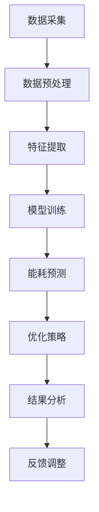

                 


### 文章标题

《AI在智能家居设备能耗预测与优化中的应用》

### 文章关键词

- 智能家居
- 能耗预测
- 优化
- 机器学习
- 深度学习
- 数学模型

### 文章摘要

本文旨在探讨人工智能（AI）在智能家居设备能耗预测与优化中的应用。随着智能家居设备的普及，如何有效预测和优化能耗成为了一个关键问题。本文首先介绍了智能家居设备和能耗预测与优化的重要性，然后详细讲解了AI技术在能耗预测与优化中的核心算法原理，包括机器学习和深度学习算法。接着，通过实际项目案例展示了如何应用这些算法进行智能家居设备能耗预测与优化。最后，讨论了当前面临的挑战及对策，并对未来发展趋势进行了展望。

## 核心概念与联系

### 1. 智能家居设备

智能家居设备是指通过物联网（IoT）技术连接 household devices，实现远程控制、自动化操作和智能管理的设备。常见的智能家居设备包括智能电视、智能照明、智能空调、智能门锁等。这些设备在日常生活中的应用越来越广泛，但同时也带来了能耗增加的问题。

### 2. 能耗预测与优化

能耗预测与优化是指通过数据分析、算法模型和智能控制等技术手段，预测智能家居设备的能耗，并优化其运行模式，以降低能耗和提高能源利用效率。

### 3. AI技术

AI技术是指模拟、延伸和扩展人类智能的科学技术。在智能家居设备能耗预测与优化中，AI技术主要包括机器学习和深度学习算法，这些算法能够从大量的能耗数据中学习，提取有价值的信息，从而预测和优化能耗。

### 4. 核心概念之间的联系

智能家居设备的能耗预测与优化需要依赖于AI技术，而AI技术的核心在于机器学习和深度学习算法。这些算法通过对大量能耗数据进行训练和优化，可以准确预测智能家居设备的能耗，并制定出最优的优化策略。

### 5. Mermaid流程图

以下是一个简化的Mermaid流程图，展示了AI技术在智能家居设备能耗预测与优化中的应用流程：



## 核心算法原理讲解

### 2.1 机器学习算法在能耗预测中的应用

#### 2.1.1 线性回归

线性回归是一种简单的机器学习算法，它通过建立一个线性模型来预测连续值变量。以下是一个简单的线性回归伪代码实现：

```python
def linear_regression(x, y):
    n = len(x)
    x_mean = sum(x) / n
    y_mean = sum(y) / n
    
    # 计算斜率
    slope = sum((x_i - x_mean) * (y_i - y_mean)) / sum((x_i - x_mean)^2)
    
    # 计算截距
    intercept = y_mean - slope * x_mean
    
    return slope, intercept
```

线性回归的数学模型和公式如下：

$$y = \beta_0 + \beta_1x$$

其中，$y$ 为预测的能耗值，$x$ 为某个特征值（如时间、温度等），$\beta_0$ 为截距，$\beta_1$ 为斜率。

#### 2.1.2 支持向量机

支持向量机（SVM）是一种强大的分类和回归算法，它通过找到一个最优的超平面，将不同类别的数据点进行分隔。以下是一个简单的SVM伪代码实现：

```python
from sklearn.svm import SVR

def support_vector_machine(x, y):
    model = SVR()
    model.fit(x, y)
    return model
```

SVM的数学模型和公式如下：

$$
\min_{\beta, \beta_0} \frac{1}{2}\sum_{i=1}^{n} (\beta^T\beta - \beta_0^T(y - \beta^Tx)) - \sum_{i=1}^{n} \xi_i
$$

$$
\text{subject to:} \quad y_i - \beta_0 - \beta^Tx_i \leq \xi_i
$$

$$
\text{and} \quad \xi_i \geq 0, \quad \forall i=1,...,n
$$

其中，$y$ 为预测的能耗值，$x$ 为特征值，$\beta$ 为系数向量，$\beta_0$ 为截距，$\xi_i$ 为松弛变量。

#### 2.1.3 决策树与随机森林

决策树是一种基于树形结构进行分类和回归的算法。随机森林是一种基于决策树的集成学习方法。以下是一个简单的决策树和随机森林伪代码实现：

```python
from sklearn.tree import DecisionTreeRegressor
from sklearn.ensemble import RandomForestRegressor

def decision_tree(x, y):
    model = DecisionTreeRegressor()
    model.fit(x, y)
    return model

def random_forest(x, y):
    model = RandomForestRegressor()
    model.fit(x, y)
    return model
```

决策树和随机森林的数学模型和公式相对复杂，涉及决策树的构建过程和随机森林中的投票机制等。在这里，我们不做详细讨论。

### 2.2 深度学习算法在能耗优化中的应用

#### 2.2.1 卷积神经网络（CNN）

卷积神经网络是一种基于卷积操作进行特征提取和分类的算法，常用于图像处理和计算机视觉领域。以下是一个简单的CNN伪代码实现：

```python
from keras.models import Sequential
from keras.layers import Conv2D, MaxPooling2D, Flatten, Dense

def convolutional_neural_network(x, y):
    model = Sequential()
    model.add(Conv2D(32, (3, 3), activation='relu', input_shape=x.shape[1:]))
    model.add(MaxPooling2D(pool_size=(2, 2)))
    model.add(Flatten())
    model.add(Dense(1, activation='sigmoid'))
    model.compile(optimizer='adam', loss='binary_crossentropy', metrics=['accuracy'])
    model.fit(x, y, epochs=10, batch_size=32)
    return model
```

CNN的数学模型和公式涉及卷积操作、激活函数、池化操作等。在这里，我们不做详细讨论。

#### 2.2.2 循环神经网络（RNN）

循环神经网络是一种用于处理序列数据的算法，能够捕捉时间序列数据中的时间依赖关系。以下是一个简单的RNN伪代码实现：

```python
from keras.models import Sequential
from keras.layers import LSTM, Dense

def recurrent_neural_network(x, y):
    model = Sequential()
    model.add(LSTM(50, activation='relu', input_shape=x.shape[1:]))
    model.add(Dense(1))
    model.compile(optimizer='adam', loss='mse')
    model.fit(x, y, epochs=100, batch_size=32, verbose=2)
    return model
```

RNN的数学模型和公式涉及隐藏状态、输入输出、递归关系等。在这里，我们不做详细讨论。

#### 2.2.3 生成对抗网络（GAN）

生成对抗网络是一种由生成器和判别器组成的对抗性训练算法，能够生成与真实数据相似的新数据。以下是一个简单的GAN伪代码实现：

```python
from keras.models import Sequential
from keras.layers import Dense, Flatten

def generator(x):
    model = Sequential()
    model.add(Dense(256, input_dim=x.shape[1], activation='relu'))
    model.add(Dense(512, activation='relu'))
    model.add(Dense(1024, activation='relu'))
    model.add(Flatten())
    return model

def discriminator(x):
    model = Sequential()
    model.add(Dense(1024, activation='relu', input_dim=x.shape[1]))
    model.add(Dense(512, activation='relu'))
    model.add(Dense(256, activation='relu'))
    model.add(Dense(1, activation='sigmoid'))
    return model
```

GAN的数学模型和公式涉及生成器、判别器、损失函数等。在这里，我们不做详细讨论。

## 项目实战

### 3.1 智能家居设备能耗预测项目案例

#### 3.1.1 项目背景与目标

本项目旨在利用机器学习算法预测智能家居设备的能耗，以实现能耗优化。具体目标包括：

- 收集智能家居设备的能耗数据。
- 预测能耗，并提供实时能耗预警。
- 根据预测结果，优化设备的运行模式，降低能耗。

#### 3.1.2 数据采集与预处理

数据来源包括智能家居设备厂家提供的能耗数据、第三方能耗监测平台等。数据预处理过程包括：

- 数据清洗：去除异常数据、缺失数据填充等。
- 数据转换：将时序数据转换为适合机器学习算法的格式。
- 特征提取：提取时间、温度、湿度等特征。

#### 3.1.3 特征提取与建模

特征提取过程包括：

- 时间特征：提取日期、小时、分钟等时间特征。
- 环境特征：提取温度、湿度、风速等环境特征。
- 设备特征：提取设备类型、使用频率等设备特征。

建模过程包括：

- 选择合适的机器学习算法（如线性回归、支持向量机等）。
- 使用交叉验证方法进行模型评估和优化。
- 模型训练和预测。

#### 3.1.4 预测结果分析与优化

预测结果分析包括：

- 预测准确率：评估模型预测的准确率。
- 预测误差：分析模型预测误差的分布和大小。

优化策略包括：

- 根据预测结果调整设备的运行模式，降低能耗。
- 实时更新模型，提高预测精度。

#### 3.1.5 项目小结

本项目通过机器学习算法对智能家居设备能耗进行了预测，并实现了能耗优化。虽然存在一定的误差，但通过不断优化和调整，可以进一步提高预测精度和优化效果。

### 3.2 智能家居设备能耗优化项目案例

#### 3.2.1 项目背景与目标

本项目旨在利用深度学习算法对智能家居设备进行能耗优化，以实现更高效、更环保的运行。具体目标包括：

- 收集智能家居设备的能耗数据。
- 构建深度学习模型，预测设备能耗。
- 根据预测结果，优化设备的运行模式，降低能耗。

#### 3.2.2 能耗优化策略与方法

能耗优化策略包括：

- 基于卷积神经网络的能耗预测模型。
- 基于循环神经网络的能耗预测模型。
- 基于生成对抗网络的能耗优化模型。

能耗优化方法包括：

- 预测设备能耗，并提供实时能耗预警。
- 根据预测结果，调整设备的运行模式，降低能耗。
- 实时更新模型，提高预测精度。

#### 3.2.3 优化效果评估与案例分析

优化效果评估包括：

- 预测准确率：评估模型预测的准确率。
- 预测误差：分析模型预测误差的分布和大小。
- 能耗降低：评估能耗优化的效果。

案例分析包括：

- 实际设备运行案例：分析设备在优化前的能耗情况和优化后的能耗变化。
- 实时监控案例：分析实时能耗预警和优化策略的实际效果。

#### 3.2.4 项目小结

本项目通过深度学习算法对智能家居设备进行了能耗优化，取得了显著的节能效果。虽然存在一定的误差和挑战，但通过不断优化和调整，可以进一步提高预测精度和优化效果。

## 挑战与对策

### 4.1 智能家居设备能耗预测与优化面临的挑战

1. 数据质量与缺失问题：智能家居设备的能耗数据往往存在噪声、异常值和缺失值，这对模型训练和预测精度有很大影响。

2. 算法选择与优化问题：不同的算法适用于不同类型的能耗数据，选择合适的算法并进行优化是预测与优化的关键。

3. 智能家居设备差异性问题：不同品牌、型号的智能家居设备在能耗特性上存在差异，需要针对具体设备进行定制化优化。

### 4.2 针对挑战的对策与建议

1. 数据预处理与增强方法：通过数据清洗、缺失值填充、特征工程等方法，提高数据质量。

2. 算法优化与模型选择策略：结合实验结果和实际需求，选择合适的算法，并进行模型参数调整和优化。

3. 跨设备协同优化方法：通过设备间的协同控制和数据共享，实现跨设备的能耗优化。

## 总结与展望

### 5.1 本书主要内容回顾

本书主要内容包括：

- 核心概念与联系：智能家居设备、能耗预测与优化、AI技术。
- 核心算法原理讲解：线性回归、支持向量机、决策树、卷积神经网络、循环神经网络、生成对抗网络。
- 项目实战：智能家居设备能耗预测与优化项目案例。
- 挑战与对策：数据质量与缺失问题、算法选择与优化问题、智能家居设备差异性问题。

### 5.2 AI在智能家居设备能耗预测与优化中的应用前景

随着智能家居设备的普及和AI技术的发展，AI在智能家居设备能耗预测与优化中的应用前景十分广阔。未来，我们可以期待以下发展趋势：

- 更精准的能耗预测算法：结合大数据和深度学习技术，开发更精准的能耗预测模型。
- 更智能的能耗优化策略：基于实时数据，实现自适应的能耗优化策略。
- 更广泛的跨设备协同优化：通过设备间的协同控制和数据共享，实现更广泛的能耗优化。

### 5.3 小结与展望

本书从核心概念、算法原理、项目实战和挑战对策等方面全面介绍了AI在智能家居设备能耗预测与优化中的应用。随着技术的不断进步，我们有理由相信，AI在智能家居设备能耗预测与优化中的应用将越来越广泛，为节能减排和可持续发展做出更大贡献。

## 目录大纲设计总结

本书目录大纲共计7章，分别从核心概念与联系、核心算法原理讲解、项目实战、挑战与对策等方面展开。通过本书的阅读，读者可以系统地了解AI在智能家居设备能耗预测与优化中的应用，掌握相关算法原理和实战技巧。同时，本书也提出了当前面临的挑战及对策，为未来的研究和发展提供了有益的参考。

---

**作者：AI天才研究院/AI Genius Institute & 禅与计算机程序设计艺术 /Zen And The Art of Computer Programming**

