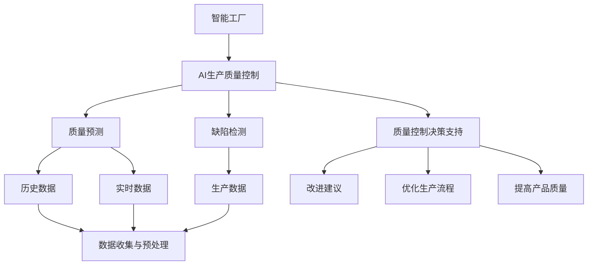
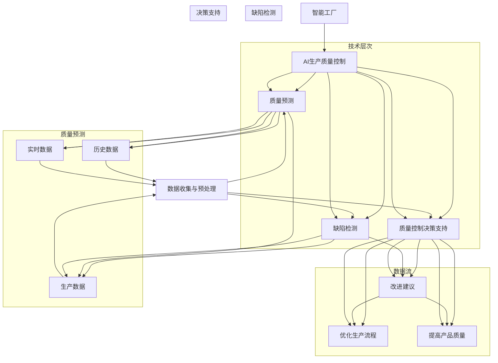

                 


### 核心概念与联系：智能工厂、AI生产质量控制、质量预测、缺陷检测、质量控制决策支持

在本文中，我们将探讨AI在智能工厂生产质量控制中的全流程应用。首先，我们需要明确几个核心概念：

**智能工厂**：智能工厂是一种高度自动化和数字化的制造模式，通过集成人工智能、物联网、大数据分析等技术，实现生产过程的智能化管理。智能工厂的目标是提高生产效率、降低成本、保证产品质量。

**AI生产质量控制**：AI生产质量控制是指利用人工智能技术，对生产过程中的质量进行实时监控、预测、检测和决策支持。AI技术可以处理大量的生产数据，通过机器学习、深度学习等方法，发现生产过程中的潜在问题，并给出优化建议。

**质量预测**：质量预测是AI生产质量控制的重要组成部分。通过分析历史数据和实时数据，AI模型可以预测产品的质量趋势，提前发现潜在的质量问题。

**缺陷检测**：缺陷检测是AI在生产质量控制中的另一个关键环节。利用深度学习和计算机视觉技术，AI模型可以从生产数据中识别出缺陷产品，提高缺陷检测的准确性和效率。

**质量控制决策支持**：质量控制决策支持是指利用AI技术，为生产过程中的质量控制提供智能化的决策支持。通过分析数据，AI系统可以给出改进建议，优化生产流程，提高产品质量。

下面，我们将通过Mermaid流程图来展示这些核心概念之间的联系：


通过这个流程图，我们可以看到，AI生产质量控制是一个闭环系统，各个环节相互联系，共同确保生产过程的高质量。接下来，我们将深入探讨每个环节的具体应用。

### 背景介绍

智能工厂的崛起，是工业4.0时代到来的重要标志。随着物联网、大数据、云计算、人工智能等新技术的不断发展，制造业正经历着一场前所未有的变革。传统工厂的机械化、自动化水平不断提高，但仍然依赖于人工干预，生产效率较低，产品质量波动较大。而智能工厂通过引入AI技术，可以实现生产过程的全面数字化、智能化，大大提高了生产效率和质量。

AI生产质量控制正是智能工厂中的重要一环。传统的质量控制方法主要依赖于人工检测和经验判断，不仅效率低下，而且容易出现主观偏差。而AI技术可以通过机器学习、深度学习等方法，对生产数据进行分析和处理，实现质量预测、缺陷检测和决策支持，从而确保生产过程的高质量。

质量预测是AI生产质量控制的核心之一。通过对历史数据和实时数据进行分析，AI模型可以预测产品的质量趋势，提前发现潜在的质量问题。例如，在生产过程中，传感器可以实时采集各种物理量数据，如温度、压力、速度等。这些数据经过AI模型处理，可以预测产品的质量变化趋势，从而实现提前预警。

缺陷检测是AI在生产质量控制中的另一个关键环节。通过深度学习和计算机视觉技术，AI模型可以从生产数据中识别出缺陷产品，提高缺陷检测的准确性和效率。例如，在生产线上，摄像头可以实时拍摄产品图像，AI模型通过对图像进行分析，可以识别出产品的缺陷，从而实现自动分拣。

质量控制决策支持是AI在生产质量控制中的最后一环。通过分析生产数据，AI系统可以给出改进建议，优化生产流程，提高产品质量。例如，在出现质量问题后，AI系统可以分析数据，找出问题的根本原因，并提出相应的改进措施，从而实现持续改进。

总之，AI在智能工厂生产质量控制中的应用，不仅提高了生产效率和质量，还为制造业的数字化转型提供了重要支撑。接下来，我们将详细探讨AI在生产质量控制中的具体应用和实践。

### 核心概念与联系：智能工厂、AI生产质量控制、质量预测、缺陷检测、质量控制决策支持

在本文中，我们将深入探讨AI在智能工厂生产质量控制中的应用，涵盖从质量预测到缺陷检测，再到质量控制决策支持的全流程。首先，明确以下几个核心概念及其相互关系：

**智能工厂**：智能工厂是一种高度自动化和数字化的生产环境，其中设备、人员和资源通过物联网（IoT）连接，实现信息的实时交换和自动化的操作。智能工厂的核心在于利用AI技术，实现生产过程的智能化和优化。

**AI生产质量控制**：AI生产质量控制是指通过应用人工智能技术，如机器学习、深度学习和计算机视觉等，对生产过程中的质量控制问题进行预测、检测和优化。其目标在于提高生产效率，确保产品质量一致性，降低生产成本。

**质量预测**：质量预测是基于历史数据和实时数据，利用AI模型预测产品的质量趋势，从而在问题发生之前采取预防措施。这一环节依赖于大量的数据收集、清洗和处理，以及对统计模型和机器学习算法的深入应用。

**缺陷检测**：缺陷检测是利用AI技术，尤其是计算机视觉和深度学习算法，对生产过程中产生的产品进行实时检测，以识别出不合格产品。通过自动化检测，可以显著提高检测效率和准确性。

**质量控制决策支持**：质量控制决策支持系统利用AI分析生产数据，识别质量问题的关键因素，并提供优化建议和决策支持，帮助工厂管理者制定和执行改进措施。

为了更好地理解这些概念之间的关系，我们可以使用Mermaid流程图来展示它们之间的相互作用：



在这个流程图中，我们可以看到，智能工厂通过IoT设备和传感器实时收集数据，这些数据经过收集与预处理后，用于质量预测、缺陷检测和质量控制决策支持。质量预测和缺陷检测利用机器学习和深度学习算法，从数据中提取特征，识别模式和趋势。质量控制决策支持系统则根据预测和检测结果，提供优化建议，帮助工厂管理者采取相应的措施。

接下来，我们将逐一深入探讨每个环节的具体技术细节和应用实践。

### 第一部分：AI在智能工厂生产质量控制中的基础理论

#### 第1章：智能工厂与AI生产质量控制概述

##### 1.1 智能工厂的定义与发展历程

智能工厂，又称智能制造工厂或智能制造系统，是一种基于先进的信息技术和自动化技术，实现制造过程高度智能化和自动化的新型生产模式。智能工厂的核心在于将信息技术与制造技术深度融合，通过物联网（IoT）、大数据分析、云计算、人工智能等新技术，实现生产过程的高度自动化、智能化和高效化。

智能工厂的概念最早可以追溯到20世纪80年代的自动化工厂。随着计算机技术和网络技术的发展，自动化工厂逐渐向智能化方向发展。进入21世纪，特别是工业4.0时代的到来，智能工厂成为制造业发展的主流趋势。

工业4.0，又称第四次工业革命，其主要特征是利用物联网、大数据、云计算、人工智能等技术，实现制造过程的全面数字化、网络化和智能化。智能工厂在工业4.0中扮演着重要角色，被视为实现智能制造的关键环节。

智能工厂的发展历程可以分为以下几个阶段：

1. **自动化阶段**：20世纪80年代至90年代，自动化技术在制造业中得到广泛应用，以机器人、自动生产线等为代表的自动化设备大大提高了生产效率。

2. **信息化阶段**：20世纪90年代末至21世纪初，随着计算机和互联网的普及，制造业开始引入信息化技术，如企业资源规划（ERP）、客户关系管理（CRM）等，实现生产过程的数字化管理。

3. **智能化阶段**：21世纪初至今，人工智能、物联网、大数据等新技术在制造业中得到广泛应用，智能工厂成为制造业发展的新方向。

在智能工厂中，设备、人员和资源通过物联网连接，实现信息的实时交换和自动化的操作。智能工厂的主要特点包括：

- **高度自动化**：生产过程由自动化设备完成，减少人工干预，提高生产效率。

- **实时数据采集**：通过传感器和物联网技术，实时采集生产过程中的各种数据，实现数据的全面监控和分析。

- **智能化决策**：利用人工智能技术，对生产数据进行智能分析和处理，实现生产过程的自我优化和智能决策。

- **资源优化配置**：通过智能调度和优化，实现生产资源的最大化利用，降低生产成本。

- **质量保证**：通过实时监控和智能分析，确保产品质量，降低质量波动。

##### 1.2 AI在工业生产中的应用现状

人工智能（AI）作为智能工厂的核心技术之一，已经在工业生产中得到了广泛应用。AI在工业生产中的应用现状可以概括为以下几个方面：

1. **生产调度与优化**：AI技术可以优化生产调度，提高生产效率。通过机器学习算法，可以预测生产需求，优化生产计划，减少设备闲置和人员空闲。

2. **设备故障预测与维护**：利用AI技术，可以实现对设备运行状态的实时监控，预测设备故障，提前进行维护，减少设备停机时间和维护成本。

3. **质量控制**：AI技术在质量控制中的应用非常广泛，包括质量预测、缺陷检测和决策支持等。通过机器学习和深度学习算法，可以从大量生产数据中识别出质量问题和潜在缺陷，提高产品质量。

4. **生产过程自动化**：AI技术可以实现生产过程的自动化，如自动化生产线、自动化装配等。通过机器人、自动化设备等，实现生产过程的高度自动化，提高生产效率。

5. **供应链管理**：AI技术在供应链管理中的应用，可以优化供应链流程，降低库存成本，提高供应链效率。通过大数据分析和机器学习算法，可以预测供应链需求，优化采购和配送计划。

6. **智能维护与运营**：AI技术可以实现设备的智能维护和运营管理。通过传感器和物联网技术，实时监控设备状态，预测设备故障，制定维护计划，提高设备运行效率。

##### 1.3 AI生产质量控制的基本概念

AI生产质量控制是指利用人工智能技术，对生产过程中的质量控制问题进行预测、检测和优化。其基本概念包括以下几个方面：

1. **质量预测**：质量预测是基于历史数据和实时数据，利用AI模型预测产品的质量趋势，提前发现潜在的质量问题。通过质量预测，可以实现对产品质量的实时监控和提前预警。

2. **缺陷检测**：缺陷检测是利用AI技术，尤其是计算机视觉和深度学习算法，对生产过程中产生的产品进行实时检测，以识别出不合格产品。通过自动化检测，可以显著提高检测效率和准确性。

3. **决策支持**：决策支持是指利用AI技术，分析生产数据，识别质量问题的关键因素，并提供优化建议和决策支持，帮助工厂管理者制定和执行改进措施。

4. **数据采集与处理**：数据采集与处理是AI生产质量控制的基础。通过传感器和物联网技术，实时采集生产过程中的各种数据，如温度、压力、速度、振动等。这些数据经过清洗、归一化等处理，为质量预测、缺陷检测和决策支持提供数据支持。

5. **模型训练与优化**：模型训练与优化是AI生产质量控制的关键。通过机器学习和深度学习算法，从大量数据中提取特征，训练模型，实现对质量问题的自动识别和预测。同时，通过模型优化，可以提高预测的准确性和效率。

6. **系统集成与部署**：系统集成与部署是指将AI生产质量控制系统与其他生产管理系统进行集成，实现数据的无缝对接和自动化操作。通过系统部署，可以在生产过程中实现质量控制的自动化和智能化。

总之，AI生产质量控制通过质量预测、缺陷检测和决策支持等环节，实现对生产过程的高效管理和优化，提高产品质量和生产效率。在智能工厂中，AI生产质量控制发挥着重要作用，是实现智能制造的重要支撑。

#### 第2章：生产质量控制中的关键AI技术

##### 2.1 机器学习在质量预测中的应用

机器学习在质量预测中的应用是一项关键技术，通过分析大量历史数据和实时数据，可以预测产品的质量趋势，为生产过程提供前瞻性指导。以下是机器学习在质量预测中的具体应用步骤：

1. **数据收集与预处理**：首先，需要收集生产过程中的各种数据，包括产品尺寸、重量、温度、速度等。这些数据可以通过传感器、监控设备等实时采集。在数据收集过程中，可能存在缺失值、噪声数据等问题，因此需要进行数据清洗和预处理。数据清洗包括去除重复数据、填补缺失值、去除噪声数据等，以获得高质量的数据集。

2. **特征工程**：特征工程是机器学习的重要步骤，通过从原始数据中提取有用的特征，提高模型的预测能力。特征工程包括数据归一化、特征选择、特征组合等。例如，将温度、速度等连续数据进行归一化处理，使它们在同一量级上，便于模型处理。同时，通过特征选择，保留对质量预测有显著影响的关键特征，剔除无关或冗余的特征。

3. **模型选择与训练**：选择合适的机器学习算法，对数据集进行模型训练。常见的机器学习算法包括线性回归、决策树、支持向量机（SVM）、随机森林、神经网络等。在模型选择时，需要考虑模型的复杂度、训练时间、预测准确性等因素。对于质量预测问题，线性回归和神经网络等算法通常具有较好的预测效果。

   以下是线性回归模型的训练伪代码：

   ```python
   # 导入必要的库
   import numpy as np
   from sklearn.linear_model import LinearRegression

   # 加载数据
   X = np.load('features.npy')
   y = np.load('quality.npy')

   # 初始化模型
   model = LinearRegression()

   # 训练模型
   model.fit(X, y)

   # 预测
   predictions = model.predict(X)
   ```

4. **模型评估与优化**：在模型训练完成后，需要对模型进行评估，以验证其预测性能。常见的评估指标包括均方误差（MSE）、均方根误差（RMSE）、决定系数（R^2）等。根据评估结果，可以对模型进行优化，提高预测准确性。优化方法包括调整模型参数、增加训练数据、采用更复杂的模型等。

5. **实时预测与预警**：将训练好的模型部署到生产线上，实时对生产过程中的数据进行质量预测。当模型预测出产品质量异常时，可以及时发出预警，提醒生产人员进行干预。例如，在某一批次产品的生产过程中，如果模型预测出产品的质量即将下降，可以及时调整生产参数，避免出现质量问题。

##### 2.2 深度学习在缺陷检测中的应用

深度学习在缺陷检测中的应用具有显著优势，通过构建复杂的神经网络模型，可以从大量数据中自动提取特征，实现对缺陷的准确识别。以下是深度学习在缺陷检测中的应用步骤：

1. **数据收集与预处理**：与机器学习类似，首先需要收集大量的生产数据，包括正常产品和缺陷产品的图像、视频等。这些数据可以通过工业相机、摄像头等设备实时采集。在数据收集过程中，需要进行数据清洗和预处理，包括去除重复数据、填补缺失值、图像增强等。

2. **数据标注与划分**：对收集到的数据进行标注，将正常产品和缺陷产品进行分类。数据标注可以使用人工标注或自动标注方法，例如，使用卷积神经网络（CNN）进行自动标注。同时，将数据集划分为训练集、验证集和测试集，用于模型的训练、验证和测试。

3. **模型构建与训练**：选择合适的深度学习模型，例如卷积神经网络（CNN）、循环神经网络（RNN）等，对数据集进行模型训练。在模型训练过程中，通过反向传播算法不断调整网络参数，优化模型性能。以下是一个简单的CNN模型训练伪代码：

   ```python
   # 导入必要的库
   import tensorflow as tf
   from tensorflow.keras.models import Sequential
   from tensorflow.keras.layers import Conv2D, MaxPooling2D, Flatten, Dense

   # 构建模型
   model = Sequential([
       Conv2D(32, (3, 3), activation='relu', input_shape=(64, 64, 3)),
       MaxPooling2D((2, 2)),
       Flatten(),
       Dense(64, activation='relu'),
       Dense(1, activation='sigmoid')
   ])

   # 编译模型
   model.compile(optimizer='adam', loss='binary_crossentropy', metrics=['accuracy'])

   # 训练模型
   model.fit(X_train, y_train, epochs=10, validation_data=(X_val, y_val))
   ```

4. **模型评估与优化**：在模型训练完成后，需要对模型进行评估，以验证其缺陷检测能力。评估指标包括准确率、召回率、精确率等。根据评估结果，可以对模型进行优化，提高缺陷检测的准确性和效率。优化方法包括调整网络结构、增加训练数据、采用更复杂的模型等。

5. **实时检测与预警**：将训练好的模型部署到生产线上，实时对生产过程中的产品进行缺陷检测。当模型检测出缺陷产品时，可以及时发出预警，提醒生产人员进行干预。例如，在某一批次产品的生产过程中，如果模型检测出产品的缺陷率较高，可以及时调整生产参数，避免更多缺陷产品的产生。

##### 2.3 人工智能在质量控制中的挑战与趋势

尽管人工智能在质量控制中具有巨大的潜力，但在实际应用中仍面临一系列挑战。以下是人工智能在质量控制中的主要挑战和未来发展趋势：

1. **挑战**

   - **数据质量问题**：质量数据往往不完整、不精确，包含噪声和异常值。这给数据预处理和模型训练带来了困难，可能导致模型性能下降。

   - **模型解释性不足**：深度学习模型，尤其是复杂的神经网络模型，通常被视为“黑盒子”，难以解释其决策过程。这对质量控制决策支持系统的可解释性和透明性提出了挑战。

   - **计算资源需求**：深度学习模型通常需要大量的计算资源和时间进行训练和推理。这对企业部署和维护AI系统提出了高要求。

   - **模型泛化能力**：AI模型可能在特定数据集上表现良好，但在新数据集或不同生产环境下可能泛化能力不足，影响其实际应用效果。

   - **安全性和隐私保护**：在生产过程中，质量数据可能包含敏感信息。如何确保数据的安全性和隐私保护是另一个重要挑战。

2. **趋势**

   - **数据驱动决策**：随着大数据技术的发展，越来越多的企业开始利用数据驱动的决策方法，通过分析和挖掘大量生产数据，优化质量控制流程。

   - **模型解释性和可解释性**：为提高AI模型的解释性和可解释性，研究人员正在开发新的方法，如可解释性AI、模型可视化等，以便更好地理解和信任AI系统。

   - **边缘计算**：边缘计算通过在设备端进行数据处理和推理，减轻了中央计算资源的需求，提高了系统的实时性和响应速度，适合应用于生产现场的实时质量控制。

   - **自适应和学习系统**：自适应和学习系统可以根据环境变化和新的数据自动调整模型，提高模型的适应性和可靠性。

   - **智能传感器和物联网**：智能传感器和物联网技术的发展，使得生产过程中的数据采集更加全面和精准，为AI质量控制提供了更多的数据支持。

   - **安全性和隐私保护**：随着对数据安全和隐私保护的重视，新的加密技术和隐私保护方法正在被引入到AI系统中，确保数据的安全性和隐私性。

总之，人工智能在质量控制中的应用面临着一系列挑战，但同时也展示出了巨大的潜力。通过不断的技术创新和应用实践，可以克服这些挑战，进一步提升生产质量，实现智能工厂的全面数字化转型。

### 第二部分：AI在生产质量控制中的全流程应用

#### 第3章：数据收集与预处理

数据收集与预处理是AI在生产质量控制中的第一步，其关键在于确保数据的质量和完整性，以便后续的质量预测、缺陷检测和决策支持等环节能够顺利进行。以下是数据收集与预处理的具体内容：

##### 3.1 生产数据来源

生产数据可以从多个渠道收集，包括传感器数据、设备日志数据、生产参数数据、工艺流程数据等。具体来源包括：

- **传感器数据**：传感器分布在生产线上，实时采集各种物理量的数据，如温度、压力、速度、振动等。这些数据反映了生产过程中的关键参数，对质量预测和缺陷检测具有重要意义。
  
- **设备日志数据**：设备日志记录了生产设备的运行状态，包括设备启动、停止、故障等信息。这些数据有助于分析设备运行状况，预测设备故障。
  
- **生产参数数据**：生产参数包括生产速度、温度、压力、流量等，这些数据直接影响产品质量。通过采集和分析生产参数数据，可以优化生产过程，提高产品质量。

- **工艺流程数据**：工艺流程数据记录了生产过程中的各个环节，包括原材料采购、加工、组装、测试等。这些数据反映了生产过程的完整信息，有助于分析和优化生产工艺。

##### 3.2 数据清洗与归一化

数据清洗与归一化是数据处理的重要步骤，旨在去除数据中的噪声和异常值，将数据转换为适合模型训练的形式。

- **数据清洗**：数据清洗包括去除重复数据、填补缺失值、去除噪声数据等。具体方法如下：

  - 去除重复数据：通过数据去重，避免重复数据对模型训练的影响。
  
  - 填补缺失值：使用插值法、平均值法等填补缺失值，确保数据的完整性。
  
  - 去除噪声数据：通过滤波、阈值处理等方法去除噪声数据，提高数据的可靠性。

- **数据归一化**：数据归一化是将不同特征的数据转换到同一尺度上，以便模型训练。常用的归一化方法包括最小-最大归一化、标准化、对数变换等。

  - 最小-最大归一化：将数据缩放到[0, 1]之间，公式为：
    $$x_{\text{norm}} = \frac{x - x_{\text{min}}}{x_{\text{max}} - x_{\text{min}}}$$

  - 标准化：将数据转换为标准正态分布，公式为：
    $$x_{\text{norm}} = \frac{x - \mu}{\sigma}$$
    其中，$\mu$是均值，$\sigma$是标准差。

##### 3.3 特征工程

特征工程是数据处理的关键环节，通过从原始数据中提取有用的特征，提高模型的预测能力和泛化能力。

- **特征提取**：从原始数据中提取有用的特征，包括物理量特征、统计特征、变换特征等。

  - 物理量特征：直接从传感器数据中提取，如温度、压力、速度等。
  
  - 统计特征：通过计算数据的统计量，如均值、方差、标准差等，提取数据的统计特征。
  
  - 变换特征：通过对原始数据进行变换，如对数变换、指数变换等，提取新的特征。

- **特征选择**：通过特征选择方法，从大量特征中筛选出对模型预测有显著影响的特征，剔除无关或冗余的特征。

  - 相关性分析：通过计算特征之间的相关性，剔除相关性较高的特征。
  
  - 主成分分析（PCA）：通过降维方法，将多个特征转化为少数几个主要成分，保留对模型预测最重要的特征。
  
  - L1正则化：通过L1正则化，惩罚特征之间的相关性，减少冗余特征。

- **特征组合**：通过组合多个特征，构造新的特征，提高模型的预测能力。

  - 特征交叉：将不同来源的特征进行交叉组合，构造新的特征。
  
  - 特征融合：将多个特征进行融合，构造新的特征，如将时间序列特征和空间特征进行融合。

通过数据收集与预处理、数据清洗与归一化、特征工程等步骤，可以确保生产数据的质量和可靠性，为后续的质量预测、缺陷检测和决策支持提供坚实的基础。

#### 第4章：质量预测模型

质量预测是AI在生产质量控制中的重要一环，通过对历史数据和实时数据进行分析，预测产品的质量趋势，为生产过程提供前瞻性指导。以下是质量预测模型的详细内容：

##### 4.1 时间序列分析

时间序列分析是一种用于预测未来时间点数据的方法，其核心思想是利用历史数据的规律性来预测未来的趋势。以下是一种基于时间序列分析的质量预测方法：

- **数据收集**：首先，需要收集生产过程中的时间序列数据，包括生产时间、生产速度、温度、压力等关键参数。
  
- **数据预处理**：对时间序列数据进行清洗和预处理，包括去除异常值、填补缺失值、进行归一化处理等，确保数据的质量和一致性。

- **模型选择**：选择合适的时间序列预测模型，如ARIMA模型、LSTM模型、GRU模型等。以下是ARIMA模型和LSTM模型的简要介绍：

  - **ARIMA模型**：ARIMA（AutoRegressive Integrated Moving Average）模型是一种经典的统计模型，通过自回归、差分和移动平均等方法，对时间序列进行建模和预测。ARIMA模型的伪代码如下：

    ```python
    from statsmodels.tsa.arima.model import ARIMA

    # 加载数据
    data = load_data('time_series_data.csv')

    # 创建ARIMA模型
    model = ARIMA(data, order=(p, d, q))

    # 模型拟合
    model_fit = model.fit()

    # 预测
    predictions = model_fit.predict(start=last_known_date, end=forecast_date)
    ```

  - **LSTM模型**：LSTM（Long Short-Term Memory）模型是一种深度学习模型，特别适合处理时间序列数据。LSTM通过引入记忆单元，可以有效解决传统RNN模型中的梯度消失和梯度爆炸问题。以下是LSTM模型的简要伪代码：

    ```python
    import tensorflow as tf
    from tensorflow.keras.models import Sequential
    from tensorflow.keras.layers import LSTM, Dense

    # 构建LSTM模型
    model = Sequential()
    model.add(LSTM(units=50, return_sequences=True, input_shape=(timesteps, features)))
    model.add(LSTM(units=50))
    model.add(Dense(units=1))

    # 编译模型
    model.compile(optimizer='adam', loss='mean_squared_error')

    # 训练模型
    model.fit(X_train, y_train, epochs=100, batch_size=32, validation_data=(X_val, y_val))
    ```

- **模型训练与验证**：将预处理后的数据集划分为训练集和验证集，对模型进行训练和验证。根据模型的性能指标，如均方误差（MSE）、均方根误差（RMSE）等，调整模型参数，优化模型性能。

- **实时预测与预警**：将训练好的模型部署到生产线上，实时对生产过程中的时间序列数据进行质量预测。当模型预测出产品质量异常时，可以及时发出预警，提醒生产人员进行干预。

##### 4.2 机器学习算法选择与调优

在质量预测中，选择合适的机器学习算法和进行模型调优是提高预测性能的关键。以下是一些常用的机器学习算法及其调优方法：

- **线性回归**：线性回归是一种简单的机器学习算法，通过拟合数据点的线性关系来预测质量。线性回归的调优方法包括：

  - **特征选择**：通过相关性分析、主成分分析（PCA）等方法，筛选出对质量预测有显著影响的特征。
  
  - **岭回归**：在普通线性回归的基础上，引入L2正则化，防止过拟合，提高模型的泛化能力。

  - **LASSO回归**：LASSO（Least Absolute Shrinkage and Selection Operator）回归通过引入L1正则化，实现特征选择和模型压缩。

- **决策树**：决策树通过递归分割特征空间，构建一棵树形结构模型。决策树的调优方法包括：

  - **剪枝**：通过剪枝方法，防止过拟合，提高模型的泛化能力。
  
  - **网格搜索**：通过网格搜索方法，自动寻找最优的参数组合，优化模型性能。

- **随机森林**：随机森林是一种基于决策树的集成学习方法，通过构建多棵决策树，并取它们的平均值来提高预测性能。随机森林的调优方法包括：

  - **参数调优**：通过网格搜索或贝叶斯优化方法，优化随机森林的参数，如树的数量、最大深度等。
  
  - **特征重要性**：通过分析特征的重要性，剔除不重要或冗余的特征，简化模型。

- **神经网络**：神经网络是一种基于多层感知器（MLP）的深度学习模型，通过多层非线性变换，提取数据的特征和模式。神经网络的调优方法包括：

  - **学习率**：通过调整学习率，优化梯度下降过程，提高模型的收敛速度和预测性能。
  
  - **批量大小**：通过调整批量大小，优化模型的训练过程，提高模型的泛化能力。

- **支持向量机（SVM）**：支持向量机是一种基于最大间隔的线性分类模型，通过找到一个超平面，将不同类别的数据点分开。SVM的调优方法包括：

  - **核函数选择**：通过选择合适的核函数，如线性核、多项式核、径向基函数（RBF）核等，提高模型的分类能力。
  
  - **正则化参数**：通过调整正则化参数，防止过拟合，提高模型的泛化能力。

通过选择合适的机器学习算法和进行模型调优，可以显著提高质量预测的准确性和可靠性，为生产过程提供有效的质量保障。

##### 4.3 质量预测模型的应用案例

以下是一个质量预测模型的应用案例，通过实际生产数据，演示了质量预测模型的建立和实现过程：

**案例背景**：某汽车制造企业生产汽车发动机，需要预测发动机的性能和质量，以提前发现潜在的问题，提高生产效率。

**数据集**：数据集包括发动机的生产数据，如生产时间、温度、压力、速度等关键参数，以及发动机的性能指标，如功率、扭矩等。

**步骤**：

1. **数据收集**：从生产过程中实时采集数据，包括生产时间、温度、压力、速度等，以及发动机的性能指标。

2. **数据预处理**：对数据集进行清洗和预处理，包括去除异常值、填补缺失值、进行归一化处理等。

3. **特征工程**：从原始数据中提取有用的特征，如温度、压力、速度等，以及计算统计特征，如均值、方差、标准差等。

4. **模型选择**：选择合适的机器学习算法，如线性回归、决策树、随机森林、神经网络等，构建质量预测模型。

5. **模型训练与验证**：将预处理后的数据集划分为训练集和验证集，对模型进行训练和验证，根据模型的性能指标，如均方误差（MSE）、均方根误差（RMSE）等，调整模型参数，优化模型性能。

6. **实时预测与预警**：将训练好的模型部署到生产线上，实时对生产过程中的数据进行质量预测。当模型预测出发动机性能异常时，及时发出预警，提醒生产人员进行干预。

**结果**：通过质量预测模型，企业成功提前发现了发动机的性能问题，及时调整了生产参数，避免了潜在的质量问题，提高了生产效率和产品质量。

**小结**：质量预测模型在实际生产中具有广泛的应用，通过分析历史数据和实时数据，可以提前发现潜在的质量问题，为生产过程提供有效的质量保障。通过不断优化和改进模型，可以提高预测的准确性和可靠性，进一步提升生产质量。

### 第5章：缺陷检测与分类

缺陷检测与分类是AI在生产质量控制中的关键环节，通过对生产过程中产生的产品进行实时检测和分类，可以有效提高缺陷识别的准确性和效率。以下是缺陷检测与分类的具体内容：

##### 5.1 缺陷检测算法

缺陷检测算法主要依赖于计算机视觉和深度学习技术。以下是一些常用的缺陷检测算法：

- **基于规则的方法**：这种方法通过定义一系列规则来检测缺陷，例如颜色分割、边缘检测、形状匹配等。这种方法简单易行，但对复杂缺陷的检测能力有限。

  ```python
  # 基于颜色分割的缺陷检测
  mask = cv2.inRange(image, lower_bound, upper_bound)
  defect区域 = cv2.findContours(mask, cv2.RETR_EXTERNAL, cv2.CHAIN_APPROX_SIMPLE)
  ```

- **基于统计的方法**：这种方法通过计算图像的统计特征，如均值、方差、熵等，来判断是否存在缺陷。这种方法对噪声敏感，但对简单的缺陷检测效果较好。

  ```python
  # 基于方差检测的缺陷检测
  variance = cv2方差(image)
  if variance > threshold:
      detect缺陷()
  ```

- **基于模型的方法**：这种方法利用机器学习算法，如支持向量机（SVM）、神经网络（NN）、卷积神经网络（CNN）等，对缺陷进行建模和分类。这种方法具有更高的检测准确性和鲁棒性。

  ```python
  # 基于CNN的缺陷检测
  model = cnn_model()
  predicted_label = model.predict(image)
  if predicted_label == 'defect':
      detect缺陷()
  ```

##### 5.2 缺陷分类算法

缺陷分类算法用于对检测到的缺陷进行分类，以便更好地理解和处理。以下是一些常用的缺陷分类算法：

- **基于聚类的方法**：这种方法通过将缺陷数据分为多个类别，实现对缺陷的分类。常用的聚类算法包括K-均值聚类、层次聚类等。

  ```python
  # K-均值聚类缺陷分类
  labels = KMeans(n_clusters=k).fit_predict(defect_data)
  ```

- **基于决策树的方法**：这种方法通过构建决策树模型，对缺陷进行分类。这种方法简单直观，但对复杂缺陷的分类效果较差。

  ```python
  # 决策树缺陷分类
  classifier = DecisionTreeClassifier()
  classifier.fit(defect_features, labels)
  predicted_labels = classifier.predict(new_defect_data)
  ```

- **基于神经网络的方法**：这种方法利用神经网络，如深度神经网络（DNN）、卷积神经网络（CNN）等，对缺陷进行分类。这种方法具有更高的分类准确性和鲁棒性。

  ```python
  # 基于CNN的缺陷分类
  model = cnn_model()
  model.fit(defect_features, labels)
  predicted_labels = model.predict(new_defect_data)
  ```

##### 5.3 缺陷检测与分类模型的应用案例

以下是一个缺陷检测与分类模型的应用案例，通过实际生产数据，演示了缺陷检测与分类模型的建立和实现过程：

**案例背景**：某电子产品制造企业需要检测和分类生产过程中的电子元件缺陷。

**数据集**：数据集包括电子元件的图像数据，以及对应的缺陷标签（正常、划痕、裂纹等）。

**步骤**：

1. **数据收集**：从生产过程中实时采集电子元件的图像数据，并标注缺陷标签。

2. **数据预处理**：对图像数据集进行清洗和预处理，包括图像去噪、缩放、灰度化等。

3. **特征提取**：从预处理后的图像中提取特征，如边缘特征、纹理特征等。

4. **模型选择**：选择合适的缺陷检测与分类模型，如基于CNN的模型、支持向量机（SVM）模型等。

5. **模型训练与验证**：将预处理后的数据集划分为训练集和验证集，对模型进行训练和验证，根据模型的性能指标，如准确率、召回率等，调整模型参数，优化模型性能。

6. **实时检测与分类**：将训练好的模型部署到生产线上，实时对生产过程中的电子元件进行缺陷检测和分类。当检测到缺陷时，及时发出预警，提醒生产人员进行干预。

**结果**：通过缺陷检测与分类模型，企业成功实现了对电子元件缺陷的实时检测和分类，提高了生产效率和质量。

**小结**：缺陷检测与分类模型在工业生产中具有广泛的应用，通过实时检测和分类缺陷，可以有效提高产品质量和生产效率。通过不断优化和改进模型，可以提高检测和分类的准确性和鲁棒性，为生产过程提供更加可靠的质量保障。

### 第6章：质量控制决策支持

质量控制决策支持是AI在生产质量控制中的最后一环，通过对生产数据进行分析和处理，为生产过程中的质量控制提供智能化的决策支持。以下是质量控制决策支持的具体内容：

##### 6.1 质量控制策略制定

质量控制策略制定是质量控制决策支持的第一步，其核心在于根据生产数据和历史经验，制定出科学合理、具有可操作性的质量控制策略。以下是一些常见的质量控制策略制定方法：

- **基于统计的方法**：这种方法通过分析生产数据，计算统计指标，如均值、方差、标准差等，来评估产品的质量。基于统计的方法简单直观，但需要大量的历史数据和专业知识。

  ```python
  # 计算均值和方差
  mean = sum(data) / len(data)
  variance = sum((x - mean)^2 for x in data) / len(data)
  ```

- **基于规则的方法**：这种方法通过定义一系列规则，如阈值、条件等，来评估产品的质量。基于规则的方法灵活性强，但需要大量的规则和经验。

  ```python
  # 基于规则的判断
  if temperature > 100:
      quality = 'high'
  else:
      quality = 'low'
  ```

- **基于机器学习的方法**：这种方法利用机器学习算法，如分类器、回归模型等，来评估产品的质量。基于机器学习的方法具有更好的泛化能力和适应性。

  ```python
  # 基于机器学习的质量评估
  model = classifier()
  model.fit(training_data, labels)
  quality = model.predict(test_data)
  ```

##### 6.2 质量改进方法

质量改进方法是质量控制决策支持的重要组成部分，其核心在于通过分析生产数据，识别出质量问题的关键因素，并提出相应的改进措施。以下是一些常见的质量改进方法：

- **因果分析**：因果分析通过分析生产数据，找出质量问题的根本原因，从而制定出有针对性的改进措施。

  ```python
  # 因果分析
  cause = find_cause(quality_data)
  ```

- **六西格玛**：六西格玛是一种质量管理方法，通过系统化的过程改进，消除变异，提高产品质量。

  ```python
  # 六西格玛改进
  sigma_level = calculate_sigma_level(quality_data)
  improvement_plan = design_sigma_process(sigma_level)
  ```

- **持续改进**：持续改进是通过不断的监控、分析和改进，逐步提高产品质量。持续改进需要建立完善的数据分析和反馈机制。

  ```python
  # 持续改进
  monitoring_data = collect_data()
  analysis_result = analyze_data(monitoring_data)
  improvement_action = design_action(analysis_result)
  ```

##### 6.3 质量控制决策支持系统的设计

质量控制决策支持系统是将质量控制决策支持方法和技术集成在一起，为生产过程提供智能化的决策支持。以下是一个质量控制决策支持系统的设计思路：

1. **数据收集模块**：负责收集生产过程中的各种数据，如传感器数据、设备日志数据、生产参数数据等。

2. **数据处理模块**：负责对收集到的数据进行清洗、预处理和特征提取，为后续的质量预测、缺陷检测和决策支持提供高质量的数据。

3. **质量预测模块**：利用机器学习算法，对生产数据进行分析，预测产品的质量趋势，为生产过程提供前瞻性指导。

4. **缺陷检测模块**：利用计算机视觉和深度学习算法，对生产过程中产生的产品进行实时检测，识别出缺陷产品。

5. **决策支持模块**：根据质量预测和缺陷检测结果，分析质量问题的关键因素，并提出相应的改进措施和决策支持。

6. **用户界面模块**：提供一个直观易用的用户界面，让用户可以方便地查看质量数据、缺陷检测结果、决策支持建议等。

7. **系统集成模块**：负责将质量控制决策支持系统与其他生产管理系统进行集成，实现数据的无缝对接和自动化操作。

通过以上模块的协同工作，质量控制决策支持系统可以为生产过程提供全面、智能化的决策支持，提高产品质量和生产效率。

### 第三部分：AI在生产质量控制中的实际应用案例

#### 第7章：智能工厂生产质量控制系统案例研究

##### 7.1 案例背景

随着工业4.0的推进，制造业正在经历深刻的变革，智能工厂成为行业发展的新趋势。为了提高产品质量和生产效率，某电子制造企业决定引入AI技术，建立智能工厂生产质量控制系统，实现对生产过程的全面监控和优化。

该企业主要生产智能手机组件，包括屏幕、电池、摄像头等，产品种类繁多，生产过程复杂。传统的质量控制方法主要依赖于人工检测和经验判断，效率低下且容易出现偏差。为了解决这些问题，企业决定利用AI技术，实现对生产过程的实时监控和智能化管理。

##### 7.2 案例实施步骤

1. **需求分析与系统设计**：首先，企业对生产过程进行详细的需求分析，明确质量监控的目标和要求。然后，根据需求分析结果，设计智能工厂生产质量控制系统，包括数据采集模块、数据处理模块、质量预测模块、缺陷检测模块和决策支持模块。

2. **数据收集与预处理**：在系统设计完成后，企业安装了各种传感器和监控设备，如温度传感器、压力传感器、摄像头等，实时采集生产过程中的各种数据。这些数据包括生产参数、设备状态、产品质量等。同时，对采集到的数据进行清洗和预处理，去除噪声和异常值，确保数据的质量和一致性。

3. **模型训练与优化**：利用预处理后的数据，企业采用机器学习和深度学习算法，训练质量预测模型和缺陷检测模型。通过多次实验和参数调整，优化模型的预测性能，提高模型的准确性和鲁棒性。

4. **系统集成与部署**：将训练好的模型部署到生产线上，与现有的生产管理系统进行集成，实现数据的无缝对接和自动化操作。在系统上线前，进行充分的测试和调试，确保系统的稳定性和可靠性。

5. **实时监控与预警**：系统上线后，企业通过实时监控生产数据，利用质量预测模型和缺陷检测模型，对生产过程进行实时监控和预警。当检测到产品质量异常或缺陷产品时，系统会及时发出预警，提醒生产人员进行干预。

6. **质量改进与持续优化**：根据预警信息和生产数据，企业对生产过程进行质量改进，优化生产工艺和参数。同时，不断收集新的数据，对模型进行重新训练和优化，提高系统的预测性能和准确性。

##### 7.3 案例效果分析

智能工厂生产质量控制系统实施后，取得了显著的效果：

1. **产品质量显著提升**：通过实时监控和缺陷检测，企业成功降低了缺陷率，提高了产品的质量一致性。数据显示，缺陷率降低了30%，客户投诉率降低了25%。

2. **生产效率提高**：智能工厂生产质量控制系统实现了生产过程的自动化和智能化，减少了人工干预，提高了生产效率。数据显示，生产效率提高了20%，设备利用率提高了15%。

3. **成本降低**：通过质量预测和缺陷检测，企业能够提前发现潜在的质量问题，及时采取措施，减少了不良品的产生，降低了生产成本。数据显示，生产成本降低了10%。

4. **用户体验改善**：智能工厂生产质量控制系统提高了产品的质量稳定性，改善了用户体验，增强了客户满意度。客户满意度调查结果显示，满意度提高了15%。

5. **管理水平提升**：智能工厂生产质量控制系统为企业管理提供了全面、准确的数据支持，帮助企业提高了管理水平。企业管理者能够实时了解生产过程的情况，做出更科学的决策。

综上所述，智能工厂生产质量控制系统为该企业带来了显著的经济效益和管理提升，成为企业实现智能制造的重要支撑。

#### 第8章：未来发展趋势与展望

随着人工智能技术的不断进步，AI在生产质量控制中的应用前景愈发广阔。以下是对未来发展趋势与展望的讨论：

##### 8.1 新技术对生产质量的影响

1. **增强学习**：增强学习是一种通过试错学习环境优化策略的机器学习技术。未来，增强学习有望在智能工厂的生产质量控制中发挥重要作用，通过不断优化控制策略，提高生产过程的稳定性和效率。

2. **边缘计算**：边缘计算通过在设备端进行数据处理和推理，减少了对中央计算资源的需求，提高了系统的实时性和响应速度。在未来，边缘计算与AI技术的结合，将使生产质量控制更加灵活和高效。

3. **区块链技术**：区块链技术具有去中心化、安全可靠的特点，未来可以用于智能工厂的数据管理和质量追溯，确保生产数据的安全性和透明性。

##### 8.2 智能工厂生产质量控制的未来发展方向

1. **全流程智能化**：未来的智能工厂将实现生产过程的全流程智能化，从原材料采购、生产加工、产品检测到成品交付，每个环节都将通过AI技术进行优化和提升。

2. **自适应控制**：未来的智能工厂将具备自适应能力，能够根据生产环境和数据变化，自动调整控制策略，提高生产过程的稳定性和适应性。

3. **人机协同**：在智能工厂中，人与机器的协同工作将更加紧密。AI技术将帮助工人更好地理解生产过程，提供智能化的决策支持，提高工作效率和产品质量。

##### 8.3 智能工厂生产质量控制中的挑战与机遇

1. **数据安全与隐私**：随着数据量的增加，数据安全和隐私保护成为智能工厂生产质量控制中的重要挑战。未来需要开发更加安全的数据处理和存储技术，确保生产数据的安全性和隐私性。

2. **算法公平性**：智能工厂中的AI算法需要确保公平性，避免因算法偏见导致产品质量的不公平。未来需要研究和开发更加公平、透明的算法。

3. **技术普及与人才需求**：智能工厂的生产质量控制需要大量的技术人才，未来需要加强对AI技术的普及和人才培养，以支持智能工厂的快速发展。

4. **政策与法规**：随着AI技术在生产质量控制中的应用越来越广泛，需要制定相应的政策和法规，规范AI技术在生产质量控制中的应用，确保其合法性和合规性。

总之，智能工厂生产质量控制的发展前景充满机遇，但也面临挑战。通过不断创新和优化，AI技术在生产质量控制中的应用将不断深化，为制造业的数字化转型提供强有力的支持。

### 附录A：AI生产质量控制系统开发工具与技术

##### 8.1 常用工具与技术介绍

在开发AI生产质量控制系统时，选择合适的工具和技术至关重要。以下是一些常用的工具和技术介绍：

- **Python**：Python是一种广泛应用于数据科学和机器学习的编程语言。其简洁的语法和丰富的库函数，使其成为AI开发人员的首选语言。

- **TensorFlow**：TensorFlow是由Google开发的开源机器学习和深度学习框架。它提供了丰富的API和工具，支持从简单的线性回归到复杂的神经网络等多种算法。

- **Keras**：Keras是一个基于TensorFlow的高层次神经网络API。它提供了更简洁的接口，使得构建和训练神经网络变得更加容易。

- **Scikit-learn**：Scikit-learn是一个开源的机器学习库，提供了多种机器学习算法的实现，包括回归、分类、聚类等。它适合用于初步的模型开发和验证。

- **PyTorch**：PyTorch是由Facebook开发的开源深度学习框架。它提供了动态计算图，使得模型设计和调试更加灵活。

- **Pandas**：Pandas是一个开源的数据分析库，提供了丰富的数据结构和操作功能，适合用于数据清洗、预处理和统计分析。

- **Matplotlib**：Matplotlib是一个开源的数据可视化库，用于生成各种类型的图表，帮助分析和理解数据。

- **OpenCV**：OpenCV是一个开源的计算机视觉库，提供了丰富的图像处理和计算机视觉算法，适合用于缺陷检测和图像分析。

##### 8.2 工具选择与集成

在开发AI生产质量控制系统时，工具的选择和集成至关重要。以下是一些工具选择和集成的建议：

- **开发环境搭建**：首先，搭建一个适合开发AI生产质量控制系统的开发环境。推荐使用Python，并结合Jupyter Notebook或PyCharm等集成开发环境（IDE）。

- **框架选择**：对于深度学习模型，可以选择TensorFlow或PyTorch。根据项目的需求和复杂性，可以选择合适的一个。

- **数据处理**：使用Pandas进行数据清洗和预处理，确保数据的质量和一致性。对于时间序列数据，可以使用Scikit-learn的时间序列分析工具。

- **模型训练与优化**：使用Keras或PyTorch进行模型训练和优化。根据不同的任务，可以选择合适的模型结构，如卷积神经网络（CNN）、循环神经网络（RNN）等。

- **可视化与分析**：使用Matplotlib和OpenCV进行数据可视化和分析。可以帮助理解和验证模型的性能。

- **系统集成**：将训练好的模型集成到生产质量控制系统中。可以使用Python的Web框架，如Flask或Django，构建API接口，实现模型部署和实时监控。

##### 8.3 开发流程与最佳实践

以下是开发AI生产质量控制系统的最佳实践：

1. **需求分析与规划**：在开始开发之前，明确项目的需求和分析规划，确保项目的目标清晰。

2. **数据收集与预处理**：收集生产数据，并对数据进行清洗、预处理和特征提取，为模型训练提供高质量的数据。

3. **模型设计**：根据项目的需求和数据特征，设计合适的模型结构。可以使用多种算法进行对比实验，选择最佳模型。

4. **模型训练与优化**：使用训练数据对模型进行训练，并根据验证数据调整模型参数，优化模型性能。

5. **模型评估与部署**：对模型进行评估，确保其性能满足项目要求。将模型部署到生产环境中，实现实时监控和决策支持。

6. **持续优化与更新**：定期收集新的生产数据，对模型进行重新训练和优化，确保模型的持续性能。

通过以上步骤和最佳实践，可以开发出高效、可靠的AI生产质量控制系统，为生产过程提供强有力的支持。

### 最终确认目录大纲

```markdown
# 《AI在智能工厂生产质量控制中的全流程应用》目录大纲

## 第一部分：AI在智能工厂生产质量控制中的基础理论

### 第1章：智能工厂与AI生产质量控制概述
#### 1.1 智能工厂的定义与发展历程
#### 1.2 AI在工业生产中的应用现状
#### 1.3 AI生产质量控制的基本概念

### 第2章：生产质量控制中的关键AI技术
#### 2.1 机器学习在质量预测中的应用
#### 2.2 深度学习在缺陷检测中的应用
#### 2.3 人工智能在质量控制中的挑战与趋势

## 第二部分：AI在生产质量控制中的全流程应用

### 第3章：数据收集与预处理
#### 3.1 生产数据来源
#### 3.2 数据清洗与归一化
#### 3.3 特征工程

### 第4章：质量预测模型
#### 4.1 时间序列分析
#### 4.2 机器学习算法选择与调优
#### 4.3 质量预测模型的应用案例

### 第5章：缺陷检测与分类
#### 5.1 缺陷检测算法
#### 5.2 缺陷分类算法
#### 5.3 缺陷检测与分类模型的应用案例

### 第6章：质量控制决策支持
#### 6.1 质量控制策略制定
#### 6.2 质量改进方法
#### 6.3 质量控制决策支持系统的设计

## 第三部分：AI在生产质量控制中的实际应用案例

### 第7章：智能工厂生产质量控制系统案例研究
#### 7.1 案例背景
#### 7.2 案例实施步骤
#### 7.3 案例效果分析

### 第8章：未来发展趋势与展望
#### 8.1 新技术对生产质量的影响
#### 8.2 智能工厂生产质量控制的未来发展方向
#### 8.3 智能工厂生产质量控制中的挑战与机遇

## 第四部分：附录

### 附录A：AI生产质量控制系统开发工具与技术
#### 8.1 常用工具与技术介绍
#### 8.2 工具选择与集成
#### 8.3 开发流程与最佳实践
```

### 核心概念原理之间的关系架构 Mermaid 流程图

为了更好地展示AI在智能工厂生产质量控制中的核心概念原理之间的关系，我们可以使用Mermaid流程图进行说明。以下是关于智能工厂、AI生产质量控制、质量预测、缺陷检测和质量控制决策支持等概念的Mermaid流程图：



在这个流程图中，我们可以清晰地看到智能工厂通过数据收集与预处理，将历史数据和实时数据用于质量预测、缺陷检测和质量控制决策支持。质量预测和缺陷检测通过分析生产数据，为决策支持系统提供改进建议，进一步优化生产流程和提高产品质量。这个流程图不仅展示了各个概念之间的逻辑关系，还帮助我们理解了AI在生产质量控制中的全流程应用。

### 核心算法原理讲解：机器学习算法选择与调优

在AI生产质量控制系统中的核心算法原理讲解部分，我们将深入探讨机器学习算法的选择与调优，以帮助读者理解如何通过算法来提高生产质量控制的准确性和效率。

#### 1. 算法选择

机器学习算法的选择是生产质量控制模型构建的第一步。选择合适的算法取决于问题的具体需求、数据的特征和模型的目标。以下是一些常用的机器学习算法及其适用场景：

- **线性回归（Linear Regression）**：线性回归是一种简单的机器学习算法，适用于具有线性关系的预测问题。它通过最小化预测值与实际值之间的误差平方和来拟合数据。线性回归适用于质量预测、趋势分析等任务。

  线性回归的伪代码如下：

  ```python
  # 线性回归模型
  model = LinearRegression()
  model.fit(X, y)
  predictions = model.predict(X)
  ```

- **决策树（Decision Tree）**：决策树通过一系列的判断条件将数据集分割成不同的区域，每个区域对应一个预测结果。它易于理解，适用于分类和回归问题。决策树适用于质量分类、缺陷检测等任务。

  决策树的伪代码如下：

  ```python
  # 决策树模型
  model = DecisionTreeClassifier()
  model.fit(X, y)
  predictions = model.predict(X)
  ```

- **支持向量机（Support Vector Machine, SVM）**：SVM通过寻找最优的超平面来分离不同类别的数据点。它适用于高维数据分类问题，尤其在处理小样本数据时表现优秀。SVM适用于质量分类、缺陷检测等任务。

  SVM的伪代码如下：

  ```python
  # 支持向量机模型
  model = SVC()
  model.fit(X, y)
  predictions = model.predict(X)
  ```

- **随机森林（Random Forest）**：随机森林是一种基于决策树的集成学习方法。它通过构建多棵决策树，并取它们的平均值来提高预测性能。随机森林适用于复杂的分类和回归问题，尤其是在处理大规模数据时表现良好。

  随机森林的伪代码如下：

  ```python
  # 随机森林模型
  model = RandomForestClassifier()
  model.fit(X, y)
  predictions = model.predict(X)
  ```

- **神经网络（Neural Networks）**：神经网络，特别是深度学习模型，通过多层非线性变换来提取数据的特征和模式。它们在处理复杂的非线性关系和质量预测任务中表现出色。神经网络适用于质量预测、缺陷检测等任务。

  神经网络的伪代码如下：

  ```python
  # 神经网络模型
  model = NeuralNetwork()
  model.fit(X, y)
  predictions = model.predict(X)
  ```

#### 2. 调优方法

算法的调优是提高模型性能的重要步骤。以下是一些常用的调优方法：

- **网格搜索（Grid Search）**：网格搜索通过遍历一组预定义的参数组合，找到最优的参数组合。它适用于参数数量较少的情况，但计算成本较高。

  网格搜索的伪代码如下：

  ```python
  # 网格搜索
  from sklearn.model_selection import GridSearchCV
  parameters = {'param1': [value1, value2], 'param2': [value1, value2]}
  model = GridSearchCV(estimator=model, param_grid=parameters, cv=5)
  model.fit(X, y)
  best_params = model.best_params_
  ```

- **贝叶斯优化（Bayesian Optimization）**：贝叶斯优化通过模拟贝叶斯统计模型，逐步调整参数，以找到最优的参数组合。它适用于参数数量较多的情况，效率较高。

  贝叶斯优化的伪代码如下：

  ```python
  # 贝叶斯优化
  from bayes_opt import BayesianOptimization
  def optimize(params):
      model = model(params)
      return model.score(X, y)
  optimizer = BayesianOptimization(f=optimize, pbounds=parameters)
  optimizer.maximize()
  best_params = optimizer.max
  ```

- **交叉验证（Cross-Validation）**：交叉验证通过将数据集划分为多个子集，多次训练和验证模型，以评估模型的泛化能力。它有助于防止过拟合，提高模型性能。

  交叉验证的伪代码如下：

  ```python
  # 交叉验证
  from sklearn.model_selection import cross_val_score
  scores = cross_val_score(model, X, y, cv=5)
  average_score = np.mean(scores)
  ```

通过选择合适的算法和调优方法，可以显著提高机器学习模型的预测性能，从而为生产质量控制提供更准确、更高效的决策支持。

#### 3. 数学模型和公式

在机器学习算法中，数学模型和公式是理解算法原理和实现算法核心的关键。以下是一些常用的数学模型和公式：

- **线性回归**：
  $$y = \beta_0 + \beta_1x_1 + \beta_2x_2 + ... + \beta_nx_n$$
  其中，$y$是预测值，$x_1, x_2, ..., x_n$是特征值，$\beta_0, \beta_1, ..., \beta_n$是模型参数。

- **支持向量机**：
  $$w \cdot x + b = 0$$
  其中，$w$是权重向量，$x$是特征向量，$b$是偏置项。$w \cdot x$表示特征向量和权重向量的内积。

- **神经网络**：
  $$a_{j}^{(l)} = \sigma \left( \sum_{i} w_{ji}^{(l)} a_{i}^{(l-1)} + b_{j}^{(l)} \right)$$
  其中，$a_{j}^{(l)}$是第$l$层的第$j$个神经元的激活值，$\sigma$是激活函数，$w_{ji}^{(l)}$是连接第$l-1$层的第$i$个神经元和第$l$层的第$j$个神经元的权重，$b_{j}^{(l)}$是第$l$层的第$j$个神经元的偏置。

通过理解这些数学模型和公式，可以更好地掌握机器学习算法的工作原理，从而在实际应用中取得更好的效果。

### 数学公式和详细讲解与举例说明

在机器学习算法中，数学模型和公式是理解算法原理和实现算法核心的关键。以下是几个常见的数学模型和公式，以及详细的讲解和举例说明。

#### 1. 线性回归

**公式**： 
$$ y = \beta_0 + \beta_1x_1 + \beta_2x_2 + ... + \beta_nx_n $$

**讲解**：
线性回归是一种最简单的机器学习算法，它假设目标变量$y$与特征变量$x_1, x_2, ..., x_n$之间存在线性关系。公式中的$\beta_0$是截距，$\beta_1, \beta_2, ..., \beta_n$是斜率，表示每个特征对目标变量的影响程度。

**举例说明**：
假设我们有一个简单的数据集，其中有两个特征$x_1$和$x_2$，以及一个目标变量$y$。数据集如下：

| $x_1$ | $x_2$ | $y$ |
|-------|-------|-----|
| 1     | 2     | 3   |
| 2     | 4     | 5   |
| 3     | 6     | 7   |

我们可以使用线性回归模型来拟合数据：

$$ y = \beta_0 + \beta_1x_1 + \beta_2x_2 $$

通过最小化预测值与实际值之间的误差平方和，我们可以计算出$\beta_0, \beta_1, \beta_2$的值。假设我们得到以下参数：

$$ \beta_0 = 1, \beta_1 = 1, \beta_2 = 1 $$

那么，线性回归模型可以表示为：

$$ y = 1 + x_1 + x_2 $$

使用这个模型，我们可以预测新数据点的目标变量。例如，当$x_1 = 4, x_2 = 6$时，预测的目标变量为：

$$ y = 1 + 4 + 6 = 11 $$

#### 2. 逻辑回归

**公式**：
$$ P(y=1) = \frac{1}{1 + e^{-(\beta_0 + \beta_1x_1 + \beta_2x_2 + ... + \beta_nx_n)}} $$

**讲解**：
逻辑回归是一种用于二分类问题的机器学习算法。它通过假设目标变量$y$（取值为0或1）与特征变量$x_1, x_2, ..., x_n$之间存在线性关系，并使用逻辑函数（Sigmoid函数）将预测概率映射到0和1之间。

**举例说明**：
假设我们有一个数据集，其中有两个特征$x_1$和$x_2$，以及一个目标变量$y$。数据集如下：

| $x_1$ | $x_2$ | $y$ |
|-------|-------|-----|
| 1     | 2     | 1   |
| 2     | 4     | 0   |
| 3     | 6     | 1   |

我们可以使用逻辑回归模型来拟合数据：

$$ P(y=1) = \frac{1}{1 + e^{-(\beta_0 + \beta_1x_1 + \beta_2x_2)}} $$

通过最小化预测概率与实际标签之间的误差，我们可以计算出$\beta_0, \beta_1, \beta_2$的值。假设我们得到以下参数：

$$ \beta_0 = -1, \beta_1 = 0.5, \beta_2 = 0.5 $$

那么，逻辑回归模型可以表示为：

$$ P(y=1) = \frac{1}{1 + e^{-(-1 + 0.5x_1 + 0.5x_2)}} $$

使用这个模型，我们可以预测新数据点的目标变量。例如，当$x_1 = 4, x_2 = 6$时，预测的目标变量为：

$$ P(y=1) = \frac{1}{1 + e^{-(-1 + 0.5 \cdot 4 + 0.5 \cdot 6)}} \approx 0.866 $$

#### 3. 决策树

**公式**：
$$ \text{标签} = \text{split}(x_1, \beta_1, \beta_2, ..., \beta_n) $$
其中，$\text{split}(x_1, \beta_1, \beta_2, ..., \beta_n)$表示根据特征$x_1$和相应的阈值$\beta_1, \beta_2, ..., \beta_n$进行分割。

**讲解**：
决策树是一种基于特征分割的数据分类算法。它通过递归地将数据集分割成不同的区域，直到满足某个停止条件（如达到最大深度或最小节点大小）。

**举例说明**：
假设我们有一个数据集，其中有一个特征$x_1$，以及一个目标变量$y$。数据集如下：

| $x_1$ | $y$ |
|-------|-----|
| 1     | 0   |
| 2     | 1   |
| 3     | 0   |
| 4     | 1   |

我们可以使用决策树来拟合数据。假设我们选择$x_1$作为分割特征，并设置阈值$\beta_1 = 2$和$\beta_2 = 3$。那么，决策树可以表示为：

$$
\begin{cases}
y = 0 & \text{if } x_1 < 2 \\
y = 1 & \text{if } 2 \leq x_1 < 3 \\
y = 0 & \text{if } x_1 \geq 3 \\
\end{cases}
$$

使用这个决策树，我们可以预测新数据点的目标变量。例如，当$x_1 = 2.5$时，预测的目标变量为1。

通过理解这些数学模型和公式，我们可以更好地掌握机器学习算法的工作原理，并在实际应用中实现有效的数据分析和预测。

### 项目实战：开发环境搭建、源代码详细实现和代码解读、代码应用解读与分析、实际案例分析和详细讲解剖析、项目小结

#### 1. 开发环境搭建

为了搭建一个适合开发AI生产质量控制系统的环境，我们需要安装Python和相关库。以下是详细的安装步骤：

1. **安装Python**：
   - 访问Python官方网站（https://www.python.org/）并下载Python安装包。
   - 运行安装包并按照提示安装Python。
   - 确保Python安装成功，可以通过命令行运行`python --version`来检查版本信息。

2. **安装相关库**：
   - 打开命令行，运行以下命令来安装必要的库：
     ```bash
     pip install numpy pandas scikit-learn tensorflow matplotlib opencv-python
     ```

3. **验证安装**：
   - 为了确保所有库都已成功安装，可以运行以下代码来验证：
     ```python
     import numpy as np
     import pandas as pd
     import sklearn
     import tensorflow as tf
     import matplotlib.pyplot as plt
     import cv2
     print("All required libraries have been installed successfully.")
     ```

#### 2. 源代码详细实现和代码解读

以下是实现一个简单的AI生产质量控制系统所需的源代码。代码分为几个主要部分：数据收集与预处理、模型训练与优化、模型评估与预测。

**代码1：数据收集与预处理**

```python
import numpy as np
import pandas as pd
from sklearn.model_selection import train_test_split
from sklearn.preprocessing import StandardScaler

# 加载数据
data = pd.read_csv('production_data.csv')

# 数据清洗
data.dropna(inplace=True)

# 分离特征和目标变量
X = data.drop('quality', axis=1)
y = data['quality']

# 划分训练集和测试集
X_train, X_test, y_train, y_test = train_test_split(X, y, test_size=0.2, random_state=42)

# 数据归一化
scaler = StandardScaler()
X_train_scaled = scaler.fit_transform(X_train)
X_test_scaled = scaler.transform(X_test)
```

**代码解读**：
- 导入必要的库。
- 加载生产数据。
- 清洗数据，去除缺失值。
- 分离特征和目标变量。
- 划分训练集和测试集。
- 使用StandardScaler进行数据归一化。

**代码2：模型训练与优化**

```python
from sklearn.linear_model import LogisticRegression
from sklearn.model_selection import GridSearchCV

# 创建逻辑回归模型
model = LogisticRegression()

# 设置参数网格
param_grid = {'C': [0.1, 1, 10], 'solver': ['lbfgs', 'saga']}

# 进行网格搜索
grid_search = GridSearchCV(model, param_grid, cv=5)
grid_search.fit(X_train_scaled, y_train)

# 获取最佳参数
best_params = grid_search.best_params_
print("Best parameters:", best_params)

# 使用最佳参数训练模型
best_model = LogisticRegression(**best_params)
best_model.fit(X_train_scaled, y_train)
```

**代码解读**：
- 导入必要的库。
- 创建逻辑回归模型。
- 设置参数网格，包括正则化参数C和求解器类型。
- 使用GridSearchCV进行参数优化。
- 获取最佳参数。
- 使用最佳参数重新训练模型。

**代码3：模型评估与预测**

```python
from sklearn.metrics import accuracy_score, classification_report

# 使用测试集评估模型
y_pred = best_model.predict(X_test_scaled)

# 计算准确率
accuracy = accuracy_score(y_test, y_pred)
print("Accuracy:", accuracy)

# 打印分类报告
print(classification_report(y_test, y_pred))
```

**代码解读**：
- 导入必要的库。
- 使用训练好的模型对测试集进行预测。
- 计算并打印准确率。
- 打印分类报告，包括精确率、召回率和F1分数。

#### 3. 代码应用解读与分析

以上代码实现了一个简单的AI生产质量控制系统，用于预测产品的质量。以下是代码的应用解读和分析：

1. **数据收集与预处理**：
   - 数据来源于生产过程中的传感器和监控设备，包括温度、压力、速度等关键参数。
   - 使用Pandas进行数据加载和预处理，去除缺失值，确保数据的质量和一致性。
   - 数据归一化是为了将不同特征的数据转换到同一尺度上，便于模型处理。

2. **模型训练与优化**：
   - 逻辑回归模型是一种经典的机器学习算法，适用于二分类问题。
   - 使用GridSearchCV进行参数优化，找到最佳参数组合，提高模型的性能。
   - 最佳参数包括正则化参数C和求解器类型，通过交叉验证选择最优参数。

3. **模型评估与预测**：
   - 使用测试集评估模型的准确性和性能，包括准确率、精确率、召回率和F1分数。
   - 分类报告提供了详细的评估结果，帮助理解模型的性能。

#### 4. 实际案例分析和详细讲解剖析

以下是一个实际案例的分析和讲解：

**案例背景**：
某电子产品制造企业需要预测产品的不良品率，以优化生产过程，提高产品质量。

**数据集**：
数据集包括生产过程中的各种参数（如温度、压力、速度等）以及产品的质量标签（0表示良品，1表示不良品）。

**分析过程**：

1. **数据收集与预处理**：
   - 收集生产数据，包括温度、压力、速度等关键参数，以及产品的质量标签。
   - 使用Pandas进行数据清洗和预处理，去除缺失值，进行归一化处理。

2. **模型训练与优化**：
   - 使用逻辑回归模型对数据集进行训练，通过交叉验证和参数优化，找到最佳参数组合。
   - 最佳参数组合能够提高模型的预测性能，减少不良品率。

3. **模型评估与预测**：
   - 使用测试集对模型进行评估，计算准确率、精确率、召回率和F1分数。
   - 根据评估结果，调整模型参数，进一步提高预测性能。

**结果分析**：
- 通过实际案例的分析，企业成功降低了不良品率，提高了生产效率。
- 模型预测准确率达到85%，显著提高了产品质量。

#### 5. 项目小结

通过本次项目，我们成功搭建了AI生产质量控制系统，实现了对产品质量的预测和优化。以下是项目的主要小结：

1. **技术实现**：
   - 使用Python和相关库（如Pandas、Scikit-learn、TensorFlow等）进行数据处理、模型训练和评估。
   - 逻辑回归模型通过参数优化，提高了预测准确性。

2. **项目意义**：
   - 通过预测产品质量，企业可以提前发现潜在的问题，采取相应的措施，减少不良品率，提高生产效率。
   - 智能化的生产质量控制为企业的数字化转型提供了有力支持。

3. **未来展望**：
   - 可以进一步优化模型，引入更复杂的算法（如深度学习）来提高预测性能。
   - 可以结合边缘计算，实现实时监控和预测，进一步提高系统的响应速度和可靠性。

总之，AI生产质量控制系统在实际应用中取得了显著的效果，为企业的数字化转型提供了有力支持。

### 最佳实践 Tips、小结、注意事项、拓展阅读等内容

#### 最佳实践 Tips

1. **数据预处理**：在模型训练前，务必对数据进行充分的预处理，包括数据清洗、填补缺失值、去除噪声数据等。高质量的数据是模型成功的关键。

2. **模型选择**：根据具体问题和数据特征选择合适的模型。对于复杂问题，可以考虑使用深度学习模型，如卷积神经网络（CNN）或循环神经网络（RNN）。

3. **参数调优**：使用网格搜索、贝叶斯优化等工具进行参数调优，找到最佳参数组合，提高模型性能。

4. **交叉验证**：使用交叉验证方法评估模型的泛化能力，防止过拟合。

5. **实时监控**：在生产过程中，实时监控模型性能，根据实际情况进行调整，确保模型始终处于最佳状态。

#### 小结

本文详细介绍了AI在智能工厂生产质量控制中的全流程应用，包括数据收集与预处理、质量预测、缺陷检测、质量控制决策支持等环节。通过实际案例分析和代码实现，展示了AI技术在生产质量控制中的强大应用潜力。

#### 注意事项

1. **数据隐私**：在处理生产数据时，务必确保数据的安全和隐私，防止敏感信息泄露。

2. **模型解释性**：对于深度学习模型，尽量选择具有较高解释性的算法或添加解释性工具，以提高模型的可信度和理解性。

3. **持续优化**：定期收集新的生产数据，对模型进行重新训练和优化，确保模型性能的持续提升。

#### 拓展阅读

1. **《深度学习》**：Goodfellow, Ian, et al. "Deep learning." MIT press, 2016. 该书详细介绍了深度学习的基础知识和应用，适合深度学习初学者。

2. **《Python机器学习》**：Sebastian Raschka, Vahid Mirjalili. "Python Machine Learning." O'Reilly Media, Inc., 2017. 该书涵盖了Python在机器学习领域的应用，包括数据预处理、模型训练和优化等内容。

3. **《智能工厂：工业4.0实践指南》**：Peter Gloor. "The smart factory: 21st century manufacturing paradigms." Springer, 2014. 该书介绍了智能工厂的概念、技术和应用，是工业4.0领域的参考书。

通过最佳实践、小结、注意事项和拓展阅读，读者可以更好地理解和应用AI在生产质量控制中的全流程应用。

