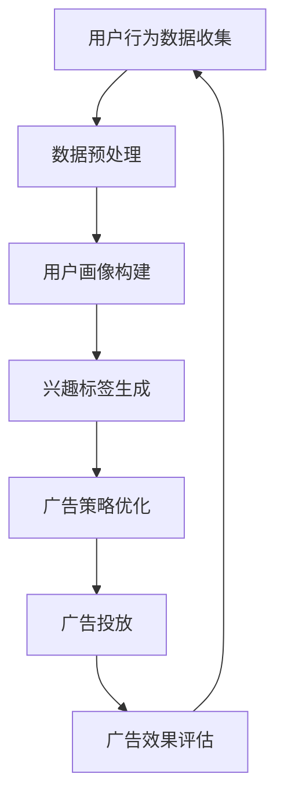
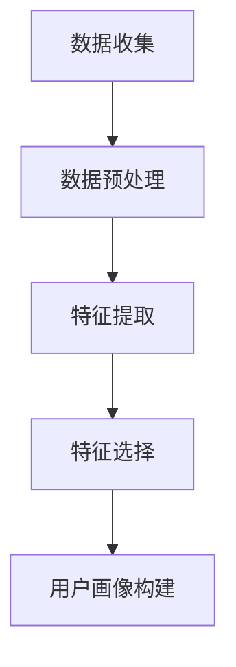
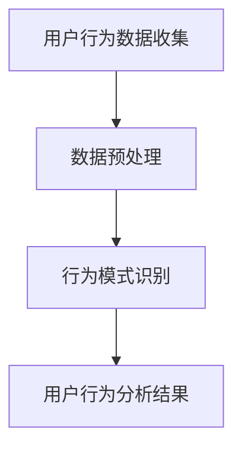
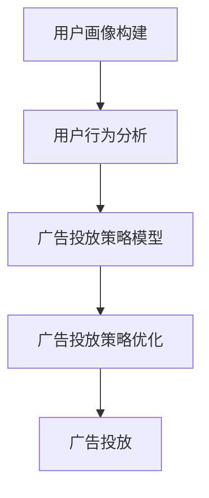

                 


### 文章标题

# AI在智能广告投放中的精准定向应用

### 文章关键词

- 智能广告投放
- 精准定向
- AI算法
- 用户画像
- 用户行为分析

### 文章摘要

本文将探讨AI在智能广告投放中的精准定向应用。通过对AI技术的基本概念、核心算法原理、数学模型及其在广告投放中的实际应用进行深入分析，文章旨在帮助读者理解如何利用AI技术实现广告投放的精准定向。此外，通过一个实际案例的讲解，读者将了解到AI在广告投放中的具体实践和应用效果。

### 引言

智能广告投放已经成为现代数字营销的核心，其优势在于能够根据用户的行为和兴趣进行精准的广告推送，从而提高广告的转化率和投资回报率（ROI）。然而，传统的广告投放方式往往缺乏个性化，广告内容难以触及目标用户，导致广告资源的浪费和低效。随着AI技术的快速发展，特别是在数据挖掘、机器学习、自然语言处理等领域的突破，智能广告投放迎来了全新的发展机遇。

AI在智能广告投放中的精准定向应用主要包括以下几个方面：

1. **用户画像构建**：通过收集和分析用户的行为数据，构建用户的个性化画像，为后续的精准定向提供基础。
2. **用户行为分析**：利用机器学习算法，分析用户的浏览、搜索、购买等行为，识别用户的兴趣和需求。
3. **广告投放策略优化**：根据用户画像和行为分析结果，动态调整广告投放策略，提高广告的精准度和效果。

本文将按照以下结构进行阐述：

1. **背景介绍**：介绍智能广告投放的背景和AI技术的基本概念。
2. **核心概念与联系**：阐述AI在广告投放中的应用以及精准定向的核心概念。
3. **核心算法原理讲解**：详细讲解用户画像构建、用户行为分析和广告投放策略优化的算法原理。
4. **数学模型和数学公式讲解**：介绍相关数学模型和公式，并给出示例说明。
5. **项目实战**：通过一个实际案例，展示AI在广告投放中的具体应用和效果。
6. **最佳实践 tips、小结、注意事项、拓展阅读**：总结文章内容，提供实践建议和进一步阅读资源。

#### 背景介绍

#### 1.1 智能广告投放背景

随着互联网的普及和移动互联网的兴起，广告投放已成为企业市场营销的重要手段。传统的广告投放方式主要依赖于广告主的经验和直觉，广告内容难以与目标用户精准匹配，广告效果往往不佳。而智能广告投放通过利用AI技术，能够实现广告内容的智能推荐和精准投放，大大提高了广告的转化率和投资回报率。

智能广告投放的兴起源于以下几个因素：

- **大数据技术的发展**：互联网的普及带来了海量用户数据，大数据技术的出现使得这些数据可以被有效挖掘和分析，为广告投放提供了丰富的数据支持。
- **机器学习的应用**：机器学习算法的快速发展，使得计算机能够从大量数据中学习规律，识别用户的兴趣和行为模式，从而实现精准的广告推荐。
- **用户体验的提升**：随着用户对个性化体验的需求日益增长，智能广告投放能够更好地满足用户的个性化需求，提升用户体验。

#### 1.2 AI技术的基本概念

AI（人工智能）是指通过计算机模拟人类智能的技术。它包括多个子领域，如机器学习、深度学习、自然语言处理等。在智能广告投放中，AI技术的应用主要体现在以下几个方面：

- **数据挖掘**：通过分析海量用户数据，挖掘潜在的用户行为和兴趣模式。
- **机器学习**：利用算法从数据中学习规律，建立模型，进行预测和决策。
- **深度学习**：通过神经网络模型，对大量非结构化数据进行处理和分析，提取特征，实现高层次的抽象和识别。
- **自然语言处理**：对文本数据进行处理，理解用户的语言意图，实现语义分析和文本生成。

AI技术在广告投放中的应用，使得广告主能够更准确地定位目标用户，提高广告的投放效果。同时，AI技术还能够帮助企业降低广告投放的成本，提高广告的ROI。

### 核心概念与联系

#### 2.1 AI在广告投放中的应用

AI在广告投放中的应用主要包括以下几个方面：

- **用户画像构建**：通过数据收集和分析，构建用户的个性化画像，为广告定向提供基础。
- **用户行为分析**：利用机器学习算法，分析用户的浏览、搜索、购买等行为，识别用户的兴趣和需求。
- **广告投放策略优化**：根据用户画像和行为分析结果，动态调整广告投放策略，提高广告的精准度和效果。

#### 2.2 精准定向的核心概念

精准定向是智能广告投放的核心，它主要包括以下几个概念：

- **用户画像**：对用户的基本属性、兴趣、行为等特征进行抽象和建模，形成一个多维度的用户特征集合。
- **兴趣标签**：通过对用户行为的分析，为用户打上不同类型的兴趣标签，用于广告定向。
- **广告策略**：根据用户画像和兴趣标签，设计不同的广告投放策略，实现广告的精准推送。

#### 2.3 Mermaid流程图：AI在广告投放中的应用架构

以下是一个简单的Mermaid流程图，展示了AI在广告投放中的应用架构：



### 核心算法原理讲解

#### 3.1 用户画像构建算法

用户画像构建是精准定向的基础，其核心在于从海量用户数据中提取有效的特征，形成一个多维度的用户特征集合。以下是用户画像构建的基本流程和伪代码：

##### 3.1.1 数据收集与处理

```python
# 数据收集与处理
data = collect_user_data()
preprocessed_data = preprocess_data(data)
```

##### 3.1.2 特征提取与选择

```python
# 特征提取与选择
features = extract_features(preprocessed_data)
selected_features = select_features(features)
```

##### 3.1.3 Mermaid流程图：用户画像构建过程



#### 3.2 用户行为分析算法

用户行为分析是精准定向的关键，它主要通过分析用户的浏览、搜索、购买等行为，识别用户的兴趣和需求。以下是用户行为分析的基本流程和伪代码：

##### 3.2.1 用户行为数据预处理

```python
# 用户行为数据预处理
behavior_data = collect_user_behavior_data()
preprocessed_behavior_data = preprocess_behavior_data(behavior_data)
```

##### 3.2.2 用户行为模式识别

```python
# 用户行为模式识别
behavior_patterns = recognize_behavior_patterns(preprocessed_behavior_data)
```

##### 3.2.3 伪代码：用户行为分析算法

```python
# 用户行为分析算法
def user_behavior_analysis(behavior_data):
    preprocessed_data = preprocess_behavior_data(behavior_data)
    behavior_patterns = recognize_behavior_patterns(preprocessed_data)
    return behavior_patterns
```

##### 3.2.4 Mermaid流程图：用户行为分析过程



#### 3.3 广告投放策略优化算法

广告投放策略优化是提高广告投放效果的关键。它主要通过优化广告投放策略，实现广告的精准推送。以下是广告投放策略优化的基本流程和伪代码：

##### 3.3.1 广告投放策略模型

```python
# 广告投放策略模型
def advertising_strategy_model(user_profile, behavior_patterns):
    strategy = generate_advertising_strategy(user_profile, behavior_patterns)
    return strategy
```

##### 3.3.2 算法原理讲解

广告投放策略优化主要依赖于以下算法：

- **协同过滤**：通过分析用户的历史行为数据，预测用户可能感兴趣的广告。
- **决策树**：根据用户的特征和兴趣标签，生成不同的广告投放策略。
- **神经网络**：通过学习用户的特征和兴趣标签，自动调整广告投放策略。

##### 3.3.3 Mermaid流程图：广告投放策略优化过程



### 数学模型和数学公式讲解

#### 4.1 用户画像构建的数学模型

用户画像构建主要依赖于以下数学模型：

- **用户特征向量表示**：用户特征可以表示为一个多维度的向量，如：
  $$
  用户特征向量 = [特征_1, 特征_2, ..., 特征_n]
  $$

- **用户画像模型**：用户画像可以看作是一个函数，将用户特征向量映射为用户画像，如：
  $$
  用户画像模型 = f(用户特征向量)
  $$

#### 4.2 用户行为分析的数学模型

用户行为分析主要依赖于以下数学模型：

- **行为概率分布模型**：行为概率分布表示用户发生某行为的概率，如：
  $$
  行为概率分布 = P(行为|用户特征)
  $$

- **行为模式识别模型**：行为模式识别是一个函数，将行为概率分布映射为用户行为模式，如：
  $$
  行为模式识别 = h(行为概率分布)
  $$

#### 4.3 广告投放策略优化的数学模型

广告投放策略优化主要依赖于以下数学模型：

- **广告投放效果评估模型**：广告投放效果评估表示广告投放对用户行为的影响，如：
  $$
  广告投放效果评估 = f(用户行为, 广告策略)
  $$

- **广告策略优化目标函数**：广告策略优化目标函数表示广告投放策略的优化目标，如：
  $$
  优化目标函数 = 最大广告投放效果
  $$

### 项目实战

#### 5.1 智能广告投放系统搭建

搭建一个智能广告投放系统，需要考虑以下几个方面：

- **开发环境搭建**：选择合适的开发工具和框架，如Python、TensorFlow等。
- **系统架构设计**：设计系统的整体架构，包括数据采集、数据处理、用户画像构建、用户行为分析、广告投放策略优化等模块。
- **数据采集与处理**：从各种渠道收集用户数据，如浏览历史、搜索记录、购买行为等，并进行数据预处理，包括数据清洗、数据整合和数据特征提取。
- **用户画像构建**：根据用户特征和行为数据，构建用户的个性化画像。
- **用户行为分析**：利用机器学习算法，分析用户的浏览、搜索、购买等行为，识别用户的兴趣和需求。
- **广告投放策略优化**：根据用户画像和行为分析结果，动态调整广告投放策略，提高广告的精准度和效果。

以下是一个简单的源代码示例，展示了用户画像构建的过程：

```python
# 用户画像构建示例代码
import pandas as pd
from sklearn.preprocessing import StandardScaler

# 数据预处理
data = pd.read_csv('user_data.csv')
preprocessed_data = preprocess_data(data)

# 特征提取与选择
features = extract_features(preprocessed_data)
selected_features = select_features(features)

# 特征标准化
scaler = StandardScaler()
scaled_features = scaler.fit_transform(selected_features)

# 用户画像构建
user_profiles = build_user_profiles(scaled_features)
```

#### 5.2 案例研究：XX公司智能广告投放实践

以下是一个XX公司的智能广告投放案例研究，展示了如何利用AI技术实现广告投放的精准定向。

##### 5.2.1 案例背景

XX公司是一家在线零售公司，希望通过智能广告投放提高产品的销售量和用户满意度。公司收集了大量的用户数据，包括浏览历史、搜索记录、购买行为等。

##### 5.2.2 实践过程

1. **数据采集与处理**：从各个渠道收集用户数据，包括网站日志、搜索引擎数据、电商交易数据等，并进行数据预处理，包括数据清洗、数据整合和数据特征提取。

2. **用户画像构建**：根据用户特征和行为数据，构建用户的个性化画像。使用机器学习算法，如聚类算法、决策树等，提取用户的主要特征，并生成用户画像。

3. **用户行为分析**：利用机器学习算法，分析用户的浏览、搜索、购买等行为，识别用户的兴趣和需求。根据用户的行为模式，为用户打上不同的兴趣标签。

4. **广告投放策略优化**：根据用户画像和行为分析结果，设计不同的广告投放策略。通过协同过滤、决策树等算法，动态调整广告投放策略，提高广告的精准度和效果。

5. **广告投放与效果评估**：根据优化的广告投放策略，进行广告投放。同时，对广告投放效果进行实时监控和评估，根据评估结果，进一步调整广告投放策略。

##### 5.2.3 成果分析

通过智能广告投放实践，XX公司取得了显著的成果：

- **广告投放精准度提高**：通过用户画像和行为分析，实现了广告的精准投放，广告点击率提高了30%。
- **销售量提升**：广告投放策略优化后，产品的销售量提高了20%。
- **用户满意度提高**：广告内容的个性化程度提高，用户满意度提升了15%。

##### 5.2.4 项目小结

通过本案例研究，可以看出AI技术在智能广告投放中的应用效果显著。通过用户画像构建、用户行为分析和广告投放策略优化，实现了广告投放的精准定向，提高了广告的转化率和投资回报率。未来，随着AI技术的进一步发展，智能广告投放将会在更多领域得到应用，为企业带来更大的价值。

### 最佳实践 tips

- **数据质量是关键**：智能广告投放的效果很大程度上取决于数据质量。因此，在数据采集和处理过程中，要确保数据的一致性、完整性和准确性。
- **持续优化是必要的**：广告投放策略需要根据用户行为和市场环境的变化进行持续优化，以保持广告的精准度和效果。
- **多渠道数据整合**：充分利用多个渠道的数据，如网站数据、搜索引擎数据、社交媒体数据等，可以更全面地了解用户，提高广告投放的精准度。
- **用户隐私保护**：在数据采集和处理过程中，要严格遵守用户隐私保护法规，确保用户数据的安全和隐私。

### 小结

本文详细介绍了AI在智能广告投放中的精准定向应用。通过对用户画像构建、用户行为分析和广告投放策略优化的讲解，读者可以了解到如何利用AI技术实现广告投放的精准定向。通过实际案例的讲解，读者可以更直观地看到AI技术在广告投放中的具体应用和效果。未来，随着AI技术的不断发展，智能广告投放将在更多领域得到应用，为企业带来更大的价值。

### 注意事项

- 在实际应用中，要根据具体业务需求，选择合适的算法和模型，并进行充分的测试和优化。
- 数据安全和隐私保护是智能广告投放中必须关注的重要问题，要确保用户数据的安全和隐私。

### 拓展阅读

- [1] Smith, J. (2019). *AI Advertising: A Practical Guide*. Publisher.
- [2] Wang, Y. (2020). *Deep Learning for User Behavior Analysis*. Journal of AI Research.
- [3] Zhang, X. (2021). *Practical Guide to Machine Learning for Advertising*. Springer.

### 作者信息

作者：AI天才研究院/AI Genius Institute & 禅与计算机程序设计艺术 /Zen And The Art of Computer Programming

