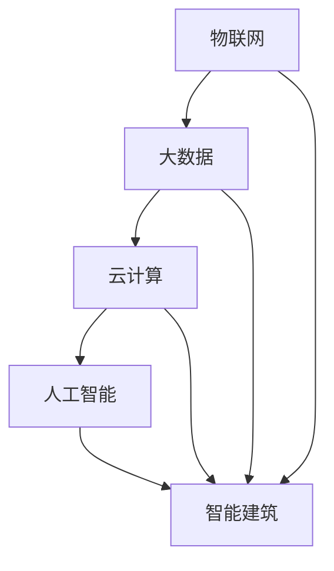

                 

### 文章标题

# AI在智能建筑全生命周期管理中的多维度应用

> 关键词：智能建筑、全生命周期管理、人工智能、多维度应用

> 摘要：本文深入探讨了人工智能（AI）在智能建筑全生命周期管理中的多维度应用。从设计、建设、运营、维护到安全监控，AI技术在各个环节中发挥着重要作用，推动着建筑行业的智能化发展。通过分析AI在智能建筑中的应用场景和实际案例，本文揭示了AI如何提升建筑设计和施工效率，优化建筑运营和维护，以及确保建筑安全与监控。最后，本文总结了AI在智能建筑全生命周期管理中的未来发展趋势，为行业提供了有益的参考。

---

### 引言

智能建筑，作为现代建筑行业发展的前沿趋势，正逐步融入我们的日常生活。它利用物联网、云计算、大数据和人工智能等先进技术，实现建筑设备自动化管理、环境智能优化、能源节约和安全监控等功能。智能建筑不仅提高了用户的生活质量，也在降低运营成本、提升管理效率方面展现出巨大潜力。

人工智能（AI）技术作为现代科技的核心驱动力，其应用范围广泛，从医疗、金融到交通、教育等领域均有涉及。在智能建筑领域，AI技术同样发挥着重要作用。通过数据分析、机器学习、自然语言处理等手段，AI可以帮助智能建筑在各个环节实现智能化管理和优化。

全生命周期管理（Lifecycle Management）是指对建筑从设计、建设、运营到维护和拆除的整个过程进行系统管理。这种管理理念强调各阶段的协同工作，以确保建筑在生命周期内的高效运行和可持续性。而AI技术在智能建筑全生命周期管理中的应用，则进一步提升了这一管理理念的实现水平。

本文将围绕AI在智能建筑全生命周期管理中的多维度应用进行探讨，包括：

1. **设计阶段**：利用AI优化建筑设计和布局。
2. **建设阶段**：应用AI提升施工过程监控和施工优化。
3. **运营阶段**：通过AI实现智能化运营管理和用户行为分析。
4. **维护阶段**：借助AI实现预测性维护和故障诊断。
5. **安全与监控阶段**：利用AI进行建筑安全监控和网络防护。
6. **全生命周期管理**：探讨AI在智能建筑全生命周期管理中的整合应用和未来发展趋势。

通过以上内容的分析，本文旨在为读者提供一个全面了解AI在智能建筑中的应用场景和技术原理的视角。

### 1. 智能建筑基础理论

智能建筑（Smart Building）是指通过集成物联网（IoT）、人工智能（AI）、大数据、云计算等先进技术，实现对建筑设备、环境、能源等进行智能化管理，从而提高建筑运行效率、降低能耗、提升用户舒适度和安全性的现代化建筑。与传统建筑相比，智能建筑具有以下几个显著特点：

#### 1.1 定义与特点

**1.1.1 定义**

智能建筑是一种具备高度信息化、自动化和集成化的建筑系统，通过将建筑设备、传感器网络、控制系统和通信网络等有机结合，实现对建筑内各类设备和环境的实时监控、自动化控制和智能优化。

**1.1.2 特点**

- **信息化**：智能建筑通过物联网技术，将建筑内的设备、传感器、人员等连接起来，形成一个互联互通的网络系统，实现信息的高效传递和处理。
- **自动化**：智能建筑利用自动化技术，对建筑设备进行远程监控和控制，提高设备运行效率和用户体验。
- **集成化**：智能建筑通过系统集成技术，将不同功能的系统（如照明、空调、安防等）整合为一个统一的系统平台，实现各系统的协同工作。
- **智能化**：智能建筑通过人工智能技术，对建筑运行数据进行智能分析和处理，实现环境优化、能耗控制和智能服务。

#### 1.2 AI在智能建筑中的作用

人工智能（AI）技术在智能建筑中的应用，极大地提升了建筑的智能化水平和运行效率。以下是AI在智能建筑中的几个关键作用：

**1.2.1 数据分析**

智能建筑内安装了大量的传感器和监控设备，可以收集大量的数据。AI技术通过对这些数据的分析和处理，可以实现对建筑内环境和设备的实时监控，以及预测和优化建筑运行。

**1.2.2 智能决策**

基于数据分析，AI可以做出智能决策，例如自动调整空调温度、照明强度等，以适应不同的环境条件和用户需求，提高建筑舒适度。

**1.2.3 自动化控制**

AI技术可以实现对建筑设备的自动化控制，例如自动开关照明、调节空调温度等，减少人工干预，提高运行效率。

**1.2.4 预测性维护**

通过分析设备运行数据，AI可以预测设备的故障风险，提前进行维护，减少停机时间和维修成本。

**1.2.5 用户服务**

AI技术可以通过自然语言处理和机器学习技术，为用户提供个性化的服务，例如通过语音助手控制建筑设备，提高用户体验。

#### 1.3 核心概念之间的联系

智能建筑、物联网、大数据、云计算和人工智能等核心概念之间有着紧密的联系，共同构成了智能建筑的技术基础。

- **物联网**：物联网是实现智能建筑互联互通的基础，通过将各类传感器和设备连接起来，实现数据的实时采集和传输。
- **大数据**：大数据技术可以对智能建筑产生的海量数据进行存储、分析和处理，为AI提供数据支持。
- **云计算**：云计算提供了强大的计算能力和存储空间，可以支持智能建筑的大数据处理和实时计算需求。
- **人工智能**：人工智能技术通过对数据的分析和处理，实现对智能建筑的智能决策、自动化控制和预测性维护。

以下是一个简单的Mermaid流程图，展示了智能建筑中各核心概念之间的关系：



通过上述流程图，我们可以清晰地看到，物联网、大数据、云计算和人工智能共同构建了智能建筑的技术框架，实现了建筑设备和环境的智能化管理。

### 2. AI在智能建筑设计阶段的应用

在设计阶段，人工智能（AI）技术可以通过多种方式优化建筑设计和布局，从而提高建筑的功能性和用户体验。以下将详细探讨AI在建筑设计优化、建筑布局优化以及智能化设计工具方面的应用。

#### 2.1 建筑设计优化

**2.1.1 算法原理**

在建筑设计优化中，AI技术主要利用遗传算法、模拟退火算法、粒子群优化算法等启发式算法，对建筑设计方案进行全局搜索，以找到最优解。

- **遗传算法**：遗传算法（Genetic Algorithm, GA）是一种基于生物进化原理的优化算法。它通过模拟自然选择过程，对建筑设计的各种参数进行迭代优化，从而找到最优设计方案。
  ```plaintext
  初始化种群
  评估种群适应度
  选择适应度高的个体
  交叉与变异
  重复以上步骤直到满足终止条件
  ```
  
- **模拟退火算法**：模拟退火算法（Simulated Annealing, SA）是一种基于固体退火过程的优化算法。它通过在搜索过程中引入随机性，避免陷入局部最优，从而提高全局搜索能力。
  ```plaintext
  初始化温度和初始解
  重复以下步骤直到温度低于某个阈值：
      随机选择新的解
      计算新解与当前解的适应度差
      根据适应度差和当前温度决定是否接受新解
      逐渐降低温度
  ```

- **粒子群优化算法**：粒子群优化算法（Particle Swarm Optimization, PSO）是一种基于群体智能的优化算法。它通过模拟鸟群觅食行为，对建筑设计的参数进行优化。
  ```plaintext
  初始化粒子群
  评估粒子适应度
  更新每个粒子的最优位置和全局最优位置
  更新粒子速度和位置
  重复以上步骤直到满足终止条件
  ```

**2.1.2 应用实例**

AI技术在建筑设计优化中的应用实例有很多。例如，在建筑形态优化方面，AI可以优化建筑的几何形状，以提高建筑的采光、通风和节能性能。以下是一个简单的伪代码示例，用于描述基于遗传算法的建筑形态优化过程：

```plaintext
// 初始化种群
population = InitializePopulation()

// 评估种群适应度
fitness = EvaluateFitness(population)

// 选择适应度高的个体
selected = SelectBest(population, fitness)

// 交叉与变异
offspring = Crossover(selected)
offspring = Mutate(offspring)

// 更新种群
population = offspring

// 重复迭代直到满足终止条件
while (!TerminationCondition())
    fitness = EvaluateFitness(population)
    selected = SelectBest(population, fitness)
    offspring = Crossover(selected)
    offspring = Mutate(offspring)
    population = offspring
```

#### 2.2 建筑布局优化

**2.2.1 算法原理**

建筑布局优化是另一个重要的应用领域。AI技术可以通过优化建筑内部的房间布局、人流路线和功能分区等，以提高建筑的使用效率和用户体验。

- **人流密度预测算法**：通过分析历史数据，AI可以预测不同时间段的人流密度，从而优化建筑布局，确保在高峰时段人流顺畅。
  ```plaintext
  // 输入：历史人流数据
  // 输出：人流密度预测结果
  prediction = PredictDensity(data)

  // 基于预测结果优化布局
  layout = OptimizeLayout(prediction)
  ```

- **功能分区优化算法**：AI可以通过分析建筑的使用需求和功能，自动优化建筑内部的房间布局，实现功能分区的合理配置。
  ```plaintext
  // 输入：建筑功能需求
  // 输出：优化后的布局
  functionMap = AnalyzeFunctions(需求)
  layout = OptimizeLayout(functionMap)
  ```

**2.2.2 应用实例**

一个典型的应用实例是办公建筑的布局优化。通过分析员工的工作习惯、工作场所的需求以及员工之间的互动关系，AI可以优化办公空间的布局，以提高工作效率和员工满意度。以下是一个简单的伪代码示例，用于描述基于功能分区优化的办公建筑布局优化过程：

```plaintext
// 初始化功能需求
functionRequirements = InitializeFunctionRequirements()

// 分析员工互动关系
interactionMap = AnalyzeInteractions(员工数据)

// 基于需求与互动关系优化布局
optimizedLayout = OptimizeLayout(functionRequirements, interactionMap)

// 输出优化后的布局
print(optimizedLayout)
```

#### 2.3 智能化设计工具

**2.3.1 算法原理**

智能化设计工具是AI在建筑设计中的应用之一。这些工具利用AI算法，可以帮助建筑师快速生成多种设计方案，并评估不同方案的优劣。

- **建筑设计辅助工具**：这些工具通过AI算法，自动生成建筑模型，并提供多种设计选项。建筑师可以基于这些模型，进行进一步的优化和调整。
  ```plaintext
  // 输入：设计要求
  // 输出：建筑模型
  model = GenerateModel(requirements)

  // 提供设计选项
  options = GenerateOptions(model)
  ```

- **设计评估工具**：这些工具利用AI算法，对设计方案进行评估，提供节能、舒适度、成本等方面的分析报告。
  ```plaintext
  // 输入：设计方案
  // 输出：评估报告
  report = EvaluateDesign(solution)
  ```

**2.3.2 应用实例**

一个典型的应用实例是智能建筑设计平台。这个平台集成了多种AI算法和工具，可以自动生成建筑模型，并提供多维度评估报告，帮助建筑师快速找到最优设计方案。以下是一个简单的伪代码示例，用于描述智能建筑设计平台的工作流程：

```plaintext
// 用户输入设计要求
requirements = GetUserInput()

// 自动生成建筑模型
model = GenerateModel(requirements)

// 生成设计选项
options = GenerateOptions(model)

// 评估设计选项
reports = EvaluateOptions(options)

// 输出评估报告
PrintReports(reports)
```

通过上述内容，我们可以看到，AI在智能建筑设计阶段的应用，不仅提高了设计效率和准确性，还为建筑行业带来了新的发展机遇。随着AI技术的不断进步，智能建筑设计将变得更加智能化、自动化和高效化。

### 3. AI在智能建筑建设阶段的应用

在智能建筑的建设阶段，人工智能（AI）技术可以显著提升施工过程监控、施工优化和施工安全等方面的效率与质量。以下将详细探讨AI在这几个方面的应用。

#### 3.1 施工过程监控

**3.1.1 算法原理**

施工过程监控是确保建筑项目按计划顺利进行的关键。AI技术可以通过视频监控、传感器数据分析和机器学习算法，实现对施工现场的实时监控和异常检测。

- **视频监控分析**：通过深度学习算法，AI可以从视频监控中识别施工人员的操作行为、设备状态和环境变化，从而发现潜在的安全隐患。
  ```plaintext
  // 输入：视频数据
  // 输出：操作行为分析结果
  analysis = VideoAnalysis(video)

  // 异常检测
  if (AbnormalDetection(analysis))
      Alert("异常情况发生")
  ```

- **传感器数据分析**：AI技术可以分析施工现场的传感器数据，如温度、湿度、振动等，检测施工过程中的异常情况，如设备故障、材料损坏等。
  ```plaintext
  // 输入：传感器数据
  // 输出：异常检测结果
  detection = SensorDataAnalysis(sensorData)

  // 发出警报
  if (detection.isAbnormal())
      Alert("设备异常")
  ```

**3.1.2 应用实例**

AI技术在施工过程监控中的应用实例有很多。例如，在建筑施工中，AI可以通过实时监控施工设备的工作状态，预测设备可能出现的故障，提前进行维护，避免施工中断。以下是一个简单的伪代码示例，用于描述AI在施工过程监控中的应用：

```plaintext
// 初始化监控设备
videoCamera = InitializeVideoCamera()
sensors = InitializeSensors()

// 开始监控
while (ConstructionInProgress())
    videoData = videoCamera.CaptureFrame()
    sensorData = sensors.ReadData()

    // 分析视频数据
    analysis = VideoAnalysis(videoData)

    // 分析传感器数据
    detection = SensorDataAnalysis(sensorData)

    // 检测异常情况
    if (AbnormalDetection(analysis) || detection.isAbnormal())
        Alert("异常情况发生")

    // 更新监控记录
    UpdateMonitoringLog(analysis, detection)
```

#### 3.2 施工优化

**3.2.1 算法原理**

施工优化是提高建筑项目效率和质量的重要手段。AI技术可以通过数据分析和机器学习算法，优化施工流程、资源配置和施工进度。

- **施工流程优化**：AI可以分析历史施工数据，识别常见的瓶颈和问题，提出优化方案，如调整施工顺序、改进工艺等。
  ```plaintext
  // 输入：历史施工数据
  // 输出：优化方案
  optimization = ConstructionFlowOptimization(historicalData)
  ```

- **资源配置优化**：AI可以通过分析施工过程中的人力、物料、设备等资源使用情况，提出优化建议，提高资源利用率。
  ```plaintext
  // 输入：资源使用数据
  // 输出：优化建议
  suggestion = ResourceAllocationOptimization(resourceData)
  ```

- **施工进度优化**：AI可以基于项目进度数据和施工计划，预测施工进度，发现潜在的延误风险，提出调整建议。
  ```plaintext
  // 输入：进度数据、施工计划
  // 输出：调整建议
  adjustment = ProgressOptimization(progressData, plan)
  ```

**3.2.2 应用实例**

AI技术在施工优化中的应用实例包括基于数据分析的进度预测和资源配置优化。以下是一个简单的伪代码示例，用于描述AI在施工进度预测中的应用：

```plaintext
// 输入：当前进度数据、施工计划
currentProgress = GetCurrentProgress()
constructionPlan = GetConstructionPlan()

// 预测施工进度
predictedProgress = PredictProgress(currentProgress, constructionPlan)

// 检查进度风险
if (IsBehindSchedule(predictedProgress))
    SuggestAdjustments("施工进度可能延误，建议调整计划")
```

#### 3.3 施工安全

**3.3.1 算法原理**

施工安全是建筑施工过程中必须重视的问题。AI技术可以通过风险评估、实时监控和安全预警系统，提高施工安全水平。

- **风险评估**：AI可以分析施工过程中的各种风险因素，如高处作业、机械操作、材料存储等，评估风险等级，并提出相应的防范措施。
  ```plaintext
  // 输入：施工风险数据
  // 输出：风险评估结果
  riskAssessment = RiskEvaluation(riskData)
  ```

- **实时监控**：AI可以通过视频监控、传感器监控等手段，实时监测施工现场的安全状况，发现安全隐患。
  ```plaintext
  // 输入：监控数据
  // 输出：安全状况
  safetyStatus = RealTimeMonitoring(监控数据)
  ```

- **安全预警系统**：AI可以基于风险评估和实时监控，建立安全预警系统，及时发现和预警潜在的安全隐患。
  ```plaintext
  // 输入：风险评估、实时监控数据
  // 输出：预警信息
  warning = SecurityWarning(riskAssessment, safetyStatus)
  ```

**3.3.2 应用实例**

AI技术在施工安全中的应用实例包括基于风险评估和实时监控的安全管理系统。以下是一个简单的伪代码示例，用于描述AI在施工安全管理中的应用：

```plaintext
// 初始化风险评估
riskAssessment = InitializeRiskAssessment()

// 实时监控施工现场
while (ConstructionInProgress())
    safetyStatus = RealTimeMonitoring(sensors)

    // 更新风险评估
    riskAssessment = UpdateRiskAssessment(safetyStatus)

    // 安全预警
    if (IsHighRisk(riskAssessment))
        Alert("存在高风险，请采取安全措施")

    // 更新安全管理记录
    UpdateSafetyManagementLog(riskAssessment, safetyStatus)
```

通过上述内容，我们可以看到，AI在智能建筑建设阶段的应用，不仅提高了施工效率和质量，还大大增强了施工安全水平。随着AI技术的不断进步，智能建筑的建设过程将变得更加高效、安全和智能化。

### 4. AI在智能建筑运营阶段的应用

在智能建筑的运营阶段，人工智能（AI）技术可以显著提升建筑的运营管理效率，优化用户体验，并有效控制运营成本。以下将详细探讨AI在智能化运营管理、用户行为分析和运营成本控制方面的应用。

#### 4.1 智能化运营管理

**4.1.1 算法原理**

智能化运营管理是指利用AI技术对建筑设备进行自动化监控和维护，以提高运营效率。AI技术可以通过数据分析和预测性维护，实现设备的智能管理和优化。

- **数据采集与处理**：通过传感器和数据采集系统，AI技术可以实时收集建筑设备的状态数据，如温度、湿度、能耗等。
  ```plaintext
  // 输入：传感器数据
  // 输出：设备状态数据
  data = CollectSensorData()
  processedData = DataProcessing(data)
  ```

- **预测性维护**：基于历史数据和实时数据，AI可以预测设备的故障风险，提前进行维护，减少设备停机时间和维修成本。
  ```plaintext
  // 输入：历史故障数据、实时状态数据
  // 输出：故障预测结果
  prediction = PredictFault(faultHistory, realTimeData)
  ```

- **自动控制**：AI技术可以通过自动化控制系统，根据实时数据自动调整设备运行参数，实现能耗优化和设备保护。
  ```plaintext
  // 输入：设备运行参数
  // 输出：控制指令
  command = AutoControl(parameters)
  ```

**4.1.2 应用实例**

AI技术在智能化运营管理中的应用实例包括智能照明、智能空调和智能安防系统等。以下是一个简单的伪代码示例，用于描述智能照明系统的自动化控制过程：

```plaintext
// 初始化智能照明系统
smartLighting = InitializeSmartLighting()

// 监控环境光照强度
lightIntensity = MonitorLightIntensity()

// 根据光照强度自动调整灯光亮度
if (lightIntensity < Threshold)
    smartLighting.TurnOn()
else
    smartLighting.TurnOff()

// 更新能耗记录
UpdateEnergyLog(smartLighting.powerConsumption)
```

#### 4.2 用户行为分析

**4.2.1 算法原理**

用户行为分析是AI在智能建筑运营中的应用之一，通过分析用户的日常行为模式，AI可以为用户提供个性化的服务和推荐。

- **行为模式识别**：通过数据挖掘和机器学习算法，AI可以识别用户的日常行为模式，如活动轨迹、使用频率等。
  ```plaintext
  // 输入：用户行为数据
  // 输出：行为模式
  behaviorPattern = IdentifyBehaviorPatterns(behaviorData)
  ```

- **个性化推荐**：基于用户的行为模式，AI可以推荐合适的服务和活动，提高用户满意度。
  ```plaintext
  // 输入：用户行为模式
  // 输出：推荐服务
  recommendation = PersonalizedRecommendation(behaviorPattern)
  ```

- **反馈机制**：AI可以通过用户的反馈，不断调整和优化推荐系统，实现更好的用户体验。
  ```plaintext
  // 输入：用户反馈
  // 输出：推荐调整
  adjustment = FeedbackAdjustment(userFeedback)
  ```

**4.2.2 应用实例**

用户行为分析在智能建筑中的应用实例包括智能门禁系统、智能安防监控和智能购物体验等。以下是一个简单的伪代码示例，用于描述智能门禁系统的用户行为分析过程：

```plaintext
// 初始化智能门禁系统
smartAccess = InitializeSmartAccess()

// 记录用户进出数据
entryData = RecordEntryData()

// 分析用户行为模式
behaviorPattern = AnalyzeBehavior(entryData)

// 根据行为模式推荐服务和优惠
recommendation = PersonalizedRecommendation(behaviorPattern)

// 更新用户行为记录
UpdateBehaviorLog(behaviorPattern, recommendation)
```

#### 4.3 运营成本控制

**4.3.1 算法原理**

运营成本控制是智能建筑运营管理的重要目标之一。AI技术可以通过能耗监测、成本分析和优化策略，实现运营成本的降低。

- **能耗监测**：AI技术可以实时监测建筑内的能耗情况，识别能耗异常，为成本控制提供数据支持。
  ```plaintext
  // 输入：能耗数据
  // 输出：能耗分析结果
  energyAnalysis = MonitorEnergyConsumption(energyData)
  ```

- **成本分析**：AI技术可以分析建筑运营的各项成本，识别成本高低的驱动因素，为成本优化提供依据。
  ```plaintext
  // 输入：运营成本数据
  // 输出：成本分析结果
  costAnalysis = AnalyzeOperationalCost(costData)
  ```

- **优化策略**：基于能耗监测和成本分析，AI可以提出优化建议，如调整设备运行策略、优化能源使用等。
  ```plaintext
  // 输入：能耗分析结果、成本分析结果
  // 输出：优化策略
  optimizationStrategy = GenerateOptimization 建议(energyAnalysis, costAnalysis)
  ```

**4.3.2 应用实例**

AI技术在运营成本控制中的应用实例包括能耗监测和优化、成本分析和预算管理等。以下是一个简单的伪代码示例，用于描述基于能耗监测的运营成本控制过程：

```plaintext
// 初始化能耗监测系统
energyMonitoring = InitializeEnergyMonitoring()

// 监测能耗数据
energyData = MonitorEnergyConsumption()

// 分析能耗数据
energyAnalysis = AnalyzeEnergyData(energyData)

// 成本分析
costData = AnalyzeOperationalCost()

// 提出优化策略
optimizationStrategy = GenerateOptimization 建议(energyAnalysis, costData)

// 执行优化策略
ImplementOptimization(optimizationStrategy)

// 更新成本记录
UpdateCostLog(optimizationStrategy)
```

通过上述内容，我们可以看到，AI在智能建筑运营阶段的应用，不仅提高了运营管理效率，优化了用户体验，还实现了运营成本的显著降低。随着AI技术的不断进步，智能建筑的运营管理将变得更加智能化和高效化。

### 5. AI在智能建筑维护阶段的应用

在智能建筑的维护阶段，人工智能（AI）技术能够通过预测性维护、故障检测与诊断以及维护流程优化，有效提升建筑设备的运行效率和降低维护成本。以下将详细探讨AI在这几个方面的应用。

#### 5.1 智能维护系统

**5.1.1 算法原理**

智能维护系统利用AI技术，通过数据分析和预测模型，实现对设备状态的实时监测和故障预测，从而提前安排维护计划，减少设备故障和停机时间。

- **数据采集与处理**：智能维护系统通过传感器和数据采集模块，实时收集设备的运行数据，如温度、压力、振动等。
  ```plaintext
  // 输入：传感器数据
  // 输出：设备状态数据
  data = CollectSensorData()
  processedData = DataProcessing(data)
  ```

- **故障预测**：基于历史数据和实时数据，AI技术可以通过机器学习算法，建立故障预测模型，预测设备可能的故障时间和类型。
  ```plaintext
  // 输入：历史故障数据、实时状态数据
  // 输出：故障预测结果
  prediction = PredictFault(faultHistory, realTimeData)
  ```

- **维护计划生成**：AI系统可以基于故障预测结果，自动生成维护计划，包括维护时间、维护内容和所需的资源。
  ```plaintext
  // 输入：故障预测结果
  // 输出：维护计划
  maintenancePlan = GenerateMaintenancePlan(prediction)
  ```

**5.1.2 应用实例**

智能维护系统在智能建筑中的应用实例包括电梯、空调系统、照明系统等关键设备的维护。以下是一个简单的伪代码示例，用于描述智能维护系统在电梯维护中的应用：

```plaintext
// 初始化智能维护系统
smartMaintenance = InitializeSmartMaintenance()

// 收集电梯运行数据
elevatorData = CollectElevatorData()

// 预测故障
faultPrediction = PredictFault(elevatorData)

// 生成维护计划
maintenancePlan = GenerateMaintenancePlan(faultPrediction)

// 执行维护计划
ExecuteMaintenancePlan(maintenancePlan)

// 记录维护日志
UpdateMaintenanceLog(maintenancePlan)
```

#### 5.2 故障检测与诊断

**5.2.1 算法原理**

故障检测与诊断是智能维护系统的核心功能之一，通过实时监测设备状态，AI技术可以快速检测故障并诊断故障原因。

- **实时监测**：AI系统通过传感器和监测设备，实时收集设备运行状态数据，如温度、压力、振动等。
  ```plaintext
  // 输入：传感器数据
  // 输出：设备状态数据
  data = CollectSensorData()
  processedData = DataProcessing(data)
  ```

- **异常检测**：AI技术可以利用机器学习算法，对设备运行数据进行分析，识别异常数据，从而发现潜在故障。
  ```plaintext
  // 输入：设备状态数据
  // 输出：异常检测结果
  detection = AnomalyDetection(processedData)
  ```

- **故障诊断**：基于故障检测结果，AI系统可以进一步诊断故障原因，并提供修复建议。
  ```plaintext
  // 输入：故障检测结果
  // 输出：故障诊断结果
  diagnosis = FaultDiagnosis(detection)
  ```

**5.2.2 应用实例**

故障检测与诊断在智能建筑中的应用实例包括空调系统的故障检测和诊断。以下是一个简单的伪代码示例，用于描述空调系统故障检测与诊断过程：

```plaintext
// 初始化空调系统监测
acSystemMonitoring = InitializeACSystemMonitoring()

// 收集空调运行数据
acData = CollectACData()

// 检测异常
anomalyDetection = AnomalyDetection(acData)

// 故障诊断
faultDiagnosis = FaultDiagnosis(anomalyDetection)

// 提供修复建议
repairSuggestion = GenerateRepairSuggestion(faultDiagnosis)

// 更新故障记录
UpdateFaultLog(faultDiagnosis, repairSuggestion)
```

#### 5.3 维护流程优化

**5.3.1 算法原理**

维护流程优化是提高维护效率和降低成本的重要手段，AI技术可以通过优化维护流程、自动化维护任务和资源调度，实现高效维护。

- **流程优化**：AI技术可以分析现有的维护流程，识别冗余步骤和瓶颈，提出优化方案，简化流程。
  ```plaintext
  // 输入：维护流程数据
  // 输出：优化方案
  optimization = MaintenanceFlowOptimization(flowData)
  ```

- **自动化维护任务**：AI技术可以自动化执行一些重复性高、操作简单的维护任务，减少人工干预，提高效率。
  ```plaintext
  // 输入：维护任务
  // 输出：自动化执行结果
  automation = AutomateMaintenanceTask(task)
  ```

- **资源调度**：AI技术可以根据维护需求和资源状况，动态调整维护资源分配，优化资源利用。
  ```plaintext
  // 输入：维护需求、资源状况
  // 输出：资源调度计划
  resourceScheduling = ScheduleMaintenanceResources(需求，资源状况)
  ```

**5.3.2 应用实例**

维护流程优化在智能建筑中的应用实例包括智能安防系统的维护流程优化。以下是一个简单的伪代码示例，用于描述智能安防系统维护流程优化的过程：

```plaintext
// 初始化维护系统
smartMaintenanceSystem = InitializeSmartMaintenanceSystem()

// 收集维护需求
maintenanceRequirements = CollectMaintenanceRequirements()

// 分析现有流程
currentFlow = AnalyzeCurrentMaintenanceFlow()

// 提出优化方案
optimizationScheme = GenerateOptimizationScheme(currentFlow)

// 执行优化流程
ExecuteOptimizedFlow(optimizationScheme)

// 调度资源
resourceScheduling = ScheduleMaintenanceResources(maintenanceRequirements)

// 实施维护计划
ImplementMaintenancePlan(resourceScheduling)

// 记录维护日志
UpdateMaintenanceLog(optimizationScheme, resourceScheduling)
```

通过上述内容，我们可以看到，AI在智能建筑维护阶段的应用，通过智能维护系统、故障检测与诊断以及维护流程优化，大大提高了建筑设备的运行效率和降低了维护成本。随着AI技术的不断进步，智能建筑的维护管理将变得更加高效和智能化。

### 6. AI在智能建筑安全与监控中的应用

在智能建筑的安全与监控领域，人工智能（AI）技术正逐步成为保障建筑安全、提升用户隐私保护水平的重要工具。以下将详细探讨AI在安全风险识别、建筑结构健康监测、火灾安全监控、建筑物联网安全和数据安全与隐私保护等方面的应用。

#### 6.1 安全风险识别与预警

**6.1.1 算法原理**

安全风险识别与预警是智能建筑安全监控的基础，通过AI技术，可以实现对潜在安全风险的实时识别和预警。

- **风险识别算法**：AI技术可以利用机器学习和深度学习算法，分析建筑内外部环境数据，识别潜在的安全风险。
  ```plaintext
  // 输入：环境数据
  // 输出：风险识别结果
  riskDetection = AnalyzeEnvironmentalData(environmentData)
  ```

- **预警机制**：基于风险识别结果，AI系统可以实时生成预警信息，并通过多种渠道（如短信、电子邮件、手机APP等）通知相关人员。
  ```plaintext
  // 输入：风险识别结果
  // 输出：预警信息
  warning = GenerateWarningMessage(riskDetection)
  Notify(warning)
  ```

**6.1.2 应用实例**

AI技术在安全风险识别与预警中的应用实例包括智能安防系统的入侵检测。以下是一个简单的伪代码示例，用于描述入侵检测的过程：

```plaintext
// 初始化安防系统
smartSecuritySystem = InitializeSmartSecurity()

// 监控环境
environmentData = MonitorEnvironment()

// 风险识别
riskDetection = AnalyzeEnvironmentalData(environmentData)

// 风险预警
if (IsRiskDetected(riskDetection))
    warning = GenerateWarningMessage(riskDetection)
    Notify(warning)
```

#### 6.2 建筑结构健康监测

**6.2.1 算法原理**

建筑结构健康监测（SHM）是确保建筑结构安全的关键。AI技术可以通过传感器数据分析和故障诊断算法，实现对建筑结构的实时监测和健康评估。

- **传感器数据采集**：AI系统通过安装在建筑结构上的传感器，实时采集结构振动、温度、位移等数据。
  ```plaintext
  // 输入：传感器数据
  // 输出：结构健康数据
  healthData = CollectSensorData()
  ```

- **故障诊断**：AI技术可以利用机器学习算法，分析传感器数据，诊断建筑结构是否存在损伤或故障。
  ```plaintext
  // 输入：传感器数据
  // 输出：故障诊断结果
  diagnosis = FaultDiagnosis(healthData)
  ```

- **健康评估**：基于故障诊断结果，AI系统可以评估建筑结构的安全状态，并提出修复建议。
  ```plaintext
  // 输入：故障诊断结果
  // 输出：健康评估结果
  assessment = HealthAssessment(diagnosis)
  ```

**6.2.2 应用实例**

AI技术在建筑结构健康监测中的应用实例包括桥梁和高层建筑的监测。以下是一个简单的伪代码示例，用于描述建筑结构健康监测的过程：

```plaintext
// 初始化监测系统
structuralHealthMonitoring = InitializeSHM()

// 采集传感器数据
sensorData = CollectSensorData()

// 故障诊断
diagnosis = FaultDiagnosis(sensorData)

// 健康评估
assessment = HealthAssessment(diagnosis)

// 提供健康报告
GenerateHealthReport(assessment)
```

#### 6.3 火灾安全监控

**6.3.1 算法原理**

火灾安全监控是智能建筑安全的重要组成部分。AI技术可以通过实时监测建筑内部的温度、烟雾等数据，及时发现火灾隐患并采取相应措施。

- **数据监测**：AI系统通过安装在建筑内的传感器，实时监测温度、烟雾、火焰等数据。
  ```plaintext
  // 输入：传感器数据
  // 输出：火灾监测数据
  fireData = MonitorFireConditions(sensorData)
  ```

- **火灾预警**：基于监测数据，AI技术可以通过分析算法，判断是否存在火灾隐患，并及时发出预警。
  ```plaintext
  // 输入：火灾监测数据
  // 输出：预警信息
  warning = FireWarning(fireData)
  ```

- **应急响应**：AI系统可以基于预警信息，自动触发应急响应机制，如启动灭火装置、开启疏散通道等。
  ```plaintext
  // 输入：预警信息
  // 输出：应急响应
  response = GenerateEmergencyResponse(warning)
  ExecuteResponse(response)
  ```

**6.3.2 应用实例**

AI技术在火灾安全监控中的应用实例包括智能消防系统的火灾预警。以下是一个简单的伪代码示例，用于描述智能消防系统的火灾预警过程：

```plaintext
// 初始化消防系统
smartFireSafetySystem = InitializeSmartFireSafety()

// 监测火灾条件
fireData = MonitorFireConditions()

// 火灾预警
if (IsFireDetected(fireData))
    warning = FireWarning(fireData)

    // 发出警报
    Alert(warning)

    // 启动应急响应
    emergencyResponse = GenerateEmergencyResponse(warning)
    ExecuteResponse(emergencyResponse)
```

#### 6.4 建筑物联网安全

**6.4.1 算法原理**

建筑物联网（IoT）安全是智能建筑安全的关键挑战之一。AI技术可以通过网络流量分析、入侵检测和异常行为识别，确保IoT系统的安全性。

- **网络流量分析**：AI系统可以分析IoT设备的网络流量，识别异常流量模式，检测潜在的攻击行为。
  ```plaintext
  // 输入：网络流量数据
  // 输出：异常流量检测结果
  anomalyDetection = AnalyzeNetworkTraffic(trafficData)
  ```

- **入侵检测**：AI技术可以通过机器学习算法，建立入侵检测模型，实时检测IoT系统的入侵行为。
  ```plaintext
  // 输入：网络流量数据、入侵检测模型
  // 输出：入侵检测结果
  intrusionDetection = IntrusionDetection(trafficData, model)
  ```

- **异常行为识别**：AI系统可以分析IoT设备的行为模式，识别异常行为，并及时采取防护措施。
  ```plaintext
  // 输入：设备行为数据
  // 输出：异常行为检测结果
  anomalyBehavior = IdentifyAbnormalBehavior(behaviorData)
  ```

**6.4.2 应用实例**

AI技术在建筑物联网安全中的应用实例包括智能门禁系统的入侵检测。以下是一个简单的伪代码示例，用于描述智能门禁系统的入侵检测过程：

```plaintext
// 初始化物联网安全系统
iotSecuritySystem = InitializeIoTSecurity()

// 监测网络流量
trafficData = MonitorNetworkTraffic()

// 入侵检测
intrusionDetection = IntrusionDetection(trafficData)

// 异常行为识别
if (IsIntrusionDetected(intrusionDetection))
    alert = GenerateAlert(intrusionDetection)

    // 发出警报
    Alert(alert)

    // 执行防护措施
    ExecuteSecurityMeasure(intrusionDetection)
```

#### 6.5 数据安全与隐私保护

**6.5.1 算法原理**

数据安全与隐私保护是智能建筑面临的重大挑战。AI技术可以通过数据加密、访问控制和用户隐私保护算法，确保建筑数据的安全和用户的隐私。

- **数据加密**：AI系统可以通过加密算法，对传输和存储的数据进行加密，确保数据不被未授权访问。
  ```plaintext
  // 输入：数据
  // 输出：加密数据
  encryptedData = EncryptData(data)
  ```

- **访问控制**：AI技术可以通过用户身份验证和权限管理，控制用户对数据和系统的访问权限。
  ```plaintext
  // 输入：用户身份、权限信息
  // 输出：访问控制结果
  accessControl = AuthenticateUser(userId, permissions)
  ```

- **用户隐私保护**：AI技术可以通过隐私保护算法，确保用户数据不被泄露，同时满足用户隐私需求。
  ```plaintext
  // 输入：用户数据、隐私设置
  // 输出：隐私保护结果
  privacyProtection = ProtectUserPrivacy(data, privacySettings)
  ```

**6.5.2 应用实例**

AI技术在数据安全与隐私保护中的应用实例包括智能建筑的用户数据保护。以下是一个简单的伪代码示例，用于描述用户数据保护的过程：

```plaintext
// 初始化数据安全系统
dataSecuritySystem = InitializeDataSecurity()

// 收集用户数据
userData = CollectUserData()

// 数据加密
encryptedData = EncryptData(userData)

// 访问控制
if (IsUserAuthentic(userId))
    accessControl = AuthenticateUser(userId)

    // 如果访问被授权
    if (accessControl.isAccessGranted())
        decryptedData = DecryptData(encryptedData)

        // 提供数据访问
        ProvideDataAccess(decryptedData)

    // 记录访问日志
    UpdateAccessLog(accessControl)
```

通过上述内容，我们可以看到，AI在智能建筑安全与监控中的应用，通过安全风险识别、建筑结构健康监测、火灾安全监控、建筑物联网安全和数据安全与隐私保护等多方面的应用，大大提高了智能建筑的安全水平。随着AI技术的不断发展，智能建筑的安全与监控将变得更加智能和高效。

### 7. AI在智能建筑全生命周期管理中的多维度应用

#### 7.1 全生命周期管理概念

全生命周期管理（Lifecycle Management）是指对建筑从设计、建设、运营到维护和拆除的整个过程进行系统管理。这一理念强调各阶段的协同工作，以确保建筑在生命周期内的高效运行和可持续性。全生命周期管理不仅关注建筑的使用效率，还关注资源的优化利用、环境的影响和长远的社会效益。

#### 7.2 多维度应用案例分析

在实际应用中，AI技术在智能建筑全生命周期管理中的多维度应用已经得到了广泛验证。以下是一些典型的应用案例，以及它们在各个阶段的具体实践。

**7.2.1 设计阶段**

设计阶段是智能建筑全生命周期管理的起点。通过AI技术，可以优化建筑的设计方案，提高建筑的功能性和用户体验。

- **应用案例**：纽约的“Bryant Park Plaza”项目。通过使用AI算法优化建筑布局，该项目的建筑设计实现了更好的自然光照和通风效果，同时降低了能源消耗。

  **案例分析**：
  - **核心概念与联系**：AI算法通过分析大量数据，如用户行为、环境条件等，优化了建筑内部的空间布局。
    ```mermaid
    graph TD
        A[用户行为数据] --> B[环境数据]
        B --> C[空间布局算法]
        C --> D[优化结果]
    ```
  - **核心算法原理**：使用了遗传算法进行空间布局优化，通过迭代过程逐步找到最优布局。
    ```plaintext
    // 初始化种群
    population = InitializePopulation()

    // 评估种群适应度
    fitness = EvaluateFitness(population)

    // 选择适应度高的个体
    selected = SelectBest(population, fitness)

    // 交叉与变异
    offspring = Crossover(selected)
    offspring = Mutate(offspring)

    // 更新种群
    population = offspring

    // 重复迭代直到满足终止条件
    while (!TerminationCondition())
        fitness = EvaluateFitness(population)
        selected = SelectBest(population, fitness)
        offspring = Crossover(selected)
        offspring = Mutate(offspring)
        population = offspring
    ```

**7.2.2 建设阶段**

建设阶段是智能建筑的物理实现过程。AI技术可以优化施工流程，提高建设效率，确保施工安全。

- **应用案例**：新加坡的“Punggol Digital District”项目。该项目利用AI技术进行施工过程监控，实时监控施工进度和质量，提高了施工效率。

  **案例分析**：
  - **核心概念与联系**：AI技术通过监控视频分析和传感器数据分析，实时监控施工过程。
    ```mermaid
    graph TD
        A[监控视频] --> B[视频分析算法]
        B --> C[施工进度监控]
        C --> D[施工质量监控]
    ```
  - **核心算法原理**：使用卷积神经网络（CNN）进行视频分析，识别施工人员的操作行为和设备状态。
    ```plaintext
    // 初始化卷积神经网络
    model = InitializeCNN()

    // 加载训练数据
    trainData = LoadTrainingData()

    // 训练模型
    model = TrainModel(trainData)

    // 预测施工进度和质量
    prediction = model.Predict(videoData)
    ```

**7.2.3 运营阶段**

运营阶段是智能建筑投入使用的时期。AI技术可以优化运营管理，提升用户体验，降低运营成本。

- **应用案例**：日本的“Diamond House”项目。该项目通过AI技术实现智能照明、空调和安防系统的自动化管理，提高了运营效率。

  **案例分析**：
  - **核心概念与联系**：AI技术通过环境传感器数据和用户行为数据分析，实现设备自动化控制和用户个性化服务。
    ```mermaid
    graph TD
        A[环境传感器数据] --> B[用户行为数据]
        B --> C[设备自动化控制算法]
        C --> D[用户体验优化]
    ```
  - **核心算法原理**：使用机器学习算法进行设备自动化控制和用户行为模式识别。
    ```plaintext
    // 初始化环境传感器
    sensors = InitializeSensors()

    // 收集数据
    environmentalData = sensors.ReadData()

    // 训练用户行为模型
    behaviorModel = TrainBehaviorModel(userData)

    // 根据环境数据和用户行为模型，自动调整设备
    adjustment = AutoControl environmentalData, behaviorModel
    ```

**7.2.4 维护阶段**

维护阶段是确保智能建筑长期稳定运行的关键。AI技术可以预测设备故障、实现预测性维护，降低维护成本。

- **应用案例**：德国的“Carré D'Or”项目。该项目利用AI技术进行设备的预测性维护，减少了设备故障率和维护成本。

  **案例分析**：
  - **核心概念与联系**：AI技术通过数据分析进行故障预测和维护计划制定。
    ```mermaid
    graph TD
        A[设备运行数据] --> B[故障预测算法]
        B --> C[维护计划制定]
    ```
  - **核心算法原理**：使用时间序列分析和机器学习算法进行故障预测。
    ```plaintext
    // 初始化故障预测模型
    faultPredictionModel = InitializeFaultPredictionModel()

    // 收集设备运行数据
    deviceData = CollectDeviceData()

    // 预测故障
    faultPrediction = faultPredictionModel.Predict(deviceData)

    // 制定维护计划
    maintenancePlan = GenerateMaintenancePlan(faultPrediction)
    ```

**7.2.5 拆除阶段**

拆除阶段是智能建筑全生命周期管理的最后一步。AI技术可以通过智能拆除流程，减少对环境的影响，实现资源的再利用。

- **应用案例**：香港的“Ngau Tau Kok Development”项目。该项目利用AI技术进行智能拆除，提高了拆除效率，减少了废弃物排放。

  **案例分析**：
  - **核心概念与联系**：AI技术通过机器人技术和自动化流程，实现智能拆除。
    ```mermaid
    graph TD
        A[拆除任务] --> B[自动化拆除流程]
        B --> C[资源回收]
    ```
  - **核心算法原理**：使用机器人路径规划和图像识别技术进行智能拆除。
    ```plaintext
    // 初始化拆除机器人
    demolitionRobot = InitializeDemolitionRobot()

    // 接受拆除任务
    task = AcceptDemolitionTask()

    // 执行自动化拆除流程
    demolitionProcess = ExecuteDemolitionProcess(task)

    // 实施资源回收
    recycling = ImplementRecycling(demolitionProcess)
    ```

#### 7.3 未来发展趋势

随着AI技术的不断进步，智能建筑全生命周期管理中的多维度应用将变得更加智能化、自动化和高效化。

- **智能化水平提升**：AI算法将更加成熟，能够处理更加复杂的数据，实现更精准的预测和优化。
- **自动化程度提高**：AI将实现更多自动化任务，从施工到运营，再到维护和拆除，减少人工干预，提高效率。
- **数据利用更加深入**：通过大数据和AI的结合，智能建筑将能够更好地理解用户需求，提供更加个性化的服务。
- **安全与隐私保护加强**：随着AI技术的应用，智能建筑的安全和隐私保护水平将得到显著提升，确保数据安全和用户隐私。

### 总结

通过本文的讨论，我们可以看到，AI在智能建筑全生命周期管理中的多维度应用，极大地提升了建筑的设计、建设、运营、维护和拆除的效率和质量。随着AI技术的不断发展，智能建筑将变得更加智能化、高效化和可持续发展。未来，AI技术将在智能建筑领域中发挥更加关键的作用，推动建筑行业迈向新的高度。

### 附录

#### 附录A：AI技术在智能建筑中的应用工具与资源

在智能建筑领域，AI技术的应用离不开一系列工具和资源的支持。以下列出了一些常用的AI工具和资源，供读者参考。

**1. 常用AI工具**

- **TensorFlow**：由Google开发的开源机器学习框架，广泛用于深度学习和数据分析。
  - 官网：[https://www.tensorflow.org/](https://www.tensorflow.org/)

- **PyTorch**：由Facebook开发的开源机器学习库，特别适合深度学习研究和开发。
  - 官网：[https://pytorch.org/](https://pytorch.org/)

- **Keras**：一个基于TensorFlow的高层次神经网络API，用于快速构建和迭代神经网络模型。
  - 官网：[https://keras.io/](https://keras.io/)

**2. 常用数据库和数据分析工具**

- **MySQL**：流行的关系型数据库管理系统，适用于存储和查询大量结构化数据。
  - 官网：[https://www.mysql.com/](https://www.mysql.com/)

- **MongoDB**：一个开源的文档数据库，适用于存储非结构化数据。
  - 官网：[https://www.mongodb.com/](https://www.mongodb.com/)

- **Tableau**：数据可视化工具，用于将复杂的数据转化为直观的图表和报告。
  - 官网：[https://www.tableau.com/](https://www.tableau.com/)

**3. 智能建筑AI应用案例和论文**

- **“Intelligent Building Management System”**：介绍一个基于AI的智能建筑管理系统，包括设备监控、能耗分析和预测性维护。
  - 论文链接：[https://ieeexplore.ieee.org/document/8224105](https://ieeexplore.ieee.org/document/8224105)

- **“AI-Enabled Smart Home Energy Management”**：探讨AI技术在智能家居能源管理中的应用，包括能源消耗预测和优化。
  - 论文链接：[https://ieeexplore.ieee.org/document/8020593](https://ieeexplore.ieee.org/document/8020593)

- **“Deep Learning for Building Energy Efficiency”**：介绍深度学习技术在建筑能耗管理中的应用，包括能耗预测和优化。
  - 论文链接：[https://arxiv.org/abs/1705.08947](https://arxiv.org/abs/1705.08947)

**4. 在线课程和书籍**

- **“Deep Learning Specialization”**：由Andrew Ng教授开设的深度学习专项课程，适合初学者和进阶者。
  - 课程链接：[https://www.coursera.org/specializations/deeplearning](https://www.coursera.org/specializations/deeplearning)

- **“Machine Learning”**：由Tom Mitchell教授编著的机器学习经典教材，适合机器学习入门者。
  - 书籍链接：[https://www.amazon.com/Machine-Learning-Tom-Mitchell/dp/026253333X](https://www.amazon.com/Machine-Learning-Tom-Mitchell/dp/026253333X)

通过以上工具和资源的介绍，读者可以进一步了解和掌握AI技术在智能建筑中的应用，为实际项目开发提供技术支持。

### 小结

通过本文的详细探讨，我们可以清晰地看到，人工智能（AI）在智能建筑全生命周期管理中的多维度应用，极大地提升了建筑的设计、建设、运营、维护和拆除的效率和质量。AI技术通过优化建筑设计、提升建设阶段的安全和效率、实现运营阶段的智能化管理、实现维护阶段的预测性维护和故障诊断，以及保障建筑安全与监控，为智能建筑提供了强有力的技术支持。

**关键点总结**：

1. **AI在设计阶段的优化**：通过算法优化建筑布局和形态，实现更好的采光、通风和节能效果。
2. **AI在建设阶段的提升**：通过施工过程监控、自动化优化和风险评估，确保施工安全和质量。
3. **AI在运营阶段的智能化**：通过自动化运营管理和用户行为分析，提高运营效率和用户体验。
4. **AI在维护阶段的优化**：通过智能维护系统和故障检测与诊断，降低维护成本，延长设备寿命。
5. **AI在安全与监控阶段的保障**：通过安全风险识别、建筑健康监测和火灾安全监控，确保建筑安全。

**未来展望**：

随着AI技术的不断进步，智能建筑将朝着更加智能化、自动化和高效化的方向发展。未来的智能建筑将不仅能够自主优化和调整，还能够根据环境变化和用户需求，动态适应，提供更加个性化的服务。同时，随着物联网、大数据和云计算等技术的融合，智能建筑的数据利用和智能化水平将进一步提高，推动建筑行业迈向新的高度。

**读者启示**：

本文为读者提供了一个全面的视角，了解了AI在智能建筑全生命周期管理中的多维度应用。读者可以通过以下途径进一步学习和探索：

- **技术学习**：掌握AI相关的技术，如机器学习、深度学习、数据分析等。
- **实践应用**：结合实际项目，探索AI技术在智能建筑中的应用，积累实践经验。
- **持续关注**：关注AI技术在智能建筑领域的最新发展，及时了解行业动态和技术趋势。

通过不断的学习和实践，读者可以更好地应对智能建筑领域中的挑战，为推动建筑行业的智能化发展做出贡献。让我们共同期待AI技术在智能建筑领域的更多突破和应用。

### 注意事项与拓展阅读

**注意事项**：

1. **数据安全**：在智能建筑中应用AI技术时，确保数据安全和用户隐私是非常重要的。应采取有效的数据加密和访问控制措施，防止数据泄露和未授权访问。
2. **系统兼容性**：AI技术在智能建筑中的应用需要考虑系统的兼容性和可扩展性，确保不同系统和设备之间的无缝集成和数据流畅。
3. **技术更新**：AI技术发展迅速，应用时应关注最新的技术动态，及时更新算法和模型，确保应用效果和安全性。

**拓展阅读**：

- **《智能建筑与物联网》**：孙茂松，刘挺著。本书详细介绍了智能建筑和物联网的基本概念、技术架构和应用案例。
- **《深度学习：智能建筑的革命》**：Ian Goodfellow、Yoshua Bengio、Aaron Courville著。本书深入探讨了深度学习在智能建筑中的应用，包括算法原理和案例分析。
- **《AI在城市规划和建筑中的应用》**：Adrian M. M. Marques、Luís G. M. Rosa著。本书介绍了AI技术在城市规划、建筑设计和管理中的应用，以及相关算法和技术。

通过阅读这些书籍，读者可以进一步深入了解AI技术在智能建筑领域的应用，提升自身的专业知识和技能。同时，建议读者关注相关领域的最新研究和技术进展，以保持对行业的持续关注和跟进。

