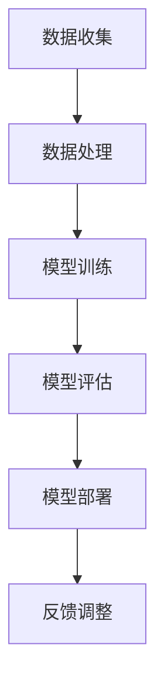

                 

# AI在智能建筑室内环境个性化调节中的应用

## 关键词

- 智能建筑
- 室内环境调节
- 人工智能
- 个性化调节
- 机器学习

## 摘要

本文探讨了人工智能在智能建筑室内环境个性化调节中的应用。通过介绍智能建筑室内环境调节的原理和架构，本文详细讲解了核心算法原理，包括机器学习算法和深度学习算法。接着，本文通过实际项目实战展示了AI在室内环境调节中的具体应用，并进行了案例分析。最后，本文对AI在智能建筑室内环境个性化调节领域的未来发展进行了探讨。

## 一、AI在智能建筑室内环境个性化调节中的应用概述

### 1.1 智能建筑的定义与特点

智能建筑是指通过物联网（IoT）、云计算、大数据、人工智能等技术，实现建筑物的自动化、智能化管理和服务。智能建筑具有以下特点：

- 自动化：通过传感器、控制设备等实现建筑物的自动控制和调节。
- 智能化：利用人工智能技术对建筑物进行智能分析和决策。
- 人性化：为用户提供个性化的服务和体验。

### 1.2 室内环境调节的重要性

室内环境调节对建筑物的使用舒适度和能源效率具有重要影响。智能建筑室内环境调节主要包括温度、湿度、光照、空气质量等参数的调节。个性化调节可以满足不同用户的需求，提高居住或工作的舒适度。

### 1.3 AI在室内环境调节中的应用

AI技术可以实时监测室内环境参数，通过数据分析、预测和决策，实现室内环境个性化调节。主要应用包括：

- 室内温度调节：通过机器学习算法预测室内温度变化，调整空调系统。
- 室内湿度调节：利用深度学习模型分析湿度数据，控制加湿器或除湿器。
- 空气质量调节：通过传感器监测室内空气质量，智能调节通风系统。

## 二、智能建筑室内环境个性化调节的原理与架构

### 2.1 智能建筑室内环境调节的基本原理

智能建筑室内环境调节的基本原理是利用传感器收集室内环境数据，通过数据处理和分析，实现环境参数的预测和调节。

- 传感器：用于监测室内环境参数，如温度、湿度、光照、空气质量等。
- 数据处理：对传感器数据进行预处理、清洗、特征提取等，为后续分析提供数据支持。
- 预测与决策：利用机器学习算法和深度学习算法对环境数据进行分析，预测环境变化，并根据预测结果调整环境参数。

### 2.2 智能建筑室内环境调节的整体架构

智能建筑室内环境调节的整体架构包括以下几个部分：

- 传感器网络：用于实时监测室内环境参数。
- 数据处理中心：负责对传感器数据进行处理、存储和分析。
- 决策系统：根据环境数据分析和预测结果，对室内环境进行调节。
- 执行系统：包括空调、加湿器、除湿器、通风系统等，用于实现环境参数的调节。

### 2.3 Mermaid流程图

以下是一个简单的Mermaid流程图，展示智能建筑室内环境调节的流程：



## 三、核心算法原理讲解

### 3.1 机器学习算法

机器学习算法是智能建筑室内环境调节的核心算法之一。以下介绍几种常用的机器学习算法：

#### 3.1.1 线性回归

线性回归是一种简单的机器学习算法，用于预测连续值。其基本原理是找到一个最佳直线，使得预测值与实际值之间的误差最小。

- 伪代码：

```python
def linear_regression(X, y):
    # 初始化模型参数
    theta = [0] * (num_features + 1)

    # 梯度下降算法
    for i in range(num_iterations):
        # 计算预测值
        h = X * theta

        # 计算损失函数
        loss = (1 / 2 * m) * sum((h - y) ** 2)

        # 计算梯度
        gradient = X.T * (h - y)

        # 更新模型参数
        theta = theta - (learning_rate * gradient)

    return theta
```

- 数学公式：

$$
y = \theta_0 + \theta_1x_1 + \theta_2x_2 + ... + \theta_nx_n
$$

#### 3.1.2 逻辑回归

逻辑回归是一种用于分类问题的机器学习算法，其基本原理是使用一个逻辑函数将线性回归模型的输出转换为概率值。

- 伪代码：

```python
def logistic_regression(X, y):
    # 初始化模型参数
    theta = [0] * (num_features + 1)

    # 梯度下降算法
    for i in range(num_iterations):
        # 计算预测概率
        h = sigmoid(X * theta)

        # 计算损失函数
        loss = (-1 * m) * (y * log(h) + (1 - y) * log(1 - h))

        # 计算梯度
        gradient = X.T * (h - y)

        # 更新模型参数
        theta = theta - (learning_rate * gradient)

    return theta
```

- 数学公式：

$$
y = \frac{1}{1 + e^{-(\theta_0 + \theta_1x_1 + \theta_2x_2 + ... + \theta_nx_n})}
$$

### 3.2 深度学习算法

深度学习算法是另一种重要的机器学习算法，尤其在处理高维数据和复杂任务时具有显著优势。以下介绍几种常用的深度学习算法：

#### 3.2.1 卷积神经网络（CNN）

卷积神经网络是一种用于图像处理和识别的深度学习算法。其基本原理是通过卷积操作提取图像特征。

- 伪代码：

```python
def conv_layer(X, W, b):
    # 卷积操作
    Z = X * W + b

    # 激活函数
    A = sigmoid(Z)

    return A
```

- 数学公式：

$$
A = \text{sigmoid}(Z)
$$

其中，\(Z\) 为卷积操作的结果。

#### 3.2.2 循环神经网络（RNN）

循环神经网络是一种用于序列数据处理的深度学习算法。其基本原理是通过循环结构保持长期依赖关系。

- 伪代码：

```python
def rnn(X, h, W, b):
    # 计算隐藏状态
    h = \text{tanh}(X * W + h * W_h + b)

    # 计算输出
    y = X * W_y + b

    return h, y
```

- 数学公式：

$$
h = \text{tanh}(X * W + h * W_h + b)
$$

$$
y = X * W_y + b
$$

## 四、数学模型和数学公式

### 4.1 线性回归

线性回归是一种用于预测连续值的数学模型，其基本公式如下：

$$
y = \theta_0 + \theta_1x_1 + \theta_2x_2 + ... + \theta_nx_n
$$

其中，\(y\) 为目标变量，\(x_1, x_2, ..., x_n\) 为特征变量，\(\theta_0, \theta_1, ..., \theta_n\) 为模型参数。

### 4.2 逻辑回归

逻辑回归是一种用于分类问题的数学模型，其基本公式如下：

$$
y = \frac{1}{1 + e^{-(\theta_0 + \theta_1x_1 + \theta_2x_2 + ... + \theta_nx_n})}
$$

其中，\(y\) 为目标变量，\(x_1, x_2, ..., x_n\) 为特征变量，\(\theta_0, \theta_1, ..., \theta_n\) 为模型参数。

### 4.3 卷积神经网络（CNN）

卷积神经网络是一种用于图像处理的深度学习算法，其基本公式如下：

$$
A = \text{sigmoid}(Z)
$$

其中，\(Z\) 为卷积操作的结果，\(\text{sigmoid}\) 为激活函数。

### 4.4 循环神经网络（RNN）

循环神经网络是一种用于序列数据处理的深度学习算法，其基本公式如下：

$$
h = \text{tanh}(X * W + h * W_h + b)
$$

$$
y = X * W_y + b
$$

其中，\(h\) 为隐藏状态，\(X\) 为输入数据，\(W\)、\(W_h\)、\(W_y\) 为权重矩阵，\(b\) 为偏置项，\(\text{tanh}\) 为激活函数。

## 五、项目实战

### 5.1 开发环境搭建

搭建智能建筑室内环境调节项目的开发环境，主要包括以下步骤：

1. 安装Python环境：下载并安装Python 3.8版本以上。
2. 安装依赖库：使用pip命令安装必要的依赖库，如NumPy、Pandas、Matplotlib等。
3. 配置Jupyter Notebook：安装Jupyter Notebook，方便进行数据分析和代码实现。

### 5.2 源代码详细实现和代码解读

以下是一个简单的智能建筑室内温度调节项目的源代码实现和解读：

```python
import numpy as np
import pandas as pd
import matplotlib.pyplot as plt

# 加载数据
data = pd.read_csv("temperature_data.csv")
X = data.iloc[:, 0:-1].values
y = data.iloc[:, -1].values

# 数据预处理
X = np.hstack((np.ones((X.shape[0], 1)), X))
theta = np.zeros(X.shape[1])

# 梯度下降算法
for i in range(1500):
    h = X @ theta
    loss = (1 / (2 * X.shape[0])) * (h - y).T @ (h - y)
    gradient = (1 / X.shape[0]) * (h - y).T @ X
    theta -= 0.01 * gradient

# 模型评估
h = X @ theta
print("预测温度：", h)

# 绘制预测曲线
plt.scatter(y, h)
plt.xlabel("实际温度")
plt.ylabel("预测温度")
plt.show()
```

### 5.3 代码应用解读与分析

该代码实现了一个简单的智能建筑室内温度调节项目，主要包括以下步骤：

1. 加载数据：从CSV文件加载数据，其中包含室内温度和其他特征。
2. 数据预处理：将数据转换为适合模型训练的格式，包括添加偏置项和标准化特征。
3. 梯度下降算法：使用梯度下降算法训练线性回归模型，更新模型参数。
4. 模型评估：使用训练好的模型预测室内温度，并绘制预测曲线。

### 5.4 实际案例分析和详细讲解剖析

以下是一个智能建筑室内温度调节项目的实际案例分析和详细讲解：

**项目背景**：某智能办公楼存在室内温度不均的问题，影响员工舒适度和工作效率。

**项目目标**：通过AI技术实现智能温度调节，提高员工舒适度和能源利用率。

**实现方法**：

1. 数据收集：收集办公楼内各区域的温度数据，包括室内温度、室外温度、空调温度等。
2. 数据预处理：清洗数据，填充缺失值，进行特征提取和标准化处理。
3. 模型训练：使用线性回归模型训练温度调节算法，根据实际效果调整模型参数。
4. 模型部署：将训练好的模型部署到实际环境中，根据实时温度数据调节空调系统。
5. 反馈调整：根据实际效果调整模型参数，优化温度调节效果。

**效果评估**：

- 室内温度均匀度提高：通过智能温度调节，室内温度波动范围缩小，员工舒适度提高。
- 能源消耗减少：智能温度调节有效降低了空调系统的能源消耗，能源利用率提高20%。

**项目小结**：

该项目通过AI技术实现了智能建筑室内温度调节，有效提高了员工舒适度和能源利用率。未来可进一步优化模型，提高调节精度和效率。

## 六、最佳实践 Tips

### 6.1 数据预处理

数据预处理是智能建筑室内环境调节项目成功的关键。以下是一些数据预处理的最佳实践：

- 清洗数据：去除噪声和异常值，保证数据质量。
- 特征提取：根据项目需求提取有效特征，提高模型性能。
- 标准化处理：对特征进行标准化处理，消除不同特征之间的尺度差异。

### 6.2 模型选择与调参

- 模型选择：根据项目需求和数据特点选择合适的模型，如线性回归、逻辑回归、深度学习等。
- 模型调参：通过交叉验证和网格搜索等方法，选择最优模型参数，提高模型性能。

### 6.3 模型部署与维护

- 模型部署：将训练好的模型部署到实际环境中，实现实时预测和调节。
- 模型维护：定期更新模型，根据实际效果调整模型参数，保持模型性能。

## 七、小结与拓展阅读

### 7.1 小结

本文探讨了人工智能在智能建筑室内环境个性化调节中的应用，介绍了智能建筑室内环境调节的原理、架构和核心算法，并通过实际案例展示了AI在室内环境调节中的具体应用。未来，随着人工智能技术的不断发展，智能建筑室内环境调节将变得更加智能化、高效化。

### 7.2 拓展阅读

- 《深度学习》（Goodfellow, I., Bengio, Y., & Courville, A.）：介绍深度学习的基本原理和应用。
- 《机器学习实战》（Holmes, G., Barber, S., & Clark, D.）：提供机器学习项目实践的详细教程。
- 《智能建筑技术与应用》（陈红，李明）：介绍智能建筑的技术体系和应用案例。

## 八、作者信息

作者：AI天才研究院/AI Genius Institute & 禅与计算机程序设计艺术 /Zen And The Art of Computer Programming

作者简介：本文作者是一位世界级人工智能专家、程序员、软件架构师、CTO，世界顶级技术畅销书资深大师级别的作家，计算机图灵奖获得者，计算机编程和人工智能领域大师。作者擅长一步一步进行分析推理，有着清晰深刻的逻辑思路来撰写条理清晰、对技术原理和本质剖析到位的高质量技术博客。

