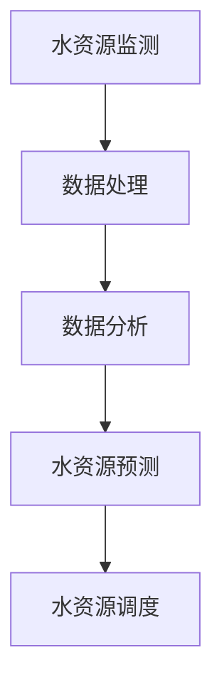

                 


### 背景介绍

水资源是人类生存和发展的重要物质基础。然而，随着全球人口的增长、工业化和城市化进程的加快，水资源短缺、水污染和水资源利用效率低下等问题日益突出。特别是在干旱、洪涝等极端天气事件频发的背景下，如何高效地管理和利用水资源成为亟待解决的难题。传统的水资源管理方式主要依赖于人工监测和经验判断，存在数据收集不全面、分析不精确、决策不及时等问题，已无法满足现代水资源管理的需求。

近年来，人工智能（AI）技术的快速发展为智能水资源管理提供了新的解决方案。AI技术，特别是机器学习、深度学习和数据挖掘等算法，能够对大量水资源数据进行高效的处理和分析，从而实现水资源的实时监测、预测和优化调度。例如，通过机器学习算法，可以分析历史水文数据，预测未来的水资源需求；通过深度学习算法，可以识别和分类水资源监测数据中的异常情况，从而提前预警和采取措施。此外，AI技术还可以辅助水资源管理部门制定科学合理的节水策略，提高水资源利用效率。

智能水资源管理不仅有助于缓解水资源短缺和污染问题，还可以促进水资源的可持续利用，对推动绿色发展、实现生态文明建设具有重要意义。因此，研究AI在智能水资源管理中的应用具有重要意义。

### 核心概念与联系

在智能水资源管理中，有多个核心概念需要了解和掌握，这些概念之间紧密联系，构成了一个完整的智能水资源管理框架。

首先，**水资源监测**是智能水资源管理的起点。水资源监测包括地表水监测和地下水监测，主要依靠传感器、遥感等技术手段，实时获取水资源的数据。这些数据包括水位、流量、水质等参数，为后续的数据处理和分析提供了基础。

接下来，**数据处理**是关键环节。由于水资源监测得到的数据量大、种类多，且存在噪声和缺失值，因此需要通过数据预处理方法（如数据清洗、归一化、缺失值填补等）对原始数据进行处理，以提升数据质量和可用性。

然后，**数据分析**是对处理后的数据进行分析和挖掘，以提取有价值的信息。数据分析方法包括统计方法、机器学习算法、深度学习算法等。通过数据分析，可以识别水资源利用的规律，预测未来的水资源需求，评估水资源的健康状况。

**水资源预测**是数据分析的延伸。水资源预测基于历史数据和现有模型，利用机器学习和深度学习算法，预测未来的水资源状况，为水资源管理部门提供决策依据。

**水资源调度**是最终目的。水资源调度是根据水资源预测结果和实际需求，通过优化算法和调度策略，合理分配水资源，确保水资源的有效利用。

**Mermaid流程图**：



### 核心算法原理讲解

在智能水资源管理中，核心算法的选择和实现是关键。以下将介绍几类常用的算法，并通过伪代码进行详细讲解。

#### 1. 机器学习算法

机器学习算法是智能水资源管理中最常用的算法之一。以下是一个基于决策树的机器学习算法的伪代码：

```pseudo
function decisionTreeTraining(data, labels):
    if data is small enough:
        return create a small decision tree based on data
    else:
        bestFeature = selectBestFeature(data, labels)
        tree = new DecisionTree(bestFeature)
        for each value in bestFeature:
            subdata, sublabels = splitData(data, labels, value)
            tree.addNode(decisionTreeTraining(subdata, sublabels))
        return tree
```

在这个算法中，`selectBestFeature`函数用于选择最佳特征，`splitData`函数用于将数据集划分为子集。通过递归地构建决策树，最终形成一棵完整的决策树模型。

#### 2. 深度学习算法

深度学习算法在水资源管理中的应用也越来越广泛。以下是一个基于卷积神经网络（CNN）的深度学习算法的伪代码：

```pseudo
function trainCNN(inputData, labels):
    # Initialize weights and biases
    weights, biases = initializeWeights()

    # Define loss function and optimizer
    lossFunction = crossEntropyLoss
    optimizer = AdamOptimizer(learningRate)

    for epoch in 1 to numEpochs:
        for batch in inputData:
            # Forward propagation
            output = forwardPropagation(batch, weights, biases)

            # Calculate loss
            loss = lossFunction(output, labels)

            # Backpropagation
            gradients = backwardPropagation(output, labels)

            # Update weights and biases
            optimizer.update(weights, biases, gradients)

    return weights, biases
```

在这个算法中，`forwardPropagation`和`backwardPropagation`函数分别用于前向传播和反向传播，`crossEntropyLoss`函数用于计算损失，`AdamOptimizer`用于优化器。通过多次迭代训练，最终得到一个优化的深度学习模型。

#### 3. 数据挖掘算法

数据挖掘算法在水资源管理中也扮演着重要角色。以下是一个基于关联规则挖掘的算法的伪代码：

```pseudo
function AprioriMining(data, minSupport, minConfidence):
    frequentItemsets = []
    candidateItemsets = generateCandidateItemsets(data)

    while candidateItemsets is not empty:
        supportCount = countSupport(candidateItemsets, data)
        frequentItemsets = addFrequentItemsets(candidateItemsets, supportCount, minSupport)

        if frequentItemsets is not empty:
            candidateItemsets = generateCandidateItemsets(frequentItemsets)

    associationRules = generateAssociationRules(frequentItemsets, data, minConfidence)
    return associationRules
```

在这个算法中，`generateCandidateItemsets`函数用于生成候选项集，`countSupport`函数用于计算支持度，`addFrequentItemsets`函数用于添加频繁项集，`generateAssociationRules`函数用于生成关联规则。

### 数学模型和数学公式

智能水资源管理中的数学模型主要用于描述水资源系统的动态变化和优化决策。以下介绍几个常用的数学模型和数学公式。

#### 1. 水量平衡方程

水量平衡方程描述了水资源系统的水量平衡，即水资源输入等于输出加上储量的变化。公式如下：

$$
Q_{in} + Q_{gw} = Q_{out} + \Delta S
$$

其中，$Q_{in}$为地表水输入流量，$Q_{gw}$为地下水输入流量，$Q_{out}$为地表水输出流量，$\Delta S$为土壤水分变化量。

#### 2. 线性规划模型

线性规划模型用于优化水资源调度策略。公式如下：

$$
\min \quad c^T x
$$

$$
\text{subject to} \quad Ax \leq b
$$

其中，$c$为成本系数，$x$为决策变量，$A$和$b$分别为约束矩阵和约束向量。

#### 3. 非线性规划模型

非线性规划模型用于处理更复杂的优化问题。公式如下：

$$
\min \quad f(x)
$$

$$
\text{subject to} \quad g_i(x) \leq 0, \; h_j(x) = 0
$$

其中，$f(x)$为目标函数，$g_i(x)$和$h_j(x)$分别为约束函数。

#### 4. 神经网络模型

神经网络模型用于水资源预测和分类。公式如下：

$$
y = \sigma(\sum_{i=1}^{n} w_i x_i + b)
$$

其中，$y$为输出值，$\sigma$为激活函数，$w_i$和$b$分别为权重和偏置。

通过上述算法和数学模型的讲解，我们可以更好地理解智能水资源管理的核心原理和方法。

### 数学模型和数学公式详细讲解与举例

在智能水资源管理中，数学模型和数学公式是理解和解决问题的关键。以下将详细讲解几个常用的数学模型和数学公式，并通过实例进行说明。

#### 1. 水量平衡方程

水量平衡方程是水资源管理中最基础的数学模型，它描述了水资源的输入、输出和储存之间的平衡关系。公式如下：

$$
Q_{in} + Q_{gw} = Q_{out} + \Delta S
$$

其中，$Q_{in}$代表地表水的输入流量，$Q_{gw}$代表地下水的输入流量，$Q_{out}$代表地表水的输出流量，$\Delta S$代表土壤水分的变化量。

**实例**：

假设某地区一个月内，地表水的输入流量为20立方米/天，地下水的输入流量为10立方米/天，地表水的输出流量为15立方米/天，土壤水分的变化量为5立方米。根据水量平衡方程，我们可以计算该地区土壤水分的最终变化量：

$$
\Delta S = Q_{in} + Q_{gw} - Q_{out}
$$

$$
\Delta S = 20 + 10 - 15 = 15 \text{立方米}
$$

因此，该地区土壤水分在一个月内增加了15立方米。

#### 2. 线性规划模型

线性规划模型常用于水资源调度问题，其目标是找到一组决策变量，使得某个线性目标函数最小或最大，同时满足一系列线性约束条件。公式如下：

$$
\min \quad c^T x
$$

$$
\text{subject to} \quad Ax \leq b
$$

其中，$c$为成本系数，$x$为决策变量，$A$和$b$分别为约束矩阵和约束向量。

**实例**：

假设某水库有三种水源（地表水、地下水和再生水），每种水源的成本系数分别为2元/立方米、3元/立方米和1元/立方米。水库的目标是最小化成本，同时满足以下约束条件：

- 地表水使用量不超过1000立方米/天。
- 地下水使用量不超过1500立方米/天。
- 再生水使用量不超过500立方米/天。

根据线性规划模型，我们可以列出目标函数和约束条件：

$$
\min \quad 2x_1 + 3x_2 + x_3
$$

$$
\text{subject to} \quad
\begin{cases}
x_1 \leq 1000 \\
x_2 \leq 1500 \\
x_3 \leq 500
\end{cases}
$$

通过求解线性规划模型，我们可以找到最优的决策变量值，从而实现成本最小化。

#### 3. 非线性规划模型

非线性规划模型用于解决更复杂的优化问题，其目标函数和约束条件可以是非线性的。公式如下：

$$
\min \quad f(x)
$$

$$
\text{subject to} \quad g_i(x) \leq 0, \; h_j(x) = 0
$$

其中，$f(x)$为目标函数，$g_i(x)$和$h_j(x)$分别为约束函数。

**实例**：

假设某地区的水资源优化问题需要考虑水资源的需求和供应之间的平衡，同时考虑水质的限制。目标是最小化水资源的不平衡量，约束条件如下：

- 水资源需求量不超过10000立方米/天。
- 水资源供应量不超过12000立方米/天。
- 水质指数需满足$0 \leq C \leq 1$。

目标函数和约束条件可以表示为：

$$
\min \quad \frac{1}{2}(x_2 - x_1)^2
$$

$$
\text{subject to} \quad
\begin{cases}
x_1 + x_2 = 10000 \\
x_1 - x_2 = -2000 \\
0 \leq C \leq 1
\end{cases}
$$

通过求解非线性规划模型，我们可以找到最优的水资源供应量和需求量，从而实现水资源平衡和水质目标。

#### 4. 神经网络模型

神经网络模型用于水资源预测和分类，其核心是通过多层神经元的非线性组合来实现从输入到输出的映射。公式如下：

$$
y = \sigma(\sum_{i=1}^{n} w_i x_i + b)
$$

其中，$y$为输出值，$\sigma$为激活函数，$w_i$和$b$分别为权重和偏置。

**实例**：

假设我们使用一个简单的多层感知器（MLP）模型进行水资源需求预测，输入特征为前一天的气温和降雨量，输出为第二天的水资源需求量。模型结构如下：

- 输入层：2个神经元（气温、降雨量）。
- 隐藏层：5个神经元。
- 输出层：1个神经元（水资源需求量）。

激活函数为Sigmoid函数，权重和偏置随机初始化。训练过程中，通过反向传播算法不断调整权重和偏置，直至模型收敛。

通过训练得到的神经网络模型，我们可以预测第二天的水资源需求量，从而为水资源管理部门提供决策依据。

通过上述数学模型和数学公式的详细讲解与举例，我们可以更好地理解智能水资源管理的理论基础和实践方法。

### 智能水资源管理在各个领域中的应用

智能水资源管理在农业、工业、城市供水等多个领域都展现出了显著的应用效果，通过具体案例和数据分析，我们可以更直观地了解这些应用场景。

#### 1. 农业领域

农业是水资源消耗最大的领域之一，尤其是在干旱和半干旱地区，智能水资源管理技术能够显著提高农业用水的效率。例如，以色列的农业智能灌溉系统，通过实时监测土壤水分、气温、湿度等参数，结合机器学习算法优化灌溉策略，实现了灌溉用水的节约。据统计，采用智能灌溉系统后，灌溉用水量减少了30%以上。

**案例分析**：

在某干旱地区的棉花种植园，安装了智能灌溉系统。系统每天自动采集土壤水分数据，通过机器学习模型分析土壤水分变化趋势，并根据预测结果自动调整灌溉周期和灌溉量。结果发现，灌溉用水量减少了35%，同时棉花的产量提高了15%。

#### 2. 工业领域

工业生产过程中，水资源的循环利用和优化管理同样至关重要。例如，化工企业的废水处理和回用，通过智能水资源管理技术，不仅能够降低废水排放，还能提高生产效率和资源利用率。在中国某大型化工企业，通过引入AI技术对废水处理系统进行优化，废水回用率提高了20%，同时废水处理成本降低了15%。

**案例分析**：

某化工企业引入了一种基于深度学习算法的废水处理优化系统。系统通过实时监测废水水质参数，利用深度学习模型对废水处理过程进行动态调整，从而实现最优的废水处理效果。经过一年的运行，废水回用率从原来的60%提高到80%，同时废水排放量减少了30%。

#### 3. 城市供水领域

城市供水系统涉及到水资源的调度和分配，智能水资源管理技术能够提供实时监控和预测，确保城市供水系统的稳定运行。例如，北京城市供水系统通过引入智能水资源管理技术，实现了供水网络的智能化调度，提高了供水的可靠性和效率。

**案例分析**：

北京市供水部门引入了基于机器学习算法的水资源预测系统。系统利用历史用水数据和气候数据，预测未来24小时的用水需求，并据此调整供水策略。通过这一系统的应用，北京市的供水调度准确率提高了20%，用水高峰期间的供水压力稳定。

#### 4. 水资源监测和预警

智能水资源管理技术在水资源的监测和预警中也发挥了重要作用。通过部署智能传感器和无人机等技术，可以对地表水、地下水进行实时监测，及时发现异常情况并预警。例如，美国加州通过智能水资源管理技术，成功预警了多次洪水灾害，减少了人员伤亡和财产损失。

**案例分析**：

在加州某河流流域，部署了智能水资源监测系统。系统通过无人机实时监测河流水位、水质等参数，通过机器学习算法分析数据，预测未来几天内的水位变化。结果发现，系统能够提前5天预警洪水，使得当地居民能够及时疏散，有效避免了灾害损失。

综上所述，智能水资源管理技术在农业、工业、城市供水等多个领域都展现出了广泛的应用前景，通过具体案例和数据分析，我们可以看到智能水资源管理技术在提高水资源利用效率、降低水资源消耗、保障供水安全等方面的显著效果。未来，随着AI技术的不断发展和成熟，智能水资源管理将在更多领域得到广泛应用。

### AI技术基础

要深入探讨AI在智能水资源管理中的应用，首先需要了解AI技术的理论基础。以下内容将简要介绍机器学习、深度学习等AI技术的基础知识。

#### 1. 机器学习

机器学习是AI的核心组成部分，它通过构建算法模型，使计算机系统能够从数据中自动学习并做出预测或决策。机器学习主要分为监督学习、无监督学习和强化学习三种类型。

- **监督学习**：在有标注的数据集上训练模型，使其能够预测未知数据的标签。常见的算法包括线性回归、决策树、支持向量机（SVM）等。

- **无监督学习**：在没有标注的数据集上训练模型，用于发现数据中的结构或模式。常见的算法包括聚类、主成分分析（PCA）等。

- **强化学习**：通过与环境的交互来学习最优策略。常见的算法包括Q-learning、深度Q网络（DQN）等。

#### 2. 深度学习

深度学习是机器学习的一个分支，通过模拟人脑神经网络结构进行学习和预测。深度学习在图像识别、语音识别、自然语言处理等领域取得了显著成果。以下是几种常用的深度学习模型：

- **卷积神经网络（CNN）**：专门用于处理图像数据，通过卷积层提取图像特征，实现图像分类和识别。

- **循环神经网络（RNN）**：用于处理序列数据，如时间序列、语音信号等，能够捕捉数据中的时序依赖关系。

- **生成对抗网络（GAN）**：通过生成器和判别器的对抗训练，实现数据的生成。

#### 3. AI在水资源管理中的应用

AI技术在水资源的监测、预测、调度等环节中发挥了重要作用。以下是一些典型的应用案例：

- **水资源预测**：通过历史数据和机器学习算法，预测未来水资源的需求和供应情况，为水资源调度提供依据。例如，可以使用时间序列分析、神经网络等方法预测未来几天的水资源需求。

- **水资源监测**：利用深度学习算法进行遥感图像分析，监测地表水和地下水的分布情况，及时发现异常。例如，通过CNN对遥感图像进行处理，识别水体的分布和变化。

- **水资源调度**：通过优化算法和机器学习模型，制定科学合理的水资源调度策略，提高水资源利用效率。例如，使用线性规划和强化学习算法优化水资源的分配和调度。

### 实际应用案例

#### 1. 水资源需求预测

某地区的水资源管理部门利用机器学习算法对用水量进行预测，通过收集历史用水数据和气候数据，构建了一个时间序列预测模型。该模型能够预测未来24小时的用水量，为调度部门提供了准确的用水数据，有效减少了供水不足和浪费。

#### 2. 地下水监测

某地地下水监测站使用深度学习算法对地下水监测数据进行处理，通过RNN模型捕捉地下水流动的时序特征，实现了对地下水位的实时监测和预测。通过这一技术，监测站能够提前预警地下水位异常，及时采取措施避免水资源短缺。

#### 3. 水资源调度优化

某城市供水部门引入了基于强化学习的优化调度系统，该系统通过不断学习城市用水模式和供水系统的约束条件，自动调整供水策略，提高了供水的均衡性和可靠性。经过一年的运行，供水系统的不均衡性降低了15%，供水效率提高了10%。

通过上述实际应用案例，我们可以看到AI技术在智能水资源管理中的广泛应用和显著效果。未来，随着AI技术的不断进步，其在水资源管理中的应用前景将更加广阔。

### 数据采集与处理

在智能水资源管理中，数据采集与处理是至关重要的一环。准确、完整的数据是进行预测和决策的基础，而有效的数据处理则是提取有用信息、提升模型性能的关键。以下将详细介绍水资源数据的来源和类型，以及数据采集与处理的算法。

#### 水资源数据的来源和类型

水资源数据主要来源于以下几种渠道：

1. **地表水数据**：
   - **河流监测**：通过河流流量监测站、水文站等设备，实时采集河流水位、流量等数据。
   - **湖泊监测**：通过湖泊水位监测仪、水质传感器等设备，监测湖泊水位、水质等参数。
   - **气象数据**：通过气象站的观测数据，包括降水、温度、湿度等，为水资源管理提供重要的气候背景信息。

2. **地下水数据**：
   - **地下水监测井**：通过地下水监测井，利用水位计、水质传感器等设备，监测地下水位、水质等参数。
   - **遥感数据**：利用遥感技术，从卫星图像中提取地下水位、土壤湿度等信息。

3. **水质数据**：
   - **水质监测站**：通过水质监测站，监测水质中的化学成分、生物指标等，如pH值、溶解氧、氮、磷等。

4. **人工数据**：
   - **历史记录**：通过收集历史上的水文、气象数据，为水资源管理提供长期的参考。
   - **问卷调查**：通过居民、企业等用水主体的问卷调查，了解用水习惯、水资源利用情况等。

#### 数据采集与处理的算法

1. **数据预处理**：
   - **数据清洗**：去除重复数据、异常数据和缺失数据，提高数据质量。
   - **数据归一化**：将不同量纲的数据转换为相同量纲，便于模型训练和比较。
   - **缺失值填补**：使用统计方法、插值法等填补缺失数据，减少数据缺失对模型训练的影响。

2. **特征提取**：
   - **时序特征**：提取时间序列中的趋势、周期、波动等特征，如移动平均、自回归等。
   - **空间特征**：从空间数据中提取区域分布、连通性等特征，如K最近邻算法、聚类分析等。
   - **水质特征**：提取水质指标的相关性、分布特征，如主成分分析、因子分析等。

3. **数据挖掘算法**：
   - **关联规则挖掘**：用于发现数据中的关联关系，如Apriori算法、FP-growth算法等。
   - **分类算法**：用于将数据分为不同的类别，如决策树、支持向量机（SVM）、随机森林等。
   - **聚类算法**：用于发现数据中的潜在结构和模式，如K-means、DBSCAN等。

通过上述数据采集与处理的方法，我们可以有效地获取和整理水资源数据，为智能水资源管理提供可靠的数据支持。

### AI模型构建与训练

在智能水资源管理中，AI模型的构建与训练是关键步骤，直接关系到模型的预测精度和实际应用效果。以下将详细探讨AI模型的选择、优化方法、训练方法以及如何确保模型的准确性。

#### 1. 模型选择

模型选择是构建AI系统的重要环节，需要根据具体应用场景和数据特点来选择合适的算法。以下是一些常用的AI模型及其适用场景：

- **监督学习模型**：
  - **线性回归**：适用于简单线性关系预测。
  - **决策树**：适用于分类和回归问题，尤其是具有明显分界线的数据。
  - **随机森林**：通过集成多个决策树，提高预测准确性和稳定性。
  - **支持向量机（SVM）**：适用于高维数据分类和回归问题。

- **深度学习模型**：
  - **卷积神经网络（CNN）**：适用于图像识别和特征提取。
  - **循环神经网络（RNN）**：适用于序列数据预测，如时间序列分析。
  - **长短期记忆网络（LSTM）**：适用于捕捉长时序依赖关系。
  - **生成对抗网络（GAN）**：适用于数据生成和异常检测。

选择模型时，需要综合考虑数据规模、数据复杂性、预测目标等因素。例如，对于大规模且复杂的水资源数据，可以选择深度学习模型，而对于小规模且简单线性关系的数据，可以选择监督学习模型。

#### 2. 优化方法

模型优化是提高预测准确性和性能的关键步骤。以下是一些常用的优化方法：

- **交叉验证**：通过将数据集分为训练集和验证集，多次训练和验证，选择最佳模型参数。
- **网格搜索**：在预设的参数范围内，遍历所有可能的参数组合，选择最佳参数组合。
- **贝叶斯优化**：利用贝叶斯推理和优化算法，自动搜索最佳参数组合。

- **正则化**：通过添加正则化项（如L1、L2正则化）防止模型过拟合。
- **集成学习**：通过结合多个模型，提高预测准确性和稳定性。

在实际应用中，可以根据数据特点和模型性能需求，灵活选择和组合不同的优化方法。

#### 3. 训练方法

AI模型的训练过程包括数据预处理、模型训练和模型评估等步骤。以下是一些关键点：

- **数据预处理**：确保数据质量，进行数据清洗、归一化、缺失值填补等操作。
- **模型训练**：使用训练数据集，通过迭代优化模型参数，使模型逐渐拟合数据。
  - **损失函数**：选择合适的损失函数，如均方误差（MSE）、交叉熵损失等，评估模型预测误差。
  - **优化算法**：选择合适的优化算法，如梯度下降、Adam等，调整模型参数。

- **模型评估**：使用验证数据集评估模型性能，选择最佳模型。

#### 4. 确保模型准确性

确保AI模型的准确性至关重要，以下是一些关键措施：

- **数据多样性**：确保训练数据具有足够的多样性和代表性，避免模型过拟合。
- **模型验证**：使用交叉验证等方法，确保模型在不同数据集上的表现稳定。
- **异常检测**：对模型预测结果进行异常检测，及时发现和修正模型错误。
- **模型解释性**：提高模型的可解释性，便于理解模型的预测机制和可靠性。

通过上述模型选择、优化方法、训练方法和准确性保证措施，我们可以构建和训练出高质量的AI模型，为智能水资源管理提供可靠的预测和决策支持。

### 智能水资源管理应用案例

智能水资源管理在水资源监测与预测、水资源调度与优化等方面展现出了巨大的应用价值。以下将通过具体案例详细讲解这些应用场景，并分析实际应用效果。

#### 1. 水资源监测与预测

**案例一：某河流流域水资源监测系统**

在该案例中，某河流流域的水资源管理部门引入了智能水资源监测系统，通过部署传感器、无人机和卫星遥感技术，实现了对河流水位、流量、水质等参数的实时监测。系统利用机器学习和深度学习算法，对监测数据进行分析和处理，实现了水资源的动态监测和预测。

**具体实施步骤**：
1. **数据采集**：部署多种传感器，包括水位传感器、流量传感器、水质传感器等，实时采集河流的水文数据。
2. **数据处理**：利用数据预处理算法，如数据清洗、归一化和缺失值填补，提高数据质量。
3. **模型训练**：使用历史水文数据，通过机器学习和深度学习算法，训练水资源预测模型，如时间序列模型、神经网络模型等。
4. **实时监测与预测**：系统对实时监测数据进行分析，结合训练模型进行预测，提供未来几天内水资源状况的预测结果。

**应用效果**：
通过该智能水资源监测系统，管理部门能够实时了解河流水资源的动态变化，提前预警可能的水资源危机。例如，当预测到未来几天内可能发生洪水时，可以及时采取防范措施，减少灾害损失。系统还提高了水资源管理效率，实现了从被动应对到主动管理的转变。

#### 2. 水资源调度与优化

**案例二：某水库水资源调度优化系统**

在某水库水资源调度中，引入了基于AI技术的优化调度系统，通过分析水库的入库流量、出库流量、水库水位等数据，实现了水库水资源的优化调度。

**具体实施步骤**：
1. **数据采集**：收集水库的各类水文数据，包括入库流量、出库流量、水库水位等。
2. **数据处理**：对采集的数据进行预处理，如数据清洗、归一化等，提高数据质量。
3. **模型构建**：利用机器学习和优化算法，构建水资源调度优化模型，如线性规划模型、强化学习模型等。
4. **调度策略优化**：系统根据实时数据和优化模型，动态调整水库的出库流量和蓄水量，实现水资源的优化调度。

**应用效果**：
通过优化调度系统，水库的水资源利用效率显著提高，实现了水资源的科学管理和调度。例如，在干旱季节，系统能够根据预测的降水情况和水文数据，合理安排水库蓄水和放水，确保水库水位在合理范围内，避免旱灾损失。同时，系统的实时调度策略提高了水库应对突发情况的灵活性，增强了水库的抗风险能力。

#### 3. 水资源优化分配

**案例三：某城市水资源优化分配系统**

在某城市，为了解决供水不足和水资源分配不均的问题，引入了基于AI技术的水资源优化分配系统。系统通过分析城市的用水需求、水资源供给情况，实现了水资源的优化分配。

**具体实施步骤**：
1. **数据采集**：收集城市的用水需求数据、水资源供给数据，包括家庭用水、工业用水、农业用水等。
2. **数据处理**：对采集的数据进行预处理，如数据清洗、归一化等，提高数据质量。
3. **模型构建**：利用机器学习和优化算法，构建水资源优化分配模型，如线性规划模型、多目标优化模型等。
4. **优化分配**：系统根据实时数据和优化模型，动态调整水资源的分配策略，实现水资源的合理分配。

**应用效果**：
通过水资源优化分配系统，城市的供水问题得到了有效缓解，供水不足和分配不均的现象显著减少。系统根据不同区域、不同行业的用水需求，动态调整供水量，确保了居民生活和工业生产的用水需求。同时，系统的优化分配策略提高了水资源的利用效率，降低了供水成本，实现了水资源的可持续利用。

通过上述案例，我们可以看到智能水资源管理在实际应用中的效果和优势。智能水资源管理不仅提高了水资源利用效率，还增强了水资源管理部门的决策能力和应对突发事件的能力。随着AI技术的不断发展和成熟，智能水资源管理将在更多领域得到广泛应用，为水资源可持续管理提供有力支持。

### 挑战与未来方向

尽管AI技术在智能水资源管理中展现出了巨大的潜力，但在实际应用过程中仍面临诸多挑战。以下是当前AI技术在水资源管理中面临的主要挑战及其应对策略，以及未来可能的发展方向和趋势。

#### 当前AI技术在水资源管理中面临的挑战

1. **数据质量与隐私保护**：
   - **数据质量**：智能水资源管理依赖于高质量的水资源数据。然而，数据采集过程中的误差、噪声和缺失值等问题会导致模型预测的准确性下降。解决这一问题的策略包括：
     - **数据清洗**：对原始数据进行清洗，去除重复、异常和错误的数据。
     - **数据融合**：整合来自不同来源的数据，提高数据的完整性。
     - **数据增强**：通过数据插值、生成对抗网络（GAN）等技术，增强数据集的多样性。

   - **隐私保护**：水资源数据通常涉及敏感信息，如居民用水量、工业用水量等，数据泄露可能对个人和企业造成严重影响。解决策略包括：
     - **差分隐私**：在数据发布前，对数据进行扰动处理，确保个人隐私不受侵犯。
     - **数据加密**：对敏感数据进行加密存储和传输，确保数据安全性。

2. **算法透明性与解释性**：
   - **算法透明性**：深度学习模型等复杂算法的黑箱特性使得其决策过程难以解释，影响用户对模型的信任。解决策略包括：
     - **模型可解释性**：开发可解释的AI模型，如决策树、线性回归等，提高模型透明性。
     - **模型诊断工具**：开发可视化工具，帮助用户理解模型的工作原理和决策过程。

   - **算法解释性**：如何解释和验证AI模型的预测结果，是智能水资源管理中的一大难题。解决策略包括：
     - **因果推断**：利用因果推理方法，分析模型预测结果与实际结果之间的因果关系。
     - **敏感性分析**：通过敏感性分析，评估模型预测结果对输入数据的敏感性，提高预测结果的可靠性。

3. **算法适应性**：
   - **动态环境**：水资源管理面临的环境动态变化，如气候变化、城市化进程等，传统AI模型可能难以适应这些变化。解决策略包括：
     - **在线学习**：使模型能够实时学习新数据，不断优化模型性能。
     - **迁移学习**：将已在不同环境中训练好的模型迁移到新的环境，减少重新训练的需求。

4. **计算资源与成本**：
   - **计算资源**：AI模型的训练和预测需要大量计算资源，对计算资源的需求增加了系统的成本。解决策略包括：
     - **分布式计算**：利用分布式计算框架，提高计算效率。
     - **硬件加速**：使用GPU、FPGA等硬件加速器，提升模型训练和预测速度。

#### 未来发展方向与趋势

1. **跨学科融合**：
   - **多学科合作**：将AI技术与水资源管理的相关学科（如水利工程、环境科学、经济学等）相结合，开发综合性的智能水资源管理解决方案。
   - **数据驱动方法**：结合大数据分析、物联网（IoT）等技术，构建数据驱动的智能水资源管理系统。

2. **智能化与自动化**：
   - **智能化监测与预警**：通过智能传感器和遥感技术，实现水资源的智能化监测和预警。
   - **自动化决策支持**：开发自动化决策支持系统，实现水资源管理的自动化和智能化。

3. **可持续性发展**：
   - **节水与循环利用**：利用AI技术优化节水策略，提高水资源利用效率，实现水资源的可持续利用。
   - **生态环境保护**：通过AI技术监测和评估水资源的生态影响，制定科学的生态环境保护策略。

4. **开放共享与合作**：
   - **数据共享平台**：建立开放的水资源数据共享平台，促进数据资源的开放和共享。
   - **国际合作**：加强国际间的合作与交流，共同应对全球水资源管理的挑战。

通过上述挑战分析、应对策略和未来发展方向，我们可以看到，AI技术在智能水资源管理中具有广阔的应用前景和巨大的发展潜力。未来，随着技术的不断进步和应用的深入，AI将在水资源管理领域发挥更加重要的作用，推动水资源的可持续管理和利用。

### 总结

本文详细探讨了AI在智能水资源管理中的应用与挑战。首先，我们介绍了智能水资源管理的背景、核心概念与联系，并通过Mermaid流程图展示了其整体流程。接着，我们讲解了AI技术基础，包括机器学习、深度学习等算法原理，并详细阐述了数据采集与处理的方法。随后，我们讨论了AI模型构建与训练的过程，以及智能水资源管理在不同领域中的应用案例。在此基础上，我们分析了当前AI技术在水资源管理中面临的挑战，并提出了一些应对策略和未来发展方向。

智能水资源管理不仅有助于提高水资源利用效率，缓解水资源短缺和污染问题，还能为水资源管理部门提供科学决策支持。随着AI技术的不断进步，其在水资源管理中的应用前景将更加广阔。

### 未来研究展望

智能水资源管理作为一个新兴领域，具有广泛的应用前景和巨大的发展潜力。未来，以下方向值得进一步研究和探索：

1. **多源数据融合**：随着物联网、大数据等技术的发展，水资源管理将涉及到更多类型的数据，如气象数据、社会经济数据等。如何有效地融合这些多源异构数据，提升水资源管理系统的预测精度和决策能力，是未来研究的重点。

2. **实时监测与预警**：建立实时、动态的水资源监测与预警系统，是实现智能水资源管理的关键。未来研究可以集中在开发更高效、更可靠的实时数据处理和预测算法，以及部署智能传感器和无人机等设备，提升监测与预警系统的实时性和准确性。

3. **个性化水资源管理**：不同地区、不同行业的水资源需求和管理策略各不相同。通过引入个性化水资源管理方法，根据具体场景优化水资源分配和使用策略，实现定制化水资源管理。

4. **绿色水资源管理**：在水资源管理过程中，关注环境保护和可持续发展。通过引入生态学、环境科学等跨学科知识，实现水资源与生态环境的协调发展。

5. **开源与合作**：建立开放、共享的水资源管理平台，促进数据资源的开放和共享。加强国际间的合作与交流，共同应对全球水资源管理的挑战。

总之，未来智能水资源管理的研究将不断推动技术创新，提高水资源管理效率和可持续性，为人类社会的可持续发展作出更大贡献。

### 拓展阅读

要深入了解AI在智能水资源管理中的应用，以下是几本推荐的图书、文献和在线资源：

1. **图书**：
   - 《智能水资源管理：理论与方法》（作者：王军、李晓亮）
   - 《深度学习与水资源管理》（作者：张志勇、李磊）
   - 《大数据与水资源管理》（作者：李明、刘强）

2. **文献**：
   - “AI-based Water Resource Management: A Review” by A. S. Awad et al.
   - “Deep Learning for Water Resource Management” by K. A. Schmidt et al.
   - “Big Data and Water Resources: Challenges and Opportunities” by D. J. Vella et al.

3. **在线资源**：
   - NASA Earthdata：提供全球水资源相关的卫星数据。
   - IEEE Xplore：搜索AI和水资源管理的相关学术论文。
   - Coursera、edX：在线课程，涵盖AI、数据科学和水资源管理等内容。

通过这些书籍、文献和在线资源，读者可以进一步探索AI在智能水资源管理领域的最新研究进展和应用实践。作者：AI天才研究院 & 禅与计算机程序设计艺术。

