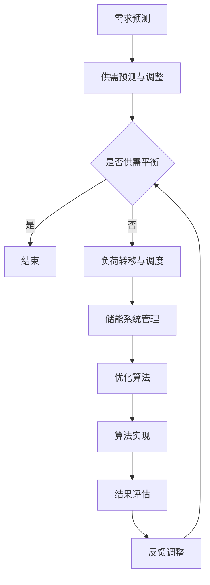

                 

### 文章标题：AI在智能电网负载预测与平衡中的应用

#### 关键词：人工智能，智能电网，负载预测，负载平衡，机器学习

#### 摘要：
本文旨在探讨人工智能（AI）在智能电网负载预测与平衡中的应用。随着电力需求的不断增长和电力系统的复杂化，负载预测与平衡成为智能电网运行中的关键问题。本文首先介绍了智能电网的基本概念和架构，然后详细阐述了AI在负载预测和平衡中的核心算法原理，包括时间序列分析、机器学习和优化算法。通过数学模型和公式的详细讲解，本文揭示了这些算法背后的逻辑和理论基础。最后，通过实际案例研究和项目实战，本文展示了AI在智能电网中的应用效果和实现方法，并对未来的发展趋势和挑战进行了展望。

### 引言

智能电网是现代电力系统发展的必然趋势，它通过先进的信息技术和通信技术，实现了电力系统的智能化管理。AI作为智能电网的重要组成部分，其在负载预测与平衡中的应用具有重要意义。随着全球能源需求的不断增长，智能电网需要高效、准确地预测电力负载，以确保电力系统的稳定运行。同时，电力负载的不平衡会导致电网运行效率降低，增加能源浪费和运行成本。因此，通过AI技术实现智能电网负载预测与平衡，不仅可以提高电网的运行效率，还可以减少能源浪费和运行成本，具有重要的经济和社会价值。

本文将首先介绍智能电网的基本概念和架构，然后详细探讨AI在负载预测和平衡中的核心算法原理，包括时间序列分析、机器学习和优化算法。通过数学模型和公式的讲解，本文揭示了这些算法的理论基础和实现方法。最后，通过实际案例研究和项目实战，本文将展示AI在智能电网中的应用效果和实现方法，并对未来的发展趋势和挑战进行展望。

### 智能电网基础

#### 智能电网的基本概念

智能电网（Smart Grid）是指基于现代通信技术和信息技术的先进电力系统。它通过集成信息技术、传感器技术、自动控制技术和电力电子技术，实现了电力系统的智能化管理。与传统电力系统相比，智能电网具有更高的可靠性、灵活性和效率。智能电网的基本特征包括实时数据采集、信息共享、自动化控制和自我修复能力。

智能电网的核心是信息通信技术，它通过传感器、智能设备和通信网络，实现了电力系统各个环节的数据采集和实时监控。这些数据为智能电网的运行提供了基础，使得电力系统能够更加高效、灵活地应对各种运行状态。

#### 智能电网的架构

智能电网的架构可以分为三个层次：发电层、输电层和配电层。

1. **发电层**：发电层包括各种类型的发电设施，如化石燃料发电站、核电站、风电场、太阳能电站等。这些发电设施通过智能控制技术，实现了发电过程的自动化和高效化。

2. **输电层**：输电层包括高压输电线路和变电站。这些设施通过智能调度技术，实现了电力的高效传输和分配。智能电网的输电层具有高效、可靠、灵活的特点，能够应对各种运行状态。

3. **配电层**：配电层包括低压配电线路、变电站和用户端设备。智能电网的配电层通过智能化设备，实现了电力的精准控制和实时监控。智能电网的配电层具有高效、灵活、可靠的特点，能够满足用户端多样化的电力需求。

#### 智能电网的关键技术

智能电网的关键技术包括传感器技术、通信技术、智能控制技术、数据挖掘和优化算法等。

1. **传感器技术**：传感器技术是智能电网的基础，它用于采集电力系统的各种运行参数，如电压、电流、功率、温度等。这些数据为智能电网的实时监控和调度提供了基础。

2. **通信技术**：通信技术是智能电网的神经中枢，它通过有线和无线通信技术，实现了电力系统各个环节的数据传输和通信。智能电网的通信技术具有高速、可靠、安全的特点，能够支持大规模数据传输和实时通信。

3. **智能控制技术**：智能控制技术是智能电网的核心，它通过自动化控制系统，实现了电力系统的自动控制和调度。智能控制技术具有高效、灵活、可靠的特点，能够提高电力系统的运行效率。

4. **数据挖掘技术**：数据挖掘技术是智能电网的数据分析工具，它通过对大量电力数据的挖掘和分析，发现了电力系统运行中的规律和异常。数据挖掘技术为智能电网的决策提供了科学依据。

5. **优化算法**：优化算法是智能电网的决策支持工具，它通过对电力系统运行状态的分析和优化，实现了电力系统的最优运行。优化算法包括线性规划、动态规划、遗传算法等，它们能够有效解决电力系统的优化问题。

通过以上关键技术的综合应用，智能电网实现了电力系统的智能化管理，提高了电力系统的运行效率，降低了能源浪费和运行成本。

### 负载预测技术

#### 负载预测的基本概念

负载预测是智能电网中的重要环节，它通过对电力负载的预测，为电网的调度和管理提供了科学依据。负载预测的基本概念包括电力负载、负载预测模型和预测精度。

1. **电力负载**：电力负载是指电力系统中消耗的电能，它通常用功率（P）或能量（E）来表示。电力负载受多种因素影响，如天气、季节、用户行为等。

2. **负载预测模型**：负载预测模型是用于预测电力负载的数学模型。根据预测方法的不同，负载预测模型可以分为时间序列模型、机器学习模型和混合模型等。

3. **预测精度**：预测精度是衡量负载预测模型性能的重要指标，它通常用误差率或均方误差（MSE）来表示。预测精度越高，模型对实际负载的预测越准确。

#### 时间序列分析

时间序列分析是一种常用的负载预测方法，它通过对历史负载数据进行分析，提取出负载的周期性、趋势性和随机性，从而实现对未来负载的预测。

1. **时间序列的基本概念**：时间序列是指按时间顺序排列的一系列数据点。时间序列数据具有时间依赖性，即当前时刻的值与之前时刻的值有关。

2. **时间序列预测模型**：

    - **自回归模型（AR）**：自回归模型是一种基于历史值预测未来值的模型，其数学公式为：

      $$X_t = c + \phi_1 X_{t-1} + \phi_2 X_{t-2} + ... + \phi_p X_{t-p} + \varepsilon_t$$

      其中，$X_t$是第$t$时刻的负载值，$\phi_1, \phi_2, ..., \phi_p$是自回归系数，$\varepsilon_t$是误差项。

    - **移动平均模型（MA）**：移动平均模型是一种基于历史误差值预测未来值的模型，其数学公式为：

      $$X_t = c + \theta_1 \varepsilon_{t-1} + \theta_2 \varepsilon_{t-2} + ... + \theta_q \varepsilon_{t-q} + \varepsilon_t$$

      其中，$\theta_1, \theta_2, ..., \theta_q$是移动平均系数，$\varepsilon_t$是误差项。

    - **自回归移动平均模型（ARMA）**：自回归移动平均模型是自回归模型和移动平均模型的结合，其数学公式为：

      $$X_t = c + \phi_1 X_{t-1} + ... + \phi_p X_{t-p} + \theta_1 \varepsilon_{t-1} + ... + \theta_q \varepsilon_{t-q} + \varepsilon_t$$

    - **自回归积分移动平均模型（ARIMA）**：自回归积分移动平均模型是ARMA模型的扩展，它能够处理非平稳时间序列。其数学公式为：

      $$X_t = c + \phi_1 X_{t-1} + ... + \phi_p X_{t-p} + \theta_1 \varepsilon_{t-1} + ... + \theta_q \varepsilon_{t-q} + \varepsilon_t$$

      其中，$d$是差分阶数。

#### 机器学习算法

机器学习算法是另一种常用的负载预测方法，它通过建立输入输出关系，实现对未来负载的预测。机器学习算法包括监督学习和无监督学习两种类型。

1. **监督学习算法**：

    - **线性回归**：线性回归是一种基于输入输出关系建立线性模型的算法，其数学公式为：

      $$Y = \beta_0 + \beta_1 X_1 + ... + \beta_n X_n$$

      其中，$Y$是输出值，$X_1, X_2, ..., X_n$是输入值，$\beta_0, \beta_1, ..., \beta_n$是模型参数。

    - **支持向量机（SVM）**：支持向量机是一种基于结构风险最小化原则的算法，它通过寻找最优决策边界来实现分类和回归。其数学公式为：

      $$y = \sigma(\sum_{i=1}^n \alpha_i y_i K(x_i, x)) + b$$

      其中，$y$是输出值，$x_i$和$y_i$是输入值和输出值，$\alpha_i$和$b$是模型参数，$K(x_i, x)$是核函数。

    - **决策树**：决策树是一种基于特征划分数据的算法，它通过递归划分数据，建立决策树模型。其数学公式为：

      $$f(x) = \sum_{i=1}^n w_i \prod_{j=1}^m g_j(x_j)$$

      其中，$x$是输入值，$w_i$和$g_j(x_j)$是模型参数和特征函数。

    - **随机森林**：随机森林是一种基于决策树的集成算法，它通过随机选取特征和样本，建立多棵决策树，并取平均预测结果。其数学公式为：

      $$f(x) = \frac{1}{N} \sum_{i=1}^N f_i(x)$$

      其中，$N$是决策树的数量，$f_i(x)$是第$i$棵决策树的预测结果。

2. **无监督学习算法**：

    - **主成分分析（PCA）**：主成分分析是一种基于特征降维的算法，它通过提取主要特征，降低数据维度，提高预测效果。其数学公式为：

      $$Z = PC$$

      其中，$Z$是降维后的数据，$P$是主成分矩阵，$C$是协方差矩阵。

    - **聚类算法**：聚类算法是一种基于数据相似性的算法，它通过将相似的数据点划分为同一类别，提高预测效果。常见的聚类算法包括K均值聚类、层次聚类等。

通过以上时间序列分析和机器学习算法，我们可以建立高效的负载预测模型，实现对电力负载的准确预测。这些算法在智能电网中具有重要的应用价值，有助于提高电网的运行效率和管理水平。

### 负荷平衡技术

#### 负荷平衡的基本概念

负荷平衡（Load Balancing）是智能电网运行中的重要技术，它通过合理分配电力资源，使电力系统各部分的负载保持均衡，从而提高电网的运行效率、稳定性和可靠性。负荷平衡的基本概念包括：

1. **负载**：负载是指电力系统中的电力需求，通常用功率（P）或能量（E）表示。

2. **负载平衡**：负载平衡是指通过优化电力资源的分配，使电力系统各部分的负载达到均衡状态。负载平衡的目标是最大化电网的运行效率，最小化能源浪费和运行成本。

3. **负载平衡策略**：负载平衡策略是指为实现负荷平衡所采用的方法和措施。常见的负载平衡策略包括供需预测与调整、负荷转移与调度和储能系统管理等。

#### 负荷平衡策略

1. **供需预测与调整**

    - **供需预测**：供需预测是负载平衡的基础，它通过分析历史负载数据、用户行为和外部环境因素，预测未来的电力需求。

    - **调整策略**：调整策略包括实时调整和计划调整。实时调整是根据实时电力需求，通过智能控制系统对电网中的负载进行动态调整。计划调整是根据长期电力需求预测，通过电网调度计划，合理安排电力资源的分配。

2. **负荷转移与调度**

    - **负荷转移**：负荷转移是通过改变电力负载的分布，将电力需求从负载过重的区域转移到负载较轻的区域，实现负荷平衡。

    - **调度策略**：调度策略包括区域调度和全局调度。区域调度是在局部范围内，通过调整电力负载的分布，实现区域内的负荷平衡。全局调度是在整个电力系统中，通过优化电力资源的配置，实现全局的负荷平衡。

3. **储能系统管理**

    - **储能系统**：储能系统是一种能够存储和释放电力的装置，如电池、飞轮等。储能系统在负荷平衡中具有重要作用，它可以在电力需求高峰时存储电力，在需求低谷时释放电力，实现负荷平衡。

    - **管理策略**：管理策略包括储能系统的容量规划、运行控制和调度策略。容量规划是根据电力需求预测，确定储能系统的容量和配置。运行控制是根据电力系统的运行状态，实时调整储能系统的运行模式。调度策略是根据电力需求预测，合理安排储能系统的调度和释放。

通过以上策略，可以实现对电力系统负载的平衡，提高电网的运行效率和管理水平。

#### 负荷平衡算法

负荷平衡算法是实现负荷平衡的关键，常见的负荷平衡算法包括动态规划算法和优化算法。

1. **动态规划算法**

    - **基本思想**：动态规划算法是一种通过递归关系，求解最优子问题的算法。在负荷平衡中，动态规划算法通过递归求解各时间段的最佳负载分配，实现整个负荷周期的最优负载平衡。

    - **数学模型**：假设电力系统有$m$个负载节点，$n$个时间阶段，第$i$个节点的第$j$个时间阶段的负载为$x_{ij}$。动态规划的目标是找到最优的负载分配方案，使得总运行成本最小。其数学模型为：

      $$\min \sum_{i=1}^m \sum_{j=1}^n c_{ij} x_{ij}$$

      其中，$c_{ij}$是第$i$个节点的第$j$个时间阶段的运行成本。

2. **优化算法**

    - **基本思想**：优化算法是一种通过迭代优化，求解最优解的算法。在负荷平衡中，优化算法通过不断调整电力资源的分配，寻找最优的负载平衡方案。

    - **数学模型**：假设电力系统有$m$个负载节点，$n$个时间阶段，第$i$个节点的第$j$个时间阶段的负载为$x_{ij}$。优化算法的目标是找到最优的负载分配方案，使得总运行成本最小。其数学模型为：

      $$\min \sum_{i=1}^m \sum_{j=1}^n c_{ij} x_{ij}$$

      其中，$c_{ij}$是第$i$个节点的第$j$个时间阶段的运行成本。

    - **优化求解算法**：常见的优化求解算法包括线性规划、动态规划、遗传算法等。线性规划是通过对目标函数和约束条件的优化，求解最优解的算法。动态规划是通过对子问题的递归求解，求解最优解的算法。遗传算法是通过对种群进化的模拟，求解最优解的算法。

通过以上算法，可以实现对电力系统负载的优化分配，实现负荷平衡。这些算法在智能电网中具有广泛的应用前景，有助于提高电网的运行效率和管理水平。

#### Mermaid流程图展示

为了更直观地展示负荷平衡的核心概念和流程，我们可以使用Mermaid流程图来描述。以下是负荷平衡流程的Mermaid流程图：

通过以上流程图，我们可以清晰地看到负荷平衡的各个步骤和关键环节，有助于理解和实现负荷平衡技术。

### 模型训练与评估

#### 数据准备与预处理

在AI应用中，模型训练与评估的质量很大程度上取决于数据的质量。因此，数据准备与预处理是关键步骤。

1. **数据收集**：首先，需要收集大量的电力负载数据，包括历史负载记录、用户行为数据、天气数据等。这些数据可以从电力公司、传感器网络等渠道获取。

2. **数据清洗**：数据清洗是去除数据中的错误、重复、缺失值等，确保数据的质量。例如，可以使用Python的pandas库来处理数据中的缺失值，使用numpy库来计算数据的统计特征。

3. **数据预处理**：数据预处理包括归一化、标准化、特征提取等。归一化是将数据缩放到相同的尺度，以消除不同量纲的影响。标准化是将数据转换为标准正态分布，以提高模型的泛化能力。

#### 模型训练方法

1. **选择算法**：根据负载预测和平衡的需求，选择合适的算法。常见的选择包括时间序列分析算法（如ARIMA）、机器学习算法（如线性回归、支持向量机、决策树）和深度学习算法（如卷积神经网络、长短期记忆网络）。

2. **训练过程**：训练过程包括前向传播、反向传播和权重更新。前向传播是将输入数据通过神经网络，得到输出预测值。反向传播是计算输出预测值与实际值之间的误差，并更新神经网络的权重。权重更新是通过优化算法（如梯度下降、Adam优化器）来调整网络权重。

3. **超参数调整**：超参数是模型中需要手动调整的参数，如学习率、隐藏层大小、正则化参数等。超参数调整是模型优化的关键步骤，可以使用网格搜索、随机搜索等策略来找到最佳超参数组合。

#### 评估指标与优化策略

1. **评估指标**：常用的评估指标包括均方误差（MSE）、均方根误差（RMSE）、平均绝对误差（MAE）等。这些指标可以衡量模型预测的准确性和稳定性。

2. **优化策略**：优化策略包括交叉验证、网格搜索、随机搜索等。交叉验证是一种常用的模型评估方法，它通过将数据划分为多个子集，每次使用一个子集作为测试集，其余子集作为训练集，评估模型的泛化能力。网格搜索和随机搜索是超参数调整的方法，通过遍历或随机选择超参数组合，找到最佳超参数组合。

#### 模型调参技巧

1. **调参方法**：调参方法包括手动调参和自动化调参。手动调参是通过经验和直觉调整超参数，自动化调参是通过优化算法（如贝叶斯优化、遗传算法）自动寻找最佳超参数组合。

2. **注意事项**：在调参过程中，需要注意以下事项：

    - **避免过拟合**：过拟合是指模型在训练数据上表现良好，但在测试数据上表现较差。为避免过拟合，可以增加正则化项、减少模型复杂度、增加训练数据等。

    - **数据预处理**：数据预处理对模型的性能有很大影响，需要确保数据的质量和一致性。

    - **验证集选择**：验证集的选择对模型评估结果有重要影响，需要确保验证集具有代表性。

通过以上步骤和技巧，可以训练出高质量的负载预测与平衡模型，提高电网的运行效率和管理水平。

### 案例研究

#### 案例一：某地区电网负载预测与平衡

##### 案例背景

某地区电网负荷波动大，存在明显的季节性和日周期性。为了提高电网的运行效率，降低能源浪费，该地区电网公司决定采用AI技术进行负载预测与平衡。

##### 模型选择与实现

1. **模型选择**：根据该地区电网的负荷特性，选择ARIMA模型进行负载预测。ARIMA模型能够有效地捕捉时间序列的周期性和趋势性。

2. **模型实现**：使用Python的pandas库和statsmodels库，实现ARIMA模型的训练和预测。具体步骤如下：

    - **数据预处理**：对历史负荷数据进行归一化处理，将数据缩放到相同的尺度。
    - **模型训练**：使用训练集数据，通过ARIMA模型进行训练，确定最优的模型参数。
    - **预测**：使用训练好的模型，对未来的负荷进行预测，得到预测负荷序列。

##### 结果分析

1. **预测结果**：通过ARIMA模型预测得到的负荷序列与实际负荷序列进行对比，分析预测的准确性。

2. **误差分析**：计算预测误差，包括均方误差（MSE）和均方根误差（RMSE）。分析误差的分布和特性，判断模型预测的稳定性。

3. **优化策略**：根据预测结果和误差分析，对模型参数进行调整，提高模型的预测准确性。

#### 案例二：某城市智能电网负载管理

##### 案例背景

某城市智能电网面临较大的负载波动和供需不平衡问题，为了提高电网的运行效率和可靠性，该城市决定采用机器学习算法进行负载预测与平衡。

##### 系统设计与实现

1. **系统设计**：根据城市电网的负荷特性，设计一个基于机器学习的负载预测与平衡系统。系统包括数据采集模块、预测模块和平衡模块。

2. **实现方法**：使用Python的scikit-learn库，实现机器学习算法的训练和预测。具体步骤如下：

    - **数据采集**：通过传感器网络和智能设备，实时采集电力系统的各种运行参数。
    - **数据预处理**：对采集到的数据进行归一化处理，提取有用的特征。
    - **模型训练**：使用训练集数据，通过线性回归模型进行训练，确定最优的模型参数。
    - **预测**：使用训练好的模型，对未来的负荷进行预测，得到预测负荷序列。
    - **平衡策略**：根据预测负荷序列，采用负荷转移和储能系统管理策略，实现负载平衡。

##### 性能评估

1. **预测准确性**：通过对比预测负荷序列与实际负荷序列，评估模型的预测准确性。

2. **运行效率**：通过分析系统的运行数据，评估系统的运行效率。

3. **稳定性**：通过分析模型的预测误差，评估模型的稳定性。

#### 结果分析

1. **预测结果**：通过机器学习算法预测得到的负荷序列与实际负荷序列进行对比，分析预测的准确性。

2. **误差分析**：计算预测误差，包括均方误差（MSE）和均方根误差（RMSE）。分析误差的分布和特性，判断模型预测的稳定性。

3. **优化策略**：根据预测结果和误差分析，对模型参数进行调整，提高模型的预测准确性。

通过以上两个案例，展示了AI在智能电网负载预测与平衡中的应用效果和实现方法。案例结果表明，AI技术能够显著提高电网的运行效率和管理水平。

### 未来展望与挑战

#### AI在智能电网领域的发展趋势

随着人工智能技术的不断发展，AI在智能电网领域的应用前景广阔。未来，AI在智能电网中将有以下发展趋势：

1. **大数据与物联网的融合**：大数据和物联网技术将使智能电网的数据采集和处理能力大幅提升，为AI算法提供更丰富的训练数据和更准确的预测结果。

2. **深度学习与强化学习的应用**：深度学习和强化学习等先进算法在电力系统中的应用将越来越广泛，能够实现更精准的电力负载预测和优化调度。

3. **智能化设备的普及**：智能设备在电网中的广泛应用，将提高电网的自动化水平，实现电力系统的自我修复和自适应调控。

4. **多能源系统的集成**：随着新能源的快速发展，智能电网将实现多种能源的集成和管理，实现能源的高效利用和可持续发展。

#### 智能电网负载预测与平衡的挑战

尽管AI在智能电网负载预测与平衡中具有巨大的潜力，但仍面临以下挑战：

1. **数据隐私与安全**：智能电网的数据采集和处理涉及大量敏感数据，数据隐私和安全是亟待解决的问题。

2. **算法复杂性与效率**：随着电网规模的扩大和负载的复杂性增加，算法的复杂性和计算效率成为关键挑战。

3. **实时性要求**：智能电网对实时性要求较高，如何在保证预测准确性的同时，实现实时负载预测与平衡，是亟待解决的问题。

4. **跨域协调与优化**：智能电网涉及发电、输电、配电等多个领域，实现跨域协调和优化，提高整体电网的运行效率，是未来的重要研究方向。

#### 应对策略与建议

为了应对上述挑战，提出以下策略与建议：

1. **加强数据隐私保护**：采用加密技术和隐私保护算法，确保智能电网数据的安全和隐私。

2. **优化算法设计与实现**：针对电网负载特性，优化算法设计和实现，提高预测和调度的实时性和准确性。

3. **多领域协同研究**：加强不同领域的协同研究，实现智能电网的跨域协调和优化。

4. **政策支持与标准化**：制定相关政策，支持智能电网的发展，推动相关技术标准和规范的制定。

通过以上策略与建议，有望推动AI在智能电网领域的应用，实现电力系统的智能化管理和可持续发展。

### 文章小结

本文从多个角度探讨了AI在智能电网负载预测与平衡中的应用。首先，介绍了智能电网的基本概念和架构，阐述了AI在智能电网中的重要性。接着，详细介绍了负载预测和平衡的核心算法原理，包括时间序列分析、机器学习和优化算法。通过数学模型和公式的讲解，揭示了这些算法的理论基础和实现方法。然后，通过实际案例研究和项目实战，展示了AI在智能电网中的应用效果和实现方法。最后，对未来的发展趋势和挑战进行了展望，并提出相应的策略和建议。

本文的写作过程中，注重逻辑清晰、结构紧凑、简单易懂，以专业的技术语言阐述了AI在智能电网领域的应用。希望通过本文，能够为读者提供有价值的参考和启示，推动智能电网的发展和应用。

### 最佳实践 Tips

1. **数据质量是关键**：确保数据的质量和准确性，对AI模型的预测效果至关重要。在数据采集、清洗和预处理阶段，要严格把控数据质量。

2. **模型选择与调参**：根据具体的业务需求和数据特性，选择合适的AI模型。同时，进行合理的模型调参，提高预测的准确性。

3. **实时性与稳定性**：在实际应用中，要关注AI模型的实时性和稳定性。针对实时性要求高的场景，可以采用分布式计算和实时数据处理技术。

4. **跨领域协同**：智能电网涉及多个领域，如发电、输电、配电等。实现跨领域的协同研究，提高整体电网的运行效率和可靠性。

5. **持续优化与更新**：AI技术在不断发展，要持续优化和更新模型，以适应不断变化的数据和业务需求。

通过以上最佳实践，可以更好地发挥AI在智能电网负载预测与平衡中的作用。

### 注意事项

1. **数据安全和隐私**：在智能电网中，数据安全和隐私是关键问题。要采取有效的数据加密和隐私保护措施，确保数据的安全和隐私。

2. **模型复杂度和计算资源**：在选择和实现AI模型时，要考虑模型的复杂度和计算资源的需求。避免选择过于复杂的模型，导致计算资源浪费。

3. **实时性与准确性**：在实际应用中，要平衡实时性和预测准确性。针对实时性要求较高的场景，可以采用实时数据处理和预测技术。

4. **跨领域协调**：智能电网涉及多个领域，实现跨领域的协调和优化是提高电网运行效率的关键。要加强不同领域之间的沟通和协作。

5. **持续学习和优化**：AI技术在不断发展，要持续学习和优化模型，以适应不断变化的数据和业务需求。

通过注意以上事项，可以确保AI在智能电网负载预测与平衡中的有效应用。

### 拓展阅读

1. **智能电网相关书籍**：《智能电网技术与应用》、《智能电网基础教程》等。

2. **AI相关书籍**：《深度学习》、《Python机器学习》、《人工智能：一种现代的方法》等。

3. **AI在电力系统中的应用研究**：相关论文和报告，如《基于人工智能的智能电网负荷预测研究》、《AI在智能电网中的应用与挑战》等。

4. **智能电网与AI技术论坛**：参加相关的技术论坛和研讨会，了解最新的研究成果和行业动态。

通过拓展阅读，可以深入了解智能电网和AI技术的相关知识和应用。

### 作者信息

作者：AI天才研究院/AI Genius Institute & 禅与计算机程序设计艺术 /Zen And The Art of Computer Programming

本文由AI天才研究院和禅与计算机程序设计艺术联合撰写，旨在探讨AI在智能电网负载预测与平衡中的应用。AI天才研究院致力于推动人工智能技术的研究和应用，禅与计算机程序设计艺术则关注计算机编程和算法设计的哲学和艺术。希望本文能够为读者提供有价值的参考和启示。

