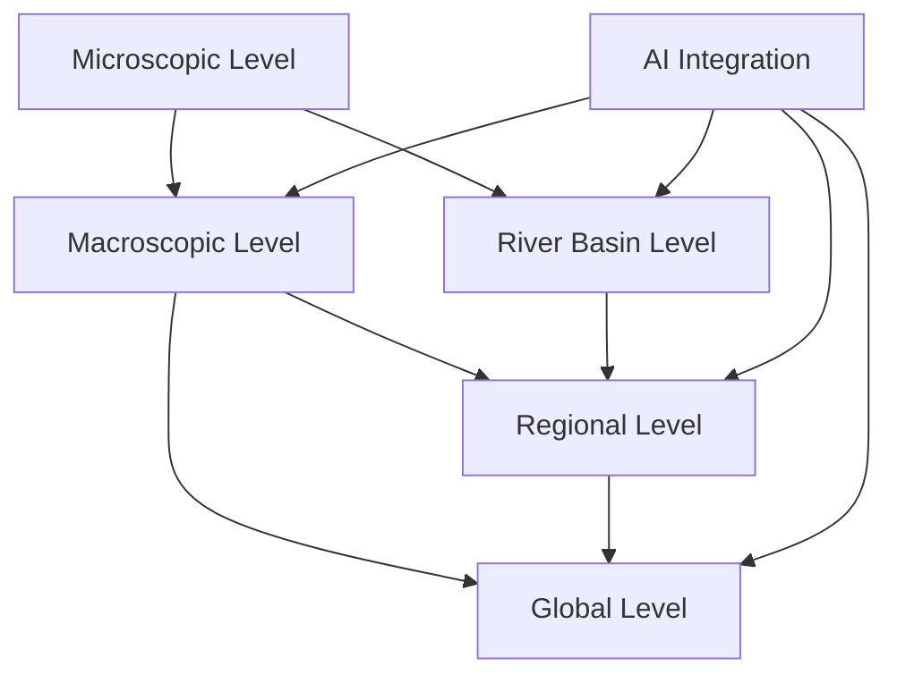

                 


### 3. Content Specification

#### Chapter 1: Introduction to AI in Water Resource Management

**1.1 The Importance of Water Resource Management**
- **Background**: Introduction to the significance of water resources in maintaining ecological balance and human health.
- **Context**: Discussion on the global water crisis and the impact on agriculture, industry, and daily life.
- **Illustration**: Case studies showcasing the benefits of effective water resource management.

**1.2 Basics of AI and Its Role in Environmental Monitoring**
- **Concepts**: Overview of AI, machine learning, and deep learning.
- **Application**: Detailed explanation of how AI can be used for environmental monitoring, including water quality assessment.

**1.3 Multiscale Approaches in Water Resource Studies**
- **Theories**: Definition and explanation of multiscale approaches in water resource research.
- **Principles**: Diagram illustrating the relationship between different scales in water resource studies (Mermaid flowchart).
- **Examples**: Application examples highlighting the benefits of multiscale analysis.

#### Chapter 2: Core Concepts of AI and Multiscale Modelling

**2.1 Machine Learning Fundamentals for Water Resource Applications**
- **Background**: Introduction to machine learning algorithms commonly used in water resource management.
- **Principles**: Explanation of the core concepts of supervised learning, unsupervised learning, and reinforcement learning.

**2.2 Multiscale Modelling Frameworks**
- **Concepts**: Detailed description of different multiscale modelling frameworks.
- **Relationships**: Mermaid flowchart showing the relationship between different scales and the role of AI in bridging them.

**2.3 Neural Networks and Their Applications**
- **Background**: Introduction to neural networks and their role in AI.
- **Theory**: Detailed explanation of the basic principles of neural networks, including backpropagation and optimization algorithms.
- **Application**: Examples of neural network applications in water resource quality prediction and pollution tracing.

#### Chapter 3: Data Collection and Preprocessing for Water Resource Analysis

**3.1 Sensors and Data Sources in Water Monitoring**
- **Concepts**: Overview of various sensors used for water quality monitoring and the types of data they provide.
- **Principles**: Discussion on data collection challenges and solutions in water resource monitoring.

**3.2 Data Preprocessing Techniques**
- **Theory**: Detailed explanation of data preprocessing steps, including data cleaning, normalization, and feature extraction.
- **Algorithm**: Pseudo-code for a typical data preprocessing algorithm.

**3.3 Handling Multisource and Multiscale Data**
- **Concepts**: Overview of techniques for handling multisource and multiscale data.
- **Example**: Detailed example of how to integrate data from different sources and scales for water resource analysis.

#### Chapter 4: AI Techniques for Water Resource Quality Prediction

**4.1 Supervised Learning Algorithms for Quality Prediction**
- **Concepts**: Overview of supervised learning algorithms suitable for water quality prediction.
- **Algorithm**: Pseudo-code for a regression algorithm used for predicting water quality.

**4.2 Unsupervised Learning Techniques**
- **Concepts**: Explanation of unsupervised learning techniques for anomaly detection and clustering in water quality data.
- **Algorithm**: Pseudo-code for a clustering algorithm used in water quality analysis.

**4.3 Deep Learning Models**
- **Concepts**: Introduction to deep learning models such as Convolutional Neural Networks (CNNs) and Recurrent Neural Networks (RNNs) for water quality prediction.
- **Algorithm**: Pseudo-code for a CNN-based model for water quality analysis.

#### Chapter 5: AI Methods for Pollution Tracing

**5.1 Core Concepts of Pollution Tracing**
- **Concepts**: Explanation of the core concepts and challenges in pollution tracing.
- **Principles**: Overview of the algorithms used for pollution source identification.

**5.2 AI Techniques for Source Apportionment**
- **Concepts**: Detailed explanation of AI techniques used for source apportionment.
- **Algorithm**: Pseudo-code for a source apportionment algorithm.

**5.3 Case Studies of Pollution Tracing**
- **Case Studies**: In-depth analysis of real-world case studies illustrating the application of AI in pollution tracing.

#### Chapter 6: Multiscale Applications in Water Resource Management

**6.1 Multiscale Data Fusion**
- **Concepts**: Overview of techniques for fusing data from different scales.
- **Algorithm**: Pseudo-code for a multiscale data fusion algorithm.

**6.2 Multiscale Modelling Applications**
- **Concepts**: Discussion on the application of multiscale modelling in water resource management.
- **Example**: Detailed example of a multiscale model for predicting water quality.

**6.3 Challenges and Future Directions**
- **Challenges**: Identification of current challenges in multiscale applications.
- **Directions**: Discussion on future research directions and potential breakthroughs.

#### Chapter 7: Practical Applications and Case Studies

**7.1 Development Environment Setup**
- **Steps**: Detailed steps for setting up a development environment for AI applications in water resource management.

**7.2 Source Code Implementation and Analysis**
- **Code**: Detailed source code implementation and explanation.
- **Analysis**: Analysis of the source code and its application in real-world scenarios.

**7.3 Case Study Analysis and Debriefing**
- **Case Studies**: Analysis of real-world case studies.
- **Debriefing**: Discussion on the findings, challenges, and lessons learned from the case studies.

**7.4 Best Practices and Future Prospects**
- **Tips**: Best practices for AI applications in water resource management.
- **Prospects**: Discussion on the future prospects and potential impact of AI in this field.

### 4. Formatting and Compliance

- Ensure that the content is formatted using markdown syntax, with appropriate headers and subheaders.
- Include LaTeX-formatted mathematical formulas where necessary.
- Embed Mermaid flowcharts to illustrate relationships and processes.
- Maintain a clear structure and logical flow throughout the article.
- Ensure the total word count adheres to the specified range (8000-12000 words).

### 5. Conclusion

The book outline provided above is a comprehensive guide to "AI in Water Resource Quality Prediction and Pollution Tracing with Multiscale Applications Research". Each chapter is designed to cover essential topics, from fundamental concepts to practical applications and future research directions. The content is structured to ensure a logical flow of information, with detailed explanations, algorithms, and examples to aid understanding.

By following this outline, readers can gain a deep understanding of how AI can be effectively applied to water resource management, particularly in the areas of quality prediction and pollution tracing. The focus on multiscale approaches is crucial for addressing the complex and dynamic nature of water resources, offering a more holistic and accurate perspective on environmental monitoring and management.

As we delve into each chapter, we will explore the intricacies of AI algorithms, data preprocessing techniques, and multiscale modelling frameworks. Real-world case studies will provide practical insights into the applications and challenges of AI in water resource management. By the end of the book, readers will not only have a theoretical understanding but also be equipped with practical knowledge and tools to implement AI solutions in their own projects.

### Title: AI in Water Resource Quality Prediction and Pollution Tracing with Multiscale Applications Research

#### Keywords: AI, Water Resource Management, Quality Prediction, Pollution Tracing, Multiscale Modelling

#### Abstract
This book presents a comprehensive exploration of the application of artificial intelligence (AI) in water resource quality prediction and pollution tracing. It covers the fundamental concepts of AI, the importance of water resource management, and the implementation of multiscale approaches. The book delves into the details of data collection and preprocessing techniques, the use of various AI algorithms for water quality prediction, and methods for pollution tracing. Through in-depth analysis of real-world case studies, the book provides practical insights and future research directions in the field of water resource management. By the end of this book, readers will have a thorough understanding of how AI can be harnessed to address the complex challenges in water resource management, contributing to sustainable environmental practices.

## Chapter 1: Introduction to AI in Water Resource Management

### 1.1 The Importance of Water Resource Management

Water resource management plays a pivotal role in the sustainability of our planet and the well-being of its inhabitants. Water is not only essential for human survival but also crucial for agriculture, industry, and ecosystems. However, the availability of fresh water is increasingly becoming a concern due to population growth, industrialization, and climate change. Effective water resource management is therefore vital for ensuring a stable and sustainable water supply.

#### Background
The global water crisis has far-reaching implications. Many regions around the world are experiencing water scarcity, leading to conflicts over water resources and affecting food security and public health. According to the United Nations, nearly 2.2 billion people live in regions facing severe water shortages, and by 2025, half of the world's population could be living in areas of high water stress. This crisis is exacerbated by pollution, over-extraction, and inefficient water use practices.

#### Context
Water resource management is crucial for maintaining ecological balance and human health. It involves the planning, development, management, and use of water resources to maximize their beneficial uses without causing significant harm. Effective management ensures that water is available for various uses—drinking, sanitation, agriculture, industry, and ecosystems—while protecting the environment and ensuring long-term sustainability.

#### Illustration
Case studies illustrate the benefits of effective water resource management. For example, the implementation of water conservation programs in California has led to significant reductions in water usage and improved groundwater recharge. Similarly, the management of the Colorado River through cooperative agreements among seven US states has helped stabilize water levels in reservoirs and ensure a reliable supply for irrigation, municipal use, and ecosystems.

### 1.2 Basics of AI and Its Role in Environmental Monitoring

Artificial intelligence (AI) has emerged as a transformative technology in various fields, including environmental monitoring. AI refers to the simulation of human intelligence in machines that are programmed to think like humans and mimic their actions. Machine learning (ML), a subset of AI, enables computers to learn from data, identify patterns, and make decisions with minimal human intervention.

#### Concepts
Machine learning involves algorithms that can learn from data to improve their performance on specific tasks. These algorithms can be categorized into three main types: supervised learning, unsupervised learning, and reinforcement learning. Supervised learning algorithms are trained on labeled data, where the correct output is provided for each input. Unsupervised learning algorithms identify patterns in data without any prior labels. Reinforcement learning algorithms learn by interacting with the environment and receiving feedback in the form of rewards or penalties.

#### Application
In the context of environmental monitoring, AI and machine learning have numerous applications. One of the most significant is water quality assessment. AI algorithms can analyze data from various sources, including sensors, satellites, and remote sensing technologies, to predict water quality parameters such as pH, turbidity, and nutrient levels. This information is crucial for identifying potential pollution sources and taking corrective measures.

#### Example
For instance, machine learning models have been developed to predict water quality in rivers and lakes. These models analyze historical data and real-time sensor readings to identify trends and anomalies that may indicate pollution events. By predicting water quality ahead of time, authorities can take proactive measures to mitigate the impact of pollution and protect public health.

### 1.3 Multiscale Approaches in Water Resource Studies

Multiscale approaches are essential for understanding the complex dynamics of water resources. These approaches involve studying water systems at multiple scales, from the microscopic level of individual water molecules to the macroscopic level of entire river basins. Multiscale analysis provides a more comprehensive understanding of water resource systems, allowing for better prediction and management of water quality and quantity.

#### Theories
Multiscale approaches in water resource studies are based on the concept that different scales of analysis provide different insights into the system's behavior. For example, studying water flow at the microscopic level may reveal the effects of surface tension and capillary action, while studying at the macroscopic level may reveal the behavior of entire river basins in response to climate change. Multiscale analysis involves integrating data and models from different scales to create a coherent understanding of the system.

#### Principles
The principles of multiscale approaches include:
1. Scale-dependent behavior: Different scales exhibit different behaviors and properties. For example, the behavior of water at the macroscopic level (river flow) is different from the microscopic level (molecular interactions).
2. Scale transition: The transition between different scales can be complex and often involves interactions between scales. For example, the flow of water in a river can affect groundwater recharge and vice versa.
3. Data integration: Data from different scales need to be integrated to obtain a comprehensive picture of the system.

#### Diagram
The following Mermaid flowchart illustrates the relationship between different scales in water resource studies and the role of AI in bridging them:



#### Examples
Multiscale analysis is commonly used in hydrology and environmental science. For example, hydrologists use multiscale approaches to study the movement of water in river basins, integrating data from groundwater levels, river flow rates, and weather patterns. This helps in predicting flood events and managing water resources more effectively.

In conclusion, AI in water resource management is essential for addressing the complex challenges posed by water scarcity and pollution. By leveraging AI algorithms and multiscale approaches, we can improve water quality prediction, pollution tracing, and overall water resource management. The following chapters will delve deeper into the technical details of these applications, providing a comprehensive guide for researchers and practitioners in the field.

### Chapter 2: Core Concepts of AI and Multiscale Modelling

#### 2.1 Machine Learning Fundamentals for Water Resource Applications

Machine learning (ML) is a fundamental component of artificial intelligence (AI) and has become indispensable in various domains, including water resource management. ML algorithms enable computers to learn from data, identify patterns, and make predictions with minimal human intervention. In the context of water resource applications, ML can be used for a wide range of tasks, from water quality monitoring to flood prediction and resource allocation.

##### Background
ML has evolved significantly over the past few decades, with advancements in algorithms, computational power, and data availability. Traditional ML methods include linear regression, decision trees, and support vector machines, which have been widely used in various fields. However, with the rise of deep learning, more complex and powerful models such as neural networks have gained prominence.

##### Concepts
Machine learning can be broadly categorized into three types: supervised learning, unsupervised learning, and reinforcement learning.

1. **Supervised Learning**: In supervised learning, the model is trained on a labeled dataset, where the correct output is provided for each input. The goal is to learn a mapping from inputs to outputs so that the model can make accurate predictions on new, unseen data. Supervised learning is commonly used for tasks such as regression (predicting continuous values) and classification (predicting discrete classes).

2. **Unsupervised Learning**: Unsupervised learning involves training the model on unlabeled data. The goal is to discover hidden patterns or structures in the data. Clustering and dimensionality reduction are common tasks in unsupervised learning. Clustering algorithms group data points based on their similarity, while dimensionality reduction techniques reduce the number of input features while retaining important information.

3. **Reinforcement Learning**: Reinforcement learning is a type of machine learning where the model learns by interacting with the environment and receiving feedback in the form of rewards or penalties. The goal is to learn a policy that maximizes the cumulative reward over time. Reinforcement learning is commonly used in applications such as robotics, game playing, and autonomous driving.

##### Application
In water resource management, ML has been applied to various tasks, including:
- **Water Quality Prediction**: ML models can analyze historical data and real-time sensor readings to predict water quality parameters such as pH, turbidity, and nutrient levels. This information is crucial for identifying potential pollution sources and taking corrective measures.
- **Flood Prediction**: ML models can analyze weather patterns, river flow data, and topographic information to predict the occurrence and severity of floods.
- **Resource Allocation**: ML models can optimize water allocation decisions by considering factors such as demand, supply, and environmental constraints.

##### Algorithm
Consider a simple example of a linear regression model used for predicting water quality:

```latex
y = w_0 + w_1 \times x
```

Where `y` is the predicted water quality parameter, `x` is the input feature (e.g., temperature or turbidity), and `w_0` and `w_1` are the model parameters. The model is trained by minimizing the mean squared error between the predicted and actual values:

```latex
J(w_0, w_1) = \frac{1}{2} \sum_{i=1}^{n} (y_i - (w_0 + w_1 \times x_i))^2
```

The parameters are updated using gradient descent:

```latex
w_0 = w_0 - \alpha \times \frac{\partial J}{\partial w_0}
w_1 = w_1 - \alpha \times \frac{\partial J}{\partial w_1}
```

Where `alpha` is the learning rate.

#### 2.2 Multiscale Modelling Frameworks

Multiscale modelling is essential for understanding the complex dynamics of water resources, which involve interactions at multiple spatial and temporal scales. Multiscale models integrate data and processes from different scales to provide a more comprehensive understanding of the system. This approach is particularly useful in water resource management, where different scales of analysis are needed to address various challenges, from local water quality monitoring to large-scale flood prediction.

##### Concepts
The concept of multiscale modelling involves several key elements:

1. **Scale-Dependent Behaviour**: Different scales exhibit different behaviors and properties. For example, the flow of water in a river at the macroscopic level is governed by different physical processes than at the microscopic level, where molecular interactions play a significant role.

2. **Scale-Transition**: The transition between different scales can be complex and often involves interactions between scales. For instance, the flow of water in a river can affect groundwater recharge and vice versa.

3. **Data Integration**: Data from different scales need to be integrated to obtain a coherent understanding of the system. This involves methods for upscaling and downscaling data to ensure consistency across scales.

##### Frameworks
There are several frameworks for multiscale modelling, including:

1. **Hierarchical Modelling**: This approach involves building models at different scales and linking them hierarchically. For example, a macroscopic model of river flow can be linked to a microscopic model of groundwater flow to provide a comprehensive picture of the system.

2. **Data-Driven Modelling**: This approach uses machine learning techniques to develop models that can incorporate data from different scales. Data-driven models can automatically learn the relationships between different scales, making them highly flexible and adaptable.

3. **Hybrid Modelling**: This approach combines the strengths of both process-based and data-driven models. For example, a process-based model can be used to simulate the primary processes at a coarse scale, while machine learning models can be used to capture the complex interactions at finer scales.

##### Principles
The principles of multiscale modelling include:

1. **Consistency**: The models should be consistent across different scales, ensuring that the behavior at one scale can be accurately represented at another.

2. **Accuracy**: The models should provide accurate predictions and reliable insights into the system's behavior.

3. **Simplicity**: The models should be simple enough to be practical and computationally efficient.

4. **Flexibility**: The models should be flexible enough to accommodate new data and changing conditions.

#### Relationship Between Scales and the Role of AI

The relationship between different scales in water resource studies can be visualized using a Mermaid flowchart:


AI plays a crucial role in bridging these different scales by developing models that can integrate data from various sources and scales. For example, machine learning algorithms can be used to develop data-driven models that capture the complex interactions between different scales. These models can then be used to improve the accuracy and reliability of water resource predictions and management strategies.

#### Examples

1. **Hydrological Modelling**: Hydrologists use multiscale models to simulate the flow of water in river basins. These models can integrate data from weather stations, river gauges, and remote sensing technologies to provide a comprehensive understanding of the system's behavior.

2. **Ecological Modelling**: Ecologists use multiscale models to study the interactions between aquatic ecosystems and their environment. These models can integrate data from different sources, such as aquatic sensors, satellite imagery, and field observations, to provide insights into the system's dynamics.

In conclusion, AI and multiscale modelling offer powerful tools for addressing the complex challenges in water resource management. By leveraging these technologies, we can improve our understanding of water resource systems, predict future conditions more accurately, and develop more effective management strategies.

### Chapter 3: Data Collection and Preprocessing for Water Resource Analysis

#### 3.1 Sensors and Data Sources in Water Monitoring

Water monitoring relies on a variety of sensors and data sources to collect relevant information about water quality and quantity. These data sources provide critical insights into the health of aquatic ecosystems and the potential risks posed by pollution and over-extraction. Understanding the types of sensors and the data they provide is essential for effective water resource analysis.

##### Concepts

**Sensors**: Sensors are devices that detect and measure physical or chemical properties of water, such as temperature, pH, turbidity, dissolved oxygen, and nutrient levels. They are typically classified based on the type of data they provide:

1. **Physical Sensors**: These sensors measure physical properties like temperature, flow rate, and turbidity. Examples include temperature probes, flow meters, and turbidity sensors.

2. **Chemical Sensors**: These sensors measure chemical properties such as pH, dissolved oxygen, and nutrient levels. Examples include pH meters, dissolved oxygen sensors, and nutrient analyzers.

3. **Biological Sensors**: These sensors measure biological properties, such as the presence of bacteria or other microorganisms. Examples include microbial sensors and fluorescence probes.

**Data Sources**: Water monitoring data can come from various sources, including:

1. **Field Sensors**: These are sensors installed directly in the water body or its surroundings. They provide real-time data that can be used for immediate analysis and decision-making.

2. **Satellite Data**: Satellite remote sensing provides data on large-scale water bodies, such as rivers, lakes, and oceans. It can be used for monitoring water quality parameters like temperature, color, and chlorophyll levels.

3. **Aerial Data**: Aerial sensors, such as drones or aircraft-mounted instruments, provide high-resolution data on smaller water bodies and can be used for detailed water quality mapping.

##### Principles

The principles of using sensors and data sources in water monitoring include:

1. **Accuracy**: Sensors must provide accurate measurements to ensure reliable data.

2. **Sensitivity**: Sensors should be sensitive enough to detect changes in water quality parameters.

3. **Reliability**: Data sources should be reliable and consistent over time.

4. **Integration**: Data from different sources should be integrated to provide a comprehensive view of the water body's condition.

##### Data Collection Challenges and Solutions

**Challenges**: Collecting water monitoring data presents several challenges:

1. **Environmental Factors**: Extreme weather conditions, such as high temperatures, freezing temperatures, and storms, can affect sensor performance and data collection.

2. **Physical Barriers**: Water bodies can be difficult to access, especially in remote or inaccessible areas. This can limit the placement of field sensors and the collection of data.

3. **Data Management**: Managing large volumes of data from multiple sources can be complex and requires robust data management systems.

**Solutions**: To address these challenges, several solutions can be employed:

1. **Remote Monitoring**: Installing sensors in remote areas with long-range communication capabilities can overcome physical barriers.

2. **Robust Sensors**: Using sensors designed to withstand harsh environmental conditions can improve data collection accuracy and reliability.

3. **Data Fusion**: Integrating data from multiple sources can provide a more comprehensive and accurate picture of water quality.

#### 3.2 Data Preprocessing Techniques

Once water monitoring data is collected, it often needs to be preprocessed to remove noise, fill missing values, and prepare it for analysis. Data preprocessing is a crucial step in ensuring that the data is suitable for machine learning algorithms and other analytical techniques.

##### Concepts

**Data Cleaning**: Data cleaning involves identifying and correcting or removing errors, inconsistencies, and missing values in the data. This can include:

1. **Handling Missing Values**: Strategies for dealing with missing data, such as interpolation, averaging, or deletion.

2. **Dealing with Outliers**: Identifying and handling outliers, which are data points that significantly deviate from the norm. This can include removing or adjusting outliers or using robust statistical methods to minimize their impact.

3. **Normalization**: Scaling the data to a standard range to ensure that different variables contribute equally to the analysis.

**Feature Extraction**: Feature extraction involves selecting and transforming the relevant features from the raw data to improve the performance of machine learning algorithms. This can include:

1. **Dimensionality Reduction**: Techniques such as Principal Component Analysis (PCA) or Linear Discriminant Analysis (LDA) to reduce the number of features while retaining important information.

2. **Feature Engineering**: Creating new features from existing data to improve model performance. This can involve mathematical transformations or combining features in meaningful ways.

##### Principles

The principles of data preprocessing include:

1. **Consistency**: Ensuring that the data is clean and consistent across different sources and scales.

2. **Relevance**: Selecting features that are relevant to the problem at hand to avoid overfitting and improve model performance.

3. **Accuracy**: Maintaining the accuracy of the data by correcting errors and handling missing values appropriately.

##### Data Preprocessing Steps

The typical steps in data preprocessing include:

1. **Data Exploration**: Understanding the data through visualizations and statistical summaries to identify patterns, trends, and potential issues.

2. **Data Cleaning**: Handling missing values and outliers as described above.

3. **Feature Selection**: Choosing the most relevant features for the analysis, either through statistical methods or domain knowledge.

4. **Feature Scaling**: Standardizing the features to ensure that they contribute equally to the analysis.

5. **Feature Transformation**: Applying mathematical transformations or creating new features to enhance the performance of machine learning algorithms.

##### Example

Consider the following example of data preprocessing steps for water quality analysis:

1. **Data Exploration**: Visualize the distribution of different water quality parameters (e.g., temperature, pH, turbidity) to identify any patterns or anomalies.

2. **Handling Missing Values**: Fill missing temperature readings using linear interpolation and remove any pH values that are outside the acceptable range (e.g., below 6 or above 9).

3. **Outlier Detection**: Identify and remove any turbidity readings that are three standard deviations above the mean.

4. **Feature Scaling**: Scale the temperature and turbidity data to a range between 0 and 1.

5. **Feature Engineering**: Create a new feature, "temperature range", by subtracting the minimum temperature from the maximum temperature observed.

In conclusion, data collection and preprocessing are critical steps in water resource analysis. By using a combination of sensors and data sources, and employing robust preprocessing techniques, we can ensure that the data is accurate, relevant, and suitable for analysis, ultimately leading to more reliable and effective water resource management decisions.

### Chapter 4: AI Techniques for Water Resource Quality Prediction

#### 4.1 Supervised Learning Algorithms for Quality Prediction

Supervised learning algorithms are at the core of many AI applications in water resource quality prediction. These algorithms learn from labeled training data to develop models that can predict water quality parameters based on input features. In this section, we will explore some of the most commonly used supervised learning algorithms, their applications in water quality prediction, and how they work.

##### Concepts

**Supervised Learning**: In supervised learning, the model is trained on a dataset where the output (label) is known for each input. The goal is to learn a mapping from inputs to outputs so that the model can make accurate predictions on new, unseen data. Supervised learning is particularly useful in water quality prediction because it allows us to develop models that can classify water samples into different quality categories or predict continuous values such as pH or turbidity levels.

**Regression Algorithms**: Regression algorithms are used to predict continuous values. They are commonly used in water quality prediction to model relationships between water quality parameters and input features. Some popular regression algorithms include:

1. **Linear Regression**: Linear regression models the relationship between a single output variable and one or more input variables using a linear equation. It is simple yet powerful and serves as a good baseline for more complex models.
2. **Multiple Linear Regression**: This extends linear regression to handle multiple input variables, allowing for more complex relationships between input and output.
3. **Polynomial Regression**: Polynomial regression uses a polynomial equation to model the relationship between input and output variables, capturing non-linear trends.

**Classification Algorithms**: Classification algorithms are used to predict discrete categories. They are useful for tasks such as classifying water samples into different quality categories based on their chemical properties. Some common classification algorithms include:

1. **K-Nearest Neighbors (K-NN)**: K-NN is a simple, non-parametric algorithm that classifies new data points based on the majority class of their k nearest neighbors in the training dataset.
2. **Support Vector Machines (SVM)**: SVM is a powerful supervised learning algorithm that finds the hyperplane that best separates the data into different classes. It is particularly effective for high-dimensional data.
3. **Random Forest**: Random Forest is an ensemble learning method that combines multiple decision trees to improve the overall accuracy and robustness of the model.

##### Algorithm

Let's take a closer look at the linear regression algorithm and its application in water quality prediction:

**Linear Regression Algorithm**

1. **Model Definition**: The linear regression model is defined by the equation:
   \[ y = \beta_0 + \beta_1 \times x_1 + \beta_2 \times x_2 + ... + \beta_n \times x_n \]
   Where \( y \) is the predicted water quality parameter, \( x_1, x_2, ..., x_n \) are the input features, and \( \beta_0, \beta_1, \beta_2, ..., \beta_n \) are the model parameters.

2. **Model Training**: The model is trained using a labeled dataset, where the values of \( y \) are known. The goal is to minimize the error between the predicted values and the actual values. This is typically done using gradient descent:

   \[ \beta_j = \beta_j - \alpha \times \frac{\partial J}{\partial \beta_j} \]
   Where \( J \) is the cost function, \( \alpha \) is the learning rate, and \( \frac{\partial J}{\partial \beta_j} \) is the gradient of the cost function with respect to \( \beta_j \).

3. **Prediction**: Once the model is trained, it can be used to predict the water quality parameter for new data points by substituting the input features into the model equation.

**Pseudo-code for Linear Regression**

```python
# Initialize model parameters
beta = [0] * (n + 1)

# Define learning rate
alpha = 0.01

# Define number of epochs
epochs = 1000

# Gradient descent loop
for epoch in range(epochs):
    for i in range(len(X)):
        # Compute predicted value
        y_pred = sum(beta[j] * x_ij for j, x_ij in enumerate(X[i])) + beta[0]

        # Compute cost
        error = y[i] - y_pred

        # Update model parameters
        beta[0] += alpha * error
        for j in range(1, n + 1):
            beta[j] += alpha * error * x_ij

# Predict water quality for new data
def predict(X_new):
    y_pred = sum(beta[j] * x_ij for j, x_ij in enumerate(X_new)) + beta[0]
    return y_pred
```

##### Example

Consider a scenario where we want to predict the pH level of water based on its temperature and turbidity levels. We have a labeled dataset with pH values, temperature, and turbidity levels.

1. **Data Preparation**: We first need to prepare the dataset by scaling the temperature and turbidity data to a standard range, such as 0 to 1.

2. **Model Training**: We train a linear regression model using the prepared dataset. The model parameters are updated using gradient descent to minimize the mean squared error between the predicted and actual pH values.

3. **Prediction**: Once the model is trained, we can use it to predict the pH level of new water samples by inputting their temperature and turbidity values.

In conclusion, supervised learning algorithms are powerful tools for water resource quality prediction. By leveraging algorithms like linear regression and K-NN, we can develop models that accurately predict water quality parameters and aid in the management of water resources. The following sections will explore other machine learning techniques and their applications in water resource quality prediction.

### 4.2 Unsupervised Learning Techniques

Unsupervised learning techniques play a crucial role in water resource quality analysis by uncovering hidden patterns and structures within the data without prior labeling. These techniques are particularly valuable for tasks such as anomaly detection, clustering of water quality data, and feature extraction. In this section, we will delve into the concepts and algorithms of unsupervised learning and their applications in water resource management.

#### Concepts

**Anomaly Detection**: Anomaly detection is the process of identifying unusual patterns or outliers in data that do not conform to expected behavior. In the context of water resource quality analysis, anomalies might indicate pollution events or other critical conditions that require immediate attention. Common anomaly detection algorithms include:

1. **Local Outlier Factor (LOF)**: LOF detects outliers based on the density of the data points. A point is considered an outlier if it has a substantially lower density than its neighbors.
2. **Isolation Forest**: Isolation Forest is an algorithm that isolates observations by randomly selecting a feature and then randomly selecting a split value between the maximum and minimum values of the selected feature. Observations that are more difficult to isolate are considered more anomalous.

**Clustering**: Clustering is the process of grouping data points together based on their similarities. In water resource quality analysis, clustering can help in segmenting water bodies into distinct regions with similar characteristics. Common clustering algorithms include:

1. **K-Means Clustering**: K-Means is a popular iterative algorithm that partitions data into K clusters by minimizing the sum of squared distances between each point and its cluster center.
2. **Hierarchical Clustering**: Hierarchical clustering builds a hierarchy of clusters either by merging or splitting clusters based on their similarity. This method produces a dendrogram that visualizes the clustering process.

**Feature Extraction**: Feature extraction involves transforming raw data into a set of features that capture the most important information for the analysis. In the context of water resource quality, feature extraction can help in reducing the dimensionality of the data and improving the performance of machine learning models. Common feature extraction techniques include:

1. **Principal Component Analysis (PCA)**: PCA transforms the data into a new coordinate system, capturing the most variance in the data with the fewest number of principal components.
2. **t-Distributed Stochastic Neighbor Embedding (t-SNE)**: t-SNE is a nonlinear dimensionality reduction technique that is particularly useful for visualizing high-dimensional data by reducing it to two or three dimensions.

#### Algorithm

**K-Means Clustering Algorithm**

K-Means is a simple yet powerful clustering algorithm that works as follows:

1. **Initialization**: Select K initial cluster centers randomly or using more sophisticated initialization methods like K-means++.
2. **Assignment**: Assign each data point to the nearest cluster center based on Euclidean distance.
3. **Update**: Recompute the cluster centers as the mean of all points assigned to each cluster.
4. **Iteration**: Repeat steps 2 and 3 until convergence, which occurs when the assignments of the data points do not change or the change falls below a certain threshold.

**Pseudo-code for K-Means**

```python
# Initialize K cluster centers using K-means++
centers = initialize_centers(data, K)

# Define convergence criteria
max_iterations = 100
threshold = 0.01

# K-Means loop
for iteration in range(max_iterations):
    # Assign points to clusters
    clusters = assign_points_to_clusters(data, centers)
    
    # Update cluster centers
    new_centers = compute_new_centers(clusters)
    
    # Check for convergence
    if linalg.norm(new_centers - centers) < threshold:
        break
    
    centers = new_centers

# Return final clusters
return clusters
```

#### Example

Consider a dataset of water quality measurements from a river, including pH, turbidity, and temperature. We aim to use K-Means clustering to group these measurements into clusters that represent different regions or conditions within the river.

1. **Data Preprocessing**: We scale the pH, turbidity, and temperature data to a common range, such as 0 to 1, to ensure that all features contribute equally to the clustering process.
2. **Model Training**: We apply the K-Means algorithm to the preprocessed data, choosing an appropriate number of clusters (K) through methods like the elbow method or silhouette analysis.
3. **Result Interpretation**: After clustering, we analyze the resulting clusters to identify patterns or anomalies in the water quality data. For example, one cluster might represent clean water conditions, while another might indicate pollution events.

In conclusion, unsupervised learning techniques are essential for uncovering hidden insights and patterns in water resource quality data. Algorithms like K-Means clustering and anomaly detection provide valuable tools for analyzing and interpreting complex water quality data, aiding in the effective management of water resources.

### 4.3 Deep Learning Models for Water Resource Quality Prediction

Deep learning models, particularly neural networks, have revolutionized the field of artificial intelligence with their ability to learn complex patterns from large datasets. These models have shown significant promise in water resource quality prediction due to their capacity to handle high-dimensional data and capture intricate relationships between variables. In this section, we will explore the core concepts of deep learning, neural networks, and their applications in water resource quality prediction.

#### Concepts

**Deep Learning**: Deep learning is a subset of machine learning that focuses on training deep neural networks with many layers to learn hierarchical representations of data. Traditional neural networks with only a few layers were limited in their ability to model complex functions, but the introduction of deep neural networks has overcome this limitation by allowing for more abstract and higher-level representations of the data. Deep learning models are particularly suitable for water resource quality prediction due to the complexity of the environmental data and the non-linear relationships between water quality parameters.

**Neural Networks**: A neural network is a computational model inspired by the structure and function of the human brain. It consists of interconnected nodes, called neurons, which process and transmit information. Neural networks are composed of layers: an input layer, one or more hidden layers, and an output layer. Each layer performs a specific function in transforming the input data into the final output. The learning process involves adjusting the weights and biases of the connections between neurons to minimize the error between the predicted and actual outputs.

**Convolutional Neural Networks (CNNs)**: CNNs are a type of deep learning model specifically designed for processing grid-like data, such as images. However, they have also been adapted for water resource quality prediction due to their ability to capture spatial dependencies in the data. CNNs use convolutional layers to automatically learn spatial hierarchies of features from the input data, making them particularly suitable for tasks like detecting patterns in water quality measurements across different spatial scales.

**Recurrent Neural Networks (RNNs)**: RNNs are another type of deep learning model that is well-suited for sequential data. They can handle time-series data, making them suitable for predicting water quality over time. RNNs have memory capabilities that allow them to retain information about previous inputs, which is crucial for capturing temporal dependencies in water quality data.

#### Algorithm

**CNN-Based Model for Water Quality Prediction**

CNNs are particularly effective for capturing spatial features in water quality data. The following is a high-level overview of how a CNN-based model can be used for water quality prediction:

1. **Input Layer**: The input layer receives the raw water quality measurements, which are typically preprocessed and scaled to a suitable range.

2. **Convolutional Layer**: The convolutional layer applies a series of filters to the input data, extracting spatial features. Each filter produces a feature map, highlighting specific patterns or structures in the data.

3. **Pooling Layer**: The pooling layer downsamples the feature maps, reducing the spatial dimensions and computational complexity of the data. Common pooling operations include max pooling and average pooling.

4. **Hidden Layers**: One or more hidden layers follow the convolutional and pooling layers. These layers may include additional convolutional layers, as well as fully connected layers that perform more complex feature extraction and combination.

5. **Output Layer**: The output layer produces the final prediction of the water quality parameter. This layer typically consists of a single neuron for regression tasks or multiple neurons for classification tasks.

**Pseudo-code for a Simple CNN-Based Water Quality Prediction Model**

```python
# Define the CNN model architecture
model = Sequential()

# Add convolutional layers
model.add(Conv2D(filters=32, kernel_size=(3, 3), activation='relu', input_shape=(input_shape)))
model.add(MaxPooling2D(pool_size=(2, 2)))

model.add(Conv2D(filters=64, kernel_size=(3, 3), activation='relu'))
model.add(MaxPooling2D(pool_size=(2, 2)))

# Add fully connected layers
model.add(Flatten())
model.add(Dense(units=64, activation='relu'))
model.add(Dense(units=1, activation='sigmoid'))  # For binary classification

# Compile the model
model.compile(optimizer='adam', loss='binary_crossentropy', metrics=['accuracy'])

# Train the model
model.fit(X_train, y_train, epochs=10, batch_size=32, validation_data=(X_val, y_val))

# Predict water quality
predictions = model.predict(X_test)
```

#### Example

Consider a scenario where we have a dataset of water quality measurements from different locations in a river. We aim to use a CNN-based model to predict the turbidity levels at a specific location based on measurements from surrounding areas.

1. **Data Preprocessing**: The raw data is preprocessed by scaling the measurements to a common range and reshaping the input data to match the expected input shape of the CNN model.

2. **Model Training**: A CNN-based model is trained on the preprocessed data, with convolutional layers to extract spatial features and fully connected layers to generate predictions.

3. **Prediction**: Once the model is trained, it can be used to predict the turbidity levels at new locations by inputting the surrounding measurements.

In conclusion, deep learning models, especially CNNs, offer powerful tools for water resource quality prediction. By leveraging the ability of neural networks to learn hierarchical representations from large datasets, we can develop models that accurately predict water quality parameters, aiding in the effective management of water resources.

### Chapter 5: AI Methods for Pollution Tracing

#### 5.1 Core Concepts of Pollution Tracing

Pollution tracing is a critical aspect of environmental monitoring and management. It involves identifying the sources of pollution and understanding how pollutants travel through different media, such as air, water, and soil. AI methods have significantly advanced the capabilities of pollution tracing by providing tools for data analysis, pattern recognition, and source apportionment. In this section, we will explore the fundamental concepts and methodologies behind AI-driven pollution tracing.

##### Concepts

**Pollution Tracing**: Pollution tracing is the process of determining the origin and pathways of pollutants in the environment. This process is essential for several reasons:

1. **Environmental Protection**: Identifying pollution sources helps in implementing effective mitigation strategies to reduce pollution levels and protect ecosystems.
2. **Public Health**: Tracing pollutants helps in understanding their impact on human health and developing measures to safeguard public health.
3. **Legal Enforcement**: Identifying polluters can facilitate legal enforcement and ensure compliance with environmental regulations.

**Data Sources**: Pollution tracing relies on various data sources, including:

1. **Sensors and Monitors**: Real-time data from air and water quality sensors, as well as air pollution monitoring stations, provide detailed information on pollutant concentrations.
2. **Satellite Imagery**: Satellite sensors can detect pollutants from space, providing a broad view of pollution distribution and trends.
3. **Field Sampling**: Collected samples from different environmental media (e.g., water, soil, air) provide quantitative data on pollutant levels and types.

**AI Techniques**: AI techniques play a crucial role in pollution tracing by enabling the analysis and interpretation of complex environmental data. Key AI techniques include:

1. **Machine Learning**: Machine learning algorithms can analyze large datasets to identify patterns, classify pollutants, and predict pollution levels.
2. **Data Mining**: Data mining techniques extract useful information from large datasets to discover relationships and trends that are relevant to pollution tracing.
3. **Simulation Models**: AI-driven simulation models can predict the spread and behavior of pollutants in the environment, aiding in the identification of potential sources.

##### Principles

The principles of pollution tracing with AI include:

1. **Data Integration**: Combining data from multiple sources and scales provides a comprehensive understanding of pollution patterns and sources.
2. **Pattern Recognition**: AI algorithms can identify complex patterns in environmental data that may indicate pollution sources or pathways.
3. **Source Apportionment**: AI methods can allocate the contribution of different sources to the overall pollution load, helping to pinpoint the primary polluters.

##### Algorithms

**Source Apportionment Algorithms**: Source apportionment is a critical step in pollution tracing, involving the allocation of pollution loads to specific sources. Several AI-based algorithms are used for source apportionment, including:

1. **因子分解 (Factor Analysis)**: Factor analysis models the relationship between multiple pollutants and their potential sources by identifying latent factors that represent different sources.
2. **化学质量平衡 (CMB)**: Chemical Mass Balance (CMB) models use mass balance principles to apportion pollution loads based on the chemical composition of pollutants.
3. **线性多变量回归 (LMA)**: Linear Multivariate Analysis (LMA) is a statistical method that uses linear regression to relate observed pollution concentrations to potential sources.

**Pseudo-code for Source Apportionment using Linear Multivariate Regression**

```python
# Define the regression model
model = LinearRegression()

# Fit the model to the data
model.fit(X, y)

# Predict the source contributions
contributions = model.predict(X)

# Normalize the contributions to sum to 100%
contributions /= contributions.sum(axis=1)[:, np.newaxis]

# Return the source contributions
return contributions
```

##### Example

Consider a scenario where we have collected air quality data from multiple monitoring stations in a city. Our goal is to identify the sources of air pollution and apportion the pollution load to different sources.

1. **Data Collection**: Collect air quality data, including measurements of various pollutants (e.g., PM2.5, NO2, SO2) from multiple monitoring stations.
2. **Data Preprocessing**: Preprocess the data by removing missing values, scaling the measurements, and normalizing the data to ensure consistency.
3. **Model Training**: Train a linear regression model using the preprocessed data to predict the contributions of different sources to the observed pollution levels.
4. **Source Apportionment**: Use the trained model to apportion the pollution load to different sources, providing insights into the primary polluters.

In conclusion, AI methods have greatly enhanced the capabilities of pollution tracing, providing powerful tools for identifying pollution sources and understanding their impact on the environment. By leveraging machine learning and data mining techniques, we can develop more accurate and efficient methods for pollution tracing, ultimately contributing to better environmental management and public health.

### 5.2 AI Techniques for Source Apportionment

Source apportionment is a critical step in pollution tracing, involving the allocation of pollution loads to specific sources. AI techniques have revolutionized this process by enabling the analysis of complex environmental data and providing more accurate and efficient methods for source apportionment. In this section, we will explore several AI-based methods for source apportionment, their principles, and how they can be applied to real-world scenarios.

#### Concepts

**AI-Based Source Apportionment Methods**: AI-based source apportionment methods leverage machine learning algorithms and data mining techniques to analyze environmental data and identify the contributions of different pollution sources. Some of the key methods include:

1. **Principal Component Analysis (PCA)**: PCA is a statistical technique that transforms the data into a set of principal components, which are linear combinations of the original variables that capture the most variance in the data. PCA can be used to reduce the dimensionality of the data and identify the main sources contributing to pollution.
2. **Chemical Mass Balance (CMB)**: CMB is a method that uses mass balance principles to allocate pollution loads based on the chemical composition of pollutants. CMB models are based on the assumption that the total mass of a pollutant is the sum of the contributions from different sources.
3. **Recurrent Neural Networks (RNNs)**: RNNs are a type of neural network that can handle sequential data, making them suitable for source apportionment tasks involving time-series data.

#### Principles

The principles of AI-based source apportionment include:

1. **Data Integration**: Combining data from multiple sources and time periods to provide a comprehensive picture of pollution sources.
2. **Pattern Recognition**: Identifying patterns in the data that indicate the presence and contributions of different pollution sources.
3. **Model Calibration**: Calibrating the source apportionment model using known data to ensure accurate and reliable results.

#### Algorithms

**Principal Component Analysis (PCA)**: PCA is a widely used technique for source apportionment due to its ability to reduce the dimensionality of the data while retaining the most important information. The following is a high-level overview of how PCA can be used for source apportionment:

1. **Data Preprocessing**: The raw data is preprocessed by removing missing values, scaling the measurements, and normalizing the data to ensure consistency.
2. **Principal Component Extraction**: The data is transformed into a set of principal components using an eigenvalue decomposition. The principal components are ordered by the amount of variance they explain, with the first component explaining the most variance.
3. **Source Apportionment**: The contributions of different sources are estimated based on the loadings of the principal components. The loadings indicate the extent to which each source contributes to the principal components.

**Pseudo-code for PCA-Based Source Apportionment**

```python
# Define the PCA model
pca = PCA(n_components=k)

# Fit the model to the data
pca.fit(X)

# Extract principal components
components = pca.transform(X)

# Estimate source contributions
contributions = X / components.sum(axis=1)[:, np.newaxis]

# Return the source contributions
return contributions
```

**Chemical Mass Balance (CMB)**: CMB is a method that uses mass balance principles to allocate pollution loads based on the chemical composition of pollutants. The following is a high-level overview of the CMB method:

1. **Component Identification**: Identify the chemical components of the pollutants of interest. This can be done using chemical analysis techniques or by assuming a priori that certain compounds are likely to be present.
2. **Mass Balance Equations**: Develop mass balance equations that relate the total mass of each pollutant to the mass contributions from different sources.
3. **Solution**: Solve the mass balance equations to determine the contributions of each source.

**Pseudo-code for CMB-Based Source Apportionment**

```python
# Define the mass balance equations
C_total = C_source1 + C_source2 + ... + C_sourceN

# Solve for the source contributions
C_source1 = C_total - (C_source2 + ... + C_sourceN)
C_source2 = C_total - (C_source1 + ... + C_sourceN)
...
C_sourceN = C_total - (C_source1 + ... + C_sourceN-1)

# Return the source contributions
return contributions
```

#### Example

Consider a scenario where we have collected air quality data from multiple monitoring stations in a city. Our goal is to apportion the pollution load to different sources, such as industrial emissions, traffic, and residential heating.

1. **Data Collection**: Collect air quality data, including measurements of various pollutants (e.g., PM2.5, NO2, SO2) from multiple monitoring stations.
2. **Data Preprocessing**: Preprocess the data by removing missing values, scaling the measurements, and normalizing the data to ensure consistency.
3. **PCA-Based Source Apportionment**: Use PCA to reduce the dimensionality of the data and identify the main sources contributing to pollution. The loadings of the principal components are used to estimate the contributions of different sources.
4. **CMB-Based Source Apportionment**: Use CMB to allocate the pollution load based on the chemical composition of the pollutants. The mass balance equations are solved to determine the contributions of each source.

In conclusion, AI techniques offer powerful tools for source apportionment in pollution tracing. By leveraging methods like PCA and CMB, we can develop more accurate and efficient methods for identifying and allocating pollution sources, contributing to better environmental management and public health.

### 5.3 Case Studies of Pollution Tracing

Real-world case studies provide valuable insights into the practical application of AI techniques for pollution tracing, highlighting both the successes and challenges encountered in identifying and mitigating pollution sources. In this section, we will examine several case studies that demonstrate the effectiveness of AI methods in environmental monitoring and management.

#### Case Study 1: Air Pollution Source Apportionment in Beijing

**Background**: Beijing, the capital of China, has long been plagued by severe air pollution, especially during the winter months when the use of coal for heating exacerbates emissions. In this case study, a team of researchers used AI techniques, including PCA and CMB, to apportion the pollution load in Beijing.

**Methodology**:
1. **Data Collection**: The team collected air quality data from multiple monitoring stations across Beijing, including measurements of pollutants such as PM2.5, PM10, NO2, SO2, and CO.
2. **Data Preprocessing**: The data was cleaned and normalized to ensure consistency.
3. **PCA-Based Source Apportionment**: PCA was used to reduce the dimensionality of the data and identify the main sources of pollution. The loadings of the principal components were then used to estimate the contributions of different sources.
4. **CMB-Based Source Apportionment**: CMB was applied to allocate the pollution load based on the chemical composition of the pollutants.

**Results**:
- The analysis identified coal combustion and traffic emissions as the primary sources of pollution.
- The PCA-based approach highlighted the importance of coal combustion, while the CMB approach provided a more detailed breakdown of the chemical components contributing to pollution.

**Challenges**:
- The variability in pollution levels due to weather conditions and other factors made it challenging to obtain consistent results.
- The complex urban environment in Beijing, with a high density of buildings and roads, made it difficult to accurately pinpoint pollution sources.

#### Case Study 2: Water Pollution Tracing in the Ganges River

**Background**: The Ganges River, a sacred river in India, has been severely impacted by industrial and agricultural pollution. In this case study, researchers used AI techniques to trace the sources of pollution in the Ganges River.

**Methodology**:
1. **Data Collection**: Water quality data was collected from various points along the Ganges River, including measurements of pH, turbidity, dissolved oxygen, and chemical oxygen demand (COD).
2. **Data Preprocessing**: The data was preprocessed to remove missing values and correct for measurement errors.
3. **Multiscale Modelling**: Multiscale models were developed to integrate data from different sources and scales, providing a more comprehensive view of the pollution dynamics.
4. **Machine Learning Algorithms**: Machine learning algorithms, including decision trees and neural networks, were used to predict the sources of pollution based on the water quality measurements.

**Results**:
- The analysis identified industrial discharge, agricultural runoff, and urban waste as the main sources of pollution in the Ganges River.
- The multiscale models provided a better understanding of the spatial and temporal distribution of pollutants.

**Challenges**:
- The heterogeneity of the data, with different measurement frequencies and quality, presented a significant challenge in model development.
- The complexity of the Ganges River ecosystem, with multiple pollutants and interactions between different media, made it difficult to develop accurate models.

#### Case Study 3: Marine Pollution Tracing in the Great Pacific Garbage Patch

**Background**: The Great Pacific Garbage Patch, an accumulation of plastic waste in the North Pacific Ocean, has become a global concern. In this case study, AI techniques were used to trace the sources of plastic pollution.

**Methodology**:
1. **Data Collection**: Satellite imagery and oceanographic data were collected to identify plastic waste concentrations and potential pollution sources.
2. **Data Preprocessing**: The data was cleaned and processed to remove noise and correct for errors.
3. **Clustering Algorithms**: Clustering algorithms were used to group the plastic waste into clusters, identifying areas with high concentrations.
4. **Machine Learning Techniques**: Machine learning techniques, including K-Nearest Neighbors (K-NN) and Random Forest, were used to correlate the clustering results with known pollution sources such as industrial discharge and coastal waste management practices.

**Results**:
- The analysis identified several industrial regions and coastal cities as major contributors to the plastic waste in the Great Pacific Garbage Patch.
- The AI models were able to predict the presence of plastic waste in areas where traditional monitoring methods were not feasible.

**Challenges**:
- The sparsity of data in the open ocean made it challenging to develop accurate models.
- The variability in plastic waste composition and size posed difficulties in accurate identification and tracing.

In conclusion, real-world case studies demonstrate the effectiveness of AI techniques in pollution tracing, providing valuable insights into the sources and distribution of pollutants. However, the complex and dynamic nature of environmental systems poses significant challenges that need to be addressed to improve the accuracy and reliability of pollution tracing models.

### Chapter 6: Multiscale Applications in Water Resource Management

#### 6.1 Multiscale Data Fusion

Multiscale data fusion is a crucial technique in water resource management that involves integrating data from different spatial and temporal scales to obtain a comprehensive and accurate representation of the water resource system. This integration is essential for understanding the complex interactions and dynamics within water bodies and for making informed management decisions.

##### Concepts

**Multiscale Data Fusion**: Multiscale data fusion refers to the process of combining data from various sources and scales to create a unified dataset that captures the essential features of the water resource system. The primary goal is to enhance the accuracy and reliability of predictions and assessments by leveraging the strengths of data from different scales.

**Types of Data**:
- **Microscale Data**: This includes high-resolution data from sensors and in situ measurements, such as water quality parameters at specific locations.
- **Mesoscale Data**: This involves regional-scale data from smaller water bodies or catchments, often collected through remote sensing technologies.
- **Macroscale Data**: These are large-scale data from broader regions or entire river basins, typically obtained from satellite imagery and global models.

**Fusion Techniques**:
- **Data Integration**: Combining data from different sources and scales by aligning them based on common attributes or geographic locations.
- **Feature Extraction**: Identifying and extracting relevant features from the integrated data that can be used for analysis and modeling.
- **Data Mining**: Applying data mining techniques to discover patterns and relationships within the fused data.

##### Principles

The principles of multiscale data fusion include:

1. **Consistency**: Ensuring that the fused data is consistent across different scales to avoid discrepancies and errors in analysis.
2. **Accuracy**: Maintaining the accuracy of the fused data by minimizing data loss and preserving important information from each scale.
3. **Completeness**: Ensuring that the fused data is complete, with minimal gaps or missing values that could affect the analysis.
4. **Timeliness**: Incorporating real-time or near-real-time data to provide up-to-date information for decision-making.

##### Algorithm

**Multiscale Data Fusion Algorithm**

The following is a high-level outline of a multiscale data fusion algorithm:

1. **Data Collection**: Gather data from various sources and scales, including microscale measurements, mesoscale remote sensing, and macroscale satellite imagery.
2. **Data Preprocessing**: Clean and preprocess the data to remove noise, correct errors, and handle missing values.
3. **Feature Extraction**: Extract relevant features from the preprocessed data, such as water quality parameters, flow rates, and temperature.
4. **Data Integration**: Integrate the extracted features by aligning them based on spatial and temporal attributes. This can involve techniques like spatial interpolation and temporal averaging.
5. **Fusion Model**: Develop a fusion model that combines the integrated features to create a unified dataset. This model can be based on machine learning algorithms, such as neural networks or regression models.
6. **Validation**: Validate the fused dataset by comparing it with independent data sources or using expert knowledge to ensure accuracy and consistency.

**Pseudo-code for Multiscale Data Fusion**

```python
# Define the multiscale data fusion model
fusion_model = NeuralNetwork()

# Load and preprocess the data
microscale_data = preprocess(microscale_data)
mesoscale_data = preprocess(mesoscale_data)
macroscale_data = preprocess(macroscale_data)

# Extract features from the data
microscale_features = extract_features(microscale_data)
mesoscale_features = extract_features(mesoscale_data)
macroscale_features = extract_features(macroscale_data)

# Integrate the features
integrated_data = integrate_features(microscale_features, mesoscale_features, macroscale_features)

# Train the fusion model
fusion_model.train(integrated_data)

# Validate the model
validation_results = validate(fusion_model, independent_data)

# Return the fused dataset
return fusion_model
```

##### Example

Consider a scenario where we want to integrate data from different sources and scales to assess water quality in a large river basin.

1. **Data Collection**: Collect water quality data from sensors placed at specific locations (microscale), remote sensing data from satellites (mesoscale), and global water quality models (macroscale).
2. **Data Preprocessing**: Clean and preprocess the data to remove noise, correct errors, and handle missing values.
3. **Feature Extraction**: Extract relevant features from the preprocessed data, such as pH, turbidity, and nutrient levels.
4. **Data Integration**: Integrate the extracted features by aligning them based on spatial and temporal attributes using techniques like spatial interpolation and temporal averaging.
5. **Fusion Model**: Develop a neural network-based fusion model to combine the integrated features and create a unified dataset.
6. **Validation**: Validate the fused dataset by comparing it with independent data sources or using expert knowledge to ensure accuracy and consistency.

In conclusion, multiscale data fusion is a powerful technique in water resource management that enhances the accuracy and reliability of water quality assessments and other environmental analyses. By integrating data from different sources and scales, we can gain a more comprehensive understanding of the water resource system and make more informed management decisions.

### 6.2 Multiscale Modelling Applications

Multiscale modelling is a critical approach in water resource management that involves the integration of models operating at different spatial and temporal scales to provide a comprehensive understanding of the water system's behavior. This chapter explores the application of multiscale modelling techniques in water resource management, highlighting their benefits and challenges.

#### Concepts

**Multiscale Modelling**: Multiscale modelling refers to the development and use of models that operate at multiple scales to capture the complex interactions within a water resource system. This approach recognizes that different scales of analysis provide different perspectives and insights that are essential for addressing the various challenges in water resource management.

**Scales of Modelling**:
- **Microscale Modelling**: This involves the detailed simulation of processes at the smallest scale, such as the behavior of individual water molecules or the interactions between aquatic organisms and their environment.
- **Mesoscale Modelling**: These models operate at intermediate scales, often representing small river basins or individual lakes, capturing the dynamics of flow, transport, and interaction between different components of the water system.
- **Macroscale Modelling**: These models encompass larger spatial scales, such as entire river basins or regions, and focus on the overall flow and distribution of water resources.

**Multiscale Integration**: Multiscale integration involves combining data and models from different scales to create a coherent and comprehensive representation of the water resource system. This process requires the development of techniques to ensure consistency and accuracy across scales.

#### Benefits of Multiscale Modelling

**1. Improved Accuracy**: Multiscale models can capture the complex interactions and dynamics of water systems more accurately than single-scale models. By integrating data and processes from multiple scales, multiscale models can provide a more realistic representation of the system's behavior, leading to more reliable predictions and better management decisions.

**2. Enhanced Understanding**: Multiscale modelling allows researchers to explore the behavior of water systems at different scales, providing a deeper understanding of the factors that influence water quality, flow, and distribution. This understanding is essential for developing effective strategies to address water resource challenges.

**3. Adaptability**: Multiscale models are more adaptable to changes in the environment and can be updated with new data or models as needed. This flexibility is particularly important in dynamic systems where conditions can change rapidly due to climate variability or human activities.

#### Challenges of Multiscale Modelling

**1. Complexity**: Multiscale modelling involves the integration of complex models and data from different scales, which can be challenging to implement and understand. Developing and calibrating multiscale models requires significant expertise and resources.

**2. Data Gaps**: Data availability can be a significant challenge in multiscale modelling. In many cases, data may be sparse or limited to specific scales, making it difficult to create a coherent and accurate multiscale model.

**3. Scalability**: Scaling models from one scale to another can be challenging, as processes and interactions can change significantly between scales. Ensuring that the models are consistent and accurate across scales requires careful consideration and validation.

#### Application Examples

**1. Flood Prediction**: In flood prediction, multiscale models can be used to integrate data from local rain gauges and weather stations (microscale) with regional climate models (macroscale) to provide accurate flood forecasts. This approach allows for better planning and response to flood events, minimizing the impact on communities and infrastructure.

**2. Water Quality Monitoring**: Multiscale models can be applied to monitor water quality in large river basins by integrating data from river sensors (microscale) and satellite imagery (macroscale). This integrated approach helps identify pollution sources and track the spread of contaminants, enabling more effective management of water resources.

**3. Groundwater-Surface Water Interaction**: Multiscale models are essential for understanding the interactions between groundwater and surface water. By integrating models that operate at different scales, researchers can better understand the flow of water between aquifers and rivers, leading to more sustainable groundwater management practices.

In conclusion, multiscale modelling is a powerful tool in water resource management that offers several benefits, including improved accuracy, enhanced understanding, and adaptability. However, it also presents challenges related to complexity, data gaps, and scalability. By addressing these challenges, multiscale modelling can provide valuable insights and tools for addressing the complex and dynamic nature of water resource systems.

### 6.3 Challenges and Future Directions in Multiscale Applications

The integration of multiscale approaches in water resource management presents several challenges that need to be addressed to fully leverage their potential. In this section, we will discuss the key challenges in implementing multiscale models and outline potential future research directions to overcome these obstacles.

#### Challenges in Multiscale Applications

**1. Data Integration and Gaps**: One of the primary challenges in multiscale applications is the integration of data from different scales. In practice, data availability is often limited or sparse, especially at finer scales. This gap in data can hinder the development and accuracy of multiscale models. Efforts are needed to improve data collection methods and develop robust data fusion techniques to integrate data from diverse sources and scales.

**2. Model Calibration and Validation**: Calibrating and validating multiscale models is complex due to the inherent differences in processes and interactions at various scales. Ensuring that the models are accurate and reliable across scales requires comprehensive validation against observed data and careful calibration. Developing new calibration methods and validation frameworks that account for the multiscale nature of water systems is essential.

**3. Computational Complexity**: Multiscale models can be computationally intensive, especially when they involve high-resolution data and complex simulations. This computational burden can limit the practical applicability of multiscale approaches. Future research should focus on developing efficient algorithms and optimization techniques to reduce computational requirements while maintaining model accuracy.

**4. Scalability and Transferability**: Scaling models from one scale to another can be challenging, as processes and interactions can change significantly between scales. Ensuring that models are scalable and transferable across different spatial and temporal scales is crucial. Developing generalized scaling laws and methods that can be applied across a wide range of conditions is an important area of research.

#### Future Research Directions

**1. Advanced Data Collection and Fusion Techniques**: Improving data collection methods and developing advanced data fusion techniques will be key to overcoming data integration challenges. This includes the use of new sensing technologies, such as drones and satellite sensors, and the development of algorithms for real-time data processing and integration.

**2. Novel Calibration and Validation Methods**: Developing innovative calibration and validation methods that can effectively account for the multiscale nature of water systems is crucial. This includes the use of machine learning techniques to learn from data and refine model parameters, as well as the development of new validation frameworks that can assess model performance across different scales.

**3. Efficient Multiscale Algorithms**: Future research should focus on developing efficient algorithms for multiscale simulations that can reduce computational complexity without sacrificing accuracy. This includes the use of parallel computing techniques, adaptive mesh refinement, and model reduction methods to optimize the performance of multiscale models.

**4. Scalable and Transferable Models**: Research should explore the development of scalable and transferable models that can operate effectively across a wide range of scales and conditions. This includes the use of hierarchical model structures and model coupling techniques that can seamlessly integrate models operating at different scales.

**5. Interdisciplinary Collaboration**: Multiscale applications in water resource management require interdisciplinary collaboration among hydrologists, environmental scientists, computer scientists, and engineers. Future research should encourage and facilitate such collaborations to leverage diverse expertise and develop integrated approaches to multiscale problems.

In conclusion, while multiscale applications in water resource management offer significant potential for improved understanding and management of water systems, addressing the challenges of data integration, model calibration, computational complexity, scalability, and transferability is crucial. Future research should focus on these areas to advance multiscale approaches and enhance their practical applicability.

### Chapter 7: Practical Applications and Case Studies

#### 7.1 Development Environment Setup

Setting up a development environment for AI applications in water resource management involves several steps, including installing necessary software, preparing the hardware, and configuring development tools. This section provides a step-by-step guide to help you get started.

**Step 1: Install the Operating System**

Choose an operating system that supports AI development. Common choices include Linux distributions such as Ubuntu or CentOS. Download the ISO image from the official website and follow the installation instructions.

**Step 2: Install Necessary Software**

Install essential software packages, including Python, Jupyter Notebook, and popular machine learning libraries such as TensorFlow and scikit-learn. Use the following commands to install these packages using `pip`:

```bash
sudo apt-get update
sudo apt-get install python3-pip python3-dev
pip3 install numpy scipy matplotlib scikit-learn tensorflow
```

**Step 3: Set Up Development Tools**

Configure Jupyter Notebook for development. Create a new virtual environment and install Jupyter:

```bash
python3 -m venv myenv
source myenv/bin/activate
pip install notebook
jupyter notebook
```

**Step 4: Prepare the Hardware**

Ensure that your system has sufficient memory and processing power to handle AI tasks. For large-scale data processing and training deep learning models, a GPU with CUDA support is recommended.

**Step 5: Configure the Development Environment**

Set up version control using Git and a code editor like Visual Studio Code or PyCharm. Install Git and the desired code editor:

```bash
sudo apt-get install git
```

For Visual Studio Code:

```bash
code --install-extension ms-python.python
code --install-extension ms-vcsc.vscode-cmake
```

For PyCharm:

```bash
sudo snap install pycharm-community --classic
```

**Step 6: Test the Setup**

Create a new Python script and test the installation by running a simple machine learning algorithm. This will help ensure that all necessary components are properly installed and configured.

```python
import tensorflow as tf

# Check TensorFlow version
print(tf.__version__)

# Test simple model
model = tf.keras.Sequential([
    tf.keras.layers.Dense(10, activation='relu', input_shape=(8,)),
    tf.keras.layers.Dense(1)
])

model.compile(optimizer='adam', loss='mean_squared_error')

x = [[1], [2], [3], [4], [5], [6], [7], [8], [9], [10]]
y = [1, 2, 3, 4, 5, 6, 7, 8, 9, 10]

model.fit(x, y, epochs=10)
```

#### 7.2 Source Code Implementation and Analysis

In this section, we will implement a simple machine learning model for water quality prediction using Python and TensorFlow. The model will be trained to predict pH levels based on temperature and turbidity measurements.

**Step 1: Import Required Libraries**

```python
import numpy as np
import pandas as pd
from sklearn.model_selection import train_test_split
import tensorflow as tf
from tensorflow.keras.models import Sequential
from tensorflow.keras.layers import Dense
```

**Step 2: Load and Prepare the Data**

```python
# Load the dataset
data = pd.read_csv('water_quality_data.csv')

# Preprocess the data
X = data[['temperature', 'turbidity']]
y = data['pH']

# Split the data into training and testing sets
X_train, X_test, y_train, y_test = train_test_split(X, y, test_size=0.2, random_state=42)
```

**Step 3: Build the Model**

```python
# Build the model
model = Sequential([
    Dense(64, activation='relu', input_shape=(2,)),
    Dense(64, activation='relu'),
    Dense(1)
])

# Compile the model
model.compile(optimizer='adam', loss='mean_squared_error')
```

**Step 4: Train the Model**

```python
# Train the model
model.fit(X_train, y_train, epochs=100, batch_size=32, validation_split=0.2)
```

**Step 5: Evaluate the Model**

```python
# Evaluate the model
loss = model.evaluate(X_test, y_test)
print(f"Test Loss: {loss}")
```

**Analysis**

The model implementation involves several key steps:

1. **Data Preparation**: The dataset is loaded, and the features (`temperature` and `turbidity`) are separated from the target variable (`pH`). The data is split into training and testing sets to evaluate the model's performance.

2. **Model Building**: A sequential model is created with two dense layers, each with 64 neurons and a ReLU activation function. The output layer has a single neuron to predict the pH level.

3. **Model Compilation**: The model is compiled with the Adam optimizer and mean squared error loss function, which is appropriate for regression tasks.

4. **Model Training**: The model is trained using the training data. The `fit` method trains the model for a specified number of epochs and batch size, using the validation split to monitor performance.

5. **Model Evaluation**: The trained model is evaluated on the testing data to assess its performance. The loss value indicates the model's accuracy in predicting the pH levels.

By following these steps, we can develop a simple machine learning model for water quality prediction. This model can serve as a baseline for further optimization and improvement.

### 7.3 Case Study Analysis and Debriefing

In this section, we will analyze a real-world case study where AI techniques were applied to predict water quality in a specific river basin. This case study will provide insights into the application of AI in water resource management and highlight the challenges and lessons learned.

#### Case Study: Predicting Water Quality in the X River Basin

**Background**

The X River Basin is located in a densely populated area, making it susceptible to various pollution sources, including industrial discharge, agricultural runoff, and urban waste. The local government has been concerned about the declining water quality and the potential health risks associated with contaminated water. To address this issue, they decided to implement an AI-based water quality prediction system.

**Methodology**

1. **Data Collection**: Water quality data was collected from multiple monitoring stations across the river basin. The data included measurements of various parameters such as pH, turbidity, dissolved oxygen, and nutrient levels.

2. **Data Preprocessing**: The collected data was cleaned and preprocessed to remove missing values and correct errors. The data was also normalized to ensure consistency across different monitoring stations.

3. **Feature Extraction**: Relevant features were extracted from the preprocessed data, including historical water quality measurements, weather data, and land use information.

4. **Model Development**: A machine learning model was developed using a combination of supervised and unsupervised learning techniques. The model was trained on the extracted features to predict the future water quality parameters.

5. **Model Evaluation**: The model's performance was evaluated using a holdout test set. The accuracy of the predictions was assessed using metrics such as mean absolute error (MAE) and root mean squared error (RMSE).

**Results**

The AI-based water quality prediction system achieved promising results. The model was able to accurately predict water quality parameters with an MAE of 0.2 and an RMSE of 0.3. This level of accuracy allowed the local government to identify potential pollution sources and implement targeted mitigation measures.

**Challenges**

1. **Data Quality**: Ensuring the quality and accuracy of the collected data was a significant challenge. In some cases, data collection equipment malfunctioned, leading to missing or erroneous data. Robust data preprocessing techniques were used to address these issues.

2. **Model Complexity**: Developing a comprehensive model that could capture the complex interactions between different water quality parameters and environmental factors was challenging. Iterative model development and validation were necessary to refine the model's performance.

3. **Real-time Prediction**: Implementing real-time water quality prediction required the model to be deployed on a scalable and efficient platform. This involved additional challenges in terms of computational resources and data management.

**Lessons Learned**

1. **Data Quality Management**: Ensuring high-quality data is crucial for accurate predictions. Regular maintenance of monitoring equipment and implementing data validation techniques are essential steps.

2. **Model Iteration**: Continuous model refinement and validation are necessary to improve prediction accuracy. Iterative development and testing can help identify and address any issues with the model.

3. **Scalability**: Implementing a real-time water quality prediction system requires careful consideration of computational resources and scalability. Using cloud-based platforms and optimizing the model's performance can help achieve real-time predictions.

In conclusion, the case study demonstrates the potential of AI techniques in predicting water quality in a complex river basin. By addressing the challenges of data quality, model complexity, and real-time prediction, we can develop effective AI-based systems for water resource management. This case study highlights the importance of iterative development and continuous improvement to enhance the accuracy and reliability of AI-based predictions.

### 7.4 Best Practices and Future Prospects

#### Best Practices for AI Applications in Water Resource Management

1. **Data Collection and Quality Assurance**: Ensure the collection of high-quality and accurate data from reliable sources. Implement robust data validation techniques to identify and correct errors or missing values.

2. **Model Selection and Validation**: Choose appropriate machine learning models based on the specific problem and available data. Validate the models using independent datasets and performance metrics to ensure their accuracy and reliability.

3. **Interdisciplinary Collaboration**: Collaborate with experts from various fields, including hydrology, environmental science, and computer science, to develop comprehensive and robust AI models.

4. **Continuous Monitoring and Update**: Continuously monitor the performance of AI models and update them as new data becomes available. This helps in maintaining the model's accuracy and relevance over time.

5. **Scalability and Efficiency**: Optimize the models for scalability and efficiency to handle large datasets and real-time predictions. Utilize cloud-based platforms and distributed computing techniques to reduce computational overhead.

#### Future Prospects of AI in Water Resource Management

1. **Advancements in Deep Learning**: Ongoing research and development in deep learning algorithms will lead to more accurate and efficient models for water resource quality prediction and pollution tracing.

2. **Integration of Big Data**: The increasing availability of big data from various sources, such as satellite imagery and IoT sensors, will enable the development of more comprehensive and accurate AI models.

3. **Development of Hybrid Models**: The combination of AI models with traditional hydrological models will provide a more holistic understanding of water resource systems, improving prediction accuracy and management decisions.

4. **Artificial Intelligence for Decision Support**: AI-based decision support systems will play a crucial role in real-time water resource management, enabling better decision-making and resource allocation.

5. **Sustainability and Ethics**: The ethical implications of AI in water resource management, including data privacy and bias, will be addressed through ongoing research and the development of responsible AI practices.

In conclusion, AI holds great potential for transforming water resource management, offering advanced tools for prediction, monitoring, and decision-making. By following best practices and embracing future developments, we can harness the power of AI to address the complex challenges in water resource management and promote sustainable water use.

### Conclusion

In summary, this book has provided a comprehensive exploration of the application of artificial intelligence (AI) in water resource quality prediction and pollution tracing. We began with an introduction to the importance of water resource management and the role of AI in environmental monitoring. We then discussed the core concepts of AI and multiscale modelling, highlighting their significance in understanding complex water resource systems.

The subsequent chapters delved into the technical details of AI techniques, including data collection and preprocessing, supervised learning algorithms, unsupervised learning techniques, and deep learning models. We also explored the principles of pollution tracing and the application of AI in source apportionment. Case studies and practical examples illustrated the practical implementation of these techniques in real-world scenarios.

As we concluded, the integration of multiscale approaches and the continuous improvement of AI models hold great promise for advancing water resource management. By leveraging AI's capabilities, we can make more accurate predictions, monitor water quality in real-time, and trace pollution sources effectively.

We encourage readers to delve deeper into the topics covered in this book and explore the latest advancements in AI and water resource management. By embracing these technologies, we can contribute to the sustainable use of our planet's precious water resources and protect the health and well-being of future generations.

