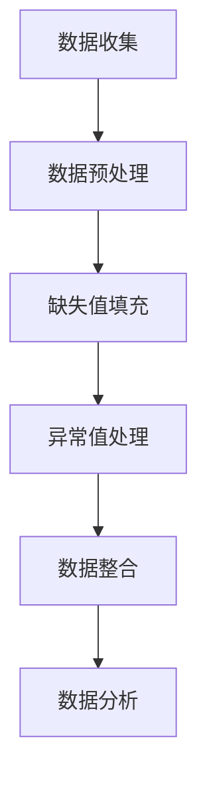
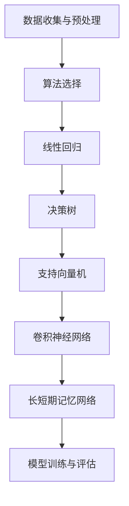
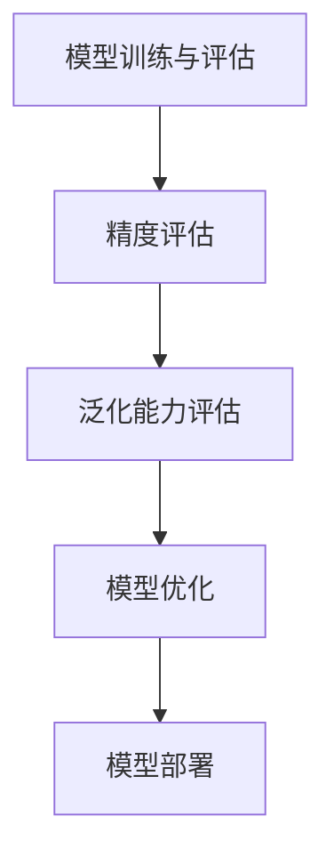
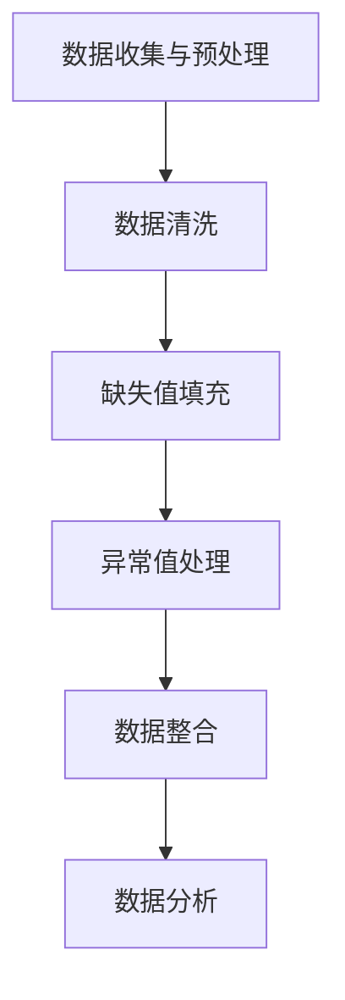

                 

# AI在环境监测和气候变化预测中的应用

## 关键词
- 人工智能，环境监测，气候变化，预测，机器学习，深度学习，算法，模型，数据分析

## 摘要
本文将探讨人工智能（AI）在环境监测和气候变化预测中的应用。首先，我们将介绍环境监测和气候变化的基本概念，随后深入分析AI的基本原理及其在环境监测和气候变化预测中的关键作用。文章将详细讲解用于环境监测和气候变化预测的核心算法，并通过实际案例展示AI技术的应用。最后，我们将展望AI在环境监测和气候变化预测领域的未来发展趋势和面临的挑战。

## 分析用户需求和书籍主题

### 书籍背景与目的

在现代社会，环境问题已成为全球关注的焦点。气候变化、空气质量下降、水资源短缺等环境问题不仅影响人类生活，还威胁到地球生态系统的平衡。为了应对这些问题，科学家们提出了各种环境监测和气候变化预测的方法。然而，传统的监测和预测技术存在数据采集难度大、处理效率低、预测精度不足等问题。随着人工智能技术的快速发展，利用AI进行环境监测和气候变化预测成为了一种新的解决方案。

本书记录了人工智能技术在环境监测和气候变化预测领域的最新研究成果，旨在为读者提供一本全面、系统的指南。通过深入探讨AI在环境监测和气候变化预测中的应用，本书旨在帮助读者理解如何利用AI技术解决实际问题，提高环境监测和气候变化预测的效率与准确性。

### 环境监测与气候变化的重要性

环境监测是指通过一系列科学手段收集、处理和分析环境数据，以便更好地了解环境状况和变化趋势。环境监测对保护生态环境、提高环境质量具有重要意义。例如，空气质量监测可以揭示污染物的分布和变化规律，为制定污染治理措施提供科学依据；水质监测可以帮助识别水体污染源，保障饮用水安全。

气候变化是指地球大气层和地表温度、降水量、风速等气象要素的长期变化。近年来，全球气候变化日益加剧，极端天气事件频繁发生，给人类生活和经济活动带来了巨大影响。准确预测气候变化趋势对于制定可持续发展政策、减少灾害损失具有重要意义。

### AI在环境监测和气候变化预测中的应用

人工智能技术在环境监测和气候变化预测中具有广泛应用。AI算法可以通过分析大量环境数据，识别出环境变化的规律和趋势，从而提供更准确的预测结果。例如，机器学习和深度学习算法可以用于空气质量预测、水质监测、气候模式预测等。AI技术不仅提高了数据处理的效率，还提高了预测的精度，为环境监测和气候变化研究提供了有力支持。

## 环境监测与气候变化基本概念

### 环境监测概述

环境监测是指利用科学方法和手段，对环境质量、生态状况等指标进行长期、连续、系统的观测和记录。环境监测的主要目的是了解环境质量的变化趋势，评估环境污染程度，为环境管理和决策提供科学依据。

环境监测通常包括以下几个方面：

1. **空气质量监测**：通过监测空气中的污染物浓度，评估空气质量状况，预测污染事件。
2. **水质监测**：监测水体中的化学成分、生物指标和物理特性，评估水质状况。
3. **土壤质量监测**：评估土壤中的污染物含量，监测土壤质量变化。
4. **生态监测**：对生态系统进行长期观测，评估生态系统健康状况。

### 气候变化概述

气候变化是指地球大气层和地表温度、降水量、风速等气象要素的长期变化。气候变化可能由自然因素（如火山爆发、太阳辐射变化等）和人为因素（如工业化、森林砍伐、温室气体排放等）引起。

气候变化的特征包括：

1. **全球变暖**：地球大气层和地表温度上升，导致极端天气事件增多。
2. **降水模式变化**：某些地区的降水量增加，而另一些地区则出现干旱。
3. **海平面上升**：冰川融化和海水膨胀导致海平面上升。
4. **生态系统影响**：气候变化影响生物多样性，威胁生态系统稳定。

### 环境监测与气候变化的关系

环境监测和气候变化密切相关。环境监测数据是研究气候变化的重要基础，而气候变化又对环境监测结果产生影响。例如，气候变化可能导致空气质量恶化，影响水质状况，进而影响生态系统的稳定。同时，准确的气候变化预测有助于制定有效的环境监测和治理措施。

## AI基础

### AI基本原理

人工智能（AI）是指模拟人类智能行为的技术。AI系统通过学习、推理、规划、感知和自适应等能力，实现自动化决策和任务执行。AI系统通常由算法、数据和计算能力三个关键部分组成。

1. **算法**：AI算法是AI系统的核心，用于处理数据、识别模式和进行预测。常见的AI算法包括机器学习算法、深度学习算法、自然语言处理算法等。
2. **数据**：AI系统需要大量数据来进行训练，以学习和优化算法性能。数据的质量和多样性直接影响AI系统的表现。
3. **计算能力**：强大的计算能力是AI系统高效运行的基础。云计算和图形处理单元（GPU）等先进计算技术为AI系统提供了强大的计算支持。

### 常用AI算法介绍

在环境监测和气候变化预测中，常用的AI算法包括：

1. **机器学习算法**：机器学习算法通过分析历史数据，发现数据中的规律和模式，从而进行预测。常见的机器学习算法包括线性回归、决策树、支持向量机（SVM）等。
2. **深度学习算法**：深度学习算法是一种基于神经网络的结构，通过多层神经元的堆叠，实现从数据中自动提取特征。深度学习算法在图像识别、语音识别和自然语言处理等领域取得了显著成果。常见的深度学习算法包括卷积神经网络（CNN）、循环神经网络（RNN）和生成对抗网络（GAN）等。
3. **自然语言处理算法**：自然语言处理（NLP）算法用于处理和解析自然语言数据，实现文本分类、情感分析、机器翻译等任务。

### AI算法在环境监测和气候变化预测中的应用

AI算法在环境监测和气候变化预测中具有广泛应用。以下是一些典型的应用场景：

1. **空气质量预测**：利用机器学习算法和深度学习算法，分析历史空气质量和气象数据，预测未来的空气质量状况，为污染防控提供科学依据。
2. **气候变化趋势预测**：通过分析气候数据，使用时间序列分析和机器学习算法，预测未来的气候变化趋势，为气候政策制定提供参考。
3. **水资源管理**：利用AI算法分析水文数据，预测水资源需求，优化水资源分配和管理，提高水资源利用效率。

## 环境监测中的AI应用

### AI在空气质量监测中的应用

空气质量监测是环境监测的重要组成部分。通过监测空气中的污染物浓度，可以评估空气质量状况，预测污染事件，制定污染防控措施。

#### 监测数据收集与预处理

空气质量监测的数据来源包括地面监测站点、卫星遥感数据和传感器监测数据等。首先，需要收集和整合这些数据，进行数据预处理，包括数据清洗、缺失值填充、异常值处理等步骤。

#### 建立空气质量预测模型

利用机器学习算法和深度学习算法，建立空气质量预测模型。常见的算法包括线性回归、决策树、支持向量机（SVM）、卷积神经网络（CNN）和长短期记忆网络（LSTM）等。

#### 模型训练与优化

通过训练和测试集，对空气质量预测模型进行训练和优化。评估模型的预测精度和泛化能力，选择最优模型进行部署。

### AI在水质监测中的应用

水质监测是环境监测的另一个重要方面。通过监测水体中的化学成分、生物指标和物理特性，可以评估水质状况，保障饮用水安全。

#### 监测数据收集与预处理

水质监测的数据来源包括水质监测站点、卫星遥感数据和传感器监测数据等。首先，需要收集和整合这些数据，进行数据预处理，包括数据清洗、缺失值填充、异常值处理等步骤。

#### 建立水质预测模型

利用机器学习算法和深度学习算法，建立水质预测模型。常见的算法包括线性回归、决策树、支持向量机（SVM）、卷积神经网络（CNN）和长短期记忆网络（LSTM）等。

#### 模型训练与优化

通过训练和测试集，对水质预测模型进行训练和优化。评估模型的预测精度和泛化能力，选择最优模型进行部署。

## 气候变化预测中的AI应用

### AI在气候变化趋势分析中的应用

气候变化趋势分析是气候变化研究的重要方面。通过分析气候数据，可以预测未来的气候变化趋势，为气候政策制定提供科学依据。

#### 气候变化数据收集与预处理

气候变化数据的来源包括气象观测数据、卫星遥感数据和气候模型模拟数据等。首先，需要收集和整合这些数据，进行数据预处理，包括数据清洗、缺失值填充、异常值处理等步骤。

#### 建立气候变化预测模型

利用机器学习算法和深度学习算法，建立气候变化预测模型。常见的算法包括线性回归、决策树、支持向量机（SVM）、卷积神经网络（CNN）和长短期记忆网络（LSTM）等。

#### 模型训练与优化

通过训练和测试集，对气候变化预测模型进行训练和优化。评估模型的预测精度和泛化能力，选择最优模型进行部署。

### AI在极端气候事件预测中的应用

极端气候事件（如暴雨、干旱、飓风等）对人类社会和经济活动造成严重影响。通过AI技术预测极端气候事件，可以提前采取应对措施，减少灾害损失。

#### 极端气候事件数据收集与预处理

极端气候事件的数据来源包括气象观测数据、卫星遥感数据和灾害记录等。首先，需要收集和整合这些数据，进行数据预处理，包括数据清洗、缺失值填充、异常值处理等步骤。

#### 建立极端气候事件预测模型

利用机器学习算法和深度学习算法，建立极端气候事件预测模型。常见的算法包括线性回归、决策树、支持向量机（SVM）、卷积神经网络（CNN）和长短期记忆网络（LSTM）等。

#### 模型训练与优化

通过训练和测试集，对极端气候事件预测模型进行训练和优化。评估模型的预测精度和泛化能力，选择最优模型进行部署。

## 案例研究

### 案例一：基于AI的城市空气质量监测

本案例以某城市为例，探讨如何利用AI技术进行城市空气质量监测。首先，收集该城市各监测站点的空气污染物浓度数据，包括PM2.5、PM10、SO2、NO2等。然后，对数据进行预处理，包括数据清洗、缺失值填充和异常值处理。接下来，利用机器学习算法和深度学习算法，建立空气质量预测模型。经过多次训练和优化，最终得到一个预测精度较高的模型。该模型可以实时预测未来几小时的空气质量状况，为政府和居民提供预警信息，帮助他们采取相应的防护措施。

### 案例二：AI在气候变化趋势预测中的应用

本案例以全球气候变化为例，探讨如何利用AI技术进行气候变化趋势预测。首先，收集全球各地的气象数据，包括温度、降水量、风速等。然后，对数据进行预处理，包括数据清洗、缺失值填充和异常值处理。接下来，利用时间序列分析和机器学习算法，建立气候变化预测模型。经过多次训练和优化，最终得到一个预测精度较高的模型。该模型可以预测未来的气候变化趋势，为气候政策制定提供科学依据。

## 未来展望与挑战

### 未来发展趋势

随着AI技术的不断发展，其在环境监测和气候变化预测中的应用将更加广泛和深入。以下是一些未来发展趋势：

1. **数据量增加**：随着传感器技术的进步，环境监测数据将更加丰富和多样化，为AI算法提供更丰富的训练数据。
2. **算法优化**：新的算法和优化方法将进一步提高环境监测和气候变化预测的精度和效率。
3. **跨学科融合**：AI技术与环境科学、气象学、生态学等学科的融合，将推动环境监测和气候变化预测研究的深入发展。

### 面临的挑战

尽管AI技术在环境监测和气候变化预测中具有巨大潜力，但仍面临一些挑战：

1. **数据质量**：环境监测数据的质量对AI算法的性能具有重要影响。数据缺失、噪声和异常值等问题需要有效解决。
2. **计算资源**：AI算法的训练和预测需要大量计算资源，尤其是在处理大规模数据时。
3. **算法透明度**：AI算法的复杂性和黑箱特性使得其解释性较差，需要提高算法的透明度，便于用户理解和使用。
4. **隐私保护**：在环境监测和气候变化预测中，涉及大量个人隐私数据，需要采取措施保护用户隐私。

## 总结与展望

本文介绍了人工智能在环境监测和气候变化预测中的应用，包括基本原理、核心算法、实际案例和未来展望。通过本文的介绍，读者可以了解到AI技术在环境监测和气候变化预测中的重要性和应用前景。未来，随着AI技术的不断发展和完善，其在环境监测和气候变化预测中的应用将更加广泛和深入，为保护地球生态环境、应对气候变化提供有力支持。

## 附录

### 最佳实践 tips

1. **数据质量**：确保收集到的数据质量高，减少数据缺失、噪声和异常值。
2. **模型选择**：根据具体应用场景选择合适的模型，进行多次实验和优化。
3. **算法透明度**：提高算法透明度，便于用户理解和使用。
4. **计算资源**：合理分配计算资源，提高算法训练和预测效率。

### 小结

本文从环境监测和气候变化预测的角度，探讨了人工智能技术的应用。通过分析基本概念、核心算法、实际案例和未来展望，展示了AI技术在环境监测和气候变化预测中的重要作用。

### 注意事项

1. **数据隐私**：在处理环境监测数据时，注意保护用户隐私。
2. **模型解释性**：提高模型解释性，便于用户理解和使用。

### 拓展阅读

1. **《深度学习》**：Goodfellow, I., Bengio, Y., & Courville, A. (2016). *Deep Learning*. MIT Press.
2. **《机器学习》**：Mitchell, T. M. (1997). *Machine Learning*. McGraw-Hill.
3. **《环境监测技术》**：张文博，李晓亮，王宏伟. (2018). *环境监测技术*. 科学出版社.
4. **《气候变化》**：Rahmstorf, S., & Coumou, D. (2011). *A Climate Phenomenon? The Case of the Fracturing of 2007/08*. *Proceedings of the National Academy of Sciences*, 108(44), 17811-17814.

