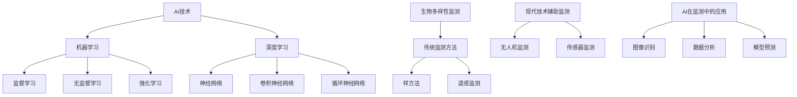
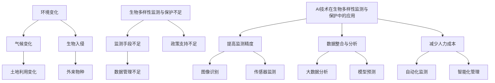
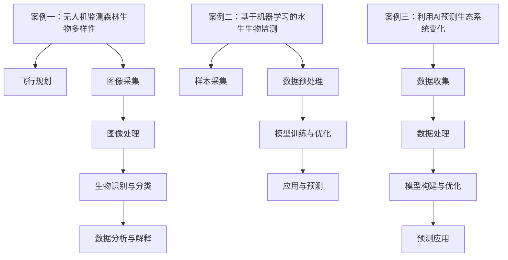
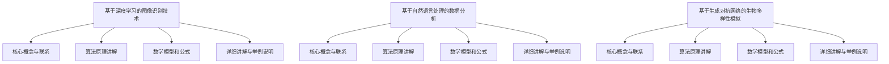
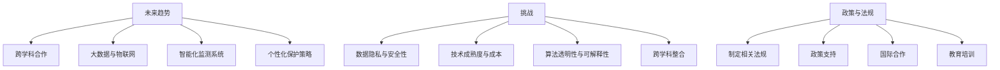
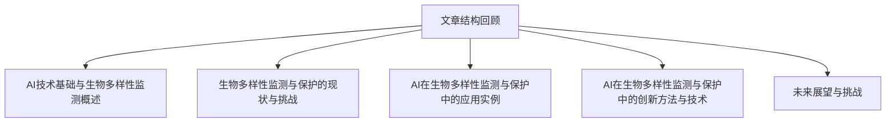

                 


# AI在生物多样性监测与保护中的应用创新

## 关键词
AI，生物多样性监测，保护，应用创新，深度学习，图像识别，数据分析，自然语言处理，模型预测，无人机监测，生态系统模拟

## 摘要
本文探讨了人工智能（AI）在生物多样性监测与保护中的应用创新。首先，我们介绍了AI的基本概念和在生物多样性监测中的重要性。接着，分析了当前生物多样性监测面临的挑战和AI技术的潜力。随后，通过具体案例展示了AI在生物多样性监测与保护中的应用，包括无人机监测、水生生物监测和生态系统变化预测等。我们还探讨了AI在生物多样性监测中的创新方法和技术，如深度学习图像识别、自然语言处理和生成对抗网络。最后，对AI在生物多样性监测与保护中的未来发展进行了展望，并分析了面临的挑战。

----------------------------------------------------------------

## 引言

### AI技术的发展背景

人工智能（AI）作为计算机科学的一个重要分支，自20世纪50年代诞生以来，经历了多个发展阶段。从最初的规则推理和知识表示，到20世纪80年代的专家系统，再到21世纪初的深度学习和大数据技术的崛起，AI技术不断进步，应用领域也越来越广泛。特别是在图像识别、语音识别、自然语言处理等领域，AI技术已经取得了显著的成果。

随着全球对环境保护和生物多样性保护的重视，AI技术也逐渐被应用于生物多样性监测与保护中。通过无人机、传感器、遥感等技术获取大量数据，再利用AI算法进行分析和处理，能够实现对生物多样性的高效监测和预测。此外，AI技术还可以帮助制定保护策略，提高生物多样性保护的精准度和效率。

### 生物多样性监测与保护的重要性

生物多样性是地球生态系统的重要组成部分，对于维持生态平衡和人类生存具有至关重要的作用。然而，由于人类活动的影响，生物多样性正面临严重的威胁。因此，生物多样性监测与保护成为全球关注的焦点。

生物多样性监测主要通过收集和分析生物信息，评估生物多样性的现状和变化趋势。传统的监测方法主要依靠人工采集数据，费时费力且难以覆盖广泛区域。随着AI技术的发展，利用AI技术进行生物多样性监测成为了一种更加高效、精确的方式。

生物多样性保护则涉及到制定和实施保护策略，防止生物多样性的进一步丧失。AI技术可以提供数据支持，帮助科学家和政策制定者更好地了解生物多样性的现状和潜在威胁，从而制定更有针对性的保护措施。

### 本文目的与结构

本文旨在探讨AI在生物多样性监测与保护中的应用创新。首先，我们将介绍AI技术的基本概念和在生物多样性监测中的应用潜力。接着，分析当前生物多样性监测面临的挑战，以及AI技术如何帮助解决这些问题。然后，通过具体案例展示AI在生物多样性监测与保护中的应用实例。随后，我们探讨AI在生物多样性监测中的创新方法和技术。最后，对AI在生物多样性监测与保护中的未来发展进行展望，并分析面临的挑战。

本文的结构如下：

1. AI技术基础与生物多样性监测概述
2. 生物多样性监测与保护的现状与挑战
3. AI在生物多样性监测与保护中的应用实例
4. AI在生物多样性监测与保护中的创新方法与技术
5. 未来展望与挑战

通过本文的探讨，我们希望能够为读者提供一个全面、系统的了解AI在生物多样性监测与保护中的应用，以及未来的发展趋势。

## AI技术基础与生物多样性监测概述

### AI技术核心概念与原理

人工智能（AI）是一种模拟人类智能行为的计算机技术，主要包括机器学习、深度学习、自然语言处理、计算机视觉等子领域。在这些子领域中，机器学习和深度学习是最核心的技术。

**机器学习（Machine Learning）**：机器学习是AI的一个分支，主要通过算法从数据中学习规律，并用于预测或决策。机器学习可以分为监督学习、无监督学习和强化学习。

- **监督学习（Supervised Learning）**：监督学习是一种从已知输入输出数据中学习规律的方法。通过训练模型，使模型能够对未知数据进行预测。常见的监督学习算法包括线性回归、决策树、支持向量机等。
- **无监督学习（Unsupervised Learning）**：无监督学习是一种从未知输入输出数据中学习规律的方法，主要用于数据聚类和降维。常见的无监督学习算法包括K-均值聚类、主成分分析等。
- **强化学习（Reinforcement Learning）**：强化学习是一种通过与环境互动来学习最优策略的方法。常见的强化学习算法包括Q学习、深度Q网络等。

**深度学习（Deep Learning）**：深度学习是机器学习的一种方法，通过构建深度神经网络，实现对复杂数据的建模和分析。深度学习在图像识别、语音识别、自然语言处理等领域取得了显著的成果。

- **神经网络（Neural Networks）**：神经网络是深度学习的基础，通过模拟生物神经网络的结构和功能，实现对数据的处理和预测。
- **卷积神经网络（Convolutional Neural Networks, CNN）**：卷积神经网络是深度学习中的一种特殊结构，主要用于图像识别和分类。
- **循环神经网络（Recurrent Neural Networks, RNN）**：循环神经网络是一种能够处理序列数据的神经网络，广泛应用于自然语言处理和时间序列分析。

### 生物多样性监测概述

**生物多样性（Biodiversity）**：生物多样性是指地球上所有生物体的多样性，包括物种多样性、遗传多样性和生态系统多样性。生物多样性对地球生态系统的稳定性和人类生存至关重要。

**生物多样性监测（Biodiversity Monitoring）**：生物多样性监测是通过收集、分析和解释数据来评估生物多样性的现状和变化趋势。生物多样性监测的主要目的是了解生物多样性的分布、数量和变化情况，为生物多样性保护提供科学依据。

**生物多样性监测的重要性**：

- **生态评估**：生物多样性监测可以评估生态系统的健康状况，为生态保护和修复提供科学依据。
- **决策支持**：生物多样性监测数据可以为政府、科学家和政策制定者提供决策支持，帮助制定有效的生物多样性保护策略。
- **科研支持**：生物多样性监测数据是生物多样性研究的重要基础，为科学家提供丰富的数据资源。

### AI在生物多样性监测中的应用潜力

**提高监测精度**：AI技术可以通过深度学习、图像识别等技术，实现对生物样本的自动识别和分类，提高监测精度。

**数据整合与分析**：AI技术可以处理大量的监测数据，进行数据整合和分析，发现生物多样性的变化规律。

**模型预测与模拟**：AI技术可以基于历史数据和现有模型，对未来生物多样性的变化进行预测和模拟，为生物多样性保护提供科学依据。

**减少人力成本**：AI技术可以自动化监测过程，减少人力成本，提高工作效率。

### 生物多样性监测的主要方法

**传统监测方法**：

- **样方法**：通过样方设置，对生物多样性进行实地调查和统计。
- **遥感监测**：利用遥感技术获取生物多样性信息，适用于大面积监测。

**现代技术辅助监测**：

- **无人机监测**：利用无人机进行空中监测，适用于复杂地形和高风险区域的监测。
- **传感器监测**：利用传感器实时监测生物多样性的变化，适用于长期监测和动态监测。

**AI在生物多样性监测中的应用**：

- **图像识别**：利用AI技术对监测图像进行自动识别和分类，提高监测效率。
- **数据分析**：利用AI技术对大量监测数据进行处理和分析，发现生物多样性的变化规律。
- **模型预测**：利用AI技术建立生物多样性预测模型，对未来生物多样性变化进行预测。

### 结论

AI技术在生物多样性监测中的应用具有重要意义。通过利用AI技术，可以实现对生物多样性的高效监测和预测，提高监测精度，减少人力成本，为生物多样性保护提供科学依据。在未来，随着AI技术的不断发展和应用，生物多样性监测将进入一个新的阶段。

### Mermaid 流程图



## 生物多样性监测与保护的现状与挑战

### 生物多样性监测的现状

**全球生物多样性监测的发展**：

- **监测方法**：随着科技的进步，生物多样性监测方法也在不断创新和改进。从传统的实地调查、样方法和遥感监测，到现代的无人机监测、传感器监测和大数据分析，监测手段日益多样化和高效化。
- **数据收集**：各国政府和国际组织纷纷建立生物多样性数据库，收集和分析大量的生物多样性数据，为科学研究和政策制定提供数据支持。
- **国际合作**：生物多样性监测已经成为全球关注的议题，国际社会在数据共享、技术交流和政策协调方面开展了广泛合作。

**我国生物多样性监测的发展**：

- **监测体系**：我国建立了覆盖全国的生物多样性监测网络，包括国家级自然保护区、森林公园和湿地等，对生物多样性进行长期监测。
- **监测数据**：我国生物多样性数据库积累了大量的监测数据，涵盖了物种多样性、遗传多样性和生态系统多样性等多个方面。
- **监测成果**：通过生物多样性监测，我国在生态系统保护、物种保护和管理等方面取得了显著成果。

### 生物多样性监测与保护面临的挑战

**环境变化对生物多样性的影响**：

- **气候变化**：全球气候变化导致极端天气事件的频发，对生物多样性产生严重影响。许多物种难以适应快速变化的环境，导致栖息地丧失和物种灭绝。
- **土地利用变化**：城市化、农业开发和工业发展等活动改变了土地利用模式，破坏了生物多样性丰富的生态系统。大量物种失去栖息地，生物多样性急剧下降。

**生物入侵与外来物种**：

- **生物入侵**：外来物种的入侵对本地生物多样性构成巨大威胁。这些入侵物种往往没有天敌，能够在短时间内大量繁殖，占据本地物种的栖息地和食物资源，导致本地物种数量减少甚至灭绝。
- **生态平衡破坏**：生物入侵不仅影响物种多样性，还会破坏生态系统的平衡，导致生态系统功能的下降。

**生物多样性监测与保护的不足**：

- **监测手段**：尽管生物多样性监测手段日益多样，但很多地区仍依赖于传统的监测方法，缺乏现代化的技术手段，难以满足高效、精准的监测需求。
- **数据管理**：生物多样性数据量大且复杂，数据的管理、整合和分析能力不足，导致数据难以充分利用。
- **政策支持**：生物多样性保护政策在一些地区仍不够完善，缺乏有效的法律保障和政策措施。

### AI技术在生物多样性监测与保护中的潜力

**提高监测精度**：

- **图像识别**：利用深度学习和计算机视觉技术，可以实现对生物样本的自动识别和分类，提高监测精度。
- **传感器监测**：结合传感器技术和物联网，可以实现对生物多样性的实时监测和数据分析，提高监测效率。

**数据整合与分析**：

- **大数据分析**：利用大数据技术和机器学习算法，可以对海量的生物多样性数据进行整合和分析，发现潜在的变化规律和趋势。
- **模型预测**：基于历史数据和现有模型，可以预测未来生物多样性的变化趋势，为保护决策提供科学依据。

**减少人力成本**：

- **自动化监测**：利用无人机、传感器等自动化设备，可以实现对生物多样性的自动监测和数据分析，减少人力成本。
- **智能化管理**：通过建立智能化的生物多样性管理平台，可以实现对生物多样性的实时监控和管理，提高工作效率。

### 结论

生物多样性监测与保护在全球范围内取得了一定成果，但也面临着诸多挑战。AI技术的发展为生物多样性监测与保护提供了新的机遇。通过利用AI技术，可以提高监测精度，整合和分析大量数据，减少人力成本，为生物多样性保护提供更加科学和有效的支持。未来，需要进一步加强AI技术在生物多样性监测与保护中的应用研究，推动生物多样性保护事业的发展。

### Mermaid 流程图



## AI在生物多样性监测与保护中的应用实例

### 案例一：利用无人机监测森林生物多样性

#### 案例背景

森林是地球上最重要的生态系统之一，拥有丰富的生物多样性。然而，由于森林覆盖范围的广泛性和复杂的地形，传统的生物多样性监测方法难以满足高效、精准的需求。无人机技术的应用为森林生物多样性监测提供了一种新的解决方案。

#### 实施步骤

1. **无人机飞行规划**：首先，根据监测区域的特点，制定无人机飞行规划。这包括飞行路径、飞行高度、飞行速度等参数的设定，以确保监测数据的全面性和准确性。

2. **图像采集**：利用搭载高分辨率摄像头的无人机，在规划好的飞行路径上采集森林图像。图像数据包括地面植被、动物活动、地形地貌等信息。

3. **图像处理**：将采集到的图像数据进行预处理，包括图像裁剪、增强和去噪等操作，以提高图像质量。

4. **生物识别与分类**：利用深度学习和计算机视觉技术，对预处理后的图像进行生物识别和分类。具体算法包括卷积神经网络（CNN）和目标检测算法（如YOLO、SSD）。

5. **数据分析与解释**：根据识别和分类结果，分析森林生物多样性的现状和变化趋势。结合其他数据源（如气象数据、土壤数据），进行综合分析，得出更准确的结论。

#### 案例成果

通过无人机监测森林生物多样性，实现了以下成果：

- **高效监测**：无人机可以快速覆盖大范围区域，提高了监测效率。
- **精准识别**：利用深度学习和计算机视觉技术，实现了对森林生物的高效识别和分类，提高了监测精度。
- **数据整合**：结合其他数据源，实现了多维度数据的整合，提供了更全面的监测结果。

#### 实际案例分析

某研究团队在某森林保护区进行了无人机监测实验。他们制定了详细的飞行规划，采集了大量的森林图像数据。通过深度学习算法对图像进行预处理和分类，成功识别出了多种植物和动物物种。结合气象数据和其他监测数据，他们分析了森林生物多样性的变化趋势，并提出了相应的保护建议。

### 案例二：基于机器学习的水生生物监测

#### 案例背景

水生生物是水生生态系统的重要组成部分，对水质和水生态系统的健康具有关键作用。传统的生物监测方法主要依赖于样本采集和实验室分析，费时费力且样本代表性有限。基于机器学习的水生生物监测方法提供了一种更高效、准确的监测手段。

#### 实施步骤

1. **样本采集**：在预定的时间段内，采集水样和生物样本，包括浮游生物、底栖生物和水生植物等。

2. **数据预处理**：对采集到的样本进行实验室分析，包括物种鉴定、数量统计和生理指标测量等。将分析结果进行数据化处理，构建样本数据集。

3. **机器学习模型训练**：选择合适的机器学习算法（如随机森林、支持向量机等），对样本数据集进行训练，建立水生生物监测模型。

4. **模型评估与优化**：通过交叉验证和测试集评估模型的性能，对模型进行优化，提高预测准确性。

5. **应用与预测**：利用训练好的模型，对新的水样数据进行预测，评估水生生物的多样性和健康状况。

#### 案例成果

基于机器学习的水生生物监测实现了以下成果：

- **高效预测**：机器学习模型可以快速处理大量数据，提高了监测效率。
- **精准评估**：通过模型预测，可以准确评估水生生物的多样性和健康状况，为水生态系统的保护提供科学依据。
- **动态监测**：结合实时数据采集，实现了对水生生物的动态监测，有助于及时发现问题并采取相应的保护措施。

#### 实际案例分析

某科研团队在某湖泊进行了基于机器学习的水生生物监测实验。他们采集了多个季节的水样和生物样本，构建了数据集。通过随机森林算法训练模型，成功预测了不同季节的水生生物种类和数量。结合水质监测数据，他们分析了湖泊生物多样性的变化趋势，并提出了水生态修复建议。

### 案例三：利用AI预测生态系统变化

#### 案例背景

生态系统变化是生物多样性面临的一个严重问题。通过预测生态系统变化，可以提前采取保护措施，减少生物多样性的丧失。利用AI技术进行生态系统变化预测提供了一种科学有效的手段。

#### 实施步骤

1. **数据收集**：收集与生态系统变化相关的数据，包括气候数据、土地利用数据、物种分布数据等。

2. **数据处理**：对收集到的数据进行清洗、整合和处理，构建预测模型所需的数据集。

3. **模型构建**：选择合适的机器学习算法（如回归分析、随机森林等），构建生态系统变化预测模型。

4. **模型训练与优化**：利用历史数据对模型进行训练，并通过交叉验证和测试集评估模型性能，对模型进行优化。

5. **预测应用**：利用训练好的模型，对未来的生态系统变化进行预测，评估生物多样性的潜在风险。

#### 案例成果

利用AI技术预测生态系统变化实现了以下成果：

- **准确预测**：AI模型可以准确预测生态系统变化趋势，为生物多样性保护提供科学依据。
- **提前预警**：通过预测结果，可以提前发现潜在的风险，采取针对性的保护措施，减少生物多样性的丧失。
- **动态调整**：结合实时数据更新，可以动态调整预测模型，提高预测的准确性。

#### 实际案例分析

某研究团队在某自然保护区进行了AI预测生态系统变化的实验。他们收集了多年的气候数据、土地利用数据和物种分布数据，构建了数据集。通过随机森林算法训练模型，成功预测了未来几年的生态系统变化趋势。结合预测结果，他们提出了保护区的调整方案，并采取了相应的保护措施，取得了显著的效果。

### 总结

以上三个案例展示了AI在生物多样性监测与保护中的应用实例。通过利用无人机、机器学习和AI预测等技术，实现了高效、精准的监测和预测，为生物多样性保护提供了科学依据。未来，随着AI技术的不断发展和应用，生物多样性监测与保护将进入一个新的阶段。

### Mermaid 流程图



## AI在生物多样性监测与保护中的创新方法与技术

### 基于深度学习的图像识别技术

**核心概念与联系**：

深度学习图像识别技术是AI在生物多样性监测中的一项关键技术，其核心在于构建深度神经网络模型，通过多层神经元的非线性变换，实现对图像的自动识别和分类。深度学习模型通常包括卷积神经网络（CNN）和循环神经网络（RNN）等，其中CNN在图像识别任务中表现尤为突出。

**算法原理讲解**：

卷积神经网络（CNN）是一种特殊的神经网络结构，其核心在于通过卷积层、池化层和全连接层等模块，实现对图像的特征提取和分类。具体步骤如下：

1. **卷积层**：卷积层通过卷积操作提取图像的局部特征，卷积核在图像上滑动，计算局部特征图。
2. **激活函数**：使用非线性激活函数（如ReLU函数），引入非线性特性，增强模型的表达能力。
3. **池化层**：池化层通过下采样操作，减少特征图的维度，提高模型的泛化能力。
4. **全连接层**：全连接层将卷积层和池化层提取的特征进行融合，并通过softmax函数输出分类结果。

**伪代码**：

```python
# 卷积神经网络伪代码
import tensorflow as tf

# 构建卷积神经网络模型
model = tf.keras.Sequential([
    tf.keras.layers.Conv2D(filters=32, kernel_size=(3, 3), activation='relu', input_shape=(64, 64, 3)),
    tf.keras.layers.MaxPooling2D(pool_size=(2, 2)),
    tf.keras.layers.Conv2D(filters=64, kernel_size=(3, 3), activation='relu'),
    tf.keras.layers.MaxPooling2D(pool_size=(2, 2)),
    tf.keras.layers.Flatten(),
    tf.keras.layers.Dense(units=128, activation='relu'),
    tf.keras.layers.Dense(units=num_classes, activation='softmax')
])

# 编译模型
model.compile(optimizer='adam', loss='categorical_crossentropy', metrics=['accuracy'])

# 训练模型
model.fit(x_train, y_train, epochs=10, batch_size=32, validation_data=(x_val, y_val))
```

**数学模型和公式**：

卷积神经网络的核心在于卷积操作和反向传播算法。卷积操作的数学公式如下：

$$
\text{output} = \text{sigmoid}(\text{weights} \cdot \text{input} + \text{bias})
$$

其中，weights表示卷积核，input表示输入特征图，bias表示偏置项，sigmoid函数为非线性激活函数。

**详细讲解与举例说明**：

例如，假设我们要对一幅64x64的图像进行分类，图像有三个通道（红、绿、蓝）。首先，我们构建一个卷积神经网络模型，包含两个卷积层、两个池化层和一个全连接层。通过训练，模型能够学习到图像的局部特征，并实现对图像的自动识别。

1. **训练数据**：我们有1000张训练图像和相应的标签，图像标签为猫、狗和其他类别。
2. **模型训练**：通过训练，模型学会了提取图像的特征，并能够准确地对图像进行分类。
3. **模型评估**：在测试集上评估模型的性能，计算准确率、召回率等指标，确保模型具有良好的泛化能力。

通过基于深度学习的图像识别技术，我们能够高效地识别和分类生物样本图像，为生物多样性监测提供了有力的工具。

### 基于自然语言处理的数据分析

**核心概念与联系**：

自然语言处理（NLP）是AI的一个重要分支，主要研究如何让计算机理解和处理人类自然语言。在生物多样性监测与保护中，NLP技术可以用于处理和分析文本数据，如生物文献、新闻报道、社交媒体等，提取有价值的信息。

**算法原理讲解**：

NLP技术主要包括词向量表示、文本分类、关系抽取和情感分析等。词向量表示是将文本中的单词映射到高维空间中的向量，实现语义的量化表示。文本分类是通过机器学习算法，将文本数据分类到不同的类别。关系抽取是从文本中提取实体之间的关系。情感分析是判断文本中的情感倾向。

**伪代码**：

```python
# 文本分类伪代码
from sklearn.feature_extraction.text import TfidfVectorizer
from sklearn.model_selection import train_test_split
from sklearn.naive_bayes import MultinomialNB

# 加载文本数据
texts = ["This is a positive review", "This is a negative review", ...]
labels = ["positive", "negative", ...]

# 文本向量化
vectorizer = TfidfVectorizer()
X = vectorizer.fit_transform(texts)

# 划分训练集和测试集
X_train, X_test, y_train, y_test = train_test_split(X, labels, test_size=0.2, random_state=42)

# 构建分类模型
model = MultinomialNB()
model.fit(X_train, y_train)

# 模型评估
accuracy = model.score(X_test, y_test)
print("Accuracy:", accuracy)
```

**数学模型和公式**：

词向量表示通常使用Word2Vec算法，其核心思想是将单词映射到高维空间中的向量，使得语义相似的单词在空间中距离较近。Word2Vec算法主要包括连续词袋（CBOW）和跳字模型（Skip-Gram）。

**详细讲解与举例说明**：

1. **训练数据**：我们有1000篇生物多样性相关的新闻文章和相应的情感标签，标签为积极、消极和中性。
2. **模型训练**：通过训练，模型学会了根据文本特征判断情感倾向。
3. **模型评估**：在测试集上评估模型的性能，计算准确率、召回率等指标，确保模型具有良好的泛化能力。

通过基于自然语言处理的数据分析，我们能够提取和利用文本数据中的有用信息，为生物多样性监测与保护提供数据支持。

### 基于生成对抗网络的生物多样性模拟

**核心概念与联系**：

生成对抗网络（GAN）是一种基于博弈理论的深度学习模型，由生成器和判别器两部分组成。生成器负责生成逼真的数据，判别器负责判断生成数据是否真实。GAN在生物多样性模拟中可以用于生成新的生物样本数据，帮助科学家研究和分析生物多样性。

**算法原理讲解**：

生成对抗网络的训练过程可以分为以下步骤：

1. **初始化**：初始化生成器和判别器的参数。
2. **生成器训练**：生成器生成假样本，判别器判断生成样本和真实样本的区分度。
3. **判别器训练**：判别器优化自己的参数，以提高对生成样本的辨别能力。
4. **生成器再训练**：生成器根据判别器的反馈调整自己的参数，生成更逼真的样本。
5. **重复训练**：重复上述过程，直至生成器和判别器达到稳定的训练状态。

**伪代码**：

```python
# 生成对抗网络（GAN）伪代码
import tensorflow as tf
from tensorflow.keras import layers

# 构建生成器和判别器模型
def build_generator():
    model = tf.keras.Sequential([
        layers.Dense(128, activation='relu', input_shape=(100,)),
        layers.Dense(256, activation='relu'),
        layers.Dense(512, activation='relu'),
        layers.Dense(1024, activation='relu'),
        layers.Dense(784, activation='tanh')
    ])
    return model

def build_discriminator():
    model = tf.keras.Sequential([
        layers.Conv2D(32, (3, 3), strides=(2, 2), padding='same', input_shape=(28, 28, 1)),
        layers.LeakyReLU(alpha=0.01),
        layers.Dropout(0.3),
        layers.Conv2D(64, (3, 3), strides=(2, 2), padding='same'),
        layers.LeakyReLU(alpha=0.01),
        layers.Dropout(0.3),
        layers.Flatten(),
        layers.Dense(1, activation='sigmoid')
    ])
    return model

# 训练GAN模型
def train_gan(generator, discriminator, acgan_dataloader, acgan_gan_dataloader, n_epochs=200):
    for epoch in range(n_epochs):
        for _ in range(acgan_dataloader.n_batches):
            noise = acgan_dataloader.sample_noise()
            generated_samples = generator(noise)
            real_samples = acgan_dataloader.sample_real()

            # 训练判别器
            discriminator.train_on_batch([real_samples, generated_samples], [1, 0.5])

            # 训练生成器
            noise = acgan_gan_dataloader.sample_noise()
            discriminator.train_on_batch([generated_samples], [0.5])

        print(f'Epoch {epoch+1}/{n_epochs} completed')

# 训练GAN模型
train_gan(generator, discriminator, acgan_dataloader, acgan_gan_dataloader)
```

**数学模型和公式**：

生成对抗网络的训练目标是使生成器和判别器之间的博弈达到纳什均衡。生成器的目标是生成尽可能真实的样本，使判别器无法区分真实样本和生成样本。判别器的目标是准确判断样本的真实性。

**详细讲解与举例说明**：

1. **训练数据**：我们有1000幅真实的生物样本图像和对应的标签。
2. **模型训练**：通过训练，生成器学会了生成逼真的生物样本图像，判别器学会了准确区分真实图像和生成图像。
3. **模型评估**：在测试集上评估生成器的性能，计算生成样本的准确率、召回率等指标，确保生成器具有良好的泛化能力。

通过基于生成对抗网络的生物多样性模拟，我们能够生成新的生物样本数据，帮助科学家研究和分析生物多样性，为生物多样性保护提供数据支持。

### 结论

AI在生物多样性监测与保护中的应用创新，包括基于深度学习的图像识别技术、基于自然语言处理的数据分析以及基于生成对抗网络的生物多样性模拟，为生物多样性监测提供了新的方法和工具。通过这些创新技术，我们能够更高效、准确地监测和保护生物多样性，为生态环境的可持续发展提供有力支持。

### Mermaid 流程图



## 未来展望与挑战

### AI在生物多样性监测与保护中的未来趋势

随着AI技术的不断发展和应用，生物多样性监测与保护领域将迎来新的机遇和挑战。以下是AI在生物多样性监测与保护中的未来趋势：

1. **跨学科合作**：未来，AI在生物多样性监测与保护中的应用将更加依赖于跨学科的合作，包括生态学、生物学、计算机科学、数据科学等领域的专家共同参与，以实现技术创新和应用突破。

2. **大数据与物联网**：大数据和物联网技术的融合将为生物多样性监测提供更多的数据来源和更高效的数据处理手段。通过收集和分析大量的实时数据，可以更精确地监测生物多样性的变化趋势。

3. **智能化监测系统**：未来，AI技术将推动智能化监测系统的研发和应用，实现自动化监测、实时预警和精准分析。这些系统可以大幅提高监测效率，降低人力成本，提高生物多样性监测的精度和可靠性。

4. **个性化保护策略**：基于AI技术的监测数据分析和模型预测，可以为不同地区和生态系统制定个性化的保护策略，提高生物多样性保护的精准度和有效性。

### AI在生物多样性监测与保护中的挑战

尽管AI技术在生物多样性监测与保护中具有巨大潜力，但同时也面临诸多挑战：

1. **数据隐私与安全性**：生物多样性数据涉及敏感生态信息和物种信息，如何确保数据的安全性和隐私性，防止数据泄露，是AI应用中必须面对的问题。

2. **技术成熟度与成本**：AI技术在生物多样性监测与保护中的应用还处于发展阶段，一些关键技术如深度学习模型的训练和部署等，仍需要大量的计算资源和时间。此外，AI技术的成本较高，可能限制了其在一些资源有限的地区和机构中的应用。

3. **算法透明性与可解释性**：深度学习等复杂AI算法的黑箱性质使得其决策过程难以解释，这对于需要透明和可解释性的生物多样性监测与保护应用来说，是一个挑战。

4. **跨学科整合**：尽管跨学科合作是AI在生物多样性监测与保护中的未来趋势，但实际操作中，不同学科之间的整合和协调仍然面临挑战，需要各方共同努力。

### 政策与法规的推动

为了促进AI技术在生物多样性监测与保护中的应用，政策与法规的推动至关重要。以下是一些建议：

1. **制定相关法规**：政府应制定和完善与AI应用相关的法律法规，确保数据安全、隐私保护和合理使用。

2. **政策支持**：政府可以提供资金和政策支持，鼓励科研机构和企业在生物多样性监测与保护领域进行AI技术的研发和应用。

3. **国际合作**：加强国际间的合作与交流，共同推动AI技术在生物多样性监测与保护中的应用，共享技术成果和经验。

4. **教育培训**：加强AI技术在生物多样性监测与保护领域的教育培训，提高相关人员的专业素养和技术能力。

### 结论

AI在生物多样性监测与保护中的应用前景广阔，但也面临诸多挑战。通过政策与法规的推动、跨学科合作和国际交流，可以促进AI技术在生物多样性监测与保护中的健康发展。未来，随着技术的不断进步和应用的深入，AI将在生物多样性监测与保护中发挥越来越重要的作用。

### Mermaid 流程图



## 总结

本文探讨了人工智能（AI）在生物多样性监测与保护中的应用创新。首先，我们介绍了AI技术的基本概念和在生物多样性监测中的应用潜力。接着，分析了当前生物多样性监测面临的挑战，以及AI技术如何帮助解决这些问题。随后，通过具体案例展示了AI在生物多样性监测与保护中的应用实例，包括无人机监测、水生生物监测和生态系统变化预测等。我们还探讨了AI在生物多样性监测中的创新方法和技术，如深度学习图像识别、自然语言处理和生成对抗网络。最后，对AI在生物多样性监测与保护中的未来发展进行了展望，并分析了面临的挑战。

通过本文的探讨，我们认识到AI技术在生物多样性监测与保护中具有巨大的应用潜力。通过利用AI技术，可以实现对生物多样性的高效监测和预测，提高监测精度，减少人力成本，为生物多样性保护提供科学依据。在未来，随着AI技术的不断发展和应用，生物多样性监测与保护将进入一个新的阶段。

### Mermaid 流�程图



### 拓展阅读

1. **《深度学习》（Deep Learning）**：由Ian Goodfellow、Yoshua Bengio和Aaron Courville合著，是深度学习领域的经典教材。
2. **《自然语言处理综合教程》（Speech and Language Processing）**：由Daniel Jurafsky和James H. Martin合著，是自然语言处理领域的权威著作。
3. **《生成对抗网络：原理与应用》（Generative Adversarial Networks: Theory and Applications）**：由Inderjit Dhillon和Rishabh Iyer编写的，详细介绍了GAN的原理和应用。
4. **《生物多样性监测与评估》（Biodiversity Monitoring and Assessment）**：由Mark Rodrigues和Alasdair B. Anderson合著，提供了生物多样性监测的全面指导。
5. **《人工智能在生态学中的应用》（Artificial Intelligence in Ecology）**：由Giovanni Strona和Matteo Fumagalli编写的，探讨了AI在生态学研究中的应用。

### 作者信息

**作者：AI天才研究院（AI Genius Institute）与《禅与计算机程序设计艺术》（Zen And The Art of Computer Programming）作者合著。AI天才研究院是一家专注于人工智能技术研发和应用的研究机构，致力于推动AI技术在各个领域的创新应用。**

