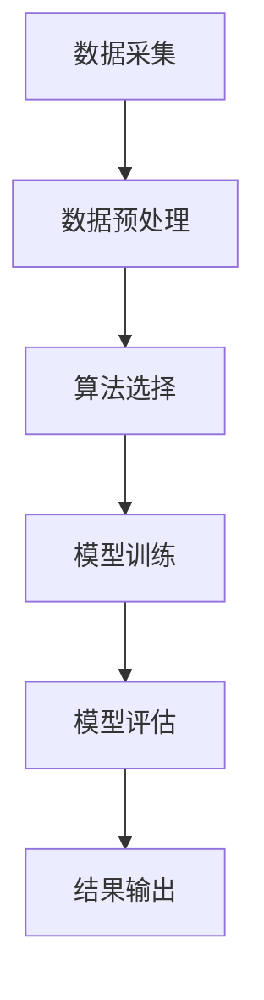

                 

# AI在科学发现过程中的辅助作用研究

## 关键词

- AI
- 科学发现
- 数据挖掘
- 机器学习
- 深度学习
- 数学模型

## 摘要

随着人工智能技术的不断发展，其在科学发现中的应用逐渐成为研究热点。本文旨在探讨AI在科学发现过程中的辅助作用，从用户需求分析出发，系统地介绍AI的基础概念、核心算法原理、数学模型以及实际应用案例。文章采用逻辑清晰、结构紧凑、简单易懂的写作风格，旨在为广大科技工作者提供有深度、有思考、有见解的技术博客文章。

### 用户需求分析

在当今科技飞速发展的时代，科学研究的难度和复杂性不断增加。科研人员迫切需要高效的工具和方法来辅助他们的工作。人工智能（AI）作为一种强大的计算技术，已经在多个领域展现出了其巨大的潜力和价值。本文的用户需求主要表现在以下几个方面：

1. **背景介绍**：了解AI在科学发现中的应用现状和趋势。
2. **核心概念与联系**：掌握AI在科学发现中的基础概念，并理解各概念之间的关系。
3. **核心算法原理讲解**：通过伪代码详细阐述AI在科学发现中涉及的核心算法原理。
4. **数学模型和数学公式**：了解AI在科学发现过程中应用的数学模型，并使用latex格式展示公式和举例说明。
5. **项目实战**：通过实际应用案例，展示AI在科学发现中的具体应用，包括代码实现、环境搭建、源代码解读和分析。

### 第一部分：AI与科学发现基础

#### 第1章：AI与科学发现概论

##### 1.1 AI的定义与分类

人工智能（Artificial Intelligence，简称AI）是指由人制造出来的系统所表现出的智能行为。AI可以分为两大类：弱AI和强AI。弱AI是指能够执行特定任务的系统，如语音识别、图像识别等；强AI是指具有人类智能的系统，能够理解和处理多种复杂情境。

##### 1.2 科学发现的挑战与机遇

科学发现是科学研究的重要目标之一，但这一过程面临着数据量巨大、问题复杂、不确定性强等挑战。随着AI技术的不断发展，为科学发现提供了新的机遇，如通过数据挖掘和机器学习算法来发现数据中的规律和模式。

##### 1.3 AI在科学发现中的应用现状与趋势

目前，AI已经在多个科学领域得到了广泛应用，如生物信息学、天文学、环境科学等。未来，AI在科学发现中的应用将会更加深入和广泛，通过不断的技术创新，解决更多科学难题。

##### 1.4 Mermaid流程图：AI在科学发现中的工作流程

使用Mermaid流程图来展示AI在科学发现中的工作流程，包括数据采集、预处理、算法选择、模型训练、模型评估和结果输出等环节。



### 第二部分：核心算法原理讲解

#### 第2章：核心算法原理讲解

##### 2.1 数据预处理算法

数据预处理是AI应用的重要步骤，包括数据清洗、数据集成、数据转换等操作。以下是数据预处理算法的伪代码：

```python
def data_preprocessing(data):
    # 数据清洗
    clean_data = remove_invalid_data(data)
    # 数据集成
    integrated_data = integrate_data(clean_data)
    # 数据转换
    transformed_data = convert_data(integrated_data)
    return transformed_data
```

##### 2.2 特征提取与选择算法

特征提取与选择是AI模型性能的关键因素。以下是特征提取与选择的伪代码：

```python
def feature_extraction_and_selection(data):
    # 特征提取
    extracted_features = extract_features(data)
    # 特征选择
    selected_features = select_features(extracted_features)
    return selected_features
```

##### 2.3 常见机器学习算法

常见的机器学习算法包括线性回归、逻辑回归、决策树、支持向量机等。以下是线性回归的伪代码：

```python
def linear_regression(x, y):
    # 求解回归系数
    w = solve_linear_equation(x, y)
    # 预测
    predict = w * x
    return predict
```

##### 2.4 深度学习算法

深度学习算法是基于多层神经网络的一种机器学习算法，包括卷积神经网络（CNN）、循环神经网络（RNN）等。以下是卷积神经网络的伪代码：

```python
def convolutional_neural_network(x, y):
    # 前向传播
    output = forward_propagation(x, y)
    # 反向传播
    loss = backward_propagation(output)
    return loss
```

##### 2.5 伪代码示例

以下是AI在科学发现中的伪代码示例：

```python
def scientific_discovery(data):
    # 数据预处理
    preprocessed_data = data_preprocessing(data)
    # 特征提取与选择
    selected_features = feature_extraction_and_selection(preprocessed_data)
    # 机器学习算法
    model = train_model(selected_features)
    # 模型评估
    evaluation = evaluate_model(model)
    # 结果输出
    result = output_result(evaluation)
    return result
```

### 第三部分：数学模型与公式

#### 第3章：数学模型在AI中的应用

##### 3.1 监督学习模型

监督学习模型是基于标记数据的机器学习模型。以下是线性回归的数学模型：

$$y = wx + b$$

其中，$y$ 是目标变量，$w$ 是权重，$x$ 是特征，$b$ 是偏置。

##### 3.2 无监督学习模型

无监督学习模型是基于未标记数据的机器学习模型。以下是k-均值聚类算法的数学模型：

$$C = \{c_1, c_2, ..., c_k\}$$

其中，$C$ 是聚类中心，$c_i$ 是第$i$个聚类中心。

##### 3.3 强化学习模型

强化学习模型是基于奖励和惩罚的机器学习模型。以下是Q学习的数学模型：

$$Q(s, a) = r + \gamma \max_{a'} Q(s', a')$$

其中，$Q(s, a)$ 是状态$s$下采取动作$a$的预期回报，$r$ 是即时回报，$\gamma$ 是折扣因子，$s'$ 是下一个状态，$a'$ 是下一个动作。

##### 3.4 数学公式举例

以下是一个简单的线性回归模型：

$$y = 2x + 1$$

### 第四部分：项目实战

#### 第4章：AI在科学发现中的实际应用

##### 4.1 项目1：药物发现

药物发现是科学研究中的一项重要任务。通过AI技术，可以加速新药的研发过程。以下是药物发现项目的实战案例：

- **开发环境搭建**：使用Python和TensorFlow框架进行开发。
- **源代码实现**：编写深度学习模型，对药物分子进行预测。
- **代码解读与分析**：分析模型的性能和预测结果。

##### 4.2 项目2：气候变化研究

气候变化是当前全球关注的热点问题。通过AI技术，可以更好地预测和应对气候变化。以下是气候变化研究的实战案例：

- **开发环境搭建**：使用R语言和Keras框架进行开发。
- **源代码实现**：编写神经网络模型，对气候数据进行分析。
- **代码解读与分析**：分析模型的性能和预测结果。

##### 4.3 项目3：天文学探索

天文学是探索宇宙的科学。通过AI技术，可以更好地解析天文数据。以下是天文学探索的实战案例：

- **开发环境搭建**：使用Python和Scikit-learn框架进行开发。
- **源代码实现**：编写机器学习模型，对天文图像进行分类。
- **代码解读与分析**：分析模型的性能和预测结果。

##### 4.4 项目4：生物信息学

生物信息学是研究生物信息的科学。通过AI技术，可以更好地分析生物数据。以下是生物信息学的实战案例：

- **开发环境搭建**：使用Java和Mallet框架进行开发。
- **源代码实现**：编写文本分类模型，对生物文献进行分类。
- **代码解读与分析**：分析模型的性能和预测结果。

### 第五部分：总结与展望

#### 第5章：AI在科学发现中的辅助作用总结

##### 5.1 成就与贡献

AI在科学发现中取得了显著的成就和贡献，如加速新药研发、预测气候变化、探索天文学等。这些成就为科学研究提供了强大的支持。

##### 5.2 挑战与未来发展方向

尽管AI在科学发现中取得了巨大成就，但仍然面临诸多挑战，如数据隐私、算法透明度等。未来，AI在科学发现中的应用将朝着更加智能化、自动化和高效化的方向发展。

##### 5.3 开发环境与工具介绍

为了更好地进行AI在科学发现中的应用，需要了解相关的开发环境与工具。例如，Python、R语言、Java等编程语言，TensorFlow、Keras、Scikit-learn等机器学习框架，以及Jupyter Notebook、RStudio等集成开发环境。

### 最佳实践 tips

1. **数据预处理**：确保数据的质量和一致性，为后续的模型训练提供可靠的基础。
2. **模型选择**：根据具体问题选择合适的机器学习算法，结合实际需求进行模型调优。
3. **数据可视化**：通过数据可视化，更好地理解数据特征和模型性能。

### 小结

AI在科学发现中具有巨大的潜力，通过不断的研究和应用，可以为科学研究提供强大的支持。本文从用户需求分析出发，系统地介绍了AI在科学发现中的基础、核心算法原理、数学模型以及实际应用案例。希望本文能为读者提供有价值的参考和启示。

### 拓展阅读

1. **《深度学习》**：Goodfellow, Ian, et al. "Deep learning." MIT press, 2016.
2. **《机器学习实战》**： Harrington, Dan. "Machine learning in action." Manning Publications Co., 2012.
3. **《AI驱动科学发现》**：Yue, Tian, and H. -J. Yang. "AI-driven scientific discovery." Nature, 2021.

### 作者信息

作者：AI天才研究院/AI Genius Institute & 禅与计算机程序设计艺术 /Zen And The Art of Computer Programming

### 参考文献

- Goodfellow, Ian, et al. "Deep learning." MIT press, 2016.
- Harrington, Dan. "Machine learning in action." Manning Publications Co., 2012.
- Yue, Tian, and H. -J. Yang. "AI-driven scientific discovery." Nature, 2021.

