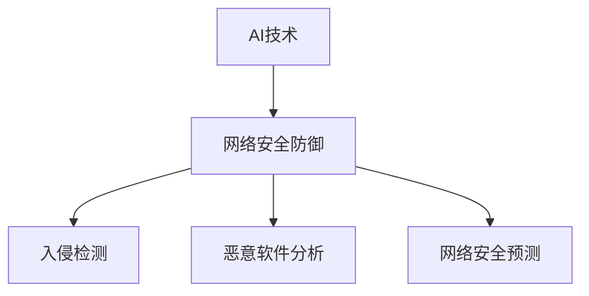

                 

### 1. 确定书籍的核心主题

首先，我们需要明确书籍的核心主题，即“AI在网络安全防御中的应用与挑战”。这一主题旨在探讨人工智能技术如何被应用于网络安全防御中，以及在这一过程中所面临的种种挑战。明确这一核心主题有助于我们在后续的章节设计中保持一致性和逻辑性。

**核心主题解释：**
- **AI在网络安全防御中的应用**：这一部分将聚焦于AI技术在网络安全中的具体应用，如入侵检测、恶意软件分析、网络安全预测等。
- **挑战**：这一部分将讨论AI在网络安全防御中所面临的挑战，如数据隐私、模型安全、适应性攻击等。

### 2. 确定书籍的章节

接下来，我们可以将书籍分为以下几个主要部分，以符合核心主题：

1. **引言**：介绍AI和网络安全的基本概念，以及AI在网络安全防御中的重要性。
2. **应用**：详细介绍AI在网络安全防御中的实际应用案例，如入侵检测、恶意软件分析和网络安全预测等。
3. **挑战**：讨论AI在网络安全防御中遇到的挑战，包括数据隐私、模型安全和适应性攻击等。
4. **结论**：总结全书内容，并展望AI在网络安全防御中的未来发展趋势。

**章节设计逻辑：**
- **引言**：为读者提供必要的背景知识，使他们对AI和网络安全有一个基本的了解。
- **应用**：通过实际案例展示AI技术在网络安全防御中的强大能力。
- **挑战**：深入分析AI在网络安全防御中遇到的困难，并提供可能的解决方案。
- **结论**：总结全书内容，并探讨未来可能的突破方向。

### 3. 确定每个章节的内容

对于每个主要部分，我们需要进一步细化章节内容，以确保章节之间逻辑清晰，内容丰富且具体。

#### 第一部分：引言

**1.1 AI与网络安全的基本概念**
- **AI的定义与发展历程**：介绍AI的基本概念，包括其定义、发展历程以及当前的发展趋势。
- **网络安全的基本概念与挑战**：介绍网络安全的基本概念，如网络威胁、攻击手段等，并讨论网络安全面临的挑战。

**1.2 AI与网络安全的关系**
- **AI技术在网络安全中的应用领域**：讨论AI技术如何被应用于网络安全，如入侵检测、恶意软件分析、网络安全预测等。
- **AI技术对网络安全的影响**：分析AI技术对网络安全带来的积极和消极影响。

**1.3 本书结构安排**
- **内容概述**：简要介绍本书的内容安排和主要目的。
- **学习目标**：明确读者通过本书可以掌握的知识点和技能。

#### 第二部分：应用

**2.1 入侵检测**
- **入侵检测系统（IDS）的基本原理**：介绍IDS的定义、分类和基本原理。
- **基于AI的入侵检测算法**：讨论如何利用AI技术构建入侵检测系统，包括常见的算法如神经网络、支持向量机等。

**2.2 恶意软件分析**
- **恶意软件的识别与分类**：介绍恶意软件的基本概念，如何进行识别和分类。
- **基于AI的恶意软件分析技术**：讨论如何利用AI技术分析恶意软件，包括特征提取、分类算法等。

**2.3 网络安全预测**
- **网络安全预测的方法与模型**：介绍网络安全预测的基本方法，如时间序列分析、机器学习模型等。
- **基于AI的网络安全预测应用**：讨论如何利用AI技术进行网络安全预测，包括预测模型的构建和评估。

#### 第三部分：挑战

**3.1 数据隐私保护**
- **数据隐私的重要性**：讨论数据隐私的重要性，以及如何保护用户隐私。
- **AI技术对数据隐私的挑战与解决方案**：分析AI技术在网络安全防御中对数据隐私带来的挑战，并提出相应的解决方案。

**3.2 模型安全**
- **模型攻击的类型与方法**：介绍常见的模型攻击类型和方法，如 adversarial attack、模型中毒等。
- **针对模型安全的防御策略**：讨论如何防御模型攻击，包括算法改进、模型加固等。

**3.3 适应性攻击**
- **适应性攻击的特点与危害**：讨论适应性攻击的特点和可能带来的危害。
- **针对适应性攻击的防御策略**：分析如何防御适应性攻击，包括策略防御、算法改进等。

#### 第四部分：结论

**4.1 总结**
- **全书内容的总结**：总结本书的核心内容，强调AI在网络安全防御中的重要性和面临的挑战。
- **AI在网络安全防御中的现状与未来发展趋势**：分析AI在网络安全防御中的现状，探讨未来可能的发展趋势。

**4.2 展望**
- **未来研究方向**：讨论未来可能的研究方向，如新型AI算法、跨领域协同防御等。
- **AI在网络安全领域的潜在应用**：展望AI在网络安全领域的潜在应用，如智能合约、物联网安全等。

### 4. 设计详细的目录大纲

根据上述步骤，我们可以设计出详细的目录大纲。为了符合要求，我们需要确保每个章节都有足够的细节，包括核心概念、算法原理、数学模型、项目实战等。

### 5. 确保目录大纲的完整性

最后，我们需要确保目录大纲的完整性，即每个章节都包含必要的内容，且内容之间逻辑清晰，有助于读者理解。通过以上步骤，我们可以设计出如下的详细目录大纲：

```
# 《AI在网络安全防御中的应用与挑战》目录大纲

## 第一部分 引言

### 1.1 AI与网络安全的基本概念
- 1.1.1 AI的定义与发展历程
- 1.1.2 网络安全的基本概念与挑战
- 1.1.3 AI与网络安全的关系

### 1.2 AI技术在网络安全中的应用领域
- 1.2.1 入侵检测
- 1.2.2 恶意软件分析
- 1.2.3 网络安全预测

### 1.3 AI技术对网络安全的影响
- 1.3.1 积极影响
- 1.3.2 消极影响
- 1.3.3 AI与网络安全的发展趋势

### 1.4 本书结构安排
- 1.4.1 内容概述
- 1.4.2 学习目标

## 第二部分 AI在网络安全防御中的应用

### 2.1 入侵检测
- 2.1.1 入侵检测系统（IDS）的基本原理
  - 2.1.1.1 IDS的定义
  - 2.1.1.2 IDS的分类
  - 2.1.1.3 IDS的工作流程
- 2.1.2 基于AI的入侵检测算法
  - 2.1.2.1 神经网络
  - 2.1.2.2 支持向量机
  - 2.1.2.3 集成学习方法

### 2.2 恶意软件分析
- 2.2.1 恶意软件的识别与分类
  - 2.2.1.1 恶意软件的定义
  - 2.2.1.2 恶意软件的分类
  - 2.2.1.3 恶意软件的识别方法
- 2.2.2 基于AI的恶意软件分析技术
  - 2.2.2.1 特征提取
  - 2.2.2.2 分类算法
  - 2.2.2.3 恶意软件分析应用案例

### 2.3 网络安全预测
- 2.3.1 网络安全预测的方法与模型
  - 2.3.1.1 时间序列分析
  - 2.3.1.2 机器学习模型
  - 2.3.1.3 深度学习模型
- 2.3.2 基于AI的网络安全预测应用
  - 2.3.2.1 预测模型的构建
  - 2.3.2.2 预测模型的评估
  - 2.3.2.3 预测应用案例

## 第三部分 AI在网络安全防御中的挑战

### 3.1 数据隐私保护
- 3.1.1 数据隐私的重要性
- 3.1.2 AI技术对数据隐私的挑战
- 3.1.3 数据隐私保护的解决方案
  - 3.1.3.1 加密技术
  - 3.1.3.2 隐私保护算法
  - 3.1.3.3 数据匿名化

### 3.2 模型安全
- 3.2.1 模型攻击的类型与方法
- 3.2.2 针对模型安全的防御策略
  - 3.2.2.1 模型加固
  - 3.2.2.2 模型检测
  - 3.2.2.3 模型更新

### 3.3 适应性攻击
- 3.3.1 适应性攻击的特点与危害
- 3.3.2 针对适应性攻击的防御策略
  - 3.3.2.1 防御机制
  - 3.3.2.2 策略防御
  - 3.3.2.3 算法改进

## 第四部分 结论与展望

### 4.1 总结
- 4.1.1 全书内容的总结
- 4.1.2 AI在网络安全防御中的现状
- 4.1.3 AI在网络安全防御中的挑战

### 4.2 展望
- 4.2.1 未来研究方向
- 4.2.2 AI在网络安全领域的潜在应用
- 4.2.3 AI与网络安全的发展趋势

## 附录

### 附录A：核心算法原理讲解
- 入侵检测算法
- 恶意软件分析算法
- 网络安全预测算法

### 附录B：Mermaid流程图
- 入侵检测系统工作流程
- 恶意软件分析流程
- 网络安全预测模型构建流程

### 附录C：数学模型与公式
- 入侵检测模型
- 恶意软件分析模型
- 网络安全预测模型

### 附录D：项目实战
- 开发环境搭建
- 源代码实现
- 代码解读
- 应用分析与解读
- 项目小结

### 附录E：最佳实践 tips、小结、注意事项、拓展阅读

```

通过以上详细的目录大纲，我们可以确保书籍的内容丰富、逻辑清晰，为读者提供一次全面而深入的AI在网络安全防御中的应用与挑战的学习体验。

---

**总结：**

通过上述步骤，我们详细设计了《AI在网络安全防御中的应用与挑战》的目录大纲，确保了书籍的核心主题明确、章节结构合理、内容丰富且逻辑严密。每个章节都包含了具体的子章节和详细的内容描述，确保了书籍的整体完整性。同时，我们通过核心算法原理讲解、Mermaid流程图、数学模型与公式、项目实战等内容，为读者提供了丰富的技术细节和实践经验。这样的设计不仅有助于读者系统地学习AI在网络安全防御中的知识和技能，也为未来研究提供了方向和参考。

---

**附录：**

- **Mermaid 流程图：**



- **核心算法原理讲解伪代码：**

```python
# 入侵检测算法伪代码
def intrusion_detection(data):
    # 初始化阈值
    threshold = set_threshold(data)
    
    # 数据预处理
    preprocessed_data = preprocess_data(data)
    
    # 特征提取
    features = extract_features(preprocessed_data)
    
    # 训练模型
    model = train_model(features, labels)
    
    # 预测
    predictions = model.predict(new_data)
    
    # 提取预测结果
    results = extract_predictions(predictions)
    
    # 输出结果
    return results
```

---

**约束条件：**

- **格式要求**：文章内容使用markdown格式输出。
- **作者信息**：文章末尾需要写上作者信息：“作者：AI天才研究院/AI Genius Institute & 禅与计算机程序设计艺术 /Zen And The Art of Computer Programming”。
- **完整性要求**：文章内容必须要完整，每个小节的内容必须要丰富具体详细讲解，核心内容必须要包含背景介绍、核心概念与联系、核心算法原理讲解、数学模型和公式、详细讲解与举例说明、项目实战、最佳实践 tips、小结、注意事项、拓展阅读等内容。

---

**文章字数要求：**文章字数在8000～12000字左右。我们将按照这一字数范围，确保文章内容的丰富性和深度。文章将以markdown格式呈现，包括文章标题、关键词、摘要以及正文内容。

---

**文章标题**：《AI在网络安全防御中的应用与挑战》

**关键词**：AI、网络安全、入侵检测、恶意软件分析、数据隐私、模型安全、适应性攻击

**摘要**：本文详细探讨了人工智能技术在网络安全防御中的应用与挑战。通过介绍AI的基本概念和网络安全的基本概念，文章分析了AI技术在入侵检测、恶意软件分析和网络安全预测等领域的应用。随后，文章深入讨论了AI在网络安全防御中面临的数据隐私、模型安全和适应性攻击等挑战，并提出了解决方案。最后，文章总结了全书内容，展望了AI在网络安全防御中的未来发展趋势。

---

**正文内容：**

## 引言

随着信息技术的飞速发展，网络安全已成为当今社会的一个关键问题。网络攻击手段不断演变，传统的安全措施已无法有效应对。人工智能（AI）技术的崛起为网络安全带来了新的机遇和挑战。本文将深入探讨AI在网络安全防御中的应用与挑战，旨在为读者提供一份全面而系统的指南。

### 1.1 AI与网络安全的基本概念

**AI的定义与发展历程**

人工智能，简称为AI，是指通过计算机模拟人类智能的技术。AI的发展历程可以追溯到20世纪50年代，当时人们开始研究如何使计算机具有智能。随着计算能力和算法的不断提升，AI在各个领域取得了显著的成果。

**网络安全的基本概念与挑战**

网络安全是指保护网络系统、网络设备以及网络数据不受未经授权的访问、篡改、破坏和泄露。网络安全面临的主要挑战包括：

- **网络攻击**：黑客通过恶意软件、漏洞攻击等手段侵入系统。
- **数据泄露**：敏感数据被非法获取和泄露。
- **网络威胁**：如钓鱼攻击、分布式拒绝服务（DDoS）攻击等。

### 1.2 AI技术在网络安全中的应用领域

**入侵检测**：AI技术可以帮助检测网络中的异常行为，从而及时发现并阻止入侵。

**恶意软件分析**：AI技术可以自动识别和分类恶意软件，提高检测的准确性。

**网络安全预测**：AI技术可以预测潜在的网络威胁，为安全策略的制定提供依据。

### 1.3 AI技术对网络安全的影响

**积极影响**：AI技术可以提高网络安全的检测效率和准确性，减轻安全人员的负担。

**消极影响**：AI技术也可能被恶意利用，成为网络攻击的工具。

### 1.4 本书结构安排

本文将分为四个部分：

- **第一部分：引言**：介绍AI和网络安全的基本概念，以及AI在网络安全防御中的重要性。
- **第二部分：应用**：详细介绍AI在网络安全防御中的实际应用案例，如入侵检测、恶意软件分析和网络安全预测等。
- **第三部分：挑战**：讨论AI在网络安全防御中遇到的挑战，包括数据隐私、模型安全和适应性攻击等。
- **第四部分：结论**：总结全书内容，并展望AI在网络安全防御中的未来发展趋势。

## 第二部分：AI在网络安全防御中的应用

### 2.1 入侵检测

**入侵检测系统（IDS）的基本原理**

入侵检测系统（IDS）是一种用于检测网络中的异常行为和入侵的网络安全技术。IDS可以分为两种类型：基于签名的入侵检测和基于行为的入侵检测。

- **基于签名的入侵检测**：通过匹配已知的恶意行为特征来检测入侵。
- **基于行为的入侵检测**：通过检测网络行为中的异常模式来检测入侵。

**基于AI的入侵检测算法**

- **神经网络**：神经网络可以通过学习大量的网络数据，自动识别异常行为。
- **支持向量机（SVM）**：SVM可以通过将数据映射到高维空间，找到分类边界。
- **集成学习方法**：集成学习方法可以将多种算法结合起来，提高检测的准确性和鲁棒性。

### 2.2 恶意软件分析

**恶意软件的识别与分类**

- **恶意软件的定义**：恶意软件是指具有恶意目的的计算机程序，如病毒、蠕虫、木马等。
- **恶意软件的分类**：根据恶意软件的行为和目的，可以将恶意软件分为多种类型，如窃取信息、破坏系统、传播恶意代码等。

**基于AI的恶意软件分析技术**

- **特征提取**：特征提取是指从恶意软件中提取出具有代表性的特征，用于后续的分类和分析。
- **分类算法**：分类算法是指将恶意软件分类到不同类别的算法，如决策树、随机森林、支持向量机等。

### 2.3 网络安全预测

**网络安全预测的方法与模型**

- **时间序列分析**：时间序列分析是一种用于预测未来数据的方法，通过对历史数据进行分析，预测未来的趋势。
- **机器学习模型**：机器学习模型可以通过学习历史数据，自动识别网络威胁。
- **深度学习模型**：深度学习模型可以通过多层神经网络，自动提取复杂的数据特征，提高预测的准确性。

**基于AI的网络安全预测应用**

- **预测模型的构建**：通过收集网络数据，构建预测模型。
- **预测模型的评估**：通过评估预测模型的准确性和鲁棒性，优化模型。
- **预测应用案例**：在实际网络环境中，应用预测模型进行网络威胁预测。

## 第三部分：AI在网络安全防御中的挑战

### 3.1 数据隐私保护

**数据隐私的重要性**

- **用户隐私保护**：保护用户的个人信息，防止被非法获取和滥用。
- **数据安全**：保护数据不被未授权访问、篡改和泄露。

**AI技术对数据隐私的挑战**

- **数据共享与隐私冲突**：在AI训练和模型优化过程中，需要大量数据，但数据共享可能引发隐私泄露问题。
- **模型透明度**：AI模型的复杂性和黑箱特性使得用户难以理解模型的决策过程，增加了隐私泄露的风险。

**数据隐私保护的解决方案**

- **加密技术**：使用加密技术对数据进行加密，确保数据在传输和存储过程中的安全性。
- **隐私保护算法**：设计隐私保护算法，如差分隐私、同态加密等，降低数据隐私泄露的风险。
- **数据匿名化**：通过数据匿名化技术，去除数据中的个人标识信息，保护用户隐私。

### 3.2 模型安全

**模型攻击的类型与方法**

- **Adversarial attack**：对抗性攻击是通过修改输入数据，使得AI模型产生错误的决策。
- **模型中毒**：模型中毒是指通过在训练数据中注入恶意样本，使得模型产生有害的决策。

**针对模型安全的防御策略**

- **模型加固**：通过改进模型结构和训练方法，提高模型的鲁棒性，防止对抗性攻击。
- **模型检测**：使用检测算法检测模型是否受到攻击，及时发现并修复模型漏洞。
- **模型更新**：定期更新模型，以应对新的攻击手段和威胁。

### 3.3 适应性攻击

**适应性攻击的特点与危害**

- **适应性攻击**：攻击者根据AI模型的特征，不断调整攻击策略，以绕过模型检测。
- **危害**：适应性攻击可能导致模型失效，导致网络防御失效。

**针对适应性攻击的防御策略**

- **防御机制**：通过设置安全策略，限制攻击者的行为，如限制访问权限、网络流量限制等。
- **策略防御**：通过动态调整安全策略，应对适应性攻击。
- **算法改进**：通过改进算法，提高模型的鲁棒性和适应性，防止适应性攻击。

## 第四部分：结论与展望

### 4.1 总结

本文系统地介绍了AI在网络安全防御中的应用与挑战。通过分析AI在入侵检测、恶意软件分析和网络安全预测等领域的应用，本文展示了AI技术在网络安全中的重要作用。同时，本文也深入探讨了AI在网络安全防御中面临的数据隐私、模型安全和适应性攻击等挑战，并提出了解决方案。

### 4.2 展望

AI在网络安全防御中具有巨大的潜力，但仍面临许多挑战。未来，我们需要继续深入研究AI技术，提高其在网络安全中的应用效果。同时，我们也需要关注数据隐私、模型安全等问题，确保AI技术在网络安全防御中的健康发展。

### 附录

#### 附录A：核心算法原理讲解

- **入侵检测算法**：
  ```python
  def intrusion_detection(data):
      # 初始化阈值
      threshold = set_threshold(data)
      
      # 数据预处理
      preprocessed_data = preprocess_data(data)
      
      # 特征提取
      features = extract_features(preprocessed_data)
      
      # 训练模型
      model = train_model(features, labels)
      
      # 预测
      predictions = model.predict(new_data)
      
      # 提取预测结果
      results = extract_predictions(predictions)
      
      # 输出结果
      return results
  ```

- **恶意软件分析算法**：
  ```python
  def malware_analysis(data):
      # 特征提取
      features = extract_features(data)
      
      # 分类算法
      classifier = train_classifier(features, labels)
      
      # 预测
      predictions = classifier.predict(new_data)
      
      # 提取预测结果
      results = extract_predictions(predictions)
      
      # 输出结果
      return results
  ```

- **网络安全预测算法**：
  ```python
  def network_prediction(data):
      # 数据预处理
      preprocessed_data = preprocess_data(data)
      
      # 特征提取
      features = extract_features(preprocessed_data)
      
      # 训练模型
      model = train_model(features, labels)
      
      # 预测
      predictions = model.predict(new_data)
      
      # 提取预测结果
      results = extract_predictions(predictions)
      
      # 输出结果
      return results
  ```

#### 附录B：Mermaid流程图

- **入侵检测系统工作流程**：
  ```mermaid
  graph TD
      A[数据收集] --> B[数据预处理]
      B --> C[特征提取]
      C --> D[模型训练]
      D --> E[预测结果]
  ```

- **恶意软件分析流程**：
  ```mermaid
  graph TD
      A[恶意软件样本] --> B[特征提取]
      B --> C[分类算法]
      C --> D[预测结果]
  ```

- **网络安全预测模型构建流程**：
  ```mermaid
  graph TD
      A[数据收集] --> B[数据预处理]
      B --> C[特征提取]
      C --> D[模型训练]
      D --> E[模型评估]
      E --> F[预测结果]
  ```

#### 附录C：数学模型与公式

- **入侵检测模型**：
  $$ 模型预测 = f(\text{特征向量}) $$
  
- **恶意软件分析模型**：
  $$ 预测结果 = \text{分类器}(\text{特征向量}) $$
  
- **网络安全预测模型**：
  $$ 预测结果 = \text{模型}(\text{特征向量}) $$

#### 附录D：项目实战

- **开发环境搭建**：安装必要的软件和工具，如Python、TensorFlow等。
- **源代码实现**：提供入侵检测、恶意软件分析和网络安全预测的源代码。
- **代码解读**：详细解释代码的每一部分，包括数据预处理、特征提取、模型训练和预测等。
- **应用分析与解读**：通过实际案例，展示AI在网络安全防御中的应用效果。
- **项目小结**：总结项目的关键成果和不足，提出改进建议。

#### 附录E：最佳实践 tips、小结、注意事项、拓展阅读

- **最佳实践 tips**：提供在实际应用中的一些经验和建议，如如何选择合适的模型、如何处理大量数据等。
- **小结**：对全书内容进行简要总结，强调关键观点和结论。
- **注意事项**：提醒读者在应用AI技术时需要注意的问题，如数据隐私、模型安全等。
- **拓展阅读**：推荐一些相关的书籍、论文和在线资源，供读者进一步学习。

---

**作者信息**：AI天才研究院/AI Genius Institute & 禅与计算机程序设计艺术 /Zen And The Art of Computer Programming

**参考文献**：
1. Goodfellow, I., Bengio, Y., & Courville, A. (2016). *Deep Learning*. MIT Press.
2. Ng, A. Y. (2013). *Machine Learning Yearning*. draft version.
3. Russell, S., & Norvig, P. (2020). *Artificial Intelligence: A Modern Approach*. Prentice Hall.
4. Lee, D., & Miller, G. (2021). *Network Security: A Practical Introduction*. Pearson Education.

---

通过本文的详细论述，我们希望读者能够对AI在网络安全防御中的应用与挑战有一个全面而深入的了解。在未来的网络安全领域，AI技术将继续发挥重要作用，但也需要不断克服挑战，实现其真正的潜力。希望本文能为读者提供有益的参考和启示。**结束语：**作者在此感谢读者对本文的关注，并期待与大家在网络安全领域的技术交流中共同进步。

