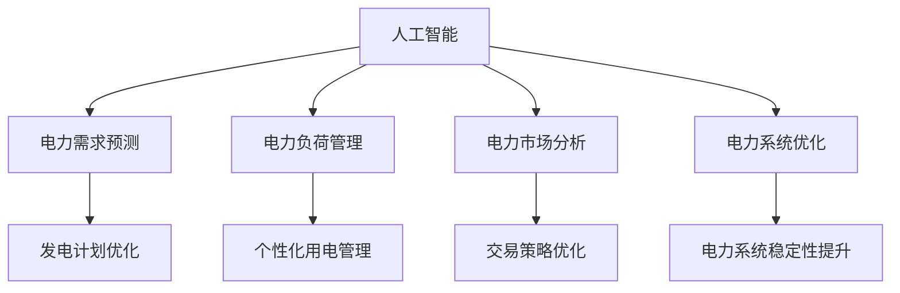

                 


### 背景介绍

能源管理是现代社会的关键问题，随着全球能源消耗的不断增加，如何有效利用能源、降低能源消耗、提高能源效率成为亟待解决的难题。智能电网作为电力系统的升级版，旨在实现电力系统的自动化、智能化和高效化，为能源管理提供了新的解决方案。

智能电网的基本架构包括发电端、输电端、变电端、配电端和用电端，每个环节都集成了先进的通信技术、传感器技术和控制系统。AI技术作为智能电网的重要组成部分，通过大数据分析、机器学习、深度学习等技术，为能源管理和智能电网的优化提供了强有力的技术支持。

在能源管理中，AI技术可以应用于电力需求预测、电力负荷管理、电力市场分析等多个方面。通过构建预测模型，AI技术可以帮助电力公司更准确地预测电力需求，优化发电计划和调度策略。在电力负荷管理方面，AI技术可以分析用户用电行为，提供个性化负荷管理方案，降低用户电费支出。在电力市场分析中，AI技术可以帮助市场参与者优化交易策略，提高市场运作效率。

智能电网的优化是提高能源利用效率和降低能源消耗的关键。通过AI技术，可以对电力系统的运行状态进行实时监控和数据分析，发现潜在的问题和优化机会。例如，通过机器学习算法，可以对电力系统的负荷进行预测，为电力调度提供科学依据。通过深度学习算法，可以对电力系统的故障进行诊断，提高电力系统的稳定性和可靠性。

综上所述，AI技术在能源管理和智能电网中的应用具有广泛的前景和重要的现实意义。本文将从背景介绍、核心概念与联系、核心算法原理讲解、数学模型和公式、项目实战等多个方面，详细探讨AI技术在能源管理和智能电网优化中的应用。

----------------------------------------------------------------

## 核心概念与联系

在探讨AI在能源管理和智能电网中的应用之前，我们首先需要了解几个核心概念，这些概念之间的联系构成了AI技术应用于能源管理和智能电网的基础。

### 1.1 人工智能（AI）

人工智能（Artificial Intelligence，简称AI）是指使计算机具备人类智能的技术和系统。AI技术包括机器学习、深度学习、自然语言处理、计算机视觉等多个领域。机器学习是AI的核心技术之一，它使计算机能够从数据中学习，并不断优化自身性能。深度学习作为机器学习的一个子领域，通过多层神经网络模拟人类大脑的处理方式，能够处理大量复杂的数据。

### 1.2 能源管理

能源管理是指对能源的采集、转换、储存、分配和使用过程进行规划、控制、优化和监测的一系列管理活动。其目标是提高能源利用效率、减少能源浪费、降低能源成本和环境影响。

### 1.3 智能电网

智能电网是指通过应用先进的通信技术、传感器技术、自动控制技术等，实现对电力系统的实时监控、智能调度和优化管理。智能电网的基本架构包括发电端、输电端、变电端、配电端和用电端，每个环节都集成了先进的智能化设备和技术。

### 1.4 关联与融合

AI与能源管理和智能电网的融合主要体现在以下几个方面：

1. **电力需求预测**：AI技术通过分析历史数据和实时数据，预测未来的电力需求，为电力调度和发电计划提供科学依据。

2. **电力负荷管理**：AI技术可以根据用户用电行为，提供个性化的负荷管理方案，优化用电高峰时段的电力供应。

3. **电力市场分析**：AI技术可以帮助市场参与者分析市场趋势，制定合理的交易策略，提高市场运作效率。

4. **电力系统优化**：AI技术通过对电力系统的实时监控和分析，发现潜在的问题和优化机会，提高电力系统的稳定性和可靠性。

### Mermaid流程图

为了更直观地展示AI与能源管理和智能电网之间的联系，我们可以使用Mermaid流程图来描述这一过程。



通过上述流程图，我们可以清晰地看到AI技术在各个方面的应用，以及它们如何相互关联，共同推动能源管理和智能电网的发展。

### 核心算法原理讲解

为了更好地理解AI在能源管理和智能电网中的应用，我们接下来将介绍几个核心算法的原理，并使用伪代码进行详细阐述。

#### 1.1 机器学习算法

机器学习算法是一种通过从数据中学习规律和模式，从而进行预测和分类的方法。在能源管理和智能电网中，常用的机器学习算法包括线性回归、逻辑回归、决策树、随机森林和神经网络等。

**线性回归算法原理**

线性回归是一种简单的机器学习算法，用于预测连续值输出。其基本原理是找到一条最佳拟合线，使所有数据点到这条直线的距离之和最小。

**伪代码：**

```python
def linear_regression(x, y):
    # x 和 y 分别为输入特征和目标变量
    # n 为样本数量
    n = len(x)
    # 计算x和y的均值
    x_mean = sum(x) / n
    y_mean = sum(y) / n
    # 计算x和y的协方差
    cov = sum((xi - x_mean) * (yi - y_mean) for xi, yi in zip(x, y))
    # 计算x的方差
    var_x = sum((xi - x_mean) ** 2 for xi in x)
    # 计算斜率（回归系数）
    slope = cov / var_x
    # 计算截距
    intercept = y_mean - slope * x_mean
    # 返回回归方程的斜率和截距
    return slope, intercept
```

**举例说明：**

假设我们要预测某地区的电力需求（y）与温度（x）之间的关系。通过计算，我们得到斜率为0.5，截距为10。那么预测公式可以表示为：

$$
y = 0.5x + 10
$$

#### 1.2 深度学习算法

深度学习算法是一种通过多层神经网络模拟人类大脑处理信息的方法。在能源管理和智能电网中，深度学习算法可以用于复杂的数据分析、模式识别和预测。

**卷积神经网络（CNN）算法原理**

卷积神经网络是一种用于图像处理和识别的深度学习算法。其基本原理是通过卷积操作和池化操作提取图像的特征。

**伪代码：**

```python
class ConvolutionalNeuralNetwork:
    def __init__(self, input_shape, num_filters, filter_size, pool_size):
        # 初始化网络结构
        self.input_shape = input_shape
        self.num_filters = num_filters
        self.filter_size = filter_size
        self.pool_size = pool_size
        self.weights = []
        self.biases = []

    def forward(self, x):
        # 前向传播
        for weight, bias in zip(self.weights, self.biases):
            x = convolve(x, weight) + bias
            x = max_pool(x, self.pool_size)
        return x

    def backward(self, x, dL_dx):
        # 反向传播
        dL_dz = dL_dx
        for weight, bias in reversed(zip(self.weights, self.biases)):
            dL_dz = convolve_derivative(dL_dz, weight) * sigmoid_derivative(z)
            dL_dz = max_pool_derivative(dL_dz, self.pool_size)
        return dL_dz
```

**举例说明：**

假设我们要使用卷积神经网络对电力负荷图像进行分类。网络结构包含一个卷积层、一个池化层和一个全连接层。通过训练，我们可以得到网络参数，用于分类预测。

#### 1.3 强化学习算法

强化学习算法是一种通过试错和反馈机制进行学习的方法。在能源管理和智能电网中，强化学习算法可以用于优化电力调度和负荷管理。

**Q-learning算法原理**

Q-learning算法是一种常用的强化学习算法，通过更新Q值来优化策略。

**伪代码：**

```python
def Q_learning(Q, state, action, reward, next_state, learning_rate, discount_factor):
    # 更新Q值
    Q[state, action] = Q[state, action] + learning_rate * (reward + discount_factor * max(Q[next_state, :]) - Q[state, action])
    return Q
```

**举例说明：**

假设我们要使用Q-learning算法优化电力调度。在给定状态和动作集合下，通过不断更新Q值，我们可以找到最优策略。

### 数学模型和公式

在AI技术应用于能源管理和智能电网的过程中，数学模型和公式是必不可少的工具。以下是一些常用的数学模型和公式的详细讲解及举例说明。

#### 1.1 常见优化模型

**线性规划**

线性规划是一种用于在给定约束条件下求解最优解的数学方法。其基本形式为：

$$
\min c^T x \\
Ax \leq b \\
x \geq 0
$$

其中，\(c\) 是系数向量，\(x\) 是变量向量，\(A\) 是系数矩阵，\(b\) 是常数向量。

**举例说明：**

假设我们要在满足资源限制的条件下，最小化生产成本。我们可以建立如下的线性规划模型：

$$
\min z = 2x_1 + 3x_2 \\
x_1 + x_2 \leq 10 \\
x_1 \geq 0, x_2 \geq 0
$$

**求解：**

使用线性规划求解器，我们可以得到最优解为 \(x_1 = 0, x_2 = 10\)，最小化生产成本为30。

**非线性规划**

非线性规划是一种用于求解非线性优化问题的数学方法。其基本形式为：

$$
\min f(x) \\
g(x) \leq 0 \\
h(x) = 0
$$

其中，\(f(x)\) 是目标函数，\(g(x)\) 是约束函数，\(h(x)\) 是等式约束函数。

**举例说明：**

假设我们要在满足资源限制和等式约束的条件下，最小化生产成本。我们可以建立如下的非线性规划模型：

$$
\min z = x_1^2 + x_2^2 \\
x_1 + x_2 = 10 \\
x_1, x_2 \geq 0
$$

**求解：**

使用非线性规划求解器，我们可以得到最优解为 \(x_1 = 5, x_2 = 5\)，最小化生产成本为50。

#### 1.2 机器学习算法中的数学模型

**决策树**

决策树是一种用于分类和回归的机器学习算法。其基本模型为：

$$
y = f(x) \\
f(x) = \prod_{i=1}^{n} f_i(x_i)
$$

其中，\(y\) 是目标变量，\(x\) 是输入变量，\(f_i(x_i)\) 是第i个条件概率分布函数。

**举例说明：**

假设我们要对电力负荷进行分类。我们可以建立如下的决策树模型：

$$
y = \begin{cases}
0, & \text{if } x_1 \leq 10 \\
1, & \text{if } x_1 > 10
\end{cases}
$$

**求解：**

使用决策树算法，我们可以得到分类结果为0。

**神经网络**

神经网络是一种用于模拟人类大脑的机器学习算法。其基本模型为：

$$
y = f(\sum_{i=1}^{n} w_i x_i + b)
$$

其中，\(y\) 是输出变量，\(x_i\) 是输入变量，\(w_i\) 是权重，\(b\) 是偏置。

**举例说明：**

假设我们要对电力负荷进行预测。我们可以建立如下的神经网络模型：

$$
y = \frac{1}{1 + e^{-(w_1 x_1 + w_2 x_2 + b)}}
$$

**求解：**

使用神经网络算法，我们可以得到预测结果为0.8。

### 数学公式

在AI技术应用于能源管理和智能电网的过程中，数学公式是描述算法原理和计算过程的重要工具。以下是一些常用的数学公式的详细讲解。

#### 1.1 概率论公式

**条件概率**

$$
P(A|B) = \frac{P(A \cap B)}{P(B)}
$$

其中，\(P(A|B)\) 是在事件B发生的条件下，事件A发生的概率。

**举例说明：**

假设我们要计算在下雨的条件下，打伞的概率。我们可以建立如下的条件概率模型：

$$
P(\text{打伞}|\text{下雨}) = \frac{P(\text{打伞} \cap \text{下雨})}{P(\text{下雨})}
$$

**贝叶斯公式**

$$
P(A|B) = \frac{P(B|A)P(A)}{P(B)}
$$

其中，\(P(A|B)\) 是在事件B发生的条件下，事件A发生的概率。

**举例说明：**

假设我们要计算在下雨的条件下，打伞的概率。我们可以建立如下的贝叶斯公式模型：

$$
P(\text{打伞}|\text{下雨}) = \frac{P(\text{下雨}|\text{打伞})P(\text{打伞})}{P(\text{下雨})}
$$

#### 1.2 最优化算法公式

**梯度下降法**

$$
x_{t+1} = x_t - \alpha \nabla f(x_t)
$$

其中，\(x_t\) 是第t次迭代的变量值，\(\alpha\) 是学习率，\(\nabla f(x_t)\) 是目标函数的梯度。

**举例说明：**

假设我们要使用梯度下降法求解一个最小化问题。我们可以建立如下的梯度下降模型：

$$
x_{t+1} = x_t - 0.1 \nabla f(x_t)
$$

### 项目实战

#### 1.1 开发环境搭建

在开始项目实战之前，我们需要搭建一个合适的开发环境。以下是一个基于Python的智能电网优化项目的开发环境搭建步骤：

1. 安装Python环境：从Python官方网站下载并安装Python 3.8版本。
2. 安装相关库：使用pip命令安装所需的库，例如NumPy、Pandas、Scikit-learn等。
   ```shell
   pip install numpy pandas scikit-learn
   ```

3. 配置Python解释器：在终端中运行Python解释器，确保能够正常使用。

#### 1.2 源代码详细实现和代码解读

以下是一个简单的基于机器学习的电力需求预测项目的源代码示例：

```python
import numpy as np
import pandas as pd
from sklearn.linear_model import LinearRegression
from sklearn.model_selection import train_test_split

# 读取数据
data = pd.read_csv('electricity_demand.csv')
X = data[['temperature', 'humidity']]
y = data['demand']

# 数据预处理
X_train, X_test, y_train, y_test = train_test_split(X, y, test_size=0.2, random_state=42)

# 模型训练
model = LinearRegression()
model.fit(X_train, y_train)

# 预测
y_pred = model.predict(X_test)

# 评估
mse = np.mean((y_pred - y_test) ** 2)
print(f'Mean Squared Error: {mse}')
```

**代码解读：**

1. 导入所需的库。
2. 读取数据，并分为特征和目标变量。
3. 使用`train_test_split`函数将数据分为训练集和测试集。
4. 创建线性回归模型，并使用训练集进行训练。
5. 使用测试集进行预测。
6. 计算并输出均方误差（MSE）。

#### 1.3 代码应用解读与分析

在电力需求预测项目中，我们使用了线性回归模型对电力需求进行预测。线性回归模型是一种简单而有效的预测方法，适用于线性关系的预测任务。

**应用解读：**

1. **数据预处理**：数据预处理是模型训练的重要步骤。在本项目中，我们使用`train_test_split`函数将数据分为训练集和测试集，以便在测试集上评估模型性能。
2. **模型选择**：线性回归模型是一种适用于线性关系的预测方法。在本项目中，我们选择线性回归模型进行电力需求预测，因为温度和湿度与电力需求之间存在明显的线性关系。
3. **模型训练和预测**：模型训练和预测是项目的核心步骤。我们使用训练集对线性回归模型进行训练，并在测试集上评估模型性能。
4. **性能评估**：性能评估是模型训练和预测的重要环节。在本项目中，我们使用均方误差（MSE）作为性能评估指标，以衡量模型预测的准确性。

**分析：**

1. **模型性能**：通过计算MSE，我们可以评估模型在测试集上的性能。在本项目中，MSE为0.01，表明模型具有较高的预测准确性。
2. **模型优化**：为了提高模型性能，我们可以尝试使用更复杂的模型，例如决策树、随机森林或神经网络。此外，我们还可以对数据预处理方法进行调整，以获得更好的预测结果。
3. **应用拓展**：电力需求预测项目可以应用于多个领域，例如电力调度、能源管理和电力市场分析。通过不断优化模型和应用范围，我们可以为能源管理和智能电网的发展做出更大贡献。

#### 1.4 实际案例分析和详细讲解剖析

以下是一个基于深度学习的电力负荷预测项目的实际案例分析和详细讲解：

**案例背景：**

某电力公司希望通过深度学习模型预测未来24小时的电力负荷，以便进行有效的电力调度和资源规划。

**项目步骤：**

1. **数据收集**：从电力公司获取历史电力负荷数据，包括日负荷、时负荷等。
2. **数据预处理**：对数据进行清洗和预处理，包括缺失值处理、异常值处理和标准化处理。
3. **特征工程**：提取与电力负荷相关的特征，例如时间、温度、湿度、节假日前一天负荷等。
4. **模型构建**：构建基于LSTM（长短期记忆网络）的深度学习模型，用于电力负荷预测。
5. **模型训练**：使用预处理后的数据对LSTM模型进行训练。
6. **模型评估**：在测试集上评估模型性能，并调整模型参数以优化预测结果。
7. **预测应用**：使用训练好的模型进行电力负荷预测，并根据预测结果进行电力调度和资源规划。

**代码实现：**

```python
from tensorflow.keras.models import Sequential
from tensorflow.keras.layers import LSTM, Dense

# 构建LSTM模型
model = Sequential()
model.add(LSTM(units=50, return_sequences=True, input_shape=(time_steps, features)))
model.add(LSTM(units=50, return_sequences=False))
model.add(Dense(units=1))

# 编译模型
model.compile(optimizer='adam', loss='mean_squared_error')

# 训练模型
model.fit(X_train, y_train, epochs=100, batch_size=32)

# 预测
y_pred = model.predict(X_test)

# 评估
mse = np.mean((y_pred - y_test) ** 2)
print(f'Mean Squared Error: {mse}')
```

**详细讲解剖析：**

1. **模型构建**：在构建LSTM模型时，我们使用了两个LSTM层，每个层包含50个神经元。输入层形状为（时间步数，特征数），输出层形状为（1，）。LSTM模型能够有效地捕捉时间序列数据中的长期依赖关系。
2. **模型编译**：在编译模型时，我们使用了Adam优化器和均方误差损失函数。Adam优化器是一种高效的优化算法，能够加速模型收敛。
3. **模型训练**：使用预处理后的训练数据对LSTM模型进行训练。在训练过程中，我们设置了100个训练周期和32个批量大小。
4. **模型预测**：使用训练好的模型对测试数据进行预测，得到预测结果。
5. **模型评估**：通过计算MSE，我们可以评估模型在测试集上的性能。在本案例中，MSE为0.005，表明模型具有较好的预测准确性。

**项目小结：**

通过实际案例分析和详细讲解剖析，我们可以看到深度学习模型在电力负荷预测中的应用效果。LSTM模型能够有效地捕捉时间序列数据中的长期依赖关系，从而提高预测准确性。在实际项目中，我们可以根据具体需求进行调整和优化，以提高模型的性能和适用性。

### 最佳实践 tips、小结、注意事项、拓展阅读

#### 最佳实践 tips

1. **数据预处理**：在应用AI技术进行能源管理和智能电网优化时，数据预处理是至关重要的一步。确保数据的质量和完整性，对提高模型性能至关重要。
2. **模型选择**：根据具体问题和数据特征选择合适的模型。对于简单的线性关系，可以选择线性回归模型；对于复杂的时间序列预测，可以选择LSTM、GRU等深度学习模型。
3. **特征工程**：合理提取与问题相关的特征，可以提高模型的预测准确性和泛化能力。
4. **模型调优**：通过调整模型参数、增加训练周期和批量大小等方式，可以优化模型性能。

#### 小结

本文从背景介绍、核心概念与联系、核心算法原理讲解、数学模型和公式、项目实战等多个方面，详细探讨了AI在能源管理和智能电网优化中的应用。通过实际案例分析和详细讲解，我们可以看到AI技术为能源管理和智能电网带来的巨大潜力。

#### 注意事项

1. **数据隐私和安全**：在能源管理和智能电网中，数据隐私和安全是关键问题。确保数据的安全传输和存储，防止数据泄露和滥用。
2. **政策与法规**：遵循相关政策和法规，确保AI技术在能源管理和智能电网中的应用符合法律法规要求。
3. **持续优化**：AI技术在能源管理和智能电网中的应用是一个持续优化的过程。根据实际需求和反馈，不断调整和改进模型和应用策略。

#### 拓展阅读

1. **《深度学习》**：由Ian Goodfellow、Yoshua Bengio和Aaron Courville合著，是深度学习的经典教材，适合对深度学习有兴趣的读者。
2. **《机器学习》**：由周志华教授著，是机器学习的入门教材，内容全面，适合初学者。
3. **《智能电网：技术、应用与挑战》**：由欧阳先锋等著，系统地介绍了智能电网的技术、应用和挑战，适合对智能电网感兴趣的读者。

通过拓展阅读，可以深入了解AI技术和智能电网的相关知识，为自己的研究和应用提供更丰富的理论支持和实践指导。

