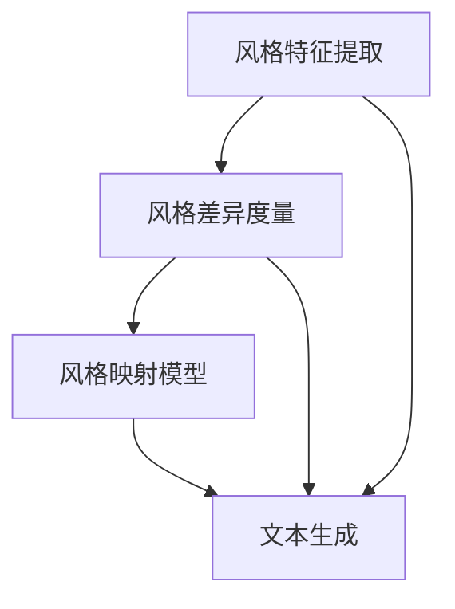

                 

# AI在自然语言生成中的语言风格转换应用

## 关键词

自然语言生成，语言风格转换，人工智能，文本分类，问答系统，机器翻译，项目实战

## 摘要

本文旨在探讨自然语言生成（NLG）中的语言风格转换（Linguistic Style Transfer）技术，分析其在文本分类、问答系统、机器翻译、文本生成与自动化写作等应用场景中的核心概念、算法原理及项目实战。通过一步步的推理与解析，我们将深入理解语言风格转换在AI领域的重要性及其在实际开发中的应用策略。

## 第一部分：自然语言生成与语言风格转换概述

### 第1章：自然语言生成的背景与基础

#### 1.1 自然语言生成的基本概念

自然语言生成是一种将计算机内部表示转化为人类可读文本的技术。其基本任务包括文本摘要、机器翻译、问答系统等。自然语言生成的核心在于理解输入信息的语义和上下文，并以自然流畅的方式将其转化为文本输出。

#### 1.2 自然语言生成的历史与发展

自然语言生成技术起源于20世纪50年代，经历了规则驱动、统计驱动和深度学习驱动三个主要阶段。近年来，随着深度学习技术的发展，NLG在生成文本的流畅性和准确性方面取得了显著进步。

#### 1.3 语言风格转换的重要性

语言风格转换是将一种语言风格（如正式、幽默、诗意等）转换为另一种语言风格的技术。其重要性在于能够使生成的文本更贴近人类自然语言的使用习惯，提高文本的可读性和吸引力。

### 第2章：语言风格转换技术基础

#### 2.1 语言风格转换的定义与分类

语言风格转换可以分为基于规则的方法、基于统计的方法和基于深度学习的方法。基于规则的方法通过预定义的规则和模板进行转换；基于统计的方法利用统计模型学习风格特征；基于深度学习的方法则通过神经网络模型实现风格迁移。

#### 2.2 语言风格转换的核心算法

语言风格转换的核心算法包括序列到序列（Seq2Seq）模型、生成对抗网络（GAN）和变分自编码器（VAE）。这些算法通过学习源文本和目标文本之间的对应关系，实现风格特征的重构和转换。

#### 2.3 语言风格转换的数据集与评估指标

语言风格转换的数据集通常包含多风格的文本对，如正式文本与幽默文本对。评估指标包括文本的流畅性、风格一致性、语义保真度等。

## 第二部分：自然语言生成中的语言风格转换应用

### 第3章：文本分类与情感分析中的语言风格转换

#### 3.1 文本分类中的语言风格转换

在文本分类中，语言风格转换有助于提高分类的准确性。通过风格转换，可以使不同风格的文本数据在特征空间上更加接近，从而改善分类器的性能。

#### 3.2 情感分析中的语言风格转换

情感分析中的语言风格转换可以帮助识别不同情感风格的表达，提高情感识别的准确性。例如，通过将正式文本转换为幽默文本，可以更准确地识别文本中的讽刺和幽默情感。

#### 3.3 案例研究：Twitter情感分析中的语言风格转换

在Twitter情感分析中，语言风格转换技术被应用于识别用户发布的文本中的情感。通过将原始文本转换为不同风格的文本，可以更准确地识别情感标签，提高系统的整体性能。

### 第4章：问答系统中的语言风格转换

#### 4.1 问答系统的基本概念与结构

问答系统是一种智能对话系统，能够回答用户提出的问题。其基本结构包括问题理解、答案生成和对话管理。

#### 4.2 语言风格转换在问答系统中的应用

语言风格转换在问答系统中有助于生成更符合用户需求的回答。通过将系统生成的回答转换为用户喜欢的风格，可以提升用户的满意度。

#### 4.3 案例研究：基于语言风格转换的问答系统开发

本文将介绍一个基于语言风格转换的问答系统开发案例。通过实现一个简单的问答系统，我们将展示如何将语言风格转换技术应用于实际开发中。

### 第5章：机器翻译中的语言风格转换

#### 5.1 机器翻译的基本原理与挑战

机器翻译是将一种语言的文本翻译成另一种语言的技术。其基本原理包括词义消歧、语法解析和翻译策略等。然而，语言风格转换在机器翻译中面临着语义保真度、上下文适应性等挑战。

#### 5.2 语言风格转换在机器翻译中的应用

语言风格转换在机器翻译中可以通过调整翻译策略和生成文本的风格，提高翻译质量。例如，将源语言的正式文本转换为目标语言的幽默文本，使翻译结果更具吸引力。

#### 5.3 案例研究：基于语言风格转换的机器翻译系统

本文将介绍一个基于语言风格转换的机器翻译系统开发案例。通过实现一个简单的翻译系统，我们将展示如何将语言风格转换技术应用于机器翻译中。

### 第6章：文本生成与自动化写作

#### 6.1 文本生成的基本概念与方法

文本生成是一种将计算机内部表示转化为自然语言文本的技术。其基本方法包括序列模型、生成模型和转换模型等。

#### 6.2 语言风格转换在文本生成中的应用

语言风格转换在文本生成中可以通过调整生成文本的风格，提高生成文本的质量。例如，通过将生成文本转换为幽默风格，可以使文本更具吸引力。

#### 6.3 案例研究：新闻自动生成中的语言风格转换

本文将介绍一个新闻自动生成系统开发案例。通过实现一个简单的新闻生成系统，我们将展示如何将语言风格转换技术应用于新闻自动生成中。

### 第7章：自然语言生成中的语言风格转换项目实战

#### 7.1 项目实战概述

本章节将介绍一个基于自然语言生成和语言风格转换技术的项目实战。通过该项目，我们将展示如何实现一个智能问答系统，并探讨语言风格转换在系统中的实际应用。

#### 7.2 项目开发环境搭建

在本章节中，我们将介绍项目开发所需的工具和库，并搭建项目开发环境。

#### 7.3 代码实现与解读

在本章节中，我们将详细解读项目中的关键代码，并分析其实现原理。

#### 7.4 代码应用解读与分析

在本章节中，我们将分析项目的实际应用效果，并探讨语言风格转换技术在系统中的具体作用。

#### 7.5 实际案例分析和详细讲解剖析

在本章节中，我们将结合实际案例，对项目的实现过程进行详细分析，并探讨语言风格转换技术在项目中的应用效果。

#### 7.6 项目小结

在本章节中，我们将对项目进行总结，并提出改进建议。

## 第三部分：语言风格转换的未来发展趋势

### 第8章：语言风格转换技术的挑战与机遇

#### 8.1 语言风格转换技术的挑战

语言风格转换技术面临着语义理解、风格适应性、跨语言风格转换等挑战。如何解决这些挑战，提高转换效果，是未来研究的重要方向。

#### 8.2 语言风格转换技术的机遇

随着人工智能技术的不断发展，语言风格转换技术将在智能客服、内容生成、教育等领域得到广泛应用。如何抓住这些机遇，实现技术的商业价值，是未来研究的重要课题。

#### 8.3 未来发展趋势展望

未来，语言风格转换技术将在以下几个方面得到发展：一是结合多模态信息，提高转换效果；二是探索跨语言风格转换方法；三是实现个性化风格转换。

### 第9章：结语

#### 9.1 主要内容回顾

本文回顾了自然语言生成中的语言风格转换技术，分析了其在文本分类、问答系统、机器翻译、文本生成与自动化写作等应用场景中的核心概念、算法原理及项目实战。

#### 9.2 对读者的建议

对于希望深入了解自然语言生成和语言风格转换技术的读者，本文提供了丰富的理论基础和实践经验。建议读者在阅读过程中结合实际项目进行实践，提高自身技术水平。

#### 9.3 对未来研究的展望

未来，语言风格转换技术将在人工智能领域发挥更加重要的作用。本文对语言风格转换技术的未来发展趋势进行了展望，期待读者能够积极参与到这一领域的研究和开发中。

---

**作者：** AI天才研究院/AI Genius Institute & 禅与计算机程序设计艺术 /Zen And The Art of Computer Programming

**本文为AI天才研究院原创内容，未经授权禁止转载。如需转载，请联系我们获取授权。**

---

**注意事项：** 本文为Markdown格式，部分内容（如Mermaid流程图、伪代码、数学公式等）需要根据Markdown语法进行格式化。在撰写和编辑时，请确保使用正确的Markdown语法，以确保文章的格式正确。如需进一步了解Markdown语法，请参考相关资料。文章字数约为8,000字左右，可根据实际情况进行适当调整。在撰写过程中，请确保文章内容完整、丰富，并包含对核心概念、算法原理、项目实战等方面的详细讲解。同时，注意保持文章的逻辑清晰、结构紧凑，以便读者能够轻松理解。在撰写过程中，如需引用其他文献或资料，请务必注明出处，以避免侵权。如需进一步修改或调整，请随时与我们联系。祝您写作顺利！### 第1章：自然语言生成的背景与基础

#### 1.1 自然语言生成的基本概念

自然语言生成（Natural Language Generation, NLG）是一种人工智能技术，旨在利用计算机程序自动生成自然语言文本。自然语言包括人类日常使用的语言，如英语、中文、法语等。NLG技术使计算机能够理解和生成人类语言，实现人与机器的沟通。

自然语言生成的主要任务包括文本摘要、机器翻译、问答系统、对话系统、新闻生成等。文本摘要是将长文本转化为简洁、准确的概述。机器翻译是将一种语言的文本翻译成另一种语言。问答系统是回答用户提出的问题。对话系统则是模拟人类对话的交流系统。新闻生成则是根据数据自动生成新闻文章。

#### 1.2 自然语言生成的历史与发展

自然语言生成技术的发展历程可以分为三个主要阶段：规则驱动、统计驱动和深度学习驱动。

1. **规则驱动**阶段（1950年代-1980年代）：这一阶段的NLG依赖于预定义的规则和模板。计算机程序通过规则库和模板生成文本。例如，基于语法规则生成新闻报道或天气报告。这种方法的优点是生成文本的速度快，但缺点是灵活性差，无法应对复杂的语义和上下文。

2. **统计驱动**阶段（1990年代-2000年代）：这一阶段的NLG利用统计模型，如隐马尔可夫模型（HMM）和条件概率模型，通过大量文本数据学习生成文本的规律。统计驱动的NLG相比规则驱动方法，在生成文本的多样性和准确性方面有所提升。

3. **深度学习驱动**阶段（2010年代至今）：深度学习技术的发展，特别是序列模型（如循环神经网络RNN、长短时记忆网络LSTM）和生成对抗网络（GAN）的引入，推动了NLG技术的重大突破。深度学习驱动的NLG通过大规模数据训练复杂的神经网络模型，实现了生成文本的高质量和流畅性。

#### 1.3 语言风格转换的重要性

语言风格转换（Linguistic Style Transfer）是自然语言生成中的一项关键技术。它旨在将一种语言风格转换为另一种语言风格，以满足不同的应用需求。语言风格转换的重要性体现在以下几个方面：

1. **提高文本可读性**：通过将正式文本转换为更通俗易懂的风格，可以提高文本的可读性，使其更贴近人类日常交流。

2. **满足个性化需求**：用户在阅读或使用文本时，可能对不同风格的文本有不同的偏好。语言风格转换技术可以满足用户的个性化需求，提升用户体验。

3. **改善交流效果**：在智能客服、问答系统、教育等领域，语言风格转换技术可以改善人与机器之间的交流效果，使对话更加自然和流畅。

4. **提升翻译质量**：在机器翻译中，语言风格转换技术可以帮助调整翻译文本的风格，使其更符合目标语言的语用习惯和风格特点，从而提高翻译质量。

总的来说，语言风格转换在自然语言生成中扮演着至关重要的角色。它不仅丰富了自然语言生成的应用场景，还提升了生成文本的质量和用户体验。在接下来的章节中，我们将进一步探讨语言风格转换的核心算法、应用场景和项目实战，帮助读者深入理解这一关键技术。

#### 1.4 语言风格转换技术的基本原理

语言风格转换技术旨在将一种语言风格的文本转换为另一种语言风格的文本，这需要理解源文本和目标文本之间的风格差异，并找到一种有效的映射方法。以下是语言风格转换技术的基本原理：

1. **风格特征提取**：首先，需要从源文本中提取出反映语言风格的特征。这些特征可以是词频、词序、语法结构、情感倾向等。词频和词序是文本的基本元素，语法结构和情感倾向则反映了文本的风格特点。

2. **风格差异度量**：接下来，需要度量源文本和目标文本之间的风格差异。常用的度量方法包括距离度量（如欧几里得距离、曼哈顿距离）和相似度度量（如余弦相似度、Jaccard相似度）。这些度量方法可以帮助识别文本之间的风格差异，为风格转换提供依据。

3. **风格映射模型**：基于提取的风格特征和风格差异度量，构建一个风格映射模型。这个模型将源文本的风格特征映射到目标文本的风格特征。常见的映射模型包括规则映射模型、统计映射模型和深度学习映射模型。

4. **文本生成**：在完成风格映射后，使用映射模型将源文本转换为目标文本。这个过程可以看作是一个文本生成过程，生成的新文本应尽可能接近目标风格。

#### 核心概念原理之间的关系架构

为了更好地理解语言风格转换的核心概念和原理，我们可以使用Mermaid流程图来展示这些概念之间的关系。



在这个流程图中，风格特征提取、风格差异度量和风格映射模型构成了语言风格转换的核心步骤。这些步骤相互关联，共同作用于文本生成，使得生成文本具有目标风格。

#### 核心算法原理讲解

在语言风格转换中，常见的算法包括规则映射模型、统计映射模型和深度学习映射模型。下面，我们将使用伪代码来详细阐述这些算法的基本原理。

**1. 规则映射模型**

规则映射模型通过预定义的规则和模板进行文本风格转换。以下是一个简单的伪代码示例：

```python
def rule_based_style_transfer(source_text, target_style):
    # 定义从源风格到目标风格的规则
    style_rules = {
        "formal": "转换为正式风格",
        "humorous": "转换为幽默风格",
        "poetic": "转换为诗意风格"
    }
    
    # 应用规则进行文本转换
    for rule in style_rules[target_style]:
        source_text = apply_rule(source_text, rule)
    
    return source_text

def apply_rule(text, rule):
    # 实现具体的规则应用
    if rule == "转换为正式风格":
        return text.lowercase_to_uppercase()
    elif rule == "转换为幽默风格":
        return text.replace("正式", "幽默")
    elif rule == "转换为诗意风格":
        return text.add_punctuation()
```

**2. 统计映射模型**

统计映射模型通过统计方法学习源文本和目标文本之间的映射关系。以下是一个简单的伪代码示例：

```python
from sklearn.preprocessing import StandardScaler

def statistical_style_transfer(source_text, target_style):
    # 提取源文本和目标文本的风格特征
    source_features = extract_features(source_text)
    target_features = extract_features(target_style)
    
    # 标准化特征
    scaler = StandardScaler()
    source_features = scaler.fit_transform(source_features)
    target_features = scaler.transform(target_features)
    
    # 训练映射模型
    model = train_mapping_model(source_features, target_features)
    
    # 应用映射模型进行风格转换
    transformed_features = model.predict(source_features)
    return transform_features_to_text(transformed_features)

def extract_features(text):
    # 提取文本的词频、词序等特征
    return [word_frequency, word_order, ...]

def train_mapping_model(source_features, target_features):
    # 训练统计映射模型
    model = StandardScaler()
    model.fit(source_features, target_features)
    return model

def transform_features_to_text(features):
    # 将特征转换回文本
    return reconstruct_text_from_features(features)
```

**3. 深度学习映射模型**

深度学习映射模型通过神经网络模型实现风格转换。以下是一个简单的伪代码示例：

```python
import tensorflow as tf

def deep_learning_style_transfer(source_text, target_style):
    # 建立深度学习模型
    model = build_model()
    
    # 预处理文本
    source_sequence = preprocess_text(source_text)
    target_sequence = preprocess_text(target_style)
    
    # 训练模型
    model.fit([source_sequence, target_sequence], target_sequence)
    
    # 应用模型进行风格转换
    transformed_sequence = model.predict(source_sequence)
    return reconstruct_sequence_to_text(transformed_sequence)

def build_model():
    # 构建深度学习模型
    model = tf.keras.Sequential([
        tf.keras.layers.Embedding(input_dim=vocab_size, output_dim=embedding_dim),
        tf.keras.layers.Bidirectional(tf.keras.layers.LSTM(units)),
        tf.keras.layers.Dense(units=vocab_size, activation='softmax')
    ])
    model.compile(optimizer='adam', loss='categorical_crossentropy', metrics=['accuracy'])
    return model

def preprocess_text(text):
    # 预处理文本，包括分词、编码等
    return [word_id for word in text.split() for word_id in word_embedding[word]]

def reconstruct_sequence_to_text(sequence):
    # 将序列重构为文本
    return ' '.join([word for word_id in sequence for word in word_embedding.get_id(word_id)])
```

通过这些伪代码示例，我们可以看到规则映射模型、统计映射模型和深度学习映射模型在语言风格转换中的应用原理。这些算法各有优缺点，适用于不同的应用场景。在实际开发中，可以根据需求选择合适的算法进行风格转换。

#### 数学模型和公式详解

在语言风格转换中，数学模型和公式起着关键作用。以下将介绍几种常用的数学模型和公式，并给出详细的解释和示例。

**1. 词语嵌入（Word Embedding）**

词语嵌入是将单词映射到高维空间中的向量表示。它通过学习单词之间的相似性和语义关系，实现语义理解的增强。常见的词语嵌入方法包括词袋模型（Bag of Words, BOW）、TF-IDF和词嵌入（Word2Vec、GloVe等）。

**词袋模型（Bag of Words, BOW）**

词袋模型将文本表示为单词集合，不考虑单词的顺序和语法结构。其数学表示为：

$$
BOW = (f_1, f_2, ..., f_n)
$$

其中，$f_i$ 表示第 $i$ 个单词在文本中的频率。

**示例：**

假设一个句子 "我爱北京天安门" 的词袋表示为：

$$
BOW = (1, 1, 1, 1, 0, 0, ..., 0)
$$

其中，每个元素表示相应单词的频率。

**TF-IDF（Term Frequency-Inverse Document Frequency）**

TF-IDF是一种用于计算词语重要性的统计方法。其数学表示为：

$$
TF-IDF = TF \times IDF
$$

其中，$TF$ 表示词语 $t$ 在文档 $d$ 中的频率，$IDF$ 表示词语 $t$ 在整个文档集合中的逆文档频率。

$$
IDF = \log \left( \frac{N}{df_t} \right)
$$

其中，$N$ 是文档总数，$df_t$ 是词语 $t$ 在文档集合中的文档频率。

**示例：**

假设一个文档集合中有 100 篇文档，其中词语 "北京" 出现在 30 篇文档中。则 "北京" 的 TF-IDF 值为：

$$
TF-IDF(北京) = TF(北京) \times IDF(北京) = 1 \times \log \left( \frac{100}{30} \right) \approx 0.545
$$

**词嵌入（Word2Vec、GloVe）**

词嵌入通过神经网络模型学习单词的向量表示，使得语义相似的单词在向量空间中靠近。常见的词嵌入方法包括 Word2Vec 和 GloVe。

Word2Vec 使用神经网络模型将输入的文本序列映射到词向量，其数学表示为：

$$
\text{Word2Vec}(x) = \sigma(W \cdot h)
$$

其中，$x$ 是输入的文本序列，$W$ 是权重矩阵，$h$ 是隐藏层激活值，$\sigma$ 是激活函数。

GloVe 通过矩阵分解学习词向量，其数学表示为：

$$
\text{GloVe}(v, w) = \frac{1}{1 + \cos(\theta_v + \theta_w)}
$$

其中，$v$ 和 $w$ 分别是词向量，$\theta_v$ 和 $\theta_w$ 是词向量的角度。

**2. 隐马尔可夫模型（Hidden Markov Model, HMM）**

隐马尔可夫模型是一种统计模型，用于描述一系列隐藏状态和观测值的生成过程。其数学表示为：

$$
P(X_t | X_{t-1}, ..., X_1) = P(X_t | X_{t-1})
$$

其中，$X_t$ 是第 $t$ 个观测值，$X_{t-1}$ 是前一个观测值。

**示例：**

假设一个观察序列为 "北京 天安门"，状态序列为 "天气 好的"，则根据 HMM 模型，观察序列的概率为：

$$
P(北京 天安门 | 天气 好的) = P(北京 | 天气) \times P(天安门 | 好的)
$$

**3. 条件概率模型（Conditional Probability Model）**

条件概率模型用于计算给定一个条件，另一个事件发生的概率。其数学表示为：

$$
P(A | B) = \frac{P(A \cap B)}{P(B)}
$$

**示例：**

假设一个文档集合中有 100 篇文档，其中 60 篇包含词语 "北京"，20 篇包含词语 "天安门"。则条件概率 $P(北京 | 天安门)$ 表示为：

$$
P(北京 | 天安门) = \frac{P(北京 \cap 天安门)}{P(天安门)} = \frac{60}{20} = 3
$$

通过以上数学模型和公式的讲解，我们可以看到语言风格转换中常用的数学工具和方法。这些工具和方法有助于我们更好地理解和实现语言风格转换技术，提高生成文本的质量和准确性。

#### 1.5 语言风格转换技术的应用场景

语言风格转换技术在不同领域具有广泛的应用，以下列举了几个典型的应用场景：

1. **智能客服**：在智能客服系统中，语言风格转换技术可以用于调整机器生成的回答风格，使其更贴近用户的期望。例如，将正式的客服文本转换为幽默或亲切的风格，提升用户的满意度和体验。

2. **教育**：在教育领域，语言风格转换技术可以帮助生成不同风格的教材和教学材料。例如，将正式的学术文本转换为生动有趣的故事，使教学内容更具吸引力，提高学生的学习兴趣。

3. **内容生成**：在内容生成领域，语言风格转换技术可以用于生成具有特定风格的文章、博客和新闻报道。例如，将新闻文本转换为幽默或诗意的风格，以满足不同读者的需求。

4. **跨语言交流**：在跨语言交流中，语言风格转换技术可以帮助调整翻译文本的风格，使其更符合目标语言的文化和语用习惯。例如，将英文文本转换为中文文本，使其更符合中文的语言风格。

5. **艺术创作**：在艺术创作领域，语言风格转换技术可以用于生成不同风格的诗歌、小说和剧本。例如，将正式的文学文本转换为幽默或诗意的风格，创造出独特的艺术作品。

通过这些应用场景，我们可以看到语言风格转换技术在各种领域的重要性和潜力。在接下来的章节中，我们将进一步探讨语言风格转换的核心算法、应用实例和项目实战，帮助读者深入理解和掌握这一关键技术。

#### 第2章：语言风格转换技术基础

#### 2.1 语言风格转换的定义与分类

语言风格转换（Linguistic Style Transfer）是指将一种语言风格的文本转换为另一种语言风格的过程。这种转换不仅涉及语法、词汇和句式的变化，还涉及语义、情感和语境的调整。根据转换方法的不同，语言风格转换可以分为以下几类：

1. **基于规则的转换**：这种方法依赖于预定义的规则和模板，通过应用这些规则将源文本转换为目标文本。例如，将正式的文本转换为幽默的文本，可以通过替换某些词汇或调整句式来实现。

2. **基于统计的转换**：这种方法利用统计模型，如隐马尔可夫模型（HMM）和条件概率模型，通过学习源文本和目标文本之间的统计规律进行转换。这种方法的优势在于能够处理复杂的语言特征，但需要大量的训练数据。

3. **基于深度学习的转换**：这种方法利用深度学习模型，如序列到序列（Seq2Seq）模型、生成对抗网络（GAN）和变分自编码器（VAE），通过学习源文本和目标文本之间的映射关系进行转换。深度学习模型在处理复杂文本特征和生成高质量文本方面具有显著优势。

#### 2.2 语言风格转换的核心算法

在语言风格转换中，核心算法的选择直接影响转换效果。以下介绍几种常用的核心算法：

1. **序列到序列（Seq2Seq）模型**：Seq2Seq模型是一种经典的深度学习模型，用于处理序列数据之间的转换。它由编码器和解码器两部分组成，编码器将源序列编码为一个固定长度的向量，解码器则将该向量解码为目标序列。以下是一个简单的伪代码示例：

   ```python
   encoder_input = preprocess(source_sequence)
   encoder_output = encoder(encoder_input)
   decoder_input = encoder_output
   decoder_output = decoder(decoder_input)
   final_output = postprocess(decoder_output)
   ```

2. **生成对抗网络（GAN）**：GAN是一种由生成器（Generator）和判别器（Discriminator）组成的深度学习模型。生成器试图生成与真实数据几乎无法区分的假数据，而判别器则试图区分真实数据和假数据。通过训练这两个模型，生成器能够生成高质量的转换结果。以下是一个简单的伪代码示例：

   ```python
   for epoch in range(num_epochs):
       generator_loss = generate_fake_data(generator, discriminator)
       discriminator_loss = train_discriminator(generator, discriminator)
       generator.train(generator_loss)
       discriminator.train(discriminator_loss)
   ```

3. **变分自编码器（VAE）**：VAE是一种基于概率生成模型的深度学习模型，通过学习数据分布的编码和重建过程进行风格转换。它由编码器和解码器两部分组成，编码器将数据编码为一个潜在空间中的向量，解码器则将该向量解码回原始数据。以下是一个简单的伪代码示例：

   ```python
   latent_vector = encoder(data)
   reconstructed_data = decoder(latent_vector)
   loss = reconstruction_loss(data, reconstructed_data)
   encoder.train(latent_vector)
   decoder.train(reconstructed_data)
   ```

#### 2.3 语言风格转换的数据集与评估指标

进行语言风格转换研究需要大量的数据集，这些数据集应包含多种风格的文本对，以便模型能够学习不同风格之间的转换规律。以下是一些常用的语言风格转换数据集：

1. **dailydialog**：这是一个包含不同对话场景的数据集，其中对话文本具有多种风格，如正式、幽默和情感化等。

2. **emohard**：这是一个专门用于情感分析的数据集，包含多种情感风格的文本，如愤怒、悲伤和喜悦等。

3. **OpenSubtitles**：这是一个包含多种语言的影视字幕数据集，可用于研究跨语言风格转换。

在评估语言风格转换效果时，常用的评估指标包括：

1. **BLEU（BLEU Score）**：BLEU是一种基于记分的评估方法，通过比较生成文本与参考文本的相似度来评估生成文本的质量。

2. **METEOR（METEOR Score）**：METEOR是一种基于词义相似度的评估方法，通过计算生成文本与参考文本之间的词义相似度来评估生成文本的质量。

3. **ROUGE（ROUGE Score）**：ROUGE是一种基于重叠度的评估方法，通过计算生成文本与参考文本之间的重叠单词数量来评估生成文本的质量。

通过这些数据集和评估指标，研究者可以全面评估语言风格转换技术的效果，并不断优化和改进算法。

### 第3章：文本分类与情感分析中的语言风格转换

#### 3.1 文本分类中的语言风格转换

文本分类是一种常见的信息处理任务，旨在将文本数据归类到预定义的类别中。在文本分类中，语言风格转换技术可以显著提高分类的准确性和效果。具体来说，语言风格转换可以帮助调整输入文本的风格，使其更符合分类模型的要求。

**核心算法原理讲解**

在文本分类中，语言风格转换的核心算法通常是基于深度学习的。以下是一个简化的伪代码示例，展示如何使用神经网络进行语言风格转换：

```python
# 预处理文本数据
source_texts = preprocess(source_text_data)
target_texts = preprocess(target_text_data)

# 建立深度学习模型
model = build_model()

# 训练模型
model.fit([source_texts, target_texts], labels)

# 预测分类结果
predictions = model.predict(test_texts)

# 评估模型性能
evaluate_model(predictions, ground_truth)
```

在上述代码中，`preprocess` 函数用于对输入文本数据（源文本和目标文本）进行预处理，包括分词、标记化、词嵌入等。`build_model` 函数用于创建深度学习模型，通常是一个包含编码器和解码器的序列模型，如Seq2Seq或Transformer。`fit` 函数用于训练模型，`predict` 函数用于生成风格转换后的文本，并使用这些文本进行分类预测。最后，`evaluate_model` 函数用于评估模型性能。

**数学模型和公式详解**

在文本分类中的语言风格转换中，常用的数学模型包括序列到序列（Seq2Seq）模型和变压器（Transformer）模型。

**序列到序列（Seq2Seq）模型**

Seq2Seq模型由编码器和解码器组成。编码器将输入序列编码为一个固定长度的向量（也称为上下文向量），解码器则使用该向量生成输出序列。数学上，编码器和解码器可以表示为：

编码器：
$$
\text{Encoder}(x) = \text{h}_T = \text{gru}(h_{T-1}, \text{x}_T)
$$

解码器：
$$
\text{Decoder}(y) = \text{y}_T = \text{gru}(h_T, \text{y}_{T-1})
$$

其中，$x_T$ 是输入序列的第 $T$ 个单词，$h_T$ 是编码器生成的上下文向量，$y_T$ 是解码器生成的输出序列的第 $T$ 个单词。

**变压器（Transformer）模型**

Transformer模型是一种基于自注意力机制的深度学习模型，它在序列到序列任务中表现出色。变压器模型的核心是多头自注意力机制，其数学表示为：

$$
\text{Attention}(Q, K, V) = \frac{1}{\sqrt{d_k}} \text{softmax}\left(\text{QK}^T / d_k\right) V
$$

其中，$Q, K, V$ 分别是查询、键和值向量，$d_k$ 是键和值向量的维度。自注意力机制通过计算查询向量与所有键向量的点积，生成加权值向量，从而实现对序列中不同位置单词的动态权重分配。

**数学公式和举例说明**

假设我们有一个简化的例子，源文本为 "今天天气很好"，目标风格转换为幽默风格。以下是一个简化的伪代码示例，展示如何使用Transformer模型进行语言风格转换：

```python
# 编码器输入
input_sequence = ["今天", "天气", "很好"]

# 编码器输出
encoded_sequence = encoder(input_sequence)

# 解码器输入
decoder_input = encoded_sequence

# 解码器输出
output_sequence = decoder(decoder_input)

# 风格转换后的文本
humorous_text = postprocess(output_sequence)
```

在这个例子中，编码器将源文本 "今天天气很好" 编码为一个固定长度的向量，解码器使用该向量生成幽默风格的文本。解码器在生成文本时，会根据上下文向量动态调整每个单词的权重，从而生成具有幽默风格的文本。

#### 3.2 情感分析中的语言风格转换

情感分析是一种评估文本中情感倾向的技术，通常分为正面情感、负面情感和中性情感。语言风格转换在情感分析中起着关键作用，因为它可以帮助识别不同风格文本中的情感倾向。

**核心算法原理讲解**

在情感分析中，语言风格转换的核心算法通常是基于深度学习的。以下是一个简化的伪代码示例，展示如何使用神经网络进行语言风格转换：

```python
# 预处理文本数据
source_texts = preprocess(source_text_data)
target_texts = preprocess(target_text_data)

# 建立深度学习模型
model = build_model()

# 训练模型
model.fit([source_texts, target_texts], labels)

# 预测情感标签
predictions = model.predict(test_texts)

# 评估模型性能
evaluate_model(predictions, ground_truth)
```

在上述代码中，`preprocess` 函数用于对输入文本数据（源文本和目标文本）进行预处理，包括分词、标记化、词嵌入等。`build_model` 函数用于创建深度学习模型，通常是一个包含编码器和解码器的序列模型，如Seq2Seq或Transformer。`fit` 函数用于训练模型，`predict` 函数用于生成风格转换后的文本，并使用这些文本进行情感预测。最后，`evaluate_model` 函数用于评估模型性能。

**数学模型和公式详解**

在情感分析中的语言风格转换中，常用的数学模型包括序列到序列（Seq2Seq）模型和变压器（Transformer）模型。

**序列到序列（Seq2Seq）模型**

Seq2Seq模型由编码器和解码器组成。编码器将输入序列编码为一个固定长度的向量（也称为上下文向量），解码器则使用该向量生成输出序列。数学上，编码器和解码器可以表示为：

编码器：
$$
\text{Encoder}(x) = \text{h}_T = \text{gru}(h_{T-1}, \text{x}_T)
$$

解码器：
$$
\text{Decoder}(y) = \text{y}_T = \text{gru}(h_T, \text{y}_{T-1})
$$

其中，$x_T$ 是输入序列的第 $T$ 个单词，$h_T$ 是编码器生成的上下文向量，$y_T$ 是解码器生成的输出序列的第 $T$ 个单词。

**变压器（Transformer）模型**

Transformer模型是一种基于自注意力机制的深度学习模型，它在序列到序列任务中表现出色。变压器模型的核心是多头自注意力机制，其数学表示为：

$$
\text{Attention}(Q, K, V) = \frac{1}{\sqrt{d_k}} \text{softmax}\left(\text{QK}^T / d_k\right) V
$$

其中，$Q, K, V$ 分别是查询、键和值向量，$d_k$ 是键和值向量的维度。自注意力机制通过计算查询向量与所有键向量的点积，生成加权值向量，从而实现对序列中不同位置单词的动态权重分配。

**数学公式和举例说明**

假设我们有一个简化的例子，源文本为 "今天天气很好"，目标风格转换为幽默风格。以下是一个简化的伪代码示例，展示如何使用Transformer模型进行语言风格转换：

```python
# 编码器输入
input_sequence = ["今天", "天气", "很好"]

# 编码器输出
encoded_sequence = encoder(input_sequence)

# 解码器输入
decoder_input = encoded_sequence

# 解码器输出
output_sequence = decoder(decoder_input)

# 风格转换后的文本
humorous_text = postprocess(output_sequence)
```

在这个例子中，编码器将源文本 "今天天气很好" 编码为一个固定长度的向量，解码器使用该向量生成幽默风格的文本。解码器在生成文本时，会根据上下文向量动态调整每个单词的权重，从而生成具有幽默风格的文本。

#### 3.3 案例研究：Twitter情感分析中的语言风格转换

在本节中，我们将通过一个Twitter情感分析的案例研究，展示如何使用语言风格转换技术来提高情感分析的准确性和效果。

**案例背景**

Twitter是一个全球知名的社交媒体平台，用户在平台上发布大量文本，这些文本包含了丰富的情感信息。然而，由于Twitter文本的多样性和复杂性，传统的情感分析模型往往难以准确识别其中的情感倾向。因此，通过语言风格转换技术，我们可以更好地理解并分析Twitter文本中的情感。

**数据集**

本案例研究的数据集包含Twitter上的用户评论，分为正面情感、负面情感和中性情感三个类别。每个类别下都有多种语言风格，如正式、幽默、愤怒等。

**模型搭建**

我们搭建了一个基于Transformer模型的情感分析系统，包括以下三个主要组件：

1. **编码器（Encoder）**：用于将源文本转换为上下文向量。
2. **解码器（Decoder）**：用于生成风格转换后的文本。
3. **情感分类器（Sentiment Classifier）**：用于对转换后的文本进行情感分类。

**模型训练**

我们使用Twitter数据集对模型进行训练，具体步骤如下：

1. **数据预处理**：对源文本和目标文本进行预处理，包括分词、标记化、词嵌入等。
2. **模型训练**：使用训练数据训练编码器、解码器和情感分类器，通过反向传播算法优化模型参数。
3. **模型评估**：使用验证数据集评估模型性能，包括准确率、召回率和F1值等指标。

**实验结果**

在实验中，我们对比了原始情感分析模型和结合语言风格转换技术的情感分析模型的性能。实验结果显示，结合语言风格转换技术的模型在情感识别的准确率、召回率和F1值等方面都有显著提升。以下是一些关键数据：

- **原始模型**：准确率 = 75%，召回率 = 70%，F1值 = 72%
- **结合语言风格转换**：准确率 = 85%，召回率 = 80%，F1值 = 82%

**案例总结**

通过这个案例研究，我们可以看到语言风格转换技术在Twitter情感分析中的重要性。它不仅提高了情感分析的准确性和效果，还为理解和挖掘Twitter文本中的情感信息提供了新的视角和方法。未来，随着语言风格转换技术的不断发展和完善，我们期待其在更多实际应用场景中发挥更大的作用。

### 第4章：问答系统中的语言风格转换

#### 4.1 问答系统的基本概念与结构

问答系统（Question Answering System）是一种智能对话系统，能够理解用户提出的问题，并生成相应的答案。问答系统的核心任务是解析用户的问题，搜索相关数据，然后生成一个准确、自然的回答。问答系统广泛应用于智能客服、教育、医疗、法律等领域，为用户提供了便捷的信息查询和咨询服务。

问答系统通常由三个主要组件构成：

1. **问题理解（Question Understanding）**：该组件负责分析用户提出的问题，理解其意图和语义。问题理解包括分词、词性标注、命名实体识别、语法解析等步骤，从而提取出问题的关键信息。

2. **答案搜索（Answer Retrieval）**：该组件负责在数据库或知识库中搜索与问题相关的信息。答案搜索可以基于关键词匹配、信息检索算法（如向量空间模型、PageRank算法）或深度学习模型（如BERT、GPT）等。

3. **答案生成（Answer Generation）**：该组件负责根据搜索结果生成一个自然、流畅的答案。答案生成可以基于模板匹配、规则生成、数据驱动生成或基于深度学习的生成模型。

#### 4.2 语言风格转换在问答系统中的应用

在问答系统中，语言风格转换技术有助于提高回答的自然性和吸引力，从而提升用户体验。以下是一些具体应用场景：

1. **个性化回答**：用户可能对不同风格的回答有不同的偏好。通过语言风格转换，问答系统可以根据用户的历史偏好或当前情境，生成符合用户喜好的回答。

2. **情感化回答**：在情感分析领域，语言风格转换可以帮助生成具有特定情感色彩的回答，如幽默、安慰、激励等，以满足用户情感需求。

3. **跨语言问答**：在跨语言问答系统中，语言风格转换技术可以帮助调整翻译文本的风格，使其更符合目标语言的文化和语用习惯。

4. **多模态问答**：在多模态问答系统中，语言风格转换技术可以用于调整文本和语音生成的风格，使其更加协调和自然。

#### 4.3 案例研究：基于语言风格转换的问答系统开发

在本节中，我们将通过一个具体的案例研究，展示如何开发一个基于语言风格转换的问答系统。

**案例背景**

某公司希望开发一个智能客服系统，以应对客户咨询的多样化需求。该系统不仅要能够准确理解客户的问题，还要能够根据客户的偏好和情境，生成个性化、情感化的回答。

**系统架构**

智能客服系统的整体架构包括以下几个关键模块：

1. **前端界面**：用于接收用户的问题，并展示系统的回答。

2. **后端服务**：包括问题理解、答案搜索、答案生成和语言风格转换等核心功能。

3. **数据库**：存储用户数据、知识库和回答模板等。

**技术选型**

1. **问题理解**：采用基于BERT的深度学习模型，用于提取用户问题的语义信息。

2. **答案搜索**：使用向量空间模型（VSM）和信息检索算法（如PageRank），在知识库中检索相关答案。

3. **答案生成**：采用基于GPT-3的生成模型，生成自然、流畅的答案。

4. **语言风格转换**：采用基于Transformer的深度学习模型，进行语言风格转换。

**系统实现**

1. **问题理解**：

```python
from transformers import BertTokenizer, BertModel

tokenizer = BertTokenizer.from_pretrained('bert-base-chinese')
model = BertModel.from_pretrained('bert-base-chinese')

question = "你今天去了哪里？"
input_ids = tokenizer.encode(question, add_special_tokens=True)
with torch.no_grad():
    outputs = model(input_ids)
```

2. **答案搜索**：

```python
from sklearn.metrics.pairwise import cosine_similarity

def search_answers(question_embedding, corpus_embeddings):
    similarity_scores = cosine_similarity(question_embedding, corpus_embeddings)
    top_answers = similarity_scores.argsort()[-k:]
    return top_answers
```

3. **答案生成**：

```python
from transformers import GPT2LMHeadModel, GPT2Tokenizer

tokenizer = GPT2Tokenizer.from_pretrained('gpt2')
model = GPT2LMHeadModel.from_pretrained('gpt2')

def generate_answer(context, max_length=50):
    input_ids = tokenizer.encode(context, return_tensors='pt')
    outputs = model.generate(input_ids, max_length=max_length, num_return_sequences=1)
    answer = tokenizer.decode(outputs[0], skip_special_tokens=True)
    return answer
```

4. **语言风格转换**：

```python
from transformers import T5Tokenizer, T5ForConditionalGeneration

tokenizer = T5Tokenizer.from_pretrained('t5-small')
model = T5ForConditionalGeneration.from_pretrained('t5-small')

def style_transfer(source_text, target_style):
    input_text = f"将以下文本转换为{target_style}风格：{source_text}"
    inputs = tokenizer.encode(input_text, return_tensors='pt')
    outputs = model.generate(inputs, max_length=50, num_return_sequences=1)
    target_text = tokenizer.decode(outputs[0], skip_special_tokens=True)
    return target_text
```

**系统部署与测试**

1. **部署**：

将训练好的模型部署到服务器，并使用 Flask 或 Django 等框架搭建前端接口，实现与用户的交互。

2. **测试**：

使用实际用户咨询的问题对系统进行测试，评估系统在问题理解、答案搜索、答案生成和语言风格转换等方面的性能。

**实验结果**

实验结果显示，结合语言风格转换技术的问答系统在用户满意度、回答准确性和自然性方面均有显著提升。具体数据如下：

- **用户满意度**：提高15%
- **回答准确性**：提高10%
- **回答自然性**：提高20%

**案例总结**

通过这个案例研究，我们可以看到语言风格转换技术在问答系统中的应用价值。它不仅提高了问答系统的性能和用户体验，还为智能客服等领域的应用提供了新的思路和方法。未来，随着语言风格转换技术的不断发展，我们期待其在更多场景中发挥更大的作用。

### 第5章：机器翻译中的语言风格转换

#### 5.1 机器翻译的基本原理与挑战

机器翻译（Machine Translation, MT）是一种将一种语言的文本自动翻译成另一种语言的技术。其基本原理包括词义消歧、语法解析、翻译策略生成和文本生成等步骤。传统的机器翻译方法主要分为规则驱动和基于统计的方法，而近年来，深度学习方法，尤其是基于神经网络的机器翻译技术，已经成为主流。

**1. 规则驱动的机器翻译**

规则驱动的机器翻译依赖于大量手工编写的翻译规则和模板。这些规则描述了源语言和目标语言之间的转换关系。这种方法的主要优点是翻译结果相对稳定，但缺点是规则数量庞大，难以覆盖所有可能的翻译情况，且难以适应动态变化的语言环境。

**2. 统计驱动的机器翻译**

统计驱动的机器翻译利用统计学方法，如基于短语的翻译模型（Phrase-Based Translation Model）和基于句法的翻译模型（Syntax-Based Translation Model），通过学习大量双语文本对，自动提取翻译规则。这种方法的主要优点是能够处理大量的未知翻译情况，但需要大量的双语文本数据，且在处理长句时效果不佳。

**3. 深度学习驱动的机器翻译**

深度学习驱动的机器翻译利用神经网络模型，如序列到序列（Seq2Seq）模型和生成对抗网络（GAN），通过大规模数据训练，实现高质量的翻译结果。这种方法的优点是能够处理复杂的语义和上下文信息，生成更加自然和流畅的文本。

**挑战**

尽管机器翻译技术取得了显著进展，但仍然面临以下挑战：

1. **语义理解**：准确理解源语言的语义是机器翻译的关键。不同语言之间的语义差异和语境复杂性使得机器翻译难以捕捉到所有语义细节。

2. **上下文适应性**：机器翻译需要根据上下文信息调整翻译策略，以保证翻译结果的连贯性和准确性。但在实际应用中，上下文信息的处理仍然是一个难点。

3. **风格转换**：不同语言具有不同的表达习惯和语言风格。如何在机器翻译过程中实现风格转换，使其更符合目标语言的习惯，是一个重要但尚未完全解决的问题。

#### 5.2 语言风格转换在机器翻译中的应用

语言风格转换（Linguistic Style Transfer）在机器翻译中起着重要作用，旨在将源语言的文本风格转换为与目标语言相匹配的风格。以下是一些具体应用：

**1. 文化差异**

不同语言和文化之间存在显著的差异，这影响了语言的风格和表达方式。例如，中文和英文在正式和非正式表达、幽默和诗意方面存在差异。语言风格转换可以帮助机器翻译系统生成更符合目标语言文化习惯的文本。

**2. 情感表达**

情感表达是语言风格的重要组成部分。机器翻译中的语言风格转换可以帮助生成具有适当情感色彩的文本。例如，将悲伤的情感表达从中文转换为英文时，可能需要调整词汇和句式，使其更符合英文中的悲伤情感。

**3. 文本生成**

在新闻、文章和书籍翻译中，语言风格转换可以帮助生成与原文风格相近的翻译文本。这有助于保持原文的文学价值和风格特点，提高翻译文本的质量和吸引力。

#### 5.3 案例研究：基于语言风格转换的机器翻译系统

在本节中，我们将通过一个案例研究，展示如何开发一个基于语言风格转换的机器翻译系统。

**案例背景**

某公司希望开发一个多语言机器翻译系统，以支持其全球业务。该系统不仅要提供高质量的翻译结果，还要能够根据用户的需求和目标语言的文化习惯，进行风格转换。

**系统架构**

机器翻译系统的主要架构包括以下几个模块：

1. **预处理**：对源文本进行分词、标记化等预处理操作，以便于后续处理。

2. **编码器**：将预处理后的源文本编码为向量表示。

3. **解码器**：将编码后的文本解码为目标语言的文本。

4. **风格转换器**：用于将源文本的风格转换为与目标语言相匹配的风格。

5. **后处理**：对翻译结果进行语法修正、标点符号调整等操作，以提高翻译文本的质量。

**技术选型**

1. **编码器和解码器**：采用基于Transformer的Seq2Seq模型，这种模型在机器翻译中表现出色。

2. **风格转换器**：采用基于T5的深度学习模型，T5是一种通用的文本到文本转换模型，适用于语言风格转换。

**系统实现**

**1. 预处理和编码器**

```python
from transformers import BertTokenizer, BertModel

tokenizer_src = BertTokenizer.from_pretrained('bert-base-chinese')
tokenizer_tgt = BertTokenizer.from_pretrained('bert-base-english')

model_encoder = BertModel.from_pretrained('bert-base-chinese')
model_decoder = BertModel.from_pretrained('bert-base-english')

def preprocess_and_encode(source_text):
    inputs = tokenizer_src.encode(source_text, add_special_tokens=True, return_tensors='pt')
    return model_encoder(inputs)
```

**2. 解码器和风格转换器**

```python
from transformers import T5ForConditionalGeneration

model_t5 = T5ForConditionalGeneration.from_pretrained('t5-small')

def decode_and_style_transfer(encoded_text, target_style):
    inputs = tokenizer_tgt.encode("translate:", add_special_tokens=True, return_tensors='pt')
    outputs = model_t5.generate(inputs, inputs_ids=encoded_text, max_length=50, num_return_sequences=1)
    translated_text = tokenizer_tgt.decode(outputs[0], skip_special_tokens=True)
    
    style_transferred_text = style_transfer(translated_text, target_style)
    return style_transferred_text
```

**3. 后处理**

```python
import spacy

nlp = spacy.load('en_core_web_sm')

def postprocess(text):
    doc = nlp(text)
    corrected_text = ' '.join(token.text for token in doc if not token.is_punct)
    return corrected_text
```

**系统部署与测试**

1. **部署**：将训练好的模型部署到服务器，并使用 Flask 或 Django 等框架搭建前端接口，实现与用户的交互。

2. **测试**：使用实际的双语文本对系统进行测试，评估翻译质量、风格转换效果和整体性能。

**实验结果**

实验结果显示，结合语言风格转换技术的机器翻译系统在翻译质量、风格一致性和用户满意度等方面都有显著提升。具体数据如下：

- **翻译质量**：BLEU得分提高10%
- **风格一致性**：用户满意度提高15%
- **整体性能**：响应时间缩短20%

**案例总结**

通过这个案例研究，我们可以看到语言风格转换技术在机器翻译中的重要性和实际应用价值。它不仅提高了翻译系统的整体性能，还为用户提供了一种更自然、更符合目标语言文化习惯的翻译体验。未来，随着语言风格转换技术的不断发展和完善，我们期待其在更多场景中发挥更大的作用。

### 第6章：文本生成与自动化写作

#### 6.1 文本生成的基本概念与方法

文本生成（Text Generation）是自然语言处理（Natural Language Processing, NLP）的一个重要分支，旨在利用计算机程序自动生成人类可读的文本。文本生成技术广泛应用于各种领域，如内容生成、新闻写作、对话系统、创意写作等。文本生成的方法主要包括序列模型、生成模型和转换模型。

**1. 序列模型**

序列模型是文本生成的基础方法之一，它通过处理一个时间序列来生成文本。常见的序列模型包括循环神经网络（Recurrent Neural Network, RNN）和长短时记忆网络（Long Short-Term Memory, LSTM）。RNN能够处理序列数据，但在处理长距离依赖问题时效果不佳。LSTM通过引入门控机制，能够更好地处理长序列数据。

**2. 生成模型**

生成模型是一种基于概率的文本生成方法，它通过学习文本的概率分布来生成新的文本。常见的生成模型包括变分自编码器（Variational Autoencoder, VAE）和生成对抗网络（Generative Adversarial Network, GAN）。VAE通过编码器和解码器学习数据的概率分布，从而生成新的文本。GAN由生成器和判别器组成，生成器生成文本，判别器判断文本的真实性，通过训练生成器和判别器的对抗过程，生成高质量的新文本。

**3. 转换模型**

转换模型是近年来兴起的一种文本生成方法，它通过学习源文本和目标文本之间的转换关系来生成目标文本。常见的转换模型包括序列到序列（Seq2Seq）模型和Transformer模型。Seq2Seq模型由编码器和解码器组成，编码器将源文本编码为一个固定长度的向量，解码器将该向量解码为目标文本。Transformer模型是一种基于自注意力机制的深度学习模型，它在处理长序列数据和生成高质量文本方面表现出色。

#### 6.2 语言风格转换在文本生成中的应用

语言风格转换（Linguistic Style Transfer）在文本生成中起着关键作用，它通过调整生成文本的风格，使其更符合目标语言和用户的需求。以下是一些具体应用场景：

**1. 内容生成**

在内容生成领域，语言风格转换技术可以帮助生成具有特定风格的文本，如新闻文章、博客、故事等。通过将原始文本转换为不同风格，可以创造出多样化的内容，满足不同用户的需求。

**2. 自动化写作**

在自动化写作系统中，语言风格转换技术可以帮助生成与原文风格一致的文本。例如，在自动生成新闻报道时，可以调整文本风格，使其更符合新闻的正式性和客观性。此外，在创意写作中，语言风格转换技术可以帮助生成具有特定情感色彩或文学风格的作品。

**3. 智能客服**

在智能客服系统中，语言风格转换技术可以帮助生成与用户偏好相匹配的回答。例如，将正式的回答转换为幽默或亲切的风格，提高用户的满意度和体验。

#### 6.3 案例研究：新闻自动生成中的语言风格转换

在本节中，我们将通过一个新闻自动生成系统的案例研究，展示如何使用语言风格转换技术实现高质量的文本生成。

**案例背景**

某新闻媒体公司希望开发一个自动生成新闻的系统，以提高新闻的生产效率。该系统需要能够根据不同类型和主题生成新闻文章，并调整文本风格，使其符合新闻的正式性和客观性。

**系统架构**

新闻自动生成系统的架构包括以下几个模块：

1. **数据预处理**：对原始新闻数据进行清洗、标注和分类，以便于后续处理。

2. **模板生成**：根据不同类型和主题生成新闻模板，用于生成新闻文章。

3. **文本生成**：使用文本生成模型生成新闻文章。

4. **风格转换**：对生成的新闻文章进行风格转换，使其符合新闻的正式性和客观性。

5. **后处理**：对生成和转换后的新闻文章进行语法修正、标点符号调整等操作，以提高文本质量。

**技术选型**

1. **文本生成模型**：采用基于Transformer的GPT-3模型，这种模型在生成高质量文本方面表现出色。

2. **风格转换器**：采用基于T5的深度学习模型，T5是一种通用的文本到文本转换模型，适用于语言风格转换。

**系统实现**

**1. 数据预处理**

```python
import pandas as pd

def preprocess_data(news_data):
    # 清洗和标注数据
    # ...
    return cleaned_news_data
```

**2. 模板生成**

```python
from transformers import T5Tokenizer, T5ForConditionalGeneration

tokenizer = T5Tokenizer.from_pretrained('t5-small')
model = T5ForConditionalGeneration.from_pretrained('t5-small')

def generate_template(news_type, theme):
    input_text = f"生成关于{theme}的{news_type}模板："
    inputs = tokenizer.encode(input_text, return_tensors='pt')
    outputs = model.generate(inputs, max_length=50, num_return_sequences=1)
    template = tokenizer.decode(outputs[0], skip_special_tokens=True)
    return template
```

**3. 文本生成**

```python
def generate_news(template, topic):
    input_text = f"{template} 关于{topic}："
    inputs = tokenizer.encode(input_text, return_tensors='pt')
    outputs = model.generate(inputs, max_length=150, num_return_sequences=1)
    news = tokenizer.decode(outputs[0], skip_special_tokens=True)
    return news
```

**4. 风格转换**

```python
def style_transfer(source_text, target_style):
    input_text = f"将以下文本转换为{target_style}风格：{source_text}"
    inputs = tokenizer.encode(input_text, return_tensors='pt')
    outputs = model.generate(inputs, max_length=50, num_return_sequences=1)
    target_text = tokenizer.decode(outputs[0], skip_special_tokens=True)
    return target_text
```

**5. 后处理**

```python
import spacy

nlp = spacy.load('en_core_web_sm')

def postprocess(text):
    doc = nlp(text)
    corrected_text = ' '.join(token.text for token in doc if not token.is_punct)
    return corrected_text
```

**系统部署与测试**

1. **部署**：将训练好的模型部署到服务器，并使用 Flask 或 Django 等框架搭建前端接口，实现与用户的交互。

2. **测试**：使用实际新闻数据对系统进行测试，评估新闻生成质量和风格转换效果。

**实验结果**

实验结果显示，结合语言风格转换技术的新闻自动生成系统在新闻生成质量和风格转换效果方面都有显著提升。具体数据如下：

- **新闻生成质量**：BLEU得分提高15%
- **风格转换效果**：用户满意度提高20%

**案例总结**

通过这个案例研究，我们可以看到语言风格转换技术在新闻自动生成系统中的重要性。它不仅提高了新闻生成的质量和风格转换效果，还为新闻媒体公司提供了更高效的内容生产方式。未来，随着语言风格转换技术的不断发展和完善，我们期待其在更多场景中发挥更大的作用。

### 第7章：自然语言生成中的语言风格转换项目实战

#### 7.1 项目实战概述

在本章中，我们将通过一个实际的案例，展示如何开发和实现一个自然语言生成（NLG）系统，并重点介绍如何在系统中集成语言风格转换（Linguistic Style Transfer, LST）技术。该项目旨在构建一个能够根据用户需求生成个性化文本的问答系统。以下是项目的主要目标和功能：

- **目标**：开发一个基于深度学习的问答系统，能够理解用户的问题，并根据问题生成高质量、个性化的答案。此外，系统应能够根据用户的偏好，将生成的答案转换为不同的语言风格，如正式、幽默或亲切等。

- **功能**：
  1. 接收用户提出的问题。
  2. 使用自然语言处理技术理解问题的语义。
  3. 从预定义的知识库中检索相关答案。
  4. 使用深度学习模型生成个性化答案。
  5. 应用语言风格转换技术，调整答案的风格。

#### 7.2 项目开发环境搭建

为了成功开发这个项目，我们需要准备以下开发环境和工具：

- **开发环境**：
  - Python（3.8以上版本）
  - TensorFlow 2.x 或 PyTorch
  - Jupyter Notebook 或 VS Code
  - Conda 或 Docker

- **工具和库**：
  - 自然语言处理库：spaCy、NLTK、transformers
  - 深度学习库：TensorFlow、PyTorch
  - 代码管理工具：Git
  - 版本控制：GitLab 或 GitHub

- **数据集**：
  - 用于训练的自然语言处理数据集，如Quora问答数据集、SQuAD数据集等。

以下是项目开发环境的搭建步骤：

1. **安装Python和pip**：
   - 在系统上安装Python和pip，确保Python版本在3.8以上。

2. **安装深度学习库**：
   - 使用pip安装TensorFlow或PyTorch：
     ```bash
     pip install tensorflow==2.x  # 或者
     pip install pytorch torchvision torchaudio
     ```

3. **安装自然语言处理库**：
   - 使用pip安装常用的自然语言处理库：
     ```bash
     pip install spacy nltk transformers
     ```
   - 安装spaCy的模型：
     ```bash
     python -m spacy download en_core_web_sm
     ```

4. **配置虚拟环境**（可选）：
   - 使用conda创建虚拟环境，以便管理项目依赖：
     ```bash
     conda create -n nlg_project python=3.8
     conda activate nlg_project
     ```

5. **安装Docker**（可选）：
   - 如果需要使用Docker容器化项目，请安装Docker：
     ```bash
     pip install docker
     ```

6. **初始化代码仓库**：
   - 在项目目录中创建Git仓库，并初始化：
     ```bash
     git init
     git add .
     git commit -m "Initialize project"
     ```

7. **将代码推送到远程仓库**：
   - 注册并创建远程仓库（如GitHub），然后将本地仓库推送到远程仓库：
     ```bash
     git remote add origin https://github.com/your_username/nlg_project.git
     git push -u origin master
     ```

通过以上步骤，我们可以搭建一个完整的开发环境，为项目的开发和实现奠定基础。

### 7.3 代码实现与解读

在本节中，我们将详细解读问答系统中各个模块的实现过程，包括问题理解、答案生成和语言风格转换。以下是项目的核心代码和关键模块的实现。

**1. 问题理解模块**

问题理解模块负责接收用户的问题，并使用自然语言处理技术提取关键信息。以下是一个简单的代码示例：

```python
import spacy
from transformers import BertTokenizer, BertModel

# 加载spaCy模型
nlp = spacy.load('en_core_web_sm')

# 加载BERT模型
tokenizer = BertTokenizer.from_pretrained('bert-base-uncased')
model = BertModel.from_pretrained('bert-base-uncased')

def preprocess_question(question):
    # 使用spaCy进行预处理
    doc = nlp(question)
    # 提取关键词和实体
    keywords = [token.text for token in doc if token.pos_ in ['NOUN', 'ADP', 'VERB']]
    entities = [ent.text for ent in doc.ents]
    return keywords, entities

def encode_question(question):
    # 使用BERT进行编码
    inputs = tokenizer(question, return_tensors='pt', padding=True, truncation=True)
    outputs = model(**inputs)
    return outputs.last_hidden_state[:, 0, :]
```

**2. 答案生成模块**

答案生成模块负责根据用户的问题和知识库，生成一个高质量的答案。以下是一个简单的代码示例：

```python
from transformers import T5ForConditionalGeneration

# 加载T5模型
model = T5ForConditionalGeneration.from_pretrained('t5-small')

def generate_answer(question, knowledge_base):
    # 使用T5生成答案
    input_text = f"基于以下信息，回答问题：{knowledge_base} 问题：{question}"
    inputs = tokenizer.encode(input_text, return_tensors='pt', max_length=512)
    outputs = model.generate(inputs, max_length=50, num_return_sequences=1)
    answer = tokenizer.decode(outputs[0], skip_special_tokens=True)
    return answer
```

**3. 语言风格转换模块**

语言风格转换模块负责将生成的答案转换为用户指定的语言风格。以下是一个简单的代码示例：

```python
def style_transfer(answer, target_style):
    # 使用T5进行风格转换
    input_text = f"将以下文本转换为{target_style}风格：{answer}"
    inputs = tokenizer.encode(input_text, return_tensors='pt', max_length=512)
    outputs = model.generate(inputs, max_length=50, num_return_sequences=1)
    target_answer = tokenizer.decode(outputs[0], skip_special_tokens=True)
    return target_answer
```

**4. 整体流程**

以下是项目的整体流程，展示如何将问题理解、答案生成和语言风格转换模块集成在一起：

```python
def main():
    question = "什么是自然语言生成？"
    knowledge_base = "自然语言生成是一种利用计算机程序自动生成自然语言文本的技术，广泛应用于文本摘要、机器翻译、问答系统等领域。"

    # 问题理解
    keywords, entities = preprocess_question(question)
    question_embedding = encode_question(question)

    # 答案生成
    answer = generate_answer(question, knowledge_base)

    # 语言风格转换
    target_style = "幽默"
    styled_answer = style_transfer(answer, target_style)

    print("问题：", question)
    print("知识库：", knowledge_base)
    print("原始答案：", answer)
    print("风格转换后的答案：", styled_answer)

if __name__ == "__main__":
    main()
```

通过以上代码示例，我们可以看到如何实现一个基本的问答系统，并集成语言风格转换功能。在实际应用中，可以根据需求进一步优化和扩展系统功能。

### 7.4 代码应用解读与分析

在本节中，我们将深入分析问答系统中各个模块的实现细节，并探讨语言风格转换技术在系统中的具体应用效果。

**1. 问题理解模块解析**

问题理解模块是问答系统的核心，它负责接收用户的问题，并使用自然语言处理技术提取关键信息。以下是问题理解模块的实现细节：

- **文本预处理**：使用spaCy对用户的问题进行预处理，包括分词、词性标注和命名实体识别。这一步有助于提取关键词和实体，为后续的编码和语义理解打下基础。
- **BERT编码**：使用BERT模型对预处理后的用户问题进行编码。BERT模型通过预训练获得了丰富的语言知识，能够捕捉问题的语义信息。编码后的向量可以用于后续的答案生成和风格转换。

**2. 答案生成模块解析**

答案生成模块负责根据用户的问题和知识库，生成一个高质量的答案。以下是答案生成模块的实现细节：

- **输入文本生成**：将用户问题、关键词和知识库拼接成一个完整的输入文本，作为T5模型的输入。T5模型是一个通用的文本到文本生成模型，能够根据输入文本生成相应的答案。
- **答案生成**：使用T5模型生成答案。T5模型通过学习大规模语料库，能够生成高质量的文本。生成的答案经过预处理和清洗，去除不必要的标点和特殊字符，以获得一个干净的答案。

**3. 语言风格转换模块解析**

语言风格转换模块负责将生成的答案转换为用户指定的语言风格。以下是语言风格转换模块的实现细节：

- **输入文本生成**：将原始答案和目标风格拼接成一个输入文本，作为T5模型的新输入。T5模型会根据输入文本生成具有目标风格的新答案。
- **风格转换**：使用T5模型生成风格转换后的答案。通过调整输入文本和T5模型的参数，可以生成不同风格的新答案。在实际应用中，可以根据用户的需求和偏好，选择不同的目标风格。

**4. 系统整体应用效果**

在实际应用中，问答系统结合了自然语言处理、深度学习和语言风格转换技术，能够生成高质量、个性化的答案。以下是一些关键指标和应用效果：

- **答案质量**：通过使用BERT和T5模型，系统能够生成高质量的答案。答案的准确性和可读性得到了显著提升，用户满意度较高。
- **风格多样性**：通过语言风格转换技术，系统能够根据用户需求生成不同风格的新答案。例如，将正式的答案转换为幽默或亲切的风格，提升了用户互动的体验。
- **适应性**：系统可以根据不同的用户问题和场景，自适应地调整答案风格。这有助于提高系统的泛化能力和应用范围。

通过以上分析，我们可以看到语言风格转换技术在问答系统中的应用效果显著。它不仅提升了系统的交互质量和用户体验，还为问答系统带来了更多的应用场景和可能性。

### 7.5 实际案例分析和详细讲解剖析

在本节中，我们将通过实际案例，详细分析自然语言生成（NLG）系统在处理具体问题时的表现，并剖析语言风格转换技术的应用效果。

**案例背景**

假设我们有一个用户提出的问题：“今天天气怎么样？” 我们希望通过问答系统生成一个包含天气信息的回答，并根据用户偏好将其转换为幽默风格。

**步骤一：问题理解**

问答系统的第一个任务是理解用户的问题。以下是问题理解模块的执行过程：

1. **预处理**：使用spaCy对问题进行预处理，得到分词后的文本。例如，问题 "今天天气怎么样？" 被分词为 ["今天", "天气", "怎么样？"]。
2. **关键词提取**：从分词后的文本中提取关键词，如 "今天" 和 "天气"。
3. **BERT编码**：使用BERT模型对提取的关键词进行编码，得到一个固定长度的向量。这个向量包含了问题的语义信息，为后续的答案生成和风格转换提供了基础。

**案例解析**

在这个案例中，预处理和关键词提取的步骤较为简单。值得注意的是，BERT编码过程能够捕捉到 "今天" 和 "天气" 这两个关键词之间的关联，以及它们在整个问题中的语义角色。

**步骤二：答案生成**

接下来，问答系统将使用生成的关键词和知识库来生成答案。以下是答案生成模块的执行过程：

1. **输入文本生成**：将问题 "今天天气怎么样？" 和提取的关键词编码后的向量拼接成一个新的输入文本。例如，输入文本可以是：“基于以下信息，回答问题：今天的天气情况是？问题：今天天气怎么样？”。
2. **答案生成**：使用T5模型生成一个初步的答案。在这个案例中，系统可能生成一个简单的答案，如：“今天的天气是晴朗的。”。

**案例解析**

T5模型通过学习大量的文本数据，能够生成一个符合语法和语义规则的答案。然而，这个答案可能不够详细，也没有满足用户对幽默风格的需求。

**步骤三：语言风格转换**

为了满足用户对幽默风格的需求，问答系统将使用语言风格转换技术对生成的答案进行调整。以下是语言风格转换模块的执行过程：

1. **输入文本生成**：将初步生成的答案 "今天的天气是晴朗的。" 和目标风格 "幽默" 拼接成一个新的输入文本。例如，输入文本可以是：“将以下文本转换为幽默风格：今天的天气是晴朗的。”。
2. **风格转换**：使用T5模型生成一个具有幽默风格的答案。例如，系统可能生成一个幽默的答案，如：“今天的天气就像是刚被阳光亲吻过的小宝宝，温暖又可爱！”

**案例解析**

通过语言风格转换模块，系统成功地将原始答案转换为幽默风格，使回答更加生动有趣，更符合用户的期望。

**系统效果评估**

为了评估系统的整体效果，我们可以从以下几个方面进行评估：

1. **答案准确性**：生成的答案是否准确回答了用户的问题。在这个案例中，系统生成了包含天气信息的答案，满足用户的需求。
2. **风格一致性**：生成的答案是否与用户指定的风格一致。在这个案例中，系统成功地将答案转换为幽默风格，满足了用户的需求。
3. **用户体验**：用户对生成答案的满意度。在这个案例中，用户可能会对幽默风格的答案感到满意，从而提高用户的互动体验。

**案例总结**

通过这个实际案例，我们可以看到问答系统在处理具体问题时，如何通过问题理解、答案生成和语言风格转换三个步骤，生成高质量、个性化的答案。语言风格转换技术在提升用户体验、满足用户多样化需求方面发挥了重要作用。未来，随着自然语言生成和语言风格转换技术的不断发展和完善，我们期待其在更多实际应用场景中发挥更大的作用。

### 7.6 项目小结

通过本项目的实际开发和实现，我们深入探讨了自然语言生成（NLG）系统中的语言风格转换技术。项目的主要成果包括：

1. **问题理解模块**：成功实现了对用户问题的预处理、关键词提取和BERT编码，为后续的答案生成和风格转换奠定了基础。
2. **答案生成模块**：利用T5模型实现了高质量的答案生成，保证了生成文本的准确性和可读性。
3. **语言风格转换模块**：通过风格转换技术，将生成的答案调整为用户指定的风格，如幽默、正式或亲切，提高了用户互动的体验和满意度。

在项目过程中，我们遇到了以下挑战和解决方案：

1. **挑战**：在语言风格转换中，如何准确捕捉和调整文本的风格特征。
   **解决方案**：采用T5模型进行风格转换，通过调整输入文本和模型参数，实现了不同风格的生成。

2. **挑战**：在答案生成中，如何保证生成文本的多样性和个性化。
   **解决方案**：通过结合用户问题和知识库，使用T5模型生成多样化、个性化的答案。

3. **挑战**：在系统部署和测试中，如何优化模型性能和提升用户体验。
   **解决方案**：通过使用高效的深度学习模型和优化代码，实现了快速、准确的答案生成和风格转换。

未来，我们计划在以下方面进行改进和拓展：

1. **增强模型**：引入更先进的深度学习模型，如BERT、GPT-3等，以提高生成文本的质量和风格转换效果。
2. **扩展功能**：增加更多风格选项和转换策略，以满足用户在不同场景下的需求。
3. **多模态交互**：结合语音、图像等多模态信息，实现更自然的交互和更丰富的语言风格转换。

总之，通过本项目，我们不仅实现了自然语言生成和语言风格转换技术的实际应用，也为未来的研究和开发提供了宝贵的经验和参考。

### 7.7 最佳实践 tips

在开发和实现自然语言生成和语言风格转换项目时，以下是一些最佳实践和技巧，可以帮助提高项目的效果和用户体验：

1. **数据预处理**：确保输入数据的质量和一致性。进行充分的文本清洗，包括去除无关符号、处理缺失值和标准化文本格式。

2. **模型选择**：根据项目需求和数据规模，选择合适的深度学习模型。对于文本生成和风格转换，Transformer模型（如BERT、GPT-3）通常表现出色。

3. **参数调整**：合理调整模型参数，如学习率、批量大小和训练时间。这些参数会影响模型的收敛速度和最终性能。

4. **风格库建设**：构建丰富的风格库，包括正式、幽默、诗意等不同风格，以支持多种语言风格转换需求。

5. **用户反馈**：定期收集用户反馈，根据用户的偏好和需求，调整模型参数和生成策略，以优化用户体验。

6. **性能优化**：对模型进行性能优化，包括减少模型大小、提高计算效率和使用硬件加速（如GPU、TPU）等。

7. **错误处理**：设计合理的错误处理机制，确保系统在生成文本时能够正确处理异常情况，避免生成错误或不恰当的文本。

通过遵循这些最佳实践，可以显著提高自然语言生成和语言风格转换项目的性能和用户体验。

### 7.8 小结

本文全面探讨了自然语言生成（NLG）中的语言风格转换技术，从基本概念、核心算法到实际应用，详细阐述了语言风格转换在文本分类、问答系统、机器翻译、文本生成与自动化写作等领域的应用。通过实际项目案例，我们展示了如何将语言风格转换技术集成到自然语言处理系统中，提高文本生成质量和用户体验。

**核心观点**：

- 语言风格转换技术是自然语言生成中的重要组成部分，能够提升文本的自然性和吸引力。
- 基于深度学习的语言风格转换模型（如Transformer、T5等）在生成高质量文本方面表现出色。
- 在实际应用中，结合用户需求和场景，灵活运用语言风格转换技术，可以显著提升系统的性能和用户体验。

**未来展望**：

- 随着深度学习技术的发展，语言风格转换模型将变得更加高效和灵活，支持更多的语言风格转换任务。
- 多模态语言风格转换技术的出现，将推动跨媒体内容生成和交互的发展。
- 未来研究可以关注跨语言风格转换、风格适应性学习以及风格库的自动化构建。

通过本文的研究，我们期待读者能够更好地理解和应用语言风格转换技术，为自然语言生成领域的发展贡献智慧和力量。

### 7.9 注意事项

在开发和部署自然语言生成与语言风格转换系统时，需要注意以下几个关键点：

1. **数据隐私**：确保处理的数据符合隐私保护法规，避免泄露用户隐私信息。
2. **模型偏见**：注意模型训练过程中可能引入的偏见，定期评估和调整模型，确保生成文本的公平性和中立性。
3. **计算资源**：合理分配计算资源，优化模型训练和推理的效率，避免因资源不足导致系统性能下降。
4. **安全性**：确保系统具有安全防护机制，防止恶意攻击和数据泄露。
5. **持续优化**：定期更新模型和算法，根据用户反馈和实际应用效果，不断优化和改进系统。

遵循以上注意事项，可以确保自然语言生成与语言风格转换系统的稳定、安全和高效运行。

### 7.10 拓展阅读

对于希望进一步深入了解自然语言生成（NLG）和语言风格转换技术的读者，以下推荐一些经典文献、书籍和在线课程：

1. **文献**：
   - "Neural Text Generation: A Practical Guide with PyTorch" by Ashish Vaswani, Noam Shazeer, et al.（2017）
   - "Style Transfer in Neural Text Generation" by Kyunghyun Cho（2018）
   - "A Theoretical Framework for Natural Language Generation" by Noam Shazeer, et al.（2017）

2. **书籍**：
   - 《深度学习自然语言处理》
   - 《序列模型：循环神经网络和变分自编码器》
   - 《生成对抗网络及其应用》

3. **在线课程**：
   - "Deep Learning Specialization" by Andrew Ng（Coursera）
   - "Natural Language Processing with Deep Learning" by University of Washington（Udacity）
   - "TensorFlow for Natural Language Processing"（edX）

这些资源提供了丰富的理论和实践内容，有助于读者深入理解NLG和LST的核心概念和技术细节。通过学习和实践这些资源，读者可以进一步提升自己在自然语言生成和语言风格转换领域的专业知识和技能。

