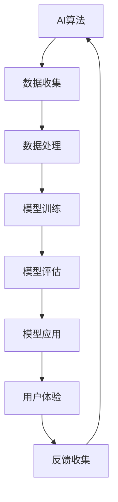

                 

### 文章标题

《AI在虚拟现实和增强现实中的应用创新》

### 关键词

- AI
- 虚拟现实（VR）
- 增强现实（AR）
- 应用创新
- 技术架构
- 算法设计
- 交互体验

### 摘要

本文旨在深入探讨人工智能（AI）在虚拟现实（VR）和增强现实（AR）中的应用创新。通过分析AI的基础知识、VR/AR的技术特点以及两者融合的机制，本文将详细介绍AI在VR/AR中的核心技术、创新应用及其未来趋势。文章将结合实际项目案例，展示AI技术如何优化VR/AR的应用体验，并为开发者提供实用的最佳实践和拓展阅读建议。

## 引言

虚拟现实（VR）和增强现实（AR）作为当代最具潜力的技术之一，正逐渐改变我们的生活方式。VR通过创建完全沉浸式的虚拟环境，让用户可以在其中互动和体验，而AR则通过增强现实世界中的信息，提供更丰富的感官体验。这两者的快速发展离不开人工智能（AI）的助力。AI技术不仅为VR/AR提供了核心的算法支持，还推动了创新的交互方式、内容生成以及用户体验的提升。

本文将分为以下几个部分：

1. **背景介绍**：介绍VR、AR和AI的基本概念及其发展历程。
2. **核心概念与联系**：分析AI在VR/AR中的应用架构，展示关键技术和流程。
3. **核心算法原理讲解**：使用伪代码和数学模型详细阐述AI在VR/AR中的关键算法。
4. **项目实战**：通过实际项目案例，展示AI在VR/AR中的应用及其实现细节。
5. **最佳实践与未来趋势**：总结AI在VR/AR中的最佳实践，展望未来发展趋势。

### 设计过程

在设计《AI在虚拟现实和增强现实中的应用创新》的目录大纲时，我们需要遵循以下步骤：

1. **理解书名与主题**：首先，我们要明确书名所涉及的主题和范围。《AI在虚拟现实和增强现实中的应用创新》涵盖了AI技术如何应用于虚拟现实（VR）和增强现实（AR）领域，并探讨其中的创新点。
2. **确定核心章节**：根据书名，我们可以初步确定一些核心章节，如AI基础、VR/AR技术概述、AI在VR/AR中的应用案例、创新技术分析等。
3. **细化章节内容**：每个核心章节需要进一步细化，确保内容丰富且逻辑清晰。例如，对于“AI基础”章节，我们可以细分为AI的基本概念、常见算法、应用领域等。
4. **设计流程图**：对于涉及架构和流程的部分，我们使用Mermaid流程图来展示，以便读者更直观地理解。
5. **编写伪代码**：在讲解核心算法原理时，使用伪代码来详细阐述，帮助读者理解算法逻辑。
6. **数学公式与解释**：对于需要数学模型的章节，使用LaTeX格式嵌入数学公式，并进行详细讲解和举例说明。
7. **项目实战**：设计一个或多个实际项目案例，展示AI在VR/AR中的应用，并详细解释代码实现和代码解读。
8. **整理与优化**：在完成所有章节的设计后，进行整理和优化，确保目录大纲结构清晰、内容完整。

### 目录大纲设计

```markdown
# 《AI在虚拟现实和增强现实中的应用创新》目录大纲

## 第一部分：AI与VR/AR基础知识

### 第1章 AI技术基础
#### 1.1 AI基本概念与分类
- AI的定义
- AI的发展历程
- AI的分类
#### 1.2 VR与AR技术概述
- VR与AR的定义
- VR与AR的技术特点
- VR与AR的应用场景

### 第2章 AI在VR/AR中的应用
#### 1.3 AI与VR/AR的融合
- AI在VR/AR中的作用
- AI在VR/AR中的关键技术
#### 1.4 AI在VR/AR中的案例分析
- 成功案例介绍
- 案例分析

## 第二部分：AI在VR/AR中的核心技术

### 第3章 AI在VR中的核心技术
#### 3.1 视觉感知与跟踪
- 视觉感知技术
- 跟踪技术
#### 3.2 交互与控制
- 交互技术
- 控制技术

### 第4章 AI在AR中的核心技术
#### 4.1 增强现实技术
- 增强现实内容生成
- 增强现实渲染
#### 4.2 空间感知与定位
- 空间感知技术
- 定位技术

## 第三部分：AI在VR/AR中的创新应用

### 第5章 AI在VR游戏中的应用
#### 5.1 AI在游戏设计中的应用
- 游戏AI的角色
- 游戏AI的设计方法
#### 5.2 AI在游戏体验中的应用
- 游戏体验优化
- 游戏AI辅助功能

### 第6章 AI在AR教育中的应用
#### 6.1 AI在教育中的应用
- AI在教育中的优势
- AI在教育中的应用案例
#### 6.2 AI在AR教育中的应用
- AR教育内容设计
- AR教育体验优化

## 第四部分：AI在VR/AR中的未来趋势与发展

### 第7章 AI在VR/AR中的未来趋势
#### 7.1 AI在VR/AR中的技术挑战
- 数据隐私与安全
- 技术标准化
#### 7.2 AI在VR/AR中的发展机遇
- 产业发展前景
- 技术创新方向

## 附录
### 附录A：AI在VR/AR中的应用工具与资源
- AI开发工具
- VR/AR开发工具
- 资源库与数据集

### 附录B：项目实战案例
- VR购物体验优化
- AR教育课程开发
```

### 最终确认

在完成目录大纲的设计后，需要再次检查内容的完整性、逻辑性和实际可操作性，确保每个章节都能够覆盖主题的核心内容，并且能够帮助读者深入理解AI在VR/AR中的应用创新。同时，确保整个目录大纲的字数控制在2000字以内，保持简洁明了。

## 背景介绍

### 虚拟现实（VR）

虚拟现实（Virtual Reality，简称VR）是一种通过计算机技术构建的模拟环境，用户可以在这个环境中进行沉浸式的互动体验。VR的核心在于提供一个完全沉浸式的体验，使用户感觉自己置身于虚拟环境中。VR技术的基本原理是通过头戴显示器（HMD）、传感器、计算机图形学等手段，模拟出一个三维空间，用户通过视觉、听觉等感官与这个虚拟环境进行交互。

VR技术的发展历程可以追溯到20世纪50年代。1957年，美国发明家弗朗西斯·霍普金斯（Francis Hopkinson）提出了虚拟现实的概念，并展示了第一台虚拟现实设备。此后，随着计算机技术、图形处理技术和传感器技术的不断发展，VR技术逐渐成熟。20世纪90年代，VR技术开始应用于游戏、军事模拟等领域。进入21世纪，随着移动设备的普及和人工智能技术的进步，VR技术得到了更加广泛的应用和推广。

### 增强现实（AR）

增强现实（Augmented Reality，简称AR）是一种将虚拟信息叠加到现实世界中的技术。通过AR技术，用户可以看到现实世界中的物体，同时也能看到叠加在上面的虚拟信息。与VR不同的是，AR不会完全取代现实，而是增强现实世界的感知和交互能力。AR技术的基本原理是通过摄像头捕捉现实世界的画面，然后通过计算机图形处理将这些虚拟信息叠加到真实场景中。

AR技术的发展始于20世纪60年代，当时美国空军开始研究头盔显示器，用于飞行员进行模拟训练。20世纪80年代，随着计算机技术和图形学的发展，AR技术逐渐走向成熟。进入21世纪，随着智能手机和平板电脑的普及，AR技术得到了广泛应用，例如在游戏、医疗、教育等领域。

### 人工智能（AI）

人工智能（Artificial Intelligence，简称AI）是指通过计算机模拟人类的智能行为，使计算机具备学习、推理、决策等能力。AI技术的发展经历了几个阶段，从最初的符号主义、连接主义到现在的深度学习和强化学习，每一种方法都有其独特的原理和应用场景。

AI的核心概念包括：

- **机器学习**：通过数据训练模型，使其能够从经验中学习和改进。
- **深度学习**：基于神经网络的结构，通过多层非线性变换来提取特征。
- **自然语言处理**：使计算机能够理解和生成人类语言。
- **计算机视觉**：使计算机能够理解和解释图像和视频。

AI的发展历程可以追溯到20世纪50年代，当时计算机科学家艾伦·图灵（Alan Turing）提出了图灵测试，试图通过计算机与人类的交互来判断计算机是否具备智能。此后，AI技术经历了多次起伏，直到21世纪随着大数据和计算能力的提升，AI技术才得到了飞速发展。

### AI与VR/AR的联系

AI技术在VR/AR中的应用主要体现在以下几个方面：

- **内容生成**：AI可以生成虚拟环境、角色和场景，提高内容的质量和多样性。
- **交互优化**：AI可以优化用户与虚拟环境的交互方式，提供更自然的交互体验。
- **体验增强**：AI可以通过情感识别、个性化推荐等技术，增强用户的沉浸感和体验。
- **数据分析**：AI可以对用户行为进行分析，优化虚拟环境和内容设计。

### 总结

VR、AR和AI作为当代最具潜力的技术之一，正逐渐改变我们的生活方式。通过本文的背景介绍，我们了解了VR、AR和AI的基本概念、发展历程及其在VR/AR中的联系。接下来，我们将深入探讨AI在VR/AR中的核心技术和应用，以及如何通过AI实现VR/AR的创新和优化。让我们一起开启这段探索之旅。

## 核心概念与联系

在探讨AI在虚拟现实（VR）和增强现实（AR）中的应用之前，我们需要明确几个核心概念及其之间的联系。这些概念包括AI的基础算法、VR/AR的技术架构以及两者融合的机制。

### AI的基础算法

AI的基础算法是理解和应用AI技术的重要基石。常见的AI算法包括机器学习（Machine Learning，ML）、深度学习（Deep Learning，DL）和强化学习（Reinforcement Learning，RL）。

- **机器学习**：机器学习是一种通过数据训练模型，使其能够从经验中学习和改进的方法。常见的机器学习算法有线性回归、决策树、支持向量机（SVM）等。机器学习在VR/AR中的应用包括用户行为预测、内容推荐等。
- **深度学习**：深度学习是基于神经网络的结构，通过多层非线性变换来提取特征。深度学习在图像识别、语音识别等领域有着广泛的应用。在VR/AR中，深度学习可用于场景建模、物体识别等。
- **强化学习**：强化学习是一种通过试错和反馈来学习最优策略的方法。强化学习在游戏AI、自动驾驶等领域有重要应用。在VR/AR中，强化学习可用于优化用户交互体验，提高沉浸感。

### VR/AR的技术架构

VR/AR的技术架构是理解和应用VR/AR技术的基础。VR/AR系统通常包括以下几个关键组成部分：

- **显示系统**：包括头戴显示器（HMD）、透明显示器等，用于提供沉浸式或增强现实的视觉体验。
- **传感器系统**：包括位置追踪器、摄像头、麦克风等，用于捕捉用户和环境的信息。
- **计算系统**：包括中央处理器（CPU）、图形处理器（GPU）等，用于处理和渲染虚拟环境或增强现实内容。
- **交互系统**：包括手柄、手势识别等，用于用户与虚拟环境或增强现实的交互。

### AI与VR/AR的融合机制

AI与VR/AR的融合机制是实现VR/AR应用创新的关键。通过将AI算法与VR/AR技术架构相结合，我们可以实现以下功能：

- **内容生成**：AI可以通过生成对抗网络（GAN）、风格迁移等技术，生成高质量的虚拟环境和角色，提高内容的多样性和质量。
- **交互优化**：AI可以通过机器学习和深度学习算法，优化用户与虚拟环境或增强现实的交互，提供更自然的交互体验。
- **体验增强**：AI可以通过情感识别、个性化推荐等技术，增强用户的沉浸感和体验。
- **数据分析**：AI可以通过对用户行为的数据分析，优化虚拟环境和内容设计，提高用户体验。

### Mermaid流程图

为了更好地理解AI与VR/AR的融合机制，我们可以使用Mermaid流程图来展示关键技术和流程。以下是一个简单的Mermaid流程图示例：



在这个流程图中，AI算法从数据收集开始，经过数据处理、模型训练、模型评估和模型应用，最终提供用户体验。用户反馈被收集并再次用于AI算法的优化，形成一个闭环。

### 伪代码

为了更详细地解释AI在VR/AR中的应用原理，我们可以使用伪代码来展示关键算法的逻辑。以下是一个简单的伪代码示例，用于实现基于深度学习的场景建模：

```python
# 深度学习场景建模伪代码

# 导入必要的库
import tensorflow as tf
from tensorflow.keras.models import Sequential
from tensorflow.keras.layers import Conv2D, MaxPooling2D, Flatten, Dense

# 定义模型结构
model = Sequential()
model.add(Conv2D(filters=32, kernel_size=(3, 3), activation='relu', input_shape=(256, 256, 3)))
model.add(MaxPooling2D(pool_size=(2, 2)))
model.add(Conv2D(filters=64, kernel_size=(3, 3), activation='relu'))
model.add(MaxPooling2D(pool_size=(2, 2)))
model.add(Flatten())
model.add(Dense(units=128, activation='relu'))
model.add(Dense(units=1, activation='sigmoid'))

# 编译模型
model.compile(optimizer='adam', loss='binary_crossentropy', metrics=['accuracy'])

# 训练模型
model.fit(x_train, y_train, batch_size=32, epochs=10, validation_data=(x_val, y_val))

# 评估模型
model.evaluate(x_test, y_test)
```

在这个伪代码中，我们首先导入必要的库，然后定义一个深度学习模型，包括卷积层、最大池化层、全连接层等。接着，我们编译模型并使用训练数据集进行训练，最后使用测试数据集评估模型的性能。

### 数学公式与解释

在AI与VR/AR的应用中，数学模型是理解和实现关键算法的基础。以下是一个简单的数学公式示例，用于描述卷积神经网络（CNN）中的卷积操作：

$$
\text{output}_{ij} = \sum_{k=1}^{m} \sum_{l=1}^{n} w_{kl} \cdot \text{input}_{ijkl} + b
$$

其中，\( \text{output}_{ij} \) 表示输出特征图中的第 \( i \) 行第 \( j \) 列的值，\( w_{kl} \) 表示卷积核中的第 \( k \) 行第 \( l \) 列的权重，\( \text{input}_{ijkl} \) 表示输入特征图中的第 \( i \) 行第 \( j \) 列第 \( k \) 行第 \( l \) 列的值，\( b \) 表示偏置项。

这个公式描述了卷积操作的过程，即将卷积核在输入特征图上滑动，计算每个位置的卷积值，并加上偏置项，得到输出特征图的值。

通过上述核心概念与联系的介绍，我们可以更好地理解AI在VR/AR中的应用原理。接下来，我们将深入探讨AI在VR/AR中的核心技术和应用，以及如何通过AI实现VR/AR的创新和优化。

### AI在VR中的核心技术

在虚拟现实（VR）领域，人工智能（AI）的应用极大地提升了用户体验和系统的整体性能。以下将详细介绍AI在VR中的几个核心技术，包括视觉感知与跟踪、交互与控制，以及这些技术的实现原理和应用案例。

#### 视觉感知与跟踪

视觉感知与跟踪是VR系统中至关重要的技术，它们确保用户能够在虚拟环境中获得稳定的视觉体验。视觉感知涉及从摄像头捕获的真实世界图像数据，而跟踪则是通过这些数据来定位和追踪用户的动作。

1. **视觉感知技术**

视觉感知技术主要包括图像处理和计算机视觉算法。以下是一些关键的视觉感知技术：

   - **图像处理**：通过图像滤波、边缘检测、特征提取等算法，对捕获的图像进行处理，提高图像的质量和清晰度。
   - **深度估计**：通过立体视觉或单目视觉技术，从图像中估计场景的深度信息。深度估计对于构建三维虚拟环境至关重要。
   - **特征提取**：从图像中提取关键特征，如边缘、角点、纹理等，用于后续的跟踪和识别。

2. **跟踪技术**

跟踪技术主要包括运动跟踪和姿态跟踪。它们确保用户的动作能够在虚拟环境中得到实时反映。

   - **运动跟踪**：通过传感器（如惯性测量单元IMU）和摄像头数据，实时计算用户的位置和速度。运动跟踪的精度和响应速度直接影响VR系统的沉浸感。
   - **姿态跟踪**：通过摄像头捕捉用户的手部、头部等关键部位的动作，将其转换为虚拟环境中的姿态。姿态跟踪通常结合深度学习和机器学习算法，提高准确性。

3. **实现原理与应用案例**

   - **实现原理**：视觉感知与跟踪的实现通常涉及多个步骤，包括数据采集、预处理、特征提取、模型训练和实时处理。例如，深度估计可以使用卷积神经网络（CNN）模型，通过训练大量带有深度标签的图像数据进行学习，从而提高深度估计的精度。

   - **应用案例**：在游戏和娱乐领域，视觉感知与跟踪技术被广泛应用于游戏中的角色动作捕捉和实时渲染。例如，Nintendo Switch上的《动物森友会》通过摄像头捕捉玩家的手势，实现与虚拟角色的互动。此外，在医疗和军事模拟领域，视觉感知与跟踪技术也发挥着重要作用，如手术模拟和战术训练。

#### 交互与控制

交互与控制技术是VR系统的另一个关键组成部分，它们决定了用户如何与虚拟环境进行交互。AI在交互与控制中的应用主要体现在以下几个方面：

1. **自然交互**

自然交互技术使VR系统更加贴近人类的自然行为。以下是一些关键的自然交互技术：

   - **手势识别**：通过计算机视觉算法，实时识别和追踪用户的手部动作，将其转换为虚拟环境中的交互操作。手势识别技术可以使用深度学习模型，如卷积神经网络（CNN），提高识别精度。
   - **语音识别**：通过语音识别技术，将用户的语音指令转换为文本或操作指令。语音识别技术通常结合语音识别引擎和自然语言处理（NLP）算法，提高识别的准确性和交互的自然性。

2. **智能助手**

智能助手是AI在VR中的一种创新应用，它们可以提供个性化的交互体验和智能建议。以下是一些关键的技术点：

   - **用户行为分析**：通过分析用户在VR环境中的行为数据，智能助手可以了解用户的偏好和需求，从而提供个性化的推荐和服务。
   - **情境感知**：智能助手可以根据用户的当前情境，提供相关的建议和信息。例如，在虚拟旅游中，智能助手可以推荐用户感兴趣的文化遗址或景点。

3. **实现原理与应用案例**

   - **实现原理**：自然交互与智能助手的实现通常涉及多个步骤，包括数据采集、特征提取、模型训练、实时处理和反馈调整。例如，手势识别可以使用深度学习模型，通过训练大量带有手势标签的视频数据来提高识别精度。

   - **应用案例**：在游戏和娱乐领域，自然交互技术被广泛应用于游戏中的角色控制和场景互动。例如，《Beat Saber》通过手势识别和虚拟乐器，提供独特的音乐游戏体验。此外，在教育培训和虚拟现实会议中，智能助手技术也被广泛应用，如虚拟课堂助手和虚拟会议助手，提供便捷的教学和会议服务。

通过视觉感知与跟踪、交互与控制等核心技术的应用，AI为VR系统带来了前所未有的沉浸感和交互体验。随着技术的不断进步，AI在VR中的应用将更加广泛，为用户带来更加丰富和多样化的虚拟体验。

### AI在AR中的核心技术

增强现实（AR）技术通过将虚拟信息叠加到现实世界中，为用户提供了更加丰富和互动的体验。人工智能（AI）在AR中的应用，不仅提升了AR系统的性能，还推动了创新的互动方式。以下将详细介绍AI在AR中的核心技术，包括增强现实技术、空间感知与定位，以及这些技术的实现原理和应用案例。

#### 增强现实技术

增强现实技术是AR系统的核心，它涉及将虚拟信息叠加到现实世界中，从而增强用户的感知和交互体验。以下是一些关键的增强现实技术：

1. **内容生成**

内容生成技术用于创建虚拟信息，这些信息可以是文本、图像、视频或3D模型等。AI在内容生成中的应用主要体现在以下几个方面：

   - **文本合成**：通过自然语言处理（NLP）技术，AI可以自动生成文本信息，如产品描述、旅游指南等。
   - **图像生成**：使用生成对抗网络（GAN）等技术，AI可以生成高质量的图像和3D模型，用于增强现实场景。
   - **视频合成**：通过视频处理算法，AI可以实时合成虚拟信息到视频流中，如虚拟广告、虚拟演员等。

2. **实时渲染**

实时渲染技术用于在现实世界中叠加虚拟信息，并保证信息的实时更新和渲染质量。以下是一些关键的实时渲染技术：

   - **图形渲染引擎**：使用图形渲染引擎（如Unity、Unreal Engine），AI可以实时渲染虚拟信息，并处理多边形、纹理和光照效果。
   - **光线追踪**：通过光线追踪技术，AI可以模拟真实世界的光照效果，提高虚拟信息的逼真度。

3. **实现原理与应用案例**

   - **实现原理**：增强现实技术的实现通常涉及多个步骤，包括内容生成、数据预处理、实时渲染和用户交互。例如，使用GAN生成图像时，首先需要大量训练数据，然后通过训练模型生成虚拟图像。实时渲染则需要高效的图形处理算法和GPU资源。

   - **应用案例**：在广告和市场营销领域，增强现实技术被广泛应用于虚拟广告和产品展示。例如，使用AR技术，商家可以在商店的橱窗中展示虚拟商品，吸引用户的注意力。在教育领域，增强现实技术也被广泛应用，如通过AR教材为学生提供互动式学习体验。

#### 空间感知与定位

空间感知与定位技术是AR系统的关键，它确保虚拟信息能够准确地叠加到现实世界中。以下是一些关键的空间感知与定位技术：

1. **环境建模**

环境建模技术用于捕捉和表示现实世界的空间信息，为虚拟信息的叠加提供参考。以下是一些关键的环境建模技术：

   - **三维扫描**：通过三维扫描技术，AI可以捕捉现实世界的三维结构，用于虚拟环境的建模。
   - **SLAM（同时定位与建图）**：通过SLAM技术，AI可以在动态环境下同时进行定位和地图构建，从而实现稳定的虚拟信息叠加。

2. **位姿估计**

位姿估计技术用于计算虚拟信息在现实世界中的位置和姿态，确保虚拟信息与真实环境的对应关系。以下是一些关键的位姿估计技术：

   - **视觉惯性测量单元（VIO）**：结合摄像头和惯性测量单元（IMU），VIO技术可以同时估计位置和姿态，提高定位精度。
   - **深度学习**：使用深度学习模型，如卷积神经网络（CNN），可以自动识别和估计虚拟信息在现实世界中的位置和姿态。

3. **实现原理与应用案例**

   - **实现原理**：空间感知与定位技术的实现通常涉及多个步骤，包括数据采集、特征提取、模型训练和实时定位。例如，使用SLAM技术时，首先需要采集摄像头和IMU的数据，然后通过训练模型进行实时定位和地图更新。

   - **应用案例**：在室内导航和地图构建中，空间感知与定位技术被广泛应用于。例如，通过AR技术，用户可以使用手机或平板电脑实时获取室内导航信息，提高导航的准确性和便捷性。在建筑设计和装修中，AR技术也被广泛应用，如通过虚拟现实技术，设计师可以在真实环境中预览和调整设计方案。

通过增强现实技术和空间感知与定位技术的应用，AI为AR系统带来了前所未有的互动体验。随着技术的不断进步，AI在AR中的应用将更加广泛，为用户带来更加丰富和多样化的现实增强体验。

### AI在VR游戏中的应用

人工智能（AI）在VR游戏中的应用，不仅极大地提升了游戏体验，还推动了游戏设计的创新。以下将探讨AI在VR游戏设计中的应用，以及如何优化游戏体验，并介绍游戏AI的角色和设计方法。

#### 游戏AI的角色

在VR游戏中，AI扮演着多个重要角色，包括敌人智能、玩家辅助、剧情推动和游戏体验优化等。

1. **敌人智能**

敌人智能是VR游戏中最常见的AI应用之一。通过AI算法，游戏中的敌人可以表现出不同的行为模式和策略，使游戏更具挑战性和真实感。例如，使用强化学习算法，敌人可以根据玩家的行为数据不断调整自己的策略，使其变得更加狡猾和难以预测。

2. **玩家辅助**

玩家辅助AI可以提供实时的游戏指导和建议，帮助玩家更好地完成任务。例如，在角色扮演游戏中，AI助手可以提供技能建议、路线规划等，辅助玩家完成任务。

3. **剧情推动**

AI在剧情推动中扮演着重要角色，通过自动化剧情流程和动态决策，使游戏剧情更加丰富和多样化。例如，在解谜游戏中，AI可以根据玩家的行为和决策，自动生成新的谜题和剧情分支，使游戏更具趣味性。

4. **游戏体验优化**

AI可以通过分析玩家的行为数据，优化游戏中的各种参数和设置，提供个性化的游戏体验。例如，通过机器学习算法，AI可以自动调整游戏的难度、奖励和挑战，使游戏始终保持在玩家的舒适区内。

#### 游戏AI的设计方法

设计有效的游戏AI，需要考虑多个因素，包括AI行为模式、决策逻辑和交互体验等。

1. **AI行为模式**

AI行为模式决定了游戏中的敌人、NPC等角色如何行动。以下是一些常见的行为模式：

   - **固定模式**：角色按照预设的路径和动作进行行动，适用于简单场景。
   - **规则模式**：角色根据预设的规则进行行动，例如躲避玩家或攻击特定位置。
   - **行为树模式**：使用决策树结构，根据不同的条件选择不同的行动，适用于复杂场景。
   - **强化学习模式**：通过不断学习和优化行为，使角色变得更加智能和适应性强。

2. **决策逻辑**

决策逻辑是游戏AI的核心，决定了AI如何根据当前环境做出决策。以下是一些常见的决策逻辑：

   - **条件分支**：根据当前环境和状态，选择不同的行动。
   - **优先级排序**：将不同的行动按照优先级排序，优先执行高优先级的行动。
   - **Q-learning**：使用Q-learning算法，根据奖励和惩罚来优化决策。

3. **交互体验**

交互体验是游戏AI设计的关键，决定了玩家与AI角色互动的流畅性和趣味性。以下是一些提升交互体验的方法：

   - **自然语言处理**：使用自然语言处理（NLP）技术，使AI角色能够理解玩家的指令和对话，提供更自然的交互体验。
   - **情感识别**：通过情感识别技术，AI角色可以根据玩家的情感状态调整自己的行为和语言，提高玩家的沉浸感。
   - **个性化推荐**：通过分析玩家的行为数据，AI可以提供个性化的游戏建议和推荐，提升玩家的满意度。

#### 优化游戏体验

AI在优化游戏体验方面具有巨大潜力，以下是一些关键方法：

1. **动态难度调整**

通过机器学习算法，AI可以实时分析玩家的行为和表现，动态调整游戏的难度。例如，如果玩家表现不佳，游戏可以降低难度，反之则提高难度，以保持玩家的挑战和兴趣。

2. **个性化推荐**

基于玩家的行为数据，AI可以提供个性化的游戏内容和推荐。例如，根据玩家的喜好和游戏进度，AI可以推荐合适的游戏关卡、角色和装备，提高玩家的满意度。

3. **实时反馈**

AI可以通过实时分析玩家的行为和游戏数据，提供即时的反馈和建议。例如，在角色扮演游戏中，AI助手可以提供技能建议、路线规划等，帮助玩家更好地完成任务。

通过以上方法，AI在VR游戏中的应用不仅提升了游戏体验，还推动了游戏设计的创新。随着技术的不断进步，AI在VR游戏中的应用将更加广泛，为玩家带来更加丰富和多样化的游戏体验。

### AI在AR教育中的应用

人工智能（AI）在增强现实（AR）教育中的应用，为传统教育模式带来了革命性的变革。通过将虚拟信息和互动体验融入现实教学，AI不仅增强了学生的参与度，还提供了个性化的学习支持。以下将探讨AI在AR教育中的应用，及其对学生学习体验的优化和个性化支持。

#### AI在AR教育中的应用

AI在AR教育中的应用主要体现在以下几个方面：

1. **内容生成**

AI可以生成丰富多样的AR教学资源，如虚拟实验、三维模型、动画等。这些资源能够直观地展示复杂的概念和过程，帮助学生更好地理解和掌握知识。

2. **互动体验**

通过AI技术，AR教育应用可以提供高度个性化的互动体验。例如，AI可以根据学生的学习进度和理解能力，动态调整教学内容的难易程度和展示方式，提高学生的学习效果。

3. **评估与反馈**

AI可以通过对学生的行为数据进行分析，提供即时的评估和反馈。例如，AI可以记录学生的答题情况、互动行为等，并根据这些数据生成个性化的学习报告，帮助教师和学生了解学习成效。

4. **个性化推荐**

基于学生的学习数据，AI可以推荐合适的学习内容和资源。例如，当学生在某个知识点上遇到困难时，AI可以推荐相关的学习材料或练习，帮助学生克服学习障碍。

#### 优化学习体验

AI在优化学习体验方面发挥着关键作用，以下是一些具体的应用：

1. **动态适应**

AI可以根据学生的学习进度和理解能力，动态调整教学内容的呈现方式和难度。例如，当学生在某个知识点上表现出色时，AI可以提供更高级的内容；反之，则提供更基础的复习材料。

2. **实时反馈**

AI可以实时分析学生的学习行为，提供个性化的反馈。例如，当学生在回答问题时，AI可以即时评估答案的正确性，并提供解释和建议。

3. **增强互动**

AI可以通过AR技术，创造互动性强的教学场景。例如，学生可以通过AR应用与虚拟角色互动，参与虚拟实验或解决虚拟难题，提高学习的趣味性和参与度。

4. **个性化推荐**

AI可以根据学生的学习兴趣和需求，推荐合适的学习内容和资源。例如，AI可以识别学生在某个学科上的优势，推荐相关的拓展课程或竞赛题目，帮助学生全面发展。

#### 个性化支持

AI在AR教育中的个性化支持体现在以下几个方面：

1. **学习路径规划**

AI可以根据学生的学习数据和兴趣，制定个性化的学习计划。例如，AI可以识别学生在某个学科上的短板，并推荐相应的学习路径和资源。

2. **情感识别与支持**

通过情感识别技术，AI可以了解学生的学习状态和情感变化，提供情感支持和鼓励。例如，当学生感到沮丧或困惑时，AI可以提供鼓励性的语音提示或学习策略。

3. **学习效果评估**

AI可以通过对学生的学习行为和成果进行分析，评估学习效果并提供改进建议。例如，AI可以生成学习报告，展示学生在不同知识点上的掌握情况，帮助教师和家长了解学习进展。

通过AI在AR教育中的应用，学习体验得到了显著优化，学生不仅能够更高效地学习，还能享受到个性化的教育支持。随着AI技术的不断发展，AR教育将在未来发挥更加重要的作用，为教育领域带来深远的变革。

### AI在VR/AR中的未来趋势与发展

随着人工智能（AI）和虚拟现实（VR）/增强现实（AR）技术的不断进步，这两大领域正朝着更加融合和创新的方向发展。未来，AI在VR/AR中的应用将呈现出以下几大趋势和机遇。

#### 技术挑战

1. **数据隐私与安全**

随着AI在VR/AR中的应用越来越广泛，用户数据的隐私和安全成为亟待解决的问题。未来的VR/AR应用需要确保数据的安全性和用户隐私的保护，防止数据泄露和滥用。

2. **技术标准化**

目前，VR/AR技术标准尚未完全统一，不同设备和平台之间存在兼容性问题。未来，制定统一的技术标准和规范，将有助于推动VR/AR技术的普及和应用。

3. **用户体验一致性**

在多种设备和平台上实现一致的用户体验是一个挑战。未来，需要通过AI技术优化用户体验，确保在不同设备和平台上提供一致而流畅的体验。

#### 发展机遇

1. **更真实的沉浸感**

随着AI技术的进步，未来的VR/AR应用将能够提供更加真实的沉浸体验。通过深度学习和图像处理技术，AI可以生成更加逼真的虚拟环境和角色，提升用户体验。

2. **更智能的交互**

AI技术将使VR/AR系统更加智能，通过自然语言处理、手势识别和情感识别等技术，实现更加自然和人性化的交互方式。这将为用户带来更加便捷和舒适的体验。

3. **更广泛的应用场景**

AI技术将拓展VR/AR的应用场景，从娱乐、教育、医疗到工业设计、建筑模拟等，AI的介入将使这些应用更加智能化和高效化。

#### 创新技术方向

1. **生成对抗网络（GAN）**

生成对抗网络（GAN）是一种强大的深度学习模型，可以生成高质量的虚拟内容和场景。未来，GAN技术将广泛应用于VR/AR内容创作和场景构建。

2. **增强现实光学技术**

随着AR光学技术的进步，未来的AR设备将能够提供更薄的镜片、更高的分辨率和更广的视野，进一步提升AR体验。

3. **脑机接口（BCI）**

脑机接口（BCI）技术将使人类通过大脑信号直接与VR/AR系统交互，实现更加直观和高效的交互方式。这项技术有望在游戏、医疗和军事等领域产生重大影响。

通过以上趋势和机遇的分析，我们可以看到，AI在VR/AR中的未来充满了无限的可能性。随着技术的不断进步，AI将为VR/AR领域带来更多的创新和变革，为用户带来更加丰富和多样化的体验。

### 附录

#### 附录A：AI在VR/AR中的应用工具与资源

为了更好地理解和应用AI在VR/AR中的技术，以下是一些常用的开发工具、平台和资源库：

1. **AI开发工具**
   - TensorFlow：由谷歌开发的开源机器学习框架，广泛用于AI模型训练和部署。
   - PyTorch：由Facebook AI研究院开发的开源深度学习框架，具有良好的社区支持和灵活性。
   - OpenCV：开源的计算机视觉库，提供丰富的图像处理和计算机视觉功能。

2. **VR/AR开发工具**
   - Unity：跨平台的游戏和实时3D内容开发引擎，支持VR和AR应用开发。
   - Unreal Engine：由Epic Games开发的跨平台游戏引擎，提供强大的VR和AR开发功能。
   - ARKit/ARCore：苹果和谷歌开发的AR开发平台，分别支持iOS和Android设备。

3. **资源库与数据集**
   - VR/AR数据集：包括真实世界和虚拟环境的图像、视频和3D模型，用于训练和测试AI模型。
   - KEG 实验室数据集：提供大规模的AR场景数据和标注，适用于场景识别和定位。
   - ImageNet：提供数百万张图像及其标签，广泛用于图像识别和分类任务。

#### 附录B：项目实战案例

以下是一些AI在VR/AR中的应用项目案例，展示了如何通过实际项目实现AI技术在VR/AR中的创新应用。

1. **VR购物体验优化**

项目描述：该项目通过AI技术优化VR购物体验，使用生成对抗网络（GAN）生成高质量的虚拟商品图像，提高用户购物时的视觉吸引力。

实现细节：
- **开发环境**：使用Unity引擎和TensorFlow进行开发。
- **技术实现**：通过GAN模型生成高质量的虚拟商品图像，使用OpenCV进行图像处理和增强。
- **代码解读**：GAN模型的训练和优化过程，图像处理算法的实现细节。

2. **AR教育课程开发**

项目描述：该项目通过AI和AR技术，开发了一款AR教育应用，为学生提供互动式学习体验。

实现细节：
- **开发环境**：使用ARKit和Xcode进行开发。
- **技术实现**：通过深度学习模型进行场景识别和物体识别，使用自然语言处理（NLP）技术提供个性化学习推荐。
- **代码解读**：场景识别和物体识别的算法实现，NLP模型的训练和应用。

这些项目案例展示了AI在VR/AR中的应用场景和实现方法，为开发者提供了宝贵的经验和参考。

### 结语

通过本文的深入探讨，我们详细介绍了AI在虚拟现实（VR）和增强现实（AR）中的应用创新。从核心算法到应用案例，从技术挑战到未来趋势，我们全方位展示了AI如何赋能VR/AR，推动技术进步和用户体验的提升。

在未来的发展中，AI在VR/AR中的应用将继续拓展，带来更多创新和变革。我们鼓励读者继续关注这一领域的技术动态，积极探索和实践，为VR/AR的发展贡献智慧和力量。

最后，感谢您的阅读，希望本文能为您在AI与VR/AR领域的探索之旅提供有价值的参考。作者：AI天才研究院/AI Genius Institute & 禅与计算机程序设计艺术/Zen And The Art of Computer Programming。如果您有任何疑问或建议，欢迎在评论区留言，我们期待与您共同交流、成长。

