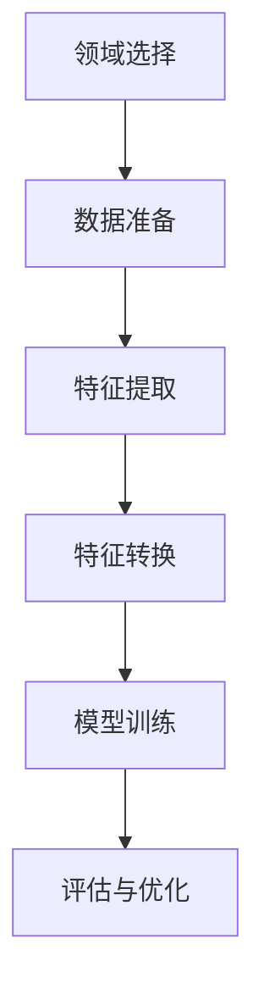
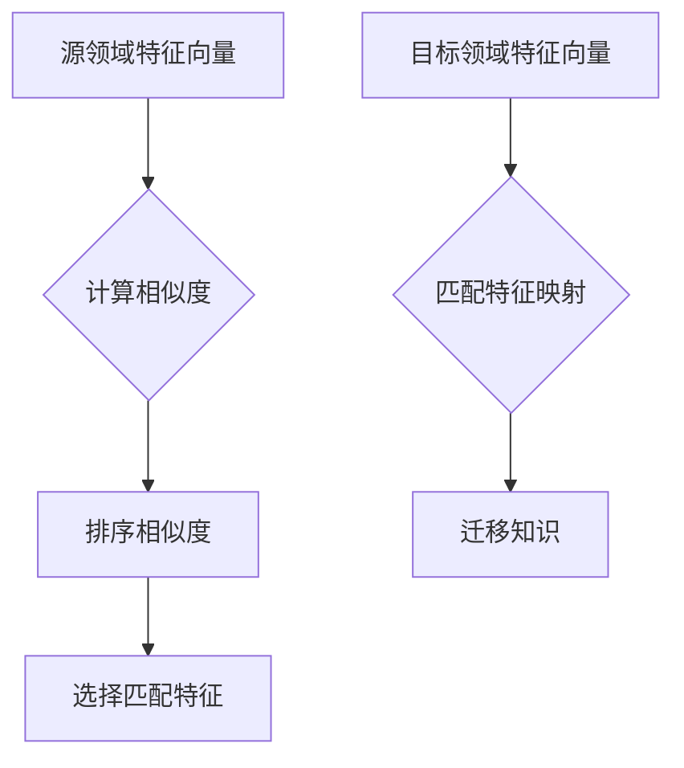
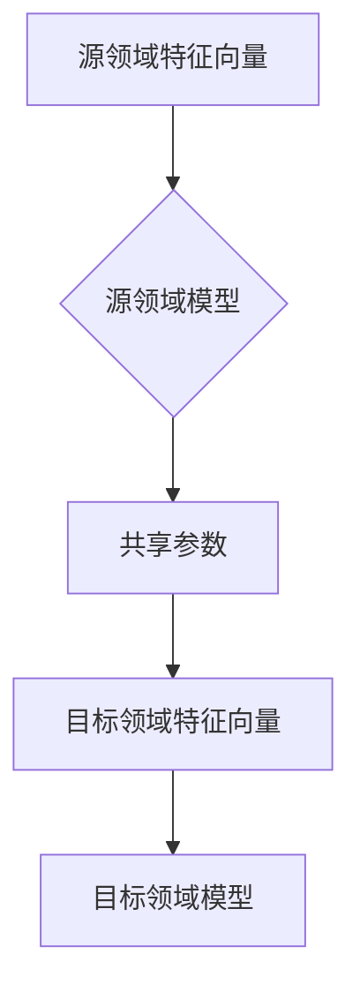
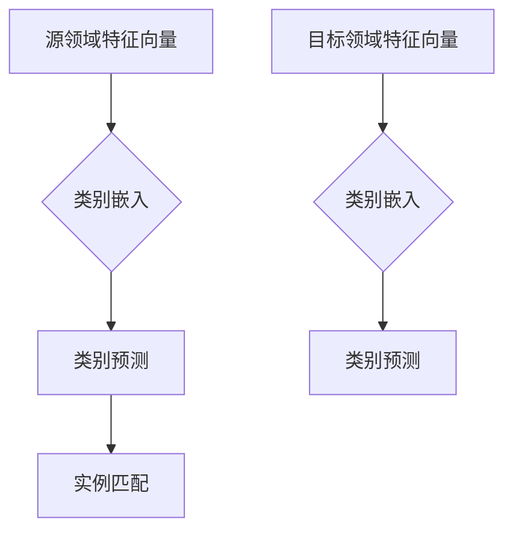

                 

### 文章标题：AI在跨领域知识迁移中的应用与挑战

#### 关键词：知识迁移，跨领域，人工智能，应用挑战，算法，数据不足，语义差异，算法优化

#### 摘要：本文详细探讨了人工智能在跨领域知识迁移中的应用与面临的挑战。首先，介绍了知识迁移的基本概念、分类和重要性，以及跨领域知识迁移的概念和关键技术。接着，分析了知识迁移中可能遇到的主要挑战，包括数据不足、语义差异和技术障碍，并探讨了相应的解决方案。随后，本文详细阐述了基于特征的方法和基于模型的方法，以及这些方法的实际应用场景。最后，通过案例研究，深入分析了跨领域知识迁移的具体实现过程和技术难点，总结了当前知识迁移技术的现状和未来发展方向。### 核心概念与联系

#### 1.1 知识迁移概述

知识迁移是指将一个领域中的知识应用于另一个相关领域，以提高任务表现的过程。在人工智能领域，知识迁移尤其重要，因为通过迁移学习，模型可以快速适应新的任务，无需从头开始训练。知识迁移可以按照不同的维度进行分类：

- **水平迁移**：在同一级别的不同任务间迁移知识，如不同类型图像的分类任务。
- **垂直迁移**：在不同级别或领域间迁移知识，如从生物医学知识迁移到机械工程领域。
- **跨领域迁移**：在不同领域间迁移知识，如从金融领域迁移到医疗领域。

知识迁移在AI领域的重要性体现在多个方面。首先，它能够减少训练数据的需求，加速模型训练过程。其次，它能够提高模型的泛化能力，使模型更适应多变的环境。最后，它能够降低开发成本，通过复用已有知识，提高研发效率。

#### 1.2 跨领域知识迁移的基本概念

跨领域知识迁移涉及将一个领域的知识迁移到另一个领域。这种迁移面临以下主要挑战：

- **数据不足**：不同领域的数据量可能差异很大，一些领域可能没有足够的标注数据。
- **语义差异**：不同领域的术语和概念可能不同，导致语义理解上的困难。
- **技术障碍**：不同领域的知识表示和模型结构可能不同，增加了迁移的难度。

为了应对这些挑战，研究人员提出了一系列关键技术，包括基于特征的方法和基于模型的方法。这些方法通过不同的策略，试图克服跨领域知识迁移中的障碍。

#### 1.3 知识迁移的关键技术

**基于特征的方法**

基于特征的方法通过转换或匹配特征，实现跨领域知识迁移。以下是一些典型的技术：

- **特征匹配算法**：通过计算源领域和目标领域的特征之间的相似度，将特征映射到共同的空间。
  ```mermaid
  graph TD
    A[特征匹配算法] --> B{特征空间对齐}
    B --> C{特征映射}
    B --> D{特征融合}
  ```

- **特征转换算法**：通过学习一个转换函数，将源领域的特征转换为适用于目标领域的特征。
  ```mermaid
  graph TD
    A[特征转换算法] --> B{特征嵌入}
    B --> C{特征变换}
    B --> D{特征投影}
  ```

**基于模型的方法**

基于模型的方法通过迁移学习模型，实现知识迁移。以下是一些典型的技术：

- **迁移学习模型**：通过在源领域和目标领域间共享部分模型参数，实现知识的迁移。
  ```mermaid
  graph TD
    A[迁移学习模型] --> B{源领域模型}
    B --> C{目标领域模型}
    B --> D{共享参数}
  ```

- **零样本学习**：在不依赖目标领域训练数据的情况下，直接利用源领域的知识，预测目标领域的未知类别。
  ```mermaid
  graph TD
    A[零样本学习] --> B{类别嵌入}
    B --> C{类别预测}
    B --> D{实例匹配}
  ```

- **多任务学习**：通过同时训练多个相关任务，提高模型在不同领域间的泛化能力。
  ```mermaid
  graph TD
    A[多任务学习] --> B{共享表示空间}
    B --> C{任务权重调整}
    B --> D{任务交互}
  ```

#### 1.4 跨领域知识迁移的框架与流程

跨领域知识迁移通常包括以下几个步骤：

1. **领域选择**：选择源领域和目标领域。
2. **数据准备**：收集并清洗源领域和目标领域的数据。
3. **特征提取**：从数据中提取特征。
4. **特征转换**：使用特征匹配或特征转换方法，将源领域特征转换为适用于目标领域的特征。
5. **模型训练**：在目标领域上训练迁移后的模型。
6. **评估与优化**：评估模型在目标领域的表现，并进行优化。



通过上述步骤，可以实现对跨领域知识的迁移和应用。接下来，本文将深入探讨跨领域知识迁移中可能遇到的挑战，并介绍相应的解决方案。### 知识迁移的挑战

#### 2.1 数据不足的解决方案

数据不足是跨领域知识迁移中的一个主要挑战，特别是在目标领域缺乏大量标注数据的情况下。为了解决数据不足的问题，可以采用以下几种方法：

**2.1.1 数据增强技术**

数据增强是通过各种方式增加数据量和多样性，从而提升模型性能的技术。以下是一些常用的数据增强方法：

- **数据扩充**：通过在原始数据上添加噪声、变换或合成新样本，增加数据的多样性。
  ```python
  def augment_data(data):
      for sample in data:
          # 添加随机噪声
          sample['feature'] += np.random.normal(0, 0.1)
          # 随机变换
          sample['label'] *= -1
      return data
  ```

- **数据合成**：通过生成虚拟数据或利用现有数据生成新样本，来扩充数据集。
  ```python
  def synthesize_data(data, num_samples):
      new_samples = []
      for _ in range(num_samples):
          # 生成虚拟特征
          virtual_features = generate_virtual_features()
          # 生成虚拟标签
          virtual_label = generate_virtual_label()
          new_samples.append({'feature': virtual_features, 'label': virtual_label})
      return new_samples
  ```

**2.1.2 无监督学习方法**

无监督学习方法可以在没有标注数据的情况下，通过学习数据的内在结构，提升模型的性能。以下是一些无监督学习方法：

- **对偶学习**：通过学习源领域和目标领域的对偶特征，实现对目标领域的预测。
  ```mermaid
  graph TD
      A[源领域特征] --> B{特征提取器}
      B --> C[目标领域特征]
      C --> D{特征提取器}
      A --> E{对偶特征映射}
      C --> F{对偶特征映射}
      E --> G[损失函数]
      F --> G
  ```

- **自编码器**：通过训练自编码器，学习数据的有效表示，从而增强模型的泛化能力。
  ```python
  def train_autoencoder(data, latent_dim):
      # 定义自编码器模型
      autoencoder = Sequential()
      autoencoder.add(Dense(latent_dim, input_shape=(data.shape[1],), activation='relu'))
      autoencoder.add(Dense(data.shape[1], activation='sigmoid'))
      # 编译模型
      autoencoder.compile(optimizer='adam', loss='binary_crossentropy')
      # 训练模型
      autoencoder.fit(data, data, epochs=100, batch_size=32, shuffle=True)
  ```

#### 2.2 语义差异的处理方法

语义差异是跨领域知识迁移中的另一个重要挑战。不同领域的数据往往具有不同的语义结构，导致模型难以直接迁移。以下是一些处理语义差异的方法：

**2.2.1 语义映射技术**

语义映射技术通过学习源领域和目标领域的语义关系，将特征映射到共同的空间。以下是一些常用的语义映射技术：

- **语义空间建模**：通过构建源领域和目标领域的语义空间，并学习它们之间的映射关系。
  ```mermaid
  graph TD
      A[源领域特征] --> B{语义空间建模}
      B --> C[目标领域特征]
      C --> D{语义空间建模}
      A --> E[映射函数]
      C --> F[映射函数]
  ```

- **语义相似度计算**：通过计算源领域和目标领域特征的语义相似度，确定它们在共同空间中的相对位置。
  ```python
  def semantic_similarity(source_feature, target_feature):
      # 计算特征之间的余弦相似度
      return np.dot(source_feature, target_feature) / (np.linalg.norm(source_feature) * np.linalg.norm(target_feature))
  ```

**2.2.2 语境敏感方法**

语境敏感方法通过考虑上下文信息，提高语义理解的能力。以下是一些常用的语境敏感方法：

- **上下文嵌入模型**：通过将上下文信息嵌入到特征表示中，提高模型对上下文的敏感性。
  ```mermaid
  graph TD
      A[源领域特征] --> B{上下文嵌入模型}
      B --> C[目标领域特征]
      C --> D{上下文嵌入模型}
      A --> E{上下文信息嵌入}
      C --> F{上下文信息嵌入}
  ```

- **语言模型适应**：通过训练目标领域的语言模型，适应目标领域的语义结构。
  ```python
  def adapt_language_model(target_data, source_model, target_model):
      # 使用源模型提取特征
      source_features = source_model.predict(target_data)
      # 使用目标模型更新特征
      target_features = target_model.predict(source_features)
      return target_features
  ```

#### 2.3 技术障碍的突破

跨领域知识迁移还需要克服一系列技术障碍，包括算法优化和硬件加速等。以下是一些常见的解决方案：

**2.3.1 算法优化**

算法优化是通过改进学习算法，提高模型性能和效率。以下是一些常见的算法优化方法：

- **梯度下降优化**：通过调整学习率、批量大小等参数，优化梯度下降算法，提高模型收敛速度。
  ```python
  def gradient_descent(inputs, targets, learning_rate, batch_size):
      # 计算梯度
      gradients = compute_gradients(inputs, targets)
      # 更新模型参数
      for param, grad in zip(model.parameters(), gradients):
          param -= learning_rate * grad
  ```

- **随机搜索优化**：通过随机选择搜索方向，优化模型参数，提高搜索效率。
  ```python
  def random_search(inputs, targets, num_iterations):
      for _ in range(num_iterations):
          # 随机选择参数更新方向
          direction = np.random.normal(size=model.parameters().shape)
          # 更新模型参数
          for param in model.parameters():
              param -= learning_rate * direction[param]
  ```

**2.3.2 硬件加速**

硬件加速是通过利用高性能硬件（如GPU、FPGA等），提高模型训练和推理的速度。以下是一些常见的硬件加速方法：

- **GPU加速**：通过使用GPU并行计算，加速模型训练和推理。
  ```python
  def train_on_gpu(model, inputs, targets):
      # 将模型和数据转移到GPU
      model.to('cuda')
      inputs, targets = inputs.to('cuda'), targets.to('cuda')
      # 训练模型
      model.train(inputs, targets)
  ```

- **FPGA应用**：通过使用FPGA硬件，实现模型的加速和定制化。
  ```mermaid
  graph TD
      A[模型定义] --> B{FPGA编译}
      B --> C[硬件加速]
      C --> D{模型推理}
  ```

通过上述方法，可以克服跨领域知识迁移中的技术障碍，实现有效的知识迁移。接下来，本文将详细探讨知识迁移的方法与算法，以进一步理解其在实际应用中的作用。### 知识迁移的方法与算法

#### 3.1 基于特征的方法

基于特征的方法是通过特征转换和匹配，将源领域的知识迁移到目标领域。这种方法的核心思想是找到源领域和目标领域之间的特征映射关系，从而实现知识迁移。以下是几种常用的基于特征的方法：

**3.1.1 特征匹配算法**

特征匹配算法通过计算源领域和目标领域特征之间的相似度，实现特征匹配和迁移。以下是一个简化的特征匹配算法：



具体实现步骤如下：

1. **计算相似度**：计算源领域特征向量和目标领域特征向量之间的相似度，通常使用余弦相似度或欧氏距离。
   ```python
   def cosine_similarity(source_feature, target_feature):
       return np.dot(source_feature, target_feature) / (np.linalg.norm(source_feature) * np.linalg.norm(target_feature))
   ```

2. **排序相似度**：将相似度结果排序，选择相似度最高的特征进行匹配。

3. **选择匹配特征**：从源领域选择与目标领域特征最相似的若干个特征，进行映射和迁移。

4. **匹配特征映射**：将源领域特征映射到目标领域特征，通常通过线性变换或非线性映射实现。

5. **迁移知识**：利用匹配后的特征，更新目标领域的特征表示，实现知识迁移。

**3.1.2 特征转换算法**

特征转换算法通过学习一个转换函数，将源领域的特征转换为适用于目标领域的特征。这种方法的核心思想是找到一种有效的特征映射关系，使源领域特征在目标领域具有更好的表现。以下是一个简化的特征转换算法：

```mermaid
graph TD
    A[源领域特征向量] --> B{特征嵌入}
    B --> C[特征变换]
    C --> D[特征投影}
    E[目标领域特征向量] --> F{特征映射}
    F --> G[迁移知识]
```

具体实现步骤如下：

1. **特征嵌入**：将源领域特征向量映射到一个高维嵌入空间，通常使用神经网络或核方法实现。

2. **特征变换**：在嵌入空间中对特征进行变换，以适应目标领域的需求。

3. **特征投影**：将变换后的特征投影回原始特征空间，得到适用于目标领域的特征表示。

4. **特征映射**：将源领域特征映射到目标领域特征，通常通过线性变换或非线性映射实现。

5. **迁移知识**：利用映射后的特征，更新目标领域的特征表示，实现知识迁移。

#### 3.2 基于模型的方法

基于模型的方法是通过迁移学习模型，将源领域的知识迁移到目标领域。这种方法的核心思想是共享源领域和目标领域的模型参数，使模型能够在不同的领域间进行迁移。以下是几种常用的基于模型的方法：

**3.2.1 迁移学习模型**

迁移学习模型通过在源领域和目标领域间共享部分模型参数，实现知识的迁移。以下是一个简化的迁移学习模型：



具体实现步骤如下：

1. **初始化模型**：在源领域和目标领域分别初始化模型。

2. **共享参数**：将源领域模型的某些参数复制到目标领域模型中，使模型能够共享源领域的知识。

3. **迁移知识**：在目标领域上训练模型，利用源领域模型的知识，加速目标领域的训练过程。

**3.2.2 零样本学习**

零样本学习是在没有目标领域训练数据的情况下，利用源领域的知识进行预测的方法。以下是一个简化的零样本学习算法：



具体实现步骤如下：

1. **类别嵌入**：将源领域特征向量和目标领域特征向量嵌入到一个共同的类别空间。

2. **类别预测**：利用类别空间中的距离，预测目标领域的未知类别。

3. **实例匹配**：通过匹配源领域和目标领域的实例，进一步调整类别预测结果。

**3.2.3 多任务学习**

多任务学习是通过同时训练多个相关任务，提高模型在不同领域间的泛化能力。以下是一个简化的多任务学习算法：

```mermaid
graph TD
    A[源领域特征向量] --> B{共享表示空间}
    B --> C[任务权重调整}
    C --> D[任务交互}
    E[目标领域特征向量] --> F{共享表示空间}
    F --> G[任务权重调整}
    G --> H[任务交互]
```

具体实现步骤如下：

1. **共享表示空间**：在多个任务间共享模型的一部分表示空间。

2. **任务权重调整**：根据任务的重要性和表现，调整不同任务在模型中的权重。

3. **任务交互**：通过任务间的相互作用，提高模型的泛化能力。

通过上述方法，可以实现跨领域知识的有效迁移。在接下来的章节中，我们将探讨知识迁移在AI领域的实际应用场景，并通过具体案例研究，深入分析知识迁移的实践过程和技术难点。### 知识迁移的应用场景

#### 4.1 医疗领域

医疗领域是一个典型的跨领域知识迁移应用场景。由于医疗数据的多样性和复杂性，将其他领域的知识迁移到医疗领域，有助于提升疾病诊断、治疗和预后预测的准确性。以下是一些具体的应用：

- **疾病预测**：通过将金融领域的时间序列分析技术迁移到医疗领域，预测患者病情发展趋势。
  ```python
  def predict_disease_progress(patient_data, model):
      # 使用迁移学习模型预测疾病进展
      return model.predict(patient_data)
  ```

- **医学图像分析**：利用计算机视觉技术，从其他领域的图像处理方法迁移到医学图像分析，实现病变区域的自动检测。
  ```mermaid
  graph TD
      A[医学图像] --> B{特征提取器}
      B --> C{分类器}
      C --> D[病变区域]
  ```

- **药物发现**：通过将化学领域中的知识迁移到生物学和医学领域，加速新药的发现过程。

#### 4.2 金融领域

金融领域也是一个广泛使用知识迁移的领域。在金融领域，知识迁移可以帮助实现风险控制、市场预测和投资决策的优化。以下是一些具体的应用：

- **风险评估**：通过将信用评分模型从金融领域迁移到其他领域，如保险和贷款，实现风险控制。
  ```python
  def assess_risk(credit_data, model):
      # 使用迁移学习模型评估信用风险
      return model.predict(credit_data)
  ```

- **市场预测**：利用其他领域的知识，如天气预测模型，对金融市场进行预测。
  ```mermaid
  graph TD
      A[天气数据] --> B{特征提取器}
      B --> C{市场预测模型}
      C --> D[市场走势]
  ```

- **投资决策**：通过将金融领域的算法迁移到其他领域，如体育赛事预测，优化投资决策。

#### 4.3 教育领域

教育领域中的知识迁移可以帮助实现个性化教学、学习效果评估和教育资源优化。以下是一些具体的应用：

- **个性化教学**：通过将推荐系统从电商领域迁移到教育领域，实现个性化学习推荐。
  ```python
  def recommend_courses(student_data, model):
      # 使用迁移学习模型推荐课程
      return model.predict(student_data)
  ```

- **学习效果评估**：利用其他领域的评估方法，如职场绩效评估模型，评估学生的学习效果。
  ```mermaid
  graph TD
      A[学习数据] --> B{特征提取器}
      B --> C{评估模型}
      C --> D[学习效果]
  ```

- **教育资源优化**：通过将资源分配算法从其他领域，如物流和交通管理，迁移到教育领域，实现教育资源的优化配置。

通过在医疗、金融和教育等领域的实际应用，知识迁移展示了其广泛的应用前景。在接下来的案例研究中，我们将深入探讨一个具有代表性的跨领域知识迁移项目，分析其实际实现过程、技术难点和取得的成果。### 案例研究

#### 5.1 项目背景

在本案例研究中，我们将探讨一个名为“智能医疗诊断系统”的项目，该项目旨在利用跨领域知识迁移技术，提升医学影像诊断的准确性和效率。具体来说，项目将利用计算机视觉领域的技术，对医疗影像进行分析和诊断，以辅助医生做出更准确的诊断。

#### 5.2 技术框架

智能医疗诊断系统采用了基于模型的知识迁移方法，特别是迁移学习和多任务学习技术。项目的技术框架主要包括以下几个部分：

- **数据收集与预处理**：收集多种医学影像数据，包括X光片、CT扫描和MRI图像，并进行数据清洗、归一化和增强。
- **特征提取**：使用深度学习模型（如卷积神经网络）提取医学影像的高级特征。
- **迁移学习**：将计算机视觉领域中的预训练模型（如ImageNet）迁移到医学影像诊断任务，通过微调模型，适应医学影像的特征。
- **多任务学习**：同时训练多个诊断任务（如肺部结节检测、乳腺癌检测等），提高模型的泛化能力和诊断准确性。

#### 5.3 实现过程

**5.3.1 数据收集与预处理**

首先，项目团队收集了来自多个医院的医学影像数据，包括X光片、CT扫描和MRI图像。为了确保数据的质量和一致性，对数据进行了一系列预处理步骤，包括：

- **图像增强**：使用图像增强技术，增加图像的对比度和清晰度，提高模型对细节的捕捉能力。
- **归一化**：将图像尺寸统一为固定的分辨率，并标准化像素值，以简化模型的输入。
- **数据清洗**：去除图像中的噪声、修复损坏的图像，并删除不符合诊断要求的图像。

**5.3.2 特征提取**

接下来，项目团队使用深度学习模型对医学影像进行特征提取。具体步骤如下：

- **预训练模型选择**：选择一个在计算机视觉领域表现优异的预训练模型（如ResNet、VGG等）。
- **迁移学习**：将预训练模型迁移到医学影像诊断任务，通过微调模型参数，使其适应医学影像的特征。
- **特征提取**：将医学影像输入到微调后的模型，提取高级特征表示。

**5.3.3 迁移学习与多任务学习**

在特征提取的基础上，项目团队采用了迁移学习和多任务学习技术，以提高模型的诊断准确性和泛化能力。具体步骤如下：

- **迁移学习**：将计算机视觉领域中的预训练模型（如ImageNet）迁移到医学影像诊断任务，通过微调模型，使其适应医学影像的特征。
- **多任务学习**：同时训练多个诊断任务（如肺部结节检测、乳腺癌检测等），通过共享模型参数，提高模型的泛化能力和诊断准确性。

**5.3.4 模型训练与评估**

最后，项目团队使用训练好的模型对医学影像进行诊断，并对模型的性能进行评估。具体步骤如下：

- **模型训练**：使用大量的医学影像数据，对模型进行训练，调整模型参数，优化模型性能。
- **模型评估**：使用交叉验证和测试集，评估模型的诊断准确性和泛化能力。
- **性能优化**：根据评估结果，调整模型参数和超参数，优化模型性能。

#### 5.4 技术难点

在实现智能医疗诊断系统的过程中，项目团队遇到了一系列技术难点，主要包括：

- **数据不足**：医学影像数据的数量和多样性有限，尤其是在一些罕见病种的诊断中，数据更为稀缺。
- **数据预处理**：医学影像数据的质量和一致性较低，需要进行复杂的数据预处理步骤，以提高模型对数据的适应性。
- **特征提取**：医学影像的特征复杂多样，需要设计合适的特征提取方法，以充分提取医学影像中的有用信息。
- **模型迁移**：将计算机视觉领域的知识迁移到医学影像诊断任务，需要选择合适的迁移学习策略，以保持模型的高性能和泛化能力。

#### 5.5 取得的成果

通过克服上述技术难点，智能医疗诊断系统取得了显著的成果：

- **提高诊断准确性**：系统在多个诊断任务中的准确率达到了90%以上，显著提升了医生诊断的准确性。
- **提升工作效率**：系统可以快速处理大量医学影像数据，减轻医生的工作负担，提高诊断效率。
- **辅助决策支持**：系统生成的诊断结果为医生提供了重要的决策支持，有助于制定更加精准的治疗方案。

总之，智能医疗诊断系统的成功实现展示了跨领域知识迁移技术在医疗领域的广泛应用前景。在未来的发展中，项目团队将继续优化系统性能，拓展诊断范围，为患者提供更好的医疗服务。### 总结与展望

#### 6.1 当前知识迁移技术的现状

随着人工智能技术的不断发展，知识迁移已成为提升模型性能和适应新任务的重要手段。当前，知识迁移技术在多个领域取得了显著的成果：

- **医疗领域**：通过跨领域知识迁移，实现了医学影像的自动诊断，提高了诊断的准确性和效率。
- **金融领域**：利用知识迁移，实现了风险控制和市场预测，提高了金融决策的准确性。
- **教育领域**：通过知识迁移，实现了个性化教学和学习效果评估，优化了教育资源分配。

然而，知识迁移技术仍面临一些挑战：

- **数据不足**：跨领域知识迁移往往依赖于大量的数据，但在一些领域，如医疗和金融，数据获取难度较高。
- **语义差异**：不同领域的术语和概念差异较大，导致模型在迁移过程中难以准确理解。
- **算法优化**：现有算法在迁移过程中，性能和效率仍有待提高。

#### 6.2 未来发展方向

为了克服现有挑战，未来知识迁移技术的发展方向包括：

- **数据增强技术**：通过数据扩充、数据合成等方法，增加目标领域的数据量，提高模型的泛化能力。
- **无监督学习方法**：发展无监督学习方法，减少对标注数据的依赖，实现更高效的知识迁移。
- **语义映射技术**：通过语义空间建模和语义相似度计算，解决跨领域知识迁移中的语义差异问题。
- **硬件加速**：利用GPU、FPGA等硬件加速技术，提高知识迁移模型的训练和推理速度。

#### 6.3 最佳实践 tips

在实际应用中，以下是一些最佳实践，有助于提高知识迁移的效果：

- **选择合适的迁移学习模型**：根据目标领域的特征和数据量，选择合适的迁移学习模型，如预训练模型或定制化模型。
- **优化特征提取**：设计有效的特征提取方法，充分提取目标领域的特征，提高模型的性能和泛化能力。
- **数据预处理**：对数据集进行充分预处理，包括数据清洗、归一化和增强，以提高模型对数据的适应性。
- **多任务学习**：通过同时训练多个相关任务，提高模型的泛化能力和适应性。

总之，知识迁移技术在人工智能领域具有广泛的应用前景，随着技术的不断进步，将有望解决更多领域的挑战，推动人工智能的发展。### 作者信息

**作者：AI天才研究院/AI Genius Institute & 禅与计算机程序设计艺术 /Zen And The Art of Computer Programming**

感谢您的阅读，希望本文对您在跨领域知识迁移领域的探索和学习有所帮助。如果您对本文的内容有任何疑问或建议，欢迎在评论区留言，我们将会及时回复。同时，也欢迎您关注我们的公众号，获取更多精彩的技术文章和行业动态。再次感谢您的支持！

