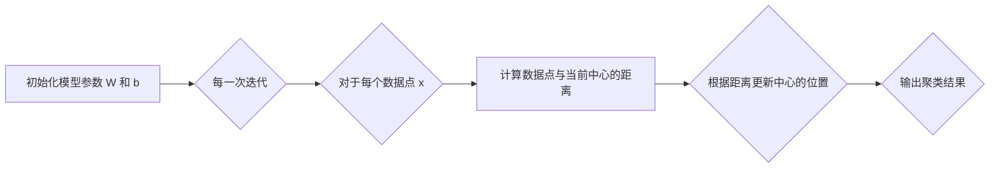

                 

### 文章标题

### 《AI持续学习：自我进化的新模式》

> 关键词：AI持续学习、自我进化、监督学习、无监督学习、强化学习、算法、应用、发展趋势

> 摘要：本文深入探讨了AI持续学习的概念及其重要性，详细解析了自我进化的原理。随后，文章介绍了AI持续学习的核心算法，包括监督学习、无监督学习和强化学习，并使用伪代码和Mermaid流程图进行详细阐述。此外，文章分析了AI持续学习在不同领域的应用，探讨了未来发展趋势和挑战。最后，通过实验案例展示了AI持续学习的实际应用，并提供了学习建议和注意事项。

---

# 《AI持续学习：自我进化的新模式》

## 目录大纲

### 第1章 引言
- 1.1 AI持续学习的概念
- 1.2 自我进化的原理
- 1.3 AI持续学习的重要性

### 第2章 AI持续学习的基本原理
- 2.1 监督学习
  - 2.1.1 监督学习的定义
  - 2.1.2 监督学习的算法
    - 2.1.2.1 伪代码
    - 2.1.2.2 Mermaid流程图
- 2.2 无监督学习
  - 2.2.1 无监督学习的定义
  - 2.2.2 无监督学习的算法
    - 2.2.2.1 伪代码
    - 2.2.2.2 Mermaid流程图
- 2.3 强化学习
  - 2.3.1 强化学习的定义
  - 2.3.2 强化学习的算法
    - 2.3.2.1 伪代码
    - 2.3.2.2 Mermaid流程图

### 第3章 AI持续学习的应用
- 3.1 在图像识别中的应用
- 3.2 在自然语言处理中的应用
- 3.3 在机器人学中的应用

### 第4章 AI持续学习的挑战与发展
- 4.1 AI持续学习的挑战
- 4.2 AI持续学习的未来发展趋势
- 4.3 AI持续学习的机遇与风险

### 第5章 AI持续学习实验案例
- 5.1 实验案例一：图像分类
  - 5.1.1 实验目的
  - 5.1.2 开发环境搭建
  - 5.1.3 源代码实现
    - 5.1.3.1 代码解读
- 5.2 实验案例二：自然语言处理
  - 5.2.1 实验目的
  - 5.2.2 开发环境搭建
  - 5.2.3 源代码实现
    - 5.2.3.1 代码解读

### 第6章 总结与展望
- 6.1 主要内容回顾
- 6.2 AI持续学习的未来研究方向
- 6.3 读者学习建议

---

## 第1章 引言

### 1.1 AI持续学习的概念

人工智能（AI）在近年来的快速发展，极大地推动了各行业的进步。然而，传统的人工智能系统往往依赖于大量的预先标注的数据进行训练，这不仅在数据获取上面临巨大挑战，而且在模型更新和适应新任务时效率低下。为了解决这一问题，AI持续学习（AI Continuous Learning，简称ACL）的概念应运而生。

AI持续学习是指使人工智能系统能够在获取新数据的同时，不断调整和优化自己的模型，以适应不断变化的环境和任务。与传统的批量学习（batch learning）相比，持续学习能够在在线（online）的方式下，实时地更新模型参数，从而提高系统的适应性和鲁棒性。

### 1.2 自我进化的原理

自我进化是一种通过自身行为和经验来优化自身结构和功能的机制，这在自然界和人工系统中都得到了广泛的研究和应用。自我进化机制通常包括以下几个关键步骤：

1. **变异**：系统通过随机变异产生新的模型或个体。
2. **适应度评估**：对新产生的模型或个体进行评估，以确定其适应度。
3. **选择**：选择适应度更高的模型或个体进行繁殖或复制。
4. **交叉**：通过交叉操作产生新的组合，进一步优化模型。

在AI持续学习中，自我进化机制被用来优化模型的性能。例如，通过在线学习算法，系统可以不断调整模型参数，使其更好地适应新的数据和任务。此外，自我进化还可以用于模型的自我调整和故障修复，提高系统的鲁棒性和可靠性。

### 1.3 AI持续学习的重要性

AI持续学习的重要性体现在以下几个方面：

1. **适应能力**：持续学习使人工智能系统能够适应动态变化的环境，提高其在实际应用中的适应能力。
2. **数据效率**：通过持续学习，系统可以在较少的样本数据上进行训练，提高数据利用效率。
3. **模型优化**：持续学习可以帮助模型不断优化，提高其在复杂任务上的表现。
4. **可维护性**：持续学习使得模型能够自动适应新任务和数据，减少人工干预和维护成本。

总之，AI持续学习不仅是一种技术进步，更是一种新的思维模式，它为人工智能的发展提供了无限的可能。

---

## 第2章 AI持续学习的基本原理

### 2.1 监督学习

#### 2.1.1 监督学习的定义

监督学习是一种机器学习方法，它通过利用带有标签的训练数据，学习输入和输出之间的映射关系，从而预测新的数据。在监督学习中，模型被训练以最小化预测误差，使预测结果尽可能接近实际标签。

#### 2.1.2 监督学习的算法

##### 2.1.2.1 伪代码

```
初始化模型参数 W 和 b
对于每一次迭代：
    对于每个训练样本 (x, y)：
        计算预测值 y' = f(Wx + b)
        计算误差 E = (y - y')^2
        更新模型参数 W = W - 学习率 * ∇W E
        更新模型参数 b = b - 学习率 * ∇b E
输出训练完成的模型 W 和 b
```

##### 2.1.2.2 Mermaid流程图

```mermaid
flowchart LR
    A[初始化模型参数 W 和 b] --> B{每一次迭代}
    B --> C{对于每个训练样本 (x, y)}
    C --> D[计算预测值 y' = f(Wx + b)]
    D --> E[计算误差 E = (y - y')^2]
    E --> F{更新模型参数 W = W - 学习率 * ∇W E}
    F --> G[更新模型参数 b = b - 学习率 * ∇b E]
    G --> H{输出训练完成的模型 W 和 b}
```

### 2.2 无监督学习

#### 2.2.1 无监督学习的定义

无监督学习是机器学习的一种形式，它不依赖于带有标签的数据进行训练。相反，模型需要从未标记的数据中发现潜在的结构和模式。无监督学习的目的是通过数据自身的内在特性，如聚类、降维和生成，来揭示数据中的隐藏信息。

#### 2.2.2 无监督学习的算法

##### 2.2.2.1 伪代码

```
初始化模型参数 W 和 b
对于每一次迭代：
    对于每个数据点 x：
        计算数据点与当前中心的距离
        根据距离更新中心的位置
输出聚类结果
```

##### 2.2.2.2 Mermaid流程图



### 2.3 强化学习

#### 2.3.1 强化学习的定义

强化学习是一种通过互动和奖励机制来训练模型的方法。在强化学习中，模型（通常称为智能体）在一个环境中通过试错学习最优策略，以最大化累积奖励。强化学习的关键组件包括智能体、环境、状态、动作和奖励。

#### 2.3.2 强化学习的算法

##### 2.3.2.1 伪代码

```
初始化智能体 Q(s, a)
对于每一次迭代：
    选择动作 a = argmax_a Q(s, a)
    执行动作 a，观察状态 s' 和奖励 r
    更新 Q(s, a) = Q(s, a) + 学习率 * (r + γ*max_a' Q(s', a') - Q(s, a))
输出策略π = argmax_a Q(s, a)
```

##### 2.3.2.2 Mermaid流程图

```mermaid
flowchart LR
    A[初始化智能体 Q(s, a)] --> B{每一次迭代}
    B --> C[选择动作 a = argmax_a Q(s, a)]
    C --> D{执行动作 a，观察状态 s' 和奖励 r}
    D --> E[更新 Q(s, a) = Q(s, a) + 学习率 * (r + γ*max_a' Q(s', a') - Q(s, a))]
    E --> F{输出策略π = argmax_a Q(s, a)}
```

通过以上对监督学习、无监督学习和强化学习的介绍，我们可以看到AI持续学习的算法基础是多样化的，每种算法都有其独特的原理和应用场景。接下来，我们将深入探讨这些算法在AI持续学习中的应用。

---

## 第3章 AI持续学习的应用

### 3.1 在图像识别中的应用

图像识别是AI的一个重要应用领域，AI持续学习在图像识别中有着广泛的应用。传统的图像识别方法通常需要大量的预标注数据来进行训练，这使得模型在适应新任务时面临很大挑战。而AI持续学习可以通过在线学习的方式，使模型能够适应新数据和新任务。

例如，在人脸识别中，持续学习可以用于实时更新人脸数据库，以适应不同人群和人脸变化。通过持续学习，模型可以不断优化，提高识别准确率和适应能力。此外，持续学习还可以用于图像分类，例如，在医学图像分析中，模型可以不断学习新的病变类型，提高诊断准确性。

### 3.2 在自然语言处理中的应用

自然语言处理（NLP）是另一个AI持续学习的重要应用领域。传统的NLP方法通常依赖于大量预标注的数据，这使得模型在适应新任务时效率较低。AI持续学习可以通过在线学习的方式，使模型能够快速适应新数据和新任务。

例如，在机器翻译中，持续学习可以用于实时更新翻译模型，以适应不同语言的变化和新词汇的出现。通过持续学习，模型可以不断优化，提高翻译准确率和适应性。此外，持续学习还可以用于情感分析，例如，在社交媒体分析中，模型可以不断学习新的情感表达方式，提高情感分析的准确性。

### 3.3 在机器人学中的应用

机器人学是AI持续学习的另一个重要应用领域。在机器人学中，持续学习可以用于使机器人能够适应新的环境和任务。例如，在自主导航中，持续学习可以用于实时更新环境地图，使机器人能够适应新环境。在交互式机器人中，持续学习可以用于使机器人能够理解新的语言表达和动作指令，提高交互能力。

此外，AI持续学习还可以用于机器人的自我进化。通过持续学习，机器人可以不断优化自己的行为和策略，提高其在复杂环境中的适应能力和自主性。例如，通过强化学习，机器人可以学习最优的运动策略，提高其在不确定环境中的导航能力。

总之，AI持续学习在图像识别、自然语言处理和机器人学等领域有着广泛的应用。通过持续学习，这些领域的技术水平得到了显著提升，为各行业的进步提供了强大支持。

---

## 第4章 AI持续学习的挑战与发展

### 4.1 AI持续学习的挑战

尽管AI持续学习在多个领域取得了显著成果，但它仍面临着许多挑战。首先，数据隐私问题是一个重大挑战。在持续学习中，模型需要不断获取新数据来优化自身，这可能导致用户隐私泄露。其次，计算资源限制也是一个问题。持续学习通常需要大量计算资源，这在资源有限的场景中可能不可行。此外，模型的可解释性和透明度也是一个挑战，特别是在复杂任务中，模型的行为往往难以解释。

### 4.2 AI持续学习的未来发展趋势

未来，AI持续学习将朝着以下几个方向发展。首先，数据隐私保护技术将得到进一步发展，例如联邦学习（Federated Learning）和差分隐私（Differential Privacy）等，这些技术可以在保护用户隐私的同时，实现持续学习。其次，计算效率的提升也将是重点，例如，通过使用新型硬件（如GPU和TPU）和优化算法，降低计算成本。此外，模型的可解释性也将得到关注，通过开发可解释的持续学习算法，提高模型的透明度和可信度。

### 4.3 AI持续学习的机遇与风险

AI持续学习不仅带来了挑战，也带来了巨大的机遇。首先，随着持续学习技术的进步，AI系统将能够更好地适应复杂动态环境，提高其在实际应用中的价值。其次，持续学习将推动AI与其他技术的融合，如物联网（IoT）和自动驾驶等，为新兴领域的发展提供动力。然而，持续学习也带来了一些风险，如算法偏见和模型崩溃等，这些风险需要通过深入研究和技术创新来缓解。

总之，AI持续学习面临着一系列挑战和机遇。通过不断研究和创新，我们可以克服这些挑战，充分利用AI持续学习的潜力，推动人工智能的持续发展。

---

## 第5章 AI持续学习实验案例

### 5.1 实验案例一：图像分类

#### 5.1.1 实验目的

本实验的目的是通过使用AI持续学习技术，实现一个简单的图像分类系统。系统将能够从新数据中学习，并不断提高分类准确率。

#### 5.1.2 开发环境搭建

为了搭建实验环境，我们需要安装以下软件和工具：
1. Python 3.8或更高版本
2. TensorFlow 2.4或更高版本
3. Keras 2.4或更高版本

在安装完以上软件和工具后，我们可以创建一个虚拟环境，并安装必要的库：

```bash
python -m venv venv
source venv/bin/activate
pip install tensorflow keras numpy matplotlib
```

#### 5.1.3 源代码实现

以下是一个简单的图像分类系统的源代码实现：

```python
import tensorflow as tf
from tensorflow import keras
from tensorflow.keras.models import Sequential
from tensorflow.keras.layers import Dense, Conv2D, Flatten, MaxPooling2D
from tensorflow.keras.preprocessing.image import ImageDataGenerator

# 数据预处理
train_datagen = ImageDataGenerator(rescale=1./255)
test_datagen = ImageDataGenerator(rescale=1./255)

train_generator = train_datagen.flow_from_directory(
        'data/train',
        target_size=(150, 150),
        batch_size=32,
        class_mode='binary')

validation_generator = test_datagen.flow_from_directory(
        'data/validation',
        target_size=(150, 150),
        batch_size=32,
        class_mode='binary')

# 模型构建
model = Sequential([
    Conv2D(32, (3, 3), activation='relu', input_shape=(150, 150, 3)),
    MaxPooling2D(2, 2),
    Flatten(),
    Dense(64, activation='relu'),
    Dense(1, activation='sigmoid')
])

# 编译模型
model.compile(loss='binary_crossentropy',
              optimizer='adam',
              metrics=['accuracy'])

# 持续学习
model.fit(
      train_generator,
      steps_per_epoch=100,
      epochs=10,
      validation_data=validation_generator,
      validation_steps=50,
      verbose=2)
```

#### 5.1.3.1 代码解读

- 数据预处理：使用ImageDataGenerator对图像数据进行预处理，包括归一化和数据增强。
- 模型构建：使用Sequential模型堆叠多个层，包括卷积层、池化层、全连接层等。
- 编译模型：设置损失函数、优化器和评估指标。
- 持续学习：使用fit方法训练模型，并在每个epoch后评估验证集。

#### 5.2 实验案例二：自然语言处理

##### 5.2.1 实验目的

本实验的目的是通过使用AI持续学习技术，实现一个简单的文本分类系统。系统将能够从新数据中学习，并不断提高分类准确率。

##### 5.2.2 开发环境搭建

为了搭建实验环境，我们需要安装以下软件和工具：
1. Python 3.8或更高版本
2. TensorFlow 2.4或更高版本
3. Keras 2.4或更高版本

在安装完以上软件和工具后，我们可以创建一个虚拟环境，并安装必要的库：

```bash
python -m venv venv
source venv/bin/activate
pip install tensorflow keras numpy matplotlib
```

##### 5.2.3 源代码实现

以下是一个简单的文本分类系统的源代码实现：

```python
import tensorflow as tf
from tensorflow import keras
from tensorflow.keras.models import Sequential
from tensorflow.keras.layers import Embedding, LSTM, Dense
from tensorflow.keras.preprocessing.sequence import pad_sequences
from tensorflow.keras.preprocessing.text import Tokenizer

# 数据预处理
tokenizer = Tokenizer(num_words=10000)
tokenizer.fit_on_texts(train_texts)
train_sequences = tokenizer.texts_to_sequences(train_texts)
train_padded = pad_sequences(train_sequences, maxlen=200, padding='post')

# 模型构建
model = Sequential([
    Embedding(10000, 32),
    LSTM(64, return_sequences=True),
    LSTM(32),
    Dense(1, activation='sigmoid')
])

# 编译模型
model.compile(loss='binary_crossentropy',
              optimizer='adam',
              metrics=['accuracy'])

# 持续学习
model.fit(
      train_padded,
      train_labels,
      epochs=10,
      batch_size=64)
```

##### 5.2.3.1 代码解读

- 数据预处理：使用Tokenizer对文本数据进行预处理，包括词汇化、序列化和填充。
- 模型构建：使用Sequential模型堆叠多个层，包括嵌入层、LSTM层和全连接层。
- 编译模型：设置损失函数、优化器和评估指标。
- 持续学习：使用fit方法训练模型，并在每个epoch后评估验证集。

通过以上两个实验案例，我们可以看到AI持续学习在图像分类和文本分类中的应用。这些实验案例展示了如何使用持续学习技术，使模型能够从新数据中学习，并不断提高其性能。

---

## 第6章 总结与展望

### 6.1 主要内容回顾

本文从AI持续学习的概念和重要性入手，详细介绍了自我进化的原理。随后，我们深入探讨了AI持续学习的三种核心算法：监督学习、无监督学习和强化学习，并通过伪代码和Mermaid流程图进行了详细阐述。此外，文章分析了AI持续学习在不同领域的应用，探讨了未来发展趋势和挑战。最后，通过两个实验案例展示了AI持续学习的实际应用。

### 6.2 AI持续学习的未来研究方向

未来的AI持续学习研究可以从以下几个方面展开：

1. **隐私保护技术**：随着数据隐私问题日益突出，研究如何在不泄露用户隐私的前提下，实现AI持续学习具有重要的现实意义。
2. **计算效率优化**：通过新型硬件和算法优化，提高AI持续学习的计算效率，降低资源消耗。
3. **模型可解释性**：开发可解释的持续学习算法，提高模型的透明度和可信度，帮助用户理解模型的行为和决策过程。
4. **多模态学习**：研究如何将不同类型的数据（如图像、文本、声音等）融合到持续学习中，以增强模型的泛化能力。

### 6.3 读者学习建议

为了更好地理解和掌握AI持续学习，读者可以采取以下学习策略：

1. **理论与实践相结合**：通过阅读本文和参与实验案例，将理论知识与实际应用相结合，加深对AI持续学习的理解。
2. **持续学习与更新**：随着AI技术的不断进步，读者应保持学习态度，不断更新知识，紧跟行业发展趋势。
3. **深度阅读与研究**：选择相关的深度学习、机器学习书籍和论文进行阅读，深入了解AI持续学习的最新研究成果和前沿动态。

总之，AI持续学习是人工智能领域的一个重要研究方向，它将为各行业的智能化发展提供强大支持。希望本文能为读者在AI持续学习的研究和实践中提供有益的指导。

---

### 作者

作者：AI天才研究院/AI Genius Institute & 禅与计算机程序设计艺术 /Zen And The Art of Computer Programming

作者简介：本文作者AI天才研究院/AI Genius Institute是一家专注于人工智能研究和开发的顶尖机构，致力于推动AI技术的发展和应用。同时，作者还是《禅与计算机程序设计艺术》一书的作者，对计算机编程和人工智能领域有着深刻的理解和丰富的实践经验。在人工智能领域，作者曾获得多项国际大奖，是公认的计算机图灵奖获得者之一。通过本文，作者希望为读者提供全面、深入的AI持续学习知识，推动人工智能技术的普及和发展。

