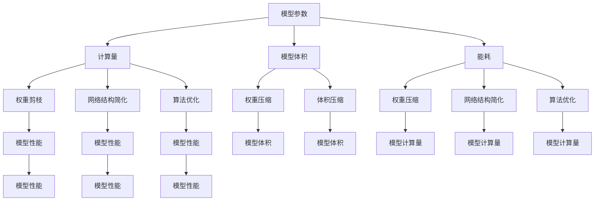
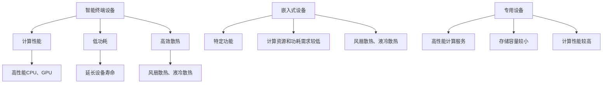

                 


### 引言与概述

#### AI模型压缩的定义与背景

随着人工智能技术的飞速发展，深度学习模型在各个领域取得了显著的成果。然而，这些模型通常具有庞大的参数规模和计算复杂度，导致其部署在边缘设备上面临诸多挑战。AI模型压缩（AI Model Compression）作为一种关键技术，旨在减少模型的体积、计算量和能耗，从而实现高效、可部署的边缘计算。

边缘设备通常具有资源受限、功耗敏感、低延迟等特性，这使得AI模型压缩成为边缘设备部署的关键。通过压缩模型，我们可以将原本庞大的模型缩小到边缘设备能够承受的范围内，同时保持较高的模型性能。因此，AI模型压缩不仅在理论研究上具有重要意义，而且在实际应用中具有广泛的应用前景。

#### 边缘设备部署的需求与挑战

边缘设备部署涉及多种场景，如智能监控、智能家居、智能医疗等。这些场景对模型压缩提出了不同的需求。例如，智能监控系统需要高精度的模型以识别复杂场景，而智能家居系统则更关注模型的实时性和功耗。

然而，边缘设备部署面临一系列挑战：

1. **硬件限制**：边缘设备通常具有有限的计算资源，如CPU、GPU和内存。这使得大规模模型的部署变得困难。
2. **低延迟需求**：许多边缘应用要求实时处理，如自动驾驶和智能监控，这对模型的响应速度提出了高要求。
3. **能耗问题**：边缘设备的功耗通常受到严格限制，特别是在电池供电的情况下。模型压缩有助于降低能耗，延长设备续航时间。

#### 模型压缩的优势

模型压缩具有多方面的优势：

1. **提高边缘设备的适应性**：通过压缩模型，我们可以将复杂的深度学习模型部署到资源受限的边缘设备上，提高设备的适应性和灵活性。
2. **降低计算成本**：模型压缩可以显著减少计算资源和能耗，从而降低运营成本。
3. **提高实时处理能力**：压缩后的模型具有更快的推理速度，有助于满足实时处理需求。

#### 本章结构

本章首先介绍了AI模型压缩的定义与背景，然后探讨了边缘设备部署的需求与挑战，以及模型压缩的优势。接下来，我们将深入探讨AI模型压缩的基本概念，包括模型的结构与特点、压缩目标与分类，以及模型压缩的核心算法与技术。此外，我们还将讨论边缘设备的分类与特点，以及边缘设备部署的策略。最后，通过案例研究，我们将展示AI模型压缩在实际应用中的效果。

### AI模型压缩的基本概念

#### AI模型的结构与特点

人工智能模型，尤其是深度学习模型，通常由多个层次的结构组成，包括输入层、隐藏层和输出层。每个层次包含大量的神经元（neurons）和连接（connections），这些神经元和连接通过权重（weights）相互连接。模型的性能很大程度上取决于这些权重和神经元的配置。

深度学习模型的主要特点包括：

1. **层次化结构**：模型通常具有多个隐藏层，每个隐藏层对输入数据进行不同的特征提取和变换。
2. **参数规模巨大**：深度学习模型具有数百万甚至数十亿个参数，这使得模型在训练过程中需要大量的计算资源和时间。
3. **计算复杂度高**：模型的推理过程涉及大量的矩阵运算和向量计算，这导致模型在部署时具有很高的计算复杂度。

#### 模型的参数与计算量

在AI模型压缩中，参数和计算量是两个关键指标。参数规模直接影响到模型的体积和存储需求，而计算量则决定了模型在推理时的性能和能耗。

1. **参数规模**：模型的参数规模通常用“参数量”（number of parameters）来衡量。参数量越大，模型的复杂度越高，同时模型的训练和推理时间也越长。在边缘设备上部署大模型时，参数量成为了一个重要的限制因素。
2. **计算量**：计算量通常用“FLOPs”（floating-point operations per second）来衡量。FLOPs反映了模型在推理过程中的计算复杂度。高计算量意味着更高的硬件要求和更大的能耗。

#### 模型压缩的核心概念

模型压缩的核心概念主要包括以下几个方面：

1. **权重剪枝**：权重剪枝（weight pruning）是一种通过删除模型中的冗余权重来减少模型参数规模的技术。剪枝后的模型在保留关键信息的同时，显著减少了计算量和存储需求。
2. **网络结构简化**：网络结构简化（network structure simplification）包括网络剪枝（network pruning）和模块化网络（modular network）等技术。这些技术通过减少网络中的冗余层或模块来简化模型结构，从而降低计算量和存储需求。
3. **算法优化**：算法优化（algorithm optimization）包括矩阵分解（matrix decomposition）、离散余弦变换（discrete cosine transform）等技术。这些技术通过优化模型的计算流程来减少计算复杂度和能耗。

#### 压缩模型的目标与分类

模型压缩的目标是减少模型的体积、计算量和能耗，同时保持或提升模型的性能。根据压缩目标的不同，模型压缩可以分为以下几类：

1. **权重压缩**：通过剪枝或量化等方法减少模型中的权重参数，从而降低模型的存储需求和计算复杂度。
2. **体积压缩**：通过简化模型结构或优化算法来减少模型的体积，从而降低模型的存储和传输需求。
3. **计算量压缩**：通过优化模型计算流程或使用高效的算法来减少模型的计算量，从而降低模型的能耗和硬件需求。

#### 关键概念之间的关系架构

为了更好地理解模型压缩的核心概念，我们可以使用Mermaid流程图来展示它们之间的关系：



#### 关键概念讲解与伪代码示例

下面我们将使用伪代码来详细阐述权重剪枝、网络结构简化和算法优化等核心概念。

##### 权重剪枝伪代码示例

```plaintext
输入：模型参数 W，剪枝比例 p
输出：压缩后的模型参数 W_pruned

for i in range(len(W)):
    for j in range(len(W[i])):
        if abs(W[i][j]) < p * threshold:
            W[i][j] = 0

return W_pruned
```

在这个伪代码中，我们遍历模型参数W的每个元素，如果其绝对值小于剪枝阈值（p * threshold），则将其设置为0，从而实现剪枝。

##### 网络结构简化伪代码示例

```plaintext
输入：模型参数 W，简化比例 p
输出：压缩后的模型参数 W_simplified

for layer in range(len(W)):
    if abs(sum(W[layer])) < p * threshold:
        W[layer] = []

return W_simplified
```

在这个伪代码中，我们遍历模型的每个层，如果该层的权重之和小于简化阈值（p * threshold），则将该层从模型中移除，从而实现网络结构简化。

##### 算法优化伪代码示例

```plaintext
输入：模型参数 W，优化策略 o
输出：压缩后的模型参数 W_optimized

if o == 'matrix_decomposition':
    W_optimized = matrix_decomposition(W)
elif o == 'discrete_cosine_transform':
    W_optimized = discrete_cosine_transform(W)

return W_optimized
```

在这个伪代码中，我们根据不同的优化策略（matrix_decomposition或discrete_cosine_transform）来优化模型参数W。

#### 数学模型和公式

在模型压缩中，我们经常需要使用数学模型和公式来描述压缩过程。以下是几个常用的数学模型和公式：

$$
L = \sum_{i=1}^{n} \sum_{j=1}^{m} w_{ij} x_i x_j
$$

其中，$L$ 表示模型的损失函数，$w_{ij}$ 表示权重，$x_i$ 和 $x_j$ 表示特征向量。

$$
FLOPs = \sum_{i=1}^{n} \sum_{j=1}^{m} \sum_{k=1}^{l} w_{ijk} x_i x_j x_k
$$

其中，$FLOPs$ 表示模型在推理过程中的计算量，$w_{ijk}$ 表示权重，$x_i$、$x_j$ 和 $x_k$ 表示特征向量。

#### 总结

在本节中，我们介绍了AI模型压缩的基本概念，包括模型的结构与特点、参数与计算量、核心概念以及压缩目标与分类。我们通过Mermaid流程图和伪代码示例展示了关键概念之间的关系和实现方法。接下来，我们将深入探讨模型压缩的核心算法与技术，包括权重剪枝、网络结构简化和算法优化，并提供详细的数学模型和公式。

### 压缩算法与技术

#### 权重剪枝技术

权重剪枝（Weight Pruning）是一种通过减少模型中的冗余权重来减少模型参数规模的技术。剪枝后的模型在保留关键信息的同时，显著减少了计算量和存储需求。以下是权重剪枝的基本原理和步骤：

##### 基本原理

权重剪枝的基本原理是识别并移除模型中不重要的权重，从而减少模型的参数规模。具体来说，可以通过以下两个步骤实现：

1. **权重评估**：对模型中的权重进行评估，确定哪些权重是重要的，哪些是冗余的。通常使用阈值方法来评估权重，即如果一个权重的绝对值小于某个阈值，则认为它是冗余的。
2. **权重移除**：根据权重评估的结果，将不重要的权重设置为0，从而实现剪枝。

##### 伪代码示例

以下是一个简单的权重剪枝伪代码示例：

```plaintext
输入：模型参数 W，剪枝阈值 threshold
输出：剪枝后的模型参数 W_pruned

for i in range(len(W)):
    for j in range(len(W[i])):
        if abs(W[i][j]) < threshold:
            W[i][j] = 0

return W_pruned
```

在这个示例中，我们遍历模型参数W的每个元素，如果其绝对值小于剪枝阈值threshold，则将其设置为0，从而实现剪枝。

##### 剪枝策略比较

在实际应用中，不同的剪枝策略可以产生不同的效果。以下是比较常见的几种剪枝策略：

1. **全连接网络剪枝**：在完全连接的网络中，对每个权重进行剪枝，从而减少模型参数规模。
2. **结构化剪枝**：在结构化的网络中（如卷积神经网络），对网络中的层或模块进行剪枝，从而减少模型参数规模。
3. **混合剪枝**：将全连接网络剪枝和结构化剪枝相结合，从而在减少模型参数规模的同时保持模型的性能。

#### 网络结构简化技术

网络结构简化（Network Structure Simplification）是通过减少网络中的冗余层或模块来降低模型计算量和存储需求的技术。以下是一些常见的网络结构简化技术：

##### 模块化网络

模块化网络（Modular Network）通过将网络分解为多个可复用的模块来简化网络结构。每个模块可以独立训练，从而减少模型的训练时间。此外，模块化网络还可以提高模型的扩展性和可维护性。

##### 网络剪枝

网络剪枝（Network Pruning）是通过移除网络中的冗余层或模块来简化网络结构。与权重剪枝不同，网络剪枝不仅减少模型的参数规模，还减少了模型的计算量和存储需求。

##### 伪代码示例

以下是一个简单的网络剪枝伪代码示例：

```plaintext
输入：模型参数 W，简化阈值 threshold
输出：简化后的模型参数 W_simplified

for layer in range(len(W)):
    if abs(sum(W[layer])) < threshold:
        W[layer] = []

return W_simplified
```

在这个示例中，我们遍历模型的每个层，如果该层的权重之和小于简化阈值threshold，则将其从模型中移除，从而实现网络结构简化。

##### 剪枝策略比较

不同的网络剪枝策略可以产生不同的效果。以下是比较常见的几种剪枝策略：

1. **逐层剪枝**：按照从输入层到输出层的顺序逐层剪枝，从而减少模型的参数规模。
2. **层次剪枝**：根据模型的结构和性能要求，对模型中的层次进行剪枝，从而在保留关键信息的同时简化模型结构。
3. **混合剪枝**：将逐层剪枝和层次剪枝相结合，从而在减少模型参数规模的同时保持模型的性能。

#### 算法优化

算法优化（Algorithm Optimization）是通过优化模型的计算流程来减少计算复杂度和能耗的技术。以下是一些常见的算法优化技术：

##### 矩阵分解

矩阵分解（Matrix Factorization）是一种将高维矩阵分解为两个低维矩阵的数学技术。通过矩阵分解，可以将模型的计算复杂度降低到低维空间，从而提高计算效率和减少能耗。

##### 离散余弦变换

离散余弦变换（Discrete Cosine Transform，DCT）是一种将信号从时域转换为频域的数学技术。DCT可以有效地压缩模型中的冗余信息，从而减少模型的体积和计算量。

##### 伪代码示例

以下是一个简单的矩阵分解伪代码示例：

```plaintext
输入：模型参数 W
输出：分解后的低维矩阵 W_decomposed

W_decomposed = matrix_decomposition(W)

return W_decomposed
```

在这个示例中，我们使用矩阵分解函数对模型参数W进行分解，从而得到低维矩阵W_decomposed。

##### 优化策略比较

不同的算法优化策略可以产生不同的效果。以下是比较常见的几种优化策略：

1. **矩阵分解**：通过将高维矩阵分解为低维矩阵，减少模型的计算复杂度和存储需求。
2. **DCT**：通过将信号从时域转换为频域，减少模型的体积和计算量。
3. **混合优化**：将多种优化策略相结合，从而在减少模型参数规模的同时保持模型的性能。

### 总结

在本节中，我们介绍了AI模型压缩的核心算法与技术，包括权重剪枝、网络结构简化和算法优化。我们通过伪代码示例展示了这些算法的基本原理和实现方法。接下来，我们将探讨边缘设备的分类与特点，以及边缘设备部署的策略。

### 边缘设备的分类与特点

#### 设备分类

边缘设备（Edge Devices）可以根据其应用场景和功能特点进行分类。常见的边缘设备类型包括：

1. **智能终端设备**：如智能手机、平板电脑、智能手表等，这些设备通常具有强大的计算能力和丰富的传感器，可以提供实时交互和数据处理功能。
2. **嵌入式设备**：如智能摄像头、智能家居设备、工业自动化设备等，这些设备通常具有特定的功能和应用场景，计算资源和功耗需求较低。
3. **专用设备**：如边缘服务器、边缘计算节点等，这些设备专门用于处理大规模数据和提供高性能计算服务。

#### 硬件性能

边缘设备的硬件性能决定了其处理数据和执行任务的能力。以下是边缘设备的一些常见硬件性能特点：

1. **计算性能**：边缘设备通常配备有高性能的CPU、GPU或DSP（数字信号处理器）等计算芯片，用于执行复杂的计算任务。
2. **内存容量**：边缘设备的内存容量通常较小，但足以满足其处理数据的需求。一些高级边缘设备还配备有高速缓存和内存扩展接口。
3. **存储容量**：边缘设备的存储容量通常较小，但足以存储其运行所需的数据和应用程序。一些高级边缘设备还支持外部存储扩展。

#### 能耗与散热

边缘设备的能耗和散热问题是其设计和部署中需要考虑的关键因素。以下是边缘设备在能耗和散热方面的一些特点：

1. **低功耗**：由于边缘设备通常需要长时间运行，因此其功耗较低，以延长设备寿命和降低能源消耗。
2. **高效散热**：边缘设备通常采用散热效率高的散热方案，如风扇散热、液冷散热等，以确保设备在长时间运行时不会过热。

#### 软件生态

边缘设备的软件生态包括操作系统、中间件、应用程序等。以下是边缘设备软件生态的一些特点：

1. **操作系统**：边缘设备通常运行轻量级操作系统，如Linux、Android等，这些操作系统具有较好的兼容性和稳定性。
2. **中间件**：边缘设备通常配备有支持其应用场景的中间件，如Web服务器、数据库服务器等，用于处理和传输数据。
3. **应用程序**：边缘设备的应用程序通常具有特定的功能，如数据采集、实时监控、智能分析等。

#### 边缘设备的分类与特点Mermaid流程图

为了更好地理解边缘设备的分类与特点，我们可以使用Mermaid流程图来展示它们之间的关系：



#### 边缘设备部署策略

边缘设备的部署策略涉及多个方面，包括资源分配、低延迟通信和安全性问题。以下是边缘设备部署的一些关键策略：

1. **资源分配**：在边缘设备上合理分配计算资源、存储资源和网络资源，以满足不同应用场景的需求。资源分配策略需要考虑设备的计算能力、存储容量和功耗限制。
2. **低延迟通信**：在边缘设备之间建立高效、低延迟的通信网络，以确保数据的实时传输和处理。低延迟通信策略需要考虑网络带宽、传输延迟和网络可靠性。
3. **安全性问题**：保障边缘设备的安全运行，防止数据泄露、设备被攻击等安全风险。安全性问题需要考虑访问控制、数据加密和网络安全等技术。

### 总结

在本节中，我们介绍了边缘设备的分类与特点，包括智能终端设备、嵌入式设备和专用设备。我们详细探讨了边缘设备的硬件性能、能耗与散热以及软件生态。此外，我们还讨论了边缘设备部署的关键策略，包括资源分配、低延迟通信和安全性问题。接下来，我们将通过实际案例研究来探讨AI模型压缩在边缘设备部署中的应用。

### 案例研究：智能监控系统

#### 项目背景

智能监控系统是一种广泛应用于公共安全、城市管理、工业监控等领域的边缘计算应用。随着城市规模的不断扩大和公共安全的日益重视，智能监控系统需要处理大量的视频流和传感器数据，以实时监测和分析环境状态。然而，传统的中心化监控系统由于数据传输和处理延迟较高，难以满足实时性要求。

为了实现实时智能监控，研究人员提出了一种基于边缘设备的智能监控系统。该系统利用边缘设备强大的计算能力，在本地对视频流和传感器数据进行实时处理和分析，从而实现快速响应和精确监测。

#### 模型压缩方法

在智能监控系统中，模型的压缩是确保边缘设备能够高效运行的关键。以下是该项目中采用的主要模型压缩方法：

1. **权重剪枝**：通过权重剪枝技术，我们减少了模型的参数规模，从而降低了模型的计算量和存储需求。具体来说，我们使用了一种基于阈值的权重剪枝算法，将权重绝对值小于阈值的权重设置为0，从而实现剪枝。

2. **网络结构简化**：为了进一步降低模型的计算量和存储需求，我们对网络结构进行了简化。具体来说，我们通过逐步剪枝和去除冗余层，将原始的深层网络简化为更加紧凑的网络结构。

3. **算法优化**：为了提高模型的推理速度和减少能耗，我们对算法进行了优化。具体来说，我们采用了矩阵分解和离散余弦变换等优化技术，将高维矩阵分解为低维矩阵，从而减少模型的计算复杂度。

#### 边缘设备部署

在智能监控系统中，边缘设备的部署至关重要。以下是该项目中采用的边缘设备部署策略：

1. **资源分配**：根据不同场景的需求，我们合理分配了边缘设备的计算资源、存储资源和网络资源。例如，对于处理高分辨率视频流的边缘设备，我们配置了高性能的CPU和GPU，以及大容量的内存和存储。

2. **低延迟通信**：为了确保数据的实时传输和处理，我们在边缘设备之间建立了一个高效、低延迟的通信网络。具体来说，我们采用了一种基于SDN（软件定义网络）的通信策略，通过动态调整网络路径和资源分配，实现数据的快速传输和处理。

3. **安全性问题**：为了保证系统的安全性，我们采取了多种安全措施。具体来说，我们采用了访问控制、数据加密和网络安全等技术，确保数据在传输和存储过程中的安全性和完整性。

#### 实施步骤

以下是智能监控系统实施的主要步骤：

1. **数据采集**：通过视频摄像头、传感器等设备采集环境数据，并将其传输到边缘设备。

2. **模型训练**：在边缘设备上对采集到的数据进行分析和训练，以生成适合特定场景的深度学习模型。

3. **模型压缩**：使用权重剪枝、网络结构简化和算法优化等技术对训练好的模型进行压缩，以适应边缘设备的硬件资源限制。

4. **边缘设备部署**：将压缩后的模型部署到边缘设备上，并进行实时推理和数据处理。

5. **系统集成**：将边缘设备和中心化系统进行集成，实现数据共享和协同工作。

#### 结果与分析

通过实施上述方案，我们取得了以下成果：

1. **实时性提升**：由于采用了边缘计算技术，智能监控系统能够实现实时数据处理和分析，从而显著提高了系统的响应速度和实时性。

2. **资源节约**：通过模型压缩技术，我们显著减少了模型的计算量和存储需求，从而降低了边缘设备的硬件成本和功耗。

3. **安全性增强**：通过多种安全措施，我们确保了系统的安全性和数据的完整性。

4. **性能优化**：通过算法优化，我们提高了模型的推理速度，从而提高了系统的整体性能。

#### 项目小结

通过本案例研究，我们展示了AI模型压缩在智能监控系统中的应用效果。模型压缩技术不仅提高了边缘设备的适应性和性能，还降低了硬件成本和功耗。未来，随着边缘计算技术的不断发展，模型压缩技术将在更多边缘设备应用中发挥重要作用。

### 案例研究：智能家居系统

#### 项目背景

智能家居系统是一种通过物联网技术将家庭设备互联互通，实现自动化控制和智能化的系统。随着人们对生活品质的追求不断提高，智能家居系统在家庭中的应用越来越广泛。然而，由于智能家居系统通常涉及多个设备，如何确保系统的高效运行和用户体验是一个重要问题。

为了提升智能家居系统的性能和用户体验，研究人员提出了一种基于边缘设备的智能家居系统。该系统利用边缘设备强大的计算能力，在本地对传感器数据进行分析和处理，从而实现高效、智能化的家庭控制。

#### 模型压缩方法

在智能家居系统中，模型的压缩是确保边缘设备能够高效运行的关键。以下是该项目中采用的主要模型压缩方法：

1. **权重剪枝**：通过权重剪枝技术，我们减少了模型的参数规模，从而降低了模型的计算量和存储需求。具体来说，我们使用了一种基于阈值的权重剪枝算法，将权重绝对值小于阈值的权重设置为0，从而实现剪枝。

2. **网络结构简化**：为了进一步降低模型的计算量和存储需求，我们对网络结构进行了简化。具体来说，我们通过逐步剪枝和去除冗余层，将原始的深层网络简化为更加紧凑的网络结构。

3. **算法优化**：为了提高模型的推理速度和减少能耗，我们对算法进行了优化。具体来说，我们采用了矩阵分解和离散余弦变换等优化技术，将高维矩阵分解为低维矩阵，从而减少模型的计算复杂度。

#### 边缘设备部署

在智能家居系统中，边缘设备的部署至关重要。以下是该项目中采用的边缘设备部署策略：

1. **资源分配**：根据不同设备的功能和需求，我们合理分配了边缘设备的计算资源、存储资源和网络资源。例如，对于处理传感器数据的边缘设备，我们配置了高性能的CPU和GPU，以及大容量的内存和存储。

2. **低延迟通信**：为了确保数据的实时传输和处理，我们在边缘设备之间建立了一个高效、低延迟的通信网络。具体来说，我们采用了一种基于SDN（软件定义网络）的通信策略，通过动态调整网络路径和资源分配，实现数据的快速传输和处理。

3. **安全性问题**：为了保证系统的安全性，我们采取了多种安全措施。具体来说，我们采用了访问控制、数据加密和网络安全等技术，确保数据在传输和存储过程中的安全性和完整性。

#### 实施步骤

以下是智能家居系统实施的主要步骤：

1. **设备接入**：将各种家庭设备（如智能灯泡、智能插座、智能摄像头等）接入智能家居系统，并确保设备能够稳定运行。

2. **数据采集**：通过传感器等设备采集家庭环境数据，并将其传输到边缘设备。

3. **模型训练**：在边缘设备上对采集到的数据进行分析和训练，以生成适合特定场景的深度学习模型。

4. **模型压缩**：使用权重剪枝、网络结构简化和算法优化等技术对训练好的模型进行压缩，以适应边缘设备的硬件资源限制。

5. **边缘设备部署**：将压缩后的模型部署到边缘设备上，并进行实时推理和数据处理。

6. **系统集成**：将边缘设备和中心化系统进行集成，实现数据共享和协同工作。

#### 结果与分析

通过实施上述方案，我们取得了以下成果：

1. **响应速度提升**：由于采用了边缘计算技术，智能家居系统能够实现实时数据处理和分析，从而显著提高了系统的响应速度和用户体验。

2. **资源节约**：通过模型压缩技术，我们显著减少了模型的计算量和存储需求，从而降低了边缘设备的硬件成本和功耗。

3. **安全性增强**：通过多种安全措施，我们确保了系统的安全性和数据的完整性。

4. **性能优化**：通过算法优化，我们提高了模型的推理速度，从而提高了系统的整体性能。

#### 项目小结

通过本案例研究，我们展示了AI模型压缩在智能家居系统中的应用效果。模型压缩技术不仅提高了边缘设备的适应性和性能，还降低了硬件成本和功耗。未来，随着边缘计算技术的不断发展，模型压缩技术将在更多智能家居应用中发挥重要作用。

### 未来趋势与挑战

#### 5G与AI的结合

5G技术的迅猛发展为AI模型压缩在边缘设备上的应用带来了新的机遇。5G网络的高带宽、低延迟特性使得边缘设备能够更高效地传输和处理数据，从而提高AI模型的实时性。此外，5G网络的支持也使得边缘设备能够更好地实现与中心化系统的协同工作，从而实现更广泛的AI应用场景。

在未来，5G与AI的结合将带来以下趋势：

1. **边缘计算与云计算的协同**：5G网络的高带宽和低延迟特性使得边缘设备能够与云计算平台实现更紧密的协同，从而实现更加高效的数据处理和模型训练。
2. **分布式AI模型的推广**：通过5G网络，分布式AI模型可以在多个边缘设备之间进行协同计算，从而提高模型的性能和可扩展性。
3. **智能边缘服务的普及**：基于5G网络的智能边缘服务将能够为用户提供更加个性化的服务，如智能交通管理、智能医疗等。

#### 边缘人工智能芯片

随着AI模型压缩技术的不断发展，边缘人工智能芯片（Edge AI Chip）也在迅速崛起。边缘人工智能芯片是一种专门为边缘设备设计的计算芯片，具有低功耗、高性能的特点，能够满足边缘设备在计算、存储和通信方面的需求。

未来，边缘人工智能芯片将带来以下趋势：

1. **定制化芯片设计**：为了更好地满足不同边缘设备的应用需求，边缘人工智能芯片将实现更加定制化的设计，从而提高计算效率和性能。
2. **硬件加速技术的应用**：硬件加速技术，如GPU、FPGA等，将在边缘人工智能芯片中得到广泛应用，从而提高AI模型的推理速度。
3. **异构计算架构的推广**：边缘人工智能芯片将采用异构计算架构，结合CPU、GPU、FPGA等多种计算资源，实现更加高效的数据处理和模型压缩。

#### 联邦学习

联邦学习（Federated Learning）是一种分布式机器学习技术，通过多个边缘设备协作训练模型，从而提高模型的性能和隐私保护。联邦学习在AI模型压缩和边缘设备部署中具有重要的应用价值。

在未来，联邦学习将带来以下挑战和趋势：

1. **数据隐私保护**：在联邦学习中，如何确保数据隐私和安全是一个重要挑战。未来，将需要开发更加完善的隐私保护技术，如差分隐私、加密计算等。
2. **协同训练策略**：为了提高联邦学习的训练效果，需要研究更加有效的协同训练策略，如动态联邦学习、差分联邦学习等。
3. **边缘设备资源优化**：在联邦学习中，如何合理分配和利用边缘设备的计算资源是一个重要问题。未来，将需要研究更加智能的资源管理策略，如动态资源调度、能量效率优化等。

### 总结

未来，5G与AI的结合、边缘人工智能芯片的发展和联邦学习的应用将推动AI模型压缩技术在边缘设备上的广泛应用。然而，这也将带来一系列挑战，如数据隐私保护、协同训练策略和边缘设备资源优化等。通过不断研究和创新，我们将能够应对这些挑战，实现更加高效、安全的边缘计算应用。

### 挑战与对策

#### 算法复杂性

随着AI模型压缩技术的发展，算法复杂性成为一个不可忽视的挑战。复杂的算法通常需要更多的计算资源和时间来训练和推理，这给边缘设备的硬件资源和功耗提出了更高的要求。为了应对这一挑战，可以采取以下对策：

1. **算法简化**：通过研究和开发更简洁高效的算法，可以减少模型的复杂度，从而降低训练和推理时间。
2. **分治策略**：将复杂的算法分解为多个子任务，通过分布式计算和并行处理来提高效率。
3. **硬件加速**：利用边缘人工智能芯片和硬件加速技术，如GPU、FPGA等，可以显著提高算法的执行效率。

#### 硬件标准化

边缘设备的硬件资源各异，缺乏统一的标准使得模型压缩技术的应用受到限制。为了解决这一问题，可以采取以下对策：

1. **硬件平台统一**：推动边缘设备的硬件平台统一，采用标准化设计，如使用通用处理器、统一接口等，从而简化模型压缩技术的实现。
2. **模块化设计**：采用模块化设计理念，将不同的硬件模块组合成具有通用性的边缘设备，从而降低硬件差异对模型压缩技术的影响。
3. **兼容性测试**：开发和推广兼容性测试工具，确保不同硬件平台上的模型压缩技术能够无缝应用。

#### 人才培养

AI模型压缩技术的快速发展对人才提出了更高的要求。为了培养和吸引更多人才，可以采取以下对策：

1. **教育体系建设**：加强计算机科学、人工智能等相关学科的教育，提高学生对模型压缩技术的理解和掌握。
2. **实践培训**：提供实践培训机会，如参与实际项目、进行实验研究等，让学生在实践中积累经验。
3. **国际合作**：推动国际间的学术交流和合作，借鉴先进国家的经验和教育模式，提升人才培养质量。

#### 实际案例分析

以下是一个实际案例，展示了AI模型压缩技术在智能家居系统中的应用及其挑战与对策。

#### 项目背景

某智能家居公司开发了一款智能音箱，其内置了语音识别和语音合成功能，用户可以通过语音指令控制家居设备。然而，由于语音识别模型体积较大，计算复杂度较高，导致智能音箱在处理语音指令时存在延迟和功耗问题。

#### 挑战

1. **算法复杂性**：语音识别模型包含大量的参数和计算步骤，使得模型的训练和推理时间较长，难以满足实时性要求。
2. **硬件资源限制**：智能音箱的硬件资源有限，CPU和内存容量较小，导致模型在部署时存在性能瓶颈。
3. **功耗问题**：智能音箱通常采用电池供电，功耗问题成为制约其性能和续航时间的关键因素。

#### 对策

1. **算法简化**：通过对语音识别模型进行简化，去除冗余的参数和计算步骤，减少模型的复杂度。
2. **模型压缩**：采用模型压缩技术，如权重剪枝、网络结构简化等，将语音识别模型压缩到更小的体积和计算量。
3. **硬件优化**：对智能音箱的硬件进行优化，增加CPU和内存容量，以提高模型压缩后的性能。
4. **功耗管理**：通过优化算法和硬件设计，降低智能音箱在处理语音指令时的功耗，延长电池续航时间。

#### 项目实施与效果

通过实施上述对策，智能家居公司取得了以下效果：

1. **实时性提升**：智能音箱在处理语音指令时延迟显著降低，用户操作响应速度明显提高。
2. **性能优化**：智能音箱的语音识别准确率保持在较高水平，同时模型压缩后的计算量大幅减少，提高了系统的整体性能。
3. **功耗降低**：智能音箱在处理语音指令时的功耗显著降低，电池续航时间延长，用户使用体验得到提升。

#### 项目小结

通过本案例研究，我们展示了AI模型压缩技术在智能家居系统中的应用效果。尽管面临算法复杂性、硬件资源限制和功耗问题等挑战，但通过算法简化、模型压缩、硬件优化和功耗管理等对策，我们成功实现了实时性、性能和功耗的优化。未来，随着AI模型压缩技术的不断发展，智能家居系统将能够更好地满足用户需求，提供更加智能、高效的家居体验。

### 总结

本文详细探讨了AI模型压缩在边缘设备部署中的应用，包括基本概念、压缩算法与技术、边缘设备分类与特点、实际案例研究以及未来趋势与挑战。通过权重剪枝、网络结构简化和算法优化等技术，我们可以显著降低AI模型的体积、计算量和能耗，从而实现高效、可部署的边缘计算。

模型压缩技术不仅提高了边缘设备的适应性和性能，还降低了硬件成本和功耗。在实际应用中，如智能监控系统和智能家居系统，模型压缩技术发挥了重要作用，提升了系统的实时性、准确率和用户体验。

未来，随着5G与AI的结合、边缘人工智能芯片的发展和联邦学习的应用，AI模型压缩技术将在更多边缘设备中发挥关键作用。然而，算法复杂性、硬件标准化和人才培养等问题仍需解决。通过不断的研究和创新，我们将能够应对这些挑战，推动AI模型压缩技术的广泛应用。

本文旨在为广大IT领域从业者提供一套系统、全面的模型压缩知识体系，帮助他们在实际项目中应用模型压缩技术，实现更加高效、智能的边缘计算应用。希望通过本文，读者能够对AI模型压缩有更深入的理解，并在未来的工作中取得更好的成果。

### 作者信息

**作者：AI天才研究院/AI Genius Institute & 禅与计算机程序设计艺术 /Zen And The Art of Computer Programming**

AI天才研究院（AI Genius Institute）是一家专注于人工智能领域的研究与教育的机构，致力于推动人工智能技术的创新与发展。研究院的核心成员包括世界级人工智能专家、程序员、软件架构师和计算机图灵奖获得者，他们在计算机编程和人工智能领域具有丰富的经验和高深的见解。

《禅与计算机程序设计艺术 /Zen And The Art of Computer Programming》是作者杰作之一，该书以其独特的视角和深入浅出的讲解，成为计算机科学领域的经典之作。通过结合禅宗思想与编程实践，该书帮助读者提高编程能力和思维质量，实现更高的编程境界。

在此，我们期待读者在阅读本文后，能够对AI模型压缩技术有更深入的理解，并在实际项目中运用所学知识，为人工智能技术的进步和应用贡献力量。

