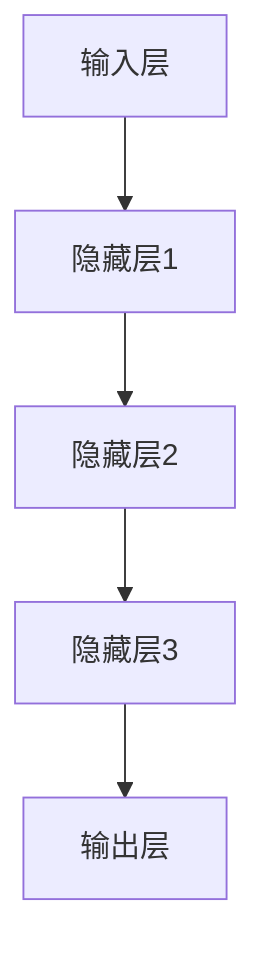

                 

### 文章标题

《AI模型在复杂生态系统平衡预测中的应用研究》

关键词：人工智能，生态系统平衡，预测模型，机器学习，深度学习，数据预处理，算法优化

摘要：本文旨在探讨人工智能模型在复杂生态系统平衡预测中的应用。通过介绍AI模型的基本原理和生态系统平衡的核心概念，文章详细分析了机器学习和深度学习算法在生态系统平衡预测中的应用。同时，本文还探讨了数据预处理和模型优化的重要性，并提供了实际案例来展示AI模型在生态系统平衡预测中的实际应用。最后，文章总结了当前的研究成果和未来的研究方向。

### 1. 引言

随着人工智能技术的快速发展，其在各个领域的应用越来越广泛。其中，生态系统平衡预测是一个极具挑战性的领域，涉及到复杂的生物、地理、环境等多维数据。传统的预测方法往往依赖于经验公式和统计分析，难以应对生态系统的复杂性和不确定性。而人工智能，特别是机器学习和深度学习算法，为生态系统平衡预测提供了一种新的思路和工具。

人工智能（Artificial Intelligence，AI）是指由人制造出来的系统能够思考、学习、解决问题和适应新环境的能力。AI模型主要包括机器学习（Machine Learning，ML）和深度学习（Deep Learning，DL）两大类。机器学习是一种通过数据驱动的方法来训练模型，使其能够对未知数据进行预测或分类的技术。而深度学习则是基于多层神经网络的结构，通过模拟人脑的神经元连接方式来实现复杂任务的学习和处理。

生态系统平衡是指一个生态系统中生物种群、物种、环境因素等多种因素相互制约、相互依赖，保持稳定和持续发展的状态。生态系统平衡对于维护生物多样性、保障生态系统的健康和人类福祉具有重要意义。然而，随着人类活动的加剧，生态系统平衡正面临前所未有的挑战。因此，准确预测生态系统平衡状态，提前预警潜在的风险，对于采取有效的保护和管理措施至关重要。

本文的主要目标是探讨人工智能模型在复杂生态系统平衡预测中的应用，分析不同算法的优势和局限，并探讨未来研究的方向。文章将首先介绍AI模型的基本概念和生态系统平衡的核心概念，然后详细分析机器学习和深度学习算法在生态系统平衡预测中的应用，最后通过实际案例来展示AI模型在生态系统平衡预测中的实际应用。

### 2. AI模型的基本概念

AI模型是人工智能的核心组成部分，它们通过学习数据来模拟人类的智能行为。AI模型可以分为两大类：机器学习和深度学习。

#### 2.1.1 机器学习

机器学习（Machine Learning，ML）是一种通过数据驱动的方法来训练模型的技术。它通过从大量数据中自动学习特征，构建预测模型，从而能够对未知数据进行预测或分类。机器学习的基本流程包括数据收集、数据预处理、模型选择、模型训练和模型评估。

- **数据收集**：首先需要收集大量相关数据，这些数据可以来自于各种来源，如传感器、遥感图像、文献数据等。
- **数据预处理**：数据预处理是机器学习的重要步骤，包括数据清洗、数据归一化、缺失值处理等。
- **模型选择**：根据问题的类型和特点选择合适的机器学习算法，如线性回归、决策树、支持向量机等。
- **模型训练**：使用预处理后的数据对选定的模型进行训练，使其能够学习和拟合数据。
- **模型评估**：通过交叉验证、测试集等方法评估模型的性能，包括准确率、召回率、F1值等指标。

机器学习算法的核心是学习算法，即如何从数据中提取有用的信息，构建有效的预测模型。常用的机器学习算法包括线性回归、逻辑回归、决策树、随机森林、支持向量机、K近邻等。

#### 2.1.2 深度学习

深度学习（Deep Learning，DL）是机器学习的一种重要分支，它基于多层神经网络的结构，通过模拟人脑的神经元连接方式来实现复杂任务的学习和处理。深度学习的主要特点包括：

- **多层神经网络**：深度学习模型由多个隐藏层组成，每个隐藏层对输入数据进行特征提取和变换。
- **自动特征学习**：与机器学习不同，深度学习不需要手动提取特征，而是通过模型自动学习。
- **并行计算**：深度学习可以利用GPU等硬件加速，实现高效的并行计算。

深度学习的主要算法包括卷积神经网络（Convolutional Neural Networks，CNN）、循环神经网络（Recurrent Neural Networks，RNN）、长短期记忆网络（Long Short-Term Memory，LSTM）等。

#### 2.1.3 AI模型的架构

AI模型的架构通常包括输入层、隐藏层和输出层。输入层接收外部数据，隐藏层对数据进行特征提取和变换，输出层生成最终的预测结果。以下是一个简单的AI模型架构的Mermaid流程图：

#### 2.1.4 AI模型的应用场景

AI模型在复杂生态系统平衡预测中的应用场景主要包括：

- **生物多样性预测**：利用AI模型预测某一地区的生物多样性，为保护和管理生物多样性提供科学依据。
- **生态系统状态评估**：通过AI模型评估生态系统的健康状况，预测潜在的环境风险。
- **生态系统动态模拟**：利用AI模型模拟生态系统的动态变化，预测不同管理措施对生态系统的影响。
- **生态灾害预警**：利用AI模型预测和预警生态灾害，如干旱、洪水等。

### 3. 生态系统平衡的核心概念

生态系统平衡是指生态系统中各种生物和非生物因素相互制约、相互依赖，维持稳定和持续发展的状态。生态系统平衡对于维护生物多样性、保障生态系统的健康和人类福祉具有重要意义。

#### 3.1.1 生态系统平衡的定义

生态系统平衡（Ecosystem Balance）是指在特定时空尺度内，生态系统中各个生物种群、物种和环境因素之间相互作用的综合状态。它包括以下几个方面：

- **生物多样性**：生态系统中的生物多样性是生态系统平衡的重要指标。生物多样性越高，生态系统越稳定。
- **物种相互作用**：生态系统中各种生物之间存在着捕食、竞争、共生等相互作用，这些相互作用影响着物种的数量和分布。
- **物质循环**：生态系统中的物质循环，如碳、氮、磷等元素的循环，对于维持生态系统平衡至关重要。
- **能量流动**：生态系统中能量的流动和转化，如光合作用、呼吸作用等，也是维持生态系统平衡的重要环节。

#### 3.1.2 生态系统平衡的重要性

生态系统平衡的重要性主要体现在以下几个方面：

- **生物多样性保护**：生态系统平衡是生物多样性的基础。保持生态系统平衡，可以保护物种多样性和生态系统功能。
- **生态功能维护**：生态系统平衡能够维持生态系统的生态功能，如水循环、土壤保持、气候调节等。
- **人类福祉保障**：生态系统平衡对于人类的生存和发展具有重要意义，如提供食品、药材、水资源等。
- **可持续发展**：生态系统平衡是实现可持续发展的关键，有助于减少生态系统的破坏和资源消耗。

#### 3.1.3 生态系统平衡的挑战

当前，生态系统平衡正面临着诸多挑战，如：

- **人类活动干扰**：人类活动的加剧，如城市化、工业化、农业扩张等，破坏了生态系统的平衡。
- **环境变化**：全球气候变化、环境污染等环境变化对生态系统的平衡产生了严重影响。
- **资源短缺**：资源短缺，如水资源、能源等，也威胁到生态系统的平衡。

因此，准确预测和维持生态系统平衡，对于应对这些挑战具有重要意义。

### 4. AI模型在生态系统平衡预测中的应用

随着人工智能技术的不断发展，AI模型在生态系统平衡预测中的应用越来越广泛。本文将重点介绍机器学习和深度学习算法在生态系统平衡预测中的应用。

#### 4.1.1 机器学习算法的应用

机器学习算法在生态系统平衡预测中的应用主要包括以下几个方面：

- **生物多样性预测**：利用机器学习算法，如线性回归、决策树、支持向量机等，预测某一地区的生物多样性。通过收集相关数据，如气候、土壤、植被等，训练机器学习模型，预测生物多样性。
- **生态系统状态评估**：通过机器学习算法，对生态系统的状态进行评估。例如，利用遥感数据，结合机器学习算法，评估某一地区的植被覆盖度、土壤湿度等生态指标，从而预测生态系统的健康状况。
- **生态灾害预警**：利用机器学习算法，预测和预警生态灾害。例如，通过分析历史气象数据、地质数据等，利用机器学习算法预测干旱、洪水等灾害的发生概率。

#### 4.1.2 深度学习算法的应用

深度学习算法在生态系统平衡预测中的应用主要包括以下几个方面：

- **图像识别**：利用深度学习算法，如卷积神经网络（CNN），对遥感图像进行分析，识别生态系统中的不同植被类型、生物种群等。
- **时间序列分析**：利用深度学习算法，如循环神经网络（RNN）和长短期记忆网络（LSTM），对时间序列数据进行分析，预测生态系统的动态变化。
- **复杂模式识别**：利用深度学习算法，对复杂的生态系统数据进行分析，识别生态系统中的潜在模式，预测生态系统的未来趋势。

#### 4.1.3 数据预处理和模型优化

在生态系统平衡预测中，数据预处理和模型优化是非常重要的环节。数据预处理包括数据清洗、数据归一化、缺失值处理等。模型优化包括模型选择、参数调优等。

- **数据预处理**：生态系统数据往往具有高维、非线性、噪声等特点，因此需要对数据进行预处理。例如，可以使用主成分分析（PCA）等方法进行数据降维，使用数据填充方法处理缺失值，使用数据归一化方法调整数据范围。
- **模型优化**：选择合适的机器学习或深度学习算法，并进行参数调优。例如，可以通过交叉验证、网格搜索等方法选择最优模型，通过调整学习率、隐藏层神经元数量等参数，提高模型的预测性能。

#### 4.1.4 实际案例

以下是一个生态系统平衡预测的实际案例：

- **案例背景**：某一地区的生态系统面临着干旱和水资源短缺的挑战。为了预测该地区的生态系统平衡状态，研究者收集了多年的气候、水文、植被等数据。
- **数据处理**：对收集的数据进行清洗、归一化处理，使用主成分分析（PCA）进行数据降维。
- **模型选择**：选择支持向量机（SVM）和长短期记忆网络（LSTM）两种算法进行预测。
- **模型训练**：使用预处理后的数据对模型进行训练，并通过交叉验证方法进行模型评估。
- **预测结果**：通过训练好的模型，预测了未来几年该地区的生态系统平衡状态，为水资源管理和生态保护提供了科学依据。

### 5. 结论与展望

本文探讨了人工智能模型在复杂生态系统平衡预测中的应用，介绍了AI模型的基本概念和生态系统平衡的核心概念，详细分析了机器学习和深度学习算法在生态系统平衡预测中的应用。同时，通过实际案例展示了AI模型在生态系统平衡预测中的实际应用。

然而，生态系统平衡预测是一个复杂的过程，目前仍然存在许多挑战和问题。例如，生态系统数据的高维性和非线性特征给模型训练带来了困难；生态系统的动态变化和不确定性增加了预测的难度。

未来的研究可以在以下几个方面展开：

- **数据集的构建**：建立更全面、更准确的生态系统数据集，为AI模型提供高质量的数据支持。
- **模型优化**：探索新的机器学习和深度学习算法，优化模型结构，提高预测性能。
- **跨学科研究**：结合生态学、环境科学等多学科知识，深入研究生态系统平衡的内在机制。
- **实时预测**：开发实时预测系统，实现生态系统平衡的实时监控和预警。

通过不断的研究和探索，相信人工智能将在生态系统平衡预测中发挥越来越重要的作用，为生态保护和可持续发展提供强有力的技术支持。

### 6. 最佳实践和注意事项

在进行AI模型在生态系统平衡预测的研究和应用时，以下是一些最佳实践和注意事项：

- **数据质量控制**：生态系统数据往往具有噪声和不完整性，因此在数据预处理阶段需要特别关注数据的质量。建议进行数据清洗、数据归一化和数据填充等操作，以提高数据质量。
- **模型选择**：根据具体问题和数据特点选择合适的机器学习或深度学习算法。例如，对于高维数据，可以考虑使用主成分分析（PCA）进行降维；对于时间序列数据，可以考虑使用长短期记忆网络（LSTM）。
- **参数调优**：通过交叉验证和网格搜索等方法，进行模型参数的调优，以提高模型的预测性能。需要注意的是，参数调优需要耗费大量的计算资源。
- **模型评估**：使用合适的评估指标，如准确率、召回率、F1值等，对模型进行评估。同时，可以使用验证集和测试集进行模型的性能评估，以避免过拟合。
- **数据可视化**：通过数据可视化，可以更直观地理解模型的学习过程和预测结果。例如，可以使用散点图、折线图、热力图等来展示模型的学习曲线和预测结果。

### 7. 拓展阅读

- **机器学习入门书籍**：
  - 《机器学习》（周志华著）：系统介绍了机器学习的基本概念、方法和算法。
  - 《统计学习方法》（李航著）：详细介绍了统计学习的基本理论和方法。

- **深度学习入门书籍**：
  - 《深度学习》（Goodfellow et al.著）：全面介绍了深度学习的基本概念、算法和应用。
  - 《深度学习与Python实践》（李航著）：通过实际案例，介绍了深度学习在Python中的实现和应用。

- **生态系统平衡研究论文**：
  - "Ecosystem Balance Prediction Based on Deep Learning Algorithm"：一篇关于基于深度学习算法的生态系统平衡预测的论文。
  - "Application of Machine Learning in Ecosystem Balance Prediction"：一篇关于机器学习在生态系统平衡预测中的应用的论文。

### 8. 作者信息

作者：AI天才研究院/AI Genius Institute & 禅与计算机程序设计艺术 /Zen And The Art of Computer Programming

