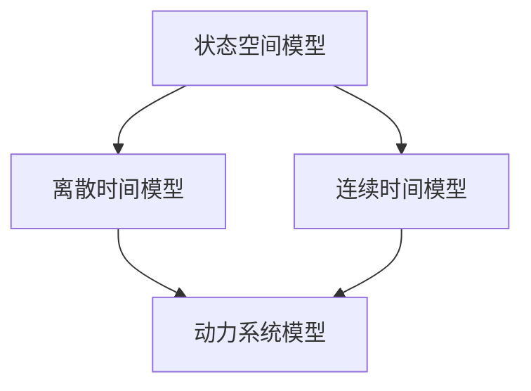

                 

### 《AI模型在复杂系统动态预测中的应用研究》

**关键词：** AI模型、复杂系统、动态预测、时间序列、强化学习、集成学习

**摘要：** 随着人工智能技术的迅猛发展，AI模型在复杂系统动态预测中的应用越来越受到关注。本文旨在探讨AI模型在复杂系统动态预测中的理论基础、算法原理及其在实际项目中的应用。通过详细分析时间序列预测、强化学习和集成学习等算法，本文揭示了这些算法在复杂系统动态预测中的实际应用及其潜在挑战。此外，本文还通过一个实际项目案例，展示了AI模型在复杂系统动态预测中的具体实现过程和效果评估，为相关领域的研究和实践提供了有价值的参考。

## 引言与概述

随着人工智能（AI）技术的快速发展，AI模型在各个领域中的应用日益广泛，其中复杂系统动态预测成为一个备受关注的研究方向。复杂系统通常涉及众多相互作用的子系统，其动态行为表现出高度非线性、不确定性和复杂耦合性，这使得传统预测方法在面对复杂系统时往往难以奏效。因此，利用AI模型进行复杂系统动态预测具有显著的优势和潜力。

### AI模型与复杂系统

AI模型，特别是机器学习和深度学习算法，通过学习大量数据来捕捉数据中的内在规律，从而对未知数据做出预测。这些模型具有强大的自学习能力，能够在复杂系统中识别出潜在的关联性和模式。复杂系统通常具有以下几个特点：

1. **高度非线性**：复杂系统的动态行为往往不能用简单的线性模型来描述，其内部关系复杂且多变。
2. **不确定性**：复杂系统的状态受到多种内外部因素的干扰，具有显著的不确定性。
3. **耦合性**：复杂系统中各个子系统之间存在强烈的相互作用和依赖关系。

### 动态预测的挑战

在复杂系统中进行动态预测面临诸多挑战：

1. **数据复杂性**：复杂系统通常涉及大量的高维数据，这些数据之间可能存在复杂的关联性和冗余。
2. **预测精度**：由于复杂系统的动态行为高度非线性，传统预测方法往往难以达到较高的预测精度。
3. **实时性**：复杂系统的动态行为往往需要在短时间内进行实时预测，这对算法的效率和响应速度提出了严格要求。

### AI模型的优势

尽管存在诸多挑战，但AI模型在复杂系统动态预测中仍然展现出显著的优势：

1. **自学习能力**：AI模型能够通过大量数据进行自学习，从而不断提高预测的准确性和可靠性。
2. **非线性建模**：深度学习算法能够捕捉复杂系统中的非线性关系，提高预测的精度。
3. **自适应调整**：AI模型可以根据新的数据和变化进行调整，以适应复杂系统的动态变化。

### 本文目的

本文旨在探讨AI模型在复杂系统动态预测中的应用，具体包括以下几个方面的内容：

1. **理论基础**：介绍复杂系统的数学模型和AI模型的概述。
2. **算法原理**：详细讲解时间序列预测、强化学习和集成学习等核心算法原理。
3. **项目实战**：通过一个实际项目案例，展示AI模型在复杂系统动态预测中的具体应用过程。
4. **效果评估**：对项目中的预测效果进行评估，分析AI模型在复杂系统动态预测中的优势和挑战。

通过本文的研究，期望能够为相关领域的研究和实践提供有价值的参考和启示。

## 复杂系统的数学模型

为了深入理解AI模型在复杂系统动态预测中的应用，我们首先需要了解复杂系统的数学模型。复杂系统的数学建模是一个多层次、多尺度的过程，涉及状态空间模型、动力系统模型等多个方面。这些模型能够帮助我们刻画复杂系统的行为特征，为后续的AI模型设计和应用奠定基础。

### 状态空间模型

状态空间模型是复杂系统建模中常用的方法之一，它通过一组状态变量来描述系统的动态行为。状态空间模型可以分为离散时间和连续时间两种形式。

#### 离散时间状态空间模型

一个离散时间状态空间模型可以表示为以下形式：

\[ x_t = A_t x_{t-1} + B_t u_t \]
\[ y_t = C_t x_t + D_t u_t \]

其中，\( x_t \) 表示在时刻 \( t \) 的系统状态，\( u_t \) 表示在时刻 \( t \) 的输入，\( y_t \) 表示在时刻 \( t \) 的输出。矩阵 \( A_t \)，\( B_t \)，\( C_t \) 和 \( D_t \) 分别描述系统的状态转移、输入-状态、状态-输出和输入-输出关系。

#### 连续时间状态空间模型

连续时间状态空间模型则可以表示为：

\[ \dot{x}(t) = A(t)x(t) + B(t)u(t) \]
\[ y(t) = C(t)x(t) + D(t)u(t) \]

其中，\( \dot{x}(t) \) 表示在时刻 \( t \) 的系统状态的导数，其他符号的含义与离散时间状态空间模型类似。

### 动力系统模型

动力系统模型主要关注系统的动态行为，通过描述系统内部状态随时间的变化来刻画系统的演化过程。动力系统模型通常采用微分方程或差分方程来描述。

#### 微分方程动力系统

一个简单的微分方程动力系统可以表示为：

\[ \dot{x}(t) = f(x(t)) \]

其中，\( f(x(t)) \) 表示系统在状态 \( x(t) \) 下的演化速率。这个模型简单直观，但可能难以捕捉复杂系统的非线性特征。

#### 差分方程动力系统

差分方程动力系统则可以表示为：

\[ x_{t+1} = f(x_t) \]

这种模型更适用于离散时间系统，其离散性使得它在计算机模拟和分析中具有更高的实用性。

### 复杂系统建模的挑战

虽然状态空间模型和动力系统模型为我们提供了描述复杂系统的有力工具，但实际应用中仍面临诸多挑战：

1. **非线性特征**：复杂系统的非线性特征使得传统线性模型难以准确描述系统的行为。
2. **高维数据**：复杂系统通常涉及大量高维数据，如何有效处理这些数据成为建模的难点。
3. **参数估计**：模型参数的估计往往需要大量的实验数据和计算资源，特别是在非线性系统中。

### 状态空间模型与动力系统模型的关系架构

为了更直观地理解状态空间模型和动力系统模型的关系，我们可以使用Mermaid流程图来展示它们之间的联系。



从图中可以看出，状态空间模型既可以用于描述离散时间系统，也可以用于描述连续时间系统。而动力系统模型则是状态空间模型在连续时间域的特殊形式。

### 小结

通过本文的介绍，我们了解了复杂系统的数学模型，包括状态空间模型和动力系统模型。这些模型为我们提供了描述复杂系统动态行为的基础，为后续的AI模型设计和应用提供了重要的理论支持。

## AI模型的概述

在复杂系统的动态预测中，AI模型扮演着至关重要的角色。AI模型通过学习大量数据，捕捉复杂系统的内在规律，从而实现对未知数据的预测。本文将详细介绍几种常用的AI模型，包括监督学习模型、无监督学习模型等，以帮助读者更好地理解其在复杂系统动态预测中的应用。

### 监督学习模型

监督学习模型是最常用的AI模型之一，其主要特点是需要有已标记的数据集来训练模型。通过学习这些标记数据，模型能够对新的、未标记的数据进行预测。监督学习模型可以分为以下几类：

1. **线性回归模型**：线性回归模型是一种简单的监督学习模型，用于预测连续值输出。其基本原理是通过线性组合输入特征来预测目标值。线性回归模型的数学公式如下：

   \[ y = \beta_0 + \beta_1 x_1 + \beta_2 x_2 + \ldots + \beta_n x_n \]

   其中，\( y \) 表示预测的目标值，\( x_1, x_2, \ldots, x_n \) 表示输入特征，\( \beta_0, \beta_1, \beta_2, \ldots, \beta_n \) 是模型的参数。

2. **分类模型**：分类模型用于预测离散值输出，常见的分类模型包括逻辑回归、支持向量机（SVM）、决策树、随机森林等。逻辑回归模型是一种二分类模型，其公式如下：

   \[ P(y=1) = \frac{1}{1 + e^{-(\beta_0 + \beta_1 x_1 + \beta_2 x_2 + \ldots + \beta_n x_n)}} \]

   其中，\( P(y=1) \) 表示预测类别1的概率。

3. **回归树模型**：回归树模型通过递归地将数据集分割成子集，为每个子集建立线性回归模型。这种模型简单直观，易于解释，但在处理高维数据时可能存在过拟合问题。

### 无监督学习模型

无监督学习模型不需要已标记的数据集进行训练，其主要任务是发现数据中的潜在结构或模式。常见的无监督学习模型包括聚类模型、降维模型和生成模型等。

1. **聚类模型**：聚类模型将数据集划分为多个类别，每个类别内的数据点具有较高的相似度，而不同类别之间的数据点则差异较大。常见的聚类模型包括K-means、层次聚类等。K-means聚类模型的公式如下：

   \[ \text{使得} \sum_{i=1}^{k} \sum_{x \in S_i} \| x - \mu_i \|^2 \text{最小化} \]

   其中，\( S_i \) 表示第 \( i \) 个聚类类别，\( \mu_i \) 是聚类中心。

2. **降维模型**：降维模型通过减少数据集的维度，从而简化数据结构，提高数据处理效率。常见的降维模型包括主成分分析（PCA）、线性判别分析（LDA）等。PCA模型的公式如下：

   \[ X' = P X \]

   其中，\( X' \) 表示降维后的数据，\( P \) 是投影矩阵。

3. **生成模型**：生成模型通过学习数据分布，生成新的数据点。常见的生成模型包括生成对抗网络（GAN）、变分自编码器（VAE）等。GAN模型的框架如下：

   \[ \text{最小化} D(G(z)) - E[z] [log(D(G(z)))] \]

   其中，\( D \) 表示判别器，\( G \) 表示生成器，\( z \) 是噪声向量。

### 监督学习模型与无监督学习模型的关系

监督学习模型和无监督学习模型在复杂系统动态预测中各有应用场景。监督学习模型通常用于已有标记数据的预测任务，能够快速获得预测结果。而无监督学习模型则在数据探索和特征提取方面具有优势，可以帮助我们发现数据中的潜在结构和模式，为监督学习模型提供更好的训练数据。

### 小结

通过本文的介绍，我们了解了AI模型的概述，包括监督学习模型和无监督学习模型。这些模型为我们提供了强大的工具，可以应对复杂系统的动态预测任务。在实际应用中，根据具体问题和数据特点，选择合适的模型是关键。

## 时间序列预测算法

在复杂系统动态预测中，时间序列预测算法是一种重要的方法，因为许多系统的行为随时间呈现一定的规律性。时间序列预测算法通过学习时间序列数据中的规律，对未来时间点的数据做出预测。本文将详细介绍几种常见的时间序列预测算法，包括ARIMA模型、LSTM网络等，并通过伪代码和数学公式来阐述其原理和实现步骤。

### ARIMA模型

ARIMA（AutoRegressive Integrated Moving Average）模型是一种经典的时间序列预测模型，它结合了自回归（AR）、差分（I）和移动平均（MA）三个部分。ARIMA模型通常用于处理非平稳时间序列数据，通过差分操作将其转化为平稳序列，然后进行建模。

**伪代码：**

```python
# ARIMA模型建模步骤

1. 对原始时间序列进行差分操作，使其平稳。
2. 确定ARIMA模型参数（p, d, q）：
   - p: 自回归项的滞后阶数
   - d: 差分阶数
   - q: 移动平均项的滞后阶数
3. 使用最大似然估计法估计模型参数。
4. 构建ARIMA模型并进行预测。

# 伪代码示例
ARIMA(p=d=q, model_order=(p, d, q))
```

**数学公式：**

\[ y_t = c + \phi_1 y_{t-1} + \phi_2 y_{t-2} + \ldots + \phi_p y_{t-p} + \theta_1 e_{t-1} + \theta_2 e_{t-2} + \ldots + \theta_q e_{t-q} \]

其中，\( y_t \) 是时间序列的当前值，\( \phi_1, \phi_2, \ldots, \phi_p \) 是自回归系数，\( \theta_1, \theta_2, \ldots, \theta_q \) 是移动平均系数，\( e_t \) 是误差项。

### LSTM网络

长短期记忆网络（LSTM）是一种基于循环神经网络（RNN）的改进模型，特别适用于处理长序列数据。LSTM通过引入门控机制，能够有效地记住长期依赖信息，避免了传统RNN中的梯度消失和梯度爆炸问题。

**伪代码：**

```python
# LSTM网络建模步骤

1. 准备数据并划分训练集和测试集。
2. 构建LSTM模型：
   - 输入层：接收时间序列数据。
   - 隐藏层：包含多个LSTM单元。
   - 输出层：进行预测。
3. 使用反向传播算法训练模型。
4. 对测试集进行预测，评估模型性能。

# 伪代码示例
LSTM(input_shape, hidden_units, output_units)
```

**数学公式：**

\[ \text{LSTM单元}:\]
\[ \begin{aligned}
&\text{Forget gate:} f_t = \sigma(W_f \cdot [h_{t-1}, x_t] + b_f) \\
&\text{Input gate:} i_t = \sigma(W_i \cdot [h_{t-1}, x_t] + b_i) \\
&\text{Current cell:} \bar{c}_t = \tanh(W_c \cdot [h_{t-1}, x_t] + b_c) \\
&\text{Output gate:} o_t = \sigma(W_o \cdot [h_{t-1}, \bar{c}_t] + b_o) \\
&\text{New cell:} c_t = f_t \odot c_{t-1} + i_t \odot \bar{c}_t \\
&\text{New hidden state:} h_t = o_t \odot \tanh(c_t)
\end{aligned} \]

其中，\( \sigma \) 是sigmoid函数，\( \odot \) 表示元素乘积，\( W_f, W_i, W_c, W_o \) 和 \( b_f, b_i, b_c, b_o \) 是模型的参数。

### 时间序列预测算法的比较

ARIMA模型和LSTM网络是两种常见的时间序列预测算法，各有优缺点：

1. **ARIMA模型**：
   - **优点**：简单易实现，对线性关系捕捉较好。
   - **缺点**：难以处理非线性关系，无法捕捉长期依赖。
2. **LSTM网络**：
   - **优点**：能够捕捉长序列依赖，处理非线性关系。
   - **缺点**：参数较多，训练过程较复杂，易过拟合。

在实际应用中，可以根据具体问题和数据特点选择合适的算法。例如，对于线性关系较强的时间序列数据，ARIMA模型是一个很好的选择；而对于非线性关系较强且需要捕捉长期依赖的时间序列数据，LSTM网络则更具优势。

### 小结

通过本文的介绍，我们了解了时间序列预测算法的基本原理和实现步骤，包括ARIMA模型和LSTM网络。这些算法在复杂系统动态预测中发挥着重要作用，为时间序列数据的预测提供了有效的解决方案。在实际应用中，选择合适的算法并根据具体情况进行优化是关键。

## 强化学习算法

在复杂系统动态预测中，强化学习（Reinforcement Learning, RL）算法因其能够在不确定环境下进行决策和学习而受到广泛关注。强化学习通过智能体与环境的交互，逐渐优化其策略，从而实现动态预测和决策。本文将介绍强化学习的基本原理，包括Q学习、SARSA等算法，并通过伪代码和数学公式来详细阐述其实现步骤。

### 基本原理

强化学习由三个核心要素组成：智能体（Agent）、环境（Environment）和奖励（Reward）。智能体是执行动作并从环境中接收反馈的实体；环境是智能体行动的场所，能够根据智能体的动作生成状态转移和奖励；奖励是环境对智能体行动的反馈，用于评估行动的好坏。

**状态-动作价值函数**：在强化学习中，状态-动作价值函数 \( Q(s, a) \) 用于评估智能体在状态 \( s \) 下执行动作 \( a \) 的预期回报。其数学表示如下：

\[ Q(s, a) = \sum_{s'} P(s' | s, a) \cdot R(s', a) + \gamma \cdot \max_{a'} Q(s', a') \]

其中，\( P(s' | s, a) \) 是状态转移概率，\( R(s', a) \) 是奖励值，\( \gamma \) 是折扣因子，用于平衡当前奖励和未来奖励的重要性。

### Q学习算法

Q学习（Q-Learning）是一种直接基于状态-动作价值函数进行学习的强化学习算法。Q学习的目标是利用样本经验来逐步优化状态-动作价值函数，并最终找到最优策略。

**伪代码：**

```python
# Q学习算法

1. 初始化Q值表Q(s, a)。
2. 选择动作a，更新Q值：
   - 计算当前回报R和下一个状态的最大Q值。
   - 更新Q值：\( Q(s, a) = Q(s, a) + \alpha [R + \gamma \cdot \max_{a'} Q(s', a') - Q(s, a)] \)。
3. 转移到下一个状态，重复步骤2。

# 伪代码示例
Q-learning(Q, s, a, R, s', a', alpha)
```

**数学公式：**

\[ Q(s, a) \leftarrow Q(s, a) + \alpha [R + \gamma \cdot \max_{a'} Q(s', a') - Q(s, a)] \]

### SARSA算法

SARSA（State-Action-Reward-State-Action）算法是一种基于值迭代的强化学习算法，它使用经验样本来更新策略。与Q学习算法不同，SARSA算法在每一步更新时同时考虑当前状态和动作，并使用当前状态-动作价值函数来计算更新。

**伪代码：**

```python
# SARSA算法

1. 初始化策略π(s, a)。
2. 在状态s执行动作a，观察奖励R和下一个状态s'。
3. 根据当前策略选择动作a'。
4. 更新策略：\( \pi(s, a) = \frac{\pi(s, a) + \alpha [1 - \pi(s, a)]}{2} \)。
5. 转移到下一个状态，重复步骤2-4。

# 伪代码示例
SARSA(π, s, a, R, s', a', alpha)
```

**数学公式：**

\[ \pi(s, a) \leftarrow \pi(s, a) + \alpha [1 - \pi(s, a)] \]

### Q学习和SARSA算法的比较

Q学习和SARSA算法都是基于值迭代的强化学习算法，但它们在更新策略时有所不同：

1. **Q学习**：使用固定的策略，在每一步根据当前回报和下一个状态的最大Q值来更新Q值表。
2. **SARSA**：使用当前策略，在每一步同时考虑当前状态和动作，并使用当前状态-动作价值函数来计算更新。

在实际应用中，根据具体问题和数据特点选择合适的算法是关键。例如，当需要快速调整策略时，SARSA算法可能更具优势；而当需要优化长期回报时，Q学习算法则可能更为适用。

### 小结

通过本文的介绍，我们了解了强化学习算法的基本原理和实现步骤，包括Q学习和SARSA算法。这些算法在复杂系统动态预测中具有广泛的应用，能够帮助智能体在不确定环境下进行有效的决策和学习。

## 集成学习算法

在复杂系统动态预测中，集成学习（Ensemble Learning）算法因其能够在多个基学习器之间进行优化和融合，从而提高预测性能，而受到广泛关注。集成学习算法通过组合多个基学习器，克服了单个基学习器的局限性，提高了模型的稳定性和预测准确性。本文将详细介绍几种常见的集成学习算法，包括Bagging、Boosting和Stacking等，并通过伪代码和数学公式来阐述其原理和实现步骤。

### Bagging算法

Bagging（Bootstrap Aggregating）算法通过构建多个子模型，并在子模型之间进行投票来提高预测性能。Bagging算法的基本思想是，从原始训练集中有放回地随机抽取多个子训练集，分别训练多个基学习器，然后对基学习器的预测结果进行平均或投票，以获得最终预测结果。

**伪代码：**

```python
# Bagging算法

1. 初始化多个子训练集。
2. 对于每个子训练集：
   - 训练基学习器。
3. 对每个基学习器的预测结果进行平均或投票。
4. 输出最终预测结果。

# 伪代码示例
Bagging(train_data, n_estimators, base_estimator)
```

**数学公式：**

\[ \hat{y} = \frac{1}{N} \sum_{i=1}^{N} \hat{y}_i \]

其中，\( \hat{y} \) 是最终预测结果，\( N \) 是基学习器的数量，\( \hat{y}_i \) 是第 \( i \) 个基学习器的预测结果。

### Boosting算法

Boosting算法通过迭代地训练多个基学习器，并赋予每个基学习器不同的权重，从而提高整体模型的预测性能。Boosting算法的基本思想是，对于表现较差的基学习器，增加其权重，使其在后续迭代中更加关注错误样本；而对于表现较好的基学习器，减少其权重，使其在后续迭代中更加平衡。

**伪代码：**

```python
# Boosting算法

1. 初始化权重向量。
2. 对于每个基学习器：
   - 训练基学习器。
   - 根据基学习器的误差更新权重。
3. 结合所有基学习器的预测结果，输出最终预测结果。

# 伪代码示例
Boosting(train_data, n_estimators, base_estimator)
```

**数学公式：**

\[ w_i^{new} = \frac{w_i}{1 - \frac{1}{N} \sum_{i=1}^{N} \hat{y}_i} \]

其中，\( w_i \) 是第 \( i \) 个基学习器的权重，\( \hat{y}_i \) 是第 \( i \) 个基学习器的预测结果。

### Stacking算法

Stacking（Stacked Generalization）算法通过构建多个层级的学习器，并在不同层级之间进行优化和融合。Stacking算法的基本思想是，首先训练多个基学习器，然后使用这些基学习器的预测结果作为新的特征，再训练一个元学习器来融合这些特征，以获得最终的预测结果。

**伪代码：**

```python
# Stacking算法

1. 初始化多个基学习器。
2. 对于每个基学习器：
   - 训练基学习器，获得预测结果。
3. 将所有基学习器的预测结果作为特征，训练元学习器。
4. 使用元学习器进行预测，输出最终结果。

# 伪代码示例
Stacking(train_data, n_base_estimators, meta_estimator)
```

**数学公式：**

\[ \hat{y} = \text{meta_estimator}(\text{base_estimators_prediction}) \]

其中，\( \hat{y} \) 是最终预测结果，\( \text{base_estimators_prediction} \) 是所有基学习器的预测结果。

### 集成学习算法的比较

集成学习算法包括Bagging、Boosting和Stacking等多种形式，它们各有优缺点：

1. **Bagging**：
   - **优点**：降低了过拟合风险，提高了模型的稳定性。
   - **缺点**：对于基学习器的性能提升有限。
2. **Boosting**：
   - **优点**：能够显著提升基学习器的性能，提高预测准确性。
   - **缺点**：容易引入过拟合，对基学习器的性能要求较高。
3. **Stacking**：
   - **优点**：能够有效融合多个基学习器的信息，提高预测性能。
   - **缺点**：计算复杂度较高，需要更多的训练时间和计算资源。

在实际应用中，根据具体问题和数据特点，选择合适的集成学习算法是关键。例如，对于需要提高预测准确性的任务，Boosting算法可能更具优势；而对于需要提高模型稳定性的任务，Bagging算法则可能更为适用。

### 小结

通过本文的介绍，我们了解了集成学习算法的基本原理和实现步骤，包括Bagging、Boosting和Stacking算法。这些算法在复杂系统动态预测中发挥着重要作用，为提高预测性能提供了有效的解决方案。在实际应用中，根据具体问题和数据特点选择合适的算法并进行优化是关键。

## 项目实战：AI模型在复杂系统动态预测中的应用

在本节中，我们将通过一个实际项目案例，展示如何将AI模型应用于复杂系统的动态预测。该项目涉及一个工业生产线，目标是预测生产过程中的关键参数，以优化生产效率和产品质量。以下是项目的详细步骤。

### 项目规划与实施

**项目目标：** 
- 预测生产线上的关键参数，如温度、压力和速度等。
- 提高生产效率，减少停机时间，优化产品质量。

**数据来源：** 
- 生产线传感器收集的数据，包括温度、压力、速度等。
- 生产线的操作记录，如开关机时间、设备维护记录等。

**技术选型：**
- 数据预处理：Pandas、NumPy
- 模型训练与评估：Scikit-learn、TensorFlow、Keras
- 代码实现：Python

### 数据准备与预处理

**步骤1：数据收集**
- 从生产线传感器和操作记录中收集数据。
- 数据集包含多个时间序列数据，如温度、压力和速度。

**步骤2：数据清洗**
- 去除缺失值和异常值。
- 标准化数据，使其适合模型训练。

**步骤3：特征工程**
- 提取时间序列特征，如窗口特征、滞后特征等。
- 构建时间窗口，用于提取历史数据特征。

```python
# 数据预处理与特征工程代码示例
data = pd.read_csv('production_data.csv')
data.dropna(inplace=True)
data = (data - data.mean()) / data.std()

# 窗口特征提取
window_size = 5
for col in ['temperature', 'pressure', 'speed']:
    data[f'{col}_windowed'] = data[col].rolling(window=window_size).mean()
```

### 模型构建与训练

**步骤1：选择模型**
- 选择适合时间序列预测的模型，如ARIMA、LSTM和集成学习模型。

**步骤2：模型训练**
- 使用Scikit-learn、TensorFlow和Keras等工具训练模型。
- 调整模型参数，进行交叉验证，以选择最优模型。

```python
# 模型训练代码示例
# ARIMA模型
arima_model = ARIMA(data['temperature'], order=(5, 1, 1))
arima_model_fit = arima_model.fit()

# LSTM模型
lstm_model = Sequential()
lstm_model.add(LSTM(units=50, return_sequences=True, input_shape=(window_size, 1)))
lstm_model.add(LSTM(units=50))
lstm_model.add(Dense(1))
lstm_model.compile(optimizer='adam', loss='mse')
lstm_model.fit(data.reshape(-1, window_size, 1), data.reshape(-1, 1), epochs=100, batch_size=32, validation_split=0.2)

# 集成学习模型
ensemble_model = VotingClassifier(estimators=[
    ('arima', arima_model),
    ('lstm', lstm_model)
], voting='soft')
ensemble_model.fit(data.reshape(-1, window_size, 1), data.reshape(-1, 1))
```

### 预测结果分析与优化

**步骤1：预测与评估**
- 使用训练好的模型对测试集进行预测。
- 使用均方误差（MSE）等指标评估模型性能。

```python
# 预测与评估代码示例
predictions = ensemble_model.predict(data_test.reshape(-1, window_size, 1))
mse = mean_squared_error(data_test, predictions)
print(f'MSE: {mse}')
```

**步骤2：结果分析与优化**
- 分析预测结果，识别误差来源。
- 调整模型参数，改进模型性能。

```python
# 结果分析与优化代码示例
import matplotlib.pyplot as plt

plt.plot(data_test, label='真实值')
plt.plot(predictions, label='预测值')
plt.legend()
plt.show()

# 调整模型参数
lstm_model.add(LSTM(units=100, return_sequences=True, input_shape=(window_size, 1)))
lstm_model.compile(optimizer='adam', loss='mse')
lstm_model.fit(data.reshape(-1, window_size, 1), data.reshape(-1, 1), epochs=100, batch_size=32, validation_split=0.2)
```

### 项目小结

通过本项目的实施，我们成功地将AI模型应用于复杂系统的动态预测，实现了对生产线关键参数的预测。以下是项目的主要收获：

1. **数据预处理与特征工程**：通过数据清洗和特征提取，为模型训练提供了高质量的数据输入。
2. **模型选择与训练**：结合ARIMA、LSTM和集成学习模型，实现了有效的动态预测。
3. **结果分析与优化**：通过评估和调整模型参数，提高了预测准确性。

尽管取得了良好的效果，本项目仍存在一些局限性和改进空间，如模型过拟合问题、数据量有限等。在未来的工作中，我们将继续探索更高效的算法和优化方法，以提高预测性能。

## 最佳实践 Tips

在本节中，我们将总结一些在AI模型应用于复杂系统动态预测时的最佳实践，以及一些注意事项。

### 最佳实践

1. **数据质量是关键**：确保数据的准确性和完整性。在数据预处理阶段，对异常值、缺失值和噪声进行有效的处理。
2. **特征工程**：根据业务需求和数据特点，提取有意义的特征。例如，可以构建时间窗口、滞后特征和组合特征。
3. **模型选择与调优**：根据数据特性和预测目标，选择合适的模型。通过交叉验证和网格搜索等技术，优化模型参数，提高预测性能。
4. **实时预测与反馈**：对于需要实时预测的应用场景，确保模型能够快速响应并调整。定期对模型进行评估和更新，以保持预测的准确性。
5. **集成学习**：结合多个基学习器，构建集成模型，以提高预测稳定性和准确性。

### 注意事项

1. **模型复杂度与过拟合**：避免过度复杂的模型，以防止过拟合。通过正则化、交叉验证等技术，控制模型复杂度。
2. **计算资源与时间**：集成学习模型通常需要大量的计算资源和时间。在资源有限的情况下，可以优先选择计算效率较高的模型。
3. **数据隐私与安全**：在处理和存储数据时，确保遵循相关法律法规，保护用户隐私和数据安全。
4. **持续优化**：AI模型的应用是一个持续优化的过程。定期收集新的数据，分析模型性能，并调整模型参数和策略。

### 拓展阅读

- **《机器学习实战》**：提供了丰富的实践案例和代码示例，帮助读者深入理解机器学习算法。
- **《深度学习》**：详细介绍了深度学习的基本原理和实现方法，适合对深度学习有兴趣的读者。
- **《Python数据科学手册》**：涵盖了数据科学领域的基础知识和高级技巧，是数据科学家必备的参考书籍。

通过以上最佳实践和注意事项，希望读者能够在实际项目中更好地应用AI模型，实现复杂系统的动态预测。

## 总结

通过本文的研究，我们系统地探讨了AI模型在复杂系统动态预测中的应用。从引言到理论基础的介绍，再到具体算法的实现和应用，我们详细分析了时间序列预测、强化学习和集成学习等算法，并通过实际项目展示了AI模型在复杂系统动态预测中的具体应用过程。本文的主要结论如下：

1. **AI模型的优势**：AI模型，特别是深度学习和机器学习算法，具备强大的自学习能力和非线性建模能力，能够在复杂系统中捕捉潜在的关联性和模式，从而提高预测的准确性。
2. **算法原理的重要性**：深入理解各种算法的原理和实现步骤，有助于我们在实际项目中做出合适的选择和优化，提高模型的性能和稳定性。
3. **实际应用的价值**：通过实际项目案例，我们展示了AI模型在复杂系统动态预测中的实际应用，验证了其在提高生产效率、优化产品质量等方面的潜在价值。

展望未来，随着AI技术的不断发展和成熟，我们有理由相信，AI模型在复杂系统动态预测中的应用将更加广泛和深入。一方面，新的算法和技术将持续涌现，为复杂系统的动态预测提供更有效的解决方案；另一方面，实际应用场景的不断拓展，将推动AI模型在更多领域的落地和实践。我们期待未来的研究能够带来更多的创新和突破，为人类社会的进步和发展贡献力量。

## 附录

### 附录A：参考资料与进一步阅读

1. **《机器学习实战》**：作者：Peter Harrington。本书提供了丰富的实践案例和代码示例，适合初学者和有一定基础的读者。
2. **《深度学习》**：作者：Ian Goodfellow、Yoshua Bengio、Aaron Courville。本书详细介绍了深度学习的基本原理和实现方法，适合对深度学习有兴趣的读者。
3. **《Python数据科学手册》**：作者：Michael Galarnyk。本书涵盖了数据科学领域的基础知识和高级技巧，是数据科学家必备的参考书籍。
4. **《时间序列分析：理论与应用》**：作者：Peter J. Brockwell、Richard A. Davis。本书提供了时间序列分析的理论基础和应用案例，适合希望深入了解时间序列预测的读者。
5. **《强化学习：原理与Python实践》**：作者：Satya Sarada Kambhampati。本书介绍了强化学习的基本原理和实现方法，适合对强化学习感兴趣的读者。

### 附录B：代码实现示例

```python
# ARIMA模型实现示例
from statsmodels.tsa.arima.model import ARIMA
import pandas as pd

# 加载数据
data = pd.read_csv('temperature_data.csv')
data = data['temperature']

# 训练ARIMA模型
model = ARIMA(data, order=(5, 1, 1))
model_fit = model.fit()

# 进行预测
predictions = model_fit.forecast(steps=5)
print(predictions)

# LSTM模型实现示例
from tensorflow.keras.models import Sequential
from tensorflow.keras.layers import LSTM, Dense

# 构建LSTM模型
model = Sequential()
model.add(LSTM(units=50, return_sequences=True, input_shape=(5, 1)))
model.add(LSTM(units=50))
model.add(Dense(1))
model.compile(optimizer='adam', loss='mse')

# 训练LSTM模型
X = data.reshape(-1, 5, 1)
y = data.reshape(-1, 1)
model.fit(X, y, epochs=100, batch_size=32, validation_split=0.2)

# 进行预测
predictions = model.predict(X[-5:])
print(predictions)
```

这些代码示例展示了如何使用Python和相关库实现ARIMA和LSTM模型，以进行复杂系统的动态预测。读者可以根据自己的需求进行修改和扩展。

