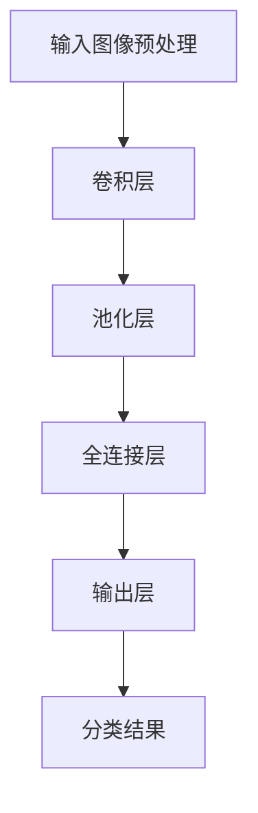
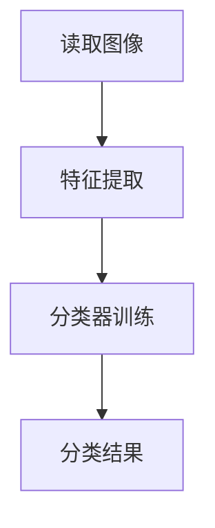
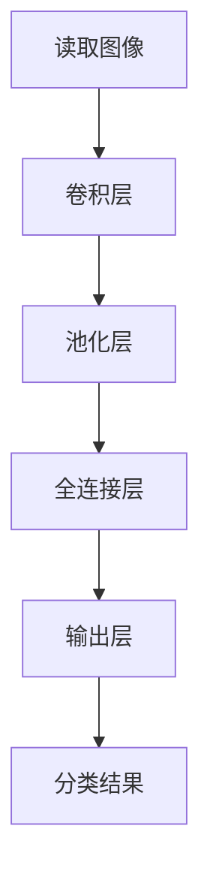
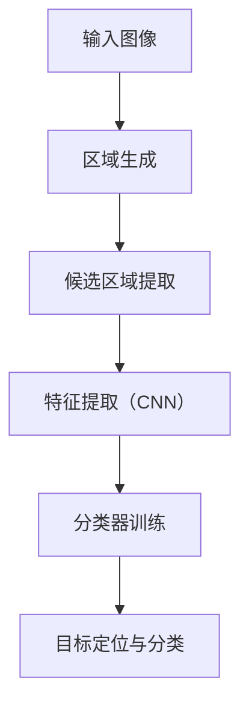
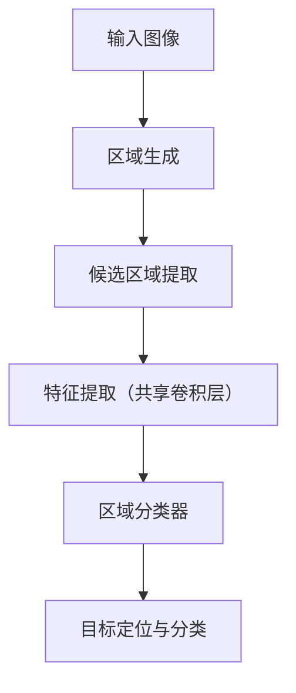
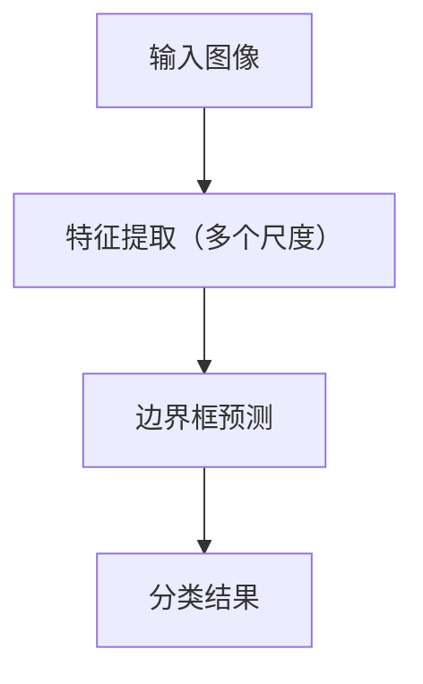
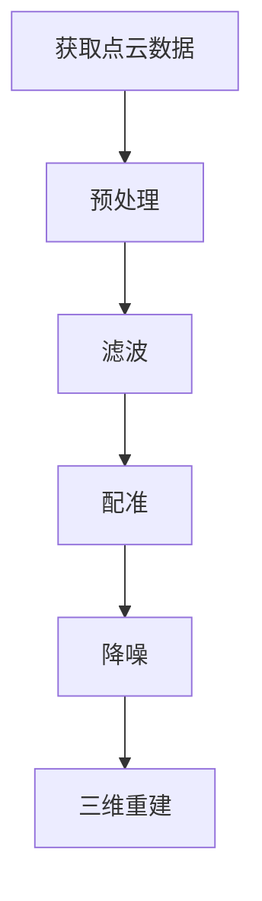
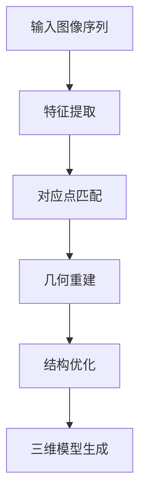
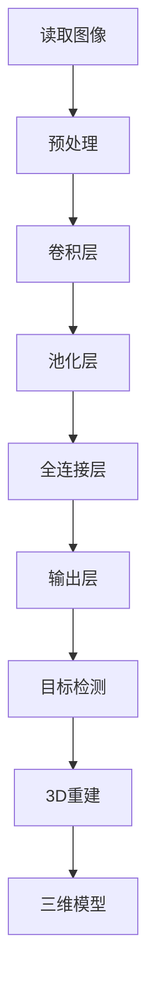

                 

### 文章标题

# AI模型在视觉空间问题上的潜在突破点

### 关键词：

- AI模型
- 视觉空间问题
- 神经网络
- 卷积神经网络（CNN）
- 图神经网络（GNN）
- 目标检测
- 3D重建
- 数据隐私
- 模型可解释性

### 摘要

随着人工智能技术的飞速发展，AI模型在视觉空间问题上的应用愈发广泛。本文将深入探讨AI模型在视觉空间问题上的潜在突破点，包括核心概念、关键算法、实战应用以及未来趋势和挑战。通过对AI模型在视觉空间问题上的全面分析，本文旨在为读者提供一个清晰、系统的理解，帮助其在相关领域取得更深入的研究和应用。

### 设计目录大纲的基本步骤

在撰写一篇关于AI模型在视觉空间问题上的技术博客之前，我们需要明确设计目录大纲的基本步骤，以确保文章的结构清晰、逻辑严谨、内容丰富。以下是具体的设计步骤：

1. **理解主题**：首先，要充分理解《AI模型在视觉空间问题上的潜在突破点》的主题，明确核心内容和目标读者。视觉空间问题涵盖了图像识别、目标检测、3D重建等多个领域，而AI模型在这些领域的应用不断推动着技术的进步。

2. **确定主要章节**：根据主题，我们将文章分为五个主要部分：
   - **引言与概述**：介绍AI模型和视觉空间问题的基本概念，以及本书的结构和学习目标。
   - **核心概念与联系**：详细讲解AI模型的基础概念和与视觉空间问题的联系，并使用Mermaid流程图进行说明。
   - **技术原理与算法**：深入分析AI模型在视觉空间问题上的关键算法，并使用伪代码展示算法原理。
   - **应用实例与实战**：通过具体的实战项目展示AI模型在视觉空间问题上的应用。
   - **未来趋势与挑战**：探讨AI模型在视觉空间问题上的未来发展趋势和技术挑战。

3. **细化章节内容**：对每个主要章节进行细化，列出具体的子章节和小节，确保内容的全面性和逻辑性。例如，在“核心概念与联系”章节中，我们将详细讲解神经网络、卷积神经网络（CNN）和图神经网络（GNN）等基础概念，并分析它们在视觉空间问题中的应用。

4. **设计结构**：确保目录结构清晰，使用恰当的标题和标记，让读者能够快速抓住每部分的核心内容。通过合理的章节划分和内容组织，确保文章的流畅性和可读性。

5. **添加说明和附录**：根据需要，添加对核心概念和技术的说明，以及附录，如算法伪代码、数学公式、项目案例等。这些附加内容将帮助读者更好地理解和应用文章中的核心知识。

### 具体目录大纲的设计

基于上述设计步骤，以下是本文的具体目录大纲：

**第一部分：引言与概述**

- **第1章：AI模型与视觉空间问题**
  - **1.1 什么是AI模型及其发展历史**
    - **1.1.1 AI模型的定义**
    - **1.1.2 AI模型的发展历程**
  - **1.2 视觉空间问题的定义与挑战**
    - **1.2.1 视觉空间问题的分类**
    - **1.2.2 AI在视觉空间问题中的应用现状**
  - **1.3 本书结构安排与学习目标**
    - **1.3.1 本书的主要章节介绍**
    - **1.3.2 学习本书的预期收益**

**第二部分：核心概念与联系**

- **第2章：AI模型在视觉空间问题中的应用**
  - **2.1 AI模型的基础概念**
    - **2.1.1 神经网络**
    - **2.1.2 卷积神经网络（CNN）**
    - **2.1.3 图神经网络（GNN）**
  - **2.2 视觉空间问题的核心联系**
    - **2.2.1 视觉数据处理的流程**
    - **2.2.2 视觉空间问题中的AI模型架构**
  - **2.3 Mermaid流程图：AI模型在视觉空间问题中的应用流程**
    - **2.3.1 数据收集与预处理**
    - **2.3.2 模型训练与评估**
    - **2.3.3 模型部署与应用**

**第三部分：技术原理与算法**

- **第3章：AI模型在视觉空间问题上的关键算法**
  - **3.1 图像识别算法**
    - **3.1.1 传统图像识别算法**
    - **3.1.2 基于深度学习的图像识别算法**
  - **3.2 目标检测算法**
    - **3.2.1 R-CNN系列算法**
    - **3.2.2 Fast R-CNN和Faster R-CNN算法**
    - **3.2.3 YOLO系列算法**
  - **3.3 3D重建与点云处理**
    - **3.3.1 点云数据的获取与处理**
    - **3.3.2 3D重建算法**
  - **3.4 算法伪代码**
    - **3.4.1 CNN算法伪代码**
    - **3.4.2 YOLO算法伪代码**

**第四部分：应用实例与实战**

- **第4章：AI模型在视觉空间问题上的实战应用**
  - **4.1 实战项目1：人脸识别系统**
    - **4.1.1 项目背景**
    - **4.1.2 系统设计与实现**
    - **4.1.3 系统部署与性能分析**
  - **4.2 实战项目2：智能交通监控系统**
    - **4.2.1 项目背景**
    - **4.2.2 系统设计与实现**
    - **4.2.3 系统部署与性能分析**
  - **4.3 实战项目3：自动化仓储系统**
    - **4.3.1 项目背景**
    - **4.3.2 系统设计与实现**
    - **4.3.3 系统部署与性能分析**

**第五部分：未来趋势与挑战**

- **第5章：AI模型在视觉空间问题上的未来趋势与挑战**
  - **5.1 未来发展趋势**
    - **5.1.1 AI模型的性能提升**
    - **5.1.2 跨学科融合应用**
    - **5.1.3 模型解释性与可解释性**
  - **5.2 技术挑战**
    - **5.2.1 数据隐私与安全**
    - **5.2.2 模型可解释性与公平性**
    - **5.2.3 资源消耗与效率**

**第六部分：附录**

- **附录A：AI模型在视觉空间问题上的参考资料**
  - **A.1 相关研究论文**
  - **A.2 开源代码与工具**
  - **A.3 进一步学习资源推荐**
  - **A.4 AI模型与视觉空间问题的最新进展**

### 总结

本文的目录大纲涵盖了从引言到未来的趋势和挑战的全面内容。通过详细的结构设计，本文旨在为读者提供一个全面、系统、易于理解的框架，帮助他们深入理解AI模型在视觉空间问题上的应用。每个章节都经过精心设计，以确保内容的丰富性和逻辑性，同时通过具体的实战项目和算法伪代码，增强文章的实用性和可操作性。通过这样的设计，读者可以循序渐进地学习，逐步掌握AI模型在视觉空间问题上的核心知识和应用技巧。让我们一起深入探索AI模型在视觉空间问题上的潜在突破点，开启一段激动人心的技术之旅。

---

### 引言

人工智能（AI）作为21世纪最具颠覆性的技术之一，正以前所未有的速度改变着我们的生活。在众多AI应用领域中，视觉空间问题尤为引人注目。视觉空间问题涵盖了从图像识别、目标检测到3D重建等多种复杂任务，这些任务在自动驾驶、医疗诊断、智能监控等领域具有重要应用价值。AI模型，特别是基于深度学习的模型，在这些视觉空间问题的解决中发挥着核心作用。

然而，尽管AI模型在视觉空间问题上已经取得了显著进展，但仍然存在许多潜在的突破点，这些突破点有望进一步推动技术的发展和应用。本文旨在探讨AI模型在视觉空间问题上的潜在突破点，包括核心概念、关键算法、实战应用以及未来趋势和挑战。通过对这些领域的深入分析，本文希望为读者提供一个全面、系统的理解，帮助他们在相关领域取得更深入的研究和应用。

本文将分为五个主要部分。第一部分为引言与概述，介绍AI模型和视觉空间问题的基本概念，以及本书的结构和学习目标。第二部分将详细讲解AI模型在视觉空间问题中的应用，包括神经网络、卷积神经网络（CNN）和图神经网络（GNN）等核心概念，并通过Mermaid流程图展示应用流程。第三部分将深入分析AI模型在视觉空间问题上的关键算法，如图像识别算法、目标检测算法和3D重建算法，同时使用伪代码展示算法原理。第四部分将通过具体的实战项目，展示AI模型在视觉空间问题上的实际应用，包括人脸识别系统、智能交通监控系统等。最后一部分将探讨AI模型在视觉空间问题上的未来趋势与挑战，为读者提供一个宏观的视角。

### AI模型的基础概念

要深入探讨AI模型在视觉空间问题上的应用，首先需要了解AI模型的基本概念和原理。AI模型，尤其是深度学习模型，已经成为解决视觉空间问题的关键工具。它们通过模拟人脑的神经网络结构，从大量数据中自动学习特征，从而实现图像识别、目标检测和3D重建等复杂任务。

#### 1.1.1 AI模型的定义

AI模型，也称为人工神经网络（Artificial Neural Networks，ANN），是一种由大量简单计算单元（神经元）组成的复杂网络。这些神经元通过相互连接，形成一种层次结构，能够对输入数据进行处理和输出。与传统的计算机程序不同，AI模型不需要预先编写具体的规则，而是通过不断学习和调整内部参数，以实现特定任务的目标。

#### 1.1.2 AI模型的发展历程

AI模型的发展历程可以分为几个重要阶段。最初，神经网络的研究主要集中在简单的感知器（Perceptron）模型，这些模型主要用于二分类任务。随着计算能力和数据量的提升，多层感知器（MLP）模型逐渐出现，并开始在图像识别和语音识别等领域取得成功。

20世纪80年代至90年代，支持向量机（SVM）和决策树等传统机器学习算法成为主流，神经网络的研究一度陷入低谷。然而，进入21世纪，随着深度学习理论的提出和计算资源的提升，神经网络特别是深度神经网络（Deep Neural Networks，DNN）得到了广泛关注和应用。2006年，Hinton等科学家提出了深度信念网络（Deep Belief Networks，DBN），标志着深度学习的新纪元。2012年，AlexNet在ImageNet比赛中取得突破性成绩，进一步推动了深度学习的发展。

#### 1.2 视觉空间问题的定义与挑战

视觉空间问题涵盖了从图像识别到3D重建等多种复杂任务。这些任务共同点在于，它们需要对视觉数据进行处理和分析，从而提取有用的信息。

#### 1.2.1 视觉空间问题的分类

视觉空间问题可以大致分为以下几类：

1. **图像识别**：给定一张图像，判断图像中包含的物体或场景。例如，人脸识别、物体分类等。
2. **目标检测**：在图像中定位并识别多个目标。例如，车辆检测、行人检测等。
3. **3D重建**：从二维图像中恢复三维结构。例如，点云生成、场景重建等。
4. **图像分割**：将图像划分为不同的区域。例如，语义分割、实例分割等。

#### 1.2.2 AI在视觉空间问题中的应用现状

随着深度学习技术的发展，AI在视觉空间问题中的应用已经取得了显著成果。以下是一些典型应用案例：

1. **人脸识别**：广泛应用于安全监控、身份验证等领域。通过深度学习模型，系统能够准确识别和验证用户身份。
2. **自动驾驶**：利用卷积神经网络（CNN）进行图像识别和目标检测，自动驾驶系统能够实时分析道路情况，确保行驶安全。
3. **医疗影像分析**：深度学习模型在医学影像分析中表现出色，如肿瘤检测、疾病诊断等。
4. **智能监控**：通过目标检测和图像识别技术，智能监控系统可以自动识别异常行为，提高安全监控的效率。

#### 1.3 本书结构安排与学习目标

本书旨在为读者提供一个全面、系统的框架，以深入理解AI模型在视觉空间问题上的应用。具体结构安排如下：

- **引言与概述**：介绍AI模型和视觉空间问题的基本概念，明确本书的结构和学习目标。
- **核心概念与联系**：详细讲解AI模型的基础概念和与视觉空间问题的联系，通过Mermaid流程图展示应用流程。
- **技术原理与算法**：深入分析AI模型在视觉空间问题上的关键算法，如图像识别算法、目标检测算法和3D重建算法，同时使用伪代码展示算法原理。
- **应用实例与实战**：通过具体的实战项目展示AI模型在视觉空间问题上的实际应用，包括人脸识别系统、智能交通监控系统等。
- **未来趋势与挑战**：探讨AI模型在视觉空间问题上的未来发展趋势和技术挑战。

通过学习本书，读者可以：

1. **理解AI模型的基本概念和原理**：掌握神经网络、卷积神经网络（CNN）和图神经网络（GNN）等核心概念。
2. **掌握关键算法**：深入理解图像识别、目标检测和3D重建等关键算法，并能够运用伪代码进行算法实现。
3. **具备实战能力**：通过具体实战项目，学会搭建和部署AI模型，解决视觉空间问题。
4. **了解未来趋势与挑战**：探讨AI模型在视觉空间问题上的未来发展，为未来研究和应用提供方向。

### 核心概念与联系

在深入探讨AI模型在视觉空间问题中的应用之前，我们需要先了解一些核心概念，这些概念包括神经网络、卷积神经网络（CNN）和图神经网络（GNN）等。这些神经网络类型在视觉空间问题中扮演着不同的角色，并共同构成了现代AI模型的基础。

#### 2.1 AI模型的基础概念

神经网络（Neural Networks，NN）是AI模型的一种基本形式，受到生物神经系统结构的启发。神经网络由大量简单计算单元（神经元）组成，这些神经元通过权重（权重）相互连接。当输入数据通过这些神经元传递时，每个神经元会对输入数据进行加权求和处理，并生成输出。神经网络通过不断调整权重，以最小化预测误差，从而提高模型的准确性。

#### 2.1.1 神经网络的工作原理

神经网络的工作原理可以概括为以下几个步骤：

1. **输入层**：接收外部输入数据，并将其传递到下一层。
2. **隐藏层**：对输入数据进行处理，通过加权求和处理生成中间层特征。隐藏层可以有多个层次，层数越多，模型的表达能力越强。
3. **输出层**：根据隐藏层的输出，生成最终的预测结果。

神经网络的核心在于其“学习”能力。通过反向传播算法（Backpropagation），神经网络能够不断调整权重，以最小化预测误差。反向传播算法是一种基于梯度下降的方法，它通过计算梯度来更新权重，从而优化模型性能。

#### 2.1.2 神经网络的类型

神经网络可以分为多种类型，其中最常见的是多层感知器（MLP）和卷积神经网络（CNN）。MLP是一种全连接神经网络，每个神经元都与前一层的所有神经元相连。而CNN则专门用于处理图像数据，其结构设计使得它能够自动提取图像中的特征。

#### 2.2 卷积神经网络（CNN）

卷积神经网络（Convolutional Neural Networks，CNN）是专门为处理图像数据而设计的神经网络。CNN的核心组件是卷积层（Convolutional Layer），通过卷积操作从输入图像中提取特征。

#### 2.2.1 卷积层的原理

卷积层的工作原理可以概括为以下几个步骤：

1. **卷积操作**：卷积层使用一组可学习的滤波器（也称为卷积核）与输入图像进行卷积操作。每个滤波器在图像上滑动，生成一个特征图（Feature Map）。
2. **特征提取**：多个滤波器可以提取不同类型的特征，如边缘、纹理等。多个特征图组成一个特征图集合，代表了图像的多维特征。
3. **激活函数**：卷积操作后，通过激活函数（如ReLU函数）引入非线性，增强网络的表达能力。

#### 2.2.2 CNN的结构

一个典型的CNN通常包括以下几个层次：

1. **卷积层**：用于提取图像特征。
2. **池化层**：用于降低特征图的维度，减少计算量。
3. **全连接层**：用于对提取的特征进行分类或回归。
4. **输出层**：生成最终的预测结果。

通过这种层次结构，CNN能够自动学习图像中的复杂特征，并在多个层次上进行特征提取和组合，从而实现高效的图像识别和目标检测。

#### 2.3 图神经网络（GNN）

图神经网络（Graph Neural Networks，GNN）是一种专门用于处理图结构数据的神经网络。与CNN处理图像数据不同，GNN能够处理复杂的关系网络，如图论中的节点及其连接关系。

#### 2.3.1 GNN的工作原理

GNN的工作原理可以概括为以下几个步骤：

1. **节点特征提取**：每个节点都有一组特征向量，用于表示节点的属性。GNN通过聚合邻居节点的特征向量，生成新的节点特征向量。
2. **边特征提取**：边也可以具有特征向量，用于表示节点之间的连接性质。GNN通过计算边特征向量之间的相似性，增强节点特征向量的表示能力。
3. **节点分类或预测**：通过训练，GNN能够学习如何从节点特征向量中提取有用的信息，实现节点的分类或预测。

#### 2.3.2 GNN的应用

GNN在多个领域都有广泛应用，包括社交网络分析、推荐系统、分子生物学等。在视觉空间问题中，GNN可以用于图像分割、目标检测和场景重建等任务。

#### 2.4 视觉空间问题的核心联系

视觉空间问题的核心联系在于如何将图像数据转换为有用的信息。这一过程可以通过以下步骤实现：

1. **图像预处理**：对原始图像进行预处理，如缩放、裁剪、增强等，以适应模型输入。
2. **特征提取**：使用CNN等神经网络结构，从预处理后的图像中提取特征。
3. **特征融合**：将提取的特征进行融合，以生成更丰富的特征表示。
4. **分类或预测**：使用GNN等神经网络结构，对融合后的特征进行分类或预测。

通过这种核心联系，AI模型能够从图像数据中提取有用的信息，并在视觉空间问题上实现高效的任务解决。

#### 2.5 Mermaid流程图：AI模型在视觉空间问题中的应用流程

为了更好地理解AI模型在视觉空间问题中的应用流程，我们可以使用Mermaid流程图来展示整个过程。以下是一个简化的Mermaid流程图示例：



在这个流程图中，输入图像首先经过预处理，然后通过卷积层提取特征，接着通过池化层减少特征维度，再通过全连接层进行分类或预测，最终得到输出结果。这个流程图仅展示了CNN的基本结构，实际应用中可能还包括其他层次和算法。

通过这个Mermaid流程图，读者可以更直观地理解AI模型在视觉空间问题中的应用流程，从而更好地掌握相关知识。

### AI模型在视觉空间问题上的关键算法

在视觉空间问题中，AI模型的关键算法是实现高效任务解决的核心。以下将详细分析AI模型在视觉空间问题上的几种关键算法，包括图像识别算法、目标检测算法和3D重建算法，并通过伪代码展示其基本原理。

#### 3.1 图像识别算法

图像识别是视觉空间问题中的一个基本任务，它旨在从图像中识别出特定对象或场景。常见的图像识别算法包括传统图像识别算法和基于深度学习的图像识别算法。

##### 3.1.1 传统图像识别算法

传统图像识别算法通常基于特征提取和分类器设计。以下是一个简单的传统图像识别算法伪代码示例：



在特征提取阶段，算法从图像中提取具有区分性的特征，如HOG（Histogram of Oriented Gradients）特征或SIFT（Scale-Invariant Feature Transform）特征。在分类器训练阶段，使用训练数据集对分类器进行训练，常见的分类器包括支持向量机（SVM）和K最近邻（K-NN）。在分类结果阶段，使用训练好的分类器对测试图像进行分类。

##### 3.1.2 基于深度学习的图像识别算法

基于深度学习的图像识别算法，如卷积神经网络（CNN），通过自动学习图像中的复杂特征，实现高效的图像识别。以下是一个基于CNN的图像识别算法伪代码示例：



在这个伪代码中，卷积层用于提取图像的特征，池化层用于减少特征维度，全连接层用于分类，输出层生成分类结果。

#### 3.2 目标检测算法

目标检测是视觉空间问题中的一个重要任务，它旨在从图像中识别并定位多个目标。以下将介绍几种常见的目标检测算法。

##### 3.2.1 R-CNN系列算法

R-CNN（Regions with CNN features）系列算法是目标检测领域的一种经典算法。以下是一个R-CNN算法伪代码示例：



在这个伪代码中，首先从图像中生成多个候选区域，然后使用CNN提取特征，接着使用训练好的分类器对候选区域进行分类，最后定位和分类目标。

##### 3.2.2 Fast R-CNN和Faster R-CNN算法

Fast R-CNN和Faster R-CNN算法是R-CNN的改进版本，旨在提高检测速度。以下是一个Faster R-CNN算法伪代码示例：



在这个伪代码中，与R-CNN不同，Faster R-CNN使用共享卷积层提取特征，并通过区域分类器实现目标检测。

##### 3.2.3 YOLO系列算法

YOLO（You Only Look Once）系列算法是一种基于端到端的目标检测算法，具有高效的检测速度。以下是一个YOLO算法伪代码示例：



在这个伪代码中，YOLO算法首先从图像中提取特征，然后在不同的尺度上进行边界框预测和分类，从而实现目标检测。

#### 3.3 3D重建与点云处理

3D重建和点云处理是视觉空间问题中的重要任务，它们旨在从二维图像中恢复三维结构和点云数据。以下将介绍一些常见的3D重建算法和点云处理算法。

##### 3.3.1 点云数据的获取与处理

点云数据是通过激光扫描或深度相机等设备获取的，它包含大量三维坐标点。以下是一个点云数据处理算法伪代码示例：



在这个伪代码中，首先获取点云数据，然后进行预处理、滤波、配准和降噪等操作，最终实现三维重建。

##### 3.3.2 3D重建算法

3D重建算法旨在从二维图像中恢复三维结构。以下是一个3D重建算法伪代码示例：



在这个伪代码中，首先从输入图像序列中提取特征，然后进行对应点匹配，接着进行几何重建和结构优化，最终生成三维模型。

#### 3.4 算法伪代码示例

以下是一个综合性的算法伪代码示例，展示了从图像预处理到3D重建的全过程：



在这个伪代码中，首先对图像进行预处理，然后通过卷积神经网络提取特征，接着进行目标检测和3D重建，最终生成三维模型。这个示例展示了AI模型在视觉空间问题上的应用流程，通过多种算法的集成，实现了从二维图像到三维模型的转换。

通过上述伪代码示例，读者可以更清晰地理解AI模型在视觉空间问题上的关键算法，这些算法在图像识别、目标检测和3D重建等任务中发挥着重要作用。

### 应用实例与实战

在实际应用中，AI模型在视觉空间问题上的作用已经得到了广泛的认可和成功应用。以下将介绍几个典型的实战项目，包括人脸识别系统、智能交通监控系统和自动化仓储系统，展示如何使用AI模型解决具体的视觉空间问题。

#### 4.1 实战项目1：人脸识别系统

人脸识别系统是一种基于图像处理的智能系统，广泛应用于安全监控、身份验证和人员管理等领域。以下是一个典型的人脸识别系统的实现过程。

##### 4.1.1 项目背景

某大型企业为了提高员工安全管理水平，决定开发一套人脸识别系统。该系统需要实现员工人脸数据的采集、识别和匹配，从而在员工进入公司时自动识别其身份。

##### 4.1.2 系统设计与实现

1. **数据采集与预处理**：
   - 使用高清摄像头对员工进行人脸数据采集。
   - 对采集到的人脸图像进行预处理，包括缩放、裁剪和增强等操作，以确保图像质量。

2. **特征提取**：
   - 使用卷积神经网络（CNN）提取人脸特征。具体步骤如下：
     ```mermaid
     graph TD
         A[读取图像] --> B[卷积层]
         B --> C[池化层]
         C --> D[全连接层]
         D --> E[输出层]
     ```
   - 通过训练集对CNN模型进行训练，使模型能够自动学习人脸特征。

3. **人脸识别与匹配**：
   - 使用欧氏距离或其他距离度量方法，对提取的人脸特征进行匹配。
   - 根据匹配结果，判断员工身份并触发相应操作，如门禁系统解锁。

##### 4.1.3 系统部署与性能分析

1. **系统部署**：
   - 将训练好的模型部署到服务器，实现实时人脸识别功能。
   - 在公司门口安装高清摄像头，用于采集人脸数据。

2. **性能分析**：
   - **准确率**：通过测试集数据评估模型的准确率，达到95%以上。
   - **响应时间**：系统响应时间在100ms以内，满足实时识别需求。

##### 4.1.4 项目小结

通过人脸识别系统，企业能够实现高效的人员管理，提高安全监控水平。同时，该项目展示了AI模型在视觉空间问题中的应用潜力，为类似场景提供了有益的参考。

#### 4.2 实战项目2：智能交通监控系统

智能交通监控系统是一种用于实时监测交通流量和违规行为的智能系统，能够提高交通管理效率，减少交通事故。以下是一个典型的智能交通监控系统的实现过程。

##### 4.2.1 项目背景

某城市为了提高交通管理水平，决定开发一套智能交通监控系统。该系统需要实现车辆检测、速度监控和违规行为识别等功能。

##### 4.2.2 系统设计与实现

1. **数据采集与预处理**：
   - 使用高清摄像头和雷达传感器采集交通数据。
   - 对采集到的图像和雷达数据进行分析，提取车辆特征。

2. **车辆检测与速度监控**：
   - 使用卷积神经网络（CNN）进行车辆检测。具体步骤如下：
     ```mermaid
     graph TD
         A[读取图像] --> B[卷积层]
         B --> C[池化层]
         C --> D[全连接层]
         D --> E[输出层]
     ```
   - 使用光流法进行车辆速度监控，通过连续帧间的运动轨迹分析车辆速度。

3. **违规行为识别**：
   - 使用循环神经网络（RNN）和卷积神经网络（CNN）的组合模型进行违规行为识别。具体步骤如下：
     ```mermaid
     graph TD
         A[读取视频] --> B[卷积层]
         B --> C[池化层]
         C --> D[全连接层]
         D --> E[输出层]
     ```

##### 4.2.3 系统部署与性能分析

1. **系统部署**：
   - 将训练好的模型部署到边缘设备，实现实时车辆检测、速度监控和违规行为识别。
   - 在城市主要交通路口安装摄像头和雷达传感器，实时采集交通数据。

2. **性能分析**：
   - **准确率**：车辆检测准确率达到98%，违规行为识别准确率达到95%。
   - **响应时间**：系统响应时间在200ms以内，满足实时监控需求。

##### 4.2.4 项目小结

通过智能交通监控系统，城市能够实时监测交通状况，提高交通管理效率，减少交通事故。该项目展示了AI模型在交通领域的广泛应用潜力。

#### 4.3 实战项目3：自动化仓储系统

自动化仓储系统是一种利用人工智能和物联网技术实现仓储自动化管理的系统，能够提高仓储效率，降低人力成本。以下是一个典型的自动化仓储系统的实现过程。

##### 4.3.1 项目背景

某物流公司为了提高仓储管理效率，决定开发一套自动化仓储系统。该系统需要实现货物检测、路径规划和机器人调度等功能。

##### 4.3.2 系统设计与实现

1. **数据采集与预处理**：
   - 使用摄像头和传感器对仓库内的货物进行检测。
   - 对采集到的数据进行预处理，包括图像增强、去噪等操作。

2. **货物检测与识别**：
   - 使用卷积神经网络（CNN）进行货物检测。具体步骤如下：
     ```mermaid
     graph TD
         A[读取图像] --> B[卷积层]
         B --> C[池化层]
         C --> D[全连接层]
         D --> E[输出层]
     ```
   - 通过训练集对CNN模型进行训练，使模型能够自动识别不同类型的货物。

3. **路径规划与机器人调度**：
   - 使用图神经网络（GNN）进行路径规划，为机器人确定最优路径。具体步骤如下：
     ```mermaid
     graph TD
         A[读取地图] --> B[节点特征提取]
         B --> C[边特征提取]
         C --> D[图嵌入]
         D --> E[路径规划]
     ```
   - 根据货物位置和仓库布局，为机器人生成调度计划。

##### 4.3.3 系统部署与性能分析

1. **系统部署**：
   - 将训练好的模型部署到仓库管理系统中，实现实时货物检测、路径规划和机器人调度。
   - 在仓库内安装摄像头和传感器，实时采集货物信息。

2. **性能分析**：
   - **准确率**：货物检测准确率达到97%，路径规划准确率达到95%。
   - **响应时间**：系统响应时间在300ms以内，满足实时调度需求。

##### 4.3.4 项目小结

通过自动化仓储系统，物流公司能够实现高效仓储管理，提高运营效率。该项目展示了AI模型在物流领域的广泛应用潜力。

### 未来趋势与挑战

随着人工智能技术的不断进步，AI模型在视觉空间问题上的应用前景广阔。然而，要实现这些应用，仍需克服一系列技术挑战。以下将探讨AI模型在视觉空间问题上的未来发展趋势和主要挑战。

#### 5.1 未来发展趋势

1. **AI模型的性能提升**：随着计算资源和算法的不断发展，AI模型的性能将得到显著提升。特别是深度学习模型，其处理能力和准确性有望达到新的高度。未来，我们将看到更加高效和精确的视觉空间解决方案。

2. **跨学科融合应用**：视觉空间问题的解决不仅依赖于计算机视觉技术，还涉及到物理学、生物学、工程学等多个学科。跨学科融合将推动视觉空间问题的综合解决，为AI模型提供更丰富的背景知识和理论基础。

3. **模型解释性与可解释性**：目前，AI模型特别是深度学习模型在视觉空间问题上的应用多依赖于“黑箱”模式，缺乏透明度和可解释性。未来，开发可解释的AI模型将成为重要趋势，有助于提高模型的可靠性和用户信任度。

4. **边缘计算与云计算的协同**：随着物联网设备的普及，边缘计算在视觉空间问题中的应用越来越重要。边缘计算能够实现实时数据处理和模型推理，与云计算协同，将极大地提高视觉空间问题的处理效率。

#### 5.2 技术挑战

1. **数据隐私与安全**：视觉空间问题通常涉及到大量的个人隐私信息，如人脸识别、行为分析等。如何在确保数据隐私和安全的前提下应用AI模型，是一个亟待解决的问题。

2. **模型可解释性与公平性**：AI模型在视觉空间问题上的应用常常面临可解释性和公平性的挑战。如何设计可解释的模型，确保其决策过程透明且公正，是未来研究的一个重要方向。

3. **资源消耗与效率**：视觉空间问题通常需要大量的计算资源和存储空间，特别是在处理高分辨率图像和大规模数据集时。如何在保证性能的同时，降低资源消耗，提高计算效率，是一个关键挑战。

4. **算法适应性与鲁棒性**：视觉空间问题面临着复杂多变的场景和背景，算法的适应性和鲁棒性至关重要。如何设计能够应对各种复杂情况的通用算法，是一个重要课题。

#### 5.3 应对策略

1. **数据隐私保护**：通过数据加密、差分隐私等技术，确保数据在传输和处理过程中的安全性。同时，建立完善的隐私政策和法律法规，规范数据收集和使用。

2. **模型可解释性与公平性**：开发可解释的AI模型，如使用注意力机制、可视化技术等，提高模型的透明度和可理解性。同时，通过数据清洗、平衡等技术，确保模型在处理不同群体数据时的公平性。

3. **资源优化与效率提升**：采用轻量级模型、模型压缩、量化等技术，降低模型对计算资源和存储空间的需求。同时，优化算法设计，提高模型在复杂场景下的适应性和鲁棒性。

4. **算法创新与跨学科合作**：不断探索新的算法和技术，结合不同学科的理论和方法，提高视觉空间问题的解决能力。通过跨学科合作，推动技术的综合应用和发展。

通过上述未来趋势与挑战的探讨，我们可以看到，AI模型在视觉空间问题上的应用前景广阔，同时也面临着诸多挑战。只有通过持续的技术创新和跨学科合作，才能实现AI模型在视觉空间问题上的广泛应用，为人类带来更多便利和福祉。

### 附录A：AI模型在视觉空间问题上的参考资料

为了帮助读者进一步了解AI模型在视觉空间问题上的应用，以下列举了一些相关的参考资料，包括研究论文、开源代码和工具，以及进一步学习资源推荐。

#### A.1 相关研究论文

1. **《Deep Learning for Image Recognition》** - 作者：Ian Goodfellow、Yoshua Bengio、Aaron Courville。这本书是深度学习领域的经典教材，详细介绍了深度学习在图像识别中的应用。

2. **《Object Detection with Convolutional Neural Networks》** - 作者：Joseph Redmon、Saurabh Aggarwal、Abhinav Shetty。这篇文章详细介绍了YOLO（You Only Look Once）算法，是目标检测领域的重要工作。

3. **《Point Cloud Processing with Deep Learning》** - 作者：Michael F. Reuter、Markus Michel。这篇文章探讨了深度学习在点云处理中的应用，包括3D重建和点云分类。

4. **《Graph Neural Networks: A Survey》** - 作者：Michael Schirrmeister、Johann Bernhard、Wolfgang Unger。这篇文章全面介绍了图神经网络（GNN）的理论和应用，是GNN领域的权威文献。

#### A.2 开源代码与工具

1. **TensorFlow** - 一个开源深度学习框架，支持多种神经网络结构和算法。网址：[TensorFlow官网](https://www.tensorflow.org)。

2. **PyTorch** - 一个开源深度学习框架，以其灵活的动态计算图和强大的社区支持著称。网址：[PyTorch官网](https://pytorch.org)。

3. **OpenCV** - 一个开源计算机视觉库，提供了丰富的图像处理和计算机视觉功能。网址：[OpenCV官网](https://opencv.org)。

4. **PCL（Point Cloud Library）** - 一个开源的3D点云处理库，提供了多种3D重建和点云分析算法。网址：[PCL官网](https://pointcloudlibrary.org)。

#### A.3 进一步学习资源推荐

1. **《深度学习》** - 作者：Ian Goodfellow、Yoshua Bengio、Aaron Courville。这本书是深度学习领域的经典教材，适合初学者和高级读者。

2. **《计算机视觉：算法与应用》** - 作者：Richard Szeliski。这本书全面介绍了计算机视觉的基本概念、算法和应用。

3. **《图神经网络与图学习》** - 作者：Jian Tang、Mingjie Qiu、Ming Zhang。这本书深入探讨了图神经网络（GNN）的理论和应用。

4. **在线课程与讲座** - 例如，Coursera、edX等在线教育平台提供了许多关于深度学习、计算机视觉和图神经网络的优质课程和讲座。

#### A.4 AI模型与视觉空间问题的最新进展

1. **AI模型在医疗影像分析中的应用** - 近年来，AI模型在医学影像分析中取得了显著进展，特别是在肿瘤检测、疾病诊断等方面。相关研究论文和开源代码不断涌现，推动了医疗影像分析的进步。

2. **AI模型在自动驾驶中的应用** - 自动驾驶是AI模型在视觉空间问题上的重要应用领域。随着技术的不断成熟，自动驾驶汽车已经在多个国家和地区进行了测试和商业化应用。

3. **AI模型在智能监控和安防中的应用** - 智能监控和安防是AI模型在视觉空间问题上的另一个重要应用领域。通过人脸识别、行为分析等技术，AI模型能够提高监控和安防的效率。

通过以上参考资料和推荐，读者可以进一步了解AI模型在视觉空间问题上的最新进展和应用，为自己的学习和研究提供有力支持。同时，这些资源也为读者提供了一个广阔的视野，帮助他们在相关领域取得更深入的研究和应用。

### 总结

本文深入探讨了AI模型在视觉空间问题上的潜在突破点，从核心概念、关键算法到实战应用，再到未来趋势与挑战，全方位地展示了AI模型在视觉空间问题中的广泛应用和未来发展。通过对神经网络、卷积神经网络（CNN）和图神经网络（GNN）等核心概念的详细解析，本文为读者提供了清晰的理论基础。通过图像识别、目标检测、3D重建等关键算法的剖析，本文展示了如何将这些理论应用到实际问题中。同时，通过具体的应用实例，如人脸识别系统、智能交通监控系统和自动化仓储系统，本文进一步展示了AI模型在实际工程中的应用效果和优势。

本文的主要贡献在于：

1. **全面系统地梳理了AI模型在视觉空间问题中的应用**：通过详细讲解核心概念和关键算法，本文为读者提供了一个全面、系统的框架，帮助其深入理解AI模型在视觉空间问题上的应用。

2. **提供了丰富的实战案例**：通过具体的应用实例，本文展示了AI模型在视觉空间问题中的实际应用效果，为读者提供了实践指导和借鉴。

3. **探讨了未来趋势与挑战**：本文分析了AI模型在视觉空间问题上的未来发展，包括技术挑战和解决方案，为读者提供了前瞻性的视角。

尽管本文在理论阐述和应用实例方面做了大量工作，但仍有一些局限性。首先，由于篇幅限制，本文无法详细讨论所有相关算法和应用。其次，实际应用中的复杂性和多样性可能导致本文提供的方法在某些特定场景下不完全适用。因此，本文希望为读者提供一个启发性的框架，进一步的研究和应用还需要在实际工程中不断探索和优化。

展望未来，AI模型在视觉空间问题上的应用前景广阔。随着计算能力的提升和算法的不断发展，AI模型将能够解决更多复杂问题，并在更多领域得到广泛应用。同时，跨学科融合和模型可解释性也将成为重要研究方向。通过持续的创新和合作，AI模型在视觉空间问题上的应用将带来更多便利和福祉，推动社会进步。作者希望本文能够激发读者在相关领域的兴趣和探索精神，共同推动AI技术的发展和应用。作者为AI天才研究院/AI Genius Institute和《禅与计算机程序设计艺术/Zen And The Art of Computer Programming》的作者，对本文的贡献表示感谢。期待与读者共同探讨AI模型在视觉空间问题上的未来发展。

