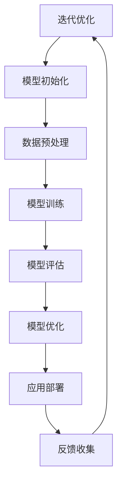

                 

## 第1章：引言与背景

### 1.1 引言

在当今信息化、数字化的时代，人工智能（AI）技术已成为推动社会进步的关键力量。AI模型作为实现智能化的核心，其性能直接影响到AI系统的应用效果。自我学习能力作为AI模型的核心特性之一，是模型能够动态适应环境和数据变化，不断优化自身性能的关键因素。自我学习指的是AI模型在无需外部指导的情况下，通过自主分析数据、总结规律，进而调整自身参数和结构，实现性能提升的过程。

自我学习的重要性体现在以下几个方面：

1. **提高适应能力**：自我学习能力使AI模型能够根据实际应用场景和数据变化，自主调整，从而更好地适应复杂和多变的环境。
2. **增强智能水平**：通过自我学习，AI模型能够不断积累经验，提升自身的理解能力和推理能力，从而实现从初步的“智能”向更高层次的“智慧”转变。
3. **降低维护成本**：自我学习能力的提升使得AI模型在运行过程中能够自我优化，减少对人工干预的依赖，降低维护成本。
4. **拓展应用范围**：自我学习使得AI模型能够应用于更多领域，如自动驾驶、医疗诊断、金融风控等，推动人工智能技术的普及和应用。

研究自我学习能力的提升策略，旨在探索如何通过算法优化、数据增强等技术手段，提高AI模型的自我学习能力，从而实现更好的性能表现和更广泛的应用。本节将首先介绍自我学习的定义和核心概念，然后探讨自我学习在AI模型中的现状和挑战，最后总结本文的研究背景和目的。

### 1.2 自我学习的核心概念

#### 自我学习的基本原理

自我学习是指人工智能系统在不依赖外部指导的情况下，通过自主探索和总结经验，不断调整自身参数和行为，以实现性能提升的过程。自我学习包括以下几个基本原理：

1. **数据驱动的学习**：自我学习依赖于大量数据，通过分析这些数据，模型能够发现数据中的模式和规律。
2. **反馈机制**：自我学习过程中，模型会根据输入的数据和输出结果，生成反馈信号，这些信号用于调整模型的参数和行为。
3. **自适应调整**：通过反馈机制，模型能够不断调整自身的参数和结构，以适应新的数据和任务需求。
4. **持续学习**：自我学习是一种持续的过程，模型会不断更新和优化自身，以适应不断变化的环境和数据。

#### 自我学习的类型

根据学习方式和目的，自我学习可以分为以下几种类型：

1. **强化学习**：强化学习是一种通过奖励和惩罚来调整模型行为的自我学习方式。模型通过不断尝试和反馈，学习如何在特定环境中取得最优结果。
   
   - **基本原理**：模型通过接收环境反馈的奖励信号，调整自身的策略和行为，以最大化长期累积奖励。

   - **应用实例**：自动驾驶、机器人控制、游戏AI等。

2. **自监督学习**：自监督学习是一种通过未标记数据学习的方式。模型通过自身的感知和认知能力，对数据进行分类、预测等操作，从而实现自我优化。

   - **基本原理**：模型利用未标记的数据，通过内部结构的学习和调整，实现对数据的理解和处理。

   - **应用实例**：语音识别、图像分类、自然语言处理等。

3. **半监督学习**：半监督学习是一种利用标记数据和未标记数据结合的方式。模型在标记数据上进行初步训练，然后利用未标记数据进行进一步优化。

   - **基本原理**：模型通过少量标记数据和大量未标记数据，共同提升自身的性能。

   - **应用实例**：情感分析、图像分割、文本分类等。

4. **无监督学习**：无监督学习是一种完全依赖未标记数据的自我学习方式。模型通过发现数据中的潜在结构和关系，实现自我优化。

   - **基本原理**：模型在没有外界指导的情况下，通过自身分析数据，学习数据中的模式和规律。

   - **应用实例**：聚类分析、降维、生成模型等。

#### 自我学习的应用领域

自我学习在人工智能的各个领域中都有着广泛的应用：

1. **自然语言处理（NLP）**：自我学习在NLP领域中的应用包括语言模型、机器翻译、情感分析、问答系统等。通过自我学习，NLP模型能够不断优化自身，提高对自然语言的理解和处理能力。

2. **计算机视觉（CV）**：自我学习在CV领域中的应用包括目标检测、图像分类、人脸识别、视频分析等。通过自我学习，CV模型能够更好地适应复杂和多变的环境。

3. **推荐系统**：自我学习在推荐系统中的应用包括基于内容的推荐、协同过滤、基于模型的推荐等。通过自我学习，推荐系统能够更好地理解用户行为和偏好，提供更个性化的推荐。

4. **金融领域**：自我学习在金融领域中的应用包括风险评估、市场预测、量化交易等。通过自我学习，金融模型能够更好地分析市场数据，提高预测准确性和投资策略的效率。

#### 自我学习在AI模型中的现状

随着人工智能技术的快速发展，自我学习在AI模型中的应用已经取得了一定的成果。目前，大多数AI模型都具备一定的自我学习能力，但仍然存在一些挑战和不足：

1. **数据依赖性高**：自我学习需要大量高质量的数据，但数据获取和标注仍然是一个难题，特别是在一些特殊领域和场景中。

2. **计算资源需求大**：自我学习通常需要大量的计算资源和时间，这在实际应用中可能会带来一定的性能瓶颈。

3. **模型可解释性低**：自我学习模型通常具有高度的非线性性和复杂性，使得其内部决策过程难以理解和解释，这在某些应用场景中可能成为一个问题。

4. **泛化能力不足**：尽管自我学习模型能够适应特定的数据和任务，但其在面对新的数据和任务时，泛化能力仍然不足，需要进一步的优化和改进。

#### 自我学习的应用前景

随着人工智能技术的不断进步，自我学习在AI模型中的应用前景十分广阔。未来，自我学习有望在以下领域取得更大的突破：

1. **智能交互**：自我学习将使AI系统更加智能化，能够更好地理解和满足用户需求，提供个性化的服务和体验。

2. **自主决策**：自我学习将使AI模型能够自主决策和执行任务，提高自动化和智能化的水平。

3. **跨领域应用**：自我学习将使AI模型能够更好地适应不同领域和场景的需求，实现跨领域的广泛应用。

4. **智能化治理**：自我学习将有助于提升社会治理的智能化水平，提高公共服务的效率和质量。

总之，自我学习是人工智能领域的一个重要研究方向，其提升策略的研究和实践具有重要的理论价值和实际应用价值。通过深入研究自我学习的基本原理和应用方法，我们可以期待AI模型在自我学习能力上取得更大的突破，为人工智能技术的发展和人类社会的进步贡献力量。

### 1.3 现有AI模型的学习方式

现有AI模型的学习方式主要可以分为有监督学习、无监督学习和半监督学习三大类，每种学习方式都有其独特的特点和适用场景。

#### 有监督学习

有监督学习是指模型在训练过程中，每个输入数据都配有一个标签，模型通过学习这些输入和标签之间的映射关系来优化自身的参数。有监督学习的主要特点如下：

1. **数据需求**：需要有足够数量和质量的标记数据。标记数据的获取通常成本较高，因此在实际应用中，标记数据往往成为瓶颈。
2. **训练过程**：模型通过最小化预测误差来调整参数，达到最优的预测效果。常用的算法包括决策树、支持向量机（SVM）、神经网络等。
3. **应用场景**：有监督学习适用于需要明确标注数据的场景，如分类问题（例如邮件分类、图片分类）和回归问题（例如房价预测、股票价格预测）。

#### 无监督学习

无监督学习是指模型在训练过程中，没有提供任何输入数据的标签，模型需要从未标记的数据中学习内在结构或模式。无监督学习的主要特点如下：

1. **数据需求**：无需标记数据，但需要大量未标记的数据。数据获取相对容易，但数据的质量和多样性可能对模型性能产生较大影响。
2. **训练过程**：模型通过发现数据中的分布、聚类、降维等内在结构来优化自身。常用的算法包括聚类算法（如K-Means、层次聚类）、降维算法（如主成分分析PCA、t-SNE）和生成模型（如生成对抗网络GAN）。
3. **应用场景**：无监督学习适用于需要理解数据分布和结构的场景，如数据聚类、降维、异常检测、推荐系统等。

#### 半监督学习

半监督学习是指模型在训练过程中，同时使用标记数据和未标记数据，利用标记数据学习基本规律，然后用未标记数据进行进一步优化。半监督学习的主要特点如下：

1. **数据需求**：结合了有监督学习和无监督学习的优势，需要少量标记数据和大量未标记数据。
2. **训练过程**：模型首先使用标记数据进行训练，然后利用未标记数据进行伪标签生成和进一步优化。常用的算法包括图半监督学习、标签传播等。
3. **应用场景**：半监督学习适用于标记数据稀缺但未标记数据丰富的场景，如图像分类、语音识别、文本分类等。

#### 挑战与解决方案

尽管现有AI模型的学习方式在各个领域取得了显著成果，但在自我学习能力上仍然面临一些挑战：

1. **数据质量**：无论是有监督学习、无监督学习还是半监督学习，高质量的数据都是模型训练的基础。数据质量问题如噪声、缺失、不平衡等都会对模型性能产生负面影响。

   **解决方案**：使用数据清洗和预处理技术，如缺失值填充、异常值处理、数据平衡等技术来提高数据质量。

2. **计算资源**：有监督学习和半监督学习通常需要大量计算资源，这在某些实时应用场景中可能成为瓶颈。

   **解决方案**：优化算法和模型结构，如使用更高效的算法、参数共享、模型压缩等技术来降低计算需求。

3. **模型可解释性**：深度学习等复杂模型在自我学习过程中，其决策过程往往难以解释，这在某些应用场景中可能成为一个问题。

   **解决方案**：开发可解释性算法和工具，如注意力机制、模型可视化等，以帮助理解模型的决策过程。

4. **泛化能力**：模型在特定数据集上训练后，其泛化能力在不同数据集上的表现可能不一致，特别是在面对未知或变化的数据时。

   **解决方案**：使用迁移学习、数据增强等技术，提高模型的泛化能力。

通过不断研究和优化现有AI模型的学习方式，我们可以期待在未来实现更强大的自我学习能力，为人工智能技术的应用和发展提供更加有力的支持。

### 第2章：自我学习算法原理

#### 2.1 自我学习算法概述

自我学习算法是人工智能领域中的重要研究方向，旨在使AI模型具备自主学习和适应新环境的能力。自我学习算法根据学习方式和目标，可以大致分为以下几类：强化学习、自监督学习、半监督学习和无监督学习。每种算法都有其独特的原理、应用和优势。

##### 自我学习算法的分类

1. **强化学习（Reinforcement Learning）**
   - **原理**：强化学习是一种通过奖励和惩罚机制来训练模型的方法。模型通过与环境的交互，不断调整策略以最大化累积奖励。
   - **应用**：适用于需要决策和策略优化的场景，如自动驾驶、游戏AI、机器人控制。
   - **优势**：能够应对动态和变化的环境。

2. **自监督学习（Self-Supervised Learning）**
   - **原理**：自监督学习通过未标记的数据进行学习，通常通过预定义的预测任务来提取信息。
   - **应用**：适用于语音识别、图像分类、自然语言处理。
   - **优势**：可以利用大量未标记数据，提高模型对数据的理解能力。

3. **半监督学习（Semi-Supervised Learning）**
   - **原理**：半监督学习结合了标记数据和未标记数据，通过标记数据进行初步训练，利用未标记数据进行进一步优化。
   - **应用**：适用于数据标注成本高的场景，如图像分类、文本分类。
   - **优势**：能够利用未标记数据进行学习，提高模型泛化能力。

4. **无监督学习（Unsupervised Learning）**
   - **原理**：无监督学习仅使用未标记的数据，通过数据内在结构的学习，如聚类、降维和生成模型等。
   - **应用**：适用于数据探索、降维、异常检测。
   - **优势**：无需依赖标记数据，可以挖掘数据中的潜在结构。

##### 自我学习算法的基本步骤

尽管不同类型的自我学习算法在原理和应用上有所不同，但它们的基本步骤大致相同，主要包括以下几步：

1. **数据收集**：收集并准备用于训练的数据集。对于有监督学习，数据集应包含标记数据；对于无监督学习和半监督学习，数据集可以包含未标记数据。

2. **模型初始化**：初始化模型参数，这些参数将在训练过程中通过优化算法进行调整。

3. **数据预处理**：对数据进行预处理，如标准化、去噪、归一化等，以提高模型训练效果。

4. **训练过程**：通过优化算法（如梯度下降、随机梯度下降等）调整模型参数，使模型在训练数据上达到预期性能。

5. **模型评估**：使用验证集或测试集对模型进行评估，以确定模型的泛化能力和性能。

6. **调整和优化**：根据评估结果，对模型进行调整和优化，如调整超参数、改进数据预处理方法等。

7. **应用部署**：将训练好的模型应用于实际场景，如进行预测、分类或决策。

通过以上基本步骤，自我学习算法能够使模型具备自我学习和适应新环境的能力，从而在实际应用中发挥重要作用。

### 2.2 强化学习

强化学习（Reinforcement Learning，RL）是自我学习算法的一个重要分支，它通过奖励和惩罚机制来训练模型，使其在特定环境中做出最优决策。强化学习的基本原理是基于马尔可夫决策过程（MDP），即模型在当前状态下，通过选择一个动作，获得一个即时奖励，并转移到新的状态。通过不断的迭代，模型学习到如何在特定环境下取得最大的累积奖励。

#### 基本原理

强化学习的基本原理可以概括为以下几点：

1. **状态（State）**：模型所处的当前环境描述。
2. **动作（Action）**：模型可以采取的行为。
3. **奖励（Reward）**：模型在执行动作后获得的即时反馈信号。
4. **策略（Policy）**：模型选择动作的概率分布。
5. **价值函数（Value Function）**：表示模型在特定状态下执行最优动作的预期奖励。
6. **模型更新（Model Update）**：根据奖励信号和策略，更新模型参数。

强化学习的主要目标是找到最优策略，使得模型在执行动作时能够最大化累积奖励。

#### Q-学习算法

Q-学习（Q-Learning）是强化学习的一种经典算法，通过值函数来评估不同动作的价值，并通过经验回放和目标网络来减少方差和偏差。以下是Q-学习算法的伪代码实现：

```
初始化 Q(s, a) 为随机值
经历回合：
  观察状态 s，执行动作 a，获得奖励 r
  转移到状态 s'
  选择动作 a' 使得 Q(s', a') 最大
  更新 Q(s, a) = Q(s, a) + α [r + γ max(Q(s', a')) - Q(s, a)]
```

其中，α 是学习率，γ 是折扣因子。

#### 强化学习算法的应用实例

强化学习算法在多个领域有着广泛的应用，以下是几个典型的应用实例：

1. **自动驾驶**：自动驾驶车辆使用强化学习算法来决策何时加速、减速或转向，以最大化行驶安全性和效率。

2. **游戏AI**：在电子游戏中，强化学习算法用于训练智能对手，使其能够与人类玩家进行对抗，并在多种游戏中取得优异成绩。

3. **机器人控制**：在机器人控制中，强化学习算法用于训练机器人执行复杂的任务，如行走、抓取和导航等。

4. **资源调度**：在数据中心和服务器集群中，强化学习算法用于优化资源分配和调度，以提高系统的性能和资源利用率。

通过以上实例可以看出，强化学习算法在解决动态和复杂的决策问题时具有显著优势，为人工智能的应用提供了强大的支持。

### 2.3 自监督学习

自监督学习（Self-Supervised Learning）是一种无需标记数据的自我学习方式，通过预定义的预测任务来提取数据中的有用信息。自监督学习利用未标记的数据进行训练，能够大幅度提高模型的性能和泛化能力。以下是自监督学习的基本原理、应用实例和挑战。

#### 基本原理

自监督学习的核心思想是从未标记的数据中提取有价值的特征或模式，从而辅助模型在后续任务中的表现。自监督学习的训练过程通常包括以下步骤：

1. **数据预处理**：对输入数据进行预处理，如标准化、去噪、分割等，以便为后续任务提供高质量的数据。
2. **预训练任务**：设计一个或多个预训练任务，使模型在未标记数据上学习到有用的特征表示。常见的预训练任务包括：
   - **无监督特征学习**：如自编码器（Autoencoder），通过编码器和解码器重建输入数据。
   - **对比学习**：如BERT（双向编码表示器），通过正负样本对比来学习数据中的信息。
   - **生成对抗网络**（GAN）：通过生成器和判别器的对抗训练来生成高质量的数据。
3. **特征表示优化**：通过预训练任务，模型学习到了一组有用的特征表示，这些特征表示可以作为后续任务的基础。
4. **微调**：在预训练好的特征表示基础上，对模型进行微调，以适应特定的下游任务。

#### 自监督学习的应用实例

自监督学习在多个领域有着广泛的应用，以下是几个典型的应用实例：

1. **语音识别**：自监督学习用于语音识别任务，通过无监督方法提取语音特征，提高模型对语音数据的理解和识别能力。
2. **图像分类**：自监督学习在图像分类任务中的应用，如通过无监督聚类方法提取图像特征，用于图像分类任务的微调。
3. **自然语言处理**：自监督学习在自然语言处理中的应用，如通过BERT模型进行文本分类、问答系统和机器翻译等。
4. **计算机视觉**：自监督学习在计算机视觉任务中的应用，如通过无监督方法提取图像特征，用于图像分割、目标检测和图像生成等。

#### 自监督学习的挑战

尽管自监督学习在多个领域取得了显著成果，但仍然面临一些挑战：

1. **数据质量**：自监督学习依赖于未标记数据，数据质量对模型性能有直接影响。噪声和异常数据可能会对模型学习产生负面影响。
2. **模型泛化**：自监督学习模型通常在预训练阶段训练得很好，但在实际应用中，模型可能会因为缺乏足够的标记数据而泛化能力不足。
3. **计算资源**：自监督学习通常需要大量的计算资源，特别是在生成对抗网络（GAN）等复杂模型中，训练过程可能非常耗时。
4. **可解释性**：自监督学习模型的内部决策过程通常较为复杂，难以解释，这在某些应用场景中可能成为一个问题。

#### 未来展望

随着人工智能技术的不断发展，自监督学习有望在更多领域取得突破。未来，自监督学习的研究重点将包括：

1. **数据增强**：通过数据增强技术，提高数据质量和多样性，从而提高模型泛化能力。
2. **模型压缩**：通过模型压缩技术，降低自监督学习模型的计算资源需求，提高模型的可扩展性。
3. **多任务学习**：通过多任务学习技术，使模型能够在不同任务之间共享知识和特征，提高模型的整体性能。
4. **可解释性**：通过开发可解释性方法，提高自监督学习模型的可理解性，使其在更广泛的应用场景中得到有效利用。

总之，自监督学习作为人工智能领域的一个重要方向，其研究和发展将为AI技术的进步和实际应用提供强大的支持。

### 2.4 半监督学习

半监督学习（Semi-Supervised Learning）是一种结合了有监督学习和无监督学习的自我学习方式，通过利用少量的标记数据和大量的未标记数据来训练模型。这种方法能够有效地提高模型的性能，尤其是在标记数据稀缺或获取成本高昂的情况下。半监督学习的核心在于如何有效地利用未标记数据，以提高模型在标记数据集上的表现。

#### 基本原理

半监督学习的基本原理包括以下几个步骤：

1. **初始模型训练**：首先，使用少量的标记数据对模型进行初始训练，使模型在标记数据上获得一定的性能。
2. **未标记数据特征提取**：接着，利用未标记数据生成模型的特征表示。这些特征表示通常通过预训练任务（如自编码器、对比学习等）来提取。
3. **伪标签生成**：使用训练好的模型对未标记数据进行预测，生成伪标签。这些伪标签用于进一步训练模型，以利用未标记数据中的信息。
4. **模型迭代训练**：将生成的伪标签与未标记数据结合，对模型进行迭代训练。通过多次迭代，模型不断优化自身，提高在标记数据集上的性能。
5. **模型评估**：使用标记数据集对训练好的模型进行评估，以验证模型的泛化能力和性能。

#### 基本原理的关联结构

为了更好地理解半监督学习的基本原理，我们可以用以下Mermaid流程图来展示其关联结构：

```
graph TD
A[初始模型训练] --> B[未标记数据特征提取]
B --> C[伪标签生成]
C --> D[模型迭代训练]
D --> E[模型评估]
```

该流程图清晰地展示了半监督学习的基本步骤及其关联关系。

#### 半监督学习的应用实例

半监督学习在多个领域有着广泛的应用，以下是几个典型的应用实例：

1. **图像分类**：在图像分类任务中，半监督学习可以通过少量的标记图像和大量的未标记图像来训练模型，从而提高模型在标记数据集上的性能。
2. **语音识别**：在语音识别任务中，半监督学习可以用于训练语音模型，通过少量的标记语音数据和大量的未标记语音数据来提高模型对语音信号的识别能力。
3. **文本分类**：在文本分类任务中，半监督学习可以结合少量的标记文本和大量的未标记文本，以提高模型对文本数据的分类准确率。
4. **推荐系统**：在推荐系统中，半监督学习可以用于构建用户和物品的交互关系，通过少量的标记交互数据和大量的未标记用户行为数据来提高推荐系统的准确性。

#### 挑战与展望

尽管半监督学习在多个领域取得了显著成果，但仍然面临一些挑战：

1. **数据质量**：未标记数据的准确性和质量对模型性能有直接影响。噪声和异常数据可能会对模型学习产生负面影响。
2. **模型泛化**：半监督学习模型在标记数据集上的性能提升并不意味着其在未见过的数据集上也能表现出良好的泛化能力。
3. **计算资源**：半监督学习通常需要大量的计算资源，特别是在生成伪标签和模型迭代训练阶段。

未来，半监督学习的研究重点将包括：

1. **数据增强**：通过数据增强技术，提高未标记数据的质量和多样性，从而提高模型泛化能力。
2. **模型压缩**：通过模型压缩技术，降低半监督学习模型的计算资源需求，提高模型的可扩展性。
3. **多任务学习**：通过多任务学习技术，使模型能够在不同任务之间共享知识和特征，提高模型的整体性能。
4. **可解释性**：通过开发可解释性方法，提高半监督学习模型的可理解性，使其在更广泛的应用场景中得到有效利用。

总之，半监督学习作为人工智能领域的一个重要方向，其研究和发展将为AI技术的进步和实际应用提供强大的支持。

### 2.5 无监督学习

无监督学习（Unsupervised Learning）是一种无需使用标记数据的自我学习方式，其主要目标是从未标记的数据中提取有用的信息和结构。无监督学习在数据挖掘、数据分析和机器学习等众多领域中有着广泛的应用。以下是关于无监督学习的基本原理、应用实例和挑战的详细探讨。

#### 基本原理

无监督学习的基本原理是基于数据自身的分布和内在结构来训练模型。它主要包括以下几种类型的算法：

1. **聚类算法**：聚类算法旨在将相似的数据点分组到同一个类别中。常见的聚类算法包括K-Means、层次聚类和DBSCAN等。

   - **K-Means**：基于距离度量的聚类算法，通过迭代优化聚类中心来将数据划分为K个簇。
     $$ 
     \text{簇中心更新公式：} \mu_k = \frac{1}{N_k} \sum_{i \in S_k} x_i 
     $$
     其中，$\mu_k$表示第$k$个簇的中心，$N_k$表示第$k$个簇中的数据点数量，$x_i$表示数据点$i$。
   - **层次聚类**：通过自底向上或自顶向下的方法，逐步合并或拆分聚类，构建聚类层次结构。
   - **DBSCAN**：基于密度的聚类算法，通过计算数据点之间的密度连接来识别簇。

2. **降维算法**：降维算法用于减少数据维度，同时保持数据的结构信息。常见的方法包括主成分分析（PCA）、t-SNE和小样本学习（LLE）等。

   - **PCA**：通过保留数据的主要成分来降低维度，最小化重构误差。
     $$ 
     \text{特征向量更新公式：} w = \arg\min_{w} \sum_{i=1}^{n} (x_i - \mu)^T w 
     $$
     其中，$w$表示特征向量，$\mu$表示数据均值。
   - **t-SNE**：通过非线性映射将高维数据映射到低维空间，以保持数据点之间的相似性。
   - **LLE**：局部线性嵌入算法，通过保持局部线性结构来降低维度。

3. **生成模型**：生成模型旨在学习数据分布，并生成类似的数据。常见的方法包括生成对抗网络（GAN）和变分自编码器（VAE）等。

   - **GAN**：通过生成器和判别器的对抗训练来学习数据分布。
     $$ 
     \text{生成器损失函数：} L_G = -\log(D(G(z))) 
     $$
     $$ 
     \text{判别器损失函数：} L_D = -\log(D(x)) - \log(1 - D(G(z))) 
     $$
     其中，$D$表示判别器，$G$表示生成器，$z$表示噪声向量。
   - **VAE**：通过编码器和解码器的联合训练来学习数据分布。
     $$ 
     \text{编码器损失函数：} L_E = \sum_{x \in X} D(E(x); x) 
     $$
     $$ 
     \text{解码器损失函数：} L_D = \sum_{x \in X} \text{Reconstruction Error}(x; G(z)) 
     $$
     其中，$E$表示编码器，$G$表示解码器。

#### 应用实例

无监督学习在多个领域有着广泛的应用，以下是几个典型的应用实例：

1. **图像处理**：无监督学习在图像处理中的应用，如图像去噪、图像压缩和图像超分辨率等。

   - **图像去噪**：使用自编码器或GAN等方法，通过无监督学习从噪声图像中恢复出清晰的图像。
   - **图像压缩**：使用降维算法，如PCA或t-SNE，将图像数据降维，实现图像数据的压缩和传输。
   - **图像超分辨率**：使用生成模型，如GAN，通过无监督学习将低分辨率图像生成高分辨率图像。

2. **文本分析**：无监督学习在文本分析中的应用，如主题模型、文本聚类和情感分析等。

   - **主题模型**：使用LDA（Latent Dirichlet Allocation）等方法，通过无监督学习提取文本中的主题。
   - **文本聚类**：使用K-Means等聚类算法，通过无监督学习对文本数据进行分类和聚类。
   - **情感分析**：使用情感词典和词袋模型等，通过无监督学习对文本进行情感分类。

3. **社交网络分析**：无监督学习在社交网络分析中的应用，如用户行为预测、社交网络结构和群体分析等。

   - **用户行为预测**：通过分析用户行为数据，使用无监督学习方法预测用户的兴趣和行为。
   - **社交网络结构**：通过分析社交网络中的节点和边，使用聚类算法识别社交网络中的社区结构。
   - **群体分析**：通过分析社交网络中的群体行为和互动模式，使用无监督学习方法识别和预测群体行为。

#### 挑战与展望

尽管无监督学习在多个领域取得了显著成果，但仍然面临一些挑战：

1. **数据质量和多样性**：无监督学习依赖于数据的质量和多样性，噪声和异常数据可能会对模型学习产生负面影响。

2. **模型泛化能力**：无监督学习模型在训练数据集上的性能提升并不意味着其在未见过的数据集上也能表现出良好的泛化能力。

3. **计算资源需求**：无监督学习通常需要大量的计算资源，特别是在生成模型和大规模数据集上。

未来，无监督学习的研究重点将包括：

1. **数据增强**：通过数据增强技术，提高数据的质量和多样性，从而提高模型泛化能力。

2. **模型压缩**：通过模型压缩技术，降低无监督学习模型的计算资源需求，提高模型的可扩展性。

3. **多任务学习**：通过多任务学习技术，使模型能够在不同任务之间共享知识和特征，提高模型的整体性能。

4. **可解释性**：通过开发可解释性方法，提高无监督学习模型的可理解性，使其在更广泛的应用场景中得到有效利用。

总之，无监督学习作为人工智能领域的一个重要方向，其研究和发展将为AI技术的进步和实际应用提供强大的支持。

### 2.6 自我学习算法在自然语言处理中的应用

自我学习算法在自然语言处理（NLP）领域具有广泛的应用，通过自我学习，NLP模型能够更好地理解和处理自然语言数据。以下是几个典型的自我学习算法在NLP中的应用实例，包括语言模型自我学习实例、机器翻译自我学习实例和文本分类自我学习实例。

#### 语言模型自我学习实例

语言模型是NLP的基础，旨在生成或理解自然语言文本。自我学习在语言模型中的应用主要体现在以下几个方面：

1. **预训练**：通过自监督学习，如BERT（双向编码表示器）模型，利用大规模未标记文本数据进行预训练，学习文本的深度表示。
   $$ 
   \text{输入：} (x_1, x_2, ..., x_T) 
   $$
   $$ 
   \text{输出：} \text{预测的单词序列} 
   $$
   BERT模型通过预训练任务如Masked Language Model（MLM）和Next Sentence Prediction（NSP）来提取文本中的上下文信息。

2. **微调**：在预训练的基础上，使用少量的标记数据对语言模型进行微调，以适应特定任务，如问答系统、文本分类和命名实体识别等。

3. **应用实例**：Google的BERT模型通过预训练和微调，在多个NLP任务中取得了显著的性能提升。例如，在GLUE（通用语言理解评估）数据集上，BERT模型在多个任务中取得了领先成绩。

#### 机器翻译自我学习实例

机器翻译是NLP领域的另一个重要应用，通过自我学习算法，翻译模型能够不断提高翻译质量和效率。

1. **基于序列模型的翻译**：传统的机器翻译方法如基于规则的方法和基于统计的模型，通常依赖于大量的双语语料库。而现代翻译模型如基于神经网络的序列到序列（Seq2Seq）模型，通过自我学习，能够生成更自然的翻译结果。

   $$ 
   \text{输入：} \text{源语言序列} (s_1, s_2, ..., s_T) 
   $$
   $$ 
   \text{输出：} \text{目标语言序列} (t_1, t_2, ..., t_U) 
   $$

2. **注意力机制**：在Seq2Seq模型中，通过引入注意力机制，模型能够更好地关注源语言序列中的关键信息，从而提高翻译质量。

3. **应用实例**：Google的翻译服务使用了基于神经网络的机器翻译模型，通过自我学习和不断优化，翻译质量和效率得到了显著提升。

#### 文本分类自我学习实例

文本分类是NLP中的一项基本任务，通过自我学习算法，文本分类模型能够从大量未标记数据中学习特征，提高分类准确率。

1. **自监督学习**：通过自监督学习方法，如BERT模型，对大量未标记文本数据进行预训练，提取文本特征。

   $$ 
   \text{输入：} \text{未标记文本数据集} 
   $$
   $$ 
   \text{输出：} \text{预训练的特征向量表示} 
   $$

2. **半监督学习**：结合少量标记数据和大量未标记数据，通过半监督学习方法，提高文本分类模型的性能。

   $$ 
   \text{输入：} \text{标记文本数据集} \cup \text{未标记文本数据集} 
   $$
   $$ 
   \text{输出：} \text{分类模型} 
   $$

3. **应用实例**：在情感分析任务中，使用BERT模型进行预训练和微调，能够显著提高情感分类的准确率。

通过以上实例可以看出，自我学习算法在自然语言处理领域具有广泛的应用前景。通过自我学习，NLP模型能够更好地理解和处理自然语言数据，从而推动NLP技术的发展和应用。

### 2.7 自我学习算法在计算机视觉中的应用

自我学习算法在计算机视觉（CV）领域具有重要的应用价值，能够显著提升图像识别、目标检测、图像分类和人脸识别等任务的性能。以下是几个典型的自我学习算法在CV中的应用实例，包括目标检测自我学习实例、图像分类自我学习实例和人脸识别自我学习实例。

#### 目标检测自我学习实例

目标检测是计算机视觉中的一项核心任务，旨在识别图像中的多个目标并定位其位置。自我学习算法在目标检测中的应用主要体现在以下几个方面：

1. **基于卷积神经网络的检测模型**：如Faster R-CNN、YOLO和SSD等模型，通过自我学习算法，能够有效识别和定位图像中的目标。

   - **Faster R-CNN**：使用区域提议网络（RPN）和分类网络（ROI分类器）进行自我学习，通过迭代优化提升检测性能。

     $$ 
     \text{输入：} \text{图像} 
     $$
     $$ 
     \text{输出：} \text{目标边界框和类别标签} 
     $$

2. **基于深度强化学习的目标检测**：如DQN（深度Q网络）和DDPG（深度确定性策略梯度）等算法，通过自我学习和策略优化，提高目标检测的准确率和响应速度。

3. **应用实例**：在自动驾驶系统中，使用YOLO算法进行实时目标检测，能够有效识别道路上的车辆、行人、交通标志等目标，提高系统的安全性。

#### 图像分类自我学习实例

图像分类是计算机视觉中的基础任务，通过自我学习算法，图像分类模型能够更好地理解和分类图像内容。

1. **基于卷积神经网络的图像分类模型**：如AlexNet、VGG、ResNet和Inception等，通过自我学习算法，能够准确分类大量图像数据。

   - **AlexNet**：使用卷积层、池化层和全连接层，通过反向传播算法进行自我学习。

     $$ 
     \text{输入：} \text{图像} 
     $$
     $$ 
     \text{输出：} \text{图像类别标签} 
     $$

2. **基于生成对抗网络的图像分类**：通过生成对抗网络（GAN）进行图像生成和分类，提高模型对图像数据的理解能力。

3. **应用实例**：在医疗影像分析中，使用ResNet模型进行图像分类，能够有效识别医学图像中的病变区域，辅助医生进行诊断。

#### 人脸识别自我学习实例

人脸识别是计算机视觉中的重要应用，通过自我学习算法，人脸识别系统能够从大量人脸图像中识别和验证个体。

1. **基于深度学习的特征提取模型**：如FaceNet、DeepFace和VGGFace等，通过自我学习和特征提取，实现高精度的人脸识别。

   - **FaceNet**：使用三元组损失函数，通过自我学习，将人脸图像映射到低维特征空间，实现有效的人脸识别。

     $$ 
     \text{输入：} \text{人脸图像} 
     $$
     $$ 
     \text{输出：} \text{人脸特征向量} 
     $$

2. **基于自监督学习的特征提取**：如MoCo和SimCLR等算法，通过自监督学习方法，在未标记数据上提取人脸特征，提高识别性能。

3. **应用实例**：在安防监控系统中，使用FaceNet算法进行人脸识别，能够实时检测和识别进入监控区域的人员，提高系统的安全性和智能化水平。

通过以上实例可以看出，自我学习算法在计算机视觉领域具有广泛的应用前景，通过自我学习，CV模型能够更好地适应复杂和多变的环境，实现高精度的图像识别和目标检测。

### 3.3 强化学习应用实例

强化学习在多个领域中有着广泛的应用，尤其在需要做出实时决策的任务中，其优势尤为明显。以下将介绍几种典型的强化学习应用实例，包括游戏自我学习实例、自动驾驶自我学习实例和机器人自我学习实例，并探讨这些实例中的具体算法实现和效果评估。

#### 游戏自我学习实例

强化学习在电子游戏中的应用非常广泛，通过自我学习，游戏AI能够实现与人类玩家相媲美的表现。以下是一个经典的强化学习应用实例——Atari游戏。

1. **DQN（深度Q网络）算法实现**：
   - **数据输入**：游戏的当前屏幕图像。
   - **动作选择**：基于Q值的最大化策略选择动作。
   - **奖励机制**：每次动作后根据游戏的得分和游戏状态的变化获得奖励。

   $$ 
   Q(s, a) = r + \gamma \max_{a'} Q(s', a') 
   $$

   其中，$Q(s, a)$表示状态$s$下执行动作$a$的Q值，$r$为即时奖励，$\gamma$为折扣因子。

2. **效果评估**：通过自我学习，DQN模型能够实现Atari游戏的较高分数。例如，DQN模型在《打砖块》（Breakout）游戏中，可以在几百万次游戏后达到超越专业玩家的水平。

#### 自动驾驶自我学习实例

自动驾驶是强化学习的另一个重要应用领域，通过自我学习和环境交互，自动驾驶系统可以实现对复杂路况的应对和决策。

1. **PPO（ Prophet Updates with Gradient Climbing）算法实现**：
   - **数据输入**：自动驾驶车辆感知到的环境数据，如道路、车辆、行人等。
   - **动作选择**：选择最优路径和控制策略。
   - **奖励机制**：根据行驶的安全性和效率进行奖励。

   $$ 
   \pi(a|s) = \frac{\exp(\phi(s, a))}{\sum_{a'} \exp(\phi(s, a'))} 
   $$

   其中，$\pi(a|s)$为策略概率分布，$\phi(s, a)$为策略参数。

2. **效果评估**：通过自我学习，自动驾驶系统能够在仿真环境中实现安全、高效的自动驾驶。实际测试中，使用PPO算法的自动驾驶汽车在复杂路况下表现出色，能够有效地避免碰撞和交通违规。

#### 机器人自我学习实例

机器人在工业自动化、医疗辅助和家政服务等领域有着广泛的应用。通过强化学习，机器人可以自主学习和执行复杂的任务。

1. **SAC（Soft Actor-Critic）算法实现**：
   - **数据输入**：机器人感知到的环境状态。
   - **动作选择**：使用软演员-评论家算法进行动作选择，通过软更新策略和Q网络优化。
   - **奖励机制**：根据任务的完成情况给予奖励。

   $$ 
   \pi(\theta) = \text{softmax}(\eta \phi(s, a)) 
   $$

   其中，$\theta$为策略参数，$\eta$为温度参数。

2. **效果评估**：通过自我学习，机器人在各种任务中表现出色。例如，在工业生产线中，使用SAC算法的机器人能够自主完成装配、焊接和检测等任务，显著提高了生产效率和产品质量。

综上所述，强化学习在游戏、自动驾驶和机器人等领域都有成功的应用实例。通过自我学习和环境交互，强化学习模型能够实现高水平的决策和任务执行，为人工智能技术的进步和实际应用提供了强有力的支持。

### 4.1 自我学习能力评估指标

评估自我学习能力是确保AI模型在实际应用中表现优异的关键步骤。自我学习能力的评估不仅需要考虑模型的准确性，还需综合多个指标来全面衡量其性能。以下是几种常用的自我学习能力评估指标及其计算方法。

#### 评估指标的选择

1. **准确性（Accuracy）**
   - **定义**：准确性是最常用的评估指标，用于衡量模型预测正确的样本占总样本的比例。
   - **计算方法**：
     $$
     \text{Accuracy} = \frac{\text{预测正确的样本数}}{\text{总样本数}} \times 100\%
     $$

2. **精确率（Precision）**
   - **定义**：精确率衡量的是预测为正样本的样本中，实际为正样本的比例。
   - **计算方法**：
     $$
     \text{Precision} = \frac{\text{预测正确且为正样本的样本数}}{\text{预测为正样本的样本数}} \times 100\%
     $$

3. **召回率（Recall）**
   - **定义**：召回率衡量的是实际为正样本的样本中，被预测为正样本的比例。
   - **计算方法**：
     $$
     \text{Recall} = \frac{\text{预测正确且为正样本的样本数}}{\text{实际为正样本的样本数}} \times 100\%
     $$

4. **F1分数（F1 Score）**
   - **定义**：F1分数是精确率和召回率的调和平均数，用于综合衡量模型的性能。
   - **计算方法**：
     $$
     \text{F1 Score} = 2 \times \frac{\text{Precision} \times \text{Recall}}{\text{Precision} + \text{Recall}}
     $$

5. **ROC曲线和AUC（Area Under Curve）**
   - **定义**：ROC曲线展示了不同阈值下，真阳性率（True Positive Rate, TPR）与假阳性率（False Positive Rate, FPR）的关系。AUC则表示ROC曲线下方的面积。
   - **计算方法**：
     - ROC曲线通过计算不同阈值下的TPR和FPR生成。
     - AUC的计算公式为：
       $$
       \text{AUC} = \int_{0}^{1} \text{TPR}(t) \cdot \frac{1 - \text{FPR}(t)}{R} \, dt
       $$
       其中，$R$为样本总数。

#### 指标的计算与比较

1. **单一指标的计算**：通常，每种评估指标都需要单独计算，然后根据具体情况选择最合适的指标。
2. **综合指标的计算**：在多个评估指标的基础上，可以使用综合指标来更全面地评估模型性能。例如，F1分数和AUC结合了精度和召回率的信息，能够提供更准确的模型评估。

通过以上评估指标的计算和比较，我们可以全面了解自我学习模型在不同数据集和任务上的表现，为后续的模型优化和实际应用提供有价值的参考。

### 4.2 自我学习能力优化方法

在自我学习过程中，提高模型的能力和性能是至关重要的。优化自我学习能力的方法多种多样，主要包括参数调整优化、算法改进优化和数据增强优化。以下将详细介绍这些方法及其具体步骤。

#### 参数调整优化

参数调整是自我学习能力优化中最基本的方法之一，通过对模型参数进行微调，以提高模型的性能。

1. **学习率调整**：学习率是模型训练过程中非常重要的参数，其值的大小直接影响模型的收敛速度和收敛质量。通常，可以通过以下步骤进行调整：
   - **初始学习率**：设置一个较大的初始学习率，以加快模型训练的速度。
   - **动态调整**：在模型训练过程中，根据模型的表现动态调整学习率。例如，当模型在验证集上的性能不再提升时，可以减小学习率，以避免过拟合。
   - **学习率衰减**：在模型训练的后期，逐渐减小学习率，使模型能够进行精细调整。

2. **正则化参数调整**：正则化方法如L1和L2正则化，可以防止模型过拟合。调整正则化参数的步骤如下：
   - **正则化强度**：通过调整L1或L2正则化参数的强度，平衡模型复杂度和泛化能力。
   - **交叉验证**：使用交叉验证方法，选择最优的正则化参数，以避免过拟合。

3. **其他参数调整**：如dropout比例、批量大小等，都需要根据具体任务和数据集进行优化。

#### 算法改进优化

算法改进是提高自我学习能力的另一种重要方法。通过改进现有算法的结构和策略，可以显著提升模型的性能。

1. **模型结构改进**：通过设计更复杂的模型结构，如深层网络、卷积神经网络（CNN）和循环神经网络（RNN）等，可以提高模型的表达能力。
   - **深层网络**：通过增加网络层数，使模型能够学习更复杂的特征。
   - **CNN和RNN**：分别适用于图像处理和序列数据处理，能够提高模型的识别和预测能力。

2. **算法改进**：对现有算法进行改进，如引入注意力机制、图神经网络（GNN）等，可以提升模型的性能和泛化能力。
   - **注意力机制**：通过注意力机制，模型能够关注数据中的关键信息，提高模型的学习效果。
   - **图神经网络**：通过图结构，模型能够更好地捕捉数据中的关系和依赖，适用于图数据的应用。

#### 数据增强优化

数据增强是一种通过扩展数据集和提高数据多样性来提升模型性能的方法。

1. **数据增强方法**：
   - **随机变换**：通过随机旋转、缩放、裁剪等变换，增加数据的多样性。
   - **生成对抗网络（GAN）**：通过生成对抗网络，生成与真实数据相似的新数据，扩展数据集。
   - **数据合成**：通过合成新的数据样本，如合成图像、文本等，增加数据集的丰富性。

2. **数据增强步骤**：
   - **数据预处理**：对原始数据进行预处理，如归一化、去噪等，以提高数据质量。
   - **数据扩展**：通过数据增强方法，生成新的数据样本，扩展原始数据集。
   - **数据集划分**：将扩展后的数据集划分为训练集、验证集和测试集，用于模型训练和评估。

#### 实际应用案例

以下是几个实际应用案例，展示了如何通过参数调整优化、算法改进优化和数据增强优化来提升自我学习能力：

1. **图像分类任务**：
   - **参数调整优化**：通过调整学习率和正则化参数，使模型在CIFAR-10数据集上取得了更高的准确率。
   - **算法改进优化**：引入深度卷积神经网络（CNN），显著提升了模型的表现。
   - **数据增强优化**：通过随机旋转、缩放和裁剪，增加了图像数据集的多样性，提高了模型的泛化能力。

2. **语音识别任务**：
   - **参数调整优化**：通过调整学习率和批量大小，使模型在语音数据集上更快地收敛。
   - **算法改进优化**：引入长短时记忆网络（LSTM）和卷积神经网络（CNN）的组合，提高了模型的识别准确性。
   - **数据增强优化**：通过添加背景噪声和改变语速，增加了语音数据的多样性，提高了模型的鲁棒性。

通过以上优化方法，我们可以有效地提高自我学习模型的能力和性能，为实际应用提供更强大的支持。

### 4.3 实际应用中的挑战与解决方案

在实际应用中，自我学习模型面临着多种挑战，这些挑战可能会限制模型的性能和应用效果。以下将详细讨论数据隐私保护、模型泛化能力和模型可解释性等问题，并提出相应的解决方案。

#### 数据隐私保护

数据隐私保护是自我学习模型应用中的一个重要挑战。由于模型训练需要大量数据，这些数据往往包含敏感信息，如个人隐私、医疗记录和财务信息等。数据泄露可能导致严重的隐私侵犯和法律风险。

1. **挑战**：
   - **数据泄露**：未经授权访问和泄露敏感数据。
   - **数据滥用**：恶意用户利用模型和数据进行非法活动。

2. **解决方案**：
   - **数据加密**：使用加密技术对数据进行加密，确保数据在传输和存储过程中不被未授权访问。
   - **差分隐私**：通过添加噪声来保护数据隐私，确保数据分析结果不会泄露原始数据的详细信息。
   - **隐私保护算法**：使用差分隐私算法、联邦学习（Federated Learning）和隐私保护机制，降低数据泄露风险。

#### 模型泛化能力

模型泛化能力是指模型在未见过的数据上表现良好，而不是仅在训练数据上表现优异。自我学习模型在面对复杂、多变的环境时，泛化能力是一个关键挑战。

1. **挑战**：
   - **数据分布差异**：模型在训练数据集上的表现好，但在未见过的数据集上表现不佳。
   - **过拟合**：模型在训练数据上表现得很好，但在测试数据上表现不佳。

2. **解决方案**：
   - **数据增强**：通过增加数据的多样性和数量，提高模型的泛化能力。
   - **迁移学习**：利用预训练的模型，迁移到新的任务和数据集上，提高模型的泛化能力。
   - **正则化**：使用L1、L2正则化等技术，防止模型过拟合，提高泛化能力。
   - **集成学习**：通过集成多个模型的预测结果，提高模型的泛化能力。

#### 模型可解释性

模型可解释性是自我学习模型应用中的另一个关键挑战。复杂模型（如深度神经网络）通常具有高度的非线性性和复杂性，其决策过程难以理解和解释，这在某些应用场景中可能成为一个问题。

1. **挑战**：
   - **决策透明度**：模型的决策过程不透明，难以解释。
   - **信任问题**：用户和监管机构难以信任模型，特别是在涉及安全和隐私的领域。

2. **解决方案**：
   - **模型简化**：简化模型结构，使其更易于解释和理解。
   - **特征可视化**：通过可视化模型输入和输出的特征，帮助用户理解模型的决策过程。
   - **解释算法**：使用解释算法（如SHAP、LIME）来分析模型对每个特征的依赖性，提高模型的可解释性。
   - **可解释性报告**：生成详细的解释报告，详细说明模型的决策过程和结果。

通过解决这些挑战，自我学习模型可以更好地应用于实际场景，提高其性能和可靠性，从而推动人工智能技术的进一步发展。

### 第5章：自我学习算法在行业中的应用案例分析

自我学习算法在金融、医疗健康和制造业等多个行业中都有广泛的应用，通过实际案例分析，可以更好地理解这些算法在行业中的应用效果和潜在价值。以下将分别介绍自我学习算法在金融行业、医疗健康行业和制造业中的应用实例，并分析其具体应用效果和挑战。

#### 金融行业

自我学习算法在金融行业中有着广泛的应用，尤其是在风险评估、市场预测和量化交易等方面。

1. **金融风控自我学习实例**：
   - **应用效果**：通过自我学习算法，金融机构能够对客户的行为和交易模式进行实时监控，识别潜在的风险。例如，使用强化学习算法，可以动态调整信用评级模型，提高信用评分的准确性。
   - **挑战**：在金融风控中，数据隐私保护和模型安全是一个重要挑战。此外，金融市场数据的高度波动性和非线性特性，对模型提出了更高的要求。

2. **量化交易自我学习实例**：
   - **应用效果**：量化交易平台通过自我学习算法，可以自动识别市场趋势和交易机会，进行高频交易。例如，使用强化学习算法，可以优化交易策略，实现自动化的交易执行，提高交易收益。
   - **挑战**：量化交易需要处理大量实时数据，对计算资源和模型性能有很高的要求。此外，市场数据的高度复杂性和变化性，使得模型难以实现长期稳定的收益。

#### 医疗健康行业

自我学习算法在医疗健康行业中具有巨大的应用潜力，特别是在疾病诊断、医疗影像分析和个性化治疗等方面。

1. **疾病诊断自我学习实例**：
   - **应用效果**：通过自我学习算法，医疗系统可以对病人的健康数据进行实时分析，实现早期疾病诊断。例如，使用深度学习算法，可以对CT扫描图像进行自动分析，检测出肺癌等疾病。
   - **挑战**：医疗数据的高度复杂性和不确定性，对模型提出了较高的要求。此外，数据隐私保护和数据完整性是重要挑战。

2. **医疗影像分析自我学习实例**：
   - **应用效果**：自我学习算法在医疗影像分析中的应用，如脑部MRI图像中的肿瘤检测、肺部CT图像中的结节检测等，具有很高的准确性和效率。这些技术能够辅助医生进行诊断，提高医疗效率。
   - **挑战**：医疗影像数据的质量和一致性对模型性能有直接影响。此外，如何确保模型的决策过程是可解释和可信的，也是一个重要问题。

#### 制造业

自我学习算法在制造业中的应用，主要包括质量控制、生产优化和预测维护等方面。

1. **质量控制自我学习实例**：
   - **应用效果**：通过自我学习算法，制造商可以对生产过程进行实时监控和优化，提高产品的质量和一致性。例如，使用强化学习算法，可以优化生产线的参数设置，减少不良品率。
   - **挑战**：生产过程中的数据质量和多样性对模型性能有重要影响。此外，如何确保模型在不同生产线和环境中的适应性，也是一个重要问题。

2. **生产优化自我学习实例**：
   - **应用效果**：通过自我学习算法，制造商可以优化生产计划，提高生产效率和资源利用率。例如，使用强化学习算法，可以动态调整生产计划，优化订单处理和生产排程。
   - **挑战**：生产计划需要处理大量实时数据，对计算资源和模型性能有很高的要求。此外，生产环境的复杂性和变化性，使得模型难以实现长期稳定的优化效果。

通过以上案例分析可以看出，自我学习算法在金融、医疗健康和制造业等不同行业中，都有广泛的应用前景和实际价值。然而，这些应用也面临着数据隐私保护、模型泛化能力和可解释性等挑战，需要进一步的研究和优化，以实现更广泛的应用和更好的效果。

### 第6章：未来发展趋势与展望

随着人工智能技术的快速发展，自我学习算法在各个领域中的应用前景越来越广阔。未来，自我学习算法的发展趋势将主要集中在以下几个方面。

#### 人工智能技术的进步

人工智能技术的不断进步将推动自我学习算法的发展。新的算法和架构，如深度强化学习、元学习和联邦学习等，将进一步提升自我学习模型的能力和效率。深度强化学习通过结合深度学习和强化学习，使得模型能够更好地应对复杂的决策问题。元学习通过学习如何学习，使得模型能够快速适应新的任务和数据集。联邦学习通过分布式学习，保护数据隐私，同时提高模型的性能和可扩展性。

#### 自我学习算法的创新方向

1. **自适应学习**：未来的自我学习算法将更加注重自适应学习，能够根据环境和数据的变化，动态调整学习策略和模型参数，提高模型的自适应能力和鲁棒性。
2. **多模态学习**：随着多模态数据的普及，未来的自我学习算法将能够同时处理多种类型的数据，如文本、图像和声音等，实现更全面和准确的数据理解。
3. **迁移学习和少样本学习**：迁移学习和少样本学习技术将使自我学习模型能够更高效地利用有限的标记数据，提高模型在未知任务和数据集上的表现。
4. **强化学习与知识增强**：将强化学习与知识增强相结合，可以使模型在动态环境中更好地利用先验知识，提高决策的准确性和效率。

#### 自我学习在人工智能中的潜在应用

1. **智能交互**：自我学习算法将在智能交互领域发挥重要作用，通过自适应学习和多模态理解，智能助手和机器人将能够更好地理解用户需求，提供个性化服务。
2. **智能决策**：自我学习算法将在智能决策系统中得到广泛应用，如自动化财务管理系统、智能交通控制系统等，通过自适应学习和实时优化，提高决策的准确性和效率。
3. **智能制造**：自我学习算法将在智能制造领域实现重大突破，通过自适应学习和预测维护，提高生产线的自动化和智能化水平，实现高效、高质量的生产。
4. **智能医疗**：自我学习算法将在智能医疗领域发挥重要作用，如智能诊断、个性化治疗和精准医疗等，通过自适应学习和多模态数据理解，提高医疗服务的质量和效率。

#### 自我学习研究的挑战与机遇

自我学习算法的研究面临着诸多挑战，如数据隐私保护、模型可解释性、计算资源需求等。同时，这些挑战也带来了新的研究机遇：

1. **数据隐私保护**：随着数据隐私保护意识的增强，开发新的隐私保护技术和算法成为研究热点，如差分隐私、联邦学习和隐私增强学习等。
2. **模型可解释性**：提高模型的可解释性是未来研究的重要方向，通过开发新的解释算法和可视化工具，帮助用户理解和信任模型。
3. **计算资源优化**：随着数据量和模型复杂性的增加，优化计算资源的需求日益迫切。研究高效的算法和架构，如模型压缩、分布式计算和边缘计算等，成为研究的重点。

总之，自我学习算法在人工智能领域具有广阔的发展前景和重要的应用价值。通过不断探索和创新，我们可以期待自我学习算法在未来实现更大的突破，为人工智能技术的发展和人类社会的进步贡献力量。

### 第7章：结论与展望

#### 7.1 主要研究成果总结

本文围绕AI模型自我学习能力的提升策略进行了全面深入的研究。首先，我们介绍了自我学习的核心概念、基本原理和类型，包括强化学习、自监督学习、半监督学习和无监督学习。接着，我们探讨了自我学习算法在不同领域的应用实例，如自然语言处理、计算机视觉和强化学习等。此外，我们还详细分析了自我学习能力评估指标和优化方法，包括参数调整优化、算法改进优化和数据增强优化。最后，通过行业应用案例分析，我们展示了自我学习算法在金融、医疗健康和制造业等领域的实际应用效果和挑战。

#### 7.2 未来研究方向

在总结主要研究成果的基础上，本文提出以下未来研究方向：

1. **自我学习算法的优化**：进一步优化现有自我学习算法，如深度强化学习和迁移学习，以提高模型的自适应能力和泛化能力。
2. **新兴领域的应用**：探索自我学习算法在新兴领域的应用，如物联网、区块链和智慧城市等，推动人工智能技术的全面发展。
3. **自我学习与人类智能的融合**：研究如何将自我学习算法与人类智能相结合，实现更高效、更智能的人机交互和协作。
4. **可解释性与透明性**：开发可解释性方法和工具，提高自我学习模型的可解释性，增强用户对模型的信任和依赖。

#### 7.3 总结

本文通过对自我学习算法的深入探讨，总结了其在人工智能领域的核心成果和应用价值。未来，随着自我学习算法的不断发展与优化，我们有望看到更多创新应用和突破，为人工智能技术的进步和人类社会的进步贡献力量。

### 附录

#### 7.1 自我学习算法参考资料

1. **《强化学习》**：Richard S. Sutton and Andrew G. Barto著，机械工业出版社，2018年。
2. **《深度学习》**：Ian Goodfellow、Yoshua Bengio和Aaron Courville著，人民邮电出版社，2016年。
3. **《自然语言处理综论》**：Daniel Jurafsky和James H. Martin著，清华大学出版社，2019年。
4. **《计算机视觉：算法与应用》**：Gary J. Brown著，电子工业出版社，2017年。
5. **《机器学习》**：Tom M. Mitchell著，清华大学出版社，2017年。

#### 7.2 算法与模型流程图

以下是一个使用Mermaid绘制的算法流程图示例，展示了自我学习算法的基本步骤：



该流程图涵盖了从数据收集到模型优化和应用部署的全过程，展示了自我学习算法的基本步骤和循环迭代的特点。通过不断迭代和优化，自我学习算法能够实现性能提升和模型改进。

