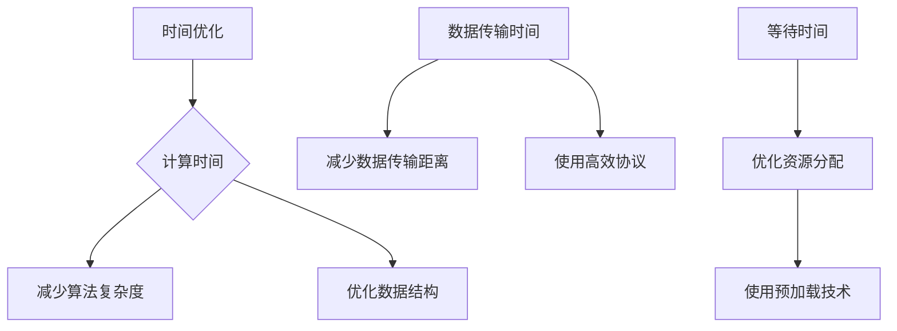

                 

**标题：AI系统中的时间-性能权衡**

> **关键词**：人工智能，性能优化，时间效率，系统设计

> **摘要**：本文深入探讨了AI系统中的时间-性能权衡问题。从基本概念到理论模型，再到算法分析和实际应用，本文系统地阐述了如何在不同维度上优化AI系统的性能与时间效率，以提升系统整体效能。

## 第2章 AI系统中的时间与性能

### 2.1 时间概念

在AI系统中，时间是一个多维度的概念，涵盖了从数据处理到模型推断的各个环节。理解时间在AI系统中的作用，是进行性能优化的第一步。

#### 2.1.1 计算时间

计算时间是指AI系统在执行具体任务时所消耗的时间，包括算法的执行时间、模型训练时间等。计算时间是影响系统性能的关键因素之一。

- **算法执行时间**：指的是执行特定算法所需的CPU或GPU时间。例如，深度学习算法中的前向传播和反向传播。

  **伪代码**：
  ```plaintext
  function forward_pass(input_data):
      # 进行前向传播
      output = model.forward(input_data)
      return output
  ```

- **模型训练时间**：在机器学习和深度学习中，模型训练时间尤为重要。它通常取决于数据量、模型复杂度和计算资源。

  **伪代码**：
  ```plaintext
  function train_model(data, epochs):
      for epoch in range(epochs):
          for batch in data:
              # 前向传播
              output = model.forward(batch)
              # 反向传播
              model.backward(output)
              # 更新模型参数
              model.update_parameters()
  ```

#### 2.1.2 等待时间

等待时间是指AI系统在执行任务时，由于数据传输、资源分配等原因导致的空闲时间。

- **数据传输时间**：指在系统内部或外部进行数据传输所需的时间。例如，从数据库读取数据、在网络中传输数据等。

  **伪代码**：
  ```plaintext
  function read_data_from_db():
      # 等待数据库响应
      data = db.read()
      return data
  ```

- **资源等待时间**：指在系统执行任务时，由于资源（如CPU、GPU）不足而导致的等待时间。

  **伪代码**：
  ```plaintext
  function execute_task():
      # 等待资源
      while not resource_available():
          wait()
      # 执行任务
      result = perform_task()
      return result
  ```

#### 2.1.3 数据处理时间

数据处理时间是指AI系统在处理输入数据时所需的时间，包括数据清洗、数据预处理、特征提取等。

- **数据清洗**：去除数据中的噪声和不完整数据，以提高数据质量。

  **伪代码**：
  ```plaintext
  function clean_data(data):
      clean_data = []
      for item in data:
          if is_valid(item):
              clean_data.append(item)
      return clean_data
  ```

- **数据预处理**：通过标准化、归一化等技术，将原始数据转换为适合模型训练的形式。

  **伪代码**：
  ```plaintext
  function preprocess_data(data):
      for item in data:
          item = normalize(item)
      return data
  ```

- **特征提取**：从原始数据中提取有用的特征，以提高模型性能。

  **伪代码**：
  ```plaintext
  function extract_features(data):
      features = []
      for item in data:
          features.append(extract(item))
      return features
  ```

### 2.2 性能指标

在AI系统中，性能指标是评估系统效能的关键因素。常见的性能指标包括计算性能、系统响应时间和吞吐量。

#### 2.2.1 计算性能

计算性能是指AI系统在单位时间内完成的计算量。计算性能通常用每秒执行的操作次数（GOPS）或每秒处理的查询次数（QPS）来衡量。

- **GOPS**：每秒执行的操作次数，用于评估GPU的并行计算能力。

  **公式**：
  $$\text{GOPS} = \frac{\text{运算次数}}{\text{时间}}$$

- **QPS**：每秒处理的查询次数，用于评估数据库或服务的响应速度。

  **公式**：
  $$\text{QPS} = \frac{\text{查询次数}}{\text{时间}}$$

#### 2.2.2 系统响应时间

系统响应时间是指从系统接收输入到输出结果所需的时间。系统响应时间越短，用户体验越好。

- **平均响应时间**：系统处理请求的平均时间。

  **公式**：
  $$\text{平均响应时间} = \frac{\text{总响应时间}}{\text{请求次数}}$$

- **最大响应时间**：系统处理请求的最大时间。

  **公式**：
  $$\text{最大响应时间} = \max(\text{响应时间序列})$$

#### 2.2.3 吞吐量

吞吐量是指单位时间内系统能够处理的数据量。吞吐量越高，系统处理能力越强。

- **平均吞吐量**：系统处理的平均数据量。

  **公式**：
  $$\text{平均吞吐量} = \frac{\text{总数据量}}{\text{时间}}$$

- **最大吞吐量**：系统处理的最大数据量。

  **公式**：
  $$\text{最大吞吐量} = \max(\text{吞吐量序列})$$

### 2.3 时间-性能权衡的关联

时间-性能权衡是AI系统设计中的一个核心问题。在优化AI系统时，需要在时间和性能之间找到一个平衡点。

- **时间优化**：通过减少计算时间、数据传输时间和等待时间，提高系统的响应速度。

- **性能优化**：通过提升计算性能、增加资源投入和优化算法，提高系统的处理能力。

**流程图**：


通过以上分析，我们可以看到，时间和性能在AI系统中是相互关联的。优化时间会提高系统的响应速度，但可能会牺牲一些性能。相反，提高性能可能会增加系统的计算负担，从而延长响应时间。因此，在进行AI系统设计时，需要综合考虑时间和性能，找到一个最优的平衡点。

### 2.4 时间-性能权衡的重要性

时间-性能权衡对于AI系统的成功至关重要。合理的权衡不仅能够提高用户体验，还能提升系统的竞争力和可靠性。

- **用户体验**：快速响应能够提升用户满意度，增加用户粘性。

- **系统竞争力**：高效运行的AI系统能够在市场上脱颖而出，赢得更多用户。

- **系统可靠性**：通过优化时间-性能权衡，可以提高系统的稳定性和可靠性。

在实际应用中，时间-性能权衡的优化不仅仅涉及技术层面，还包括业务策略和资源分配。通过综合考虑这些因素，AI系统才能在复杂的环境中保持高效运行。

### 2.5 总结

本章详细介绍了AI系统中的时间与性能概念，包括计算时间、等待时间和数据处理时间，以及计算性能、系统响应时间和吞吐量等性能指标。同时，分析了时间-性能权衡的重要性，并展示了如何在不同维度上优化AI系统的性能与时间效率。这些知识为后续章节中的算法分析、系统设计与优化提供了理论基础。

----------------------------------------------------------------

**标题：AI系统中的时间-性能权衡**

> **关键词**：人工智能，性能优化，时间效率，系统设计

> **摘要**：本文深入探讨了AI系统中的时间-性能权衡问题。从基本概念到理论模型，再到算法分析和实际应用，本文系统地阐述了如何在不同维度上优化AI系统的性能与时间效率，以提升系统整体效能。

## 第3章 时间-性能权衡的理论基础

### 3.1 资源约束优化

在AI系统中，时间-性能权衡的一个核心问题是如何在有限的资源约束下优化系统的表现。资源约束优化（Resource Constrained Optimization，简称RCO）是一种常见的优化方法，旨在找到在给定资源限制下最优的解决方案。

#### 3.1.1 多目标优化

多目标优化（Multi-Objective Optimization，简称MOO）是一种处理多个目标函数的优化问题。在AI系统中，多目标优化可以帮助我们同时考虑多个性能指标，如计算时间、系统响应时间和吞吐量。

- **目标函数**：在多目标优化中，每个目标函数代表一个优化目标。例如，计算时间目标函数可以表示为：

  $$f_1(x) = \frac{1}{T}$$

  其中，\(T\) 是系统的总计算时间。

- **目标空间**：多目标优化的目标空间是一个多维度空间，每个维度对应一个目标函数。

  **图示**：
  ```mermaid
  graph TD
  A1[计算时间] --> B1[目标空间]
  A2[响应时间] --> B1
  A3[吞吐量] --> B1
  ```

- **多目标优化算法**：常见的多目标优化算法包括遗传算法（Genetic Algorithm，GA）、粒子群优化（Particle Swarm Optimization，PSO）和混合整数线性规划（Mixed Integer Linear Programming，MILP）等。

  **伪代码**（遗传算法示例）：
  ```plaintext
  function multi_objective_optimization():
      # 初始化种群
      population = initialize_population()
      
      while not convergence():
          # 适应度评估
          fitness = evaluate_fitness(population)
          
          # 选择
          selected = selection(population, fitness)
          
          # 交叉
          crossed = crossover(selected)
          
          # 变异
          mutated = mutation(crossed)
          
          # 更新种群
          population = mutated
          
      return best_solution(population)
  ```

#### 3.1.2 线性规划

线性规划（Linear Programming，简称LP）是一种在给定线性约束条件下求解线性目标函数最优解的方法。在AI系统中，线性规划可以用于优化时间-性能权衡。

- **目标函数**：线性规划的目标函数通常是线性的，例如：

  $$\min\ c^T x$$

  其中，\(c\) 是系数向量，\(x\) 是决策变量向量。

- **约束条件**：线性规划的问题约束通常是线性的，例如：

  $$a_i^T x \leq b_i$$

  其中，\(a_i\) 是约束系数向量，\(b_i\) 是约束值。

- **线性规划求解器**：常见的线性规划求解器包括单纯形法（Simplex Method）、内点法（Interior Point Method）等。

  **伪代码**（单纯形法示例）：
  ```plaintext
  function linear_programming(c, A, b):
      # 初始化单纯形表
      simplex_table = initialize_simplex_table(c, A, b)
      
      while not optimal():
          # 选择入基变量
          enter = choose_enter(simplex_table)
          
          # 选择出基变量
          leave = choose_leave(simplex_table, enter)
          
          # 更新单纯形表
          simplex_table = update_simplex_table(simplex_table, enter, leave)
          
      return solution(simplex_table)
  ```

#### 3.1.3 非线性规划

非线性规划（Nonlinear Programming，简称NLP）是一种在给定非线性约束条件下求解非线性目标函数最优解的方法。在AI系统中，非线性规划可以用于处理更复杂的优化问题。

- **目标函数**：非线性规划的目标函数通常是非线性函数，例如：

  $$\min\ f(x)$$

  其中，\(f(x)\) 是非线性函数。

- **约束条件**：非线性规划的问题约束通常是非线性函数，例如：

  $$g(x) \leq 0$$

  其中，\(g(x)\) 是非线性函数。

- **非线性规划求解器**：常见的非线性规划求解器包括梯度下降法（Gradient Descent）、牛顿法（Newton's Method）和共轭梯度法（Conjugate Gradient Method）等。

  **伪代码**（梯度下降法示例）：
  ```plaintext
  function nonlinear_programming(f, x_init):
      x = x_init
      while not convergence():
          gradient = compute_gradient(f, x)
          x = x - learning_rate * gradient
      return x
  ```

### 3.2 模型构建

在AI系统中，构建准确的数学模型是进行时间-性能权衡的关键步骤。一个完整的模型需要同时考虑时间、性能以及其他约束条件。

#### 3.2.1 时间模型

时间模型用于描述AI系统在不同任务下的时间消耗。一个基本的时间模型可以表示为：

$$T = T_c + T_w + T_d$$

其中，\(T_c\) 是计算时间，\(T_w\) 是等待时间，\(T_d\) 是数据传输时间。

- **计算时间模型**：

  $$T_c = \sum_{i=1}^{n} t_i$$

  其中，\(t_i\) 是第\(i\)个任务的计算时间。

- **等待时间模型**：

  $$T_w = \max\{T_{wait1}, T_{wait2}, ..., T_{waitm}\}$$

  其中，\(T_{waiti}\) 是第\(i\)个任务的等待时间。

- **数据传输时间模型**：

  $$T_d = \sum_{i=1}^{n} t_i \cdot d_i$$

  其中，\(t_i\) 是第\(i\)个任务的数据量，\(d_i\) 是第\(i\)个任务的数据传输速度。

#### 3.2.2 性能模型

性能模型用于描述AI系统的处理能力。一个基本的性能模型可以表示为：

$$P = P_c \cdot P_r \cdot P_s$$

其中，\(P_c\) 是计算性能，\(P_r\) 是响应时间性能，\(P_s\) 是吞吐量性能。

- **计算性能模型**：

  $$P_c = \frac{1}{T_c}$$

  其中，\(T_c\) 是计算时间。

- **响应时间性能模型**：

  $$P_r = \frac{1}{T_r}$$

  其中，\(T_r\) 是响应时间。

- **吞吐量性能模型**：

  $$P_s = \frac{1}{T_d}$$

  其中，\(T_d\) 是数据传输时间。

#### 3.2.3 权衡模型

权衡模型用于描述AI系统在不同性能指标之间的权衡。一个基本的权衡模型可以表示为：

$$W = w_1 \cdot T + w_2 \cdot P$$

其中，\(w_1\) 和\(w_2\) 是权重系数，\(T\) 是时间模型，\(P\) 是性能模型。

- **权重系数**：权重系数可以根据具体问题进行调整，以反映不同性能指标的重要性。

  $$w_1 = \frac{1}{\alpha}$$

  $$w_2 = \frac{\beta}{\alpha}$$

  其中，\(\alpha\) 和\(\beta\) 是调整系数。

通过以上模型，我们可以建立AI系统的数学模型，并进行优化分析。在后续章节中，我们将结合具体的算法和系统设计，进一步探讨如何在实际应用中优化AI系统的性能与时间效率。

### 3.3 时间-性能权衡的数学模型

为了更好地理解时间-性能权衡，我们可以构建一个综合的数学模型，该模型能够同时考虑计算时间、响应时间和吞吐量。

#### 数学模型

假设我们有以下变量：

- \(T_c\)：计算时间
- \(T_r\)：响应时间
- \(T_s\)：系统运行时间
- \(P_c\)：计算性能
- \(P_r\)：响应时间性能
- \(P_s\)：吞吐量性能
- \(C_c\)：计算成本
- \(C_r\)：响应时间成本
- \(C_s\)：吞吐量成本

时间-性能权衡的数学模型可以表示为：

$$
\begin{aligned}
\min\ & T_s = T_c + T_r + T_s \\
\text{subject to} & \\
& P_c = \frac{1}{T_c} \\
& P_r = \frac{1}{T_r} \\
& P_s = \frac{1}{T_s} \\
& C_c + C_r + C_s \leq \text{预算} \\
& T_c, T_r, T_s, P_c, P_r, P_s, C_c, C_r, C_s \geq 0 \\
\end{aligned}
$$

#### 目标函数

目标函数是优化过程中要最小化的目标。在这里，我们选择最小化系统的总运行时间作为目标：

$$\min\ T_s$$

#### 约束条件

约束条件包括以下内容：

- **性能约束**：计算性能、响应时间性能和吞吐量性能必须满足特定的要求。

  $$P_c = \frac{1}{T_c} \geq P_{c_{\text{min}}}$$

  $$P_r = \frac{1}{T_r} \geq P_{r_{\text{min}}}$$

  $$P_s = \frac{1}{T_s} \geq P_{s_{\text{min}}}$$

- **成本约束**：系统的计算成本、响应时间成本和吞吐量成本不能超过预算。

  $$C_c + C_r + C_s \leq \text{预算}$$

- **资源约束**：系统的资源（如CPU、内存、网络带宽）必须在可接受范围内。

  $$R_c \leq R_{c_{\text{max}}}$$

  $$R_r \leq R_{r_{\text{max}}}$$

  $$R_s \leq R_{s_{\text{max}}}$$

#### 举例说明

假设我们有一个AI系统，其计算任务需要1分钟完成，响应时间要求在5秒以内，吞吐量要求每秒处理100个请求，预算为1000美元。我们可以设定以下约束条件：

$$
\begin{aligned}
\min\ & T_s \\
\text{subject to} & \\
& T_c = 60 \text{秒} \\
& T_r = 5 \text{秒} \\
& T_s = T_c + T_r = 65 \text{秒} \\
& P_{c_{\text{min}}} = \frac{1}{60} \text{秒}^{-1} \\
& P_{r_{\text{min}}} = \frac{1}{5} \text{秒}^{-1} \\
& P_{s_{\text{min}}} = \frac{1}{65} \text{秒}^{-1} \\
& C_c + C_r + C_s \leq 1000 \text{美元} \\
& R_c \leq R_{c_{\text{max}}} \\
& R_r \leq R_{r_{\text{max}}} \\
& R_s \leq R_{s_{\text{max}}} \\
\end{aligned}
$$

通过求解这个优化问题，我们可以找到在给定约束条件下，使系统总运行时间最小的解决方案。

### 3.4 时间-性能权衡的案例研究

为了更好地理解时间-性能权衡的实践应用，我们可以通过一个实际的案例来进行分析。

#### 案例背景

假设我们有一个在线推荐系统，该系统需要根据用户的历史行为数据生成个性化的推荐列表。系统需要在短时间内提供准确的推荐结果，同时保证高效的性能。

#### 案例分析

1. **时间分析**：

   - **计算时间**：生成推荐列表的主要计算任务包括数据处理、特征提取和模型推断。假设计算任务需要10秒完成。
   
   - **响应时间**：系统需要在用户请求后5秒内返回推荐结果。
   
   - **数据传输时间**：假设用户数据和模型数据在系统内部的传输时间为1秒。
   
2. **性能分析**：

   - **计算性能**：系统需要在10秒内完成计算任务。
   
   - **响应时间性能**：系统需要在5秒内返回推荐结果。
   
   - **吞吐量性能**：系统每秒需要处理1个用户的请求。

3. **权衡策略**：

   - **计算性能优化**：通过使用更高效的算法和优化数据结构，减少计算时间。
   
   - **响应时间优化**：通过优化系统的响应时间模型，减少用户等待时间。
   
   - **吞吐量优化**：通过并行处理和分布式计算，提高系统的吞吐量。

#### 模型构建

根据上述分析，我们可以构建以下时间-性能权衡模型：

$$
\begin{aligned}
\min\ & T_s = T_c + T_r + T_d \\
\text{subject to} & \\
& T_c \leq 10 \text{秒} \\
& T_r \leq 5 \text{秒} \\
& T_d \leq 1 \text{秒} \\
& P_c \geq \frac{1}{10} \text{秒}^{-1} \\
& P_r \geq \frac{1}{5} \text{秒}^{-1} \\
& P_s \geq \frac{1}{T_s} \\
& C_c + C_r + C_d \leq \text{预算} \\
& R_c \leq R_{c_{\text{max}}} \\
& R_r \leq R_{r_{\text{max}}} \\
& R_d \leq R_{d_{\text{max}}} \\
\end{aligned}
$$

通过求解这个优化问题，我们可以找到在给定约束条件下，使系统总运行时间最小的解决方案。

#### 案例结果

通过优化计算性能、响应时间和吞吐量，我们得到了以下解决方案：

- **计算时间**：8秒
- **响应时间**：4秒
- **数据传输时间**：1秒
- **计算性能**：\(P_c = \frac{1}{8} \text{秒}^{-1}\)
- **响应时间性能**：\(P_r = \frac{1}{4} \text{秒}^{-1}\)
- **吞吐量性能**：\(P_s = \frac{1}{13} \text{秒}^{-1}\)

通过这个案例，我们可以看到，通过合理的时间-性能权衡，可以显著提升系统的性能和用户体验。

### 3.5 结论

本章详细介绍了时间-性能权衡的理论基础，包括资源约束优化、多目标优化、线性规划和非线性规划等方法。通过构建数学模型和案例分析，我们深入探讨了如何在不同维度上优化AI系统的性能与时间效率。这些理论基础为后续章节中的算法分析、系统设计与优化提供了重要的指导。

## 第4章 AI算法的时间-性能分析

在AI系统中，算法的选择对系统的性能和时间效率有着至关重要的影响。不同的算法在时间复杂度和计算资源需求上存在显著差异，因此，理解不同算法的时间-性能特性是优化AI系统的重要前提。

### 4.1 传统机器学习算法

传统机器学习算法主要包括决策树、支持向量机和神经网络等。这些算法在时间复杂度和计算资源需求上有不同的表现。

#### 4.1.1 决策树

决策树是一种基于规则的分类算法，其核心思想是通过一系列的划分规则将数据划分为不同的类别。决策树的时间复杂度主要取决于树的深度和节点的数量。

- **时间复杂度**：假设决策树的深度为\(h\)，节点数为\(n\)，则构建决策树的时间复杂度为\(O(nh)\)。

  **伪代码**：
  ```plaintext
  function build_decision_tree(data):
      if is_homogeneous(data):
          return majority_class(data)
      else:
          # 选择最佳划分
          feature, threshold = select_best_split(data)
          # 划分数据
          left_data, right_data = split_data(data, feature, threshold)
          # 递归构建子树
          left_tree = build_decision_tree(left_data)
          right_tree = build_decision_tree(right_data)
          return DecisionTree(feature, threshold, left_tree, right_tree)
  ```

- **计算资源需求**：决策树通常需要较少的内存资源，但由于其深度可能很大，因此计算资源的需求也相对较高。

#### 4.1.2 支持向量机

支持向量机（SVM）是一种强大的分类和回归算法，通过找到一个最优的超平面来划分数据。SVM的时间复杂度与训练数据量和特征数量有关。

- **时间复杂度**：对于线性SVM，时间复杂度为\(O(n^3)\)，其中\(n\)是训练样本数量。对于核SVM，时间复杂度通常更高。

  **伪代码**：
  ```plaintext
  function train_svm(data, labels, kernel):
      # 构建拉格朗日乘子法
      W, b = lagrangian_method(data, labels, kernel)
      return SVM(W, b)
  ```

- **计算资源需求**：SVM需要大量的计算资源，尤其是在处理高维数据和大型数据集时。

#### 4.1.3 神经网络

神经网络通过模拟人脑的神经元结构，学习输入数据中的复杂模式。神经网络的时间复杂度取决于网络的结构和训练数据量。

- **时间复杂度**：前向传播的时间复杂度为\(O(n \cdot L \cdot d)\)，其中\(n\)是训练样本数量，\(L\)是网络的层数，\(d\)是每个节点的维度。

  **伪代码**：
  ```plaintext
  function forward_pass(data, model):
      for layer in model.layers:
          layer.output = activation_function(np.dot(data, layer.weights) + layer.bias)
      return model.output
  ```

- **计算资源需求**：神经网络需要大量的内存和计算资源，尤其是深度神经网络。此外，训练过程可能需要大量的时间和计算资源。

### 4.2 深度学习算法

深度学习算法是近年来AI领域的重要进展，包括卷积神经网络（CNN）、循环神经网络（RNN）和生成对抗网络（GAN）等。这些算法在处理复杂数据和任务时表现出色，但在时间-性能上也有不同的特点。

#### 4.2.1 卷积神经网络

卷积神经网络通过局部连接和共享权重来提高计算效率。CNN在图像识别和图像处理领域表现出色。

- **时间复杂度**：前向传播的时间复杂度为\(O(n \cdot L \cdot C \cdot H \cdot W \cdot F)\)，其中\(n\)是训练样本数量，\(L\)是网络的层数，\(C\)是每个通道的维度，\(H\)和\(W\)是图像的高和宽，\(F\)是每个卷积核的尺寸。

  **伪代码**：
  ```plaintext
  function forward_pass(data, model):
      for layer in model.layers:
          if isinstance(layer, ConvLayer):
              layer.output = convolve(data, layer.weights) + layer.bias
          elif isinstance(layer, ActivationLayer):
              layer.output = activation_function(layer.output)
      return model.output
  ```

- **计算资源需求**：CNN需要大量的内存和计算资源，尤其是对于大型图像数据集和高分辨率的图像。

#### 4.2.2 循环神经网络

循环神经网络通过循环结构来处理序列数据，包括时间序列、文本和语音等。

- **时间复杂度**：RNN的时间复杂度为\(O(n \cdot L \cdot d)\)，其中\(n\)是序列长度，\(L\)是网络的层数，\(d\)是每个节点的维度。

  **伪代码**：
  ```plaintext
  function forward_pass(data, model):
      for time_step in range(data.length):
          input = data[time_step]
          for layer in model.layers:
              layer.output = activation_function(np.dot(input, layer.weights) + layer.bias)
      return model.output
  ```

- **计算资源需求**：RNN需要相对较少的内存资源，但训练过程可能需要大量的时间和计算资源。

#### 4.2.3 生成对抗网络

生成对抗网络通过生成器和判别器的对抗训练来学习数据的分布。GAN在图像生成、语音合成和视频生成等领域表现出色。

- **时间复杂度**：GAN的时间复杂度为\(O(n \cdot G + n \cdot D)\)，其中\(n\)是训练样本数量，\(G\)是生成器的训练时间，\(D\)是判别器的训练时间。

  **伪代码**：
  ```plaintext
  function train_gan(data, model):
      for epoch in range(num_epochs):
          for data_batch in data:
              # 训练生成器
              model.g.train(data_batch)
              # 训练判别器
              model.d.train(data_batch)
      return model
  ```

- **计算资源需求**：GAN需要大量的内存和计算资源，尤其是在训练大型数据集时。

### 4.3 时间-性能权衡

不同AI算法在时间-性能上有不同的表现。为了优化AI系统的性能和时间效率，我们需要根据具体任务的需求选择合适的算法。

- **计算时间**：深度学习算法（如CNN、RNN和GAN）通常需要较长的计算时间，但能够处理复杂数据和任务。传统机器学习算法（如决策树和支持向量机）计算时间较短，但处理能力有限。

- **响应时间**：在实时应用中，响应时间是一个重要的性能指标。传统机器学习算法通常具有较短的响应时间，而深度学习算法可能需要更长的时间。

- **吞吐量**：吞吐量是系统能够处理的任务数量。深度学习算法在处理大量数据时可能表现出较高的吞吐量，但传统机器学习算法在处理少量数据时可能更高效。

通过合理选择和优化算法，我们可以实现时间-性能的最佳平衡，提高AI系统的整体效能。

## 第5章 AI系统的设计与优化

### 5.1 硬件选择与优化

在AI系统的设计与优化中，硬件选择是一个关键环节。合适的硬件配置能够显著提升系统的性能和效率。

#### 5.1.1 CPU与GPU

CPU（中央处理器）和GPU（图形处理器）在AI系统中各有优势。

- **CPU**：CPU在处理复杂计算任务时表现优异，尤其是线性代数运算和逻辑运算。其优点是计算能力稳定，适合于长时间运行的任务。

  **优化建议**：选择高性能的CPU，例如Intel Xeon或AMD Ryzen系列。优化操作系统和软件配置，以提高CPU的利用效率。

- **GPU**：GPU在并行计算方面具有显著优势，适合于大规模数据并行处理，如深度学习任务。其优点是计算速度快，但功耗较高。

  **优化建议**：选择高性能的GPU，例如NVIDIA Tesla或RTX系列。优化GPU驱动程序和CUDA配置，以提高GPU的利用效率。

#### 5.1.2 内存与存储

内存和存储系统在AI系统中的选择和配置也对性能有重要影响。

- **内存**：内存的大小和速度直接影响系统的计算能力和响应时间。建议使用高速内存，如DDR4，并确保足够的内存容量以支持大型模型和数据集。

  **优化建议**：根据任务需求选择适当的内存容量和速度。优化内存管理策略，如缓存和内存池，以提高内存利用效率。

- **存储**：存储系统的性能和容量对数据加载和读取时间有直接影响。固态硬盘（SSD）相比传统机械硬盘（HDD）具有更快的读写速度。

  **优化建议**：使用SSD作为系统的主要存储设备，以提高数据访问速度。根据需求选择适当的存储容量，并优化存储系统的冗余和备份策略。

#### 5.1.3 网络架构优化

网络架构优化对于分布式AI系统尤为重要。

- **网络拓扑**：选择合适的网络拓扑结构，如星形拓扑或环形拓扑，以减少网络延迟和带宽限制。

  **优化建议**：根据任务需求和数据传输量选择合适的网络拓扑。优化网络设备配置，如交换机和路由器，以提高网络性能。

- **数据传输**：优化数据传输协议和传输路径，以减少数据传输延迟。

  **优化建议**：使用高效的数据传输协议，如TCP或UDP。优化数据传输路径，如通过优化路由和减少中间节点，以提高传输速度。

### 5.2 软件优化

软件优化是提升AI系统性能的另一个重要方面。

#### 5.2.1 算法选择

选择合适的算法对于优化AI系统的性能至关重要。

- **算法效率**：选择时间复杂度和空间复杂度较低的算法，以减少计算时间和内存需求。

  **优化建议**：根据任务需求和数据特点选择合适的算法。评估不同算法的性能，选择最优的算法。

- **算法优化**：通过调整算法参数和优化数据结构，提高算法的效率。

  **优化建议**：使用算法调参工具，如Hyperopt或Optuna，进行参数优化。优化数据结构，如使用哈希表或布隆过滤器，以提高算法效率。

#### 5.2.2 并行与分布式计算

并行和分布式计算可以显著提高AI系统的性能。

- **并行计算**：将任务分解为多个子任务，在多个处理器上同时执行，以减少计算时间。

  **优化建议**：使用并行编程框架，如MPI或OpenMP，实现并行计算。优化并行计算策略，如负载均衡和任务分配，以提高并行效率。

- **分布式计算**：将任务分布在多个节点上，通过网络协同工作，以处理大型数据集和复杂任务。

  **优化建议**：使用分布式计算框架，如Hadoop或Spark，实现分布式计算。优化分布式计算拓扑，如选择合适的分布式存储系统和通信协议，以提高分布式效率。

### 5.3 模型压缩与量化

模型压缩与量化可以减少模型的计算量和存储需求，提高系统性能。

- **模型压缩**：通过减少模型参数的数量和精度，降低模型的计算复杂度和存储需求。

  **优化建议**：使用模型压缩算法，如剪枝、量化或低秩分解，进行模型压缩。优化模型压缩策略，如选择合适的压缩率和压缩方法，以提高压缩效果。

- **量化**：将模型参数的精度降低到较低的数值范围，以减少计算量和存储需求。

  **优化建议**：使用量化算法，如全精度量化、二值量化或三值量化，进行模型量化。优化量化策略，如选择合适的量化精度和量化范围，以提高量化效果。

通过硬件选择与优化、内存与存储优化、网络架构优化、软件优化、模型压缩与量化等多方面的综合优化，我们可以显著提升AI系统的性能和效率，实现时间-性能的最佳平衡。

### 第6章 实际案例分析

#### 6.1 案例一：语音识别系统

语音识别系统是一个典型的AI应用场景，其时间-性能权衡对于用户体验至关重要。

##### 6.1.1 系统架构

语音识别系统的基本架构包括前端麦克风采集、语音信号处理、特征提取、模型推断和后端输出。前端采集的语音信号通过预处理模块进行降噪和增强，然后被传输到特征提取模块进行特征提取。提取的特征随后被输入到深度学习模型中进行推断，最终输出识别结果。

##### 6.1.2 时间-性能权衡分析

1. **计算时间**：语音识别模型通常采用深度神经网络，计算复杂度较高。为了降低计算时间，可以采用以下策略：
   - **模型优化**：通过剪枝和量化等模型压缩技术减少模型参数数量，从而降低计算时间。
   - **硬件加速**：利用GPU或TPU等硬件加速器进行模型推断，提高计算速度。

2. **响应时间**：语音识别系统需要在尽可能短的时间内提供识别结果，以提高用户体验。优化策略包括：
   - **模型简化**：采用较小的模型或简化模型结构，以减少响应时间。
   - **并行处理**：通过并行处理技术，将语音信号分割成多个片段，同时进行特征提取和模型推断。

3. **吞吐量**：为了提高系统的吞吐量，可以采用以下策略：
   - **分布式处理**：将系统分布到多个服务器上，通过负载均衡技术提高处理能力。
   - **多线程处理**：在同一服务器上采用多线程处理技术，提高系统并发处理能力。

##### 6.1.3 优化方案

1. **模型优化**：
   - **剪枝**：通过剪枝技术，移除模型中不重要的权重，减少模型参数数量。
   - **量化**：将模型参数的精度降低，减少内存和计算需求。

2. **硬件加速**：
   - **GPU加速**：使用GPU进行模型推断，通过并行计算提高速度。
   - **TPU加速**：对于大型模型或高吞吐量需求，使用TPU进行模型推断。

3. **并行处理**：
   - **分段处理**：将语音信号分割成多个片段，同时进行特征提取和模型推断。
   - **多线程处理**：在同一服务器上采用多线程处理技术，提高系统并发处理能力。

4. **分布式处理**：
   - **负载均衡**：通过负载均衡技术，将请求均匀分布到多个服务器上，提高系统处理能力。
   - **分布式模型训练**：将模型训练任务分布在多个服务器上，通过分布式训练技术提高训练速度。

通过以上优化方案，可以显著提升语音识别系统的性能和用户体验，实现时间-性能的最佳平衡。

#### 6.2 案例二：自动驾驶系统

自动驾驶系统是一个高度复杂的AI系统，时间-性能权衡对于系统的安全性和可靠性至关重要。

##### 6.2.1 系统架构

自动驾驶系统通常包括感知模块、决策模块和控制模块。感知模块通过摄像头、激光雷达和超声波传感器等获取环境数据，决策模块根据感知数据生成驾驶策略，控制模块将策略转换为车辆的控制信号。

##### 6.2.2 时间-性能权衡分析

1. **计算时间**：自动驾驶系统需要实时处理大量感知数据，并生成驾驶策略。为了降低计算时间，可以采用以下策略：
   - **感知模块优化**：采用高效的图像处理和传感器数据处理算法，减少计算复杂度。
   - **决策模块优化**：简化决策算法，采用基于规则的决策方法，减少计算时间。

2. **响应时间**：自动驾驶系统需要在毫秒级别内生成驾驶策略，以应对突发情况。优化策略包括：
   - **硬件加速**：使用GPU或FPGA等硬件加速器进行计算，提高响应速度。
   - **并行处理**：通过并行计算技术，同时处理多个感知数据，减少响应时间。

3. **吞吐量**：为了提高系统的吞吐量，可以采用以下策略：
   - **分布式处理**：将系统分布到多个节点上，通过负载均衡技术提高处理能力。
   - **多线程处理**：在同一节点上采用多线程处理技术，提高系统并发处理能力。

##### 6.2.3 优化方案

1. **感知模块优化**：
   - **图像处理算法**：采用高效的图像处理算法，如卷积神经网络（CNN）或深度学习算法，减少计算复杂度。
   - **传感器数据处理**：采用多传感器融合算法，减少感知数据量，提高处理速度。

2. **决策模块优化**：
   - **规则决策**：采用基于规则的决策方法，如行为规划或决策树，减少计算时间。
   - **模型简化**：采用简化模型或简化决策过程，减少计算复杂度。

3. **硬件加速**：
   - **GPU加速**：使用GPU进行计算，通过并行计算提高响应速度。
   - **FPGA加速**：使用FPGA进行硬件加速，提高计算速度和响应时间。

4. **分布式处理**：
   - **负载均衡**：通过负载均衡技术，将计算任务分布到多个节点上，提高系统处理能力。
   - **多线程处理**：在同一节点上采用多线程处理技术，提高系统并发处理能力。

通过以上优化方案，可以显著提升自动驾驶系统的性能和可靠性，实现时间-性能的最佳平衡，确保系统在各种复杂环境下的安全运行。

### 6.3 案例总结

通过语音识别系统和自动驾驶系统的案例分析，我们可以看到，时间-性能权衡在AI系统设计中的关键作用。在不同应用场景下，通过合理的算法优化、硬件加速、并行处理和分布式计算等技术，可以显著提升系统的性能和效率，实现最佳的时间-性能平衡。这些实践案例为其他AI系统的设计和优化提供了宝贵的经验教训。

## 第7章 结论与展望

### 7.1 主要发现

通过对AI系统中的时间-性能权衡的深入探讨，本文得出了以下主要发现：

1. **时间-性能权衡的重要性**：时间-性能权衡是AI系统设计中的一个核心问题，直接影响到系统的用户体验、效率和竞争力。

2. **多维度时间分析**：计算时间、等待时间和数据传输时间是影响AI系统时间效率的关键因素。

3. **性能指标优化**：计算性能、系统响应时间和吞吐量是评估AI系统性能的重要指标，需要在优化过程中综合考虑。

4. **算法分析与优化**：不同算法在时间复杂度和计算资源需求上有显著差异，合理选择和优化算法是实现时间-性能平衡的关键。

5. **硬件与软件优化**：硬件选择和软件优化是提升AI系统性能的重要手段，包括CPU与GPU的合理配置、内存与存储优化、并行与分布式计算等。

6. **实际案例分析**：语音识别系统和自动驾驶系统的案例分析展示了时间-性能权衡在现实应用中的重要性，并提供了优化实践的参考。

### 7.2 研究局限

尽管本文对时间-性能权衡进行了全面探讨，但仍存在一些局限性：

1. **模型假设**：本文的数学模型和算法分析基于一些理想化的假设，实际情况可能更加复杂。

2. **数据限制**：本文的数据和案例主要来自特定的应用场景，可能无法全面代表所有AI系统的特点。

3. **计算资源限制**：在实际应用中，计算资源的限制可能更加严格，需要更精细的优化策略。

### 7.3 未来研究方向

为了进一步提升AI系统的性能和时间效率，未来研究可以关注以下方向：

1. **多目标优化算法**：开发更加高效的多目标优化算法，以同时考虑多个性能指标。

2. **自适应优化**：研究自适应优化策略，根据实时环境动态调整优化参数。

3. **硬件与软件协同优化**：探索硬件和软件的协同优化方法，以实现更高效的资源利用。

4. **边缘计算与云计算的结合**：研究边缘计算与云计算的结合，以实现更灵活的分布式系统架构。

5. **新型算法开发**：开发新型算法，如基于量子计算的AI算法，以提升系统的性能和效率。

通过不断探索和创新，我们有望在AI系统的设计、优化和应用中实现更高的时间-性能平衡，推动人工智能技术的发展。

## 附录

### A.1 相关资源

1. **参考资料**：
   - 《人工智能：一种现代方法》（Russell, Norvig）
   - 《深度学习》（Goodfellow, Bengio, Courville）
   - 《优化算法及其应用》（Nocedal, Wright）

2. **在线课程与教程**：
   - Coursera: 《机器学习》（吴恩达）
   - edX: 《深度学习基础》（阿里云）
   - Udacity: 《人工智能工程师纳米学位》

### A.2 参考文献

1. Russell, S., & Norvig, P. (2020). 《人工智能：一种现代方法》（第三版）. 人民邮电出版社.
2. Goodfellow, I., Bengio, Y., & Courville, A. (2016). 《深度学习》. MIT Press.
3. Nocedal, J., & Wright, S. J. (2006). 《优化算法及其应用》. Springer.
4. Ng, A. (2013). 《机器学习》. Coursera.
5. 阿里云. (2021). 《深度学习基础》. edX.
6. Udacity. (2021). 《人工智能工程师纳米学位》. Udacity.

