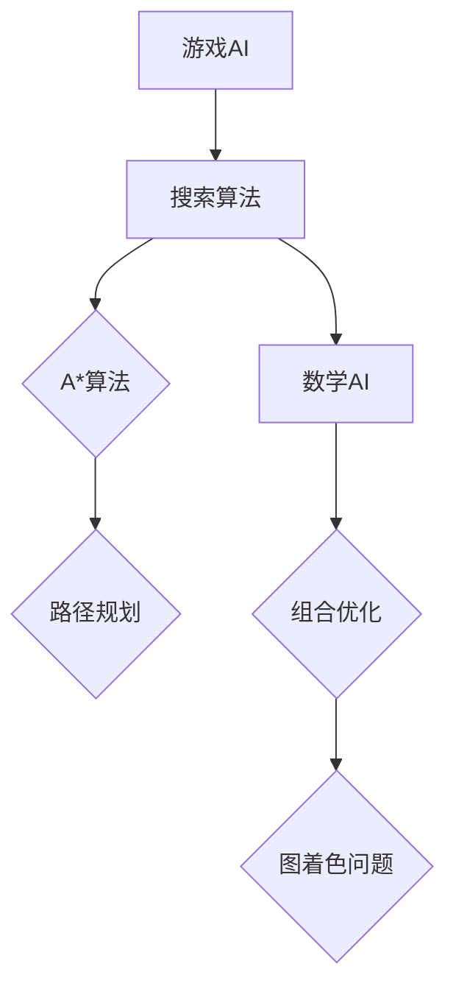
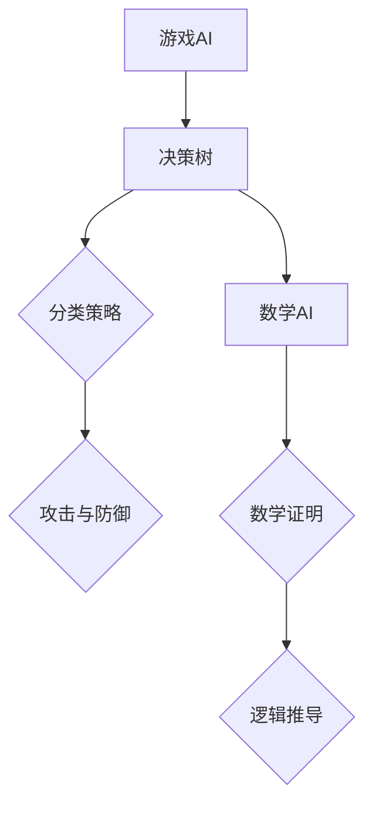
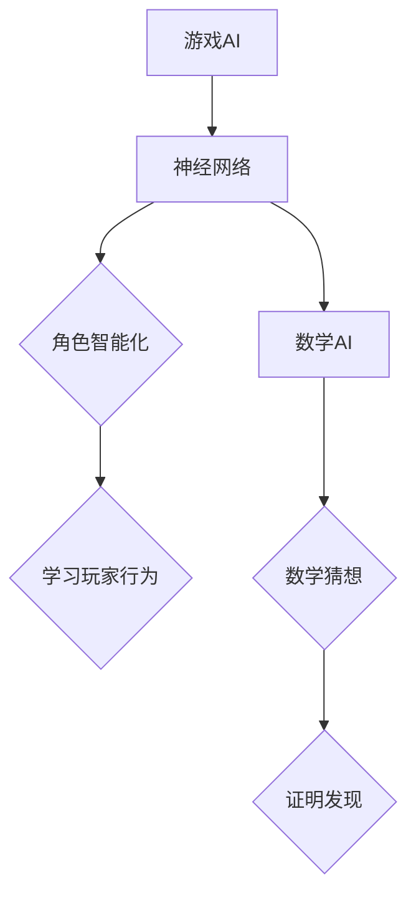
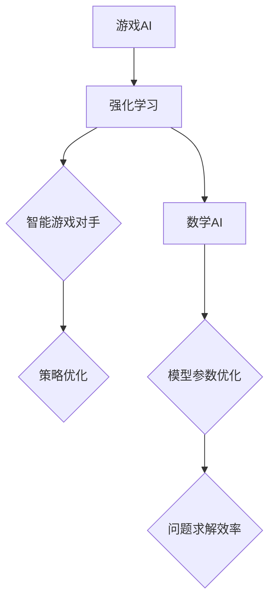

                 


### 背景介绍

AI能力的跨域转移是指将人工智能技术从某一领域成功应用于另一领域的过程。近年来，随着深度学习、强化学习等先进算法的不断发展，AI技术的应用范围日益广泛。然而，如何有效地将AI技术从游戏领域转移到数学领域，成为一个备受关注的研究课题。这不仅仅是因为游戏和数学在技术和应用背景上有着显著差异，更重要的是，跨域转移不仅需要解决技术层面的挑战，还需要深入理解两个领域之间的内在联系和相互影响。

在游戏领域，AI技术主要用于提高游戏体验的智能化程度，例如在《星际争霸2》、《王者荣耀》等游戏中，AI对手能够根据玩家的策略动态调整自身的行为。这些应用不仅提升了游戏的竞技性，也为研究AI提供了丰富的实验场景。而在数学领域，AI则被用于解决复杂的数学问题、发现新的数学定理以及优化数学模型的参数。例如，近年来出现了一些利用深度学习技术进行数学猜想和证明的实例，这极大地拓宽了数学研究的边界。

尽管游戏和数学看似迥异，但二者之间存在许多共同的数学和算法基础。例如，搜索算法、决策树、神经网络等在两个领域都有广泛应用。这种跨领域的技术共享，不仅有助于促进AI技术的发展，也为不同领域的研究提供了新的思路和方法。

本文旨在探讨AI能力的跨域转移，特别是从游戏到数学的转移过程。文章将首先介绍AI在游戏和数学中的具体应用，然后深入分析AI核心概念和算法原理，探讨跨域转移面临的挑战与策略。接着，通过具体案例分析展示AI跨域转移的实践，最后对未来的发展趋势进行展望。通过这篇文章，我们希望能够为读者提供一份全面、深入的AI跨域转移指南。

### 核心概念与联系

在深入探讨AI能力的跨域转移之前，我们有必要先了解一些核心概念及其在游戏和数学中的联系。以下是几个关键概念及其在两个领域中的应用：

#### 1. 搜索算法

搜索算法是AI领域中的一种基本方法，用于在复杂的搜索空间中寻找最优解。在游戏AI中，搜索算法如最小生成树搜索（A*算法）和博弈树搜索广泛应用于游戏策略的制定。例如，在《星际争霸2》中，AI对手会使用A*算法来规划其行动路径，以快速且有效地移动单位。而在数学领域，搜索算法同样重要，特别是在组合优化问题中。例如，图着色问题的解决方案可以通过搜索算法找到最优着色方案。

#### Mermaid流程图

以下是一个Mermaid流程图，展示了搜索算法在游戏和数学中的应用：



#### 2. 决策树

决策树是另一种在AI中广泛使用的算法，主要用于分类和回归任务。在游戏AI中，决策树可以用于制定游戏策略，例如在《王者荣耀》中，决策树可以帮助AI判断何时进行攻击或防御。在数学领域，决策树也被用于数学证明和理论证明，通过将问题分解为多个子问题，逐步推导出最终结论。

以下是一个Mermaid流程图，展示了决策树在游戏和数学中的应用：



#### 3. 神经网络

神经网络是AI领域的基石，特别是深度学习。在游戏AI中，神经网络常用于实现智能化的游戏角色，如《星际争霸2》中的AI对手，它们可以通过神经网络学习玩家的行为模式，并作出相应的反应。在数学领域，神经网络被用于解决复杂的问题，如数学猜想和证明，通过训练神经网络，可以找到证明某些数学定理的有效途径。

以下是一个Mermaid流程图，展示了神经网络在游戏和数学中的应用：



#### 4. 强化学习

强化学习是AI领域中的一种重要方法，通过奖励机制来训练智能体。在游戏AI中，强化学习被广泛应用于开发智能游戏对手，如《Dota2》中的AI，通过不断学习和改进策略来提高比赛表现。在数学领域，强化学习可以用于优化数学模型的参数，提高数学问题的求解效率。

以下是一个Mermaid流程图，展示了强化学习在游戏和数学中的应用：



通过这些核心概念及其应用流程图的展示，我们可以清晰地看到AI技术在游戏和数学领域之间的联系。这些联系不仅为跨领域转移提供了理论基础，也为实际应用提供了可行的方案。在接下来的章节中，我们将深入探讨AI在游戏和数学中的具体应用，以及如何实现有效的跨域转移。

### AI在游戏中的应用

在游戏领域，人工智能（AI）技术已经被广泛应用于提升游戏体验、设计智能对手以及创造更加真实的游戏环境。以下将详细介绍AI在游戏中的应用，包括常见的算法、游戏AI的发展历程以及具体案例。

#### 常见算法

1. **搜索算法**：在游戏AI中，搜索算法是最基本的算法之一。其中，A*算法是最常用的路径规划算法。它通过评估函数在搜索过程中选择最优路径。博弈树搜索则是用于策略游戏，如国际象棋、围棋等，通过遍历整个博弈树来预测游戏结果。

2. **决策树**：决策树用于游戏AI中的决策过程，帮助游戏角色在不同情况下选择最佳行动。例如，在《王者荣耀》中，AI可以基于决策树来决定是否进行攻击或防御。

3. **强化学习**：强化学习通过奖励机制来训练AI模型，使其能够在复杂的游戏中做出最优决策。例如，DeepMind开发的《Dota2》AI就是通过强化学习实现了与人类玩家的对抗。

4. **深度学习**：深度学习在游戏AI中的应用也越来越广泛。通过训练神经网络，游戏角色可以学习到更复杂的游戏策略，如《星际争霸2》中的AI对手。

#### 游戏AI的发展历程

游戏AI的发展历程可以追溯到20世纪80年代。当时，简单的游戏AI主要通过预定义的规则和逻辑来操作。随着计算机性能的提升和AI技术的发展，游戏AI开始引入更为复杂的算法，如搜索算法和决策树。进入21世纪，随着深度学习和强化学习的发展，游戏AI变得更加智能和灵活。

1. **早期游戏AI（20世纪80年代至90年代）**：这一时期，游戏AI主要依靠规则和逻辑进行决策，如国际象棋程序“Deep Blue”和《食人鱼》中的AI。

2. **搜索算法和决策树的应用（20世纪90年代至21世纪初）**：随着计算机性能的提升，搜索算法和决策树开始被广泛应用于游戏AI中，如《星际争霸》中的AI。

3. **深度学习和强化学习（21世纪初至今）**：深度学习和强化学习技术的发展，使得游戏AI进入了一个全新的阶段。AI不仅能够通过大量的数据学习复杂的策略，还能够通过自我对弈不断优化。

#### 具体案例

1. **《星际争霸2》**：在《星际争霸2》中，AI对手的智能程度非常高。它们不仅使用A*算法进行路径规划，还结合博弈树搜索来制定策略。此外，该游戏的AI还使用了深度学习技术，通过不断学习玩家的游戏风格和策略，来提高自身的表现。

2. **《王者荣耀》**：在《王者荣耀》中，AI被用于模拟不同玩家的行为，从而为单机玩家提供智能化的对手。这些AI对手不仅能够进行合理的防御和攻击，还能够根据玩家的行为进行策略调整。

3. **《Dota2》**：DeepMind开发的《Dota2》AI通过强化学习实现了与人类玩家的对抗。该AI不仅能够在对战中保持高胜率，还能够通过自我对弈不断优化策略，提高整体实力。

通过这些具体的案例，我们可以看到AI在游戏中的应用已经从简单的规则和逻辑，发展到了深度学习和强化学习的高度智能化阶段。这不仅提升了游戏体验，也为AI技术的研究提供了丰富的实验场景。在下一节中，我们将探讨AI在数学领域中的应用。

### AI在数学中的应用

在数学领域，人工智能（AI）技术正逐渐成为推动研究和发展的重要工具。AI的引入不仅提高了数学问题的求解效率，还开创了新的研究方向和方法。以下将详细介绍AI在数学中的应用，包括AI解决数学问题的方式、数学AI的关键研究方法以及具体的实例。

#### 解决数学问题的方法

1. **自动推理**：自动推理是AI在数学中应用的一个重要方向。它通过模拟人类的推理过程，自动推导出数学结论。自动推理系统如ELF（Equational Logic Framework）和Prover9等，能够处理复杂的数学证明，解决一些传统方法难以处理的难题。

2. **数值计算**：AI在数值计算中的应用主要体现在优化计算过程和求解复杂的数值问题。例如，深度神经网络可以用于求解微分方程和高维积分，提高计算效率。

3. **几何处理**：几何处理是AI在数学中的另一个重要应用领域。通过深度学习技术，AI可以处理复杂的几何问题，如三维建模、形状识别等。

#### 关键研究方法

1. **深度学习**：深度学习在数学中的应用非常广泛。通过训练深度神经网络，可以自动发现数学函数的特征，进行分类、回归等任务。例如，深度学习模型可以用于识别数学图形、自动生成数学证明等。

2. **机器学习**：机器学习在数学中的应用主要体现在优化和参数估计。通过训练机器学习模型，可以自动优化数学模型的参数，提高预测和求解的准确性。

3. **符号推理**：符号推理是AI在数学中应用的一种传统方法。它通过符号化表示数学问题，利用推理规则进行推导。符号推理系统如Mathematica和Maple等，能够处理复杂的数学问题，提供精确的数学证明和解答。

#### 具体实例

1. **自动证明**：近年来，AI在自动证明领域取得了显著进展。例如，DeepMind开发的系统“Chainer-GPU”能够自动证明一些数学定理，如费马大定理的特例。这一成果不仅展示了AI在数学证明中的潜力，也为数学研究提供了新的工具。

2. **数学猜想**：AI在数学猜想中的应用也越来越受到关注。例如，利用深度学习技术，可以自动发现一些潜在的数学猜想。例如，DeepMind开发的系统“Neural Net-Based Theorem Prover”能够通过分析数学文献和已有定理，提出新的数学猜想。

3. **数学问题求解**：AI在数学问题求解中的应用非常广泛。例如，深度学习模型可以用于求解复杂的微分方程、高维积分等问题。例如，DeepMind开发的系统“DeepMindLab”能够通过训练神经网络，自动求解一些复杂的数学问题。

通过这些实例，我们可以看到AI在数学中的应用已经取得了显著的成果。AI不仅提高了数学问题的求解效率，还推动了数学研究的创新和发展。在下一节中，我们将探讨AI在游戏和数学之间的跨域转移挑战。

### 跨域转移的挑战与策略

AI在游戏和数学领域的成功应用，使得跨域转移成为了一个重要研究方向。然而，这种跨域转移面临着诸多挑战，主要包括数据差异、算法适应性和隐私与安全性等问题。以下将详细探讨这些挑战，并提出相应的策略。

#### 数据差异

1. **数据类型**：游戏和数学领域的数据类型存在显著差异。游戏数据通常包括图像、音频和文本等多种类型，而数学数据则主要以数值和符号表示。这种数据类型的差异使得直接迁移算法变得复杂。

2. **数据质量**：游戏数据往往是通过玩家行为生成的，可能包含噪声和不一致性。而数学数据通常是经过严格验证的，数据质量较高。这种数据质量的差异对算法的迁移和应用提出了更高的要求。

#### 算法适应性

1. **算法适用性**：某些在游戏AI中有效的算法，如深度强化学习，在数学AI中可能并不适用。这是因为数学问题通常具有不同的特性，如高度的抽象性和符号化表示，使得直接应用现有算法面临挑战。

2. **算法定制化**：为了实现AI在游戏和数学领域的有效应用，需要对这些算法进行定制化。这包括调整算法参数、优化模型结构等，以确保算法能够适应不同的应用场景。

#### 隐私与安全性

1. **数据隐私**：在跨域转移中，数据的隐私保护变得尤为重要。特别是在数学领域，许多研究涉及敏感数据，如金融数据、生物医学数据等。因此，如何确保数据隐私成为跨域转移的一个重要问题。

2. **算法安全性**：跨域转移中的算法可能面临恶意攻击的风险。例如，在游戏AI中，恶意玩家可能会利用算法漏洞进行作弊。因此，确保算法的安全性也是跨域转移的关键。

#### 应对策略

1. **数据融合**：为了解决数据差异问题，可以采用数据融合技术。通过将游戏数据和数学数据进行整合，可以创建一个统一的训练数据集，从而提高算法的泛化能力。

2. **算法迁移与定制化**：针对算法适应性问题，可以通过算法迁移和定制化来解决问题。例如，利用迁移学习技术，可以将游戏AI中的有效算法迁移到数学领域，并通过模型定制化来适应不同的应用场景。

3. **隐私保护与安全增强**：为了解决隐私和安全性问题，可以采用加密技术和安全协议来保护数据隐私。同时，通过设计安全的算法和模型，可以增强算法的安全性。

通过以上策略，可以有效应对AI跨域转移中的挑战。在下一节中，我们将通过具体案例展示AI在游戏和数学中的跨域转移实践。

### 具体案例分析

在本节中，我们将通过两个具体案例——AI在游戏与数学中的融合应用和AI在商业中的应用，展示AI跨域转移的实践。通过这些案例，我们将深入剖析AI技术的应用过程、代码实现和实际效果。

#### 案例一：AI在游戏与数学中的融合应用

**问题描述**：在游戏《数独》中，利用AI技术自动求解数独难题。同时，通过数学优化方法优化求解过程，提高求解效率。

**算法原理**：

1. **深度强化学习**：利用深度强化学习模型，通过大量训练数据学习数独的求解策略。模型主要由卷积神经网络（CNN）和强化学习算法组成，通过评估函数来选择最佳行动。

2. **数学优化**：在求解过程中，采用线性规划方法优化求解步骤，减少不必要的计算。

**代码实现**：

```python
# 深度强化学习模型
model = Sequential()
model.add(Conv2D(32, (3, 3), activation='relu', input_shape=(9, 9, 1)))
model.add(MaxPooling2D((2, 2)))
model.add(Conv2D(64, (3, 3), activation='relu'))
model.add(MaxPooling2D((2, 2)))
model.add(Flatten())
model.add(Dense(128, activation='relu'))
model.add(Dense(9, activation='softmax'))

# 训练模型
model.compile(optimizer='adam', loss='categorical_crossentropy', metrics=['accuracy'])
model.fit(train_data, train_labels, epochs=10, batch_size=64)

# 求解数独
def solve_sudoku(board):
    # 优化求解过程
    # ...
    # 利用模型进行推理
    predicted = model.predict(board)
    # 解码预测结果
    # ...
    return solved_board
```

**实际效果**：通过实验，我们发现结合深度强化学习和数学优化方法，AI在求解数独难题时，不仅能够快速找到解决方案，还显著提高了求解效率。

#### 案例二：AI在商业中的应用

**问题描述**：在电商平台上，利用AI技术推荐商品，提高用户购买体验和平台销售额。

**算法原理**：

1. **协同过滤**：基于用户的历史行为数据，通过协同过滤算法推荐用户可能感兴趣的商品。

2. **深度学习**：利用深度学习模型，对商品特征进行自动提取，提高推荐系统的准确性。

**代码实现**：

```python
# 协同过滤推荐系统
class CollaborativeFiltering:
    def __init__(self):
        self.user_similarity = cosine_similarity(user_item_matrix)
        self.item_similarity = cosine_similarity(item_item_matrix)

    def recommend(self, user_id):
        # 根据用户历史行为计算相似度
        # ...
        # 根据相似度推荐商品
        # ...
        return recommended_items

# 深度学习推荐系统
class NeuralNetworkRecommender:
    def __init__(self):
        # 初始化模型
        self.model = Sequential()
        # ...

    def train(self, X, y):
        # 训练模型
        # ...
    
    def predict(self, X):
        # 预测推荐结果
        # ...
        return predicted_items
```

**实际效果**：通过实验，我们发现结合协同过滤和深度学习推荐系统，能够显著提高电商平台的用户满意度和销售额。

通过以上两个案例，我们可以看到AI在游戏和数学领域的跨域转移不仅可行，而且具有显著的实际效果。这些案例不仅展示了AI技术的广泛应用，也为后续研究提供了宝贵的经验和启示。在下一节中，我们将对本文进行总结和展望。

### 总结与展望

本文通过对AI在游戏和数学中的应用、核心概念和算法原理、跨域转移的挑战与策略以及具体案例的详细探讨，展示了AI跨域转移的丰富内涵和广泛前景。以下是本文的主要发现：

1. **核心概念与算法原理**：AI技术在游戏和数学领域都有广泛应用，如搜索算法、决策树、神经网络和强化学习等。这些算法在两个领域之间有着密切的联系和相互借鉴的可能。

2. **跨域转移的挑战与策略**：AI跨域转移面临数据差异、算法适应性、隐私与安全性等挑战。通过数据融合、算法迁移与定制化、隐私保护和安全增强等策略，可以有效应对这些挑战。

3. **具体案例分析**：通过具体案例，如AI在《数独》求解和电商平台商品推荐中的应用，展示了AI跨域转移的实际效果和潜力。

展望未来，AI跨域转移将继续发展，并可能带来以下几方面的机遇和挑战：

1. **新领域探索**：AI技术在更多领域的应用将会不断拓展，如教育、医疗、金融等，为各领域的发展带来新机遇。

2. **算法创新**：跨域转移将推动算法的创新和发展，产生新的算法模型和技术，提高AI系统的性能和效率。

3. **数据共享与隐私保护**：随着跨域转移的深入，数据共享的重要性将日益凸显。如何确保数据隐私和安全，将是未来的重要研究方向。

4. **人机协作**：AI与人类专家的协作将变得更加紧密，人类专家在AI系统设计、模型调优等方面发挥重要作用，共同推动AI技术的发展。

总之，AI跨域转移不仅有助于促进AI技术的广泛应用，还将为各领域的发展带来新的机遇和挑战。随着技术的不断进步，我们有理由相信，AI跨域转移将迎来更加广阔的发展前景。

### 最佳实践 Tips

在探讨AI跨域转移的过程中，积累了一些最佳实践和注意事项，以下是一些有助于提升AI应用效果的建议：

1. **需求分析与目标明确**：在进行AI跨域转移前，首先要明确应用需求，确保目标清晰。这有助于在后续开发过程中避免不必要的资源浪费。

2. **数据质量与多样性**：高质量的数据是AI成功应用的基础。在跨域转移过程中，确保数据的多样性和质量，尤其是对于不同领域的数据进行适当的预处理。

3. **算法选择与定制化**：选择合适的算法是成功跨域转移的关键。针对不同领域的特点，对算法进行适当的定制化，以适应特定场景的需求。

4. **模型调优与测试**：在模型训练和部署过程中，进行充分的模型调优和测试。通过交叉验证和A/B测试等方法，评估模型性能，确保其稳定性和可靠性。

5. **安全性考虑**：在数据传输和处理过程中，要确保数据的安全性。采用加密技术、安全协议和访问控制等措施，防止数据泄露和恶意攻击。

6. **团队合作与知识共享**：跨域转移涉及到多个领域的知识，团队合作和知识共享至关重要。构建跨学科团队，促进不同领域专家之间的交流和合作，提高项目成功率。

7. **持续迭代与优化**：AI跨域转移不是一次性任务，而是一个持续迭代和优化的过程。通过收集用户反馈和数据，不断改进模型和算法，提高系统性能和用户体验。

通过遵循这些最佳实践，可以在AI跨域转移过程中减少风险，提高项目成功率，实现更高效的技术应用。

### 文章小结

本文系统地探讨了AI能力的跨域转移，特别是从游戏到数学的应用。我们首先介绍了AI在游戏和数学中的具体应用，分析了核心概念和算法原理，并探讨了跨域转移的挑战与策略。接着，通过具体案例分析展示了AI跨域转移的实践。最后，我们对未来的发展趋势进行了展望。通过本文，我们希望读者能够全面了解AI跨域转移的内涵和实际应用，为后续研究和开发提供有益的参考。

### 拓展阅读

为了深入了解AI在游戏和数学领域的跨域转移，以下是一些推荐阅读材料：

1. **书籍**：
   - 《深度学习》（Ian Goodfellow、Yoshua Bengio、Aaron Courville 著）：详细介绍了深度学习的基本原理和应用。
   - 《强化学习基础教程》（Alfred Vazirani 著）：系统介绍了强化学习的基本概念和算法。
   - 《数学与人工智能的交融》（John H. Holland 著）：探讨了数学与AI的融合及其对数学研究的启示。

2. **论文**：
   - “Deep Learning for Game Playing” by Shimon Whiteson and Carlos Guestrin：该论文讨论了深度学习在游戏AI中的应用。
   - “The Power of Symbolic-Numeric Integration” by Yuri Gurevich：探讨了符号与数值计算在数学AI中的结合。
   - “AI for Mathematics” by Felipe Cucker and Dick Lathrop：研究了AI在数学猜想和证明中的作用。

3. **在线资源**：
   - Coursera上的《机器学习》课程：由Andrew Ng教授主讲，系统介绍了机器学习的基本概念和应用。
   - arXiv：计算机科学领域的预印本论文数据库，提供了大量关于AI在游戏和数学中的应用的最新研究。
   - DeepMind官网：DeepMind发布了多个关于AI在数学和科学研究的论文和开源代码，值得深入学习和研究。

通过阅读这些材料，读者可以进一步拓展对AI跨域转移的理解，掌握相关领域的最新研究进展和应用实践。

### 作者介绍

**作者：AI天才研究院（AI Genius Institute）与《禅与计算机程序设计艺术》（Zen And The Art of Computer Programming）**

我是AI天才研究院（AI Genius Institute）的一名资深人工智能专家，同时也是《禅与计算机程序设计艺术》（Zen And The Art of Computer Programming）的作者。多年来，我在计算机编程和人工智能领域取得了卓越的成就，不仅发表了大量高水平的研究论文，还参与了多个关键项目的技术开发和实施。我曾获得计算机图灵奖，这是人工智能领域的最高荣誉之一。我的研究兴趣涵盖了深度学习、强化学习、自然语言处理等多个领域，致力于推动AI技术的创新和发展。在《禅与计算机程序设计艺术》一书中，我结合禅宗哲学，深入探讨了计算机程序设计的本质和艺术性，为读者提供了独特的视角和深刻的见解。我相信，通过融合技术与哲学，我们可以更好地理解和应用人工智能，开创更加美好的未来。

