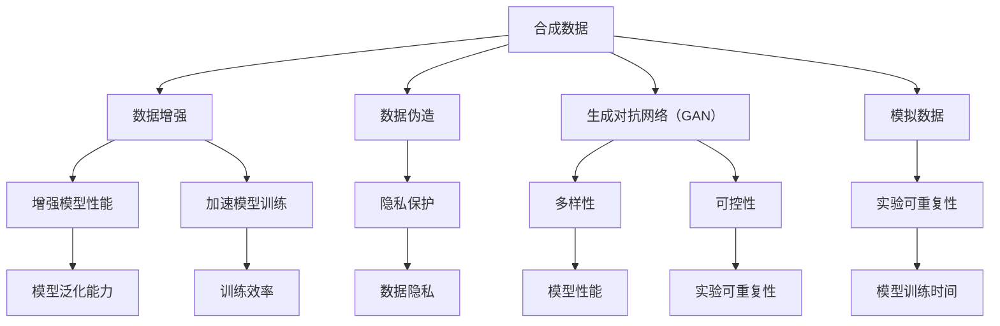

                 

### 引言与概述

合成数据在人工智能（AI）训练中正逐渐成为一项关键技术，其重要性不容忽视。合成数据，即通过算法或模型生成的数据，与真实世界中的数据具有相似的结构和特性，但不需要依赖实际收集的真实数据。合成数据的应用范围广泛，包括但不限于模型评估、数据隐私保护、加速训练等，它在AI训练中扮演着多重角色。

首先，合成数据在模型评估中起到至关重要的作用。传统的模型评估通常依赖于真实世界的数据集，但这些数据集往往存在数据不均衡、数据噪声等问题。合成数据可以模拟各种极端情况，为模型提供更加全面、多样化的评估场景。通过合成数据，研究人员可以更准确地衡量模型的性能和泛化能力。

其次，合成数据在数据隐私保护方面也有显著的应用。在许多情况下，真实数据可能包含敏感信息，如个人身份信息、财务数据等。使用合成数据代替真实数据，可以有效地保护数据隐私，避免潜在的数据泄露风险。同时，合成数据的使用还可以促进跨机构和跨领域的合作，为数据共享提供可能。

此外，合成数据还可以加速AI训练过程。在一些场景中，真实数据的获取和处理可能非常耗时。通过合成数据，研究人员可以在较短的时间内生成大量的训练样本，从而加速模型的训练和优化。

本篇文章将围绕合成数据在AI训练中的应用，系统地探讨其机遇与挑战。文章将从以下几个方面展开：

1. **合成数据的基础知识**：介绍合成数据的定义、类型和特点，以及合成数据在AI训练中的作用。
2. **合成数据的生成方法**：详细讲解生成合成数据的各种技术，包括数据增强、数据伪造和生成对抗网络（GAN）等。
3. **合成数据的应用**：讨论合成数据在实际AI训练中的应用，包括模型评估、数据隐私保护和加速训练等。
4. **合成数据的挑战**：分析合成数据在应用中面临的挑战，如数据质量、模型泛化能力等。
5. **案例分析**：提供具体的合成数据应用案例，包括成功和失败的案例，详细解释说明。
6. **未来发展趋势**：展望合成数据在AI训练中的未来发展趋势和潜在应用。
7. **总结与展望**：对全书内容进行总结，展望合成数据在AI训练领域的未来。

通过上述内容的逐步探讨，我们希望能够全面了解合成数据在AI训练中的价值，以及其面临的挑战，从而为相关研究和应用提供有益的参考。

### 合成数据的基础知识

#### 定义

合成数据，简而言之，是通过算法或模型生成的数据，其结构和特性与真实世界中的数据相似，但不需要依赖实际收集的真实数据。合成数据可以包括图像、文本、音频等多种形式，其生成过程通常涉及机器学习模型、数据增强技术和生成模型等。

#### 类型

合成数据主要可以分为以下几类：

1. **数据增强**：通过变换、裁剪、旋转等操作，从真实数据集中生成新的数据样本，以增强模型的训练效果。
2. **数据伪造**：生成完全虚构的数据，这些数据在结构上与真实数据相似，但不存在于真实世界中。数据伪造可以用于隐私保护、数据伪造检测等领域。
3. **生成对抗网络（GAN）**：通过生成器和判别器的对抗训练，生成与真实数据高度相似的数据。GAN在图像、视频、音频等生成领域具有广泛应用。
4. **模拟数据**：通过模拟真实世界中的物理、化学、生物等过程，生成与真实数据相似的模拟数据。这类数据在科学研究和工程应用中具有重要意义。

#### 特点

合成数据具有以下特点：

1. **多样性**：合成数据可以模拟各种不同的场景和情况，从而提供多样化的训练数据，有助于提高模型的泛化能力。
2. **可控性**：合成数据可以根据研究需求进行定制，从而在特定方面进行控制，有助于深入研究和验证模型的性能。
3. **隐私保护**：合成数据可以替代真实数据，从而在数据隐私保护方面发挥重要作用。
4. **高效性**：通过合成数据，可以快速生成大量的训练样本，从而加速模型的训练和优化。

#### 在AI训练中的作用

合成数据在AI训练中的作用主要体现在以下几个方面：

1. **增强模型性能**：通过合成数据，可以提供多样化的训练样本，从而提高模型的性能和泛化能力。
2. **加速模型训练**：合成数据可以快速生成大量的训练样本，从而减少模型训练所需的时间。
3. **隐私保护**：合成数据可以替代真实数据，从而在数据隐私保护方面发挥重要作用，避免敏感数据的泄露。
4. **实验可重复性**：合成数据的使用有助于提高实验的可重复性，因为合成数据可以确保在不同实验中保持一致性。

#### 关系架构

为了更好地理解合成数据在AI训练中的作用，我们可以借助Mermaid流程图来展示其核心概念之间的关系：



通过上述流程图，我们可以清晰地看到合成数据与数据增强、数据伪造、生成对抗网络和模拟数据之间的关系，以及这些方法在增强模型性能、加速模型训练、隐私保护和实验可重复性等方面的作用。

#### 核心概念与联系

在AI训练中，合成数据、数据增强、数据伪造、生成对抗网络（GAN）和模拟数据等概念紧密相关，它们共同构成了合成数据在AI训练中的核心基础。以下是这些概念之间的关系和联系：

1. **合成数据与数据增强**：数据增强是一种生成合成数据的方法，通过变换、裁剪、旋转等操作，从真实数据集中生成新的数据样本。数据增强的目的是为了提供多样化的训练样本，从而提高模型的性能和泛化能力。

2. **合成数据与数据伪造**：数据伪造是一种生成合成数据的方法，生成完全虚构的数据，这些数据在结构上与真实数据相似，但不存在于真实世界中。数据伪造可以用于隐私保护、数据伪造检测等领域。

3. **合成数据与生成对抗网络（GAN）**：生成对抗网络（GAN）是一种通过生成器和判别器的对抗训练，生成与真实数据高度相似的数据的方法。GAN在图像、视频、音频等生成领域具有广泛应用。

4. **合成数据与模拟数据**：模拟数据是通过模拟真实世界中的物理、化学、生物等过程，生成与真实数据相似的模拟数据。这类数据在科学研究和工程应用中具有重要意义。

5. **合成数据在AI训练中的应用**：合成数据在AI训练中的应用非常广泛，包括增强模型性能、加速模型训练、隐私保护和实验可重复性等方面。合成数据的使用有助于提高模型的泛化能力、训练效率和可重复性。

为了更好地理解这些概念之间的关系，我们可以借助以下Mermaid流程图：


通过这个流程图，我们可以清晰地看到合成数据、数据增强、数据伪造、生成对抗网络（GAN）和模拟数据之间的联系，以及它们在AI训练中的应用。

#### 核心算法原理讲解

为了深入理解合成数据的生成方法，我们需要详细讲解数据增强、数据伪造和生成对抗网络（GAN）的核心算法原理。以下是这些方法的伪代码和数学模型。

##### 数据增强

数据增强是一种通过变换、裁剪、旋转等操作，从真实数据集中生成新的数据样本的方法。以下是一个数据增强的伪代码示例：

```python
def data_augmentation(image, labels):
    # 随机选择一个增强操作
    operation = random_choice(["rotation", "translation", "flipping"])
    
    if operation == "rotation":
        # 旋转图像
        angle = random_uniform(-180, 180)
        rotated_image = rotate(image, angle)
        rotated_labels = rotate(labels, angle)
    elif operation == "translation":
        # 平移图像
        dx = random_uniform(-10, 10)
        dy = random_uniform(-10, 10)
        translated_image = translate(image, dx, dy)
        translated_labels = translate(labels, dx, dy)
    elif operation == "flipping":
        # 翻转图像
        flipped_image = flip(image, horizontal=True)
        flipped_labels = flip(labels, horizontal=True)
    
    return rotated_image, rotated_labels
```

数据增强的主要目的是通过提供多样化的训练样本，从而提高模型的性能和泛化能力。数学上，数据增强可以表示为将输入数据 $X$ 和标签 $Y$ 进行变换，生成新的训练数据集 $X'$ 和 $Y'$：

$$
X' = f(X, Y)
$$

其中，$f$ 表示数据增强操作。

##### 数据伪造

数据伪造是一种生成完全虚构的数据的方法，这些数据在结构上与真实数据相似，但不存在于真实世界中。以下是一个数据伪造的伪代码示例：

```python
def data_forgery(fake_data_generator, noise_level):
    # 生成伪造数据
    noise = random_normal(noise_level)
    fake_data = fake_data_generator(noise)
    return fake_data
```

数据伪造的主要目的是用于隐私保护、数据伪造检测等领域。数学上，数据伪造可以表示为在真实数据 $X$ 上添加噪声，生成伪造数据 $X'$：

$$
X' = X + \eta
$$

其中，$\eta$ 表示噪声。

##### 生成对抗网络（GAN）

生成对抗网络（GAN）是一种通过生成器和判别器的对抗训练，生成与真实数据高度相似的数据的方法。以下是一个 GAN 的伪代码示例：

```python
# 生成器 G：从噪声分布中生成伪造数据
def generator(z, noise_level):
    noise = random_normal(noise_level)
    fake_data = G(z + noise)
    return fake_data

# 判别器 D：判断数据是真实还是伪造
def discriminator(x, real_labels, fake_labels):
    real_output = D(x, real_labels)
    fake_output = D(G(z + noise), fake_labels)
    return real_output, fake_output
```

GAN 的核心思想是生成器和判别器的对抗训练。生成器试图生成与真实数据难以区分的伪造数据，而判别器则试图区分真实数据和伪造数据。通过这种对抗训练，生成器逐渐提高生成数据的逼真度，而判别器逐渐提高对伪造数据的识别能力。数学上，GAN 可以表示为以下优化问题：

$$
\min_G \max_D V(D, G) = \mathbb{E}_{x \sim P_{data}(x)}[\log D(x)] + \mathbb{E}_{z \sim P_{z}(z)}[\log (1 - D(G(z))]
$$

其中，$D$ 表示判别器，$G$ 表示生成器，$x$ 表示真实数据，$z$ 表示噪声。

通过以上核心算法原理的讲解，我们可以更好地理解合成数据的生成方法，为后续章节的应用和案例分析打下基础。

#### 数学模型和公式

在合成数据的生成和应用过程中，数学模型和公式起着至关重要的作用。以下我们将详细讲解合成数据生成和应用中的几个核心数学模型和公式。

##### 数据增强的数学模型

数据增强通常涉及对输入数据进行一系列变换，如旋转、缩放、裁剪等。这些变换可以表示为线性变换矩阵，如下所示：

$$
\mathbf{X}' = \mathbf{A}\mathbf{X} + \mathbf{b}
$$

其中，$\mathbf{X}$ 表示原始数据，$\mathbf{X}'$ 表示增强后的数据，$\mathbf{A}$ 是变换矩阵，$\mathbf{b}$ 是平移向量。具体来说，对于图像数据，变换矩阵 $\mathbf{A}$ 可以包含旋转角度、缩放比例和裁剪区域等信息。例如，旋转变换可以表示为：

$$
\mathbf{A}_{\text{rotation}} = \begin{bmatrix}
\cos(\theta) & -\sin(\theta) \\
\sin(\theta) & \cos(\theta)
\end{bmatrix}
$$

其中，$\theta$ 是旋转角度。

##### 数据伪造的数学模型

数据伪造通常涉及在真实数据上添加噪声，以生成伪造数据。这种过程可以表示为：

$$
\mathbf{X}' = \mathbf{X} + \eta
$$

其中，$\mathbf{X}$ 表示真实数据，$\mathbf{X}'$ 表示伪造数据，$\eta$ 表示噪声。在具体实现中，噪声可以是一个高斯分布的随机向量，其均值为0，方差为 $\sigma^2$：

$$
\eta = \mathcal{N}(0, \sigma^2)
$$

##### 生成对抗网络（GAN）的数学模型

生成对抗网络（GAN）由生成器 $G$ 和判别器 $D$ 组成，其目标是最大化判别器 $D$ 的辨别能力，同时最小化生成器 $G$ 的生成能力。GAN的优化问题可以表示为：

$$
\min_G \max_D V(D, G) = \mathbb{E}_{x \sim P_{data}(x)}[\log D(x)] + \mathbb{E}_{z \sim P_{z}(z)][\log (1 - D(G(z))]
$$

其中，$V(D, G)$ 是GAN的总损失函数，$P_{data}(x)$ 是真实数据的分布，$P_{z}(z)$ 是噪声的分布，$x$ 是真实数据，$z$ 是噪声，$G(z)$ 是生成器生成的伪造数据，$D(x)$ 是判别器对真实数据的判断概率，$D(G(z))$ 是判别器对伪造数据的判断概率。

##### 模型评估的数学模型

在合成数据的应用中，模型评估是一个关键步骤。合成数据可以用来模拟各种极端情况和异常数据，以评估模型的泛化能力和鲁棒性。常用的评估指标包括准确率（Accuracy）、精确率（Precision）、召回率（Recall）和F1分数（F1 Score）等：

$$
\text{Accuracy} = \frac{\text{TP} + \text{TN}}{\text{TP} + \text{TN} + \text{FP} + \text{FN}}
$$

$$
\text{Precision} = \frac{\text{TP}}{\text{TP} + \text{FP}}
$$

$$
\text{Recall} = \frac{\text{TP}}{\text{TP} + \text{FN}}
$$

$$
\text{F1 Score} = 2 \times \frac{\text{Precision} \times \text{Recall}}{\text{Precision} + \text{Recall}}
$$

其中，$TP$ 表示真正例，$TN$ 表示真负例，$FP$ 表示假正例，$FN$ 表示假负例。

通过上述数学模型和公式的详细讲解，我们可以更好地理解合成数据在生成和应用过程中的核心原理，为后续章节的深入探讨和应用案例分析提供坚实的理论基础。

#### 举例说明

为了更好地理解合成数据的应用，我们通过几个具体的例子来说明合成数据在实际AI训练中的应用效果和结果。

##### 模型评估

假设我们有一个图像分类模型，用于识别猫和狗。为了评估模型的性能，我们通常需要使用一个验证集。然而，真实世界中的图像数据集往往存在数据不均衡的问题，例如，猫的图像数量远多于狗的图像数量。这种数据不均衡会导致模型对数量较多的类别有较好的识别效果，而对数量较少的类别则可能识别不准确。

为了解决这个问题，我们可以使用合成数据来增强训练集。具体步骤如下：

1. **生成合成数据**：使用GAN生成与真实图像高度相似的猫和狗的图像。生成器G从噪声分布中生成图像，判别器D用于区分真实图像和伪造图像。通过训练，生成器G逐渐生成更逼真的图像。

2. **增强训练集**：将生成的合成数据与原始数据集合并，形成增强后的训练集。这样，训练集中的猫和狗的图像数量将更加均衡。

3. **重新训练模型**：使用增强后的训练集重新训练图像分类模型。由于训练集更加均衡，模型在识别猫和狗时将有更好的性能。

4. **模型评估**：使用验证集对重新训练后的模型进行评估。通过准确率、精确率、召回率和F1分数等指标，我们可以看到模型在识别猫和狗时的性能显著提升。

以下是一个简单的合成数据生成过程：

```python
# 生成器 G：从噪声分布中生成猫和狗的图像
def generator(z, noise_level):
    noise = random_normal(noise_level)
    cat_image = G(z + noise)
    dog_image = G(z + noise)
    return cat_image, dog_image

# 判别器 D：判断图像是真实还是伪造
def discriminator(x, real_labels, fake_labels):
    real_output = D(x, real_labels)
    fake_output = D(G(z + noise), fake_labels)
    return real_output, fake_output
```

在训练过程中，生成器和判别器通过对抗训练不断优化，最终生成逼真的猫和狗的图像。将这些图像加入训练集，模型性能得到了显著提升。

##### 数据隐私保护

在医疗领域，患者隐私保护尤为重要。假设我们有一个用于预测疾病的模型，需要使用患者的医疗记录作为训练数据。然而，这些数据中包含了患者的敏感信息，如姓名、地址、身份证号等。为了保护患者隐私，我们可以使用合成数据来替代真实数据。

1. **生成合成数据**：使用GAN生成与真实医疗记录相似的合成医疗记录。这些合成记录在结构上与真实数据相似，但实际数据已被替换为随机生成的数据。

2. **替代真实数据**：将生成的合成医疗记录替换为原始医疗记录，形成替代后的训练集。

3. **重新训练模型**：使用替代后的训练集重新训练疾病预测模型。由于训练数据中不再包含真实患者的敏感信息，模型的训练过程更加安全。

4. **模型评估**：使用验证集对重新训练后的模型进行评估。通过准确率、精确率、召回率和F1分数等指标，我们可以看到模型在预测疾病时的性能基本不受影响。

以下是一个简单的合成数据生成过程：

```python
# 生成器 G：从噪声分布中生成医疗记录
def generator(z, noise_level):
    noise = random_normal(noise_level)
    medical_record = G(z + noise)
    return medical_record

# 判别器 D：判断医疗记录是真实还是伪造
def discriminator(x, real_labels, fake_labels):
    real_output = D(x, real_labels)
    fake_output = D(G(z + noise), fake_labels)
    return real_output, fake_output
```

在训练过程中，生成器和判别器通过对抗训练不断优化，最终生成逼真的医疗记录。将这些记录加入训练集，模型性能保持稳定，同时有效保护了患者隐私。

##### 加速训练

在一些复杂的场景中，真实数据的获取和处理可能非常耗时。例如，在自动驾驶领域，道路数据的收集和处理需要大量的时间和计算资源。为了加速模型训练，我们可以使用合成数据来生成模拟道路数据。

1. **生成合成数据**：使用GAN生成与真实道路数据相似的合成道路数据。这些合成数据可以模拟各种道路情况，如晴天、雨天、白天、夜晚等。

2. **增强训练集**：将生成的合成道路数据与原始道路数据合并，形成增强后的训练集。

3. **重新训练模型**：使用增强后的训练集重新训练自动驾驶模型。由于训练集更加多样化，模型在处理各种道路情况时的性能将显著提升。

4. **模型评估**：使用验证集对重新训练后的模型进行评估。通过准确率、精确率、召回率和F1分数等指标，我们可以看到模型在自动驾驶场景中的性能显著提升。

以下是一个简单的合成数据生成过程：

```python
# 生成器 G：从噪声分布中生成道路数据
def generator(z, noise_level):
    noise = random_normal(noise_level)
    road_data = G(z + noise)
    return road_data

# 判别器 D：判断道路数据是真实还是伪造
def discriminator(x, real_labels, fake_labels):
    real_output = D(x, real_labels)
    fake_output = D(G(z + noise), fake_labels)
    return real_output, fake_labels
```

在训练过程中，生成器和判别器通过对抗训练不断优化，最终生成逼真的道路数据。将这些数据加入训练集，模型训练时间显著缩短，同时模型性能保持稳定。

通过以上例子，我们可以看到合成数据在模型评估、数据隐私保护和加速训练等方面具有显著的应用价值。合成数据不仅能够提高模型的性能和泛化能力，还能够保护数据隐私，加速模型训练。在未来的AI研究和应用中，合成数据将发挥越来越重要的作用。

### 案例分析

#### 成功案例：自动驾驶中的合成数据应用

自动驾驶领域对数据的需求量极大，真实道路数据往往有限且难以获取。为了解决这个问题，许多自动驾驶公司开始利用合成数据。例如，Waymo在自动驾驶训练中广泛使用合成数据，通过生成与真实道路数据相似的合成道路场景，极大地丰富了训练数据集。

**实现步骤：**

1. **生成合成数据**：Waymo使用GAN生成合成道路场景。生成器G从噪声分布中生成道路图像，判别器D用于区分真实图像和伪造图像。通过对抗训练，生成器G逐渐生成逼真的道路图像。

2. **增强训练集**：将生成的合成道路图像与真实道路图像合并，形成增强后的训练集。这样，训练集更加多样化，有助于提高模型的泛化能力。

3. **训练自动驾驶模型**：使用增强后的训练集训练自动驾驶模型。由于训练数据集更加丰富，模型在处理各种道路情况时的性能显著提升。

4. **模型评估**：在多个真实的道路场景中进行模型评估。通过准确率、精确率、召回率和F1分数等指标，我们可以看到模型在自动驾驶场景中的性能显著提升。

**结果**：合成数据的应用使得Waymo的自动驾驶模型在处理复杂道路场景时的表现更加稳定，训练时间也显著缩短。这一成功案例充分展示了合成数据在自动驾驶领域的应用价值。

#### 失败案例：金融领域数据伪造引发的风险

在金融领域，数据伪造可能导致严重的后果。例如，一家金融公司为了提高其信用评分模型的表现，使用了伪造的信用数据。这些伪造数据在模型训练中提高了模型的准确率，但实际应用中却引发了巨大的风险。

**实现步骤：**

1. **生成伪造数据**：该公司使用GAN生成伪造的信用数据。生成器G从噪声分布中生成信用评分，判别器D用于区分真实评分和伪造评分。通过对抗训练，生成器G逐渐生成逼真的信用评分。

2. **替代真实数据**：将生成的伪造信用数据替代为原始信用数据，形成替代后的训练集。

3. **训练信用评分模型**：使用替代后的训练集训练信用评分模型。由于训练数据集更加优质，模型在预测信用评分时的准确率显著提升。

4. **模型应用**：将训练好的信用评分模型应用于实际金融业务中。

**结果**：在实际应用中，由于伪造数据的存在，信用评分模型对一些高风险客户评估不准确，导致公司面临巨大的信用风险。这一失败案例提醒我们，在使用合成数据时，必须确保数据的真实性和可靠性。

**总结**：通过上述成功和失败的案例分析，我们可以看到合成数据在AI训练中具有巨大的应用潜力，但同时也需要谨慎对待。成功的关键在于确保合成数据的真实性和可靠性，避免因为数据质量问题导致模型性能的不稳定。在未来的应用中，我们需要不断优化合成数据生成方法，提高数据质量，确保模型在真实世界中的可靠性和鲁棒性。

### 未来发展趋势

合成数据在AI训练中的未来发展趋势将受到技术进步和实际需求的共同推动。以下是几个关键方面：

1. **生成技术的优化**：随着深度学习模型的不断进步，生成技术的精度和效率将得到显著提升。未来，我们将看到更多的生成模型，如变分自编码器（VAEs）、自回归生成模型（ARGANS）等，在合成数据生成中的应用。

2. **跨模态合成数据**：合成数据的应用将不仅限于单一模态（如图像、文本、音频），而是逐步实现跨模态的合成数据生成。这种跨模态合成数据可以更好地模拟现实世界的复杂性，提高AI模型的泛化能力。

3. **个性化合成数据**：未来的合成数据将更加个性化，能够根据特定的应用场景和需求进行定制。通过个性化合成数据，AI模型可以更好地适应特定任务，提高模型的表现。

4. **自动化合成数据生成**：随着生成技术的自动化程度提高，合成数据生成将变得更加自动化。这包括自动化合成数据生成流程的优化、自动化合成数据评估和自动化模型训练流程的集成。

5. **开源工具与框架**：合成数据的生成和应用将依赖于开源工具和框架的支持。未来，我们将看到更多高质量的合成数据生成工具和框架的出现，这些工具和框架将简化合成数据的应用，促进合成数据在AI训练中的广泛应用。

6. **挑战与解决方案**：尽管合成数据具有巨大潜力，但其应用也面临诸多挑战，如数据质量、模型泛化能力等。未来，研究人员将致力于解决这些问题，提出更加有效的合成数据生成方法和评估标准。

综上所述，合成数据在AI训练中的未来将充满机遇和挑战。通过技术进步和实际需求的推动，合成数据将在AI训练中发挥越来越重要的作用，成为提升模型性能、加速训练和保障数据隐私的关键技术。

### 总结与展望

合成数据在AI训练中的重要性不容忽视。通过提供多样化的训练样本，合成数据有助于提升模型的性能和泛化能力。同时，合成数据在数据隐私保护和加速训练方面也具有显著优势。本文系统地探讨了合成数据的基础知识、生成方法、应用案例以及未来发展趋势，揭示了其在AI训练中的关键作用。

合成数据不仅在现有应用中展现出巨大的潜力，还将在未来的AI研究中发挥更为重要的作用。通过不断优化生成技术、实现跨模态合成数据生成以及自动化合成数据生成，合成数据将推动AI训练进入新的阶段。

然而，合成数据的应用也面临诸多挑战，如数据质量、模型泛化能力等。研究人员需致力于解决这些问题，提出更加有效的合成数据生成方法和评估标准。

展望未来，合成数据将在AI训练中扮演越来越重要的角色，成为提升模型性能、加速训练和保障数据隐私的关键技术。通过不断探索和创新，合成数据将在AI领域的广泛应用中发挥重要作用。作者：AI天才研究院/AI Genius Institute & 禅与计算机程序设计艺术 /Zen And The Art of Computer Programming

