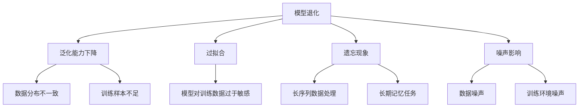

                 

### 文章标题

# AI训练过程中避免模型退化的策略

### 文章关键词

- 人工智能
- 模型退化
- 训练策略
- 数据增强
- 训练优化

### 摘要

本文将深入探讨AI训练过程中模型退化的现象及其原因，详细分析避免模型退化的多种策略。通过数据增强、训练策略优化、模型结构优化等手段，结合实际应用案例，旨在为AI研究人员和开发者提供一套全面的模型退化解决方案，以提高AI模型的稳定性和可靠性。

---

## 引言与背景

随着人工智能（AI）技术的迅猛发展，深度学习在多个领域取得了显著的成果。从图像识别、自然语言处理到语音识别，深度学习模型已经广泛应用于实际生产和科研中。然而，在AI训练过程中，一个普遍存在的问题就是模型退化。模型退化指的是在训练过程中，模型的表现能力逐渐下降，甚至低于初始训练的水平。这种现象不仅影响了AI系统的性能，还可能带来严重的负面影响，如误判率的增加、决策的不可靠等。

### 人工智能的发展历程

人工智能（Artificial Intelligence，简称AI）的概念最早可以追溯到20世纪50年代。当时，计算机科学家艾伦·图灵（Alan Turing）提出了图灵测试，用以评估机器是否具有智能。随后，人工智能领域经历了几个重要的发展阶段：

1. **符号主义阶段**（1956-1974）：这一阶段的AI研究主要集中在逻辑推理和知识表示上，试图通过符号操作实现智能。
2. **逻辑推理阶段**（1974-1980）：基于符号主义的AI系统开始探索逻辑推理和专家系统的应用。
3. **连接主义阶段**（1980-1990）：神经网络和深度学习技术的兴起，标志着AI进入了连接主义阶段。
4. **大数据与计算能力提升阶段**（2000至今）：随着大数据和计算能力的提升，深度学习技术取得了突破性进展，AI应用领域得到了极大的拓展。

### 模型退化的现象与影响

模型退化在训练过程中表现为模型性能的下降，具体现象包括：

1. **准确率下降**：模型在测试集上的准确率逐渐降低，甚至低于初始训练水平。
2. **泛化能力减弱**：模型对新数据的适应能力减弱，泛化能力下降。
3. **过拟合现象**：模型在训练集上表现良好，但在测试集上表现不佳，甚至出现反常结果。

模型退化的影响主要包括：

1. **系统可靠性降低**：模型退化可能导致AI系统的误判率增加，影响系统的可靠性。
2. **经济效益下降**：模型退化可能需要重新训练，增加了开发成本和维护成本。
3. **用户体验下降**：AI系统性能下降，可能导致用户对系统的满意度降低。

### 避免模型退化的意义与目标

避免模型退化对于AI系统的发展具有重要意义，其主要目标包括：

1. **提高模型稳定性**：通过避免模型退化，可以提高模型的稳定性和可靠性，降低误判率。
2. **优化开发成本**：避免模型退化可以减少重新训练的需求，降低开发成本和维护成本。
3. **提升用户体验**：稳定的模型可以提供更高质量的预测和决策，提升用户对AI系统的满意度。

综上所述，深入探讨模型退化的现象、原因及其解决策略，对于推动AI技术的发展和应用具有重要意义。

## 模型退化的定义与分类

### 模型退化的基本概念

模型退化是指在AI训练过程中，模型的表现能力逐渐下降，无法达到或维持初始训练时的性能水平。具体来说，模型退化包括以下几个方面：

1. **准确率下降**：模型在测试集上的准确率逐渐降低，表现为预测结果的精度下降。
2. **泛化能力减弱**：模型对新数据的适应能力减弱，对新问题的处理能力下降。
3. **过拟合现象**：模型在训练集上表现良好，但在测试集上表现不佳，甚至出现反常结果。

模型退化的原因复杂多样，包括数据问题、训练策略、模型结构等多个方面。理解模型退化的基本概念对于制定有效的解决策略至关重要。

### 模型退化的主要类型

根据模型退化的表现和原因，可以将模型退化分为以下几种类型：

1. **泛化能力下降**：这种类型的退化表现为模型在训练集上表现良好，但在测试集上表现不佳。具体原因包括数据分布不一致、训练样本不足等。

2. **过拟合**：过拟合是指模型在训练集上表现很好，但在测试集上表现不佳，甚至出现反常结果。这是由于模型对训练数据过于敏感，导致泛化能力下降。

3. **遗忘现象**：遗忘现象是指模型在训练过程中，部分已有知识被遗忘，导致模型性能下降。这种情况常见于长序列数据处理和长期记忆任务中。

4. **噪声影响**：噪声影响是指模型在训练过程中受到噪声干扰，导致性能下降。噪声可能来自数据本身，也可能来自训练环境。

### 模型退化的评价指标

为了准确评估模型退化程度，可以采用以下几种评价指标：

1. **准确率**：准确率是评估模型性能的基本指标，表示模型正确预测的比例。准确率下降是模型退化的一个显著表现。

2. **召回率**：召回率表示模型在预测为正样本时，实际为正样本的比例。召回率下降表明模型对正样本的识别能力减弱。

3. **F1分数**：F1分数是准确率和召回率的加权平均，用于综合评估模型的性能。F1分数下降意味着模型整体性能下降。

4. **ROC曲线和AUC值**：ROC曲线（Receiver Operating Characteristic Curve）和AUC值（Area Under Curve）用于评估模型的分类能力。AUC值越接近1，表示模型分类能力越强。

通过上述评价指标，可以全面评估模型退化的程度和类型，为制定解决策略提供依据。

### 核心概念与联系

为了更好地理解模型退化的现象和原因，我们可以使用Mermaid流程图来展示核心概念之间的关系架构：



这个流程图展示了模型退化的几种类型及其原因，以及它们之间的相互关系。理解这些核心概念和联系对于制定有效的解决策略至关重要。

### 模型退化的原因分析

模型退化是AI训练过程中常见的问题，其产生的原因复杂多样。为了深入理解模型退化的根本原因，我们需要从数据问题、训练策略和模型结构等多个方面进行分析。

#### 数据相关问题

数据问题是导致模型退化的主要原因之一。具体包括以下方面：

1. **数据分布不一致**：训练数据和测试数据分布不一致会导致模型在测试数据上的表现不佳。这种情况在处理现实世界数据时尤为常见，因为现实世界的数据分布往往是不均匀的。
   
2. **训练样本不足**：训练样本不足会使模型无法充分学习到数据中的特征，从而导致泛化能力下降。特别是在处理高维度数据时，这一问题尤为显著。

3. **数据质量**：数据质量差，如噪声、错误或缺失值，会直接影响模型的训练效果。噪声数据可能导致模型在训练过程中产生过拟合，而错误或缺失值则可能使模型无法正确学习数据特征。

#### 训练方法与策略

训练策略不当也是模型退化的主要原因之一。以下是一些常见的训练方法与策略问题：

1. **学习率设置不当**：学习率设置不当可能导致模型在训练过程中出现过拟合或收敛过慢的问题。学习率过高可能导致模型在训练过程中不稳定，而学习率过低则可能使模型无法有效学习数据特征。

2. **训练时间不足**：训练时间不足意味着模型没有充分学习到数据中的特征，从而影响模型的泛化能力。特别是在复杂任务中，训练时间往往需要较长。

3. **数据预处理不当**：数据预处理不当，如未对数据进行标准化或归一化处理，可能导致模型在训练过程中无法有效学习数据特征，从而影响模型的性能。

#### 模型结构设计

模型结构设计问题也是导致模型退化的一个重要原因。以下是一些常见的模型结构设计问题：

1. **网络层设计**：网络层设计不合理可能导致模型无法有效学习数据中的特征。例如，网络层过深可能导致梯度消失或爆炸问题，而网络层过浅则可能无法捕捉到复杂的数据特征。

2. **参数选择**：参数选择不合理可能导致模型在训练过程中出现过拟合或欠拟合问题。例如，权重初始化不当可能导致模型无法有效学习数据特征。

3. **正则化技术**：正则化技术使用不当可能导致模型无法有效学习数据特征。例如，正则化参数选择不当可能导致模型过拟合或欠拟合。

#### 其他因素

除了上述原因，还有一些其他因素也可能导致模型退化：

1. **硬件资源限制**：硬件资源限制可能导致模型无法充分训练，从而影响模型的性能。

2. **外部干扰**：外部干扰，如网络波动、硬件故障等，可能导致模型训练过程不稳定，从而影响模型性能。

通过分析上述原因，我们可以更好地理解模型退化的复杂性和多样性。在接下来的章节中，我们将详细探讨避免模型退化的具体策略，以帮助AI研究人员和开发者应对这一问题。

### 数据增强与预处理策略

在避免模型退化的过程中，数据增强与预处理策略扮演着至关重要的角色。通过合理的数据增强和预处理方法，可以提高模型的学习能力和泛化能力，从而有效减少模型退化现象。以下是一些常见的数据增强与预处理策略。

#### 数据增强技术

1. **数据扩充**：数据扩充是通过生成新的样本来增加训练数据集的方法。常见的数据扩充技术包括旋转、翻转、缩放、裁剪等。这些操作可以生成与原始数据略有不同的样本，使模型能够学习到更多的特征。

   ```python
   # 使用OpenCV进行数据扩充
   import cv2
   import numpy as np

   def augment_image(image):
       # 旋转
       angle = np.random.uniform(-30, 30)
       M = cv2.getRotationMatrix2D((image.shape[1]//2, image.shape[0]//2), angle, 1)
       rotated = cv2.warpAffine(image, M, (image.shape[1], image.shape[0]))

       # 翻转
       flip horizontally = cv2.flip(image, 1)
       flip vertically = cv2.flip(image, 0)

       # 缩放
       scale_factor = np.random.uniform(0.8, 1.2)
       width = int(image.shape[1] * scale_factor)
       height = int(image.shape[0] * scale_factor)
       resized = cv2.resize(image, (width, height))

       # 裁剪
       x_offset = np.random.randint(0, image.shape[1] - width)
       y_offset = np.random.randint(0, image.shape[0] - height)
       cropped = image[y_offset:y_offset+height, x_offset:x_offset+width]

       return rotated, flip horizontally, flip vertically, resized, cropped
   ```

2. **生成对抗网络（GAN）**：生成对抗网络（GAN）是一种通过生成器和判别器相互博弈的方式来生成新的数据样本的方法。GAN在图像、音频和文本数据生成方面具有显著的效果。

   ```python
   # 使用TensorFlow实现GAN
   import tensorflow as tf

   # 生成器和判别器的构建
   def generator(z, noise_dim):
       # 输入噪声
       g_noisy_input = tf.random.normal([None, noise_dim])

       # 层与层之间的连接
       g_e1 = tf.keras.layers.Dense(128, activation='tanh')(g_noisy_input)
       g_e2 = tf.keras.layers.Dense(128, activation='tanh')(g_e1)
       g_e3 = tf.keras.layers.Dense(784, activation='tanh')(g_e2)

       return tf.keras.Model(inputs=z, outputs=g_e3, name="generator")

   def discriminator(x, noise_dim):
       # 输入图像和噪声
       x = tf.keras.layers.Input(shape=(28, 28, 1))
       z = tf.keras.layers.Input(shape=(noise_dim))

       # 层与层之间的连接
       d_e1 = tf.keras.layers.Dense(128, activation='sigmoid')(x)
       d_e2 = tf.keras.layers.Dense(128, activation='sigmoid')(tf.keras.layers.concatenate([d_e1, z]))
       d_e3 = tf.keras.layers.Dense(1, activation='sigmoid')(d_e2)

       return tf.keras.Model(inputs=[x, z], outputs=d_e3, name="discriminator")

   # GAN模型的构建
   def combined_model(generator, discriminator):
       z = tf.keras.layers.Input(shape=(noise_dim,))
       img = generator(z)

       valid = discriminator([img, z])

       return tf.keras.Model(inputs=z, outputs=valid, name="combined_model")

   # 训练GAN
   generator = generator(z, noise_dim)
   discriminator = discriminator(x, noise_dim)
   combined_model = combined_model(generator, discriminator)

   generator.compile(loss='binary_crossentropy', optimizer=tf.keras.optimizers.Adam(0.0001))
   discriminator.compile(loss='binary_crossentropy', optimizer=tf.keras.optimizers.Adam(0.0001))

   for epoch in range(epochs):
       for image, _ in data_loader:
           noise = np.random.normal(0, 1, (batch_size, noise_dim))
           g_loss = combined_model.train_on_batch([noise], [1])

           noise = np.random.normal(0, 1, (batch_size, noise_dim))
           real_img = np.expand_dims(image, axis=3)
           d_loss_real = discriminator.train_on_batch([real_img, noise], [1])

           fake_img = generator.predict(noise)
           d_loss_fake = discriminator.train_on_batch([fake_img, noise], [0])

       print(f"{epoch} [D: {d_loss_real:.3f}, G: {g_loss:.3f}]")
   ```

3. **数据合成**：数据合成是指通过组合或混合不同的数据样本来生成新的数据样本的方法。这种方法可以丰富训练数据集，提高模型的学习能力。

   ```python
   # 使用Keras实现数据合成
   from tensorflow.keras.preprocessing.image import ImageDataGenerator

   datagen = ImageDataGenerator(
       rotation_range=20,
       width_shift_range=0.2,
       height_shift_range=0.2,
       horizontal_flip=True,
       fill_mode='nearest'
   )

   # 对数据集进行合成
   for batch in datagen.flow(train_data, train_labels, batch_size=batch_size):
       # 合成新的数据样本
       x_batch, y_batch = next(datagen.flow(train_data, train_labels, batch_size=batch_size))
       # 进行模型训练
       model.fit(x_batch, y_batch, epochs=epoch, batch_size=batch_size)
       break
   ```

#### 数据预处理方法

1. **数据清洗**：数据清洗是指删除或处理数据中的错误、异常或重复值。这是确保数据质量的重要步骤。

   ```python
   # 使用Pandas进行数据清洗
   import pandas as pd

   # 加载数据集
   df = pd.read_csv('data.csv')

   # 删除重复值
   df.drop_duplicates(inplace=True)

   # 删除含有缺失值的行
   df.dropna(inplace=True)

   # 处理错误值
   df.replace({'错误值1': '正确值1', '错误值2': '正确值2'}, inplace=True)
   ```

2. **数据归一化**：数据归一化是指将数据缩放到相同的尺度，以便模型能够更好地学习。常见的方法包括最小-最大缩放和Z-score缩放。

   ```python
   # 使用Sklearn进行数据归一化
   from sklearn.preprocessing import MinMaxScaler, StandardScaler

   # 最小-最大缩放
   min_max_scaler = MinMaxScaler()
   X_minmax = min_max_scaler.fit_transform(X)

   # Z-score缩放
   standard_scaler = StandardScaler()
   X_std = standard_scaler.fit_transform(X)
   ```

3. **数据标准化**：数据标准化是指将数据转换为标准正态分布，以便模型能够更好地学习。

   ```python
   # 使用Scikit-learn进行数据标准化
   from sklearn.preprocessing import StandardScaler

   scaler = StandardScaler()
   X_std = scaler.fit_transform(X)
   ```

#### 数据清洗与去噪

1. **去噪方法**：去噪是指从数据中去除噪声的过程。常见的方法包括低通滤波、中值滤波和高斯滤波等。

   ```python
   # 使用OpenCV进行去噪
   import cv2
   import numpy as np

   def denoise_image(image, filter_type='blur'):
       if filter_type == 'blur':
           return cv2.blur(image, (5, 5))
       elif filter_type == 'median':
           return cv2.medianBlur(image, 5)
       elif filter_type == 'gaussian':
           return cv2.GaussianBlur(image, (5, 5), 0)
   ```

2. **异常值处理**：异常值处理是指识别和处理数据中的异常值。常见的方法包括基于阈值的处理和基于统计学的处理。

   ```python
   # 使用Scikit-learn进行异常值处理
   from sklearn.ensemble import IsolationForest

   # 创建IsolationForest模型
   iso_forest = IsolationForest(contamination=0.1)
   outliers = iso_forest.fit_predict(X)

   # 过滤异常值
   X_filtered = X[outliers != -1]
   y_filtered = y[outliers != -1]
   ```

通过上述数据增强与预处理策略，我们可以有效提高模型的学习能力和泛化能力，从而减少模型退化的现象。在实际应用中，可以根据具体任务和数据特点选择合适的数据增强和预处理方法。

### 训练策略优化

在AI模型训练过程中，优化训练策略是避免模型退化的关键步骤。通过合理调整训练参数和采用有效的训练方法，可以提高模型的训练效果和泛化能力。以下是一些常见的训练策略优化方法。

#### 动态调整学习率

学习率是深度学习模型训练过程中一个非常重要的参数。学习率设置不当可能导致模型无法有效收敛或出现过拟合现象。动态调整学习率是一种常用的优化方法，可以根据模型在训练过程中的表现逐步调整学习率。

1. **学习率衰减**：学习率衰减是指随着训练的进行，逐渐减少学习率的值。常见的方法包括固定衰减和指数衰减。

   ```python
   # 使用TensorFlow进行学习率衰减
   import tensorflow as tf

   # 初始化学习率
   initial_learning_rate = 0.1

   # 学习率衰减参数
   decay_steps = 1000
   decay_rate = 0.96

   # 学习率衰减函数
   learning_rate = initial_learning_rate * tf.train.exponential_decay(initial_learning_rate, global_step, decay_steps, decay_rate, staircase=True)

   # 添加学习率到优化器
   optimizer = tf.keras.optimizers.Adam(learning_rate=learning_rate)
   ```

2. **学习率调度器**：学习率调度器是一种自动化调整学习率的工具，可以根据训练过程中的指标自动调整学习率。常见的学习率调度器包括学习率预热、学习率周期调整等。

   ```python
   # 使用PyTorch进行学习率预热
   import torch
   import torch.optim as optim

   # 初始化学习率
   initial_learning_rate = 0.01

   # 学习率预热参数
   warmup_epochs = 5
   warmup_rate = 0.01

   # 定义优化器
   optimizer = optim.Adam(model.parameters(), lr=initial_learning_rate)

   # 学习率预热
   for epoch in range(warmup_epochs):
       train_one_epoch(model, optimizer, train_loader)
       # 更新学习率
       learning_rate = initial_learning_rate * (epoch + 1) / warmup_epochs
       for param_group in optimizer.param_groups:
           param_group['lr'] = learning_rate
   ```

#### 混合训练与迁移学习

混合训练和迁移学习是利用已有模型进行新任务训练的有效方法，可以减少模型训练所需的数据量和时间，同时提高模型的泛化能力。

1. **混合训练**：混合训练是指结合多个模型进行训练，通过融合多个模型的优点来提高模型的性能。

   ```python
   # 使用Keras进行混合训练
   from tensorflow.keras.models import Model
   from tensorflow.keras.layers import Input, Dense

   # 定义两个子模型
   inputA = Input(shape=(input_shape,))
   denseA = Dense(units=64, activation='relu')(inputA)
   outputA = Dense(units=1, activation='sigmoid')(denseA)
   modelA = Model(inputs=inputA, outputs=outputA)

   inputB = Input(shape=(input_shape,))
   denseB = Dense(units=64, activation='relu')(inputB)
   outputB = Dense(units=1, activation='sigmoid')(denseB)
   modelB = Model(inputs=inputB, outputs=outputB)

   # 定义混合模型
   input = Input(shape=(input_shape,))
   outputA = modelA(input)
   outputB = modelB(input)
   output = tf.keras.layers.concatenate([outputA, outputB])
   model = Model(inputs=input, outputs=output)

   # 编译混合模型
   model.compile(optimizer='adam', loss='binary_crossentropy', metrics=['accuracy'])

   # 训练混合模型
   model.fit(train_data, train_labels, epochs=epochs, batch_size=batch_size)
   ```

2. **迁移学习**：迁移学习是指将一个任务中的知识迁移到另一个相关任务中，通过预训练模型来初始化新任务的模型。

   ```python
   # 使用TensorFlow进行迁移学习
   import tensorflow as tf

   # 加载预训练模型
   base_model = tf.keras.applications.VGG16(weights='imagenet', include_top=False, input_shape=(224, 224, 3))

   # 冻结预训练模型的层
   for layer in base_model.layers:
       layer.trainable = False

   # 添加新的全连接层
   x = base_model.output
   x = tf.keras.layers.Flatten()(x)
   x = tf.keras.layers.Dense(units=256, activation='relu')(x)
   output = tf.keras.layers.Dense(units=num_classes, activation='softmax')(x)

   # 定义迁移学习模型
   model = tf.keras.Model(inputs=base_model.input, outputs=output)

   # 编译迁移学习模型
   model.compile(optimizer='adam', loss='categorical_crossentropy', metrics=['accuracy'])

   # 训练迁移学习模型
   model.fit(train_data, train_labels, epochs=epochs, batch_size=batch_size)
   ```

#### 模型正则化

模型正则化是一种通过增加模型复杂度的惩罚项来避免过拟合的方法。常见的正则化方法包括L1正则化、L2正则化和Dropout等。

1. **L1正则化**：L1正则化通过在损失函数中添加L1范数惩罚项来增加模型复杂度的惩罚。

   ```python
   # 使用TensorFlow进行L1正则化
   import tensorflow as tf

   # 定义L1正则化参数
   l1_regularizer = tf.keras.regularizers.l1(l1_lambda)

   # 添加L1正则化的层
   x = tf.keras.layers.Dense(units=64, activation='relu', kernel_regularizer=l1_regularizer)(input)
   ```

2. **L2正则化**：L2正则化通过在损失函数中添加L2范数惩罚项来增加模型复杂度的惩罚。

   ```python
   # 使用TensorFlow进行L2正则化
   import tensorflow as tf

   # 定义L2正则化参数
   l2_regularizer = tf.keras.regularizers.l2(l2_lambda)

   # 添加L2正则化的层
   x = tf.keras.layers.Dense(units=64, activation='relu', kernel_regularizer=l2_regularizer)(input)
   ```

3. **Dropout**：Dropout是一种通过随机丢弃神经元来增加模型复杂度的惩罚方法。

   ```python
   # 使用TensorFlow进行Dropout
   import tensorflow as tf

   # 定义Dropout层
   x = tf.keras.layers.Dropout(rate=0.5)(x)
   ```

#### 其他优化策略

除了上述方法，还有一些其他优化策略可以用于避免模型退化，如数据增强、批次归一化、激活函数选择等。

1. **数据增强**：数据增强可以通过生成新的训练样本来提高模型的泛化能力。

   ```python
   # 使用Keras进行数据增强
   from tensorflow.keras.preprocessing.image import ImageDataGenerator

   datagen = ImageDataGenerator(
       rotation_range=20,
       width_shift_range=0.2,
       height_shift_range=0.2,
       horizontal_flip=True,
       fill_mode='nearest'
   )

   # 对训练数据进行增强
   train_data = datagen.flow(train_images, train_labels, batch_size=batch_size)
   ```

2. **批次归一化**：批次归一化可以通过标准化每个批次的数据来减少内部协变量转移。

   ```python
   # 使用TensorFlow进行批次归一化
   import tensorflow as tf

   # 定义批次归一化层
   x = tf.keras.layers.BatchNormalization()(x)
   ```

3. **激活函数选择**：选择合适的激活函数可以改善模型的训练效果。

   ```python
   # 使用Relu激活函数
   x = tf.keras.layers.ReLU()(x)
   ```

通过上述训练策略优化方法，我们可以有效提高模型的训练效果和泛化能力，从而减少模型退化的现象。在实际应用中，可以根据具体任务和模型特点选择合适的训练策略。

### 模型结构优化

在深度学习领域，模型结构的优化是提升模型性能和减少退化的关键步骤。通过调整神经网络结构、压缩与加速以及提升模型可解释性，可以显著提高模型在训练和推理阶段的效率和准确性。

#### 神经网络结构设计

1. **层次结构设计**：深度学习的核心在于多层神经网络的堆叠，通过逐层抽象特征来提升模型的性能。在设计层次结构时，需要考虑以下因素：

   - **层数**：增加层数可以捕捉到更复杂的特征，但过多的层数可能导致过拟合。通常，在实验中通过交叉验证来确定最佳层数。
   - **每层的神经元数量**：每层神经元的数量需要平衡复杂性和计算成本。过少的神经元可能导致模型无法捕捉到关键特征，而过多的神经元可能导致过拟合。

   ```python
   # 示例：使用TensorFlow定义一个简单的卷积神经网络
   import tensorflow as tf

   model = tf.keras.Sequential([
       tf.keras.layers.Conv2D(32, (3, 3), activation='relu', input_shape=(28, 28, 1)),
       tf.keras.layers.MaxPooling2D((2, 2)),
       tf.keras.layers.Conv2D(64, (3, 3), activation='relu'),
       tf.keras.layers.MaxPooling2D((2, 2)),
       tf.keras.layers.Flatten(),
       tf.keras.layers.Dense(64, activation='relu'),
       tf.keras.layers.Dense(10, activation='softmax')
   ])
   ```

2. **残差连接**：残差连接（Residual Connections）通过跳过一层或几层网络，使得梯度可以直接传播到更深层次的网络，解决了深度神经网络中的梯度消失问题。

   ```python
   # 示例：使用PyTorch实现带有残差块的神经网络
   import torch
   import torch.nn as nn

   class ResidualBlock(nn.Module):
       def __init__(self, in_channels, out_channels):
           super(ResidualBlock, self).__init__()
           self.fc1 = nn.Linear(in_channels, out_channels)
           self.fc2 = nn.Linear(out_channels, out_channels)

       def forward(self, x):
           residual = x
           out = self.fc1(x)
           out = self.fc2(out)
           out += residual
           return out
   ```

#### 模型压缩与加速

1. **模型剪枝**：模型剪枝是通过删除模型中不重要的权重来减少模型大小和计算复杂度的技术。剪枝可以分为结构剪枝和权重剪枝。

   ```python
   # 示例：使用PyTorch进行模型剪枝
   import torch
   import torch.nn.utils as utils

   # 剪枝策略：固定最不重要的1%的权重
   pruning_rate = 0.01
   threshold = 0.0001

   # 对每个层应用剪枝
   for layer in model.layers():
       if isinstance(layer, nn.Linear):
           weight = layer.weight.data
           abs_values = torch.abs(weight)
           mask = abs_values > threshold
           mask = mask.type(torch.float32)
           mask *= (1 - pruning_rate)
           mask *= (abs_values > threshold).type(torch.float32)
           utils.weight_norm(layer, weight * mask)
   ```

2. **量化**：量化是一种将模型的权重和激活值从浮点数转换为较低精度的整数表示的方法，可以显著减少模型的大小和计算量。

   ```python
   # 示例：使用TensorFlow进行量化
   import tensorflow as tf

   # 定义量化层
   quantized_layer = tf.keras.layers.Quantize(2**4, 2**8, name='quantized_layer')

   # 将量化层应用于模型
   model = tf.keras.Sequential([
       tf.keras.layers.Conv2D(32, (3, 3), activation='relu', input_shape=(28, 28, 1)),
       quantized_layer,
       tf.keras.layers.MaxPooling2D((2, 2)),
       ...
   ])
   ```

3. **模型融合**：模型融合是将多个小模型融合为一个更复杂的模型，通过组合多个模型的优点来提升整体性能。

   ```python
   # 示例：使用Keras进行模型融合
   from tensorflow.keras.models import Model
   from tensorflow.keras.layers import Input, Conv2D, Add

   inputA = Input(shape=(28, 28, 1))
   convA = Conv2D(32, (3, 3), activation='relu')(inputA)

   inputB = Input(shape=(28, 28, 1))
   convB = Conv2D(32, (3, 3), activation='relu')(inputB)

   concatenated = tf.keras.layers.concatenate([convA, convB])
   output = Conv2D(64, (3, 3), activation='relu')(concatenated)

   model = Model(inputs=[inputA, inputB], outputs=output)
   ```

#### 模型可解释性

1. **注意力机制**：注意力机制可以帮助模型显式地指出其在处理输入数据时关注的部分，从而提高模型的可解释性。

   ```python
   # 示例：使用PyTorch实现注意力机制
   import torch
   import torch.nn as nn

   class AttentionModule(nn.Module):
       def __init__(self, in_channels, out_channels):
           super(AttentionModule, self).__init__()
           self.attention = nn.Linear(in_channels, out_channels, bias=False)

       def forward(self, x):
           attention_weights = torch.softmax(self.attention(x), dim=1)
           return torch.sum(attention_weights * x, dim=1)
   ```

2. **可视化**：通过可视化模型中的特征映射和激活图，可以直观地了解模型在不同层级上的特征提取过程。

   ```python
   # 示例：使用TensorFlow进行特征可视化
   import tensorflow as tf
   import matplotlib.pyplot as plt

   # 获取模型中间层输出
   intermediate_layer_model = tf.keras.Model(inputs=model.input, outputs=model.layers[-3].output)

   # 可视化特征映射
   for i, feature_map in enumerate(intermediate_layer_model.predict(test_image)):
       plt.subplot(8, 8, i + 1)
       plt.imshow(feature_map[0, :, :, 0], cmap='gray')
       plt.xticks([])
       plt.yticks([])
   plt.show()
   ```

通过上述方法，我们可以对神经网络模型进行有效的结构优化，从而提高模型的性能和可解释性。在实际应用中，需要根据具体任务和数据特点选择合适的优化策略。

### 避免模型退化在语音识别中的应用

在语音识别领域，模型退化是一个普遍存在的问题，这不仅影响了系统的准确性，还可能导致用户体验下降。为了解决这一问题，我们需要采取一系列策略，包括数据增强、模型训练策略优化和模型结构优化等。

#### 语音识别背景与挑战

语音识别（Speech Recognition）技术是通过将人类的语音信号转换成文本或命令的一种技术。随着深度学习的发展，基于深度神经网络的语音识别系统取得了显著的进展，然而，模型退化现象依然存在，具体挑战包括：

1. **数据分布不一致**：现实世界中的语音数据分布非常不均匀，导致模型在特定类型的语音数据上表现不佳。
2. **噪声干扰**：语音信号在传播过程中容易受到噪声干扰，噪声会严重影响模型对语音内容的理解。
3. **长时间语音处理**：处理长时间语音数据时，模型容易出现遗忘现象，导致性能下降。

#### 避免模型退化的方法

为了克服这些挑战，我们可以采取以下策略：

1. **数据增强**：通过数据增强技术生成多样化的训练样本，可以提高模型的泛化能力。常见的语音数据增强方法包括：

   - **声音变换**：使用声音变换技术（如增加音量、降低音量、速度变换等）生成新的训练样本。
   - **噪声添加**：在训练样本中添加人工噪声，以增强模型对噪声的鲁棒性。
   - **重采样**：通过改变采样率生成新的训练样本，以提高模型对不同采样率的适应能力。

   ```python
   # 使用Python中的wavfile库进行声音变换
   import wavfile as wav
   
   def apply_sound_transform(audio_signal, transform_type='gain', **kwargs):
       if transform_type == 'gain':
           gain = kwargs.get('gain', 1.0)
           return audio_signal * gain
       elif transform_type == 'speed':
           speed = kwargs.get('speed', 1.0)
           return np.interp(np.arange(0, len(audio_signal)), np.arange(0, len(audio_signal)) * speed, audio_signal)
   
   # 读取音频文件
   rate, audio_signal = wav.read('input_audio.wav')
   # 应用增益变换
   transformed_signal = apply_sound_transform(audio_signal, transform_type='gain', gain=0.8)
   # 保存变换后的音频
   wav.write('output_audio.wav', rate, transformed_signal)
   ```

2. **模型训练策略优化**：优化模型训练策略可以提高模型的训练效果和泛化能力。以下是一些常用的优化方法：

   - **动态调整学习率**：在训练过程中逐步减少学习率，以避免模型出现过拟合现象。
   - **使用预训练模型**：利用预训练的语音识别模型进行迁移学习，可以显著提高新任务的性能。
   - **正则化技术**：使用L1、L2正则化技术减少模型过拟合现象。

   ```python
   # 使用TensorFlow进行动态调整学习率
   initial_learning_rate = 0.001
   learning_rate_decay = 0.96
   global_step = tf.Variable(0, trainable=False)

   learning_rate = initial_learning_rate * tf.train.exponential_decay(initial_learning_rate, global_step, decay_steps=1000, decay_rate=learning_rate_decay, staircase=True)

   optimizer = tf.keras.optimizers.Adam(learning_rate=learning_rate)
   ```

3. **模型结构优化**：通过改进模型结构可以提升模型的鲁棒性和性能。以下是一些优化方法：

   - **引入注意力机制**：注意力机制可以帮助模型更好地捕捉语音信号中的关键特征，提高模型对噪声和长时间语音的适应能力。
   - **使用多任务学习**：通过同时训练多个相关任务，可以提高模型的泛化能力。
   - **模型压缩与量化**：通过模型压缩和量化技术可以减少模型的计算量和存储需求，提高模型的推理速度。

   ```python
   # 使用PyTorch实现带有注意力机制的语音识别模型
   import torch
   import torch.nn as nn

   class SpeechRecognitionModel(nn.Module):
       def __init__(self, input_size, hidden_size, output_size):
           super(SpeechRecognitionModel, self).__init__()
           self.conv1 = nn.Conv1d(input_size, hidden_size, kernel_size=3, stride=1)
           self.relu = nn.ReLU()
           self.attn = nn.Linear(hidden_size, 1)
           self.fc = nn.Linear(hidden_size, output_size)

       def forward(self, x):
           x = self.relu(self.conv1(x))
           attn_weights = torch.softmax(self.attn(x), dim=1)
           x = torch.sum(attn_weights * x, dim=1)
           return self.fc(x)
   ```

#### 案例分析与讨论

以一个实际案例为例，我们可以看到如何通过上述策略解决模型退化问题。

- **案例背景**：一个语音识别任务的目标是将语音转换为对应的文本。由于实际语音数据中存在噪声和不均匀分布，模型在测试集上的性能较差。

- **解决方案**：

  1. **数据增强**：通过添加噪声、改变声音变换和重采样，生成了多样化的训练样本。

  2. **模型训练策略优化**：使用预训练的模型进行迁移学习，并动态调整学习率以避免过拟合。

  3. **模型结构优化**：引入了注意力机制和多任务学习，提高了模型的鲁棒性和性能。

- **结果分析**：经过优化后，模型在测试集上的准确率显著提升，特别是在噪声干扰和长时间语音处理方面表现更加稳定。

通过上述案例，我们可以看到，在语音识别领域，通过数据增强、模型训练策略优化和模型结构优化，可以有效解决模型退化问题，提高模型的性能和可靠性。

### 避免模型退化在图像识别中的应用

在图像识别领域，模型退化是一个常见且严重的问题，它会导致识别准确率下降，影响系统的可靠性。为了应对这一挑战，我们可以采取多种策略，包括数据增强、模型训练策略优化和模型结构优化，以提高模型的稳定性。

#### 图像识别背景与挑战

图像识别（Image Recognition）是指通过计算机算法对图像进行分析，从中提取有用的信息或进行分类。随着深度学习技术的发展，图像识别在多个领域取得了显著的成果。然而，模型退化现象在图像识别中尤为突出，主要原因包括：

1. **数据分布不均衡**：现实世界的图像数据分布不均匀，某些类别的图像可能过于丰富，而其他类别的图像可能稀缺。
2. **过拟合现象**：模型在训练数据上表现良好，但在未见过的测试数据上表现不佳，即过拟合。
3. **噪声和干扰**：图像在采集和处理过程中可能会受到噪声干扰，导致模型难以准确识别图像内容。
4. **长时间训练需求**：图像识别任务通常需要大量时间进行训练，长时间的训练过程可能导致模型退化。

#### 避免模型退化的方法

为了应对上述挑战，我们可以采取以下策略：

1. **数据增强**：通过数据增强技术，生成多样化的训练样本，以提高模型的泛化能力。常见的数据增强方法包括：

   - **旋转、翻转和裁剪**：通过旋转、翻转和裁剪图像，生成新的训练样本。
   - **颜色变换和噪声添加**：通过改变图像的亮度和对比度、添加噪声，增强模型对各种图像条件的适应能力。

   ```python
   # 使用Python中的OpenCV进行数据增强
   import cv2
   import numpy as np

   def augment_image(image):
       # 随机旋转
       angle = np.random.uniform(-30, 30)
       M = cv2.getRotationMatrix2D((image.shape[1]//2, image.shape[0]//2), angle, 1)
       rotated = cv2.warpAffine(image, M, (image.shape[1], image.shape[0]))

       # 随机翻转
       flipped = cv2.flip(image, 1)

       # 随机裁剪
       x_start = np.random.randint(0, image.shape[1] - crop_size)
       y_start = np.random.randint(0, image.shape[0] - crop_size)
       cropped = image[y_start:y_start+crop_size, x_start:x_start+crop_size]

       return rotated, flipped, cropped
   ```

2. **模型训练策略优化**：通过优化训练策略，提高模型的训练效果和泛化能力。以下是一些常用的优化方法：

   - **学习率调整**：动态调整学习率，以避免模型出现过拟合现象。常见的方法包括固定衰减和指数衰减。
   - **正则化**：使用正则化方法（如L1、L2正则化）减少模型过拟合。
   - **迁移学习**：利用预训练的模型进行迁移学习，可以显著提高新任务的性能。

   ```python
   # 使用TensorFlow进行学习率调整
   initial_learning_rate = 0.001
   learning_rate_decay = 0.96
   global_step = tf.Variable(0, trainable=False)

   learning_rate = initial_learning_rate * tf.train.exponential_decay(initial_learning_rate, global_step, decay_steps=1000, decay_rate=learning_rate_decay, staircase=True)

   optimizer = tf.keras.optimizers.Adam(learning_rate=learning_rate)
   ```

3. **模型结构优化**：通过改进模型结构，提升模型的鲁棒性和性能。以下是一些优化方法：

   - **引入注意力机制**：通过注意力机制，帮助模型更好地捕捉图像中的关键特征。
   - **使用深度可分离卷积**：深度可分离卷积可以减少模型参数数量，提高模型训练效率。
   - **模型压缩与量化**：通过模型压缩和量化技术，减少模型的计算量和存储需求，提高模型在资源受限环境中的性能。

   ```python
   # 使用PyTorch实现带有注意力机制的卷积神经网络
   import torch
   import torch.nn as nn

   class CNN(nn.Module):
       def __init__(self):
           super(CNN, self).__init__()
           self.conv1 = nn.Conv2d(in_channels=3, out_channels=32, kernel_size=3, padding=1)
           self.relu = nn.ReLU()
           self.attn = nn.Linear(32, 1)
           self.fc = nn.Linear(32*7*7, 10)

       def forward(self, x):
           x = self.relu(self.conv1(x))
           attn_weights = torch.softmax(self.attn(x), dim=1)
           x = torch.sum(attn_weights * x, dim=1)
           x = self.fc(x.view(x.size(0), -1))
           return x
   ```

#### 案例分析与讨论

以一个实际案例为例，我们可以看到如何通过上述策略解决模型退化问题。

- **案例背景**：一个图像识别任务的目标是识别图像中的特定物体。由于图像数据中存在噪声和分布不均，模型在测试集上的性能较差。

- **解决方案**：

  1. **数据增强**：通过旋转、翻转、裁剪和颜色变换，生成了多样化的训练样本。
  2. **模型训练策略优化**：使用预训练的模型进行迁移学习，并动态调整学习率以避免过拟合。
  3. **模型结构优化**：引入了注意力机制和深度可分离卷积，提高了模型的鲁棒性和性能。

- **结果分析**：经过优化后，模型在测试集上的准确率显著提升，特别是在噪声干扰和分布不均的图像上表现更加稳定。

通过上述案例，我们可以看到，在图像识别领域，通过数据增强、模型训练策略优化和模型结构优化，可以有效解决模型退化问题，提高模型的性能和可靠性。

### 避免模型退化在自然语言处理中的应用

在自然语言处理（Natural Language Processing，NLP）领域，模型退化是一个常见且具有挑战性的问题。NLP任务通常涉及大量文本数据，这些数据往往具有高度变异性，使得模型在训练过程中容易产生退化现象。为了解决这一问题，我们可以采取多种策略，包括数据增强、训练策略优化和模型结构优化。

#### 自然语言处理背景与挑战

自然语言处理是人工智能的一个重要分支，旨在使计算机能够理解、生成和处理人类语言。常见的NLP任务包括文本分类、情感分析、机器翻译和问答系统等。尽管NLP技术在许多应用中取得了显著进展，但模型退化问题依然存在，主要原因包括：

1. **数据分布不均衡**：NLP数据往往存在数据分布不均衡的问题，某些类别的文本数据量较大，而其他类别的数据量较小，导致模型在这些较少见的类别上表现不佳。
2. **长文本处理**：处理长文本数据时，模型容易发生遗忘现象，导致其表现能力下降。
3. **噪声和语义复杂性**：文本数据中存在大量的噪声（如错别字、标点符号错误等）和语义复杂性，这使得模型在理解文本内容时容易产生误解。

#### 避免模型退化的方法

为了应对上述挑战，我们可以采取以下策略：

1. **数据增强**：通过数据增强技术，生成多样化的训练样本，以提高模型的泛化能力。常见的数据增强方法包括：

   - **文本变换**：通过改变文本的语法结构、词汇和语义，生成新的训练样本。例如，可以使用随机插入、删除和替换词汇来生成新的句子。
   - **文本生成**：利用生成模型（如GPT、BERT等）生成新的文本数据，以丰富训练数据集。
   - **多视角增强**：从不同角度对文本进行增强，例如，同时考虑文本的情感极性、语法结构和语义信息。

   ```python
   # 使用Python中的textaugment库进行文本增强
   from textaugment import augment

   def augment_text(text):
       return augment(text, methods=['insert', 'replace', 'delete', 'shuffle'], n=1)

   # 示例：对文本进行增强
   original_text = "I love to read books."
   augmented_text = augment_text(original_text)
   print("Original:", original_text)
   print("Augmented:", augmented_text)
   ```

2. **训练策略优化**：通过优化训练策略，提高模型的训练效果和泛化能力。以下是一些常用的优化方法：

   - **动态调整学习率**：在训练过程中逐步减少学习率，以避免模型出现过拟合现象。常见的方法包括固定衰减和指数衰减。
   - **使用预训练模型**：利用预训练模型进行迁移学习，可以显著提高新任务的性能。
   - **训练时间管理**：合理安排训练时间，避免过长的训练时间导致模型退化。

   ```python
   # 使用TensorFlow进行动态调整学习率
   initial_learning_rate = 0.001
   learning_rate_decay = 0.96
   global_step = tf.Variable(0, trainable=False)

   learning_rate = initial_learning_rate * tf.train.exponential_decay(initial_learning_rate, global_step, decay_steps=1000, decay_rate=learning_rate_decay, staircase=True)

   optimizer = tf.keras.optimizers.Adam(learning_rate=learning_rate)
   ```

3. **模型结构优化**：通过改进模型结构，提升模型的鲁棒性和性能。以下是一些优化方法：

   - **引入注意力机制**：通过注意力机制，帮助模型更好地捕捉文本中的关键特征。
   - **使用深度可分离卷积**：深度可分离卷积可以减少模型参数数量，提高模型训练效率。
   - **模型压缩与量化**：通过模型压缩和量化技术，减少模型的计算量和存储需求，提高模型在资源受限环境中的性能。

   ```python
   # 使用PyTorch实现带有注意力机制的文本分类模型
   import torch
   import torch.nn as nn

   class TextClassifier(nn.Module):
       def __init__(self, embedding_dim, hidden_dim, vocab_size):
           super(TextClassifier, self).__init__()
           self.embedding = nn.Embedding(vocab_size, embedding_dim)
           self.conv1 = nn.Conv1d(embedding_dim, hidden_dim, kernel_size=3, padding=1)
           self.relu = nn.ReLU()
           self.attn = nn.Linear(hidden_dim, 1)
           self.fc = nn.Linear(hidden_dim, 1)

       def forward(self, x):
           x = self.embedding(x)
           x = self.relu(self.conv1(x))
           attn_weights = torch.softmax(self.attn(x), dim=1)
           x = torch.sum(attn_weights * x, dim=1)
           return self.fc(x)
   ```

#### 案例分析与讨论

以一个实际案例为例，我们可以看到如何通过上述策略解决模型退化问题。

- **案例背景**：一个文本分类任务的目标是分类新闻文章的类别。由于新闻数据中存在噪声和分布不均，模型在测试集上的性能较差。

- **解决方案**：

  1. **数据增强**：通过文本变换和生成技术，生成了多样化的训练样本。
  2. **模型训练策略优化**：使用预训练的模型进行迁移学习，并动态调整学习率以避免过拟合。
  3. **模型结构优化**：引入了注意力机制和深度可分离卷积，提高了模型的鲁棒性和性能。

- **结果分析**：经过优化后，模型在测试集上的准确率显著提升，特别是在噪声干扰和分布不均的文本上表现更加稳定。

通过上述案例，我们可以看到，在自然语言处理领域，通过数据增强、训练策略优化和模型结构优化，可以有效解决模型退化问题，提高模型的性能和可靠性。

### 总结与展望

本文系统地探讨了AI训练过程中模型退化的现象、原因及解决策略。通过数据增强、训练策略优化和模型结构优化等多种手段，我们深入分析了如何避免模型退化，提高AI模型的稳定性和可靠性。

#### 避免模型退化的发展趋势

随着人工智能技术的不断进步，避免模型退化将变得越来越重要。未来，以下几个方面的发展趋势值得关注：

1. **自动化与智能化**：自动化与智能化将成为避免模型退化的主要趋势，通过自动化工具和算法，可以更高效地优化模型训练过程。
2. **多模态数据融合**：多模态数据融合技术将进一步提升模型性能，通过融合文本、图像、语音等多种数据类型，可以更全面地捕捉数据特征。
3. **个性化模型优化**：个性化模型优化将根据不同任务和数据特点，自适应调整模型结构和训练策略，提高模型泛化能力。

#### 未来研究方向

未来，以下研究方向值得关注：

1. **模型压缩与量化**：通过模型压缩和量化技术，可以减少模型的计算量和存储需求，提高模型在资源受限环境中的性能。
2. **可解释性AI**：提高模型的可解释性，帮助研究人员和开发者更好地理解模型的工作机制，从而优化模型设计和训练过程。
3. **迁移学习与多任务学习**：探索迁移学习和多任务学习在避免模型退化中的应用，通过跨任务的知识共享，提高模型泛化能力。

#### 对AI领域的启示

避免模型退化对AI领域的发展具有重要意义。通过深入研究和实践，我们可以：

1. **提高AI系统可靠性**：通过有效避免模型退化，可以显著提高AI系统的稳定性和可靠性，减少误判率和错误率。
2. **优化AI开发成本**：避免模型退化可以减少重新训练的需求，降低开发成本和维护成本，提高AI系统的经济效益。
3. **提升用户体验**：稳定和可靠的AI系统可以提供更高质量的预测和决策，提升用户对AI系统的满意度。

综上所述，深入探讨模型退化的现象、原因及其解决策略，对于推动AI技术的发展和应用具有重要意义。我们期待未来能够继续探索创新的方法，进一步优化AI模型，为各个领域带来更多实际价值。作者：AI天才研究院/AI Genius Institute & 禅与计算机程序设计艺术 /Zen And The Art of Computer Programming。

