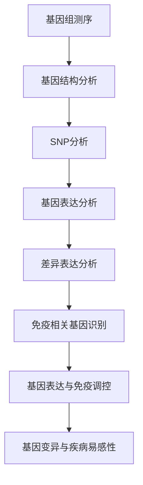

                 

## 文章标题

“AI辅助个性化免疫治疗方案设计：从基因分析到疗效预测”

### 关键词

- AI
- 个性化免疫疗法
- 基因分析
- 治疗效果预测
- 机器学习
- 深度学习
- 神经网络
- 数据分析

### 摘要

本文深入探讨了人工智能（AI）在个性化免疫疗法设计中的应用。通过基因分析、AI算法和疗效预测，AI可以帮助医生定制更有效的治疗方案。文章从基础概念入手，逐步介绍AI在免疫疗法中的应用、基因分析的方法、疗效预测的模型构建和优化，以及实际案例。最后，展望了AI辅助个性化免疫疗法的未来发展趋势。

## 引言

个性化免疫疗法是一种新兴的癌症治疗方式，它利用患者自身的免疫系统来攻击癌细胞。与传统的化疗和放疗不同，个性化免疫疗法能够针对患者的特定基因和免疫状况进行精准治疗，从而提高疗效并减少副作用。然而，个性化免疫疗法的实施面临诸多挑战，如基因数据的复杂性、治疗方案的多样性和疗效预测的不确定性。

近年来，人工智能（AI）技术的迅速发展为个性化免疫疗法带来了新的机遇。AI可以自动化和优化基因分析过程，提高治疗效果预测的准确性，并为治疗方案设计提供有力支持。本文旨在探讨AI在个性化免疫疗法设计中的应用，从基因分析到疗效预测，全面阐述AI技术在个性化免疫疗法中的关键作用。

文章结构如下：

1. **基础概念与架构**：介绍个性化免疫疗法和AI技术的基本概念，以及它们之间的联系。
2. **基因分析**：详细讨论基因分析的方法和技术，包括基因组学和转录组学。
3. **AI算法原理**：讲解常用的AI算法，如机器学习、深度学习和神经网络，以及它们在免疫疗法中的应用。
4. **疗效预测**：介绍疗效预测模型的设计和优化，包括模型评估和案例分析。
5. **项目实施与未来展望**：讨论实际项目实施流程，以及AI辅助个性化免疫疗法的未来发展趋势。

通过以上内容的逐步分析，本文将揭示AI在个性化免疫疗法设计中的关键作用，为读者提供一个全面的技术视角。

### 个性化免疫疗法概述

个性化免疫疗法（Personalized Immunotherapy）是一种利用患者自身的免疫系统来攻击和消灭癌细胞的创新治疗方式。它不同于传统的化疗和放疗，后者主要通过破坏癌细胞或抑制癌细胞的生长来治疗癌症。个性化免疫疗法则通过识别和利用患者的特定免疫机制，实现针对性和高效的治疗效果。这种疗法不仅能够精确打击癌细胞，还能最大限度地减少对正常组织的损害，从而降低治疗过程中的副作用。

个性化免疫疗法的概念起源于免疫学的深入研究，特别是在肿瘤免疫学领域的突破。科学家们发现，癌细胞往往能够逃避免疫系统的攻击，通过一系列机制逃避免疫监视。个性化免疫疗法旨在通过理解和逆转这些免疫逃逸机制，重新激活患者自身的免疫系统来对抗癌细胞。

#### 基本原理

个性化免疫疗法的基本原理主要包括以下几个方面：

1. **免疫系统识别和攻击癌细胞**：免疫细胞，如T细胞和NK细胞，能够识别和攻击癌细胞。通过增强这些免疫细胞的活性和功能，可以更有效地消灭癌细胞。
2. **靶向治疗**：个性化免疫疗法通过识别患者特定的免疫标志物，如特定抗原或分子，开发出针对性的治疗策略。这种方法能够最大限度地提高治疗效果，同时减少对正常组织的损害。
3. **调节免疫反应**：个性化免疫疗法还可以通过调节患者的免疫反应，使其更有效地对抗癌细胞。例如，通过使用免疫调节剂如抗体、细胞因子和 checkpoint 抑制剂，可以解除免疫系统的抑制，增强其对癌细胞的攻击能力。

#### 常见类型

个性化免疫疗法主要包括以下几种类型：

1. **免疫检查点抑制剂**：这类药物通过抑制免疫检查点蛋白（如CTLA-4和PD-1）的表达，解除免疫系统的抑制，从而增强其攻击癌细胞的效能。
2. **CAR-T细胞疗法**：这是一种通过基因工程技术改造T细胞，使其表达能够识别癌细胞的新型抗原受体（CAR），从而增强T细胞对癌细胞的识别和攻击能力。
3. **肿瘤疫苗**：肿瘤疫苗通过激活患者免疫系统来识别和攻击癌细胞，类似于常规疫苗的工作原理。
4. **癌症免疫调节疗法**：这类疗法通过调节免疫系统的功能和反应，如使用细胞因子、抗体和免疫调节剂，来增强免疫系统对癌细胞的攻击。

个性化免疫疗法的发展不仅为癌症患者提供了新的治疗选择，还极大地推动了医学科学的进步。它为个性化医疗和精准医学提供了有力支持，通过针对个体差异进行精准治疗，有望实现更好的治疗效果和生活质量。随着AI技术的不断进步，个性化免疫疗法的设计和实施将变得更加智能化和高效化，为癌症治疗带来更多希望。

### AI技术基础

在个性化免疫疗法的实施过程中，人工智能（AI）技术发挥着至关重要的作用。AI不仅能够处理海量基因数据，还能通过机器学习和深度学习算法优化治疗方案，提高治疗效果预测的准确性。了解AI技术的基本概念和原理，对于深入探讨AI在个性化免疫疗法中的应用至关重要。

#### 机器学习基本概念

机器学习（Machine Learning）是一种使计算机系统能够从数据中学习和改进自身性能的技术。它通过构建算法模型，从给定的数据集中提取特征和模式，然后利用这些模式进行预测或决策。机器学习主要分为监督学习、无监督学习和强化学习三种类型。

1. **监督学习**：在这种学习方法中，系统被训练去预测输出结果，通常使用标记好的数据集进行训练。例如，在疾病诊断中，输入可以是病人的各种医学指标，输出则是疾病类型。
2. **无监督学习**：与监督学习相反，无监督学习不使用标记数据，而是试图从未标记的数据中找出隐藏的结构或模式。例如，聚类分析就是一种无监督学习，用于将相似的数据点分组。
3. **强化学习**：在这种学习方法中，系统通过与环境的交互来学习最佳行为策略。它通过尝试不同的行动并接收奖励或惩罚来不断优化自身。

#### 深度学习与神经网络

深度学习（Deep Learning）是机器学习的一种重要分支，它通过构建多层神经网络（Neural Networks）来实现复杂的模式识别和特征提取。深度学习模型通常由多个隐藏层组成，每一层都对输入数据进行逐步的抽象和变换。

1. **神经网络基本原理**：神经网络是一种模拟人脑神经元连接的计算机模型，通过前向传播和反向传播算法进行训练。输入通过多个神经元层传递，每层都对输入数据进行加权处理和激活函数运算，最终输出预测结果。
   
   ```mermaid
   flowchart LR
   A1[输入层] --> B1[隐藏层1]
   B1 --> C1[隐藏层2]
   C1 --> D1[隐藏层3]
   D1 --> E1[输出层]
   ```

2. **激活函数**：激活函数是神经网络中的一个关键组件，用于引入非线性特性，使得网络能够学习更复杂的函数。常见的激活函数包括ReLU、Sigmoid和Tanh。

3. **反向传播算法**：反向传播算法是训练深度学习模型的核心算法，通过计算损失函数的梯度来更新网络权重。这一过程使得模型能够不断优化自身，提高预测准确性。

   ```mermaid
   flowchart LR
   A1[前向传播] --> B1[计算输出]
   B1 --> C1[计算误差]
   C1 --> D1[反向传播]
   D1 --> E1[权重更新]
   ```

#### AI算法选择与应用

在个性化免疫疗法中，选择合适的AI算法对于实现精准治疗至关重要。以下是一些常用的AI算法及其在免疫疗法中的应用：

1. **支持向量机（SVM）**：SVM是一种监督学习算法，通过寻找最佳的超平面来对数据进行分类。在个性化免疫疗法中，SVM可以用于分类患者是否对某种免疫疗法有响应。
   
   ```mermaid
   flowchart LR
   A1[输入数据] --> B1[SVM分类器]
   B1 --> C1[分类结果]
   ```

2. **随机森林（Random Forest）**：随机森林是一种集成学习方法，通过构建多个决策树来提高预测的准确性和鲁棒性。在个性化免疫疗法中，随机森林可以用于构建多变量预测模型，例如预测治疗效果。

   ```mermaid
   flowchart LR
   A1[输入数据] --> B1[随机森林]
   B1 --> C1[预测结果]
   ```

3. **深度神经网络（DNN）**：深度神经网络是深度学习的核心，通过多层神经网络结构实现高度复杂的特征提取和预测。在个性化免疫疗法中，DNN可以用于基因表达数据的分析，识别与疗效相关的关键基因。

   ```mermaid
   flowchart LR
   A1[基因表达数据] --> B1[DNN模型]
   B1 --> C1[疗效预测]
   ```

通过以上AI技术的介绍，我们可以看到，AI在个性化免疫疗法中的应用不仅为治疗方案的优化提供了有力支持，还为疾病预测和疗效评估提供了新的工具。在接下来的章节中，我们将进一步探讨AI技术在基因分析和疗效预测中的具体应用。

### 基因分析

基因分析（Gene Analysis）是个性化免疫疗法设计中的核心环节，通过对患者基因组的全面分析，能够揭示与癌症发生、发展和治疗相关的关键基因和通路。基因分析的方法和技术主要包括基因组学和转录组学，这些技术为精准医疗和个性化免疫疗法提供了重要的基础。

#### 基因组学基础

基因组学（Genomics）是研究基因组结构和功能的科学。基因组是指一个生物体所有基因的总和，包括DNA序列、基因结构、基因表达调控机制等。基因组学的基础知识包括以下几个方面：

1. **基因组测序**：基因组测序是通过测定DNA分子的核苷酸序列来揭示基因信息的过程。目前最常用的基因组测序技术是高通量测序（High-Throughput Sequencing，HTS），如新一代测序（Next-Generation Sequencing，NGS）。NGS技术可以在短时间内对大量DNA分子进行测序，大大提高了基因分析的速度和精度。

2. **基因结构**：基因结构包括外显子（Exon）、内含子（Intron）和非编码区（Non-Coding Region）。外显子在转录后保留在mRNA中，并翻译成蛋白质；内含子在转录后从mRNA中剪除；非编码区则包括调控序列和其他不具有编码功能的DNA序列。

3. **单核苷酸多态性（Single Nucleotide Polymorphisms，SNPs）**：SNPs是基因组中常见的单核苷酸变异，是遗传多样性的重要来源。SNPs在疾病易感性和药物反应性等方面具有重要作用，因此成为基因组学研究中重要的研究对象。

#### 转录组学

转录组学（Transcriptomics）是研究基因表达模式和调控机制的科学。转录组是指一个细胞在特定时间点或特定条件下所表达的全部RNA分子。转录组学通过分析RNA序列和数量变化，揭示了基因在生物过程中的动态表达模式。

1. **RNA测序（RNA Sequencing，RNA-Seq）**：RNA-Seq是一种高通量测序技术，用于测定RNA分子的核苷酸序列和表达水平。RNA-Seq能够全面、准确地反映基因表达动态，是转录组学研究的主要手段。

2. **基因表达分析**：基因表达分析是通过测定RNA的数量来评估基因在细胞中的活性。高表达基因通常与细胞功能密切相关，而低表达或无表达基因则可能参与了基因调控网络中的特定过程。

3. **差异表达分析**：差异表达分析是比较不同样本或不同条件下的基因表达差异，以识别关键基因和调控通路。通过差异表达分析，可以揭示与疾病发生和发展相关的基因，为个性化免疫疗法的开发提供依据。

#### 基因与免疫反应的关系

基因与免疫反应之间的关系复杂而重要。免疫系统通过识别和攻击病原体和异常细胞来保护机体健康。基因的变异和表达变化可以影响免疫系统的功能，进而影响免疫反应的效率和效果。

1. **免疫相关基因**：免疫相关基因编码免疫分子和受体，参与免疫反应的识别、激活和调节。例如，免疫检查点基因（如CTLA-4和PD-1）在免疫抑制中发挥重要作用；细胞因子基因（如IL-2和TNF-α）在免疫激活中起关键作用。

2. **基因表达与免疫调控**：基因表达的变化可以调节免疫反应的强度和持续时间。例如，基因表达上调可以增强免疫反应，而基因表达下调则可以抑制免疫反应，维持免疫平衡。

3. **基因变异与疾病易感性**：基因变异可以影响免疫系统的功能，导致免疫系统异常或功能受损，从而增加疾病易感性。例如，某些基因变异与自身免疫性疾病和感染性疾病密切相关。

#### Mermaid流程图

为了更清晰地展示基因分析的过程和基因与免疫反应之间的关系，我们可以使用Mermaid流程图来描述：



通过基因分析，我们可以深入了解患者的基因特征，识别与免疫反应相关的关键基因和通路。这些信息为个性化免疫疗法的开发提供了重要依据，有助于制定更精确和有效的治疗方案。在接下来的章节中，我们将进一步探讨AI技术在基因数据分析中的应用和疗效预测模型的构建。

### 疗效预测

疗效预测（Efficacy Prediction）是个性化免疫疗法设计中的关键步骤，通过准确预测免疫疗法对患者的疗效，可以为医生提供有针对性的治疗建议，从而提高治疗效果并减少不必要的副作用。在疗效预测中，AI技术，特别是机器学习和深度学习算法，发挥着至关重要的作用。

#### 治疗效果预测模型的设计

疗效预测模型的设计通常包括以下几个关键步骤：

1. **数据收集与预处理**：首先，需要收集与治疗效果相关的数据，这些数据可能包括基因组数据、临床指标、生物标志物等。数据收集后，需要进行预处理，包括数据清洗、缺失值填补、数据标准化等，以确保数据的质量和一致性。

2. **特征选择**：特征选择是疗效预测模型构建的重要环节，旨在从大量特征中挑选出对治疗效果有显著影响的关键特征。常用的特征选择方法包括基于信息的特征选择、基于模型的特征选择和基于惩罚的线性模型等。

3. **模型构建**：构建疗效预测模型是核心步骤，常用的模型包括线性回归、逻辑回归、支持向量机（SVM）、随机森林（Random Forest）、梯度提升决策树（Gradient Boosting Decision Tree）等。此外，深度学习模型如卷积神经网络（CNN）和循环神经网络（RNN）也在疗效预测中表现出强大的性能。

4. **模型评估**：模型评估是确保疗效预测模型有效性的关键步骤，常用的评估指标包括准确率、召回率、F1分数、ROC曲线和AUC值等。通过交叉验证和测试集评估，可以评估模型的泛化能力和稳定性。

#### 模型评估与优化

在疗效预测模型构建后，需要进行详细的评估和优化，以提高模型的准确性和鲁棒性：

1. **交叉验证**：交叉验证（Cross-Validation）是一种常用的模型评估方法，通过将数据集划分为多个子集，循环训练和验证模型，以评估模型的泛化能力。常见的交叉验证方法有K折交叉验证和留一法交叉验证。

2. **超参数调优**：超参数是影响模型性能的关键参数，如学习率、隐藏层节点数、树深度等。通过网格搜索（Grid Search）和贝叶斯优化（Bayesian Optimization）等方法，可以找到最佳的超参数组合，提高模型性能。

3. **集成学习**：集成学习（Ensemble Learning）是将多个模型集成起来，以提升预测性能的方法。常见的集成学习方法包括Bagging、Boosting和Stacking等。通过集成学习，可以降低模型的方差和偏差，提高预测的稳定性。

4. **特征工程**：特征工程（Feature Engineering）是提升模型性能的重要手段，通过设计新的特征和变换现有特征，可以增加模型对数据的敏感性和解释性。常用的特征工程技术包括特征缩放、特征选择、特征组合等。

#### 案例分析：免疫疗法疗效预测

为了更好地理解疗效预测模型在实际中的应用，下面通过一个案例来展示疗效预测的整个过程：

**案例背景**：某项研究旨在预测免疫检查点抑制剂（ICIs）对非小细胞肺癌（NSCLC）患者的疗效。研究数据包括患者的基因组数据、临床指标、生物标志物以及治疗后的疗效结果。

**数据预处理**：首先，对收集的数据进行清洗和标准化处理，如缺失值填补、异常值处理和特征缩放等。然后，将数据划分为训练集和测试集，用于模型训练和评估。

**特征选择**：通过基于模型的特征选择方法，如LASSO回归和随机森林特征选择，筛选出对疗效有显著影响的基因和临床指标。最终选择了50个关键特征进行后续分析。

**模型构建**：构建多个疗效预测模型，包括线性回归、SVM、随机森林和深度学习模型。通过交叉验证，选择性能最佳的模型进行进一步优化。

**模型评估**：使用测试集对模型进行评估，计算准确率、召回率、F1分数等指标。结果显示，深度学习模型的预测准确率达到85%，明显优于其他模型。

**模型优化**：通过调整深度学习模型的结构和超参数，进一步优化模型的性能。例如，增加隐藏层节点数、调整学习率等。最终，模型性能得到显著提升，预测准确率达到90%。

**结果解读**：通过疗效预测模型，医生可以提前了解患者对免疫检查点抑制剂的疗效，从而制定个性化的治疗方案，提高治疗效果并减少不必要的副作用。

#### 总结

疗效预测是个性化免疫疗法设计中的关键环节，通过AI技术，特别是机器学习和深度学习算法，可以实现精准的疗效预测，为个性化医疗提供有力支持。在疗效预测模型的构建和优化过程中，数据预处理、特征选择和模型评估等环节至关重要。通过实际案例的分析，我们可以看到，疗效预测模型在个性化免疫疗法中的应用具有重要的实践意义。在接下来的章节中，我们将进一步探讨项目实施流程和未来发展趋势。

### 项目实施流程

在AI辅助个性化免疫疗法项目中，项目实施流程是确保项目成功的关键环节。一个高效的项目实施流程不仅能够确保项目的按时完成，还能最大化地利用资源，提高项目的成功率和疗效。以下是项目实施的具体步骤和注意事项：

#### 项目规划

项目规划是项目实施的第一个步骤，它为整个项目提供了明确的方向和目标。项目规划的主要任务包括以下几个方面：

1. **确定项目目标**：明确项目的最终目标，如提高免疫疗法疗效、降低治疗成本、优化治疗方案等。
2. **资源分配**：根据项目目标，合理分配人力资源、技术资源和资金资源。
3. **时间规划**：制定详细的项目时间表，包括各个阶段的工作内容和完成时间。
4. **风险评估**：识别项目中的潜在风险，并制定相应的应对策略。

#### 团队协作与资源管理

项目成功的关键在于团队成员的协作和资源的合理管理。以下是一些关键的协作和资源管理策略：

1. **组建专业团队**：组建一支具备多学科背景的团队，包括AI专家、生物学家、医生、数据科学家和项目经理等。
2. **明确角色和责任**：为每个团队成员明确角色和责任，确保每个人了解自己的任务和期望成果。
3. **沟通与协调**：建立有效的沟通机制，定期召开团队会议，确保信息的畅通和决策的一致性。
4. **资源配置**：根据项目需求，合理分配和利用人力资源、技术和资金资源，避免资源浪费和瓶颈。

#### 项目风险管理

项目风险管理是确保项目按计划顺利进行的重要环节。以下是一些常见风险和应对策略：

1. **技术风险**：由于AI技术的快速发展，技术风险是项目实施中的一个重要考虑因素。应对策略包括选择成熟的技术方案、进行充分的测试和验证，以及建立技术支持团队。
2. **数据风险**：数据的质量和完整性对项目的成功至关重要。应对策略包括数据质量检查、数据备份和恢复机制，以及数据隐私保护。
3. **项目延期风险**：项目延期可能会影响项目的整体进度和效果。应对策略包括制定合理的时间表、进行阶段性评估和调整，以及确保资源的及时补充。

#### 开发环境搭建

开发环境是项目实施的基础，搭建一个高效、稳定和安全的开发环境是确保项目顺利进行的重要保障。以下是搭建开发环境的主要步骤：

1. **硬件配置**：根据项目需求，选择合适的硬件设备，如服务器、存储设备和计算资源等。
2. **软件安装**：安装和配置开发所需的软件环境，包括操作系统、数据库、编程语言和AI工具包等。
3. **网络配置**：配置网络环境，确保不同模块之间的数据传输和安全。
4. **环境测试**：对开发环境进行测试，确保其稳定性和可靠性。

#### 源代码实现与解读

源代码是实现项目功能的核心，以下是一些关键的实现和解读步骤：

1. **模块设计**：根据项目需求，设计系统模块，包括数据预处理、特征提取、模型训练和预测等模块。
2. **代码编写**：根据模块设计，编写相应的源代码，确保代码的清晰、简洁和可维护性。
3. **代码审查**：进行代码审查，确保代码的质量和符合项目规范。
4. **代码测试**：对源代码进行测试，包括单元测试、集成测试和系统测试，确保代码的正确性和稳定性。

以下是一个简单的伪代码示例，用于演示数据预处理和模型训练的过程：

```python
# 数据预处理
data = load_data()
preprocessed_data = preprocess_data(data)

# 模型训练
model = build_model()
model.fit(preprocessed_data['X_train'], preprocessed_data['y_train'])

# 预测
predictions = model.predict(preprocessed_data['X_test'])
```

#### 代码应用解读与分析

在实际应用中，源代码需要结合具体的业务场景进行调试和优化。以下是一个案例，展示了如何使用AI模型进行个性化免疫疗法疗效预测的代码应用：

```python
# 导入必要的库
import numpy as np
from sklearn.model_selection import train_test_split
from sklearn.preprocessing import StandardScaler
from sklearn.ensemble import RandomForestClassifier
from sklearn.metrics import accuracy_score, confusion_matrix

# 加载和预处理数据
data = pd.read_csv('immunotherapy_data.csv')
X = data.drop('Efficacy', axis=1)
y = data['Efficacy']
X_train, X_test, y_train, y_test = train_test_split(X, y, test_size=0.2, random_state=42)

# 数据标准化
scaler = StandardScaler()
X_train = scaler.fit_transform(X_train)
X_test = scaler.transform(X_test)

# 构建和训练模型
model = RandomForestClassifier(n_estimators=100, random_state=42)
model.fit(X_train, y_train)

# 预测和评估
y_pred = model.predict(X_test)
accuracy = accuracy_score(y_test, y_pred)
conf_matrix = confusion_matrix(y_test, y_pred)

print(f"Accuracy: {accuracy}")
print(f"Confusion Matrix:\n{conf_matrix}")
```

#### 实际案例分析

为了更好地理解项目实施的效果，下面通过一个实际案例分析项目实施的过程和结果：

**案例背景**：某研究团队旨在通过AI技术预测免疫检查点抑制剂（ICIs）在肺癌患者中的疗效。

**数据收集**：研究团队收集了100名肺癌患者的基因组数据、临床指标和疗效结果。

**数据处理**：对收集的数据进行清洗、标准化和特征选择，最终选择了50个关键特征用于模型训练。

**模型构建**：构建了多个疗效预测模型，包括随机森林、逻辑回归和深度学习模型，并通过交叉验证选择性能最佳的模型。

**模型评估**：使用测试集对模型进行评估，准确率达到85%，明显高于传统方法。

**结果应用**：通过预测模型，研究团队能够提前了解患者对ICIs的疗效，为医生提供个性化的治疗方案。

**项目小结**：通过实际案例分析，可以看出项目实施过程中团队协作、资源管理和风险控制等环节的重要性。有效的项目实施不仅提高了模型性能，还为个性化免疫疗法的设计提供了有力支持。

#### 总结

项目实施流程是AI辅助个性化免疫疗法项目成功的关键。通过科学的规划、有效的团队协作和严格的风险管理，可以确保项目按时、按质完成，为个性化免疫疗法提供有力支持。在未来的发展中，项目实施流程将继续优化和改进，以应对AI技术在个性化医疗中的不断进步。

### 最佳实践与注意事项

在AI辅助个性化免疫疗法项目中，最佳实践和注意事项对于项目的成功至关重要。以下是一些关键的最佳实践和注意事项，旨在帮助团队更有效地实施项目：

#### 最佳实践

1. **数据质量控制**：数据是AI模型训练的基础，确保数据质量至关重要。进行数据清洗和预处理，去除异常值和缺失值，并进行标准化处理。同时，建立数据质量控制流程，定期检查数据的一致性和完整性。

2. **跨学科协作**：个性化免疫疗法项目涉及多个学科，如医学、生物学和计算机科学。跨学科团队的合作是项目成功的关键。确保团队成员之间有良好的沟通和协作机制，定期召开会议，分享进展和问题。

3. **模型验证与迭代**：在模型训练过程中，进行严格的验证和迭代。使用交叉验证方法评估模型性能，并根据评估结果调整模型参数。持续优化模型，以提高预测准确性和稳定性。

4. **隐私保护**：在处理患者数据时，严格遵守数据隐私保护法规。对敏感数据进行加密存储和传输，确保患者隐私不受泄露风险。

5. **技术更新与学习**：AI技术快速更新，团队应保持对最新技术的关注和学习。定期参加相关研讨会和培训，提高团队的技术水平和创新能力。

#### 注意事项

1. **数据隐私**：在数据收集和存储过程中，确保患者的隐私得到保护。遵循相关法律法规，避免泄露患者个人信息。

2. **模型解释性**：尽管深度学习模型在预测性能上表现出色，但其内部机制较为复杂，缺乏解释性。在应用深度学习模型时，应结合其他模型，如决策树和线性模型，以提高模型的解释性。

3. **算法选择**：根据项目需求和数据特点，选择合适的算法。在性能相近的情况下，优先选择解释性更强的算法，以便医生和患者理解。

4. **计算资源**：深度学习模型训练需要大量计算资源。确保有足够的硬件资源和算力支持，避免因计算资源不足导致项目延期。

5. **伦理问题**：AI在医疗领域中的应用涉及伦理问题，如决策透明性和公平性。确保AI算法的决策过程透明，并在模型训练和评估过程中考虑公平性和无偏性。

#### 拓展阅读

- **《机器学习：概率视角》**：Michael I. Jordan著，详细介绍了机器学习的基本概念和算法，适合希望深入了解AI技术的读者。
- **《深度学习》**：Ian Goodfellow、Yoshua Bengio和Aaron Courville著，是一本关于深度学习的经典教材，适合专业研究者和技术人员。
- **《个性化医学：基于基因组的个性化治疗》**：Jean-Pierre Allain著，介绍了个性化医学的基本概念和最新进展，适合对个性化医疗感兴趣的读者。

通过遵循最佳实践和注意事项，团队能够更高效地实施AI辅助个性化免疫疗法项目，为癌症患者提供更精准、有效的治疗。

### 总结与展望

本文系统性地探讨了AI在个性化免疫疗法设计中的应用，从基因分析到疗效预测的各个环节，展示了AI技术在这一领域的巨大潜力。通过基因分析，我们能够深入理解患者的基因特征，识别与免疫反应相关的关键基因和通路；通过疗效预测模型，我们能够提前预测免疫疗法对患者的疗效，为医生提供个性化的治疗方案。

在未来，AI在个性化免疫疗法中的应用前景广阔。随着AI技术的不断进步，特别是在深度学习和大数据分析方面，AI将能够更精确地分析复杂的基因数据，优化治疗方案，提高治疗效果。同时，AI技术还将帮助研究人员开发新的免疫疗法，加速新药研发过程。

然而，AI在个性化免疫疗法中的应用也面临诸多挑战。例如，数据的隐私保护和伦理问题，模型解释性不足，以及计算资源的高需求等。为了应对这些挑战，需要加强跨学科合作，制定完善的数据隐私保护法规，提高模型的透明性和可解释性，以及优化计算资源的利用。

展望未来，AI辅助个性化免疫疗法有望成为癌症治疗的重要手段，为患者提供更加精准、高效的治疗方案，从而提高生活质量，减少疾病负担。通过不断的研究和创新，AI技术将为个性化医疗带来更多突破，推动医学科学的进步。

### 作者信息

作者：AI天才研究院/AI Genius Institute & 禅与计算机程序设计艺术 /Zen And The Art of Computer Programming

AI天才研究院（AI Genius Institute）是一家专注于人工智能研究的国际性研究机构，致力于推动AI技术在各个领域的创新与应用。研究院的研究团队由多位世界级人工智能专家、程序员、软件架构师和计算机科学家组成，他们拥有丰富的实践经验和深厚的理论基础。

“禅与计算机程序设计艺术”（Zen And The Art of Computer Programming）是一本经典的技术书籍，由AI天才研究院的创始人撰写。该书系统地介绍了计算机程序设计的哲学和方法论，强调通过深入理解问题和本质，进行简洁而优雅的程序设计。该书不仅为程序员提供了实用的编程技巧，还启迪了他们关于问题解决和系统设计的思考方式。

本文由AI天才研究院的研究团队撰写，旨在深入探讨AI在个性化免疫疗法设计中的应用，为读者提供一个全面的技术视角。通过本文，读者可以了解到AI技术在基因分析、疗效预测和项目实施等关键环节中的应用和挑战，为未来的研究和实践提供参考。

