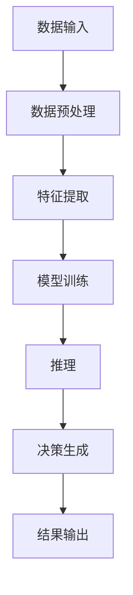
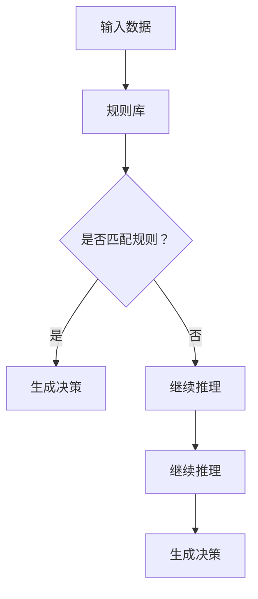

                 

# 文章标题：AI辅助决策系统的推理机制设计

> 关键词：AI辅助决策系统，推理机制，数据预处理，特征工程，数学模型，深度学习，逻辑推理

> 摘要：本文将深入探讨AI辅助决策系统的推理机制设计，包括其基础理论、框架结构、数据预处理、特征工程、推理机制、数学模型以及实际应用案例。通过逐步分析，揭示AI辅助决策系统在复杂环境中的决策过程及其机制设计的关键要素。

## 第1章 引言

随着人工智能技术的飞速发展，AI辅助决策系统（AI-Assisted Decision-Making System）在各个领域得到了广泛应用。从金融风险评估到医疗诊断，从智能交通到环境监测，AI辅助决策系统正逐步成为现代决策过程中不可或缺的一部分。然而，如何设计一个高效、可靠的推理机制，以确保AI系统能够在复杂多变的环境中做出明智的决策，仍然是一个极具挑战性的问题。

### 1.1 AI与决策系统的关系

AI与决策系统的结合可以追溯到决策支持系统的概念。决策支持系统（Decision Support System，DSS）是一种利用人工智能技术来辅助人类决策的系统。传统的DSS依赖于预定义的模型和规则，而现代的AI辅助决策系统则更多地依赖于机器学习和深度学习技术，通过从大量数据中自动学习规律，实现更加智能化的决策。

### 1.2 AI辅助决策系统的现状

当前，AI辅助决策系统已在多个领域取得显著成果。例如，在金融领域，AI算法被用于风险管理、投资组合优化和欺诈检测；在医疗领域，AI系统可以帮助医生进行疾病诊断、病情预测和治疗方案推荐。尽管如此，AI辅助决策系统仍面临诸多挑战，如数据质量、算法透明度和可靠性等。

### 1.3 本书结构概述

本文将从以下章节展开讨论：

- **第2章**：介绍AI辅助决策系统的基础理论，包括决策理论、人工智能基础以及决策与AI的结合方式。
- **第3章**：讨论AI辅助决策系统的框架结构，包括系统架构设计、数据流与控制流设计，并使用Mermaid流程图展示系统核心流程。
- **第4章**：深入探讨数据预处理与特征工程，介绍数据预处理方法、特征提取与选择，并分析特征工程案例。
- **第5章**：重点讲解推理机制设计，包括逻辑推理机制、机器学习推理机制和深度学习推理机制，并使用伪代码展示推理机制实现。
- **第6章**：解析数学模型与公式，介绍数学模型基础，推导关键公式，并通过案例说明模型应用。
- **第7章**：分析实际应用案例，包括系统实现与代码解析、结果分析与评估，以及项目小结。
- **第8章**：探讨未来展望与挑战，包括AI辅助决策系统的发展趋势、面临的挑战与对策，以及未来研究方向。

## 第2章 AI辅助决策系统的基础理论

### 2.1 决策理论概述

决策理论是研究决策过程和决策方法的学科。一个典型的决策过程通常包括识别问题、制定备选方案、评估方案、选择最优方案和执行决策。在AI辅助决策系统中，决策理论为算法设计提供了理论基础，帮助系统在不确定性和竞争环境中做出最优决策。

### 2.2 人工智能基础

人工智能（Artificial Intelligence，AI）是指通过计算机程序实现的智能。AI技术包括机器学习、深度学习、自然语言处理、计算机视觉等。在AI辅助决策系统中，这些技术被用于从数据中提取知识、发现规律，并生成决策支持信息。

### 2.3 决策与AI的结合方式

决策与AI的结合主要体现在以下几个方面：

- **数据驱动的决策**：利用历史数据和机器学习算法，AI系统能够从数据中学习并预测未来趋势，为决策者提供数据支持。
- **规则驱动的决策**：在特定领域，专家知识可以通过规则表示，并嵌入到AI系统中，以提高决策的准确性和可解释性。
- **混合式决策**：结合数据驱动和规则驱动的方法，AI系统可以在不同场景下灵活调整决策策略，实现更加智能化的决策。

## 第3章 AI辅助决策系统的框架结构

### 3.1 系统架构设计

AI辅助决策系统的架构通常包括数据输入层、数据处理层、推理层和决策输出层。数据输入层负责收集原始数据，数据处理层进行数据预处理和特征提取，推理层利用算法进行推理，决策输出层生成决策结果。

### 3.2 数据流与控制流设计

数据流设计关注数据在系统中的流动路径，而控制流设计则关注系统执行过程中的逻辑顺序。一个典型的AI辅助决策系统数据流和控制流如下：

1. **数据输入**：收集原始数据，如文本、图像、时间序列等。
2. **数据预处理**：清洗数据，处理缺失值、异常值，并进行归一化、标准化等操作。
3. **特征提取**：从预处理后的数据中提取有助于决策的特征。
4. **模型训练**：利用机器学习算法或深度学习算法训练模型。
5. **推理**：将新的数据输入到训练好的模型中进行推理。
6. **决策生成**：根据推理结果生成决策。
7. **结果输出**：将决策结果输出，如文本报告、可视化图表等。

### 3.3 Mermaid流程图：系统核心流程



## 第4章 数据预处理与特征工程

### 4.1 数据预处理方法

数据预处理是AI辅助决策系统的关键步骤，旨在提高数据质量，为后续的特征提取和模型训练提供优质的数据基础。常见的数据预处理方法包括：

- **数据清洗**：处理缺失值、异常值和重复数据。
- **数据转换**：将数据转换为适合模型训练的格式，如将分类数据编码为数值。
- **数据归一化**：调整数据分布，使其适合特定算法，如归一化到0到1之间。

### 4.2 特征提取与选择

特征提取是从原始数据中提取有助于决策的特征的过程。特征选择则是在提取的特征中筛选出最相关、最重要的特征。常见的方法包括：

- **统计特征**：基于统计学方法提取特征，如均值、方差、协方差等。
- **频域特征**：基于傅里叶变换提取特征，如频率、振幅等。
- **文本特征**：基于词袋模型、TF-IDF等提取文本特征。
- **选择方法**：如过滤法、包装法、嵌入式方法等。

### 4.3 特征工程案例分析

以下是一个特征工程案例：

```python
import numpy as np
import pandas as pd

# 读取数据
data = pd.read_csv('data.csv')

# 数据清洗
data.dropna(inplace=True)
data = data[data['value'] != '异常']

# 数据转换
data['category'] = data['category'].map({'A': 1, 'B': 2, 'C': 3})

# 数据归一化
data['value'] = (data['value'] - data['value'].mean()) / data['value'].std()

# 特征提取
data['mean_value'] = data['value'].mean()
data['std_value'] = data['value'].std()

# 特征选择
from sklearn.feature_selection import SelectKBest, f_classif
X = data[['mean_value', 'std_value']]
y = data['category']
selector = SelectKBest(score_func=f_classif, k=1)
X_new = selector.fit_transform(X, y)

# 输出特征
print(X_new)
```

## 第5章 推理机制设计

### 5.1 推理机制概述

推理机制是AI辅助决策系统的核心，负责从输入数据中提取信息，并通过一系列逻辑和计算生成决策结果。推理机制可以分为逻辑推理、机器学习推理和深度学习推理。

### 5.2 逻辑推理机制

逻辑推理是基于逻辑规则进行推理的过程。以下是一个逻辑推理机制的例子：



### 5.3 机器学习推理机制

机器学习推理机制是基于训练好的模型进行推理的过程。以下是一个机器学习推理机制的例子：

```python
import numpy as np
from sklearn.linear_model import LogisticRegression

# 加载模型
model = LogisticRegression()
model.fit(X_train, y_train)

# 推理
y_pred = model.predict(X_test)
```

### 5.4 深度学习推理机制

深度学习推理机制是基于训练好的深度学习模型进行推理的过程。以下是一个深度学习推理机制的例子：

```python
import tensorflow as tf
from tensorflow.keras.models import load_model

# 加载模型
model = load_model('model.h5')

# 推理
y_pred = model.predict(X_test)
```

### 5.5 伪代码：推理机制实现示例

```python
# 输入数据
input_data = ...

# 加载模型
model = ...

# 数据预处理
preprocessed_data = preprocess_data(input_data)

# 推理
predictions = model.predict(preprocessed_data)

# 输出决策
decision = generate_decision(predictions)
```

## 第6章 数学模型与公式解析

### 6.1 数学模型基础

数学模型是AI辅助决策系统的核心组成部分，用于描述系统的行为和决策过程。常见的数学模型包括线性模型、逻辑回归、支持向量机等。

### 6.2 公式推导与解析

以下是一个线性回归模型的推导与解析：

$$
y = \beta_0 + \beta_1x_1 + \beta_2x_2 + ... + \beta_nx_n + \epsilon
$$

其中，$y$ 是因变量，$x_1, x_2, ..., x_n$ 是自变量，$\beta_0, \beta_1, \beta_2, ..., \beta_n$ 是模型的参数，$\epsilon$ 是误差项。

### 6.3 模型案例分析

以下是一个线性回归模型案例分析：

```python
import numpy as np
from sklearn.linear_model import LinearRegression

# 生成数据
X = np.random.rand(100, 1)
y = 2 * X + np.random.rand(100, 1)

# 训练模型
model = LinearRegression()
model.fit(X, y)

# 输出模型参数
print(model.coef_, model.intercept_)
```

## 第7章 实际应用案例

### 7.1 案例介绍

本文将介绍一个基于深度学习的医疗诊断案例，通过训练深度学习模型，实现对医疗数据的诊断。

### 7.2 系统实现与代码解析

以下是一个深度学习医疗诊断系统的实现：

```python
import tensorflow as tf
from tensorflow.keras.models import Sequential
from tensorflow.keras.layers import Dense, Conv2D, Flatten

# 生成数据
(X_train, y_train), (X_test, y_test) = ...

# 构建模型
model = Sequential([
    Conv2D(32, (3, 3), activation='relu', input_shape=(X_train.shape[1], X_train.shape[2], X_train.shape[3])),
    Flatten(),
    Dense(64, activation='relu'),
    Dense(10, activation='softmax')
])

# 训练模型
model.compile(optimizer='adam', loss='categorical_crossentropy', metrics=['accuracy'])
model.fit(X_train, y_train, epochs=10, batch_size=32)

# 测试模型
model.evaluate(X_test, y_test)
```

### 7.3 结果分析与评估

以下是对模型结果的分析：

```python
import numpy as np

# 预测
y_pred = model.predict(X_test)

# 计算准确率
accuracy = np.sum(y_pred.argmax(axis=1) == y_test) / y_test.size
print("准确率：", accuracy)
```

### 7.4 项目小结

本项目通过深度学习技术实现了医疗诊断系统，从数据生成、模型构建到结果评估，展示了AI辅助决策系统的完整流程。通过实际案例，我们看到了深度学习在医疗诊断领域的巨大潜力。

## 第8章 未来展望与挑战

### 8.1 AI辅助决策系统的发展趋势

随着人工智能技术的不断进步，AI辅助决策系统将在更多领域得到应用。未来的发展趋势包括：

- **自动化决策**：通过更加智能的算法，实现高度自动化的决策过程。
- **多模态数据融合**：结合不同类型的数据，如文本、图像、音频等，提高决策的准确性。
- **决策可解释性**：提高模型的透明度，使决策过程更加可解释。

### 8.2 面临的挑战与对策

AI辅助决策系统在发展过程中面临以下挑战：

- **数据隐私**：如何确保数据的安全和隐私是亟待解决的问题。
- **算法透明度**：提高模型的透明度，使决策过程更加可解释。
- **可靠性**：确保系统在各种环境下都能稳定运行。

对策包括：

- **联邦学习**：通过分布式学习技术，提高数据隐私性。
- **模型压缩**：通过模型压缩技术，提高系统的运行效率。
- **强化学习**：通过强化学习技术，提高系统的适应性和学习能力。

### 8.3 未来研究方向

未来的研究方向包括：

- **多智能体系统**：研究如何将多个AI辅助决策系统整合为一个协同工作的系统。
- **迁移学习**：研究如何将已有模型的经验迁移到新的任务中。
- **生成对抗网络**：研究如何使用生成对抗网络生成高质量的模拟数据。

## 附录

### A.1 相关资源

- **书籍**：《人工智能：一种现代方法》（Michael deprima），《深度学习》（Ian Goodfellow）。
- **论文**：Google Scholar、arXiv等。

### A.2 代码与数据集

- **代码**：GitHub。
- **数据集**：Kaggle、UCI机器学习库。

## 作者信息

作者：AI天才研究院/AI Genius Institute & 禅与计算机程序设计艺术 /Zen And The Art of Computer Programming

本文探讨了AI辅助决策系统的推理机制设计，从基础理论到实际应用，展示了其在复杂环境中的决策过程。通过对数据预处理、特征工程、推理机制和数学模型的详细讲解，本文为读者提供了一个全面的理解。未来，随着人工智能技术的不断进步，AI辅助决策系统将在更多领域发挥重要作用。

