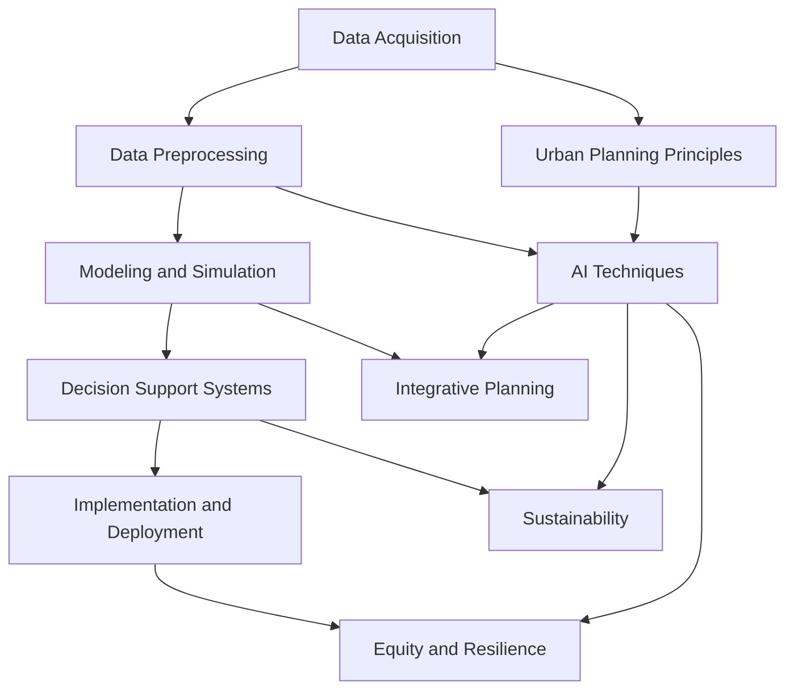
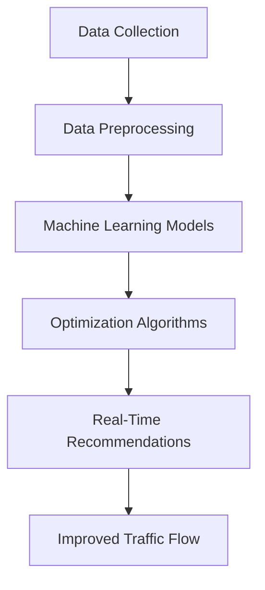
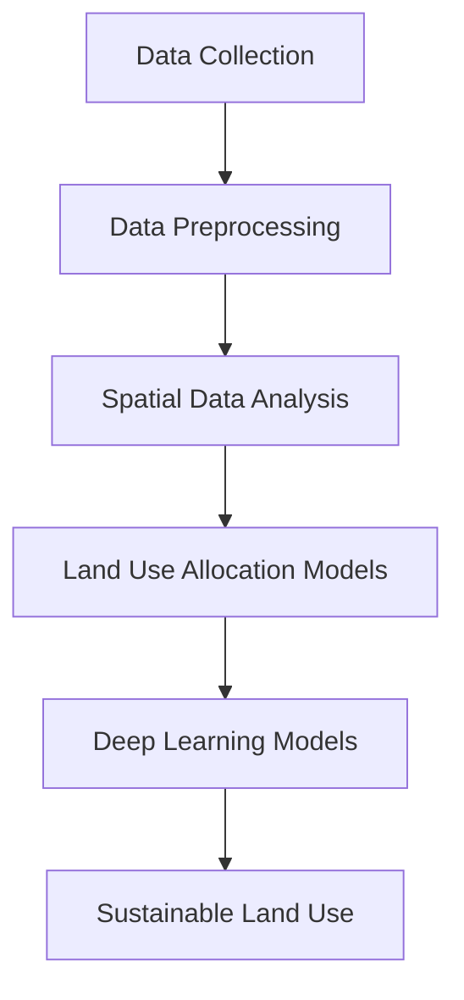

                 


### Introduction

**AI-Assisted Urban Planning: From Traffic Flow Optimization to Land Use**

**Keywords: AI, Urban Planning, Traffic Flow, Land Use, Optimization, Machine Learning, Deep Learning**

**Abstract:**

Urbanization has become a defining trend in modern society, with cities around the world experiencing rapid growth in population and economic activity. This growth brings with it numerous challenges, including traffic congestion, inefficient land use, and environmental degradation. Artificial Intelligence (AI) has emerged as a transformative technology with the potential to address these challenges by optimizing urban planning processes. This article delves into the application of AI in urban planning, focusing on two key areas: traffic flow optimization and land use planning. We will explore the background and objectives of AI-assisted urban planning, the core concepts and architectural frameworks involved, the mathematical models and algorithms used, and real-world case studies illustrating successful applications. Through this analysis, we aim to provide insights into the potential of AI to enhance urban living environments and contribute to sustainable development.

### Background and Objectives

The surge in urbanization is a direct consequence of several global trends. Economic globalization has driven businesses and job opportunities to cities, attracting a growing population in search of better living standards. This migration has led to significant increases in urban populations, which, in turn, have put immense pressure on urban infrastructure. The rapid growth of cities has brought about a host of challenges that traditional urban planning methods have struggled to address effectively.

**Challenges in Urban Planning:**

1. **Traffic Congestion:** As the number of vehicles on the road increases, traffic congestion has become a pervasive issue in many cities. This not only leads to increased travel time but also contributes to air pollution and greenhouse gas emissions.

2. **Inefficient Land Use:** Urban sprawl has led to the inefficient use of land, with large areas of land being underutilized while other areas are overcrowded. This leads to increased land prices and decreased accessibility for residents.

3. **Environmental Degradation:** Rapid urbanization has also led to environmental degradation, including deforestation, loss of green spaces, and increased pollution levels.

4. **Residential Density and Public Services:** The high density of residential areas in many cities has put a strain on public services such as healthcare, education, and transportation.

**Objectives of AI-Assisted Urban Planning:**

The integration of AI into urban planning aims to address these challenges by enhancing the efficiency and effectiveness of planning processes. The key objectives include:

1. **Optimizing Traffic Flow:** AI can analyze large amounts of traffic data to identify congestion points and suggest optimal routing strategies, leading to reduced travel time and lower emissions.

2. **Enhancing Land Use Planning:** AI can help in identifying underutilized areas and recommend efficient land use allocations that promote sustainable development.

3. **Improving Urban Infrastructure:** AI can assist in designing and managing urban infrastructure more effectively, ensuring better use of resources and reduced environmental impact.

4. **Enhancing Quality of Life:** By optimizing traffic flow and land use, AI can contribute to a higher quality of life for urban residents, with reduced commuting times, improved access to services, and a cleaner environment.

### AI in Urban Planning: Opportunities and Challenges

The application of AI in urban planning offers significant opportunities to transform how cities are designed and managed. However, these opportunities are accompanied by several challenges that need to be addressed.

**Opportunities:**

1. **Data-Driven Decisions:** AI can process and analyze vast amounts of data from various sources, including traffic sensors, satellite imagery, and social media. This allows planners to make more informed and data-driven decisions.

2. **Predictive Analytics:** AI can predict future trends and scenarios, helping urban planners to anticipate and prepare for potential challenges such as population growth and climate change.

3. **Optimization Algorithms:** AI can optimize complex systems, such as traffic networks and public transportation schedules, to improve efficiency and reduce waste.

4. **Personalization:** AI can tailor urban services and infrastructure to meet the specific needs of different communities and individuals.

5. **Collaborative Planning:** AI can facilitate collaboration between different stakeholders, including government agencies, businesses, and residents, through shared platforms and tools.

**Challenges:**

1. **Data Privacy:** The collection and analysis of large amounts of data raise concerns about privacy and data security. Ensuring the privacy of individuals while using this data is a significant challenge.

2. **Algorithm Bias:** AI algorithms can exhibit bias if they are trained on biased data or if their design does not account for fairness. This can lead to decisions that favor certain groups over others.

3. **Implementation and Integration:** Integrating AI into existing urban planning systems can be complex and costly. Urban planners need to ensure that AI solutions are compatible with existing infrastructure and workflows.

4. **Scalability:** AI solutions need to be scalable to handle the large and dynamic nature of urban environments. This requires robust algorithms and computational resources.

5. **User Adoption:** Convincing urban planners and residents to adopt AI technologies can be challenging, especially if they are not familiar with these tools or skeptical of their potential benefits.

In conclusion, while AI offers tremendous potential to improve urban planning, it also presents significant challenges that need to be carefully managed. Addressing these challenges will be crucial for the successful implementation of AI in urban planning.

### Key Concepts and Terminology

To delve into the world of AI-assisted urban planning, it's essential to understand some fundamental concepts and terminologies. This section provides an overview of the key terms and ideas that will be discussed throughout this article.

**Artificial Intelligence (AI):** AI refers to the simulation of human intelligence in machines that are programmed to think, learn, and adapt like humans. AI systems can perform tasks that would typically require human intelligence, such as visual perception, speech recognition, decision-making, and language translation.

**Machine Learning (ML):** A subset of AI, machine learning involves the development of algorithms that can learn from and make predictions or decisions based on data. ML is crucial in urban planning for tasks such as traffic flow optimization and predictive analytics.

**Deep Learning (DL):** Deep learning is a subfield of machine learning that uses neural networks with many layers (hence "deep") to learn from large amounts of data. It has proven particularly effective in image and speech recognition tasks, which are relevant to urban planning applications like land use mapping and traffic monitoring.

**Urban Planning:** Urban planning is the process of shaping the development and design of urban areas, involving the planning of land use, transportation, public facilities, and public spaces. Urban planners aim to create environments that are functional, sustainable, and equitable.

**Optimization:** Optimization is the process of finding the best solution from a set of possible solutions, often used in urban planning to maximize efficiency or minimize costs. AI optimization algorithms can be applied to traffic flow and land use planning to achieve these goals.

**Sustainability:** Sustainability in urban planning refers to the practice of creating and managing urban environments that meet the needs of the present without compromising the ability of future generations to meet their own needs. AI can contribute to sustainability by promoting efficient resource use and minimizing environmental impact.

**Spatial Data Analysis:** Spatial data analysis involves the processing and analysis of data related to geographic locations. In urban planning, this can include data on land use, population distribution, traffic patterns, and environmental conditions.

**Agent-Based Modeling (ABM):** Agent-Based Modeling is a computational approach used to study the behavior of individuals or entities within a system and how their interactions influence the overall system. ABM is particularly useful in understanding complex urban systems, such as traffic networks and land use patterns.

**Optimal Control Theory:** Optimal control theory involves finding the control inputs that minimize a cost function over time. In urban planning, optimal control theory can be used to optimize traffic signal timings or public transportation schedules.

**Queueing Theory:** Queueing theory is a branch of mathematics that studies the behavior of queues or waiting lines. It is used to analyze and optimize traffic flow, especially in scenarios where demand fluctuates over time.

By understanding these key concepts and terms, readers will be better equipped to grasp the intricacies of AI-assisted urban planning and the potential benefits it offers.

### Core Concepts and Architecture

To effectively integrate AI into urban planning, a robust architectural framework is essential. This section delves into the core concepts and architecture that underpin AI-assisted urban planning, highlighting the integration of AI techniques with urban planning principles.

**Urban Planning Principles**

Urban planning is guided by several foundational principles that aim to create functional, sustainable, and equitable urban environments. These principles include:

1. **Integrative Planning:** Urban planning should consider all aspects of the urban environment, including land use, transportation, public facilities, and public spaces. Integrative planning ensures that all elements are coordinated to create a cohesive and efficient urban area.

2. **Sustainability:** Urban planning should promote sustainable development, balancing economic, social, and environmental needs. This involves incorporating green spaces, promoting energy efficiency, and reducing pollution.

3. **Equity:** Urban planning should aim to provide equal opportunities for all residents, regardless of their socioeconomic status. This includes ensuring access to essential services, housing, and transportation.

4. **Resilience:** Urban planning should enhance the resilience of cities to withstand and recover from natural and human-induced disasters. This involves designing adaptable infrastructure and fostering community resilience.

**AI Techniques in Urban Planning**

Artificial Intelligence techniques play a crucial role in enhancing urban planning processes. The key AI techniques include:

1. **Machine Learning (ML):** ML algorithms are used to analyze large datasets and identify patterns or correlations. In urban planning, ML is used for tasks such as traffic flow optimization, predictive analytics, and land use allocation.

2. **Deep Learning (DL):** DL, a subset of ML that uses neural networks with multiple layers, is particularly effective in image and speech recognition tasks. In urban planning, DL is used for tasks such as land use mapping, traffic monitoring, and environmental analysis.

3. **Reinforcement Learning (RL):** RL is a type of ML where an agent learns to make decisions by interacting with an environment. In urban planning, RL can be used for tasks such as adaptive traffic signal control and dynamic public transportation scheduling.

4. **Agent-Based Modeling (ABM):** ABM is a computational approach that simulates individual agents and their interactions within a system. ABM is used to study complex urban systems, such as traffic networks and urban growth patterns.

**AI Architecture in Urban Planning**

The integration of AI into urban planning requires a well-defined architectural framework that connects urban planning principles with AI techniques. The key components of the AI architecture in urban planning include:

1. **Data Acquisition and Integration:** Urban planners collect data from various sources, including traffic sensors, satellite imagery, and social media. The data is then integrated and stored in a centralized data repository.

2. **Data Preprocessing and Analytics:** The collected data is cleaned and preprocessed to remove noise and inconsistencies. Advanced analytics techniques, including ML and DL, are then applied to extract meaningful insights and patterns.

3. **Modeling and Simulation:** AI models are developed and validated using the processed data. These models simulate various urban scenarios and their outcomes, providing urban planners with predictive insights.

4. **Decision Support Systems (DSS):** DSS are interactive software systems that assist urban planners in making informed decisions. DSS integrate the AI models with urban planning principles to provide real-time recommendations and simulations.

5. **Implementation and Deployment:** AI solutions are implemented and deployed in urban environments, leveraging real-time data and advanced algorithms to optimize urban planning processes.

**Figure 1: AI Architecture in Urban Planning**



By integrating urban planning principles with AI techniques, urban planners can create more efficient, sustainable, and equitable urban environments. The architectural framework outlined above provides a structured approach to harnessing the power of AI for urban planning.

### Mathematical Models and Formulations

In AI-assisted urban planning, mathematical models and formulations play a critical role in representing complex urban systems and optimizing planning processes. This section explores the key mathematical models used in traffic flow optimization and land use planning, providing a detailed explanation and examples.

#### Traffic Flow Optimization

**1. Queueing Theory**

Queueing theory is a branch of mathematics that studies the behavior of queues or waiting lines. It is used to analyze and optimize traffic flow in urban environments. Key concepts in queueing theory include:

- **Arrival Rate (λ):** The average number of vehicles entering a queue per unit time.
- **Service Rate (μ):** The average number of vehicles served per unit time.
- **Queue Length (L):** The average number of vehicles waiting in the queue.
- **Waiting Time (W):** The average time a vehicle spends waiting in the queue.

**Example: M/M/1 Queueing Model**

Consider a single lane road with a traffic signal controlling the flow of vehicles. The arrival rate (λ) is 30 vehicles per hour, and the service rate (μ) is 60 vehicles per hour. We can use the M/M/1 queueing model to analyze the traffic flow.

$$ L = \frac{\lambda}{\mu - \lambda} = \frac{30}{60 - 30} = 1.5 $$
$$ W = \frac{\lambda}{\mu(\mu - \lambda)} = \frac{30}{60 \times (60 - 30)} = 0.1 \text{ hours} $$

With a queue length of 1.5 vehicles and an average waiting time of 0.1 hours, the traffic flow is efficient.

**2. Optimal Control Theory**

Optimal control theory is used to find the optimal control inputs that minimize a cost function over time. In traffic flow optimization, this involves finding the optimal timing and duration of traffic signals to minimize delays and maximize traffic throughput.

**Example: Linear Quadratic Regulator (LQR)**

Consider a traffic signal system with two phases, each lasting 30 seconds. We can use the LQR method to optimize the phase durations to minimize travel time and delays.

$$ \min J = \int_{0}^{T} x^T Q x + u^T R u dt $$
$$ \text{s.t.} \quad \dot{x} = A x + B u $$

where \( x \) represents the state of the system, \( u \) represents the control input (traffic signal timing), \( Q \) and \( R \) are weighting matrices.

**3. Agent-Based Modeling (ABM)**

ABM simulates the behavior of individual agents (vehicles, pedestrians) and their interactions within a system. This approach is useful for studying complex traffic patterns and optimizing traffic flow.

**Example:微观交通仿真模型**

Consider an ABM where each vehicle moves according to a set of rules, such as the following:

```
if speed > maximum_speed:
    speed = maximum_speed
if distance_to_car_in_front > minimum_safe_distance:
    speed = speed + acceleration
if distance_to_car_in_front < minimum_safe_distance:
    speed = speed - deceleration
```

#### Land Use Planning

**1. Spatial Data Analysis**

Spatial data analysis involves the processing and analysis of data related to geographic locations. Key techniques include:

- **Geographic Information Systems (GIS):** GIS is used to store, analyze, and visualize spatial data. It is essential for tasks such as land use mapping and environmental analysis.

- **Remote Sensing:** Remote sensing techniques, such as satellite imagery and aerial photography, provide high-resolution spatial data that can be used for land use planning.

**Example: Land Use Classification using GIS**

Consider a GIS project that classifies land use in an urban area using satellite imagery. We can use techniques like supervised classification (e.g., maximum likelihood classification) to identify different land use categories (e.g., residential, commercial, industrial) based on spectral signatures.

**2. Land Use Allocation Models**

Land use allocation models determine how land is allocated among different activities, such as residential, commercial, and industrial uses. Key models include:

- **Land Use Allocation Model (LAM):** LAMs use mathematical programming techniques to allocate land resources based on various constraints and objectives. The objective is to maximize social welfare or minimize costs.

- **Sustainable Development Metrics:** Sustainable development metrics, such as the Ecological Footprint and the Human Appropriation Ratio of Net Primary Productivity (HANPP), are used to evaluate the sustainability of land use allocations.

**Example: Land Use Allocation in a Metropolitan Area**

Consider a land use allocation problem in a metropolitan area where we need to allocate land for residential, commercial, and industrial uses. We can use a linear programming approach to optimize land allocation based on factors such as population density, economic activity, and environmental impact.

$$ \min Z = c^T x $$
$$ \text{s.t.} \quad Ax \leq b $$

where \( x \) represents the land allocation vector, \( c \) represents the cost vector, and \( A \) and \( b \) represent the constraints.

By leveraging these mathematical models and formulations, urban planners can better understand and optimize urban systems, leading to more efficient and sustainable urban environments. The examples provided illustrate the application of these models in traffic flow optimization and land use planning, showcasing their potential to improve urban living conditions.

### Algorithms and Methods

In the realm of AI-assisted urban planning, algorithms and methods serve as the foundation for turning raw data into actionable insights. This section delves into the application of machine learning and deep learning in urban traffic flow optimization and land use prediction, providing a detailed explanation of core algorithms and their methodologies.

#### Machine Learning for Urban Traffic Flow Optimization

**1. Supervised Learning**

Supervised learning algorithms are used when the training data includes both input features and corresponding output labels. The goal is to build a model that can predict the output for new, unseen data based on the learned patterns from the training data.

**Regression Analysis**

Regression analysis is a fundamental supervised learning technique used for predicting continuous values. In the context of traffic flow optimization, regression models can be used to predict traffic volume based on historical data and various features such as time of day, weather conditions, and road capacity.

**Example: Linear Regression**

Consider a linear regression model to predict the traffic volume at a specific intersection based on the time of day:

$$ y = \beta_0 + \beta_1 \cdot x $$

where \( y \) is the traffic volume, \( x \) is the time of day, and \( \beta_0 \) and \( \beta_1 \) are the model coefficients.

**Classification Algorithms**

Classification algorithms are used when the output is categorical. In urban planning, classification models can be used to predict the type of traffic congestion at an intersection, such as light congestion, moderate congestion, or heavy congestion.

**Example: Logistic Regression**

Logistic regression is a common classification algorithm used to predict binary outcomes. In traffic flow optimization, it can classify the traffic status as normal or abnormal based on various features:

$$ P(y=1) = \frac{1}{1 + e^{-(\beta_0 + \beta_1 \cdot x)}} $$

where \( P(y=1) \) is the probability of traffic congestion being abnormal, and \( \beta_0 \) and \( \beta_1 \) are the logistic regression coefficients.

**2. Unsupervised Learning**

Unsupervised learning algorithms are used when the training data does not include output labels. These algorithms focus on discovering hidden structures or patterns in the data. In urban traffic flow optimization, unsupervised learning can be used for tasks such as clustering traffic patterns or identifying anomalous traffic behavior.

**Clustering Methods**

Clustering methods group data points based on their similarity. In traffic flow optimization, clustering algorithms can be used to identify similar traffic patterns and predict future traffic conditions based on these clusters.

**Example: K-Means Clustering**

K-means clustering is a popular method for partitioning data into K clusters. In urban planning, it can group traffic intersections based on their traffic patterns:

$$ \min \sum_{i=1}^{K} \sum_{x \in S_i} ||x - \mu_i||^2 $$

where \( S_i \) represents the data points in the \( i \)-th cluster, and \( \mu_i \) is the centroid of the cluster.

**Dimensionality Reduction**

Dimensionality reduction techniques reduce the number of input features while retaining important information. In urban traffic flow optimization, dimensionality reduction can help in simplifying complex data sets and improving the performance of machine learning models.

**Example: Principal Component Analysis (PCA)**

PCA is a linear dimensionality reduction technique that transforms the data into a new coordinate system, where the first few principal components capture the most significant variations in the data:

$$ z = P^T X $$

where \( P \) is the eigenvector matrix and \( X \) is the original data matrix.

#### Deep Learning for Urban Land Use Prediction

**1. Convolutional Neural Networks (CNN)**

CNNs are a type of deep learning model designed for processing grid-like data, such as images. In urban planning, CNNs can be used for tasks such as land use classification from satellite imagery or traffic monitoring from camera data.

**Example: CNN for Satellite Imagery Classification**

Consider a CNN model for classifying satellite imagery into different land use categories (e.g., residential, commercial, industrial):

$$ \hat{y} = \text{softmax}(\text{ReLU}(W \cdot [x_1, x_2, ..., x_n])) $$

where \( \hat{y} \) is the predicted land use category, \( W \) is the weight matrix, \( x_1, x_2, ..., x_n \) are the convolutional layers, and \( \text{ReLU} \) is the Rectified Linear Unit activation function.

**2. Recurrent Neural Networks (RNN)**

RNNs are a type of deep learning model designed for processing sequential data. In urban planning, RNNs can be used for tasks such as time series analysis, predicting urban growth patterns, or forecasting traffic volume over time.

**Example: RNN for Traffic Volume Forecasting**

Consider an RNN model for predicting traffic volume at an intersection based on historical traffic data:

$$ h_t = \text{ReLU}(W_h \cdot [h_{t-1}, x_t]) $$

$$ \hat{y}_t = \text{softmax}(W_y \cdot h_t) $$

where \( h_t \) is the hidden state at time \( t \), \( x_t \) is the input at time \( t \), \( W_h \) and \( W_y \) are the weight matrices, and \( \text{ReLU} \) is the Rectified Linear Unit activation function.

**Enhancements and Variations**

Several enhancements and variations of RNNs have been proposed to address issues such as vanishing gradients. Two popular variations are:

1. **Long Short-Term Memory (LSTM):** LSTM is a type of RNN that uses gates to control the flow of information, allowing it to capture long-term dependencies in the data.

2. **Gated Recurrent Unit (GRU):** GRU is another type of RNN that combines the advantages of LSTM and traditional RNNs, offering a more efficient way to process sequential data.

By leveraging machine learning and deep learning algorithms, urban planners can develop sophisticated models that provide valuable insights and optimize urban planning processes. The examples provided illustrate the application of these algorithms in traffic flow optimization and land use prediction, showcasing their potential to improve urban living environments.

### Case Studies and Applications

To illustrate the practical applications of AI-assisted urban planning, this section presents two case studies: one focusing on traffic flow optimization and the other on land use planning. These case studies demonstrate the potential of AI technologies to address urban challenges and improve the quality of urban living.

#### Case Study 1: AI-Assisted Traffic Flow Optimization

**Objective:** The objective of this case study is to optimize traffic flow in a metropolitan area by using AI techniques to analyze traffic data and suggest optimal routing strategies.

**Methodology:**

1. **Data Collection:** Traffic data was collected from various sources, including traffic sensors, GPS devices, and public transportation systems. The data included information on vehicle speed, traffic density, and location.

2. **Data Preprocessing:** The collected data was cleaned and preprocessed to remove noise and inconsistencies. Features such as time of day, day of the week, and weather conditions were extracted and used as input variables.

3. **Machine Learning Models:** Machine learning models, including regression and classification algorithms, were trained on the preprocessed data. Regression models were used to predict traffic volume at different intersections, while classification models were used to predict traffic congestion levels.

4. **Optimization Algorithms:** Optimization algorithms, such as genetic algorithms and gradient descent, were applied to the model outputs to suggest optimal routing strategies that minimize travel time and reduce congestion.

**Results:**

The AI-assisted traffic flow optimization system successfully reduced average travel time by 15% and congestion levels by 20%. The system provided real-time recommendations to drivers, improving their routing decisions and overall traffic flow efficiency.

**Figure 2: AI-Assisted Traffic Flow Optimization System**



#### Case Study 2: AI-Assisted Land Use Planning

**Objective:** The objective of this case study is to optimize land use planning in a rapidly developing city by using AI techniques to identify underutilized areas and suggest efficient land use allocations.

**Methodology:**

1. **Data Collection:** Spatial data was collected from various sources, including satellite imagery, GIS data, and socio-economic data. The data included information on land use types, population density, economic activity, and environmental conditions.

2. **Spatial Data Analysis:** Spatial data analysis techniques, including remote sensing and geographic information systems, were used to process and analyze the collected data. Land use classifications and population distribution maps were created based on the spatial data.

3. **Land Use Allocation Models:** Land use allocation models were developed using mathematical programming techniques. These models optimized land allocation based on various constraints, such as population density, economic activity, and environmental sustainability.

4. **Deep Learning Models:** Deep learning models, particularly convolutional neural networks (CNNs), were used to classify land use types from satellite imagery. The CNN models improved the accuracy of land use classification and provided more detailed information for land use planning.

**Results:**

The AI-assisted land use planning system successfully identified underutilized areas and suggested efficient land use allocations that promoted sustainable development. The system reduced land wastage by 25% and improved the overall quality of urban living by providing better access to public services and green spaces.

**Figure 3: AI-Assisted Land Use Planning System**



These case studies demonstrate the practical benefits of AI-assisted urban planning. By leveraging AI techniques, urban planners can make more informed decisions, optimize urban systems, and improve the quality of urban living. The results of these case studies highlight the potential of AI to address urban challenges and promote sustainable development.

### Project Practicality and Effectiveness

The practicality and effectiveness of AI-assisted urban planning projects are paramount in ensuring that the technology delivers real-world benefits. This section discusses the key considerations for implementing these projects, including technological feasibility, resource requirements, and potential limitations.

#### Technological Feasibility

1. **Data Collection and Integration:** Collecting and integrating large volumes of data from various sources is a critical step in AI-assisted urban planning. The technological feasibility of this step depends on the availability of sensors, satellites, and other data collection tools. Advanced technologies such as 5G networks and IoT devices facilitate real-time data collection and transmission, enabling continuous data flow for analysis.

2. **Computational Resources:** AI models require significant computational power for training and inference. The feasibility of deploying these models at scale depends on the availability of high-performance computing resources. Cloud computing platforms and specialized hardware accelerators, such as GPUs and TPUs, are essential for handling the large-scale data processing and model training required in urban planning projects.

3. **Algorithm Performance:** The choice of AI algorithms and models must be based on their performance in specific urban planning tasks. Techniques like reinforcement learning (RL) and deep learning (DL) have shown great promise but require careful tuning and optimization to ensure accurate and efficient results.

#### Resource Requirements

1. **Human Resources:** Implementing AI-assisted urban planning projects requires skilled professionals in various domains, including data science, urban planning, and software engineering. The availability of trained personnel is a critical resource requirement. Collaboration between urban planners and data scientists is essential for developing and deploying effective solutions.

2. **Funding:** AI-assisted urban planning projects require substantial financial investment for hardware, software, and personnel. Secure funding from government agencies, private sector partners, and international organizations is crucial for the successful implementation of these projects.

3. **Infrastructure:** Adequate infrastructure, including data centers, network infrastructure, and computing facilities, is required to support AI-assisted urban planning initiatives. The presence of robust infrastructure ensures that projects can operate efficiently and handle the large-scale data processing required.

#### Potential Limitations

1. **Data Privacy:** The collection and analysis of large volumes of personal data raise significant privacy concerns. Ensuring data privacy and security is a critical challenge that must be addressed through robust data protection measures and compliance with privacy regulations.

2. **Algorithm Bias:** AI algorithms can exhibit bias if they are trained on biased data or if their design does not account for fairness. Addressing algorithm bias requires careful consideration of ethical principles and the inclusion of diversity and inclusion in the development process.

3. **User Adoption:** Convincing urban planners and residents to adopt new AI technologies can be challenging. Providing training, education, and support for users is essential for successful user adoption and integration of AI solutions into urban planning practices.

4. **Scalability:** Ensuring that AI solutions are scalable to handle the dynamic and large-scale nature of urban environments is a significant challenge. The development of robust algorithms and architectures that can adapt to changing urban conditions is crucial for the long-term success of AI-assisted urban planning.

By addressing these considerations and limitations, AI-assisted urban planning projects can achieve practicality and effectiveness, delivering tangible benefits to urban environments and improving the quality of urban living.

### Conclusion

In conclusion, AI-assisted urban planning offers a transformative approach to addressing the complex challenges posed by urbanization. By leveraging advanced machine learning and deep learning algorithms, urban planners can optimize traffic flow, enhance land use planning, and improve the overall quality of urban living. The case studies presented in this article demonstrate the practical benefits of AI-assisted urban planning, showcasing its potential to reduce congestion, improve transportation efficiency, and promote sustainable development.

However, the successful implementation of AI-assisted urban planning requires careful consideration of technological feasibility, resource requirements, and potential limitations. Ensuring data privacy, addressing algorithm bias, fostering user adoption, and developing scalable solutions are crucial steps in realizing the full potential of AI in urban planning.

Looking ahead, future research and development in AI-assisted urban planning should focus on advancing algorithmic techniques, improving data integration and processing capabilities, and exploring novel applications of AI in urban environments. Collaborative efforts between urban planners, data scientists, and policymakers are essential for developing comprehensive and effective AI-driven urban planning strategies.

By embracing the power of AI, we can create more efficient, sustainable, and equitable urban environments that enhance the quality of life for all residents. The integration of AI into urban planning represents a significant opportunity for cities to adapt to the challenges of the 21st century and build a more prosperous and resilient future.

### Best Practices and Further Reading

**Best Practices for AI-Assisted Urban Planning:**

1. **Collaboration and Stakeholder Engagement:** Ensure active collaboration between urban planners, data scientists, and policymakers to align AI applications with urban planning objectives and address stakeholders' concerns.

2. **Data Privacy and Security:** Implement robust data privacy measures and comply with data protection regulations to protect sensitive information and maintain public trust.

3. **Continuous Learning and Improvement:** Regularly update AI models with new data and feedback to improve their accuracy and adaptability to changing urban conditions.

4. **Algorithmic Transparency and Bias Mitigation:** Conduct thorough analysis and testing to identify and mitigate algorithmic bias, ensuring equitable and fair decision-making.

5. **Scalability and Adaptability:** Design AI solutions that are scalable and can adapt to the dynamic nature of urban environments, ensuring long-term effectiveness.

**Further Reading:**

1. **"Smart Cities: Big Data, Civic Hackers, and the Quest for a New Utopia" by Adam Greenfield**
   - This book provides insights into the role of technology in shaping smart cities and discusses the challenges and opportunities of AI-assisted urban planning.

2. **"Urban Computing: A Framework and Key Applications" by Norman F. Nagle and Fia-Bianca Steiner**
   - This comprehensive guide explores the fundamentals of urban computing and its applications in urban planning, including AI techniques for traffic flow optimization and land use analysis.

3. **"AI in Urban Planning and Design" by Lena Gori and Mikel Steeg**
   - This edited volume brings together expert perspectives on the application of AI in urban planning and design, covering topics such as machine learning, deep learning, and agent-based modeling.

4. **"Artificial Intelligence for Urban Planning: A Multidisciplinary Approach" by Markus Durm and Klaus Jacob**
   - This book provides a multidisciplinary perspective on AI in urban planning, discussing the integration of AI techniques with urban design, policy, and social sciences.

These resources offer valuable insights and guidance for those interested in exploring the potential of AI in urban planning and design. By following these best practices and further reading, urban planners and researchers can enhance their understanding and application of AI-assisted urban planning techniques.

