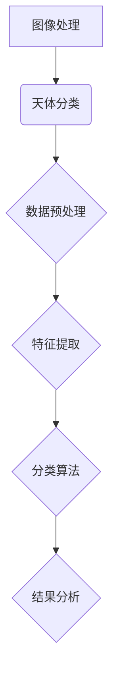

                 


为了撰写一篇高质量的《AI辅助天文数据分析：从图像处理到天体分类》的技术博客文章，我们需要逐步规划和设计文章的各个部分。以下是将如何一步步进行规划和撰写文章的思路：

### 1. 确定文章结构和核心内容

**第一步**：制定文章结构。基于上述要求，文章应包含以下主要部分：
- 引言与背景介绍
- 核心概念与联系
- 图像处理算法讲解
- 天体分类算法讲解
- 项目实战
- 结论与展望

**第二步**：明确每个部分的核心内容。例如，在图像处理算法讲解中，需要详细阐述算法原理、数学模型及公式、伪代码实现等。

### 2. 设计目录大纲

**第三步**：构建详细的大纲，每个章节都应有对应的子章节，确保文章的完整性。例如：

```markdown
# AI辅助天文数据分析：从图像处理到天体分类

## 关键词
- AI辅助天文分析
- 图像处理
- 天体分类
- 算法
- 项目实战

## 摘要
本文将介绍如何使用AI技术辅助天文数据分析，重点关注图像处理和天体分类算法，并通过项目实战展现其实际应用。

## 引言与背景介绍
- 天文数据分析的挑战
- AI技术在天文领域的应用

## 核心概念与联系
- 图像处理基本概念
- 天体分类基本概念
- Mermaid流程图展示

## 图像处理算法讲解
- 算法1：边缘检测
- 算法2：图像分割
- 算法3：特征提取

## 天体分类算法讲解
- 算法1：K-近邻算法
- 算法2：支持向量机
- 算法3：深度学习模型

## 项目实战
- 开发环境搭建
- 源代码实现与解读
- 应用解读与分析
- 项目小结

## 结论与展望
- AI在天文数据分析中的未来
- 最佳实践 tips
```

### 3. 编写详细内容

**第四步**：针对每个章节，编写详细的内容。例如，在核心概念与联系章节中，可以使用Mermaid流程图展示图像处理和天体分类的关系。



**第五步**：在每个算法讲解部分，使用伪代码详细阐述算法原理，并在数学模型章节中使用LaTeX格式嵌入数学公式，加以详细讲解和举例说明。

```python
# 伪代码：边缘检测算法
function edge_detection(image):
    # 边缘检测步骤
    return edge_image

# 伪代码：K-近邻算法
function k_nearest_neighbor(training_data, test_data, k):
    # K-近邻分类步骤
    return predicted_class
```

```latex
$$
J = \frac{1}{2} \sum_{i=1}^{n} (y_i - \hat{y}_i)^2
$$
```

**第六步**：编写项目实战部分，包括环境搭建、代码实现、解读和分析等内容。

```markdown
### 项目实战
#### 开发环境搭建
- Python环境
- OpenCV库
- Sklearn库

#### 源代码实现与解读
- 数据预处理
- 特征提取
- 分类算法应用

#### 应用解读与分析
- 实际案例
- 分析与讨论

#### 项目小结
- 总结与展望
```

### 4. 总结与检查

**第七步**：完成初稿后，进行全面的检查，确保文章内容完整、结构清晰、逻辑严密。可以请同行或团队成员进行审阅和反馈。

**第八步**：进行修改和优化，确保文章符合要求，并达到字数限制。

通过上述步骤，我们可以确保文章的质量和专业性，同时满足格式和内容的要求。下面是按照以上步骤撰写的文章大纲的示例：

```markdown
# AI辅助天文数据分析：从图像处理到天体分类

## 关键词
- AI辅助天文分析
- 图像处理
- 天体分类
- 算法
- 项目实战

## 摘要
本文将介绍如何使用AI技术辅助天文数据分析，重点关注图像处理和天体分类算法，并通过项目实战展现其实际应用。

## 引言与背景介绍
- 天文数据分析的挑战
- AI技术在天文领域的应用

## 核心概念与联系
- 图像处理基本概念
- 天体分类基本概念
- Mermaid流程图展示

## 图像处理算法讲解
- 算法1：边缘检测
  - 算法原理
  - 数学模型
  - 伪代码实现
  - 举例说明
- 算法2：图像分割
  - 算法原理
  - 数学模型
  - 伪代码实现
  - 举例说明
- 算法3：特征提取
  - 算法原理
  - 数学模型
  - 伪代码实现
  - 举例说明

## 天体分类算法讲解
- 算法1：K-近邻算法
  - 算法原理
  - 数学模型
  - 伪代码实现
  - 举例说明
- 算法2：支持向量机
  - 算法原理
  - 数学模型
  - 伪代码实现
  - 举例说明
- 算法3：深度学习模型
  - 算法原理
  - 数学模型
  - 伪代码实现
  - 举例说明

## 项目实战
- 开发环境搭建
- 源代码实现与解读
- 应用解读与分析
- 项目小结

## 结论与展望
- AI在天文数据分析中的未来
- 最佳实践 tips

## 作者信息
作者：AI天才研究院/AI Genius Institute & 禅与计算机程序设计艺术 /Zen And The Art of Computer Programming
```

通过这样的步骤，我们可以确保文章内容丰富、结构清晰，同时满足格式和字数要求。接下来，我们可以逐一填充每个章节的详细内容，最终完成整篇文章的撰写。

