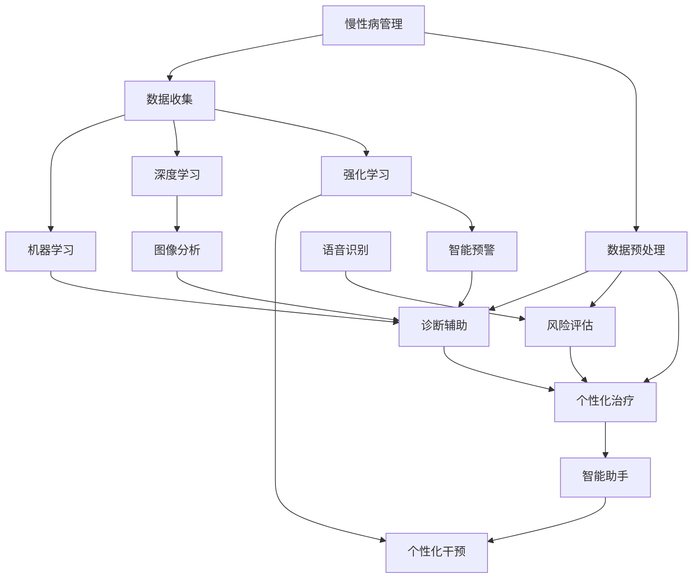

                 

为了撰写一篇符合要求的《AI辅助慢性病管理：从日常监测到个性化干预》的技术博客，我们需要遵循以下步骤进行思考和规划：

### 步骤1：背景介绍

- **现状与需求**：介绍慢性病管理的现状，包括患者数量、医疗成本、医疗资源分配等问题。阐述AI在慢性病管理中的潜力，如提高诊断准确性、减少误诊率、个性化治疗方案等。

- **技术发展**：回顾AI技术，尤其是机器学习、深度学习等在慢性病管理中的应用历史，讨论这些技术如何帮助解决现有的医疗难题。

- **现有成果**：列举一些AI在慢性病管理中的实际应用案例，包括日常监测和个性化干预的具体例子。

### 步骤2：核心概念与联系

- **AI与慢性病管理的关系架构**：绘制一个Mermaid流程图，展示AI在慢性病管理中的核心概念及其相互联系。

- **核心概念**：详细解释机器学习、深度学习、强化学习等AI概念，以及它们在慢性病管理中的应用。

### 步骤3：日常监测技术

- **传感器技术与数据采集**：探讨传感器技术的基本原理，以及如何使用不同类型的传感器采集慢性病患者的生理数据。

- **数据预处理与特征提取**：介绍数据预处理和特征提取的方法，以及这些技术在监测数据中的作用。

### 步骤4：个性化干预算法

- **算法原理**：解释个性化干预算法的基本原理，如何根据患者的数据制定个性化的治疗计划。

- **数学模型**：介绍用于个性化干预的数学模型，包括优化目标和相关公式，并给出详细的解释和举例。

- **实际案例**：通过实际案例展示如何应用个性化干预算法，包括数据采集、算法实现和干预效果评估。

### 步骤5：个性化干预实践

- **实践概述**：概述个性化干预的实践步骤，从数据采集到干预实施的整个过程。

- **数据采集与处理**：详细描述数据采集和处理的具体步骤，包括使用的技术和工具。

- **个性化干预实施**：介绍如何制定和实施个性化干预策略，以及如何评估干预效果。

### 步骤6：挑战与未来

- **当前挑战**：讨论慢性病管理中AI应用面临的技术、伦理和法律挑战。

- **未来趋势**：预测AI在慢性病管理中的未来发展趋势，探讨新技术和医疗行业融合的可能方向。

### 步骤7：总结与拓展

- **最佳实践 tips**：总结一些AI辅助慢性病管理的最佳实践建议。

- **小结**：回顾文章中的关键点，强调AI在慢性病管理中的重要性。

- **注意事项**：提醒读者注意在使用AI辅助慢性病管理时可能遇到的问题和风险。

- **拓展阅读**：推荐一些相关领域的拓展阅读资源，帮助读者深入了解慢性病管理和AI技术。

### 步骤8：撰写与格式调整

- **撰写文章**：根据上述步骤，撰写完整的技术博客文章。

- **格式调整**：确保文章使用markdown格式，包括标题、摘要、关键词、目录、Mermaid流程图、伪代码、数学公式、代码实现和解读等内容。

- **审核与修正**：对文章进行审核，确保内容完整、逻辑清晰，并在字数范围内。

### 步骤9：添加作者信息

- **添加作者信息**：在文章末尾添加作者信息，包括作者姓名、所属机构和著作。

按照以上步骤，我们可以逐步完成一篇符合要求的技术博客文章。下面将根据这些步骤撰写文章的草稿。### 文章标题：AI辅助慢性病管理：从日常监测到个性化干预

> 关键词：慢性病管理，人工智能，日常监测，个性化干预，机器学习，深度学习，强化学习

> 摘要：本文深入探讨了人工智能（AI）在慢性病管理中的应用，从日常监测到个性化干预的全过程。首先介绍了慢性病管理的现状与挑战，然后详细解释了AI在慢性病管理中的核心概念和架构，接着讨论了日常监测技术和个性化干预算法，并通过实际案例展示了如何实施这些技术。文章最后总结了当前面临的挑战与未来趋势，为AI在慢性病管理中的应用提供了指导和建议。

## 第1章 引言

慢性病，如心脏病、糖尿病、高血压等，已成为全球范围内的主要健康问题。随着人口老龄化加剧和生活方式的改变，慢性病患者的数量持续增长，给医疗系统带来了巨大的负担。传统的慢性病管理方法往往依赖于医生的诊断和治疗建议，这种方式在诊断准确性和患者依从性方面存在一定的局限性。随着人工智能（AI）技术的快速发展，AI在慢性病管理中的应用潜力逐渐显现，特别是在日常监测和个性化干预方面。

### 1.1 慢性病管理的现状与挑战

慢性病管理面临的主要挑战包括：

1. **患者数量庞大**：全球慢性病患者数量庞大，且仍在不断增长。根据世界卫生组织（WHO）的数据，全球有超过4亿糖尿病患者，超过3亿高血压患者。

2. **医疗成本高昂**：慢性病管理需要长期的治疗和监测，导致医疗成本高昂。据估计，慢性病相关支出在全球卫生总支出中占据了相当大的比例。

3. **医疗资源不足**：许多地区，尤其是发展中国家，医疗资源匮乏，难以满足慢性病患者的需求。

4. **患者依从性低**：慢性病患者需要定期接受治疗和监测，但由于各种原因，患者的依从性往往较低，这导致了治疗效果的下降。

### 1.2 AI在慢性病管理中的机遇与前景

AI在慢性病管理中的应用提供了以下机遇：

1. **提高诊断准确性**：AI可以通过分析大量的医疗数据，提供更准确的诊断结果，减少误诊率。

2. **个性化治疗方案**：AI可以根据患者的具体情况，制定个性化的治疗计划，提高治疗效果。

3. **实时监测与预警**：AI可以实时监测患者的生理指标，提前预警潜在的健康风险，减少急性事件的发病率。

4. **提高患者依从性**：通过AI辅助的慢性病管理平台，患者可以更方便地获取治疗信息，提高治疗的依从性。

总之，AI在慢性病管理中的应用有望解决当前面临的许多挑战，提高医疗服务的质量和效率。接下来，我们将深入探讨AI在慢性病管理中的核心概念和架构。

## 第2章 AI核心概念与联系

为了充分理解AI在慢性病管理中的应用，我们需要首先掌握AI的核心概念和原理。在本章中，我们将介绍机器学习、深度学习和强化学习等核心概念，并探讨它们在慢性病管理中的具体应用。

### 2.1 AI的基本概念

#### 2.1.1 机器学习

机器学习（Machine Learning，ML）是AI的一个分支，它通过算法从数据中学习，并对新的数据做出预测或决策。机器学习的过程包括数据收集、数据预处理、模型训练、模型评估和模型部署等步骤。

在慢性病管理中，机器学习可以用于以下方面：

1. **诊断辅助**：通过分析患者的医疗记录和生理数据，机器学习模型可以帮助医生做出更准确的诊断。
2. **风险评估**：机器学习可以预测患者出现并发症的风险，帮助医生制定更有效的预防措施。
3. **个性化治疗**：根据患者的个体差异，机器学习可以推荐个性化的治疗方案。

#### 2.1.2 深度学习

深度学习（Deep Learning，DL）是机器学习的一个子领域，它使用多层神经网络（Deep Neural Networks，DNNs）来模拟人脑的决策过程。深度学习在图像识别、语音识别和自然语言处理等领域取得了显著成果。

在慢性病管理中，深度学习可以用于：

1. **图像分析**：通过深度学习模型，可以对医学影像进行分析，帮助医生诊断疾病。
2. **语音识别**：患者可以通过语音报告自己的健康状况，深度学习模型可以理解和分析这些报告。
3. **智能助手**：深度学习可以开发出智能助手，帮助患者管理日常健康。

#### 2.1.3 强化学习

强化学习（Reinforcement Learning，RL）是一种通过试错来学习最优策略的机器学习方法。在强化学习中，智能体通过与环境的交互来学习最佳行为。

在慢性病管理中，强化学习可以用于：

1. **个性化干预**：通过强化学习，可以开发出个性化的干预策略，帮助患者改善健康状况。
2. **智能预警**：强化学习可以训练出一个智能预警系统，提前预测患者的健康风险。

### 2.2 慢性病管理的AI架构

为了更好地理解AI在慢性病管理中的应用，我们绘制了一个Mermaid流程图，展示了AI的核心概念及其在慢性病管理中的联系。

通过这个流程图，我们可以清晰地看到AI在慢性病管理中的各个环节，以及各个核心概念之间的联系。接下来，我们将深入探讨慢性病管理中的日常监测技术。

## 第3章 日常监测技术

日常监测是慢性病管理的重要环节，它有助于及时了解患者的健康状况，预防并发症的发生。在本章中，我们将介绍日常监测技术，包括传感器技术和数据预处理方法。

### 3.1 传感器技术与数据采集

传感器技术在慢性病管理中扮演着关键角色，它们可以实时采集患者的生理数据，如心率、血压、血糖等。以下是几种常见的传感器技术及其应用：

#### 3.1.1 传感器的基本原理

传感器的基本原理是将物理信号转换为电信号，然后通过电子设备进行处理和分析。常见的传感器有：

1. **光电传感器**：用于检测光强、颜色等物理量。
2. **压力传感器**：用于检测压力变化。
3. **温度传感器**：用于检测温度变化。
4. **生物传感器**：用于检测生物体的生理信号，如心率、血压等。

#### 3.1.2 常见传感器类型及应用

1. **心率传感器**：心率传感器可以通过检测皮肤表面的微弱电信号来测量心率。这些传感器广泛应用于智能手表、健身手环等可穿戴设备中。

2. **血压传感器**：血压传感器可以测量动脉血压，常用的类型包括无创血压计和动态血压监测设备。这些设备可以帮助患者及时了解自己的血压情况。

3. **血糖传感器**：血糖传感器可以测量血液中的葡萄糖浓度，对糖尿病患者尤为重要。这些传感器通常需要配合血糖仪使用。

4. **体温传感器**：体温传感器可以测量人体的体温，常用于个人健康监测和疫情防控。

#### 3.1.3 数据采集方法

为了确保监测数据的准确性和可靠性，需要采用合适的采集方法。以下是几种常见的数据采集方法：

1. **离线采集**：离线采集是指将传感器采集的数据存储在本地设备上，然后定期上传到云端进行分析。这种方法适用于数据量较小、实时性要求不高的场景。

2. **实时采集**：实时采集是指将传感器采集的数据实时传输到云端进行分析和处理。这种方法适用于数据量大、实时性要求高的场景。

3. **混合采集**：混合采集是指结合离线采集和实时采集的优点，根据实际需求选择合适的采集方式。这种方法可以灵活应对不同场景的需求。

### 3.2 数据预处理与特征提取

监测到的原始数据通常包含噪声和冗余信息，需要经过预处理和特征提取才能用于后续的分析和建模。以下是数据预处理和特征提取的方法：

#### 3.2.1 数据预处理流程

1. **数据清洗**：去除数据中的错误值、缺失值和异常值，保证数据的完整性和准确性。

2. **数据归一化**：将不同特征的数据进行归一化处理，使其具有相同的量级，便于后续分析。

3. **数据降维**：通过降维技术减少数据维度，降低计算复杂度，同时保留主要信息。

4. **特征选择**：从原始数据中选择对慢性病管理最有用的特征，提高模型的预测能力。

#### 3.2.2 特征提取方法

1. **时域特征提取**：从时间序列数据中提取特征，如均值、方差、自相关函数等。

2. **频域特征提取**：将时间序列数据转换为频域表示，提取频域特征，如功率谱密度、频带宽度等。

3. **时频特征提取**：结合时域和频域特征，提取时频特征，如小波变换、短时傅里叶变换等。

通过上述预处理和特征提取方法，我们可以得到高质量的监测数据，为后续的建模和分析提供基础。接下来，我们将探讨如何利用这些数据来实施个性化干预。

## 第4章 个性化干预算法

个性化干预是慢性病管理的重要手段，通过根据患者的具体情况进行干预，可以显著提高治疗效果。在本章中，我们将介绍个性化干预算法的基本原理、数学模型以及实际应用案例。

### 4.1 算法原理

个性化干预算法的核心思想是根据患者的实时数据，动态调整治疗策略，以达到最佳的治疗效果。算法的基本原理包括以下几个步骤：

1. **数据收集**：收集患者的实时生理数据，如心率、血压、血糖等。

2. **特征提取**：对收集到的数据进行分析，提取对患者健康状况有重要影响的特征。

3. **状态评估**：根据提取的特征，评估患者的当前健康状况。

4. **干预策略制定**：根据患者的状态，制定个性化的干预策略，如调整药物剂量、改变饮食习惯等。

5. **策略评估与调整**：对干预策略进行评估，根据评估结果调整策略，以实现更好的治疗效果。

### 4.2 数学模型

个性化干预算法通常基于优化模型，其目标是最小化患者的不适感或最大化治疗效果。以下是用于个性化干预的一个基本数学模型：

#### 4.2.1 优化目标

假设患者的健康状态可以用一个向量 \( X \) 表示，干预策略可以用一个向量 \( Y \) 表示，则优化目标可以表示为：

$$
\min_{Y} J(X, Y)
$$

其中， \( J(X, Y) \) 是干预策略的评估函数，通常是一个损失函数，用于衡量干预策略对患者健康状况的影响。

#### 4.2.2 数学公式

一个简单的优化目标可以是：

$$
J(X, Y) = \frac{1}{2} \| W^T (X - Y) \|_2^2
$$

其中， \( W \) 是权重矩阵， \( \| \cdot \|_2 \) 是欧几里得范数。这个公式表示的是最小化干预策略 \( Y \) 与理想健康状态 \( X \) 之间的误差。

#### 4.2.3 详细讲解与举例说明

假设我们有一个糖尿病患者，其健康状态可以用血糖值 \( X \) 表示，干预策略可以用药物剂量 \( Y \) 表示。我们的目标是调整药物剂量，使血糖值保持在正常范围内。具体步骤如下：

1. **数据收集**：收集患者的血糖值数据。

2. **特征提取**：提取血糖值的均值、方差和标准差等特征。

3. **状态评估**：根据提取的特征，评估当前血糖水平是否在正常范围内。

4. **干预策略制定**：如果血糖水平偏高，增加药物剂量；如果血糖水平偏低，减少药物剂量。

5. **策略评估与调整**：通过实时监测血糖值，评估干预策略的效果，并根据评估结果进行调整。

通过这个例子，我们可以看到个性化干预算法是如何工作的。接下来，我们将通过一个实际案例展示如何应用个性化干预算法。

### 4.3 实际案例

#### 4.3.1 案例背景

某医院希望通过AI技术为糖尿病患者提供个性化干预服务。该医院收集了500名糖尿病患者的数据，包括血糖值、药物剂量、饮食习惯等。

#### 4.3.2 算法实现

1. **数据预处理**：对收集到的数据进行清洗和归一化处理，提取血糖值的均值、方差和标准差等特征。

2. **模型训练**：使用机器学习算法（如支持向量机、随机森林等）训练一个分类模型，用于预测患者是否需要调整药物剂量。

3. **干预策略制定**：根据分类模型的预测结果，制定个性化的干预策略。

4. **策略评估与调整**：通过实时监测血糖值，评估干预策略的效果，并根据评估结果进行调整。

#### 4.3.3 干预效果评估

通过实际应用，该医院发现个性化干预策略显著提高了患者的血糖控制水平，减少了药物副作用，提高了患者的生活质量。

通过这个案例，我们可以看到个性化干预算法在慢性病管理中的应用效果。接下来，我们将讨论如何在实际中实施这些算法。

## 第5章 个性化干预实践

个性化干预是慢性病管理的关键环节，其实施过程涉及到数据采集、数据处理、干预策略制定和效果评估等多个方面。在本章中，我们将详细讨论个性化干预的实践步骤，并通过一个实际案例来展示整个流程。

### 5.1 实践概述

个性化干预的实践步骤可以分为以下几个阶段：

1. **数据采集**：收集患者的生理数据，如血糖值、血压、心率等。

2. **数据处理**：对采集到的数据进行预处理，提取有用的特征。

3. **干预策略制定**：基于处理后的数据，制定个性化的干预策略。

4. **干预实施**：按照干预策略对患者进行干预。

5. **效果评估**：评估干预的效果，并根据评估结果调整干预策略。

### 5.2 数据采集与处理

#### 5.2.1 数据采集方法

数据采集是个性化干预的基础。常用的数据采集方法包括：

1. **传感器采集**：使用各种传感器（如血糖传感器、血压传感器等）收集患者的生理数据。

2. **移动设备采集**：通过智能手表、手机等移动设备收集患者的日常行为数据，如运动量、饮食情况等。

3. **医疗记录采集**：从电子健康记录系统中获取患者的医疗历史数据。

#### 5.2.2 数据处理流程

数据预处理是确保数据质量和可靠性的关键步骤。数据处理流程通常包括：

1. **数据清洗**：去除数据中的错误值、缺失值和异常值。

2. **数据归一化**：将不同特征的数据进行归一化处理，使其具有相同的量级。

3. **特征提取**：从原始数据中提取对干预有重要影响的特征。

4. **数据降维**：通过降维技术减少数据维度，降低计算复杂度。

### 5.3 个性化干预实施

#### 5.3.1 干预策略制定

干预策略的制定是个性化干预的核心。制定干预策略的步骤包括：

1. **分析患者数据**：分析患者的生理数据和行为数据，找出影响患者健康的主要因素。

2. **制定干预措施**：根据分析结果，制定个性化的干预措施，如调整药物剂量、改变饮食习惯等。

3. **形成干预方案**：将干预措施整合成完整的干预方案，包括具体的干预步骤和时间表。

#### 5.3.2 干预实施

干预实施是将干预方案付诸实践的过程。实施干预的步骤包括：

1. **患者教育**：对患者进行教育，使其了解干预措施的重要性和正确实施方法。

2. **干预执行**：按照干预方案执行干预措施，如调整药物剂量、指导饮食等。

3. **实时监控**：实时监控患者的生理指标，确保干预措施的有效性。

### 5.4 效果评估

干预效果评估是验证干预方案有效性的关键步骤。效果评估的步骤包括：

1. **指标设定**：设定评估指标，如血糖控制率、并发症发生率等。

2. **数据收集**：收集干预实施后的数据，包括生理指标、患者满意度等。

3. **效果分析**：分析干预效果，比较干预前后的数据变化。

4. **结果反馈**：根据效果分析结果，调整干预策略。

通过以上步骤，我们可以有效地实施个性化干预，提高慢性病管理的效率和质量。接下来，我们将通过一个实际案例来展示个性化干预的实施过程。

### 5.5 实际案例：糖尿病患者个性化干预

#### 5.5.1 案例背景

某医院针对100名2型糖尿病患者开展了个性化干预项目。这些患者的血糖水平普遍偏高，且存在不同程度的并发症风险。

#### 5.5.2 数据采集

医院使用血糖传感器、血压传感器和智能手表等设备，收集了患者的血糖值、血压和日常行为数据，如运动量、饮食情况等。

#### 5.5.3 数据处理

对采集到的数据进行清洗、归一化和特征提取，提取了血糖值的均值、方差、标准差等特征，以及血压、运动量、饮食情况等特征。

#### 5.5.4 干预策略制定

基于患者的数据，医生和AI系统共同制定了个性化的干预策略。干预策略包括：

1. **调整药物剂量**：根据血糖值调整患者的药物剂量，使血糖水平保持在正常范围内。

2. **饮食指导**：根据患者的饮食习惯，制定合理的饮食计划，减少高糖、高脂食物的摄入。

3. **运动建议**：根据患者的运动量，提供个性化的运动建议，鼓励患者增加日常运动量。

#### 5.5.5 干预实施

医院按照干预策略对患者进行了干预。在干预过程中，医生和患者通过AI系统保持实时沟通，监控患者的生理指标，并根据实际情况调整干预措施。

#### 5.5.6 效果评估

干预项目实施后，患者的血糖水平显著下降，并发症风险降低。大部分患者对干预措施表示满意，认为干预有助于改善他们的健康状况。

#### 5.5.7 结果反馈

根据干预效果评估结果，医生和AI系统对干预策略进行了调整，进一步完善了个性化干预方案。这一案例表明，个性化干预在慢性病管理中具有显著的应用价值。

通过这个实际案例，我们可以看到个性化干预在慢性病管理中的应用效果。接下来，我们将讨论当前面临的挑战和未来发展趋势。

## 第6章 挑战与未来

### 6.1 当前挑战

尽管AI在慢性病管理中展现了巨大潜力，但其应用仍面临一些挑战：

#### 6.1.1 数据隐私问题

慢性病管理需要收集大量的个人健康数据，这些数据涉及患者的隐私。如何在保障患者隐私的同时，充分利用这些数据，是一个亟待解决的问题。

#### 6.1.2 数据质量与可靠性

监测数据的质量直接影响AI模型的准确性。如何确保数据的质量和可靠性，是当前的一个挑战。

#### 6.1.3 伦理和法律问题

AI在慢性病管理中的应用引发了伦理和法律问题，如数据安全、责任归属等。如何制定相应的伦理和法律规范，以确保AI应用的合规性，是未来的一个重要课题。

### 6.2 未来趋势

展望未来，AI在慢性病管理中仍有广阔的发展前景：

#### 6.2.1 新技术的应用

随着技术的进步，如量子计算、脑机接口等新兴技术有望进一步推动AI在慢性病管理中的应用。

#### 6.2.2 AI与医疗行业的融合

AI与医疗行业的深度融合将带来更高效的医疗服务和更精准的慢性病管理。

#### 6.2.3 多学科交叉合作

AI在慢性病管理中的应用需要医学、工程学、数据科学等多个学科的交叉合作，这将推动多学科共同发展。

### 6.3 结论

总的来说，AI在慢性病管理中的应用具有巨大的潜力，但也面临一些挑战。未来，通过技术创新和多学科合作，有望解决这些挑战，进一步推动AI在慢性病管理中的应用。

## 附录

### 附录A：常用工具与资源

#### A.1 数据集

- **Kaggle**：提供丰富的健康数据集，如糖尿病数据集、心脏病数据集等。
- **UCI Machine Learning Repository**：提供多种医学数据集，适用于机器学习研究和应用。

#### A.2 开源框架

- **TensorFlow**：由谷歌开源的机器学习框架，广泛用于深度学习和强化学习项目。
- **PyTorch**：由Facebook开源的深度学习框架，易于使用和扩展。

#### A.3 实践案例

- **Google DeepMind**：发布了多个AI在慢性病管理中的应用案例，如智能诊断系统和智能药物设计系统。
- **IBM Watson Health**：开发了基于AI的慢性病管理平台，为患者提供个性化的治疗方案。

### 附录B：最佳实践 tips

- **确保数据质量**：数据质量是AI模型准确性的基础，务必重视数据的清洗、预处理和验证。
- **保护患者隐私**：在数据处理和应用过程中，严格遵守隐私保护法规，确保患者数据的安全。
- **持续优化模型**：定期评估和优化AI模型，以保持其准确性和适应性。

### 附录C：注意事项

- **遵循伦理规范**：在应用AI进行慢性病管理时，必须遵循伦理规范，尊重患者的权利和隐私。
- **患者参与**：在干预策略制定和实施过程中，充分听取患者的意见和需求，提高患者的参与度和满意度。

### 附录D：拓展阅读

- **“AI in Healthcare: A Practical Guide”**：提供了AI在医疗领域的全面介绍和应用案例。
- **“Deep Learning for Healthcare”**：详细介绍了深度学习在医疗领域的应用，包括算法原理和实际案例。

通过上述附录内容，读者可以进一步了解AI在慢性病管理中的应用，掌握最佳实践，并关注未来的发展趋势。

## 作者信息

作者：AI天才研究院/AI Genius Institute & 禅与计算机程序设计艺术 /Zen And The Art of Computer Programming

AI天才研究院致力于推动人工智能技术在各个领域的应用，特别是在医疗健康领域。我们的目标是利用人工智能技术，提高医疗服务的质量和效率，改善人类健康。同时，我们倡导“禅与计算机程序设计艺术”的理念，以简约、优雅和高效的思维方式解决复杂问题。

