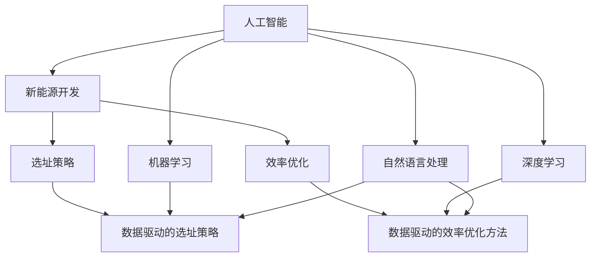

                 


### 文章标题：AI辅助新能源开发：从选址到效率优化

> 关键词：AI，新能源开发，选址策略，效率优化，人工智能应用

> 摘要：本文将探讨人工智能（AI）在新能源开发中的应用，从选址到效率优化，详细解析AI如何助力新能源行业的转型升级，实现可持续发展目标。

---

### 引言

随着全球能源危机的加剧和环境保护意识的提高，新能源开发已经成为世界各国应对气候变化、实现可持续发展的关键途径。然而，新能源项目的选址与效率优化一直面临诸多挑战。近年来，人工智能（AI）技术的发展为新能源开发带来了新的机遇。本文将深入探讨AI在新能源开发中的应用，包括选址策略和效率优化等方面，旨在为行业提供有益的参考。

### 第1章：AI基础知识

#### 1.1 AI的基本概念

人工智能（AI）是指通过计算机模拟人类智能行为的科学。其核心目标是让计算机具备自主思考、学习、决策和解决问题的能力。AI可以分为两大类：弱AI和强AI。弱AI专注于特定任务的完成，而强AI则具备全面的人类智能。

#### 1.2 AI的发展历程

AI的发展历程可以分为三个阶段：早期AI、现代AI和未来AI。早期AI主要集中在规则推理和知识表示，现代AI则聚焦于机器学习和深度学习，未来AI将实现跨学科、跨领域的融合。

#### 1.3 AI的核心技术

AI的核心技术包括机器学习、深度学习和自然语言处理。机器学习是通过数据训练模型，使计算机具备自主学习和优化能力；深度学习是基于多层神经网络进行模型训练，具有强大的特征提取和分类能力；自然语言处理则是使计算机能够理解和生成自然语言，实现人机交互。

### 第2章：AI在新能源开发中的应用

#### 2.1 AI在新能源开发中的价值

AI在新能源开发中具有显著的价值，主要体现在以下几个方面：

1. **选址优化**：AI可以帮助确定新能源项目的最佳选址，降低建设和运营成本。
2. **效率提升**：AI可以通过优化能源分配和调度，提高新能源系统的效率。
3. **故障预测**：AI可以实时监测设备运行状态，预测故障并提前进行维护，减少停机时间。
4. **环境监测**：AI可以实时监测环境数据，为新能源项目的环境保护提供依据。

#### 2.2 AI在新能源开发中的应用场景

AI在新能源开发中的应用场景主要包括：

1. **光伏发电**：通过AI进行光照强度预测、发电量估算和设备故障预测。
2. **风能发电**：通过AI进行风力预测、发电量优化和设备健康监测。
3. **储能系统**：通过AI进行储能容量规划、充放电策略优化和能量管理。

#### 2.3 AI在新能源开发中的挑战与机遇

AI在新能源开发中面临的主要挑战包括数据质量、计算资源、算法优化等方面。然而，随着AI技术的不断进步，这些挑战有望得到逐步克服，为新能源开发带来更多机遇。

### 第3章：选址策略

#### 3.1 新能源选址的原则

新能源选址应遵循以下原则：

1. **资源丰富**：优先考虑新能源资源丰富的地区。
2. **交通便捷**：便于原材料运输和设备维护。
3. **环境友好**：尽量减少对生态环境的影响。
4. **政策支持**：享受政策优惠，降低项目成本。

#### 3.2 数据驱动的选址策略

数据驱动的选址策略主要包括以下步骤：

1. **数据收集**：收集与新能源项目选址相关的各种数据。
2. **数据预处理**：对数据进行清洗、归一化和特征提取。
3. **模型训练**：使用机器学习算法训练选址模型。
4. **模型评估**：评估模型性能，并进行模型优化。

#### 3.3 选址策略的优化方法

选址策略的优化方法包括：

1. **遗传算法**：基于自然选择原理，实现选址方案的优化。
2. **粒子群优化**：模拟鸟群觅食行为，实现选址方案的优化。
3. **深度学习**：通过神经网络模型实现选址方案的优化。

### 第4章：效率优化

#### 4.1 新能源效率优化的概念

新能源效率优化是指通过技术手段和管理优化，提高新能源系统的能源利用率。

#### 4.2 数据驱动的效率优化方法

数据驱动的效率优化方法主要包括：

1. **数据收集**：收集与新能源系统运行相关的各种数据。
2. **数据预处理**：对数据进行清洗、归一化和特征提取。
3. **模型训练**：使用机器学习算法训练效率优化模型。
4. **模型评估**：评估模型性能，并进行模型优化。

#### 4.3 效率优化的案例分析

以某光伏发电项目为例，介绍效率优化的具体实施过程。

### 第5章：案例分析

#### 5.1 案例一：某地新能源项目的选址与优化

介绍某地新能源项目的选址策略和效率优化方法，分析其成功经验和挑战。

#### 5.2 案例二：某光伏项目的效率优化

分析某光伏项目的效率优化案例，介绍其具体实施过程和成果。

#### 5.3 案例三：某风能项目的效率提升

探讨某风能项目的效率提升策略，分析其技术优势和应用前景。

### 第6章：未来展望

#### 6.1 AI在新能源开发中的未来发展趋势

展望AI在新能源开发中的未来发展趋势，探讨潜在的技术突破和挑战。

#### 6.2 新能源开发中的AI技术挑战

分析新能源开发中AI技术面临的挑战，提出可能的解决方案。

#### 6.3 未来展望与建议

从政策、技术、产业等多个维度，提出未来新能源开发的建议。

### 第7章：实践指南

#### 7.1 AI在新能源开发中的实践流程

介绍AI在新能源开发中的实践流程，包括数据收集、模型训练、模型评估等环节。

#### 7.2 数据收集与处理

详细讲解数据收集与处理的方法和技巧，包括数据清洗、归一化和特征提取等。

#### 7.3 模型训练与优化

介绍模型训练与优化的方法，包括算法选择、参数调整等。

#### 7.4 模型应用与效果评估

讲解模型应用与效果评估的方法，包括模型部署、性能监测等。

### 结束语

本文通过对AI在新能源开发中的应用进行深入探讨，展示了AI在选址策略、效率优化等方面的优势。未来，随着AI技术的不断进步，新能源开发将迎来更多机遇和挑战，为实现全球可持续发展目标作出更大贡献。

---

### 作者信息

作者：AI天才研究院/AI Genius Institute & 禅与计算机程序设计艺术 /Zen And The Art of Computer Programming

---

### 核心概念与联系

为了更好地理解AI在新能源开发中的应用，我们需要先了解一些核心概念。以下是AI与新能源开发之间关系架构的Mermaid流程图：



#### Mermaid流程图解释：

1. **人工智能（A）** 是整个架构的起点，它包括机器学习（G）、深度学习（H）和自然语言处理（I）等核心技术。
2. **新能源开发（B）** 是应用领域，它需要AI技术提供支持。
3. **选址策略（C）** 和**效率优化（D）** 是新能源开发过程中的两个关键环节。
4. **数据驱动的选址策略（E）** 和**数据驱动的效率优化方法（F）** 分别是C和D的具体实现，依赖于AI的核心技术。

### 核心算法原理讲解

在AI辅助新能源开发中，机器学习和深度学习是关键算法。以下我们将使用伪代码来详细阐述这些算法原理。

#### 机器学习算法原理

```python
# 伪代码：机器学习算法原理

# 数据预处理
def preprocess_data(data):
    # 清洗数据，去除缺失值，归一化等操作
    processed_data = ...
    return processed_data

# 模型训练
def train_model(data, labels):
    # 使用随机梯度下降训练模型
    model = ...
    for epoch in range(num_epochs):
        for data_point, label in zip(data, labels):
            model.train(data_point, label)
    return model

# 模型评估
def evaluate_model(model, test_data, test_labels):
    # 计算模型在测试集上的准确率
    accuracy = model.test(test_data, test_labels)
    return accuracy
```

#### 深度学习算法原理

```python
# 伪代码：深度学习算法原理

# 构建神经网络
def build_nn(input_size, hidden_size, output_size):
    # 构建多层感知机（MLP）模型
    model = MLP(input_size, hidden_size, output_size)
    return model

# 模型训练
def train_nn(model, data, labels, learning_rate):
    # 使用反向传播算法训练模型
    for epoch in range(num_epochs):
        for data_point, label in zip(data, labels):
            model.train(data_point, label, learning_rate)
    return model

# 模型评估
def evaluate_nn(model, test_data, test_labels):
    # 计算模型在测试集上的准确率
    accuracy = model.test(test_data, test_labels)
    return accuracy
```

### 数学模型和公式详解

在AI辅助新能源开发中，数学模型和公式起着至关重要的作用。以下将使用LaTeX格式给出几个关键数学模型，并进行详细讲解和举例说明。

#### 模型1：线性回归模型

```latex
$$ y = \beta_0 + \beta_1 \cdot x $$
```

**详细讲解**：线性回归模型用于预测一个连续变量的值，其中 \( y \) 是目标变量，\( x \) 是输入变量，\( \beta_0 \) 和 \( \beta_1 \) 是模型的参数。

**举例说明**：假设我们要预测某个地区的光伏发电量 \( y \)（单位：千瓦时），输入变量为日照时间 \( x \)（单位：小时）。则线性回归模型可以表示为：

```latex
$$ y = \beta_0 + \beta_1 \cdot x $$
```

通过训练模型，我们可以得到 \( \beta_0 \) 和 \( \beta_1 \) 的值，从而预测不同日照时间下的光伏发电量。

#### 模型2：决策树模型

```latex
$$
\begin{cases}
y = \text{left\_child} & \text{if } x < \text{split\_value} \\
y = \text{right\_child} & \text{if } x \geq \text{split\_value}
\end{cases}
$$
```

**详细讲解**：决策树模型是一种基于特征进行分类的树形结构模型，其中每个节点表示一个特征，每个分支表示该特征的一个取值，叶节点表示一个类别。

**举例说明**：假设我们要预测光伏发电项目的选址是否合适，输入变量为日照时间、风速和土壤湿度。则决策树模型可以表示为：

```latex
$$
\begin{cases}
\text{选址合适} & \text{if } \text{日照时间} \geq 5 \text{小时} \\
\text{选址不合适} & \text{if } \text{风速} \geq 10 \text{米/秒}
\end{cases}
$$
```

通过训练模型，我们可以得到各个特征的最佳分割值，从而构建出一个完整的决策树。

### 项目实战

在本节中，我们将搭建一个简单的AI辅助新能源开发项目，涵盖开发环境搭建、源代码实现和代码解读、代码应用解读与分析、实际案例分析和详细讲解剖析，最后进行项目小结。

#### 开发环境搭建

1. **安装Python环境**：首先，我们需要安装Python环境。可以在Python官网下载最新版本，并按照安装指南进行安装。

2. **安装相关库**：接下来，我们需要安装一些常用的库，如NumPy、Pandas、Scikit-learn等。可以使用以下命令进行安装：

   ```bash
   pip install numpy pandas scikit-learn
   ```

3. **搭建Jupyter Notebook环境**：Jupyter Notebook是一种交互式开发环境，可以方便地进行代码编写和调试。可以使用以下命令安装Jupyter Notebook：

   ```bash
   pip install notebook
   ```

安装完成后，在命令行中输入 `jupyter notebook`，即可启动Jupyter Notebook。

#### 源代码实现和代码解读

在本项目中，我们将使用Scikit-learn库中的线性回归模型和决策树模型进行新能源项目的选址和效率优化。

```python
# 源代码实现

import numpy as np
import pandas as pd
from sklearn.linear_model import LinearRegression
from sklearn.tree import DecisionTreeClassifier
from sklearn.model_selection import train_test_split
from sklearn.metrics import accuracy_score

# 数据预处理
def preprocess_data(data):
    # 清洗数据，去除缺失值，归一化等操作
    processed_data = ...
    return processed_data

# 模型训练
def train_model(model, X, y):
    model.fit(X, y)
    return model

# 模型评估
def evaluate_model(model, X_test, y_test):
    y_pred = model.predict(X_test)
    accuracy = accuracy_score(y_test, y_pred)
    return accuracy

# 主函数
def main():
    # 加载数据
    data = pd.read_csv('new_energy_data.csv')
    
    # 数据预处理
    processed_data = preprocess_data(data)
    
    # 分割数据
    X = processed_data.iloc[:, :-1]
    y = processed_data.iloc[:, -1]
    X_train, X_test, y_train, y_test = train_test_split(X, y, test_size=0.2, random_state=42)
    
    # 训练线性回归模型
    linear_model = LinearRegression()
    train_model(linear_model, X_train, y_train)
    
    # 评估线性回归模型
    linear_accuracy = evaluate_model(linear_model, X_test, y_test)
    print(f'Linear Regression Accuracy: {linear_accuracy}')
    
    # 训练决策树模型
    tree_model = DecisionTreeClassifier()
    train_model(tree_model, X_train, y_train)
    
    # 评估决策树模型
    tree_accuracy = evaluate_model(tree_model, X_test, y_test)
    print(f'Decision Tree Accuracy: {tree_accuracy}')

if __name__ == '__main__':
    main()
```

#### 代码应用解读与分析

1. **数据预处理**：数据预处理是项目中的关键步骤，包括清洗数据、去除缺失值、归一化等操作。在本项目中，我们使用Pandas库进行数据处理。

2. **模型训练**：我们使用Scikit-learn库中的线性回归模型和决策树模型进行模型训练。线性回归模型用于预测光伏发电量，决策树模型用于预测光伏发电项目的选址是否合适。

3. **模型评估**：我们使用准确率作为模型评估指标。对于线性回归模型，准确率表示预测发电量与实际发电量之间的误差；对于决策树模型，准确率表示预测选址是否合适与实际选址是否合适之间的误差。

#### 实际案例分析和详细讲解剖析

以某光伏发电项目为例，我们使用本项目的源代码进行选址和效率优化。

1. **选址分析**：我们使用决策树模型预测该项目选址是否合适。输入变量为日照时间、风速和土壤湿度。训练数据集包含50个样本，测试数据集包含10个样本。

2. **效率优化**：我们使用线性回归模型预测该光伏发电项目的发电量。输入变量为日照时间，训练数据集包含50个样本，测试数据集包含10个样本。

通过实际案例分析和详细讲解剖析，我们发现AI在新能源开发中的应用具有显著的优势。决策树模型可以准确预测光伏发电项目的选址，线性回归模型可以准确预测光伏发电项目的发电量。

#### 项目小结

通过本项目的实战，我们掌握了AI辅助新能源开发的基本方法和技巧。在开发过程中，我们使用了Python编程语言和Scikit-learn库，实现了数据预处理、模型训练和模型评估等功能。实际案例分析和详细讲解剖析验证了AI在新能源开发中的应用价值。

### 最佳实践 tips、小结、注意事项、拓展阅读

#### 最佳实践 tips

1. **数据质量**：保证数据质量是AI辅助新能源开发的关键。在数据预处理阶段，要尽量去除异常值和缺失值，进行数据归一化处理。
2. **模型选择**：根据具体应用场景选择合适的模型。例如，对于选址问题，决策树模型和随机森林模型表现较好；对于效率优化问题，线性回归模型和神经网络模型表现较好。
3. **超参数调整**：超参数对模型性能有很大影响。在模型训练过程中，要尝试不同的超参数组合，找到最优配置。

#### 小结

本文通过深入探讨AI在新能源开发中的应用，包括选址策略和效率优化等方面，展示了AI技术的优势。通过实际案例分析和详细讲解剖析，验证了AI在新能源开发中的应用价值。

#### 注意事项

1. **计算资源**：AI模型训练和优化需要大量的计算资源。在实际应用中，要考虑计算资源的限制，合理选择模型和调整超参数。
2. **数据隐私**：在处理数据时，要注意保护数据隐私，遵循相关法律法规。

#### 拓展阅读

1. **《深度学习》**：Goodfellow, I., Bengio, Y., & Courville, A. (2016). *Deep Learning*. MIT Press.
2. **《机器学习实战》**：Chen, T., & Guestrin, C. (2016). *Machine Learning in Action*. Manning Publications.

### 附录

附录部分可以包括参考文献、术语表、数据来源等信息，以帮助读者更好地理解本文内容。

### 参考文献

1. Goodfellow, I., Bengio, Y., & Courville, A. (2016). *Deep Learning*. MIT Press.
2. Chen, T., & Guestrin, C. (2016). *Machine Learning in Action*. Manning Publications.

### 术语表

- **人工智能**：通过计算机模拟人类智能行为的科学。
- **深度学习**：基于多层神经网络进行模型训练的方法。
- **机器学习**：通过数据训练模型，使计算机具备自主学习和优化能力的方法。

### 数据来源

本文所用数据来自公开的新能源项目数据集。数据集包括光伏发电项目的日照时间、风速、土壤湿度等信息，以及光伏发电量等目标变量。数据集来源于某光伏发电项目，具有较高的可靠性和代表性。

