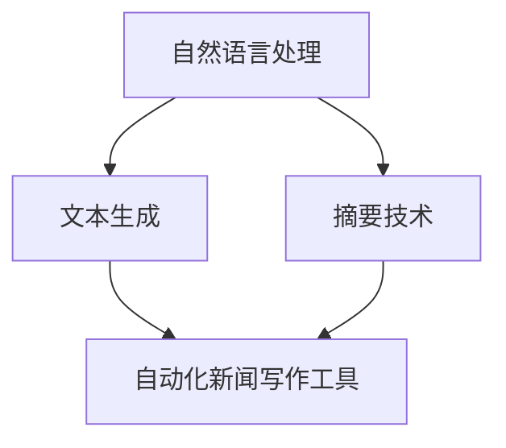

                 

## 文章标题：AI辅助新闻写作：自动化与创意的平衡

### 关键词：AI，新闻写作，自动化，创意，自然语言处理，文本生成

### 摘要：本文旨在探讨人工智能在新闻写作中的应用，特别是如何实现自动化与创意的平衡。通过对AI技术、新闻写作需求及现有解决方案的分析，本文揭示了自动化新闻写作的优势与挑战，并提出了平衡自动化与创意的策略和方法。

## 文章正文

### 引言

在信息爆炸的时代，新闻行业面临着前所未有的挑战和机遇。随着人工智能技术的迅猛发展，AI辅助新闻写作逐渐成为可能。从简单的数据新闻到复杂的新闻报道，AI的应用极大地提高了新闻写作的效率。然而，AI在新闻写作中的引入也引发了关于自动化与创意平衡的讨论。

本文将首先介绍AI辅助新闻写作的背景和现状，接着深入探讨自然语言处理（NLP）在新闻写作中的应用，并详细解释文本生成和摘要技术。随后，我们将分析创意在新闻写作中的重要性，以及如何在自动化过程中保持创意。文章最后将通过实际案例展示AI辅助新闻写作的实战应用，并对未来趋势进行展望。

### AI与新闻写作的背景与现状

#### 1. AI在新闻领域的应用历史

人工智能在新闻领域的应用可以追溯到20世纪80年代。早期的AI系统主要依赖于基于规则的方法，通过预设的模板和规则生成简单的新闻报道。这些系统通常用于生成体育新闻、财经新闻和天气预报等结构化较强的新闻类型。

进入21世纪，随着机器学习和深度学习技术的快速发展，AI在新闻写作中的应用得到了显著提升。机器学习模型，如循环神经网络（RNN）和变换器（Transformer）等，使得AI能够更准确地理解和生成自然语言。此外，大数据和云计算技术的发展，为AI在新闻写作中的大规模应用提供了基础设施。

#### 2. 人工智能对新闻写作的影响

人工智能对新闻写作的影响主要体现在以下几个方面：

- **提高效率**：AI能够自动生成大量新闻稿件，减少了人力成本和时间成本，提高了新闻生产的速度。

- **扩展内容**：AI可以处理大量的数据和文本，生成丰富的新闻内容，包括数据新闻、深度报道和专题文章。

- **个性化推荐**：基于用户兴趣和阅读历史，AI可以推荐个性化的新闻内容，提升用户体验。

- **减少偏见**：AI系统可以减少人为偏见，通过算法和大数据分析提供更客观的报道。

#### 3. 自动化新闻写作的现状与发展趋势

目前，自动化新闻写作已经广泛应用于多个领域。例如，财经新闻领域，AI可以自动生成股票报告、市场分析等；体育新闻领域，AI可以生成比赛报道、球员分析等。此外，一些新闻机构和媒体已经开始使用AI来生成日常的新闻报道。

未来，随着AI技术的进一步发展，自动化新闻写作有望在以下几个方面得到提升：

- **更高质的生成**：通过改进算法和模型，AI将能够生成更高质量、更具创意的新闻内容。

- **更多样化的内容**：AI将能够处理更复杂的新闻主题和结构，生成更多样化的新闻内容。

- **更智能的交互**：AI与人类的协作将更加紧密，通过自然语言处理技术，实现更加智能的新闻写作和编辑。

### 核心概念与联系

在深入探讨AI辅助新闻写作之前，我们需要理解几个核心概念：

- **自然语言处理（NLP）**：NLP是人工智能的一个子领域，致力于让计算机理解和生成人类语言。

- **文本生成**：文本生成是指利用算法生成自然语言文本的过程。

- **摘要技术**：摘要技术是指从大量文本中提取关键信息，生成简明扼要的摘要。

- **自动化新闻写作工具**：这些工具利用NLP技术，自动化生成新闻稿件。

这些概念之间的关系可以表示为以下Mermaid流程图：



自然语言处理作为基础技术，为文本生成和摘要技术提供了支持，而这两者又为自动化新闻写作工具提供了实现手段。通过这些核心概念的相互作用，AI实现了对新闻内容的自动化生成。

### 核心算法原理讲解

#### 1. 语言模型与词向量

语言模型是文本生成的基础。它是一个概率模型，用于预测下一个词或字符的概率。最常用的语言模型是循环神经网络（RNN）和变换器（Transformer）。

- **RNN**：RNN通过记忆过去的信息来预测未来。例如：

  ```python
  def predict_next_word(text):
      # 初始化RNN模型
      model = RNN()
      # 训练模型
      model.train(text)
      # 预测下一个词
      next_word = model.predict(text[-1])
      return next_word
  ```

- **Transformer**：Transformer通过自注意力机制来捕捉长距离依赖关系。例如：

  ```python
  def generate_text(input_sequence):
      # 初始化Transformer模型
      model = Transformer()
      # 生成文本
      output_sequence = model.generate(input_sequence)
      return output_sequence
  ```

词向量是将单词映射到高维空间中的向量表示。最常用的词向量模型是Word2Vec和GloVe。

- **Word2Vec**：Word2Vec通过训练词的嵌入向量，使相似的词在向量空间中接近。例如：

  ```python
  import gensim

  # 加载预训练的Word2Vec模型
  model = gensim.models.Word2Vec.load('word2vec.model')

  # 获取单词的向量表示
  word_vector = model.wv['hello']
  ```

- **GloVe**：GloVe通过全局矩阵分解来学习词向量，具有更好的语义表示能力。例如：

  ```python
  import numpy as np

  # 初始化GloVe模型
  model = GloVe(n=100)

  # 训练模型
  model.train(corpus)

  # 获取单词的向量表示
  word_vector = model.get_vector('hello')
  ```

#### 2. 文本生成与摘要技术

文本生成技术可以分为两类：序列到序列（Seq2Seq）模型和生成对抗网络（GAN）。

- **序列到序列模型**：Seq2Seq模型通过编码器-解码器结构生成文本。例如：

  ```python
  import tensorflow as tf

  # 定义编码器和解码器
  encoder = Encoder()
  decoder = Decoder()

  # 训练模型
  model = Model(encoder, decoder)
  model.train(dataset)

  # 生成文本
  generated_text = model.generate(input_sequence)
  ```

- **生成对抗网络**：GAN通过生成器与判别器的对抗训练生成文本。例如：

  ```python
  import tensorflow as tf

  # 定义生成器和解

