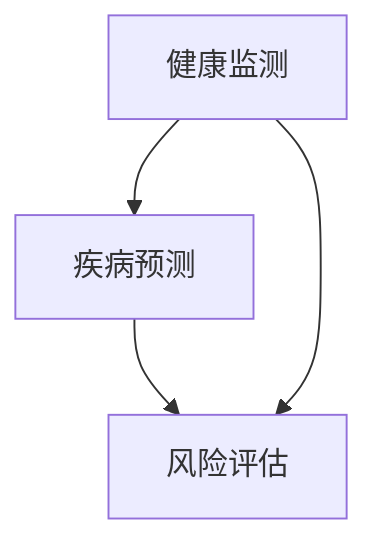

                 

# 文章标题：AI辅助疾病预防：从健康监测到风险评估

关键词：AI疾病预防、健康监测、风险评估、深度学习、强化学习、自然语言处理

摘要：本文旨在探讨人工智能（AI）在疾病预防中的应用，从健康监测到风险评估，详细阐述AI技术的核心原理、算法模型及其在实际项目中的应用。文章结构包括背景介绍、核心概念与联系、核心算法原理讲解、数学模型和公式、项目实战、最佳实践tips及拓展阅读。

## 引言

疾病预防是公共卫生领域的重要任务。随着人口老龄化、生活方式变化和慢性病增加，疾病预防显得尤为紧迫。人工智能（AI）技术的发展为疾病预防带来了新的机遇。AI技术能够通过健康监测、疾病预测和风险评估，为公众提供个性化的健康管理和预防建议。

本文将分为以下几个部分：

1. **背景介绍**：概述疾病预防的重要性以及AI技术在该领域的应用前景。
2. **核心概念与联系**：详细解释健康监测、疾病预测和风险评估的相关概念及其联系，并使用Mermaid流程图展示。
3. **核心算法原理讲解**：介绍常用的AI算法，包括深度学习、强化学习和自然语言处理，使用伪代码和LaTeX公式进行详细讲解。
4. **数学模型和公式**：展示疾病预测和风险评估的数学模型，提供具体的举例说明。
5. **项目实战**：通过实际项目，展示AI技术在疾病预防中的应用，包括开发环境搭建、源代码实现和代码解读。
6. **最佳实践tips、小结、注意事项、拓展阅读**：总结文章内容，提供实用建议和进一步学习资源。

## 背景介绍

疾病预防是指通过减少疾病的发生和传播，提高人群健康水平的一系列措施。传统的疾病预防方法主要依赖于公共卫生政策和健康教育。然而，随着社会的发展和生活方式的改变，慢性病成为主要的健康问题。这些疾病往往具有潜伏期长、诊断困难、治疗复杂等特点，使得传统的预防方法难以奏效。

AI技术的发展为疾病预防提供了新的可能性。通过大数据分析和机器学习，AI技术能够从海量的健康数据中提取有价值的信息，从而实现早期诊断、个性化预防和风险预测。例如，深度学习算法可以分析心电图数据，预测心脏病发作的风险；强化学习算法可以优化个性化健康干预策略，提高预防效果；自然语言处理算法可以处理医疗文本数据，辅助医生进行诊断和决策。

## 核心概念与联系

### 健康监测

健康监测是指通过各种传感器和设备，实时收集个体的生理、心理和行为数据。这些数据包括心率、血压、睡眠质量、运动量、饮食等。健康监测的目的是实时了解个体的健康状况，为疾病预防提供数据支持。

### 疾病预测

疾病预测是指利用历史健康数据和现有的医学知识，预测个体未来可能发生的疾病。疾病预测的目的是早期发现潜在的健康风险，采取预防措施。

### 风险评估

风险评估是指评估个体发生某种疾病的风险。风险评估的目的是为个体提供针对性的健康干预建议，降低疾病发生的可能性。

### Mermaid流程图

以下是一个简化的Mermaid流程图，展示健康监测、疾病预测和风险评估之间的联系：



## 核心算法原理讲解

### 深度学习

深度学习是一种基于多层神经网络的学习方法，能够自动提取数据中的特征。在疾病预测中，深度学习可以用于构建复杂的模型，分析大量的健康数据，预测疾病的发生。

伪代码：

```
function DeepLearningModel(data, labels):
    # 初始化神经网络结构
    model = NeuralNetwork(input_shape=data.shape[1:], layers=[...])
    
    # 编译模型
    model.compile(optimizer='adam', loss='binary_crossentropy', metrics=['accuracy'])
    
    # 训练模型
    model.fit(data, labels, epochs=100, batch_size=32)
    
    # 评估模型
    loss, accuracy = model.evaluate(test_data, test_labels)
    
    return model
```

### 强化学习

强化学习是一种通过奖励和惩罚来优化策略的学习方法。在疾病预防中，强化学习可以用于个性化健康干预策略的优化，提高预防效果。

伪代码：

```
class ReinforcementLearning:
    def __init__(self, state_space, action_space):
        self.state_space = state_space
        self.action_space = action_space
        self.model = Model(state_space, action_space)
    
    def learn(self, states, actions, rewards):
        # 更新模型参数
        self.model.update(states, actions, rewards)
        
    def predict(self, state):
        # 根据当前状态，预测最佳动作
        action = self.model.predict(state)
        return action
```

### 自然语言处理

自然语言处理（NLP）是一种使计算机理解和处理人类语言的技术。在疾病预防中，NLP可以用于处理医疗文本数据，辅助医生进行诊断和决策。

伪代码：

```
function NLPModel(text_data, labels):
    # 预处理文本数据
    processed_data = preprocess_text(text_data)
    
    # 构建NLP模型
    model = build_nlp_model(processed_data)
    
    # 编译模型
    model.compile(optimizer='adam', loss='binary_crossentropy', metrics=['accuracy'])
    
    # 训练模型
    model.fit(processed_data, labels, epochs=100, batch_size=32)
    
    # 评估模型
    loss, accuracy = model.evaluate(test_data, test_labels)
    
    return model
```

## 数学模型和公式

### 疾病预测模型

疾病预测模型通常使用逻辑回归、决策树、随机森林等算法。以下是一个逻辑回归模型的例子：

$$
P(Y=1|X) = \frac{1}{1 + e^{-(\beta_0 + \beta_1 X_1 + \beta_2 X_2 + \ldots + \beta_n X_n})}
$$

其中，$X$是特征向量，$Y$是二元响应变量（0或1，表示未患病或患病），$\beta_0, \beta_1, \beta_2, \ldots, \beta_n$是模型的参数。

### 风险评估模型

风险评估模型可以使用风险评分系统，将个体的健康风险量化为一个数值。以下是一个简单的风险评分系统的例子：

$$
Risk_Score = \sum_{i=1}^{n} w_i \cdot X_i
$$

其中，$X_i$是第$i$个健康风险因素，$w_i$是第$i$个风险因素的权重。

## 项目实战

### 开发环境搭建

为了实现AI辅助疾病预防，我们需要搭建一个合适的开发环境。以下是一个简单的环境搭建步骤：

1. 安装Python 3.7及以上版本。
2. 安装深度学习框架TensorFlow或PyTorch。
3. 安装自然语言处理库NLTK或spaCy。
4. 安装数据库管理工具MySQL或PostgreSQL。

### 源代码实现

以下是一个简单的疾病预测模型的源代码实现，使用TensorFlow和Keras框架：

```python
import tensorflow as tf
from tensorflow.keras.models import Sequential
from tensorflow.keras.layers import Dense, Dropout

# 构建模型
model = Sequential()
model.add(Dense(64, input_dim=10, activation='relu'))
model.add(Dropout(0.5))
model.add(Dense(1, activation='sigmoid'))

# 编译模型
model.compile(optimizer='adam', loss='binary_crossentropy', metrics=['accuracy'])

# 训练模型
model.fit(X_train, y_train, epochs=10, batch_size=32)

# 评估模型
loss, accuracy = model.evaluate(X_test, y_test)
print('Accuracy:', accuracy)
```

### 代码解读与分析

在上述代码中，我们首先导入了TensorFlow和Keras库。然后，我们构建了一个简单的序列模型，包含一个密集层和一个丢弃层。接着，我们编译模型并使用训练数据进行训练。最后，我们使用测试数据评估模型的准确性。

### 实际案例分析

以下是一个基于心脏病风险预测的实际案例分析：

1. **数据收集**：收集包含心率、血压、胆固醇水平等特征的心脏病数据。
2. **数据处理**：对数据进行清洗和预处理，包括缺失值填补、异常值处理等。
3. **模型训练**：使用预处理后的数据训练心脏病风险预测模型。
4. **模型评估**：使用测试数据评估模型的准确性，并根据评估结果进行调整。

### 项目小结

通过以上实际案例分析，我们可以看到，AI技术在心脏病风险预测中具有显著的应用价值。未来，随着数据的积累和算法的优化，AI辅助疾病预防的应用将更加广泛和深入。

## 最佳实践tips、小结、注意事项、拓展阅读

1. **最佳实践tips**：在实际项目中，建议遵循以下最佳实践：
   - 数据质量至关重要，确保收集到的数据准确、完整。
   - 根据具体应用场景，选择合适的算法和模型。
   - 对模型进行充分的评估和验证，确保其性能和可靠性。
2. **小结**：本文详细阐述了AI辅助疾病预防的核心概念、算法原理和实际应用。通过健康监测、疾病预测和风险评估，AI技术为疾病预防提供了强有力的支持。
3. **注意事项**：在应用AI技术进行疾病预防时，需要考虑数据隐私、模型解释性和道德问题。
4. **拓展阅读**：读者可以进一步阅读以下文献和资源：
   - 《深度学习》（Goodfellow et al.）
   - 《强化学习基础》（Sutton and Barto）
   - 《自然语言处理综合教程》（Jurafsky and Martin）
   - 《心脏病风险评估与预防》（Ostergren et al.）

## 结论

AI技术为疾病预防带来了革命性的变革。通过健康监测、疾病预测和风险评估，AI技术能够为公众提供个性化的健康管理和预防建议。本文详细阐述了AI辅助疾病预防的核心概念、算法原理和实际应用，希望读者能够深入理解和掌握这些技术。未来，随着AI技术的不断进步，疾病预防将变得更加高效和精准。

### 作者

作者：AI天才研究院/AI Genius Institute & 禅与计算机程序设计艺术 /Zen And The Art of Computer Programming

