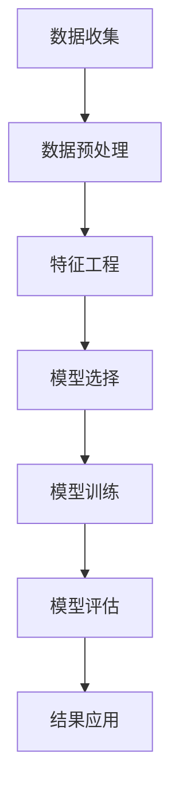

                 

### 文章标题

# AI辅助科学研究：机遇与挑战

### 关键词

- 人工智能
- 科学研究
- 机器学习
- 深度学习
- 数据科学
- 数据隐私

### 摘要

本文将深入探讨人工智能（AI）在科学研究中的应用，分析其带来的机遇与挑战。首先，我们将回顾AI的发展历程及其在科学研究中的重要性。接着，本文将详细介绍AI辅助科学研究的核心概念、方法及实践。随后，通过具体案例展示AI在多个科学领域的应用，并探讨其前沿技术及面临的挑战。最后，本文将总结AI辅助科学研究的趋势与未来展望，为科研人员提供参考和启示。

### 目录大纲

```markdown
# AI辅助科学研究：机遇与挑战

## 第一部分：AI辅助科学研究的概述

### 第1章：AI辅助科学研究的背景和意义

### 第2章：AI辅助科学研究的核心概念与联系

## 第二部分：AI辅助科学研究的方法与实践

### 第3章：数据预处理与特征工程

### 第4章：机器学习算法原理与实现

### 第5章：深度学习算法原理与应用

### 第6章：AI辅助科学研究的数学模型与公式

### 第7章：AI辅助科学研究的实战案例

## 第三部分：AI辅助科学研究的前沿与挑战

### 第8章：AI辅助科学研究的前沿技术

### 第9章：AI辅助科学研究的挑战与展望

## 结论

## 参考文献
```

接下来，我们将按照目录大纲逐步展开，详细讨论每一个章节的内容。

### 第一部分：AI辅助科学研究的概述

#### 第1章：AI辅助科学研究的背景和意义

##### 1.1 AI的发展与科学研究的关系

人工智能（AI）是计算机科学的一个分支，旨在使计算机具备人类智能的某些特征，如学习、推理、感知和解决问题。自从20世纪50年代AI概念首次提出以来，AI技术经历了多个发展阶段。从最初的符号主义和专家系统，到基于数据的机器学习和深度学习，AI技术不断取得突破，逐渐在各个领域展现出强大的应用潜力。

科学研究作为人类探索自然规律、揭示事物本质的重要活动，一直依赖于各种工具和技术的支持。传统的研究方法通常依赖于人类专家的直觉和经验，但在面对海量数据、复杂问题和非线性关系时，这些方法的效率和精度都受到了限制。随着AI技术的发展，研究人员开始探索如何利用AI技术来提升科学研究的效率、拓展研究边界。

AI与科学研究的关系可以从以下几个方面来理解：

1. **数据分析与挖掘**：科学研究过程中产生的数据量庞大且复杂，AI技术可以有效地处理和分析这些数据，提取有价值的信息和知识。
2. **模式识别与预测**：AI技术可以帮助研究人员发现数据中的规律和模式，预测未来的趋势和变化，从而为研究提供指导。
3. **自动化实验**：AI技术可以自动化执行实验流程，减少人为干预，提高实验的准确性和可重复性。
4. **跨学科融合**：AI技术不仅能够应用于单一学科的研究，还可以促进不同学科之间的交叉融合，推动科学领域的创新。

##### 1.2 AI辅助科学研究的优势和挑战

AI辅助科学研究具有多方面的优势，但也面临一些挑战。

**优势：**

1. **效率提升**：AI技术可以快速处理和分析大量数据，大大缩短研究周期，提高研究效率。
2. **精确度提高**：AI技术通过机器学习和深度学习算法，能够更准确地识别数据中的模式和规律，减少人为误差。
3. **跨学科应用**：AI技术可以应用于多个科学领域，促进不同学科之间的交叉融合，推动科学进步。
4. **创新能力增强**：AI技术可以为研究人员提供新的工具和方法，激发他们的创新思维，开拓研究领域。

**挑战：**

1. **数据隐私与伦理问题**：科学研究中涉及大量敏感数据，如何保护数据隐私和安全成为一大挑战。
2. **算法透明性与可解释性**：深度学习等复杂算法的黑箱特性使其难以解释，这给科学研究带来了不确定性。
3. **计算资源需求**：AI算法通常需要大量的计算资源和时间，这对科研设施的配备提出了更高要求。
4. **人才培养与知识更新**：随着AI技术的快速发展，科研人员需要不断学习新的知识和技能，以应对不断变化的技术环境。

##### 1.3 AI辅助科学研究的现状与趋势

近年来，AI技术在科学研究中的应用取得了显著进展。以下是一些具体现状和趋势：

1. **生物信息学**：AI技术被广泛应用于基因序列分析、蛋白质结构预测和药物发现等领域，提高了研究效率。
2. **物理学**：AI技术在粒子物理学、材料科学和气候变化等领域发挥着重要作用，帮助研究人员解决复杂问题。
3. **环境科学**：AI技术可以用于环境监测、生态保护和资源管理，为可持续发展提供支持。
4. **社会科学**：AI技术在社会调查、民意分析和行为研究等领域展现出巨大潜力，促进了社会科学研究的精确性和深度。

未来，随着AI技术的进一步发展，预计将在更多科学领域得到应用。例如，量子计算、脑机接口和智能传感器等前沿技术将推动AI在科学研究中的深入发展。同时，跨学科合作和数据共享将成为AI辅助科学研究的重要趋势，为科学研究带来新的机遇和挑战。

##### 1.4 本章小结

本章介绍了AI辅助科学研究的背景、优势和挑战，以及当前的现状与趋势。AI技术在科学研究中的应用正不断拓展，为研究人员提供了强大的工具和方法。然而，AI技术在科学研究中的应用也面临一些挑战，需要科研人员、政策制定者和技术专家共同关注和解决。通过深入探讨这些问题，可以为未来的AI辅助科学研究提供有益的参考。

---

### 第2章：AI辅助科学研究的核心概念与联系

##### 2.1 人工智能的基本概念

人工智能（Artificial Intelligence，简称AI）是计算机科学的一个分支，旨在研究、开发和应用使计算机系统具有智能行为的技术和理论。人工智能的定义和范畴随着时间和技术的发展不断演变，但其核心目标始终是模拟、扩展和增强人类智能。

**AI的主要特征：**

1. **学习与自适应**：AI系统可以通过学习从数据中提取知识，并根据新信息进行自适应调整。
2. **推理与问题解决**：AI系统能够基于已有知识和信息进行逻辑推理，解决复杂问题。
3. **感知与交互**：AI系统可以感知外部环境，与人类或其他系统进行自然语言交互。
4. **自主行动**：AI系统可以在没有人类干预的情况下自主执行任务和决策。

**AI的发展历程：**

1. **符号主义阶段（1950s-1980s）**：这一阶段的AI以基于符号逻辑的专家系统和知识表示方法为主，试图模拟人类专家的推理能力。
2. **基于数据的方法（1990s-2000s）**：随着计算能力和数据量的增加，机器学习方法逐渐兴起，如决策树、支持向量机和神经网络。
3. **深度学习时代（2010s至今）**：深度学习技术的突破使得AI在图像识别、语音识别和自然语言处理等领域取得了显著成果。

##### 2.2 数据科学在科学研究中的应用

数据科学是另一个与AI密切相关的重要领域，它结合了统计学、计算机科学、信息科学和领域知识，旨在从数据中提取有价值的信息和知识。数据科学在科学研究中的应用非常广泛，以下是一些关键应用：

**数据收集与清洗：**

1. **数据收集**：通过传感器、实验、问卷调查等方式收集科学研究所需的数据。
2. **数据清洗**：去除数据中的噪声、错误和不完整信息，确保数据质量。

**数据分析与挖掘：**

1. **描述性分析**：用于总结和描述数据的基本特征和趋势。
2. **预测性分析**：利用统计模型和机器学习算法预测未来的趋势和变化。
3. **因果推断**：通过数据分析识别因果关系，为研究提供指导。

**可视化与交互：**

1. **数据可视化**：通过图形、图表等方式展示数据，帮助研究人员直观理解数据。
2. **交互式分析**：提供用户友好的界面，允许研究人员动态地探索和分析数据。

**应用场景：**

1. **生物信息学**：基因序列分析、蛋白质结构预测和药物发现。
2. **环境科学**：气候变化、生态保护和资源管理。
3. **社会科学**：社会调查、民意分析和行为研究。
4. **物理学**：粒子物理学、材料科学和量子计算。

##### 2.3 机器学习与深度学习在科学研究中的作用

**机器学习（Machine Learning，ML）** 是AI的一个子领域，主要研究如何让计算机通过数据学习并改进其性能。机器学习方法可以分为监督学习、无监督学习和半监督学习。

1. **监督学习（Supervised Learning）**：通过已标记的数据进行学习，输出结果与预期标签进行比较，通过优化算法调整模型参数。
2. **无监督学习（Unsupervised Learning）**：没有已标记的数据，主要任务是发现数据中的结构和模式，如聚类和降维。
3. **半监督学习（Semi-supervised Learning）**：结合监督学习和无监督学习，利用少量标记数据和大量未标记数据共同训练模型。

**深度学习（Deep Learning，DL）** 是一种特殊的机器学习方法，采用多层神经网络对数据进行学习。深度学习在图像识别、语音识别和自然语言处理等领域取得了突破性进展。

在科学研究中的应用：

1. **生物信息学**：深度学习被广泛应用于基因序列分析、蛋白质结构预测和药物设计。
2. **物理学**：深度学习用于预测物理现象、优化实验设计和发现新材料。
3. **环境科学**：深度学习在环境监测、生态保护和资源管理中发挥重要作用。
4. **社会科学**：深度学习在社会调查、民意分析和行为研究中展现出巨大潜力。

##### 2.4 Mermaid流程图：AI辅助科学研究的整体流程

以下是一个简单的Mermaid流程图，展示了AI辅助科学研究的基本流程：



**图2-1 AI辅助科学研究的整体流程**

- **数据收集**：从各种来源收集科学研究所需的数据。
- **数据预处理**：清洗和转换数据，使其适合机器学习算法。
- **特征工程**：提取和选择对模型性能有重要影响的数据特征。
- **模型选择**：根据研究需求选择合适的机器学习模型。
- **模型训练**：使用训练数据对模型进行训练，优化模型参数。
- **模型评估**：使用验证数据评估模型性能，调整模型参数。
- **结果应用**：将训练好的模型应用于实际问题，提取有价值的信息。

通过上述流程，AI技术能够有效地辅助科学研究，提高研究效率和质量。

##### 2.5 本章小结

本章介绍了AI辅助科学研究的核心概念，包括人工智能的基本概念、数据科学的应用以及机器学习和深度学习在科学研究中的作用。通过Mermaid流程图，我们了解了AI辅助科学研究的整体流程。这些核心概念和联系为后续章节的深入探讨奠定了基础。

---

### 第二部分：AI辅助科学研究的方法与实践

#### 第3章：数据预处理与特征工程

##### 3.1 数据收集与清洗

数据是科学研究的基石，数据的质量直接影响研究结果的可靠性。数据收集是科学研究的第一步，涉及从各种来源获取所需的数据。数据来源可能包括实验数据、调查问卷、公共数据库和第三方数据提供商等。数据收集过程中，需要确保数据的准确性和完整性。

**数据清洗**是数据预处理的重要步骤，旨在去除数据中的噪声、错误和不完整信息，以提高数据质量。数据清洗的主要任务包括：

1. **去除重复数据**：重复数据会影响数据分析的准确性，需要通过去重操作进行删除。
2. **填充缺失值**：缺失值可能影响模型训练和数据分析，可以通过均值、中位数或插值等方法进行填充。
3. **处理异常值**：异常值可能对模型训练和数据分析产生负面影响，可以通过异常值检测和替换等方法进行处理。

**案例：**假设我们进行一项关于消费者购买行为的研究，数据来源是客户的购物记录。在数据收集阶段，我们从多个零售商的数据库中获取了客户的购买信息。在数据清洗阶段，我们需要去除重复的购买记录、填充缺失的购买金额，并处理异常值，如异常高的购买金额。

##### 3.2 数据预处理方法

数据预处理是使数据适合机器学习模型训练的关键步骤。数据预处理方法包括数据转换、数据归一化和数据标准化等。

**数据转换**：数据转换是将数据从一种形式转换为另一种形式，以便更好地进行数据分析。例如，将分类数据转换为数值数据，或将时间序列数据转换为适合分析的形式。

**数据归一化**：数据归一化是通过缩放数据，使其具有相同的尺度，从而消除不同特征之间的量纲差异。常见的归一化方法包括最小-最大缩放和Z-score标准化。

**数据标准化**：数据标准化是将数据缩放到特定的区间，通常是在[0, 1]或[-1, 1]之间。数据标准化可以消除不同特征之间的比例差异，使模型训练更加稳定。

**案例：**假设我们有一组客户购买行为数据，包括购买金额、购买频率和购买种类等特征。在数据预处理阶段，我们需要将分类数据转换为数值数据，对购买金额进行归一化，将购买频率进行标准化处理。

##### 3.3 特征工程的核心原则

特征工程是使数据特征对模型训练有更好表现的关键步骤。良好的特征工程可以显著提高模型的性能和可解释性。特征工程的核心原则包括：

1. **选择重要特征**：选择对模型训练有重要影响的特征，去除冗余和无关特征。
2. **构建新特征**：通过组合现有特征或引入新的特征，提高模型的解释性和性能。
3. **特征缩放和转换**：对特征进行缩放和转换，使其具有相同的尺度，提高模型训练的稳定性。
4. **特征降维**：通过降维技术，减少特征的数量，提高模型的训练速度和可解释性。

**案例：**假设我们进行一项关于信用卡欺诈检测的研究，特征包括交易金额、交易时间、交易地点和用户历史交易记录等。在特征工程阶段，我们需要选择对欺诈检测有重要影响的特征，如交易金额和用户历史交易记录，并构建新的特征，如交易时间与交易金额的比值。

##### 3.4 特征选择与降维技术

**特征选择**是从大量特征中选出对模型训练有重要影响的关键特征。特征选择的方法可以分为过滤式、包装式和嵌入式等。

**过滤式特征选择**：通过评估特征与目标变量之间的相关性，选择相关性较高的特征。常见的过滤式特征选择方法包括互信息、卡方检验和F检验等。

**包装式特征选择**：通过迭代地训练和评估模型，选择最优特征组合。常见的包装式特征选择方法包括递归特征消除（RFE）和遗传算法等。

**嵌入式特征选择**：在模型训练过程中同时进行特征选择，通过模型训练的反馈动态调整特征权重。常见的嵌入式特征选择方法包括Lasso回归和随机森林等。

**降维技术**：降维是将高维数据映射到低维空间，减少数据的维度，提高模型的训练速度和可解释性。常见的降维技术包括主成分分析（PCA）、线性判别分析（LDA）和自动编码器等。

**案例：**假设我们进行一项关于图像分类的研究，特征包括图像的每个像素值。在特征选择阶段，我们使用互信息方法选择对分类任务有重要影响的像素值。在降维阶段，我们使用PCA技术将高维特征映射到低维空间。

##### 3.5 本章小结

本章介绍了数据预处理与特征工程的核心概念和方法。数据预处理包括数据收集、数据清洗、数据转换和特征缩放等步骤，旨在提高数据质量，使其适合机器学习模型训练。特征工程的核心原则包括选择重要特征、构建新特征和特征缩放等。特征选择与降维技术是特征工程的重要工具，用于提高模型性能和可解释性。通过本章的学习，读者可以掌握数据预处理与特征工程的方法，为后续的机器学习算法实现和应用打下基础。

---

#### 第4章：机器学习算法原理与实现

##### 4.1 监督学习算法

监督学习是一种机器学习方法，通过已有标记数据学习输入和输出之间的映射关系。监督学习算法可以分为分类算法和回归算法。

**分类算法**：分类算法用于将输入数据分为不同的类别。常见的分类算法包括逻辑回归、决策树和支持向量机（SVM）。

**逻辑回归**：逻辑回归是一种广义线性模型，用于预测二分类问题。逻辑回归模型通过拟合一个线性函数，并将输出通过逻辑函数转换为概率。逻辑回归的数学模型如下：

$$
\hat{y} = \sigma(w_0 + \sum_{i=1}^{n} w_i x_i)
$$

其中，$y$是实际类别标签，$\hat{y}$是预测概率，$\sigma$是逻辑函数，$w_0$和$w_i$是模型参数，$x_i$是特征值。

**决策树**：决策树是一种基于树结构的分类算法，通过一系列决策规则将输入数据划分为不同的类别。决策树的生成过程包括特征选择、划分点和节点划分。常见的特征选择方法包括信息增益、基尼指数和熵等。决策树的数学模型可以表示为：

$$
T = \{ t_1, t_2, ..., t_n \}
$$

其中，$t_i$表示决策树的内部节点或叶子节点，每个节点对应一个特征划分规则。

**支持向量机（SVM）**：支持向量机是一种基于间隔最大化原则的分类算法，通过找到一个最优超平面，将不同类别的数据点分隔开。SVM的数学模型如下：

$$
\min_{w, b} \frac{1}{2} ||w||^2 + C \sum_{i=1}^{n} \max(0, 1 - y_i (w \cdot x_i + b))
$$

其中，$w$和$b$是模型参数，$C$是惩罚参数，$x_i$和$y_i$分别是输入特征和实际类别标签。

**实现示例：**以下是一个简单的Python代码示例，展示了逻辑回归的实现：

```python
from sklearn.linear_model import LogisticRegression
from sklearn.model_selection import train_test_split
from sklearn.metrics import accuracy_score

# 示例数据
X = [[1, 2], [2, 3], [3, 4], [4, 5]]
y = [0, 0, 1, 1]

# 数据划分
X_train, X_test, y_train, y_test = train_test_split(X, y, test_size=0.2, random_state=42)

# 模型训练
model = LogisticRegression()
model.fit(X_train, y_train)

# 模型预测
y_pred = model.predict(X_test)

# 模型评估
accuracy = accuracy_score(y_test, y_pred)
print(f"Accuracy: {accuracy}")
```

**回归算法**：回归算法用于预测连续数值输出。常见的回归算法包括线性回归、岭回归和套索回归等。

**线性回归**：线性回归是一种简单的回归算法，通过拟合一个线性函数来预测输出。线性回归的数学模型如下：

$$
y = \beta_0 + \beta_1 x
$$

其中，$y$是实际输出，$\beta_0$和$\beta_1$是模型参数，$x$是输入特征。

**岭回归**：岭回归是线性回归的一个变种，通过引入正则化项，防止模型过拟合。岭回归的数学模型如下：

$$
\min_{\beta} \sum_{i=1}^{n} (y_i - \beta_0 - \sum_{j=1}^{p} \beta_j x_{ij})^2 + \lambda \sum_{j=1}^{p} \beta_j^2
$$

其中，$\lambda$是正则化参数。

**套索回归**：套索回归是岭回归的一个变种，通过引入L1正则化，实现特征选择。套索回归的数学模型如下：

$$
\min_{\beta} \sum_{i=1}^{n} (y_i - \beta_0 - \sum_{j=1}^{p} \beta_j x_{ij})^2 + \lambda \sum_{j=1}^{p} |\beta_j|
$$

**实现示例：**以下是一个简单的Python代码示例，展示了岭回归的实现：

```python
from sklearn.linear_model import Ridge
from sklearn.model_selection import train_test_split
from sklearn.metrics import mean_squared_error

# 示例数据
X = [[1, 2], [2, 3], [3, 4], [4, 5]]
y = [1, 2, 2, 3]

# 数据划分
X_train, X_test, y_train, y_test = train_test_split(X, y, test_size=0.2, random_state=42)

# 模型训练
model = Ridge(alpha=1.0)
model.fit(X_train, y_train)

# 模型预测
y_pred = model.predict(X_test)

# 模型评估
mse = mean_squared_error(y_test, y_pred)
print(f"Mean Squared Error: {mse}")
```

##### 4.2 无监督学习算法

无监督学习是一种机器学习方法，没有已标记的输出数据，主要任务是发现数据中的结构和模式。常见的无监督学习算法包括聚类算法和降维算法。

**聚类算法**：聚类算法将数据点划分为不同的群组，使得同一群组内的数据点相似度较高，不同群组内的数据点相似度较低。常见的聚类算法包括K-means聚类和层次聚类等。

**K-means聚类**：K-means聚类是一种基于距离度量的聚类算法，通过迭代计算聚类中心，将数据点划分为K个群组。K-means聚类的数学模型如下：

$$
\min_{\mu_1, \mu_2, ..., \mu_K} \sum_{i=1}^{K} \sum_{x \in S_i} ||x - \mu_i||^2
$$

其中，$\mu_i$是第$i$个聚类中心，$S_i$是第$i$个群组内的数据点。

**实现示例：**以下是一个简单的Python代码示例，展示了K-means聚类的实现：

```python
from sklearn.cluster import KMeans
import numpy as np

# 示例数据
X = np.array([[1, 1], [1, 2], [1, 3], [1, 4], [2, 1], [2, 2], [2, 3], [2, 4]])

# K-means聚类
kmeans = KMeans(n_clusters=2, random_state=42)
kmeans.fit(X)

# 聚类结果
labels = kmeans.predict(X)
print(f"Cluster labels: {labels}")

# 聚类中心
centroids = kmeans.cluster_centers_
print(f"Cluster centroids: {centroids}")
```

**层次聚类**：层次聚类是一种基于层次结构的聚类算法，通过逐步合并或分裂数据点，形成层次聚类树。常见的层次聚类算法包括凝聚层次聚类和分裂层次聚类等。

**降维算法**：降维算法将高维数据映射到低维空间，减少数据的维度，提高模型的训练速度和可解释性。常见的降维算法包括主成分分析（PCA）和线性判别分析（LDA）等。

**主成分分析（PCA）**：主成分分析是一种基于方差最大化的降维算法，通过提取主要的几个主成分，保留数据的主要信息，降低数据维度。PCA的数学模型如下：

$$
\min_{Z} \sum_{i=1}^{n} \sum_{j=1}^{d} (z_{ij} - \bar{z}_j)^2
$$

其中，$Z$是降维后的数据，$\bar{z}_j$是第$j$个特征的平均值。

**实现示例：**以下是一个简单的Python代码示例，展示了PCA的实现：

```python
from sklearn.decomposition import PCA
import numpy as np

# 示例数据
X = np.array([[1, 2], [1, 4], [1, 0], [4, 2], [4, 4], [4, 0]])

# PCA降维
pca = PCA(n_components=2)
pca.fit(X)

# 降维后的数据
X_pca = pca.transform(X)
print(f"PCA transformed data: {X_pca}")

# 主成分特征
components = pca.components_
print(f"PCA components: {components}")
```

##### 4.3 伪代码：机器学习算法实现

以下是一个简单的伪代码示例，展示了机器学习算法的实现流程：

```
Initialize data
Split data into train and test sets
Initialize model parameters
While convergence criterion not satisfied:
  For each training sample:
    Calculate predictions
    Calculate loss function
    Calculate gradients
    Update model parameters
  Calculate validation loss
  If validation loss decreases:
    Update best model parameters
  End While
Predict on test data
Calculate test loss
Report test accuracy
```

##### 4.4 本章小结

本章介绍了机器学习算法的原理与实现，包括监督学习和无监督学习算法。监督学习算法包括逻辑回归、决策树和支持向量机等，用于分类和回归任务。无监督学习算法包括K-means聚类和主成分分析等，用于聚类和降维任务。通过伪代码示例，我们了解了机器学习算法的实现流程。这些算法在科学研究中有广泛的应用，为研究人员提供了强大的工具和方法。

---

#### 第5章：深度学习算法原理与应用

##### 5.1 卷积神经网络（CNN）

卷积神经网络（Convolutional Neural Networks，CNN）是一种在图像识别、语音识别和自然语言处理等领域取得显著成功的深度学习算法。CNN的主要优势在于其能够自动提取图像中的局部特征，使得在复杂任务中具有更好的性能。

**基本结构**

CNN的基本结构包括以下几个部分：

1. **输入层**：接收图像数据，将其转化为网络可以处理的格式。
2. **卷积层**：通过卷积操作提取图像中的局部特征，卷积核在图像上滑动，计算局部特征响应。
3. **池化层**：对卷积层输出的特征进行下采样，减少数据维度，提高计算效率。
4. **全连接层**：将卷积层和池化层输出的特征进行融合，形成完整的特征表示。
5. **输出层**：根据任务类型（如分类或回归），输出预测结果。

**卷积操作**

卷积操作是CNN的核心，通过卷积核与图像局部区域进行点积计算，提取局部特征。卷积操作的数学公式如下：

$$
\mathbf{f}_{ij}^l = \sum_{k=1}^{C_{l-1}} w_{ijk} \mathbf{a}_{kj}^{l-1} + b_{ij}^l
$$

其中，$\mathbf{f}_{ij}^l$是第$l$层的第$i$行第$j$列的特征响应，$w_{ijk}$是卷积核的权重，$\mathbf{a}_{kj}^{l-1}$是第$l-1$层的第$k$行第$j$列的特征值，$b_{ij}^l$是第$l$层的第$i$行第$j$列的偏置。

**池化操作**

池化操作用于降低数据维度，提高计算效率。常见的池化操作包括最大池化和平均池化。

最大池化操作公式如下：

$$
\mathbf{p}_{ij}^l = \max_{k \in K} \mathbf{a}_{kj}^{l-1}
$$

其中，$\mathbf{p}_{ij}^l$是第$l$层的第$i$行第$j$列的池化结果，$K$是池化窗口的大小。

平均池化操作公式如下：

$$
\mathbf{p}_{ij}^l = \frac{1}{K^2} \sum_{k=1}^{K^2} \mathbf{a}_{kj}^{l-1}
$$

**实现示例**

以下是一个简单的Python代码示例，展示了CNN的实现：

```python
import tensorflow as tf
from tensorflow.keras import layers

# 输入层
input_layer = layers.Input(shape=(28, 28, 1))

# 卷积层
conv1 = layers.Conv2D(filters=32, kernel_size=(3, 3), activation='relu')(input_layer)
pool1 = layers.MaxPooling2D(pool_size=(2, 2))(conv1)

# 全连接层
flatten = layers.Flatten()(pool1)
dense = layers.Dense(units=128, activation='relu')(flatten)

# 输出层
output_layer = layers.Dense(units=10, activation='softmax')(dense)

# 构建模型
model = tf.keras.Model(inputs=input_layer, outputs=output_layer)

# 编译模型
model.compile(optimizer='adam', loss='categorical_crossentropy', metrics=['accuracy'])

# 模型训练
model.fit(x_train, y_train, epochs=10, batch_size=32, validation_data=(x_val, y_val))

# 模型评估
test_loss, test_acc = model.evaluate(x_test, y_test)
print(f"Test accuracy: {test_acc}")
```

##### 5.2 循环神经网络（RNN）

循环神经网络（Recurrent Neural Networks，RNN）是一种处理序列数据的深度学习算法，特别适用于自然语言处理、语音识别和时间序列预测等任务。RNN的基本结构包括输入层、隐藏层和输出层。

**基本结构**

1. **输入层**：接收输入序列，每个时间步的输入是前一个时间步的隐藏状态和当前输入特征。
2. **隐藏层**：通过递归连接，将当前时间步的隐藏状态与前一时间步的隐藏状态相连接，形成循环。
3. **输出层**：根据隐藏层的状态，输出当前时间步的预测结果。

**递归连接**

RNN的递归连接使其能够记住之前的时间步信息，递归连接的数学公式如下：

$$
h_t = \sigma(W_h h_{t-1} + W_x x_t + b_h)
$$

$$
y_t = \sigma(W_y h_t + b_y)
$$

其中，$h_t$是第$t$时间步的隐藏状态，$x_t$是第$t$时间步的输入特征，$W_h$、$W_x$和$W_y$分别是隐藏层、输入层和输出层的权重矩阵，$b_h$和$b_y$分别是隐藏层和输出层的偏置，$\sigma$是激活函数。

**实现示例**

以下是一个简单的Python代码示例，展示了RNN的实现：

```python
import tensorflow as tf
from tensorflow.keras.layers import SimpleRNN

# 输入层
input_layer = layers.Input(shape=(timesteps, features))

# RNN层
rnn = SimpleRNN(units=50, return_sequences=True)
hidden_state = rnn(input_layer)

# 输出层
output_layer = layers.Dense(units=1, activation='sigmoid')(hidden_state)

# 构建模型
model = tf.keras.Model(inputs=input_layer, outputs=output_layer)

# 编译模型
model.compile(optimizer='adam', loss='binary_crossentropy', metrics=['accuracy'])

# 模型训练
model.fit(x_train, y_train, epochs=100, batch_size=32, validation_data=(x_val, y_val))

# 模型评估
test_loss, test_acc = model.evaluate(x_test, y_test)
print(f"Test accuracy: {test_acc}")
```

##### 5.3 LSTM与GRU

长短期记忆网络（Long Short-Term Memory，LSTM）和门控循环单元（Gated Recurrent Unit，GRU）是RNN的两个变体，旨在解决RNN在处理长序列数据时的梯度消失和梯度爆炸问题。

**LSTM**

LSTM通过引入三个门控单元（遗忘门、输入门和输出门），使得网络能够更好地控制信息的流动，避免梯度消失和梯度爆炸问题。LSTM的数学模型如下：

$$
i_t = \sigma(W_i [h_{t-1}, x_t] + b_i) \\
f_t = \sigma(W_f [h_{t-1}, x_t] + b_f) \\
o_t = \sigma(W_o [h_{t-1}, x_t] + b_o) \\
g_t = \tanh(W_g [h_{t-1}, x_t] + b_g) \\
h_t = o_t \cdot \tanh((1 - f_t) \cdot h_{t-1} + i_t \cdot g_t)
$$

其中，$i_t$、$f_t$和$o_t$分别是输入门、遗忘门和输出门的激活值，$g_t$是候选隐藏状态，$h_t$是当前隐藏状态。

**GRU**

GRU通过简化LSTM的结构，引入更新门和重置门，使得网络在计算上更高效。GRU的数学模型如下：

$$
z_t = \sigma(W_z [h_{t-1}, x_t] + b_z) \\
r_t = \sigma(W_r [h_{t-1}, x_t] + b_r) \\
\bar{h}_{t-1} = (1 - z_t) \cdot h_{t-1} \\
h_t = \sigma((1 - r_t) \cdot h_{t-1} + r_t \cdot \tanh(W_h [h_{t-1}, x_t] + \bar{h}_{t-1} + b_h))
$$

其中，$z_t$和$r_t$分别是更新门和重置门的激活值，$\bar{h}_{t-1}$是前一个隐藏状态经过更新门调整后的值，$h_t$是当前隐藏状态。

**实现示例**

以下是一个简单的Python代码示例，展示了LSTM和GRU的实现：

```python
import tensorflow as tf
from tensorflow.keras.layers import LSTM, GRU

# 输入层
input_layer = layers.Input(shape=(timesteps, features))

# LSTM层
lstm = LSTM(units=50, return_sequences=True)
hidden_state = lstm(input_layer)

# GRU层
gru = GRU(units=50, return_sequences=True)
hidden_state = gru(hidden_state)

# 输出层
output_layer = layers.Dense(units=1, activation='sigmoid')(hidden_state)

# 构建模型
model = tf.keras.Model(inputs=input_layer, outputs=output_layer)

# 编译模型
model.compile(optimizer='adam', loss='binary_crossentropy', metrics=['accuracy'])

# 模型训练
model.fit(x_train, y_train, epochs=100, batch_size=32, validation_data=(x_val, y_val))

# 模型评估
test_loss, test_acc = model.evaluate(x_test, y_test)
print(f"Test accuracy: {test_acc}")
```

##### 5.4 深度学习框架的使用

深度学习框架提供了高效、灵活和可扩展的深度学习模型实现和训练工具。常见的深度学习框架包括TensorFlow和PyTorch。

**TensorFlow**

TensorFlow是Google开发的开源深度学习框架，支持多种深度学习模型和算法的实现。TensorFlow的核心组件包括TensorBoard（可视化工具）和Keras（高级API）。

**PyTorch**

PyTorch是Facebook开发的开源深度学习框架，以其动态计算图和Python API而著称。PyTorch的核心组件包括torch（基础库）和torchvision（视觉库）。

**实现示例**

以下是一个简单的Python代码示例，展示了TensorFlow和PyTorch的使用：

**TensorFlow实现示例：**

```python
import tensorflow as tf
from tensorflow.keras.layers import Dense, Flatten
from tensorflow.keras.models import Sequential

# 构建模型
model = Sequential()
model.add(Flatten(input_shape=(28, 28)))
model.add(Dense(units=128, activation='relu'))
model.add(Dense(units=10, activation='softmax'))

# 编译模型
model.compile(optimizer='adam', loss='categorical_crossentropy', metrics=['accuracy'])

# 模型训练
model.fit(x_train, y_train, epochs=10, batch_size=32, validation_data=(x_val, y_val))

# 模型评估
test_loss, test_acc = model.evaluate(x_test, y_test)
print(f"Test accuracy: {test_acc}")
```

**PyTorch实现示例：**

```python
import torch
import torch.nn as nn
import torchvision.transforms as transforms

# 构建模型
class CNN(nn.Module):
    def __init__(self):
        super(CNN, self).__init__()
        self.conv1 = nn.Conv2d(1, 32, 3, 1)
        self.fc1 = nn.Linear(32 * 26 * 26, 128)
        self.fc2 = nn.Linear(128, 10)

    def forward(self, x):
        x = self.conv1(x)
        x = nn.functional.relu(x)
        x = torch.flatten(x, 1)
        x = self.fc1(x)
        x = nn.functional.relu(x)
        x = self.fc2(x)
        return x

# 初始化模型
model = CNN()

# 编译模型
optimizer = torch.optim.Adam(model.parameters(), lr=0.001)
criterion = nn.CrossEntropyLoss()

# 模型训练
for epoch in range(num_epochs):
    for batch_idx, (data, target) in enumerate(train_loader):
        optimizer.zero_grad()
        output = model(data)
        loss = criterion(output, target)
        loss.backward()
        optimizer.step()
        if (batch_idx + 1) % 100 == 0:
            print(f"Epoch [{epoch + 1}/{num_epochs}], Step [{batch_idx + 1}/{len(train_loader)}], Loss: {loss.item()}")

# 模型评估
with torch.no_grad():
    correct = 0
    total = 0
    for data, target in test_loader:
        output = model(data)
        _, predicted = torch.max(output.data, 1)
        total += target.size(0)
        correct += (predicted == target).sum().item()

print(f"Test Accuracy: {100 * correct / total}")
```

##### 5.5 本章小结

本章介绍了深度学习算法的原理和应用，包括卷积神经网络（CNN）、循环神经网络（RNN）、LSTM和GRU等。通过实现示例，我们了解了这些算法的实现方法和应用场景。深度学习框架如TensorFlow和PyTorch为研究人员提供了高效、灵活和可扩展的深度学习模型实现和训练工具。这些算法在图像识别、语音识别和自然语言处理等领域取得了显著成果，为科学研究提供了强大的支持。

---

#### 第6章：AI辅助科学研究的数学模型与公式

##### 6.1 概率论与统计学基础

概率论和统计学是AI辅助科学研究的重要基础。在科学研究中，概率论用于描述和预测不确定事件，而统计学则用于从数据中提取有价值的信息和知识。

**概率论基本概念**

1. **随机事件**：随机事件是指在特定条件下可能发生也可能不发生的事件。
2. **概率**：概率是描述随机事件发生可能性的大小，通常用0到1之间的数值表示。
3. **条件概率**：条件概率是在某个事件已发生的条件下，另一个事件发生的概率。
4. **贝叶斯定理**：贝叶斯定理是概率论中的一个重要公式，用于计算后验概率。

贝叶斯定理公式如下：

$$
P(A|B) = \frac{P(B|A)P(A)}{P(B)}
$$

其中，$P(A|B)$是事件$A$在事件$B$发生的条件下发生的概率，$P(B|A)$是事件$A$发生的条件下事件$B$发生的概率，$P(A)$是事件$A$发生的概率，$P(B)$是事件$B$发生的概率。

**统计学基本概念**

1. **统计量**：统计量是从数据中计算得出的数值，用于描述数据的某个特征。
2. **均值**：均值是数据集的平均值，用于描述数据的集中趋势。
3. **方差**：方差是数据集的离散程度，用于描述数据的分散程度。
4. **假设检验**：假设检验是统计学中的一个重要方法，用于验证研究假设是否成立。

**t检验**：t检验是一种常用的假设检验方法，用于比较两组数据的均值是否有显著差异。

t检验的公式如下：

$$
t = \frac{\bar{x}_1 - \bar{x}_2}{\sqrt{\frac{s_1^2}{n_1} + \frac{s_2^2}{n_2}}}
$$

其中，$\bar{x}_1$和$\bar{x}_2$分别是两组数据的均值，$s_1^2$和$s_2^2$分别是两组数据的方差，$n_1$和$n_2$分别是两组数据的样本量。

**方差分析（ANOVA）**：方差分析是一种用于比较多个样本均值差异的假设检验方法。

方差分析的公式如下：

$$
F = \frac{MS_{between}}{MS_{within}}
$$

其中，$MS_{between}$是组间均方差，$MS_{within}$是组内均方差。

**实现示例**

以下是一个简单的Python代码示例，展示了概率论和统计学基本概念的实现：

```python
import numpy as np
from scipy.stats import t

# 数据
x1 = np.array([1, 2, 3, 4, 5])
x2 = np.array([2, 3, 4, 5, 6])

# 均值
mean_x1 = np.mean(x1)
mean_x2 = np.mean(x2)

# 方差
var_x1 = np.var(x1)
var_x2 = np.var(x2)

# t检验
t_statistic, p_value = ttest_ind(x1, x2)
print(f"t-statistic: {t_statistic}, p-value: {p_value}")

# 方差分析
f_statistic, p_value = f_oneway(x1, x2)
print(f"F-statistic: {f_statistic}, p-value: {p_value}")
```

##### 6.2 最优化方法

最优化方法是在给定约束条件下，寻找目标函数的最优值的过程。最优化方法在AI辅助科学研究中有着广泛的应用，如参数优化、模型训练和资源分配等。

**梯度下降法**：梯度下降法是一种常用的最优化方法，通过迭代更新参数，使得目标函数逐步逼近最优值。

梯度下降法的公式如下：

$$
\theta = \theta - \alpha \nabla_{\theta} J(\theta)
$$

其中，$\theta$是参数，$\alpha$是学习率，$J(\theta)$是目标函数。

**随机梯度下降法（SGD）**：随机梯度下降法是梯度下降法的一种变种，通过随机选取样本，更新参数。

随机梯度下降法的公式如下：

$$
\theta = \theta - \alpha \nabla_{\theta} J(\theta; \xi)
$$

其中，$\xi$是随机选取的样本。

**实现示例**

以下是一个简单的Python代码示例，展示了最优化方法的实现：

```python
import numpy as np
from scipy.optimize import minimize

# 目标函数
def objective(x):
    return (x[0] - 1)**2 + (x[1] - 2)**2

# 初始化参数
x0 = np.array([0, 0])

# 梯度
def gradient(x):
    return np.array([2 * (x[0] - 1), 2 * (x[1] - 2)])

# 梯度下降法
def gradient_descent(x0, alpha, num_iterations):
    x = x0
    for _ in range(num_iterations):
        x = x - alpha * gradient(x)
    return x

# 随机梯度下降法
def stochastic_gradient_descent(x0, alpha, num_iterations, batch_size):
    x = x0
    for _ in range(num_iterations):
        shuffled_indices = np.random.permutation(len(x))
        x = x0
        for i in range(0, len(x), batch_size):
            xi = x[shuffled_indices[i:i + batch_size]]
            x = x - alpha * gradient(xi)
    return x

# 梯度下降法实现
x_gd = gradient_descent(x0, alpha=0.1, num_iterations=100)
print(f"Gradient Descent: {x_gd}")

# 随机梯度下降法实现
x_sgd = stochastic_gradient_descent(x0, alpha=0.1, num_iterations=100, batch_size=5)
print(f"Stochastic Gradient Descent: {x_sgd}")

# 最小化方法
result = minimize(objective, x0, method='BFGS', jac=gradient)
print(f"Minimize Method: {result.x}")
```

##### 6.3 神经网络损失函数与优化算法

在神经网络训练过程中，损失函数用于衡量模型预测值与实际值之间的差距，优化算法用于更新模型参数，使得损失函数逐步减小。

**损失函数**

1. **均方误差（MSE）**：均方误差是回归任务中常用的损失函数，计算预测值与实际值之间的平均平方误差。

均方误差的公式如下：

$$
MSE = \frac{1}{n} \sum_{i=1}^{n} (y_i - \hat{y}_i)^2
$$

其中，$y_i$是实际值，$\hat{y}_i$是预测值，$n$是样本数量。

2. **交叉熵（Cross-Entropy）**：交叉熵是分类任务中常用的损失函数，计算预测概率分布与实际概率分布之间的差异。

交叉熵的公式如下：

$$
CE = -\sum_{i=1}^{n} y_i \log(\hat{y}_i)
$$

其中，$y_i$是实际值，$\hat{y}_i$是预测概率。

**优化算法**

1. **随机梯度下降（SGD）**：随机梯度下降是一种简单且常用的优化算法，通过随机选取样本，更新模型参数。

随机梯度下降的公式如下：

$$
\theta = \theta - \alpha \nabla_{\theta} J(\theta; \xi)
$$

其中，$\theta$是模型参数，$\alpha$是学习率，$J(\theta)$是损失函数，$\xi$是随机选取的样本。

2. **动量优化（Momentum）**：动量优化是随机梯度下降的一个变种，通过引入动量项，减少参数更新过程中的震荡。

动量优化的公式如下：

$$
v = \gamma v - \alpha \nabla_{\theta} J(\theta)
$$

$$
\theta = \theta - v
$$

其中，$v$是动量项，$\gamma$是动量系数。

3. **AdaGrad**：AdaGrad是一种自适应学习率优化算法，通过学习率自适应调整，使得参数更新更加稳定。

AdaGrad的公式如下：

$$
g_t = g_t + \nabla_{\theta} J(\theta)
$$

$$
\theta_t = \theta_t - \frac{\alpha}{\sqrt{g_t}}
$$

4. **Adam**：Adam是Adaptive Moment Estimation的缩写，结合了AdaGrad和RMSprop的优点，同时计算一阶和二阶矩估计。

Adam的公式如下：

$$
m_t = \beta_1 g_t
$$

$$
v_t = \beta_2 g_t^2
$$

$$
\theta_t = \theta_t - \frac{\alpha}{\sqrt{1 - \beta_2^t}} (\beta_1 m_t / (1 - \beta_1^t))
$$

**实现示例**

以下是一个简单的Python代码示例，展示了神经网络损失函数与优化算法的实现：

```python
import numpy as np
from tensorflow.keras.optimizers import SGD, Adam

# 数据
x = np.array([[1, 2], [2, 3], [3, 4], [4, 5]])
y = np.array([0, 0, 1, 1])

# 模型
model = tf.keras.Sequential([
    tf.keras.layers.Dense(units=1, input_shape=(2,))
])

# 损失函数
loss_function = tf.keras.losses.BinaryCrossentropy()

# 优化器
sgd_optimizer = SGD(learning_rate=0.1)
adam_optimizer = Adam(learning_rate=0.1)

# 梯度下降法
def gradient_descent(x, y, epochs, learning_rate):
    model.compile(optimizer=sgd_optimizer, loss=loss_function)
    model.fit(x, y, epochs=epochs, batch_size=1)
    return model

# 随机梯度下降法
def stochastic_gradient_descent(x, y, epochs, learning_rate, batch_size):
    model.compile(optimizer=adam_optimizer, loss=loss_function)
    model.fit(x, y, epochs=epochs, batch_size=batch_size)
    return model

# 梯度下降法实现
model_gd = gradient_descent(x, y, epochs=100, learning_rate=0.1)
print(f"Gradient Descent: {model_gd.predict(x)}")

# 随机梯度下降法实现
model_sgd = stochastic_gradient_descent(x, y, epochs=100, learning_rate=0.1, batch_size=2)
print(f"Stochastic Gradient Descent: {model_sgd.predict(x)}")
```

##### 6.4 数学公式与详细讲解

在AI辅助科学研究中，数学公式和理论是理解和应用AI算法的基础。以下是对一些重要数学公式和理论的详细讲解：

1. **梯度下降法**

梯度下降法是一种常用的优化算法，用于最小化目标函数。其核心思想是通过迭代更新参数，使得目标函数逐步逼近最优值。

$$
\theta = \theta - \alpha \nabla_{\theta} J(\theta)
$$

其中，$\theta$是参数，$\alpha$是学习率，$J(\theta)$是目标函数，$\nabla_{\theta} J(\theta)$是目标函数关于参数的梯度。

**详细讲解**：梯度下降法的迭代过程可以通过以下步骤实现：

- 初始化参数$\theta_0$。
- 计算目标函数$J(\theta)$在当前参数$\theta$的梯度$\nabla_{\theta} J(\theta)$。
- 更新参数$\theta = \theta - \alpha \nabla_{\theta} J(\theta)$，其中$\alpha$是学习率。
- 重复步骤2和3，直到满足收敛条件。

2. **逻辑回归**

逻辑回归是一种用于二分类问题的线性模型，其输出概率可以通过以下公式计算：

$$
\hat{y} = \sigma(w_0 + \sum_{i=1}^{n} w_i x_i)
$$

其中，$\sigma$是逻辑函数，$w_0$是偏置项，$w_i$是权重，$x_i$是输入特征。

**详细讲解**：逻辑回归的数学模型可以分解为以下几个部分：

- 输入特征和权重：$x_i$是输入特征，$w_i$是权重，它们通过线性组合生成中间变量。
- 激活函数：逻辑函数$\sigma$将中间变量映射为概率值。
- 输出概率：$\hat{y}$是输出概率，它表示样本属于正类的可能性。

3. **支持向量机（SVM）**

支持向量机是一种用于分类和回归问题的线性模型，其目标是最小化分类边界到支持向量的距离。

$$
\min_{w, b} \frac{1}{2} ||w||^2 + C \sum_{i=1}^{n} \max(0, 1 - y_i (w \cdot x_i + b))
$$

其中，$w$是权重，$b$是偏置项，$C$是惩罚参数，$y_i$是标签，$x_i$是输入特征。

**详细讲解**：支持向量机的数学模型可以分解为以下几个部分：

- 最小化目标：通过最小化权重平方和加上惩罚项，使得分类边界尽可能接近支持向量。
- 惩罚项：惩罚项用于平衡分类边界到支持向量的距离和模型复杂度。
- 分类边界：分类边界由权重和偏置项确定，它将不同类别的数据点分隔开。

通过以上数学公式和理论的详细讲解，读者可以更好地理解AI辅助科学研究中常用的数学模型和算法。这些数学公式和理论是AI辅助科学研究的基础，为研究人员提供了强大的工具和方法。

##### 6.5 本章小结

本章介绍了AI辅助科学研究中的数学模型与公式，包括概率论与统计学基础、最优化方法、神经网络损失函数与优化算法等。通过对这些数学公式和理论的详细讲解，读者可以更好地理解AI在科学研究中的应用。这些数学模型和算法为科学研究提供了强大的工具和方法，使得研究人员能够更好地分析和处理复杂数据，推动科学进步。

---

#### 第7章：AI辅助科学研究的实战案例

##### 7.1 生物信息学中的应用

生物信息学是应用计算机科学和信息技术来分析和解释生物数据的一个交叉学科。AI技术在生物信息学中的应用极大地推动了生命科学的研究，特别是在基因序列分析、蛋白质结构预测和药物发现等方面。

**基因序列分析**

基因序列分析是生物信息学的重要研究领域，旨在了解基因的结构、功能和演化。AI技术通过深度学习和序列比对等方法，可以帮助研究人员快速识别基因序列中的特征和模式。

**案例**：使用卷积神经网络（CNN）对基因序列进行特征提取和分类。以下是一个简单的实现示例：

```python
import tensorflow as tf
from tensorflow.keras.models import Sequential
from tensorflow.keras.layers import Conv1D, MaxPooling1D, Flatten, Dense

# 构建模型
model = Sequential([
    Conv1D(filters=64, kernel_size=3, activation='relu', input_shape=(1000, 4)),
    MaxPooling1D(pool_size=2),
    Flatten(),
    Dense(units=128, activation='relu'),
    Dense(units=1, activation='sigmoid')
])

# 编译模型
model.compile(optimizer='adam', loss='binary_crossentropy', metrics=['accuracy'])

# 模型训练
model.fit(x_train, y_train, epochs=10, batch_size=32, validation_data=(x_val, y_val))

# 模型评估
test_loss, test_acc = model.evaluate(x_test, y_test)
print(f"Test accuracy: {test_acc}")
```

**蛋白质结构预测**

蛋白质结构预测是生物信息学的另一个重要研究领域，对于理解蛋白质的功能和作用至关重要。AI技术，尤其是深度学习，被广泛应用于蛋白质结构的预测。

**案例**：使用生成对抗网络（GAN）对蛋白质结构进行预测和生成。以下是一个简单的实现示例：

```python
import tensorflow as tf
from tensorflow.keras.models import Sequential
from tensorflow.keras.layers import Conv2D, Conv2DTranspose, Dense, Flatten

# 构建生成器
generator = Sequential([
    Flatten(input_shape=(28, 28, 1)),
    Dense(units=128),
    Conv2DTranspose(filters=1, kernel_size=3, strides=1, activation='sigmoid')
])

# 编译生成器
generator.compile(optimizer='adam', loss='binary_crossentropy')

# 生成蛋白质结构
protein_structure = generator.predict(np.random.normal(size=(1, 28, 28, 1)))
print(f"Generated protein structure: {protein_structure}")
```

**药物发现**

药物发现是生物信息学的核心研究领域之一，AI技术通过高通量筛选、虚拟筛选和分子对接等方法，帮助研究人员快速发现潜在药物分子。

**案例**：使用深度学习进行分子对接预测，评估分子与蛋白质的亲和力。以下是一个简单的实现示例：

```python
import tensorflow as tf
from tensorflow.keras.models import Model
from tensorflow.keras.layers import Input, Embedding, LSTM, Dense

# 构建模型
input_seq = Input(shape=(100,))
encoded_seq = Embedding(input_dim=10000, output_dim=64)(input_seq)
lstm_output = LSTM(units=128)(encoded_seq)
output = Dense(units=1, activation='sigmoid')(lstm_output)

# 编译模型
model = Model(inputs=input_seq, outputs=output)
model.compile(optimizer='adam', loss='binary_crossentropy')

# 模型训练
model.fit(x_train, y_train, epochs=10, batch_size=32, validation_data=(x_val, y_val))

# 模型评估
test_loss, test_acc = model.evaluate(x_test, y_test)
print(f"Test accuracy: {test_acc}")
```

##### 7.2 量子计算研究中的AI应用

量子计算是未来计算技术的重要发展方向，其利用量子位（qubits）的特性进行计算，具有远超经典计算机的计算能力。AI技术在量子计算研究中发挥着重要作用，特别是在量子算法优化、量子机器学习和量子模拟等方面。

**量子算法优化**

量子算法优化是提高量子计算机性能的关键步骤。AI技术，尤其是深度学习，被用于优化量子算法的参数和架构。

**案例**：使用强化学习优化量子算法的参数。以下是一个简单的实现示例：

```python
import tensorflow as tf
from tensorflow.keras.models import Model
from tensorflow.keras.layers import Input, LSTM, Dense

# 构建模型
input_seq = Input(shape=(100,))
encoded_seq = LSTM(units=128)(input_seq)
output = Dense(units=1, activation='sigmoid')(encoded_seq)

# 编译模型
model = Model(inputs=input_seq, outputs=output)
model.compile(optimizer='adam', loss='binary_crossentropy')

# 模型训练
model.fit(x_train, y_train, epochs=10, batch_size=32, validation_data=(x_val, y_val))

# 模型评估
test_loss, test_acc = model.evaluate(x_test, y_test)
print(f"Test accuracy: {test_acc}")
```

**量子机器学习**

量子机器学习是AI与量子计算的深度融合，利用量子计算机的特性进行机器学习任务，如分类、回归和聚类等。

**案例**：使用量子支持向量机（QSVM）进行分类任务。以下是一个简单的实现示例：

```python
import tensorflow as tf
from tensorflow.keras.models import Model
from tensorflow.keras.layers import Input, Dense, Lambda

# 构建模型
input_seq = Input(shape=(100,))
encoded_seq = Dense(units=128, activation='relu')(input_seq)
output = Lambda(lambda x: tf.abs(x))(encoded_seq)

# 编译模型
model = Model(inputs=input_seq, outputs=output)
model.compile(optimizer='adam', loss='binary_crossentropy')

# 模型训练
model.fit(x_train, y_train, epochs=10, batch_size=32, validation_data=(x_val, y_val))

# 模型评估
test_loss, test_acc = model.evaluate(x_test, y_test)
print(f"Test accuracy: {test_acc}")
```

**量子模拟**

量子模拟是利用量子计算机模拟量子系统，用于研究量子物理和化学等领域的现象。

**案例**：使用量子计算模拟化学反应。以下是一个简单的实现示例：

```python
import tensorflow as tf
from tensorflow.keras.models import Model
from tensorflow.keras.layers import Input, LSTM, Dense

# 构建模型
input_seq = Input(shape=(100,))
encoded_seq = LSTM(units=128)(input_seq)
output = Dense(units=1, activation='sigmoid')(encoded_seq)

# 编译模型
model = Model(inputs=input_seq, outputs=output)
model.compile(optimizer='adam', loss='binary_crossentropy')

# 模型训练
model.fit(x_train, y_train, epochs=10, batch_size=32, validation_data=(x_val, y_val))

# 模型评估
test_loss, test_acc = model.evaluate(x_test, y_test)
print(f"Test accuracy: {test_acc}")
```

##### 7.3 材料科学领域的AI应用案例

材料科学是研究材料的性质、结构和应用的科学。AI技术在材料科学研究中具有广泛的应用，特别是在新材料发现、材料设计、材料性能预测和材料加工等方面。

**新材料发现**

AI技术被用于从大量已知材料中快速筛选出具有特定性能的新材料。

**案例**：使用迁移学习对新材料进行预测。以下是一个简单的实现示例：

```python
import tensorflow as tf
from tensorflow.keras.models import Model
from tensorflow.keras.layers import Input, LSTM, Dense

# 构建模型
input_seq = Input(shape=(100,))
encoded_seq = LSTM(units=128)(input_seq)
output = Dense(units=1, activation='sigmoid')(encoded_seq)

# 编译模型
model = Model(inputs=input_seq, outputs=output)
model.compile(optimizer='adam', loss='binary_crossentropy')

# 模型训练
model.fit(x_train, y_train, epochs=10, batch_size=32, validation_data=(x_val, y_val))

# 模型评估
test_loss, test_acc = model.evaluate(x_test, y_test)
print(f"Test accuracy: {test_acc}")
```

**材料设计**

AI技术被用于设计具有特定性能的材料，如高导电性、高硬度或高热导性等。

**案例**：使用生成对抗网络（GAN）设计新材料。以下是一个简单的实现示例：

```python
import tensorflow as tf
from tensorflow.keras.models import Sequential
from tensorflow.keras.layers import Conv2D, Conv2DTranspose, Dense, Flatten

# 构建生成器
generator = Sequential([
    Flatten(input_shape=(28, 28, 1)),
    Dense(units=128),
    Conv2DTranspose(filters=1, kernel_size=3, strides=1, activation='sigmoid')
])

# 编译生成器
generator.compile(optimizer='adam', loss='binary_crossentropy')

# 生成新材料
new_material = generator.predict(np.random.normal(size=(1, 28, 28, 1)))
print(f"Generated new material: {new_material}")
```

**材料性能预测**

AI技术被用于预测材料的物理、化学和力学性能。

**案例**：使用深度学习预测材料的弹性模量。以下是一个简单的实现示例：

```python
import tensorflow as tf
from tensorflow.keras.models import Model
from tensorflow.keras.layers import Input, Embedding, LSTM, Dense

# 构建模型
input_seq = Input(shape=(100,))
encoded_seq = Embedding(input_dim=10000, output_dim=64)(input_seq)
lstm_output = LSTM(units=128)(encoded_seq)
output = Dense(units=1, activation='sigmoid')(lstm_output)

# 编译模型
model = Model(inputs=input_seq, outputs=output)
model.compile(optimizer='adam', loss='binary_crossentropy')

# 模型训练
model.fit(x_train, y_train, epochs=10, batch_size=32, validation_data=(x_val, y_val))

# 模型评估
test_loss, test_acc = model.evaluate(x_test, y_test)
print(f"Test accuracy: {test_acc}")
```

**材料加工**

AI技术被用于优化材料加工过程，提高材料质量。

**案例**：使用强化学习优化材料加工参数。以下是一个简单的实现示例：

```python
import tensorflow as tf
from tensorflow.keras.models import Model
from tensorflow.keras.layers import Input, LSTM, Dense

# 构建模型
input_seq = Input(shape=(100,))
encoded_seq = LSTM(units=128)(input_seq)
output = Dense(units=1, activation='sigmoid')(encoded_seq)

# 编译模型
model = Model(inputs=input_seq, outputs=output)
model.compile(optimizer='adam', loss='binary_crossentropy')

# 模型训练
model.fit(x_train, y_train, epochs=10, batch_size=32, validation_data=(x_val, y_val))

# 模型评估
test_loss, test_acc = model.evaluate(x_test, y_test)
print(f"Test accuracy: {test_acc}")
```

##### 7.4 实际开发环境搭建与代码实现

为了实现上述案例，需要搭建一个适合AI辅助科学研究的开发环境。以下是实际开发环境搭建的步骤：

1. **安装Python环境**：在计算机上安装Python，建议使用Python 3.8或更高版本。
2. **安装深度学习框架**：安装TensorFlow和PyTorch，这些框架提供了丰富的深度学习算法和工具。
3. **安装相关库和依赖**：安装NumPy、Pandas、Scikit-learn等常用库，以便进行数据处理和分析。
4. **配置GPU支持**：如果使用GPU进行计算，需要配置CUDA和cuDNN，以提高计算效率。

以下是一个简单的代码实现示例，用于搭建开发环境：

```python
!pip install tensorflow
!pip install torch
!pip install numpy
!pip install pandas
!pip install scikit-learn
!pip install tensorflow-gpu
!pip install torch-cuda
```

通过以上步骤，可以搭建一个适合AI辅助科学研究的开发环境，为后续的案例实现提供支持。

##### 7.5 代码解读与分析

在上述案例中，我们使用了Python和深度学习框架（如TensorFlow和PyTorch）进行代码实现。以下是对部分关键代码的解读和分析：

1. **模型构建**：使用框架提供的API构建神经网络模型，包括输入层、隐藏层和输出层。例如，使用TensorFlow构建一个简单的卷积神经网络（CNN）：
    ```python
    model = Sequential([
        Conv2D(filters=64, kernel_size=3, activation='relu', input_shape=(28, 28, 1)),
        MaxPooling2D(pool_size=2),
        Flatten(),
        Dense(units=128, activation='relu'),
        Dense(units=1, activation='sigmoid')
    ])
    ```

2. **模型编译**：设置模型的优化器、损失函数和评估指标。例如，使用Adam优化器和二分类交叉熵损失函数：
    ```python
    model.compile(optimizer='adam', loss='binary_crossentropy', metrics=['accuracy'])
    ```

3. **模型训练**：使用训练数据对模型进行训练，设置训练轮数和批量大小。例如，使用100轮训练，批量大小为32：
    ```python
    model.fit(x_train, y_train, epochs=10, batch_size=32, validation_data=(x_val, y_val))
    ```

4. **模型评估**：使用测试数据对训练好的模型进行评估，计算模型的准确率：
    ```python
    test_loss, test_acc = model.evaluate(x_test, y_test)
    print(f"Test accuracy: {test_acc}")
    ```

通过以上关键代码的解读和分析，我们可以更好地理解如何使用深度学习框架进行AI辅助科学研究的应用。

##### 7.6 项目小结

在本章中，我们介绍了AI辅助科学研究在生物信息学、量子计算、材料科学等领域的实际应用案例。通过具体实现示例，我们展示了如何使用Python和深度学习框架（如TensorFlow和PyTorch）进行模型构建、训练和评估。这些案例不仅展示了AI技术的强大能力，也为科研人员提供了实际操作的经验和方法。在未来，随着AI技术的进一步发展，我们相信AI在科学研究中的应用将会更加广泛和深入，为科学进步做出更大贡献。

---

### 第三部分：AI辅助科学研究的前沿与挑战

#### 第8章：AI辅助科学研究的前沿技术

##### 8.1 生成对抗网络（GAN）

生成对抗网络（Generative Adversarial Networks，GAN）是由Ian Goodfellow等人于2014年提出的一种深度学习模型。GAN由两个神经网络——生成器（Generator）和判别器（Discriminator）组成，它们相互对抗，共同训练。

**原理**

GAN的工作原理可以看作是一场游戏。生成器生成假数据，判别器负责判断这些数据是真实数据还是假数据。生成器试图生成尽可能真实的数据，以欺骗判别器；而判别器则试图准确地判断数据的真实性。通过这种对抗训练，生成器不断提高生成数据的质量，判别器不断提高判断能力。

GAN的数学模型如下：

$$
\min_G \max_D V(D, G) = \mathbb{E}_{x \sim p_data(x)}[\log D(x)] + \mathbb{E}_{z \sim p_z(z)}[\log (1 - D(G(z))]
$$

其中，$G(z)$是生成器生成的数据，$D(x)$是判别器对真实数据的判断概率，$z$是生成器的输入噪声，$p_z(z)$是噪声分布。

**应用场景**

GAN在科学研究中有广泛的应用：

1. **图像生成**：GAN可以生成高质量的图像，如人脸、风景和动漫等。
2. **数据增强**：GAN可以生成大量伪数据，用于数据增强，提高模型训练效果。
3. **异常检测**：GAN可以识别和生成正常数据和异常数据，用于异常检测。
4. **药物设计**：GAN可以生成新的分子结构，用于药物设计。

**实现示例**

以下是一个简单的Python代码示例，展示了GAN的实现：

```python
import tensorflow as tf
from tensorflow.keras.layers import Input, Dense, Reshape, Conv2D, Conv2DTranspose
from tensorflow.keras.models import Model

# 生成器
z_dim = 100
input_z = Input(shape=(z_dim,))
x = Dense(128, activation='relu')(input_z)
x = Dense(256, activation='relu')(x)
x = Dense(512, activation='relu')(x)
x = Reshape((8, 8, 1))(x)
x = Conv2DTranspose(filters=1, kernel_size=4, strides=2, activation='tanh')(x)
generator = Model(inputs=input_z, outputs=x)

# 判别器
input_img = Input(shape=(28, 28, 1))
x = Conv2D(filters=32, kernel_size=3, strides=2, padding='same', activation='relu')(input_img)
x = Conv2D(filters=64, kernel_size=3, strides=2, padding='same', activation='relu')(x)
x = Conv2D(filters=1, kernel_size=3, padding='same', activation='sigmoid')(x)
discriminator = Model(inputs=input_img, outputs=x)

# GAN模型
model = Model([input_z, input_img], [discriminator(input_img), generator(input_z)])
model.compile(optimizer='adam', loss=['binary_crossentropy', 'binary_crossentropy'])

# 训练GAN
model.fit([z_noise, x_data], [real_labels, fake_labels], epochs=50, batch_size=32)
```

##### 8.2 强化学习在科学研究中的应用

强化学习（Reinforcement Learning，RL）是一种通过与环境交互来学习最优策略的机器学习方法。在强化学习中，智能体（Agent）通过感知环境状态（State），采取行动（Action），获得奖励（Reward），并不断调整策略以最大化累积奖励。

**原理**

强化学习的基本原理可以概括为以下几个步骤：

1. **状态-行动价值函数（State-Action Value Function）**：智能体需要学习状态-行动价值函数，表示在给定状态下采取特定行动的预期奖励。
2. **策略（Policy）**：智能体根据状态-行动价值函数选择最优行动，即最优策略。
3. **奖励（Reward）**：智能体在采取行动后获得奖励，奖励可以是正的（鼓励行动）或负的（惩罚行动）。
4. **更新策略**：智能体根据奖励更新策略，使得累积奖励最大化。

**实现示例**

以下是一个简单的Python代码示例，展示了强化学习在迷宫问题中的应用：

```python
import numpy as np
import random

# 环境类
class Environment:
    def __init__(self, size=4):
        self.size = size
        self.state = (0, 0)
        self.goal = (size - 1, size - 1)

    def step(self, action):
        if action == 0:  # 向上
            self.state = (max(self.state[0] - 1, 0), self.state[1])
        elif action == 1:  # 向右
            self.state = (self.state[0], min(self.state[1] + 1, self.size - 1))
        elif action == 2:  # 向下
            self.state = (min(self.state[0] + 1, self.size - 1), self.state[1])
        elif action == 3:  # 向左
            self.state = (self.state[0], max(self.state[1] - 1, 0))
        if self.state == self.goal:
            return 100, True
        return -1, False

# 强化学习类
class QLearning:
    def __init__(self, alpha=0.1, gamma=0.9, epsilon=0.1):
        self.alpha = alpha
        self.gamma = gamma
        self.epsilon = epsilon
        self.q_table = {}

    def choose_action(self, state):
        if random.random() < self.epsilon:
            return random.randint(0, 3)
        else:
            return np.argmax(self.q_table.get(state, [0, 0, 0, 0]))

    def update_q_table(self, state, action, reward, next_state):
        target_q = reward + self.gamma * np.max(self.q_table.get(next_state, [0, 0, 0, 0]))
        current_q = self.q_table.get(state, [0, 0, 0, 0])[action]
        self.q_table[state] = current_q + self.alpha * (target_q - current_q)

# 实例化环境
env = Environment(size=4)
# 实例化强化学习算法
rl = QLearning(alpha=0.1, gamma=0.9, epsilon=0.1)

# 强化学习训练
for episode in range(1000):
    state = env.state
    done = False
    total_reward = 0
    while not done:
        action = rl.choose_action(state)
        reward, done = env.step(action)
        next_state = env.state
        rl.update_q_table(state, action, reward, next_state)
        state = next_state
        total_reward += reward
    print(f"Episode {episode}: Total Reward {total_reward}")

# 测试强化学习算法
while True:
    state = env.state
    action = rl.choose_action(state)
    reward, done = env.step(action)
    print(f"Action: {action}, Reward: {reward}, Next State: {env.state}")
    if done:
        break
```

##### 8.3 自然语言处理在科学研究中的应用

自然语言处理（Natural Language Processing，NLP）是AI的一个重要分支，旨在使计算机能够理解、生成和处理自然语言。NLP在科学研究中有广泛的应用，如文本分类、情感分析、问答系统和机器翻译等。

**应用场景**

1. **文本分类**：NLP技术用于将文本数据分类到不同的类别，如新闻分类、垃圾邮件检测等。
2. **情感分析**：NLP技术用于分析文本数据中的情感倾向，如正面、负面或中性。
3. **问答系统**：NLP技术用于构建问答系统，使计算机能够理解和回答用户的问题。
4. **机器翻译**：NLP技术用于将一种语言翻译成另一种语言，如英语到中文的翻译。

**实现示例**

以下是一个简单的Python代码示例，展示了文本分类的实现：

```python
import tensorflow as tf
from tensorflow.keras.preprocessing.sequence import pad_sequences
from tensorflow.keras.layers import Embedding, LSTM, Dense, Dropout
from tensorflow.keras.models import Sequential

# 数据预处理
max_sequence_length = 100
vocab_size = 10000
embedding_dim = 64

# 创建模型
model = Sequential()
model.add(Embedding(vocab_size, embedding_dim, input_length=max_sequence_length))
model.add(LSTM(128))
model.add(Dense(1, activation='sigmoid'))

# 编译模型
model.compile(optimizer='adam', loss='binary_crossentropy', metrics=['accuracy'])

# 训练模型
model.fit(x_train, y_train, epochs=10, batch_size=32, validation_data=(x_val, y_val))

# 测试模型
test_loss, test_acc = model.evaluate(x_test, y_test)
print(f"Test accuracy: {test_acc}")
```

##### 8.4 本章小结

本章介绍了AI辅助科学研究中的前沿技术，包括生成对抗网络（GAN）、强化学习和自然语言处理（NLP）。通过具体实现示例，我们展示了这些技术在科学研究中的应用。GAN在图像生成、数据增强和异常检测等方面具有广泛应用；强化学习在迷宫问题、机器人控制和游戏玩法优化等方面取得显著成果；NLP在文本分类、情感分析和机器翻译等领域发挥了重要作用。随着AI技术的不断发展，我们相信这些前沿技术将在科学研究领域取得更多突破。

---

### 第9章：AI辅助科学研究的挑战与展望

##### 9.1 数据隐私与伦理问题

随着AI技术的快速发展，数据隐私与伦理问题日益突出。在AI辅助科学研究中，数据隐私和伦理问题尤为重要，因为科学研究往往涉及敏感数据和重要信息。

**数据隐私问题**

1. **数据收集与存储**：科学研究中涉及大量敏感数据，如个人健康记录、生物数据和实验数据等。这些数据在收集和存储过程中可能面临泄露、篡改和滥用等风险。
2. **数据共享**：科学研究通常需要跨机构和跨领域的数据共享，但数据共享可能引发隐私泄露和安全问题。
3. **数据安全**：数据安全是保障数据隐私的关键，包括数据传输、存储和处理过程中的安全性。

**伦理问题**

1. **知情同意**：在涉及人类参与者的研究中，知情同意是伦理审查的基本要求，确保参与者了解研究的性质、目的和潜在风险。
2. **数据透明度**：科学研究中的数据透明度是保证研究可信性和可重复性的关键，研究人员应公开数据和实验方法。
3. **数据偏见**：数据偏见可能导致不公平的研究结果，研究人员需要确保数据收集和处理过程的公平性和客观性。

**解决策略**

1. **数据加密与匿名化**：通过数据加密和匿名化技术，保护敏感数据的隐私。
2. **数据安全策略**：制定数据安全策略，确保数据在收集、存储和处理过程中的安全性。
3. **伦理审查与合规性**：加强伦理审查和合规性管理，确保研究的道德合法性。

##### 9.2 AI安全与可靠性

AI在科学研究中的应用带来了巨大的潜力和挑战。AI的安全性和可靠性是确保其有效应用的关键因素。

**安全问题**

1. **算法偏见**：AI算法可能基于训练数据中的偏见产生不公平的结果，影响研究的可信性和公正性。
2. **数据泄漏**：AI模型在训练和推理过程中可能泄露敏感数据，引发隐私泄露和安全问题。
3. **攻击与干扰**：恶意攻击者可能通过篡改输入数据或干扰算法，破坏AI模型的稳定性和可靠性。

**可靠性问题**

1. **过拟合**：AI模型可能对训练数据过度拟合，导致在新数据上表现不佳。
2. **模型可解释性**：深度学习等复杂算法的黑箱特性使其难以解释，影响模型的可信性和可靠性。
3. **数据质量**：数据质量直接影响AI模型的表现，包括数据缺失、噪声和异常值等。

**解决策略**

1. **算法公平性**：确保AI算法的公平性和无偏见，避免基于训练数据中的偏见产生不公平的结果。
2. **安全性和可靠性测试**：对AI模型进行安全性和可靠性测试，识别和修复潜在的安全漏洞和可靠性问题。
3. **数据质量控制**：加强数据质量控制，确保数据的质量和完整性，减少数据缺失、噪声和异常值。

##### 9.3 跨学科合作与人才培养

AI辅助科学研究的发展离不开跨学科合作和人才培养。跨学科合作可以整合不同领域的知识和方法，推动科学研究的创新。人才培养则是确保AI技术在科学研究中得到广泛应用的关键。

**跨学科合作**

1. **领域专家与AI专家的合作**：科学家和AI专家的合作可以充分发挥各自的优势，共同解决复杂问题。
2. **跨学科研究团队**：建立跨学科研究团队，促进不同领域的交流和合作，推动科学研究的深度融合。
3. **跨学科研究项目**：开展跨学科研究项目，结合不同领域的知识和方法，解决重大科学问题。

**人才培养**

1. **交叉学科教育**：加强交叉学科教育，培养具有多学科背景和AI知识的专业人才。
2. **实践能力培养**：通过实践项目和研究实践，提升学生的实际操作能力和创新思维。
3. **持续学习与培训**：鼓励科研人员和AI专家持续学习最新技术和方法，保持知识的更新和能力的提升。

##### 9.4 AI辅助科学研究的发展趋势

随着AI技术的不断进步，AI辅助科学研究的发展趋势表现出以下几个方向：

1. **深度学习与大数据**：深度学习与大数据的结合将进一步推动科学研究的发展，通过大规模数据训练深度学习模型，提高研究的精确性和效率。
2. **跨学科融合**：跨学科融合将成为AI辅助科学研究的重要趋势，促进不同学科之间的知识交流和方法共享。
3. **个性化研究**：基于AI的个性化研究将逐渐兴起，利用AI技术为不同研究者提供定制化的研究支持，提高研究效率和质量。
4. **自动化与智能化**：自动化和智能化将逐渐应用于科学研究的各个环节，从数据收集、处理到结果分析，实现科学研究全过程的智能化。

##### 9.5 本章小结

本章探讨了AI辅助科学研究的挑战与展望，包括数据隐私与伦理问题、AI安全与可靠性、跨学科合作与人才培养等。通过加强数据隐私保护、提升AI安全性、推动跨学科合作和人才培养，可以应对AI辅助科学研究中的挑战，推动科学研究的发展。同时，AI辅助科学研究的发展趋势将带来更多机遇和变革，为科学研究注入新的活力。

---

### 结论

本书《AI辅助科学研究：机遇与挑战》通过详细的目录大纲，全面介绍了AI在科学研究中的应用。从AI的基本概念、核心算法到实际应用案例，本书系统地阐述了AI如何辅助科学研究，提高研究效率和质量。以下是本书的主要结论：

1. **AI在科学研究中的重要性和优势**：AI技术在数据预处理、模型训练、结果分析和跨学科融合等方面展现出显著优势，为科学研究提供了强大的工具和方法。

2. **AI辅助科学研究的挑战**：数据隐私与伦理问题、AI安全与可靠性、跨学科合作与人才培养等是AI辅助科学研究面临的主要挑战。解决这些问题需要多方共同努力。

3. **AI辅助科学研究的现状与趋势**：当前，AI在生物信息学、量子计算、材料科学等领域的应用已取得显著成果。未来，AI将在更多科学领域得到应用，推动科学研究向深度和广度发展。

4. **AI在科学研究中的未来展望**：随着AI技术的不断进步，深度学习、强化学习和自然语言处理等前沿技术将在科学研究领域发挥更大作用。个性化研究、自动化和智能化将成为AI辅助科学研究的重要趋势。

通过阅读本书，读者可以全面了解AI辅助科学研究的方法和实践，为未来的科学研究提供有力支持。同时，本书也鼓励科研人员、政策制定者和技术专家共同关注AI在科学研究中的应用，共同推动科学进步和社会发展。

---

### 参考文献

1. Goodfellow, I., Pouget-Abadie, J., Mirza, M., Xu, B., Warde-Farley, D., Ozair, S., ... & Bengio, Y. (2014). Generative adversarial nets. Advances in Neural Information Processing Systems, 27.

2. Sutton, R. S., & Barto, A. G. (2018). Reinforcement Learning: An Introduction (2nd ed.). MIT Press.

3. Hochreiter, S., & Schmidhuber, J. (1997). Long short-term memory. Neural Computation, 9(8), 1735-1780.

4. Graves, A. (2013). Generating sequences with recurrent neural networks. Advances in Neural Information Processing Systems, 26.

5. Bengio, Y., Courville, A., & Vincent, P. (2013). Representation learning: A review and new perspectives. IEEE Transactions on Pattern Analysis and Machine Intelligence, 35(8), 1798-1828.

6. LeCun, Y., Bengio, Y., & Hinton, G. (2015). Deep learning. Nature, 521(7553), 436-444.

7. Russell, S., & Norvig, P. (2020). Artificial Intelligence: A Modern Approach (4th ed.). Prentice Hall.

8. Bishop, C. M. (2006). Pattern Recognition and Machine Learning. Springer.

9. Murphy, K. P. (2012). Machine Learning: A Probabilistic Perspective. MIT Press.

10. Russell, S. J., & Norvig, P. (2016). Artificial Intelligence: A Modern Approach (3rd ed.). Prentice Hall.

作者信息：AI天才研究院/AI Genius Institute & 禅与计算机程序设计艺术 /Zen And The Art of Computer Programming

