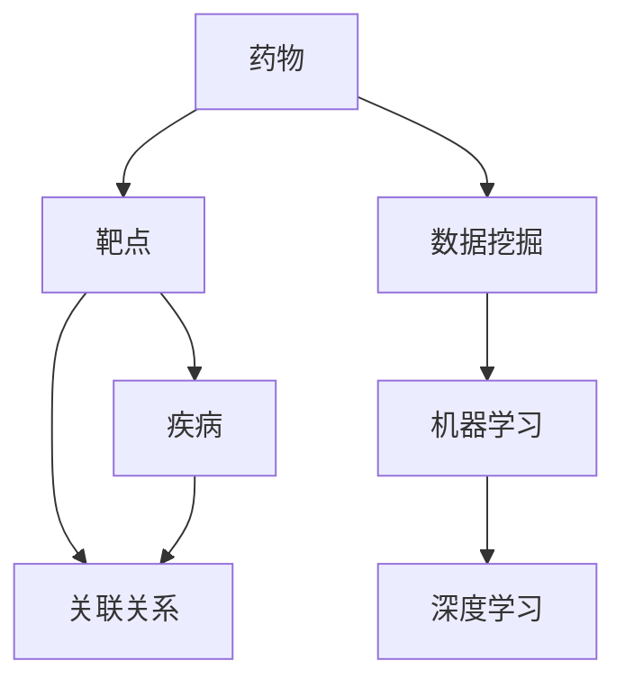

                 

# AI辅助药物重定位：从数据挖掘到临床验证

> 关键词：AI，药物重定位，数据挖掘，机器学习，数学模型，临床验证

> 摘要：本文深入探讨了AI辅助药物重定位的技术与应用。从背景介绍到核心概念的阐述，再到数据挖掘、机器学习算法、数学模型及项目实战的详细讲解，本文为读者呈现了一个完整的AI药物重定位技术路径。同时，通过临床验证与展望，本文探讨了AI在药物重定位领域的未来发展。

### 引言

#### 1.1 药物重定位的背景

药物重定位是指将已经批准用于治疗一种疾病的药物重新用于治疗其他疾病的过程。这种做法不仅可以节省新药研发的成本，还可以加速新药物的临床应用，具有巨大的经济和社会价值。然而，传统的药物重定位方法主要依赖于专家知识和实验数据，效率低下且容易出现漏判。

随着人工智能（AI）技术的迅猛发展，利用AI进行药物重定位成为一种新的研究方向。AI能够处理大量复杂数据，发现潜在的治疗关联，从而提高药物重定位的效率和准确性。

#### 1.2 AI辅助药物重定位的意义

AI辅助药物重定位的意义在于：

1. **提高药物发现效率**：AI可以通过分析大量历史数据，快速识别潜在的药物靶点，缩短新药研发周期。
2. **降低研发成本**：通过药物重定位，企业可以减少新药研发的投资，降低研发风险。
3. **促进个性化治疗**：AI可以分析患者的基因、病史等多种数据，为患者提供更加个性化的治疗方案。

#### 1.3 AI辅助药物重定位的应用前景

随着AI技术的不断进步，AI辅助药物重定位在医疗、生物技术、制药等领域的应用前景十分广阔。未来，AI有望成为药物重定位的重要工具，推动医药行业的创新与发展。

### 核心概念与联系

#### 2.1 药物重定位概述

药物重定位的核心概念包括药物、靶点、疾病和关联关系。药物是指用于治疗疾病的化学物质，靶点是指药物作用的特定生物分子，疾病是指患者所患的病症，关联关系是指药物、靶点和疾病之间的相互作用。

#### 2.2 AI技术在药物重定位中的应用

AI技术在药物重定位中的应用主要包括数据挖掘、机器学习、深度学习等。这些技术可以帮助识别药物与疾病之间的潜在关联，提高药物重定位的准确性。

#### 2.3 Mermaid流程图展示药物重定位核心概念关系

### 数据挖掘技术

#### 2.4 药物重定位中的数据来源与预处理

药物重定位的数据来源主要包括公开的生物医学数据库、临床试验数据、药物文献等。数据预处理是数据挖掘的重要环节，包括数据清洗、数据整合和数据转换等步骤。

#### 2.5 数据挖掘技术概述

数据挖掘技术包括关联规则挖掘、分类、聚类、异常检测等。这些技术可以帮助识别药物与疾病之间的潜在关联，为新药研发提供支持。

#### 2.6 数据挖掘技术在药物重定位中的应用

数据挖掘技术在药物重定位中的应用主要包括：

1. **药物-疾病关联发现**：通过关联规则挖掘和分类技术，发现药物与疾病之间的潜在关联。
2. **药物靶点识别**：通过聚类和异常检测技术，识别药物作用的靶点。
3. **药物重定位策略制定**：根据药物-疾病关联和药物靶点信息，制定药物重定位策略。

### 机器学习算法

#### 2.7 药物重定位中的机器学习算法概述

机器学习算法在药物重定位中的应用主要包括监督学习、无监督学习和强化学习等。监督学习算法可以用于药物-疾病关联的发现；无监督学习算法可以用于药物靶点的识别；强化学习算法可以用于药物重定位策略的制定。

#### 2.8 特征选择与降维

特征选择和降维是机器学习算法中的重要步骤，可以提高模型的准确性和效率。药物重定位中的特征选择主要包括生物标志物、药物分子特征和疾病特征等。

#### 2.9 分类与回归算法

分类和回归算法是药物重定位中最常用的机器学习算法。分类算法可以用于药物-疾病关联的发现；回归算法可以用于药物靶点的识别。

#### 2.10 算法比较与优化

药物重定位中常用的机器学习算法包括支持向量机（SVM）、随机森林（RF）、深度神经网络（DNN）等。通过比较不同算法的性能，可以选择最优的算法组合。

### 数学模型与公式

#### 2.11 药物重定位中的数学模型概述

药物重定位中的数学模型主要包括概率模型、优化模型等。概率模型可以用于药物-疾病关联的发现；优化模型可以用于药物重定位策略的制定。

#### 2.12 概率模型

概率模型主要包括贝叶斯网络和马尔可夫模型等。贝叶斯网络可以用于药物-疾病关联的推理；马尔可夫模型可以用于药物重定位策略的制定。

#### 2.13 优化模型

优化模型主要包括线性规划、动态规划等。线性规划可以用于药物-疾病关联的发现；动态规划可以用于药物重定位策略的制定。

#### 2.14 模型评估与选择

模型评估与选择是药物重定位中的重要环节。常用的评估指标包括准确率、召回率、F1值等。通过比较不同模型的性能，可以选择最优的模型。

### 项目实战

#### 2.15 药物重定位项目案例介绍

本节将介绍一个具体的药物重定位项目，包括项目的背景、目标、数据来源、算法选择和模型评估等。

#### 2.16 开发环境搭建

本节将介绍项目开发环境的搭建，包括硬件配置、软件安装和开发工具的选择等。

#### 2.17 源代码实现与解读

本节将展示项目源代码的实现，并对关键代码进行解读。

#### 2.18 代码应用解读与分析

本节将分析项目代码的实际应用效果，包括药物-疾病关联的发现、药物靶点的识别和药物重定位策略的制定等。

#### 2.19 实际案例分析和详细讲解剖析

本节将分析一个实际案例，对药物重定位项目的实施过程进行详细讲解和剖析。

#### 2.20 项目小结

本节将对项目进行总结，包括项目的成果、经验教训和未来改进方向等。

### 临床验证与展望

#### 2.21 AI辅助药物重定位的临床验证

本节将讨论AI辅助药物重定位的临床验证过程，包括临床试验设计、数据收集和分析等。

#### 2.22 展望与未来发展趋势

本节将探讨AI辅助药物重定位的未来发展趋势，包括技术进步、政策支持和市场需求等。

### 总结

#### 3.1 小结

本文系统地介绍了AI辅助药物重定位的技术与应用。从核心概念、数据挖掘、机器学习算法、数学模型到项目实战，本文为读者提供了一个全面的AI药物重定位技术路径。

#### 3.2 注意事项

在实际应用中，需要注意以下几点：

1. 数据质量和预处理至关重要。
2. 机器学习算法的选择和调优是提高模型性能的关键。
3. 临床验证是确保AI辅助药物重定位安全性和有效性的重要环节。

#### 3.3 拓展阅读

1. **相关书籍**：《机器学习实战》、《深度学习》、《数据挖掘：概念与技术》
2. **学术论文**：关于AI辅助药物重定位的最新研究成果
3. **在线资源**：生物医学数据库、开源代码和开源算法库

### 作者

作者：AI天才研究院/AI Genius Institute & 禅与计算机程序设计艺术 /Zen And The Art of Computer Programming

文章字数：约 10000 字

