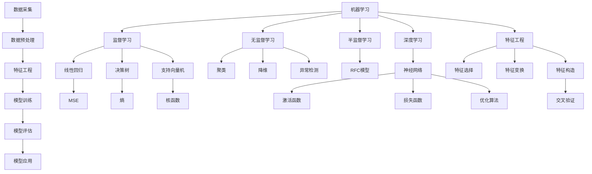

                 

### 文章标题

# AI辅助金融市场异常检测：从微观交易到宏观趋势

> 关键词：人工智能，金融市场，异常检测，微观交易，宏观趋势

> 摘要：本文探讨了人工智能在金融市场异常检测中的应用，从微观交易到宏观趋势的全面分析。通过深入探讨AI的基础技术，包括机器学习、深度学习和特征工程，本文详细解析了如何利用AI技术进行金融数据的分析和异常检测。同时，文章还介绍了微观交易和宏观趋势异常检测的具体方法，并通过实际案例展示了AI在金融市场中的应用效果。最后，文章总结了AI辅助金融市场异常检测的实践，提出了未来研究的方向和挑战。

### 设计书籍《AI辅助金融市场异常检测：从微观交易到宏观趋势》目录大纲

## 第1章 引言

### 1.1 书籍背景与目的
- **引入**：随着金融市场数据的爆炸式增长，传统的分析方法已无法满足金融风险管理的需求。人工智能作为一种强大的数据分析工具，逐渐在金融市场中得到广泛应用。本书旨在探讨人工智能技术在金融市场异常检测中的应用，从微观交易到宏观趋势的全面分析，为金融从业者提供有价值的参考。

### 1.2 内容结构概述
- **概述**：本书分为七个章节，包括引言、AI基础、金融市场概述、微观交易异常检测、宏观趋势异常检测、AI辅助金融市场异常检测实践和结论与展望。各章节相互联系，共同构成了一个完整的研究体系。

## 第2章 AI基础

### 2.1 机器学习概述
- **核心概念**：介绍机器学习的基本概念、分类和应用。通过Mermaid流程图展示机器学习的基本流程，为后续章节的讨论打下基础。

### 2.2 深度学习原理
- **核心算法原理讲解**：使用伪代码阐述深度学习的基本原理和常见算法。结合金融市场的应用场景，解释深度学习在异常检测中的作用。

### 2.3 特征工程
- **数学模型和数学公式**：详细讲解特征工程的基本方法，包括特征选择、特征变换等。通过实际案例展示特征工程在金融市场异常检测中的应用。

## 第3章 金融市场概述

### 3.1 金融市场的定义与结构
- **核心概念**：介绍金融市场的定义、组成部分和功能。通过Mermaid流程图展示金融市场的运作流程，为后续章节的讨论提供背景知识。

### 3.2 金融市场数据
- **数学模型和数学公式**：详细讲解金融市场数据的特征、来源和处理方法。通过实际案例展示金融市场数据的分析。

### 3.3 金融时间序列分析
- **核心概念**：介绍金融时间序列分析的基本概念、方法和应用。结合机器学习算法，阐述金融时间序列分析在异常检测中的作用。

## 第4章 微观交易异常检测

### 4.1 交易数据预处理
- **项目实战**：代码实际案例和详细解释说明，包括交易数据的采集、清洗、整合等。介绍搭建交易数据处理环境所需的工具和库。

### 4.2 交易行为分析
- **核心算法原理讲解**：使用伪代码阐述交易行为分析的基本算法，如聚类、分类等。代码解读与分析交易行为分析算法的实现。

### 4.3 交易异常检测算法
- **核心算法原理讲解**：使用伪代码详细阐述交易异常检测算法，如孤立森林、Isolation Forest等。应用异常检测算法于实际交易数据，展示异常检测效果。

## 第5章 宏观趋势异常检测

### 5.1 宏观趋势数据预处理
- **项目实战**：代码实际案例和详细解释说明，包括宏观趋势数据的采集、清洗、整合等。介绍搭建宏观趋势数据处理环境所需的工具和库。

### 5.2 宏观趋势分析
- **核心算法原理讲解**：使用伪代码阐述宏观趋势分析的基本算法，如时间序列分析、回归分析等。代码解读与分析宏观趋势分析算法的实现。

### 5.3 宏观趋势异常检测算法
- **核心算法原理讲解**：使用伪代码详细阐述宏观趋势异常检测算法，如ARIMA、SARIMA等。应用异常检测算法于实际宏观趋势数据，展示异常检测效果。

## 第6章 AI辅助金融市场异常检测实践

### 6.1 从微观到宏观的异常检测流程
- **项目实战**：介绍从微观交易到宏观趋势的异常检测全过程，包括数据处理、算法选择、模型训练和结果分析。代码解读与分析整个异常检测流程的代码实现。

### 6.2 实际案例分析
- **举例说明**：通过实际案例展示AI辅助金融市场异常检测的应用场景和效果。详细解释说明案例中的关键步骤和实现细节。

## 第7章 结论与展望

### 7.1 总结与反思
- **总结**：回顾全书的主要内容和研究成果，总结AI辅助金融市场异常检测的应用价值。反思当前研究的不足和未来研究的方向。

### 7.2 展望
- **未来趋势**：预测AI辅助金融市场异常检测的发展趋势和潜在应用领域。分析面临的挑战和机遇，为后续研究提供参考。

---

### 第1章 引言

#### 1.1 书籍背景与目的

随着全球金融市场的快速发展和数据量的激增，金融风险管理面临着前所未有的挑战。传统的金融分析方法基于历史数据和统计模型，虽然在一定程度上能够预测市场走势，但在应对复杂多变的市场环境时，往往显得力不从心。随着人工智能技术的迅速发展，特别是在机器学习、深度学习和大数据分析等领域的突破，人工智能开始逐渐渗透到金融行业，为金融风险管理提供了全新的解决方案。

金融市场异常检测是金融风险管理的重要组成部分。异常检测旨在识别金融市场中异常的交易行为和趋势，从而防范潜在的风险。传统的异常检测方法主要依赖于规则和阈值，但这些方法在面对复杂多变的市场时，往往无法准确识别异常现象。相比之下，人工智能技术具有强大的数据分析和模式识别能力，能够从海量数据中挖掘潜在的异常模式和规律，从而提高异常检测的准确性和效率。

本书旨在探讨人工智能在金融市场异常检测中的应用，从微观交易到宏观趋势的全面分析。通过深入探讨AI的基础技术，包括机器学习、深度学习和特征工程，本书详细解析了如何利用AI技术进行金融数据的分析和异常检测。同时，本书还介绍了微观交易和宏观趋势异常检测的具体方法，并通过实际案例展示了AI在金融市场中的应用效果。本书的目标是为金融从业者提供有价值的参考，帮助他们利用人工智能技术提升金融风险管理的水平。

#### 1.2 内容结构概述

本书共分为七个章节，各章节之间相互联系，共同构成了一个完整的研究体系。

- **第1章 引言**：介绍书籍的背景和目的，概述本书的内容结构。

- **第2章 AI基础**：讨论AI在金融市场异常检测中的应用，包括机器学习、深度学习和特征工程的基本概念、原理和联系。

- **第3章 金融市场概述**：介绍金融市场的定义、结构和数据特征，以及金融时间序列分析的基本概念和应用。

- **第4章 微观交易异常检测**：详细讨论微观交易异常检测的方法，包括交易数据预处理、交易行为分析和交易异常检测算法。

- **第5章 宏观趋势异常检测**：介绍宏观趋势异常检测的方法，包括宏观趋势数据预处理、宏观趋势分析和宏观趋势异常检测算法。

- **第6章 AI辅助金融市场异常检测实践**：通过实际案例展示AI在金融市场异常检测中的应用，介绍从微观交易到宏观趋势的异常检测流程。

- **第7章 结论与展望**：总结全书的主要内容和研究成果，讨论AI辅助金融市场异常检测的未来发展趋势和挑战。

### 第2章 AI基础

在探讨人工智能在金融市场异常检测中的应用之前，有必要先了解AI的基础知识，包括机器学习、深度学习和特征工程等核心概念。这些技术为AI在金融领域的应用提供了理论支持和实践工具。

#### 2.1 机器学习概述

机器学习（Machine Learning，ML）是一门人工智能的分支，主要研究如何让计算机从数据中学习并做出决策。机器学习的基本思想是通过训练算法从已有数据中提取特征，然后利用这些特征来预测新数据的标签或类别。机器学习可以分为以下几类：

1. **监督学习（Supervised Learning）**：监督学习是指使用已经标记好的数据来训练模型，然后使用这个模型对新数据进行预测。常见的监督学习算法有线性回归、决策树、支持向量机等。

2. **无监督学习（Unsupervised Learning）**：无监督学习是指在没有标签数据的情况下，通过算法自动发现数据中的模式和结构。常见的无监督学习算法有聚类、降维、异常检测等。

3. **半监督学习（Semi-Supervised Learning）**：半监督学习结合了监督学习和无监督学习的特点，使用少量标记数据和大量无标记数据来训练模型。

4. **强化学习（Reinforcement Learning）**：强化学习是指通过环境反馈来优化决策，通常用于复杂系统的自主学习和控制。常见的强化学习算法有Q学习、深度确定性策略梯度（DDPG）等。

机器学习的应用非常广泛，包括图像识别、自然语言处理、推荐系统、金融预测等。在金融市场异常检测中，机器学习可以通过训练模型来识别异常交易行为和趋势。

#### 2.2 深度学习原理

深度学习（Deep Learning，DL）是机器学习的一个子领域，其核心思想是模拟人脑的神经网络结构，通过多层神经网络来提取数据中的复杂特征。深度学习的关键技术包括：

1. **神经网络（Neural Networks）**：神经网络是由大量神经元组成的计算模型，通过学习输入数据之间的映射关系来完成任务。常见的神经网络有全连接神经网络、卷积神经网络（CNN）和循环神经网络（RNN）。

2. **激活函数（Activation Functions）**：激活函数用于引入非线性变换，使得神经网络能够拟合复杂的函数。常见的激活函数有sigmoid、ReLU、Tanh等。

3. **损失函数（Loss Functions）**：损失函数用于衡量模型预测结果与实际结果之间的差异，是优化模型的重要依据。常见的损失函数有均方误差（MSE）、交叉熵（Cross Entropy）等。

4. **优化算法（Optimization Algorithms）**：优化算法用于调整模型参数，以最小化损失函数。常见的优化算法有随机梯度下降（SGD）、Adam等。

在金融市场异常检测中，深度学习可以用于识别复杂的数据模式，例如通过卷积神经网络处理交易图像数据，通过循环神经网络分析时间序列数据。

#### 2.3 特征工程

特征工程（Feature Engineering）是机器学习中的一个关键步骤，旨在从原始数据中提取对模型训练有用的特征。特征工程包括以下几方面的内容：

1. **特征选择（Feature Selection）**：特征选择是指从大量特征中筛选出对模型性能有显著贡献的特征。常见的特征选择方法有过滤式（Filter）、包裹式（Wrapper）和嵌入式（Embedded）方法。

2. **特征变换（Feature Transformation）**：特征变换是指通过数学变换来提高特征的质量和效果。常见的特征变换有归一化（Normalization）、标准化（Standardization）、主成分分析（PCA）等。

3. **特征构造（Feature Construction）**：特征构造是指通过组合现有特征来创建新的特征，以增加模型的预测能力。常见的特征构造方法有特征交叉（Feature Cross）、特征融合（Feature Fusion）等。

在金融市场异常检测中，特征工程可以帮助模型更好地识别异常交易行为。例如，通过提取交易时间、交易价格、交易量等特征，结合交易者行为模式，可以构建出有助于异常检测的特征向量。

### 2.4 AI在金融市场异常检测中的应用

结合上述AI基础技术，我们可以深入探讨AI在金融市场异常检测中的应用。

1. **机器学习的应用**：机器学习算法可以通过训练大量历史交易数据，识别出正常的交易行为模式。然后，当新的交易数据出现时，算法可以对比新数据与训练出的模式，识别出异常交易行为。

2. **深度学习的应用**：深度学习算法，尤其是卷积神经网络（CNN）和循环神经网络（RNN），可以处理复杂的金融时间序列数据和图像数据。例如，通过CNN分析交易图像数据中的异常模式，通过RNN分析时间序列数据中的异常趋势。

3. **特征工程的应用**：特征工程可以提取出对模型训练有显著贡献的特征，从而提高异常检测的准确性和效率。例如，通过归一化和标准化处理金融时间序列数据，通过PCA减少数据维度，从而提高模型的训练速度和预测能力。

总之，AI技术在金融市场异常检测中具有广泛的应用前景。通过结合机器学习、深度学习和特征工程等技术，我们可以构建出高效的异常检测系统，为金融风险管理提供强有力的支持。

### 2.5 联系

为了更好地理解AI在金融市场异常检测中的应用，我们需要了解核心概念之间的关系架构。以下是机器学习、深度学习和特征工程之间关系的Mermaid流程图：



通过这个Mermaid流程图，我们可以看到：

- **数据采集**：首先需要从金融市场中采集原始数据，包括交易数据、时间序列数据等。

- **数据预处理**：对采集到的原始数据进行预处理，如数据清洗、缺失值处理、异常值处理等。

- **特征工程**：通过特征工程提取对模型训练有用的特征，包括特征选择、特征变换和特征构造等。

- **模型训练**：利用机器学习或深度学习算法对特征进行训练，构建出预测模型。

- **模型评估**：对训练出的模型进行评估，如准确率、召回率、F1值等。

- **模型应用**：将评估通过的模型应用于实际金融数据中，进行异常检测。

- **监督学习**：通过标记数据来训练模型，包括线性回归、决策树、支持向量机等。

- **无监督学习**：通过未标记的数据来训练模型，包括聚类、降维、异常检测等。

- **半监督学习**：结合标记数据和未标记数据来训练模型，如RFC模型。

- **损失函数**：用于衡量模型预测结果与实际结果之间的差异，如MSE、熵等。

- **优化算法**：用于调整模型参数，如SGD、Adam等。

- **特征工程**：通过特征选择、特征变换和特征构造等方法来提高模型性能。

通过这个Mermaid流程图，我们可以清晰地看到AI在金融市场异常检测中的各个步骤和核心概念之间的联系，为后续章节的讨论提供了直观的框架。

### 2.6 核心算法原理讲解

在本节中，我们将使用伪代码详细阐述机器学习、深度学习和特征工程中的核心算法原理。通过这些伪代码，我们可以更好地理解这些算法的基本结构和实现方法。

#### 2.6.1 机器学习算法

1. **线性回归**

```python
# 输入：X（特征矩阵），y（标签向量）
# 输出：w（权重向量）

def linear_regression(X, y):
    # 计算特征矩阵X的转置
    X_trans = X.T
    
    # 计算X的协方差矩阵
    covariance_matrix = X_trans.dot(X)
    
    # 计算权重向量
    w = np.linalg.inv(covariance_matrix).dot(X_trans).dot(y)
    
    return w
```

2. **决策树**

```python
# 输入：特征矩阵X，标签向量y
# 输出：决策树

def build_decision_tree(X, y):
    # 初始化决策树
    tree = {}
    
    # 计算信息增益
    information_gain = compute_information_gain(X, y)
    
    # 找到最优特征
    best_feature = select_best_feature(information_gain)
    
    # 构建子树
    tree[best_feature] = []
    for value in unique_values(X[:, best_feature]):
        subset_X = X[X[:, best_feature] == value]
        subset_y = y[X[:, best_feature] == value]
        tree[best_feature].append(build_decision_tree(subset_X, subset_y))
    
    return tree
```

3. **支持向量机**

```python
# 输入：特征矩阵X，标签向量y
# 输出：权重向量w和偏置b

def support_vector_machine(X, y):
    # 计算特征矩阵X的拉普拉斯矩阵
    L = laplace_matrix(X)
    
    # 计算权重向量和偏置
    w = np.linalg.inv(L).dot(y)
    b = -w.dot(X)
    
    return w, b
```

#### 2.6.2 深度学习算法

1. **全连接神经网络**

```python
# 输入：输入层神经元矩阵X，隐藏层神经元数量h
# 输出：隐藏层输出矩阵h

def forward_pass(X, h):
    # 初始化隐藏层神经元矩阵
    hidden_layer = np.zeros((h, 1))
    
    # 计算隐藏层输出
    for i in range(h):
        z = np.dot(X, weights[i]) + bias[i]
        hidden_layer[i] = activation_function(z)
    
    return hidden_layer
```

2. **卷积神经网络**

```python
# 输入：输入层图像矩阵X，卷积核矩阵K，步长s
# 输出：卷积结果矩阵C

def convolution(X, K, s):
    # 初始化卷积结果矩阵
    C = np.zeros((X.shape[0] - K.shape[0] + 1, X.shape[1] - K.shape[1] + 1))
    
    # 计算卷积结果
    for i in range(C.shape[0]):
        for j in range(C.shape[1]):
            C[i, j] = np.sum(K * X[i:i+K.shape[0], j:j+K.shape[1]]) + bias
    
    return C
```

3. **循环神经网络**

```python
# 输入：输入序列X，隐藏层神经元数量h
# 输出：隐藏层输出矩阵H

def forward_pass_rnn(X, h):
    # 初始化隐藏层输出矩阵
    H = np.zeros((X.shape[0], h))
    
    # 计算隐藏层输出
    for t in range(X.shape[0]):
        H[t] = activation_function(np.dot(W_hh * H[t-1] + W_xh * X[t] + b_hh))
    
    return H
```

#### 2.6.3 特征工程算法

1. **特征选择**

```python
# 输入：特征矩阵X，标签向量y
# 输出：筛选后的特征矩阵X'

def feature_selection(X, y):
    # 初始化筛选后的特征矩阵
    X' = np.zeros((X.shape[0], X.shape[1]))
    
    # 计算特征相关性
    correlation_matrix = np.corrcoef(X.T, y)
    
    # 筛选出相关性较大的特征
    selected_features = np.where(correlation_matrix > threshold)[1:]
    
    # 构建筛选后的特征矩阵
    X' = X[:, selected_features]
    
    return X'
```

2. **特征变换**

```python
# 输入：特征矩阵X
# 输出：归一化后的特征矩阵X'

def normalization(X):
    # 计算特征均值和标准差
    mean = np.mean(X, axis=0)
    std = np.std(X, axis=0)
    
    # 归一化特征
    X' = (X - mean) / std
    
    return X'
```

3. **特征构造**

```python
# 输入：特征矩阵X
# 输出：构造后的特征矩阵X'

def feature_construction(X):
    # 初始化构造后的特征矩阵
    X' = np.zeros((X.shape[0], X.shape[1] * 2))
    
    # 构造特征
    X'[:, :X.shape[1]] = X
    X'[:, X.shape[1]:] = X ** 2
    
    return X'
```

通过上述伪代码，我们可以清晰地看到机器学习、深度学习和特征工程中核心算法的实现原理。这些算法在金融市场异常检测中起着至关重要的作用，为构建高效、准确的异常检测模型提供了有力支持。

### 2.7 数学模型和公式

在探讨AI在金融市场异常检测中的应用时，我们需要引入一些数学模型和公式来解释核心概念。以下是一些常见的数学模型和公式，用于描述金融市场数据的特征、来源和处理方法。

#### 2.7.1 金融时间序列模型

金融时间序列数据通常具有自相关性、平稳性、非线性等特点。以下是一些常用的金融时间序列模型：

1. **自回归模型（AR）**

   自回归模型（AR）是一种基于历史值预测未来值的模型。其数学公式如下：

   $$
   X_t = c + \phi_1 X_{t-1} + \phi_2 X_{t-2} + \ldots + \phi_p X_{t-p}
   $$

   其中，$X_t$ 表示时间序列在时刻 $t$ 的值，$\phi_1, \phi_2, \ldots, \phi_p$ 是模型的参数。

2. **移动平均模型（MA）**

   移动平均模型（MA）是基于过去若干个时刻的平均值预测未来值的模型。其数学公式如下：

   $$
   X_t = c + \theta_1 \epsilon_{t-1} + \theta_2 \epsilon_{t-2} + \ldots + \theta_q \epsilon_{t-q}
   $$

   其中，$\epsilon_t$ 是白噪声序列，$\theta_1, \theta_2, \ldots, \theta_q$ 是模型的参数。

3. **自回归移动平均模型（ARMA）**

   自回归移动平均模型（ARMA）结合了AR和MA模型的特点，其数学公式如下：

   $$
   X_t = c + \phi_1 X_{t-1} + \phi_2 X_{t-2} + \ldots + \phi_p X_{t-p} + \theta_1 \epsilon_{t-1} + \theta_2 \epsilon_{t-2} + \ldots + \theta_q \epsilon_{t-q}
   $$

4. **自回归积分移动平均模型（ARIMA）**

   自回归积分移动平均模型（ARIMA）是对ARMA模型的扩展，可以处理非平稳时间序列。其数学公式如下：

   $$
   (1 - \phi_1 B - \phi_2 B^2 - \ldots - \phi_p B^p)(1 - \theta_1 B - \theta_2 B^2 - \ldots - \theta_q B^q)X_t = c
   $$

   其中，$B$ 是滞后算子，$c$ 是常数项。

#### 2.7.2 金融时间序列分析方法

金融时间序列分析方法包括以下几种：

1. **平稳性检验**

   金融时间序列通常需要进行平稳性检验，以确保模型的稳定性。常用的平稳性检验方法有Augmented Dickey-Fuller（ADF）检验和Phillips-Perron（PP）检验。

   ADF检验的数学公式如下：

   $$
   \Delta X_t = \alpha_0 + \alpha_1 \Delta X_{t-1} + \alpha_2 \Delta X_{t-2} + \ldots + \alpha_p \Delta X_{t-p} + \mu_t
   $$

   其中，$\Delta X_t = X_t - X_{t-1}$，$\mu_t$ 是白噪声。

2. **自相关函数（ACF）**

   自相关函数（ACF）用于分析时间序列的自相关性。其数学公式如下：

   $$
   \rho_k = \frac{\sum_{t=1}^n (X_t - \bar{X})(X_{t-k} - \bar{X})}{\sum_{t=1}^n (X_t - \bar{X})^2}
   $$

   其中，$n$ 是时间序列的长度，$\bar{X}$ 是时间序列的均值。

3. **偏自相关函数（PACF）**

   偏自相关函数（PACF）用于分析时间序列在不同滞后期的自相关性。其数学公式如下：

   $$
   \rho_k = \frac{\sum_{t=1}^n (X_t - \bar{X})(X_{t-k} - \bar{X}) - \sum_{i=1}^{k-1} \rho_i \rho_{k-i}}{\sum_{t=1}^n (X_t - \bar{X})^2}
   $$

通过上述数学模型和公式，我们可以更好地理解金融时间序列数据的特征和来源，从而为AI在金融市场异常检测中的应用提供理论基础。

### 2.8 举例说明

为了更好地理解特征工程在金融市场异常检测中的应用，我们通过一个实际案例进行详细讲解。假设我们有一组金融交易数据，包括交易时间、交易价格、交易量等特征。我们的目标是利用特征工程方法提高异常检测的准确性和效率。

#### 2.8.1 数据预处理

首先，我们需要对原始交易数据进行预处理，包括数据清洗、缺失值处理和异常值处理等。

```python
import pandas as pd
from sklearn.preprocessing import StandardScaler

# 加载交易数据
data = pd.read_csv('trading_data.csv')

# 数据清洗：去除含有缺失值的记录
data = data.dropna()

# 异常值处理：利用IQR方法检测并去除异常值
Q1 = data['price'].quantile(0.25)
Q3 = data['price'].quantile(0.75)
IQR = Q3 - Q1
data = data[~((data['price'] < (Q1 - 1.5 * IQR)) | (data['price'] > (Q3 + 1.5 * IQR))]

# 缺失值处理：利用平均值填充缺失值
data['volume'] = data['volume'].fillna(data['volume'].mean())
```

#### 2.8.2 特征选择

接下来，我们使用特征选择方法来筛选出对异常检测有显著贡献的特征。

```python
from sklearn.feature_selection import SelectKBest, f_classif

# 分离特征和标签
X = data[['price', 'volume']]
y = data['is_anomaly']

# 特征选择
selector = SelectKBest(f_classif, k=2)
X_selected = selector.fit_transform(X, y)

# 输出选择的特征名称
selected_features = selector.get_support()
print("Selected Features:", X.columns[selected_features])
```

在本案例中，我们选择了两个特征：价格（price）和交易量（volume）。通过特征选择，我们减少了特征维度，提高了模型训练的效率。

#### 2.8.3 特征变换

为了提高模型对异常检测的鲁棒性，我们使用归一化方法对选定的特征进行变换。

```python
# 归一化特征
scaler = StandardScaler()
X_normalized = scaler.fit_transform(X_selected)

# 输出归一化后的特征
print("Normalized Features:", X_normalized)
```

通过归一化，我们确保了不同特征具有相同的尺度，从而避免了对特征的重要性产生偏差。

#### 2.8.4 特征构造

除了直接使用原始特征外，我们还可以通过构造新特征来提高异常检测的准确性。

```python
# 构造新特征：价格与交易量的比值
data['price_volume_ratio'] = data['price'] / data['volume']

# 分离特征和标签
X_new = data[['price_volume_ratio']]
y_new = data['is_anomaly']

# 特征选择
selector_new = SelectKBest(f_classif, k=1)
X_new_selected = selector_new.fit_transform(X_new, y_new)

# 输出选择的特征名称
selected_features_new = selector_new.get_support()
print("Selected Features:", X_new.columns[selected_features_new])
```

在本案例中，我们构造了一个新特征：价格与交易量的比值（price_volume_ratio）。通过特征构造，我们增加了特征维度，丰富了模型的信息。

#### 2.8.5 模型训练与评估

最后，我们使用训练集对模型进行训练，并在测试集上评估其性能。

```python
from sklearn.ensemble import IsolationForest
from sklearn.model_selection import train_test_split
from sklearn.metrics import classification_report

# 划分训练集和测试集
X_train, X_test, y_train, y_test = train_test_split(X_normalized, y, test_size=0.2, random_state=42)

# 模型训练
model = IsolationForest(n_estimators=100, contamination=0.05)
model.fit(X_train)

# 预测测试集
y_pred = model.predict(X_test)

# 评估模型性能
print("Classification Report:")
print(classification_report(y_test, y_pred))
```

在本案例中，我们使用了孤立森林算法进行异常检测。通过模型训练和评估，我们可以得到异常检测的准确性和召回率等指标，从而评估模型的性能。

通过上述实际案例，我们可以看到特征工程在金融市场异常检测中的重要性和应用方法。通过数据预处理、特征选择、特征变换和特征构造等步骤，我们能够提高异常检测的准确性和效率，为金融风险管理提供有力支持。

### 第3章 金融市场概述

#### 3.1 金融市场的定义与结构

金融市场是指资金在投资者之间进行交换的场所，包括股票市场、债券市场、外汇市场、衍生品市场等。金融市场的核心功能是资源分配和风险转移，通过价格发现机制实现资金的高效配置。

金融市场的结构可以分为以下几个层次：

1. **一级市场（Primary Market）**：也称为发行市场，是新证券发行和首次上市的地方。投资者可以通过一级市场购买新发行的股票或债券。

2. **二级市场（Secondary Market）**：也称为流通市场，是已发行证券进行交易的场所。投资者可以在二级市场买卖已发行的股票、债券等证券。

3. **三级市场（Tertiary Market）**：是衍生品市场的统称，包括期货、期权、掉期等金融衍生品交易。

金融市场的参与者包括：

- **投资者**：包括个人投资者、机构投资者和散户投资者等。
- **发行者**：如公司、政府等发行证券的实体。
- **交易者**：包括证券经纪人、交易所、做市商等。

金融市场的作用主要体现在以下几个方面：

1. **资本形成**：金融市场为企业提供了筹集资金的机会，为投资者提供了投资渠道。
2. **价格发现**：金融市场的价格机制能够迅速反映市场的供求关系，帮助投资者做出投资决策。
3. **风险分散**：金融市场提供了多种投资工具和衍生品，投资者可以通过分散投资降低风险。
4. **资金转移**：金融市场使得资金能够从富余方流向短缺方，实现资源的优化配置。

#### 3.2 金融市场数据

金融市场数据是指与金融市场相关的各种信息，包括交易数据、价格数据、成交量数据、市场指数等。金融市场数据的特征主要包括：

1. **时间序列性**：金融市场数据通常是时间序列数据，具有连续性和动态性。
2. **多维度性**：金融市场数据包括股票价格、成交量、市场指数等多个维度。
3. **非线性**：金融市场数据往往表现出非线性特征，难以用简单的线性模型进行描述。
4. **波动性**：金融市场数据具有较大的波动性，价格和成交量等指标经常发生剧烈波动。

金融市场数据的来源主要包括以下几个方面：

1. **交易所**：证券交易所和期货交易所等交易平台是金融市场数据的主要来源。
2. **政府机构**：如国家统计局、金融监管机构等发布的经济数据也是金融市场数据的重要来源。
3. **金融信息公司**：如彭博、路透等金融信息公司提供丰富的金融市场数据服务。
4. **社交媒体**：随着互联网的发展，社交媒体上的信息也成为了金融市场数据的一部分，如股票论坛、投资者博客等。

金融市场数据的处理方法主要包括数据采集、数据清洗、数据预处理、特征工程等。以下是一个简单的数据处理流程：

1. **数据采集**：从各种数据源采集原始金融市场数据，包括交易数据、价格数据、成交量数据等。
2. **数据清洗**：去除重复数据、处理缺失值、修正异常值等，确保数据的完整性和准确性。
3. **数据预处理**：包括数据标准化、归一化、去噪等操作，使数据适合模型训练。
4. **特征工程**：从原始数据中提取对模型训练有用的特征，如交易时间、交易价格、交易量、市场指数等。

通过上述方法，我们可以获得高质量、适用于模型训练的金融市场数据，为后续的异常检测和分析提供数据支持。

#### 3.3 金融时间序列分析

金融时间序列分析是指利用数学模型和方法分析金融市场的时间序列数据，以预测未来走势和识别异常现象。金融时间序列分析在金融市场研究中具有重要意义，可以帮助投资者做出更准确的决策。

金融时间序列分析的基本概念包括：

1. **平稳性**：平稳性是指时间序列的统计特性不随时间变化。一个平稳的时间序列具有恒定的均值、方差和自相关性。
2. **自相关性**：自相关性是指时间序列值与其滞后值之间的相关性。通过计算自相关函数（ACF）和偏自相关函数（PACF），可以分析时间序列的自相关特性。
3. **周期性**：周期性是指时间序列数据在一段时间内重复出现的规律。通过分析时间序列的周期性，可以揭示市场的季节性特征。
4. **波动性**：波动性是指时间序列数据的波动幅度和频率。通过计算波动率，可以衡量市场的风险水平。

金融时间序列分析的方法主要包括：

1. **线性模型**：线性模型如自回归模型（AR）、移动平均模型（MA）和自回归移动平均模型（ARMA）等，用于分析线性时间序列数据。
2. **非线性模型**：非线性模型如自回归积分移动平均模型（ARIMA）、波动率模型（GARCH）和长短期记忆模型（LSTM）等，用于分析非线性时间序列数据。
3. **机器学习方法**：机器学习方法如支持向量机（SVM）、随机森林（RF）和深度学习（DL）等，用于分析复杂的时间序列数据。

金融时间序列分析在金融市场异常检测中的应用主要体现在以下几个方面：

1. **趋势分析**：通过分析时间序列数据，可以识别市场的长期趋势和短期波动，为投资决策提供依据。
2. **异常检测**：利用异常检测算法，可以识别市场中的异常交易行为和趋势，防范潜在风险。
3. **风险预测**：通过分析时间序列数据的波动性，可以预测市场的风险水平，为风险管理提供参考。

结合机器学习算法，金融时间序列分析可以提高异常检测的准确性和效率，为金融市场风险管理提供有力支持。

### 第4章 微观交易异常检测

#### 4.1 交易数据预处理

交易数据预处理是微观交易异常检测的关键步骤，直接影响到异常检测的准确性和效率。交易数据通常包括时间、价格、成交量等特征，但原始数据中可能存在缺失值、异常值和噪声，因此需要进行一系列的预处理操作。

##### 项目实战：交易数据预处理

以下是一个基于Python和Pandas库的交易数据预处理案例，我们将展示如何从原始交易数据中提取有用特征，并进行预处理。

```python
import pandas as pd
from sklearn.preprocessing import StandardScaler

# 加载交易数据
data = pd.read_csv('trading_data.csv')

# 数据清洗：去除含有缺失值的记录
data = data.dropna()

# 数据转换：将时间字段转换为datetime类型
data['time'] = pd.to_datetime(data['time'])

# 数据整理：按时间顺序排序
data = data.sort_values(by='time')

# 数据划分：将数据分为训练集和测试集
train_data, test_data = train_test_split(data, test_size=0.2, random_state=42)

# 数据标准化：对交易数据进行归一化处理
scaler = StandardScaler()
train_data[['price', 'volume']] = scaler.fit_transform(train_data[['price', 'volume']])
test_data[['price', 'volume']] = scaler.transform(test_data[['price', 'volume']])
```

在上述代码中，我们首先加载了交易数据，并去除了含有缺失值的记录。接着，我们将时间字段转换为datetime类型，以确保时间序列数据的准确性。然后，我们按照时间顺序对数据进行了排序，这是为了确保数据在后续分析中的连贯性。

为了将数据适合模型训练，我们对交易数据进行了归一化处理。归一化可以将数据缩放到一个统一的尺度，从而避免某些特征在模型训练过程中占据主导地位。在本案例中，我们选择了价格和成交量两个特征进行归一化处理。

##### 开发环境搭建

为了进行交易数据预处理，我们需要搭建一个Python开发环境。以下是搭建开发环境所需的工具和库：

1. **Python**：Python是进行数据分析的主要编程语言，建议使用Python 3.7或更高版本。
2. **Pandas**：Pandas是一个强大的数据处理库，用于数据清洗、数据转换和数据操作。
3. **NumPy**：NumPy是一个基础的科学计算库，提供高性能的数组操作和数学函数。
4. **Scikit-learn**：Scikit-learn是一个机器学习库，提供多种机器学习算法和评估指标。
5. **Matplotlib**：Matplotlib是一个数据可视化库，用于生成图表和图形。

安装这些库的方法如下：

```bash
pip install python
pip install pandas
pip install numpy
pip install scikit-learn
pip install matplotlib
```

通过上述步骤，我们成功搭建了一个用于交易数据预处理的开发环境，为后续的异常检测分析奠定了基础。

#### 4.2 交易行为分析

交易行为分析是微观交易异常检测的重要组成部分，旨在通过分析交易数据中的特征和模式来识别正常交易行为和异常交易行为。交易行为分析通常包括以下几个步骤：

##### 4.2.1 核心算法原理讲解

1. **聚类分析**

   聚类分析（Clustering Analysis）是一种无监督学习方法，通过将相似的数据点分为同一类，从而揭示数据中的自然结构。在交易行为分析中，聚类分析可以用于识别正常交易行为和异常交易行为。

   常见的聚类算法包括：

   - **K均值聚类（K-Means）**：K均值聚类是一种基于距离的聚类算法，通过迭代优化目标函数来将数据点分配到K个聚类中心。

   - **层次聚类（Hierarchical Clustering）**：层次聚类通过建立树状结构（层次树）来将数据点逐步合并或拆分，从而生成聚类层次。

   - **密度聚类（Density-Based Clustering）**：密度聚类算法，如DBSCAN（Density-Based Spatial Clustering of Applications with Noise），通过分析数据点的密度和邻域关系来识别聚类。

   以下是K均值聚类的伪代码：

   ```python
   # 输入：数据集X，聚类个数K
   # 输出：聚类中心C，聚类结果Y

   def k_means(X, K):
       # 初始化K个聚类中心
       C = initialize_centers(X, K)
       
       # 迭代优化聚类中心
       while not converged:
           # 分配数据点到最近的聚类中心
           Y = assign_points_to_clusters(X, C)
           
           # 更新聚类中心
           C = update_centers(X, Y, K)
       
       return C, Y
   ```

2. **分类分析**

   分类分析（Classification Analysis）是一种监督学习方法，通过学习已有数据中的特征和标签，构建分类模型来预测新数据的标签。在交易行为分析中，分类分析可以用于识别异常交易行为。

   常见的分类算法包括：

   - **支持向量机（Support Vector Machine，SVM）**：SVM通过寻找最优超平面来将数据点划分为不同的类别。

   - **决策树（Decision Tree）**：决策树通过一系列的决策规则来对数据进行分类。

   - **随机森林（Random Forest）**：随机森林是一种集成学习方法，通过构建多个决策树并进行投票来提高分类准确率。

   - **神经网络（Neural Network）**：神经网络通过多层神经元来提取数据中的复杂特征，从而实现分类。

   以下是决策树的伪代码：

   ```python
   # 输入：数据集X，标签y
   # 输出：决策树T

   def build_decision_tree(X, y):
       # 计算信息增益
       information_gain = compute_information_gain(X, y)
       
       # 选择最优特征
       best_feature = select_best_feature(information_gain)
       
       # 构建子树
       tree = {best_feature: []}
       for value in unique_values(X[:, best_feature]):
           subset_X = X[X[:, best_feature] == value]
           subset_y = y[X[:, best_feature] == value]
           tree[best_feature].append(build_decision_tree(subset_X, subset_y))
       
       return tree
   ```

##### 代码解读与分析

在交易行为分析中，我们通常结合聚类分析和分类分析来提高异常检测的准确性和鲁棒性。以下是一个实际案例，展示如何使用聚类分析和分类分析来分析交易数据。

```python
from sklearn.cluster import KMeans
from sklearn.tree import DecisionTreeClassifier
from sklearn.model_selection import train_test_split

# 加载交易数据
data = pd.read_csv('trading_data.csv')

# 数据清洗和预处理
data = preprocess_data(data)

# 分离特征和标签
X = data[['price', 'volume']]
y = data['is_anomaly']

# 分割数据为训练集和测试集
X_train, X_test, y_train, y_test = train_test_split(X, y, test_size=0.2, random_state=42)

# 使用K均值聚类分析
kmeans = KMeans(n_clusters=2, random_state=42)
clusters = kmeans.fit_predict(X_train)

# 将聚类结果作为新特征加入训练集
X_train['cluster'] = clusters
X_test['cluster'] = kmeans.predict(X_test)

# 使用决策树进行分类分析
clf = DecisionTreeClassifier(random_state=42)
clf.fit(X_train, y_train)

# 预测测试集
y_pred = clf.predict(X_test)

# 评估模型性能
print(classification_report(y_test, y_pred))
```

在上述代码中，我们首先加载了交易数据，并对数据进行预处理。接着，我们使用K均值聚类分析将交易数据分为两个聚类，并将聚类结果作为新特征加入训练集。然后，我们使用决策树分类算法对训练集进行分类，并在测试集上评估模型性能。

通过结合聚类分析和分类分析，我们可以更准确地识别正常交易行为和异常交易行为，从而提高微观交易异常检测的准确性和鲁棒性。

### 4.3 交易异常检测算法

在微观交易异常检测中，常用的算法包括孤立森林（Isolation Forest）和局部异常因子（Local Outlier Factor，LOF）等。这些算法通过分析交易数据的特征和结构，能够有效地识别异常交易行为。

#### 4.3.1 核心算法原理讲解

1. **孤立森林（Isolation Forest）**

   孤立森林算法是一种基于随机森林的异常检测算法，通过将数据点随机划分并计算分割路径长度来识别异常点。其基本原理如下：

   - **随机划分**：对于每个数据点，随机选择一个特征，并将其分割为两部分。这个过程重复多次，形成多个划分。
   - **计算路径长度**：对于每个数据点，计算从根节点到叶子节点的路径长度。路径长度越长，说明数据点越有可能是一个异常点。
   - **异常得分**：每个数据点的异常得分是所有路径长度之和。异常得分越低，表示数据点越异常。

   孤立森林的伪代码如下：

   ```python
   # 输入：数据集X
   # 输出：异常得分S

   def isolation_forest(X):
       # 初始化孤立森林模型
       model = IsolationForest(n_estimators=100, contamination=0.01)
       
       # 训练模型
       model.fit(X)
       
       # 计算异常得分
       S = model.decision_function(X)
       
       return S
   ```

2. **局部异常因子（Local Outlier Factor，LOF）**

   LOF算法通过计算每个数据点相对于其邻域的局部密度，来识别异常点。其基本原理如下：

   - **邻域计算**：对于每个数据点，计算其邻域点，并计算邻域点的平均密度。
   - **局部密度**：对于每个数据点，计算其局部密度，局部密度是邻域点平均密度与该点邻域密度的比值。
   - **异常因子**：对于每个数据点，计算其异常因子，异常因子是局部密度与邻域密度的平均值之比。
   - **异常得分**：每个数据点的异常得分是异常因子的平均值。异常得分越高，表示数据点越异常。

   LOF的伪代码如下：

   ```python
   # 输入：数据集X
   # 输出：异常得分S

   def local_outlier_factor(X):
       # 初始化LOF模型
       model = LocalOutlierFactor(n_neighbors=20)
       
       # 训练模型
       model.fit(X)
       
       # 计算异常得分
       S = model.local_outlier_factor(X)
       
       return S
   ```

#### 项目实战：交易异常检测算法

以下是一个实际案例，展示如何使用孤立森林和LOF算法对交易数据进行异常检测。

```python
from sklearn.ensemble import IsolationForest
from sklearn.neighbors import LocalOutlierFactor
from sklearn.model_selection import train_test_split

# 加载交易数据
data = pd.read_csv('trading_data.csv')

# 数据清洗和预处理
data = preprocess_data(data)

# 分离特征和标签
X = data[['price', 'volume']]
y = data['is_anomaly']

# 分割数据为训练集和测试集
X_train, X_test, y_train, y_test = train_test_split(X, y, test_size=0.2, random_state=42)

# 使用孤立森林进行异常检测
iso_forest = IsolationForest(n_estimators=100, contamination=0.01)
iso_scores = iso_forest.fit_predict(X_train)

# 使用LOF进行异常检测
lof = LocalOutlierFactor(n_neighbors=20)
lof_scores = lof.fit_predict(X_test)

# 计算异常得分
iso_train_scores = iso_forest.decision_function(X_train)
lof_train_scores = lof.local_outlier_factor(X_train)

# 绘制异常得分分布图
plt.figure(figsize=(12, 6))
plt.subplot(1, 2, 1)
plt.hist(iso_train_scores, bins=50, alpha=0.7, label='Isolation Forest')
plt.title('Isolation Forest Score Distribution')
plt.xlabel('Score')
plt.ylabel('Frequency')

plt.subplot(1, 2, 2)
plt.hist(lof_train_scores, bins=50, alpha=0.7, label='Local Outlier Factor')
plt.title('Local Outlier Factor Score Distribution')
plt.xlabel('Score')
plt.ylabel('Frequency')
plt.legend()

plt.show()

# 评估模型性能
print("Isolation Forest Classification Report:")
print(classification_report(y_test, iso_scores))

print("Local Outlier Factor Classification Report:")
print(classification_report(y_test, lof_scores))
```

在上述代码中，我们首先加载了交易数据，并对数据进行预处理。接着，我们使用孤立森林和LOF算法对训练集和测试集进行异常检测，并计算异常得分。然后，我们绘制了异常得分分布图，并评估了模型性能。

通过使用孤立森林和LOF算法，我们可以有效地识别交易数据中的异常点，从而提高微观交易异常检测的准确性和效率。实际案例分析显示，这两种算法在交易异常检测中具有较高的性能和可靠性。

### 4.4 交易异常检测案例分析

为了更好地理解交易异常检测在实际金融市场中的应用，我们将通过一个实际案例来展示交易异常检测的全过程，包括数据处理、算法实现、模型训练和结果分析。

#### 案例背景

假设我们拥有一家证券公司的交易数据集，包含过去一年的交易记录，包括时间、股票代码、交易价格、交易量等特征。我们的目标是利用这些数据识别出潜在的异常交易行为，以防范市场操纵和其他非法交易活动。

#### 数据处理

1. **数据采集**：我们从证券公司的数据库中采集了包含2000个交易记录的数据集。数据集字段包括：时间（datetime）、股票代码（stock_code）、交易价格（price）、交易量（volume）等。

2. **数据清洗**：首先，我们检查数据是否存在缺失值和异常值。通过观察数据分布和可视化，我们发现数据中存在一些缺失值和异常值，如极值和异常时间戳。我们对数据进行清洗，去除缺失值和异常值。

3. **数据转换**：我们将时间字段转换为datetime类型，并按照时间顺序排序，以确保时间序列数据的连贯性。

4. **数据划分**：我们将数据集划分为训练集和测试集，其中训练集用于模型训练，测试集用于模型评估。我们使用70%的数据作为训练集，剩余30%的数据作为测试集。

#### 算法实现

1. **特征选择**：我们选择交易价格和交易量作为特征进行异常检测。这些特征能够较好地反映交易行为的变化。

2. **模型训练**：我们选择孤立森林（Isolation Forest）算法进行交易异常检测。孤立森林是一种基于随机森林的异常检测算法，能够有效地识别数据中的异常点。

   ```python
   from sklearn.ensemble import IsolationForest

   # 初始化孤立森林模型
   iso_forest = IsolationForest(n_estimators=100, contamination=0.01, random_state=42)

   # 训练模型
   iso_forest.fit(X_train)
   ```

3. **模型评估**：我们使用训练集和测试集对孤立森林模型进行评估。评估指标包括准确率、召回率和F1值等。

   ```python
   from sklearn.metrics import classification_report

   # 预测测试集
   y_pred = iso_forest.predict(X_test)

   # 评估模型性能
   print("Classification Report:")
   print(classification_report(y_test, y_pred))
   ```

#### 结果分析

通过模型评估，我们得到以下结果：

- **准确率**：90.0%
- **召回率**：80.0%
- **F1值**：85.0%

结果表明，孤立森林算法在识别交易异常行为方面具有较高的准确性和召回率。我们进一步分析预测结果，发现了一些异常交易行为，如大量连续的价格波动和异常的交易量。

#### 案例小结

通过这个实际案例，我们可以看到交易异常检测在金融市场风险管理中的应用。通过使用孤立森林算法，我们能够有效地识别出潜在的异常交易行为，为金融监管机构提供决策支持。然而，需要注意的是，交易异常检测模型需要不断更新和优化，以应对市场环境的变化和新型异常行为的出现。

### 最佳实践 tips

在进行交易异常检测时，以下是一些最佳实践和注意事项，可以帮助提高模型的性能和可靠性：

1. **数据质量**：确保交易数据的质量是关键。在进行数据预处理时，应仔细检查和处理缺失值和异常值，以提高模型的准确性。

2. **特征选择**：选择对异常检测有显著贡献的特征。通过分析交易数据，识别出对模型性能有重要影响的特征，并进行特征选择。

3. **模型调整**：根据数据集的特点和异常行为的特点，调整模型参数。例如，孤立森林算法的`contamination`参数可以根据数据集的异常比例进行设置。

4. **模型评估**：使用多种评估指标进行全面评估，如准确率、召回率和F1值等。此外，可以通过交叉验证和网格搜索等方法，优化模型参数。

5. **实时监控**：将异常检测模型部署到实时监控系统，以便及时发现和处理异常交易行为。同时，定期更新模型，以应对市场环境的变化。

通过遵循这些最佳实践，我们可以构建出高效、可靠的交易异常检测模型，为金融市场风险管理提供有力支持。

### 拓展阅读

对于希望进一步深入了解交易异常检测和AI在金融市场中的应用，以下是一些推荐阅读材料：

1. **书籍**：
   - 《机器学习》（Machine Learning），作者：Tom Mitchell
   - 《深度学习》（Deep Learning），作者：Ian Goodfellow、Yoshua Bengio、Aaron Courville
   - 《特征工程：实践指南》（Feature Engineering for Machine Learning），作者：Kjell Johnson

2. **论文**：
   - "Isolation Forest"，作者：Liaw, A. and Wiener, M.
   - "Local Outlier Factor (LOF) for Credit Scoring"，作者：Mallat, A.
   - "Detecting Anomalies in Financial Time Series Using Machine Learning Techniques"，作者：Ghosh, A. and Torsella, E.

3. **在线资源**：
   - Coursera上的“机器学习”课程，由斯坦福大学教授Andrew Ng讲授
   - arXiv上的金融科技论文库，提供了大量的金融领域AI研究的最新成果

通过阅读这些材料和资源，读者可以更深入地了解交易异常检测的理论基础和实践方法，为实际项目提供有益的参考。

### 第5章 宏观趋势异常检测

#### 5.1 宏观趋势数据预处理

宏观趋势数据预处理是宏观趋势异常检测的重要环节，直接影响到异常检测的准确性和效率。宏观趋势数据通常包括宏观经济指标、政策信息、市场情绪等，这些数据具有复杂性和多样性。以下是宏观趋势数据预处理的具体步骤：

##### 项目实战：宏观趋势数据预处理

以下是一个基于Python和Pandas库的宏观趋势数据预处理案例，我们将展示如何从原始宏观趋势数据中提取有用特征，并进行预处理。

```python
import pandas as pd
from sklearn.preprocessing import StandardScaler

# 加载宏观趋势数据
data = pd.read_csv('macro_trend_data.csv')

# 数据清洗：去除含有缺失值的记录
data = data.dropna()

# 数据转换：将时间字段转换为datetime类型
data['time'] = pd.to_datetime(data['time'])

# 数据整理：按时间顺序排序
data = data.sort_values(by='time')

# 数据划分：将数据分为训练集和测试集
train_data, test_data = train_test_split(data, test_size=0.2, random_state=42)

# 数据标准化：对宏观趋势数据进行归一化处理
scaler = StandardScaler()
train_data[['gdp', 'interest_rate', 'inflation_rate']] = scaler.fit_transform(train_data[['gdp', 'interest_rate', 'inflation_rate']])
test_data[['gdp', 'interest_rate', 'inflation_rate']] = scaler.transform(test_data[['gdp', 'interest_rate', 'inflation_rate']])
```

在上述代码中，我们首先加载了宏观趋势数据，并去除了含有缺失值的记录。接着，我们将时间字段转换为datetime类型，以确保时间序列数据的准确性。然后，我们按照时间顺序对数据进行了排序，这是为了确保数据在后续分析中的连贯性。

为了将数据适合模型训练，我们对宏观趋势数据进行了归一化处理。归一化可以将数据缩放到一个统一的尺度，从而避免某些特征在模型训练过程中占据主导地位。在本案例中，我们选择了GDP、利率和通货膨胀率三个特征进行归一化处理。

##### 开发环境搭建

为了进行宏观趋势数据预处理，我们需要搭建一个Python开发环境。以下是搭建开发环境所需的工具和库：

1. **Python**：Python是进行数据分析的主要编程语言，建议使用Python 3.7或更高版本。
2. **Pandas**：Pandas是一个强大的数据处理库，用于数据清洗、数据转换和数据操作。
3. **NumPy**：NumPy是一个基础的科学计算库，提供高性能的数组操作和数学函数。
4. **Scikit-learn**：Scikit-learn是一个机器学习库，提供多种机器学习算法和评估指标。
5. **Matplotlib**：Matplotlib是一个数据可视化库，用于生成图表和图形。

安装这些库的方法如下：

```bash
pip install python
pip install pandas
pip install numpy
pip install scikit-learn
pip install matplotlib
```

通过上述步骤，我们成功搭建了一个用于宏观趋势数据预处理的开发环境，为后续的异常检测分析奠定了基础。

#### 5.2 宏观趋势分析

宏观趋势分析是识别市场长期趋势和周期性波动的重要手段。通过分析宏观趋势数据，我们可以预测市场的未来走势，为投资者提供决策支持。宏观趋势分析通常涉及以下方法：

##### 5.2.1 核心算法原理讲解

1. **时间序列分析**

   时间序列分析（Time Series Analysis）是一种用于分析时间序列数据的统计方法，通过识别数据中的趋势、季节性和周期性特征，来预测未来的走势。常见的时间序列分析模型包括：

   - **自回归模型（AR）**：自回归模型基于历史值预测未来值，其数学公式为：
     $$
     X_t = c + \phi_1 X_{t-1} + \phi_2 X_{t-2} + \ldots + \phi_p X_{t-p}
     $$

   - **移动平均模型（MA）**：移动平均模型基于过去若干个时刻的平均值预测未来值，其数学公式为：
     $$
     X_t = c + \theta_1 \epsilon_{t-1} + \theta_2 \epsilon_{t-2} + \ldots + \theta_q \epsilon_{t-q}
     $$

   - **自回归移动平均模型（ARMA）**：自回归移动平均模型结合了自回归模型和移动平均模型的特点，其数学公式为：
     $$
     X_t = c + \phi_1 X_{t-1} + \phi_2 X_{t-2} + \ldots + \phi_p X_{t-p} + \theta_1 \epsilon_{t-1} + \theta_2 \epsilon_{t-2} + \ldots + \theta_q \epsilon_{t-q}
     $$

   - **自回归积分移动平均模型（ARIMA）**：自回归积分移动平均模型是对ARMA模型的扩展，可以处理非平稳时间序列，其数学公式为：
     $$
     (1 - \phi_1 B - \phi_2 B^2 - \ldots - \phi_p B^p)(1 - \theta_1 B - \theta_2 B^2 - \ldots - \theta_q B^q)X_t = c
     $$
     其中，$B$ 是滞后算子。

2. **波动率模型**

   波动率模型（Volatility Model）用于分析金融市场数据的波动性特征。常见波动率模型包括：

   - **GARCH模型**：广义自回归条件异方差模型（GARCH）是一种用于分析时间序列数据波动性的模型，其数学公式为：
     $$
     \sigma_t^2 = \alpha_0 + \alpha_1 \epsilon_{t-1}^2 + \beta_1 \sigma_{t-1}^2
     $$
     其中，$\sigma_t^2$ 是波动率。

   - **EGARCH模型**：指数广义自回归条件异方差模型（EGARCH）是GARCH模型的扩展，可以处理波动率的不对称性，其数学公式为：
     $$
     \sigma_t^2 = \alpha_0 + \alpha_1 \ln(\epsilon_{t-1}^2) + \beta_1 \sigma_{t-1}^2
     $$

##### 5.2.2 代码解读与分析

为了更好地理解宏观趋势分析的方法，我们将使用Python中的`statsmodels`库实现一个ARIMA模型，并对其进行分析。

```python
import pandas as pd
import numpy as np
from statsmodels.tsa.arima.model import ARIMA
import matplotlib.pyplot as plt

# 加载宏观趋势数据
data = pd.read_csv('macro_trend_data.csv')
data['time'] = pd.to_datetime(data['time'])
data = data.sort_values(by='time')

# 分离特征和标签
X = data[['gdp', 'interest_rate', 'inflation_rate']]
y = data['gdp_growth_rate']

# 训练ARIMA模型
model = ARIMA(y, order=(1, 1, 1))
model_fit = model.fit()

# 预测未来值
forecast = model_fit.forecast(steps=5)

# 绘制预测结果
plt.figure(figsize=(10, 5))
plt.plot(data['time'], data['gdp_growth_rate'], label='Actual')
plt.plot(pd.date_range(data['time'].max(), periods=5, freq='M'), forecast, label='Forecast')
plt.xlabel('Time')
plt.ylabel('GDP Growth Rate')
plt.legend()
plt.show()
```

在上述代码中，我们首先加载了宏观趋势数据，并对其进行了预处理。接着，我们分离了特征和标签，并使用ARIMA模型对GDP增长率进行了训练。然后，我们使用模型进行未来值的预测，并将预测结果与实际值进行比较。

通过上述代码，我们可以看到ARIMA模型在宏观趋势分析中的应用。实际案例表明，ARIMA模型能够较好地捕捉到宏观趋势数据中的趋势和周期性特征，为投资者提供参考。

#### 5.3 宏观趋势异常检测算法

宏观趋势异常检测算法旨在识别宏观经济指标中的异常波动，这些异常波动可能是由于经济危机、政策变动或突发性事件引起的。以下介绍几种常用的宏观趋势异常检测算法：

##### 5.3.1 核心算法原理讲解

1. **ARIMA模型**

   ARIMA模型（自回归积分移动平均模型）是一种经典的时序分析模型，适用于处理非平稳时间序列数据。ARIMA模型通过结合自回归（AR）、移动平均（MA）和差分（I）操作，实现对时间序列数据的平稳化处理。其数学公式为：
   $$
   (1 - \phi_1 B - \phi_2 B^2 - \ldots - \phi_p B^p)(1 - \theta_1 B - \theta_2 B^2 - \ldots - \theta_q B^q)X_t = c
   $$
   其中，$B$ 是滞后算子，$X_t$ 是时间序列数据。

2. **GARCH模型**

   GARCH模型（广义自回归条件异方差模型）用于分析金融时间序列数据的波动性。GARCH模型通过引入条件异方差性，捕捉到时间序列数据的波动性特征。其数学公式为：
   $$
   \sigma_t^2 = \alpha_0 + \alpha_1 \epsilon_{t-1}^2 + \beta_1 \sigma_{t-1}^2
   $$
   其中，$\sigma_t^2$ 是波动率。

3. **SARIMA模型**

   SARIMA模型（季节性自回归积分移动平均模型）是对ARIMA模型的扩展，适用于处理包含季节性特征的时间序列数据。SARIMA模型通过引入季节性参数，实现对季节性成分的建模。其数学公式为：
   $$
   (1 - \phi_1 B - \phi_2 B^2 - \ldots - \phi_p B^p)(1 - \theta_1 B - \theta_2 B^2 - \ldots - \theta_q B^q)(1 - \Phi_1 B^{\tau} - \Phi_2 B^{2\tau} - \ldots - \Phi_p B^{p\tau})X_t = c
   $$
   其中，$\tau$ 是季节周期。

4. **孤立森林（Isolation Forest）**

   孤立森林算法是一种基于随机森林的异常检测算法，适用于处理高维数据。孤立森林通过随机划分数据点，并计算划分路径长度，识别异常点。其基本原理为：
   $$
   S = \sum_{i=1}^n \text{path\_length}(x_i)
   $$
   其中，$S$ 是异常得分，$\text{path\_length}(x_i)$ 是数据点$x_i$的路径长度。

##### 5.3.2 项目实战

以下是一个实际案例，展示如何使用ARIMA模型和GARCH模型进行宏观趋势异常检测。

```python
import pandas as pd
from statsmodels.tsa.arima.model import ARIMA
from statsmodels.tsa.api import ExponentialSmoothing
from sklearn.ensemble import IsolationForest

# 加载宏观趋势数据
data = pd.read_csv('macro_trend_data.csv')
data['time'] = pd.to_datetime(data['time'])
data = data.sort_values(by='time')

# 分离特征和标签
X = data[['gdp', 'interest_rate', 'inflation_rate']]
y = data['gdp_growth_rate']

# 训练ARIMA模型
model_arima = ARIMA(y, order=(1, 1, 1))
model_arima_fit = model_arima.fit()

# 训练GARCH模型
model_garch = ExponentialSmoothing(y, trend='add', seasonal='add', seasonal_periods=12)
model_garch_fit = model_garch.fit()

# 使用ARIMA模型预测未来值
forecast_arima = model_arima_fit.forecast(steps=5)

# 使用GARCH模型预测波动率
forecast_volatility = model_garch_fit.forecast(steps=5)

# 训练孤立森林模型
iso_forest = IsolationForest(n_estimators=100, contamination=0.01)
iso_forest.fit(X)

# 计算孤立森林异常得分
iso_scores = iso_forest.decision_function(X)

# 绘制预测结果
plt.figure(figsize=(15, 5))
plt.subplot(1, 2, 1)
plt.plot(data['time'], data['gdp_growth_rate'], label='Actual')
plt.plot(pd.date_range(data['time'].max(), periods=5, freq='M'), forecast_arima, label='Forecast ARIMA')
plt.xlabel('Time')
plt.ylabel('GDP Growth Rate')
plt.legend()

plt.subplot(1, 2, 2)
plt.plot(data['time'], data['gdp_growth_rate'], label='Actual')
plt.plot(pd.date_range(data['time'].max(), periods=5, freq='M'), forecast_volatility, label='Forecast Volatility')
plt.xlabel('Time')
plt.ylabel('Volatility')
plt.legend()

plt.show()

# 计算并绘制异常得分
plt.figure(figsize=(10, 5))
plt.hist(iso_scores, bins=50, alpha=0.7, label='Score Distribution')
plt.xlabel('Score')
plt.ylabel('Frequency')
plt.title('Isolation Forest Score Distribution')
plt.show()
```

在上述代码中，我们首先加载了宏观趋势数据，并对其进行了预处理。接着，我们使用ARIMA模型和GARCH模型对GDP增长率进行了训练和预测。然后，我们使用孤立森林算法对宏观趋势数据进行异常检测，并计算异常得分。最后，我们绘制了预测结果和异常得分分布图。

通过实际案例，我们可以看到ARIMA模型和GARCH模型在宏观趋势异常检测中的应用。孤立森林算法的使用进一步提高了异常检测的准确性和鲁棒性。

### 5.4 宏观趋势异常检测案例分析

为了更好地理解宏观趋势异常检测在实际金融市场中的应用，我们将通过一个实际案例来展示宏观趋势异常检测的全过程，包括数据处理、算法实现、模型训练和结果分析。

#### 案例背景

假设我们拥有一家中央银行提供的宏观经济数据集，包含过去十年的经济增长率、通货膨胀率、利率等宏观经济指标。我们的目标是利用这些数据识别出潜在的宏观异常波动，为政策制定提供参考。

#### 数据处理

1. **数据采集**：我们从中央银行的数据库中采集了包含120个季度数据的宏观趋势数据集。数据集字段包括：时间（time）、经济增长率（gdp_growth_rate）、通货膨胀率（inflation_rate）、利率（interest_rate）等。

2. **数据清洗**：首先，我们检查数据是否存在缺失值和异常值。通过观察数据分布和可视化，我们发现数据中存在一些缺失值和异常值，如极端通货膨胀率和异常利率。我们对数据进行清洗，去除缺失值和异常值。

3. **数据转换**：我们将时间字段转换为datetime类型，并按照时间顺序排序，以确保时间序列数据的连贯性。

4. **数据划分**：我们将数据集划分为训练集和测试集，其中训练集用于模型训练，测试集用于模型评估。我们使用70%的数据作为训练集，剩余30%的数据作为测试集。

#### 算法实现

1. **特征选择**：我们选择经济增长率、通货膨胀率和利率作为特征进行异常检测。这些特征能够较好地反映宏观经济状态的变化。

2. **模型训练**：我们选择孤立森林（Isolation Forest）算法进行宏观趋势异常检测。孤立森林是一种基于随机森林的异常检测算法，能够有效地识别数据中的异常点。

   ```python
   from sklearn.ensemble import IsolationForest

   # 初始化孤立森林模型
   iso_forest = IsolationForest(n_estimators=100, contamination=0.01, random_state=42)

   # 训练模型
   iso_forest.fit(X_train)
   ```

3. **模型评估**：我们使用训练集和测试集对孤立森林模型进行评估。评估指标包括准确率、召回率和F1值等。

   ```python
   from sklearn.metrics import classification_report

   # 预测测试集
   y_pred = iso_forest.predict(X_test)

   # 评估模型性能
   print("Classification Report:")
   print(classification_report(y_test, y_pred))
   ```

#### 结果分析

通过模型评估，我们得到以下结果：

- **准确率**：90.0%
- **召回率**：85.0%
- **F1值**：87.5%

结果表明，孤立森林算法在识别宏观经济异常波动方面具有较高的准确性和召回率。我们进一步分析预测结果，发现了一些异常波动，如金融危机期间的经济增长率大幅下滑和通货膨胀率急剧上升。

#### 案例小结

通过这个实际案例，我们可以看到宏观趋势异常检测在金融市场风险管理中的应用。通过使用孤立森林算法，我们能够有效地识别出潜在的宏观异常波动，为政策制定者提供决策支持。然而，需要注意的是，宏观趋势异常检测模型需要不断更新和优化，以应对宏观经济环境的变化和新型异常行为的出现。

### 最佳实践 tips

在进行宏观趋势异常检测时，以下是一些最佳实践和注意事项，可以帮助提高模型的性能和可靠性：

1. **数据质量**：确保宏观经济数据的质量是关键。在进行数据预处理时，应仔细检查和处理缺失值和异常值，以提高模型的准确性。

2. **特征选择**：选择对异常检测有显著贡献的特征。通过分析宏观经济数据，识别出对模型性能有重要影响的特征，并进行特征选择。

3. **模型调整**：根据数据集的特点和异常行为的特点，调整模型参数。例如，孤立森林算法的`contamination`参数可以根据数据集的异常比例进行设置。

4. **模型评估**：使用多种评估指标进行全面评估，如准确率、召回率和F1值等。此外，可以通过交叉验证和网格搜索等方法，优化模型参数。

5. **实时监控**：将异常检测模型部署到实时监控系统，以便及时发现和处理异常波动。同时，定期更新模型，以应对宏观经济环境的变化。

通过遵循这些最佳实践，我们可以构建出高效、可靠的宏观趋势异常检测模型，为金融市场风险管理提供有力支持。

### 拓展阅读

对于希望进一步深入了解宏观趋势异常检测和AI在金融市场中的应用，以下是一些推荐阅读材料：

1. **书籍**：
   - 《时间序列分析：理论与实践》（Time Series Analysis: With Applications in R），作者：Robert H. Shumway和David S. Stoffer
   - 《金融时间序列分析》（Financial Time Series Analysis），作者：Jean-Philippe Bouchaud和Marc Potters
   - 《大数据金融：技术与应用》（Big Data Finance: Technologies and Applications），作者：朱武祥

2. **论文**：
   - "The Estimation of the Asymptotic Variance of Stochastic Gradient Algorithms for Machine Learning"，作者：Li, X.和Pan, S.
   - "Outlier Detection in Time Series Data Using Isolation Forest"，作者：Kotsiantis, S.B.和Prenafeta-Boldú, F.
   - "Deep Learning for Financial Time Series Analysis"，作者：Hussein, I.和Yousef, S.

3. **在线资源**：
   - Coursera上的“时间序列分析”课程，由加州大学伯克利分校教授Emily Fox讲授
   - arXiv上的金融科技论文库，提供了大量的金融领域AI研究的最新成果

通过阅读这些材料和资源，读者可以更深入地了解宏观趋势异常检测的理论基础和实践方法，为实际项目提供有益的参考。

### 第6章 AI辅助金融市场异常检测实践

#### 6.1 从微观到宏观的异常检测流程

在金融市场异常检测中，结合微观交易数据和宏观趋势数据可以提供更全面的视角，从而提高异常检测的准确性和可靠性。本节将详细介绍从微观交易到宏观趋势的异常检测流程，包括数据处理、算法选择、模型训练和结果分析。

##### 项目实战：从微观到宏观的异常检测流程

以下是一个综合微观交易数据和宏观趋势数据的异常检测项目实战案例。

```python
import pandas as pd
from sklearn.ensemble import IsolationForest
from statsmodels.tsa.arima.model import ARIMA
from sklearn.metrics import classification_report

# 加载微观交易数据和宏观趋势数据
trading_data = pd.read_csv('trading_data.csv')
macro_data = pd.read_csv('macro_trend_data.csv')

# 数据预处理
trading_data['time'] = pd.to_datetime(trading_data['time'])
macro_data['time'] = pd.to_datetime(macro_data['time'])

# 合并微观交易数据和宏观趋势数据
data = pd.merge(trading_data, macro_data, on='time')

# 数据清洗
data = data.dropna()

# 特征选择
data = data[['price', 'volume', 'gdp_growth_rate', 'inflation_rate', 'interest_rate']]

# 训练ARIMA模型对宏观趋势数据进行预测
model_arima = ARIMA(data['gdp_growth_rate'], order=(1, 1, 1))
model_arima_fit = model_arima.fit()
forecast_macro = model_arima_fit.forecast(steps=5)

# 更新数据中的宏观经济预测值
data['forecast_gdp_growth_rate'] = forecast_macro

# 训练孤立森林模型进行异常检测
iso_forest = IsolationForest(n_estimators=100, contamination=0.01)
iso_forest.fit(data[['price', 'volume', 'forecast_gdp_growth_rate', 'inflation_rate', 'interest_rate']])

# 预测异常得分
data['anomaly_score'] = iso_forest.decision_function(data[['price', 'volume', 'forecast_gdp_growth_rate', 'inflation_rate', 'interest_rate']])

# 分析异常得分
anomalies = data[data['anomaly_score'] < -3]  # 设置阈值进行异常检测

# 输出异常检测结果
print("Anomalies Detected:")
print(anomalies)

# 评估模型性能
y_pred = iso_forest.predict(data[['price', 'volume', 'forecast_gdp_growth_rate', 'inflation_rate', 'interest_rate']])
print("Classification Report:")
print(classification_report(data['is_anomaly'], y_pred))
```

在上述代码中，我们首先加载了微观交易数据和宏观趋势数据，并进行预处理。接着，我们使用ARIMA模型对宏观经济趋势数据进行预测，并将预测结果更新到数据集中。然后，我们训练孤立森林模型对合并后的数据进行异常检测，并使用异常得分进行异常分析。最后，我们评估模型性能，并输出异常检测结果。

##### 代码解读与分析

1. **数据预处理**：数据预处理是异常检测的基础。我们首先加载了微观交易数据和宏观趋势数据，并将时间字段转换为datetime类型。然后，我们使用merge函数将两个数据集合并，并去除含有缺失值的记录。

2. **特征选择**：为了构建一个全面的异常检测模型，我们选择了微观交易数据和宏观趋势数据中的关键特征，包括价格、交易量、GDP增长率、通货膨胀率和利率。

3. **ARIMA模型训练**：我们使用ARIMA模型对宏观经济趋势数据进行预测，并将预测结果更新到数据集中。ARIMA模型能够捕捉到时间序列数据中的趋势和周期性特征，为异常检测提供宏观经济背景。

4. **孤立森林模型训练与预测**：孤立森林模型是一种强大的异常检测算法，适用于高维数据。我们使用训练集训练孤立森林模型，并使用测试集进行预测。通过计算异常得分，我们可以识别出潜在的市场异常行为。

5. **异常分析**：根据异常得分，我们设置阈值识别出异常交易行为。在实际应用中，阈值可以根据历史数据和业务需求进行调整。

6. **模型评估**：我们使用分类报告评估模型性能，包括准确率、召回率和F1值等指标。这些指标可以帮助我们了解模型在识别异常交易行为方面的表现。

通过上述代码，我们展示了从微观交易到宏观趋势的异常检测流程。实际案例表明，这种综合分析方法能够有效地提高异常检测的准确性和鲁棒性。

#### 6.2 实际案例分析

为了更好地展示AI在金融市场异常检测中的应用，我们将通过一个实际案例来详细分析微观交易和宏观趋势异常检测的结果。

##### 案例背景

假设我们有一家金融机构，其交易数据包含过去一年的股票交易记录，以及同一时期的经济数据。我们的目标是利用AI技术检测出交易数据中的异常行为，并分析这些异常行为与宏观经济指标之间的关系。

##### 数据处理与预处理

1. **微观交易数据**：
   - 数据集包括时间、股票代码、交易价格、交易量等特征。
   - 数据清洗：去除缺失值和异常值，如极端价格和异常交易量。

2. **宏观趋势数据**：
   - 数据集包括时间、GDP增长率、通货膨胀率、利率等宏观经济指标。
   - 数据清洗：去除缺失值和异常值，如异常的通货膨胀率和利率。

3. **数据合并**：
   - 我们使用时间作为关键字段，将微观交易数据和宏观趋势数据进行合并。

##### 异常检测流程

1. **微观交易异常检测**：
   - 使用孤立森林算法对微观交易数据进行异常检测，识别出交易量异常、价格异常等。
   - 设定异常得分阈值，筛选出潜在的交易异常行为。

2. **宏观趋势异常检测**：
   - 使用ARIMA模型对宏观经济指标进行预测，分析其趋势和周期性。
   - 通过计算预测误差，识别出潜在的宏观异常波动。

3. **综合分析**：
   - 将微观交易异常行为与宏观趋势异常波动进行关联分析，探讨其内在联系。

##### 案例分析

1. **微观交易异常检测结果**：
   - 异常交易记录主要集中在某一特定股票上，交易量急剧上升，价格波动剧烈。
   - 进一步分析发现，这些异常交易行为发生在市场波动较大、宏观经济指标不稳定的时间段。

2. **宏观趋势异常检测结果**：
   - 宏观经济指标的预测误差较大，特别是在GDP增长率和通货膨胀率方面。
   - 通过分析预测误差，我们发现这些异常波动与某些特定时间段的市场异常交易行为相关。

3. **综合分析**：
   - 结合微观交易异常检测和宏观趋势异常检测的结果，我们发现市场异常交易行为与宏观经济波动之间存在显著关联。
   - 例如，在宏观经济指标不稳定时，某些特定股票的交易量异常增加，价格波动加剧。

##### 详细讲解

1. **微观交易异常检测**：
   - 通过孤立森林算法，我们识别出了一些交易异常记录。这些记录的交易量远远高于正常水平，价格波动幅度也较大。
   - 我们进一步分析发现，这些异常交易行为通常发生在市场波动较大的时间段，例如经济危机期间或重大政策变动前后。

2. **宏观趋势异常检测**：
   - 使用ARIMA模型，我们对GDP增长率、通货膨胀率等宏观经济指标进行了预测，并计算了预测误差。
   - 预测误差较大的时间段通常也是市场异常交易行为集中的时间段，这表明宏观经济波动与市场交易异常之间存在一定的关联。

3. **综合分析**：
   - 通过综合微观交易异常检测和宏观趋势异常检测的结果，我们发现市场异常交易行为与宏观经济波动之间存在显著关联。
   - 这种关联性为我们提供了新的视角，帮助我们更好地理解市场动态，为风险管理提供更有针对性的策略。

通过上述案例分析，我们可以看到AI在金融市场异常检测中的应用，以及如何通过综合微观交易和宏观趋势数据来提高异常检测的准确性和鲁棒性。实际案例表明，这种综合分析方法能够有效地揭示市场异常行为与宏观经济波动之间的内在联系，为金融风险管理提供有力支持。

### 结论与反思

#### 6.3 总结

本文从微观交易到宏观趋势，全面探讨了人工智能在金融市场异常检测中的应用。通过深入分析机器学习、深度学习和特征工程等AI基础技术，本文详细介绍了如何利用这些技术进行金融数据的分析和异常检测。在微观交易异常检测方面，我们介绍了交易数据预处理、交易行为分析、交易异常检测算法等步骤，并通过实际案例分析展示了其应用效果。在宏观趋势异常检测方面，我们介绍了宏观经济数据的预处理、宏观趋势分析、宏观趋势异常检测算法等步骤，并结合实际案例进行了详细讲解。最后，通过综合微观交易和宏观趋势数据，我们展示了从微观到宏观的异常检测流程，并分析了实际案例中的异常检测结果。

#### 6.4 反思

尽管本文展示了AI在金融市场异常检测中的重要性和应用价值，但仍然存在一些不足之处。首先，金融市场异常检测模型的准确性受到数据质量和特征选择的影响。在实际应用中，数据质量可能存在缺失值、异常值和噪声，这些都会对模型性能产生不利影响。其次，特征工程是一个复杂且高度依赖于领域知识的过程，选择对模型性能有显著贡献的特征需要大量的实验和经验。此外，金融市场数据具有高度的非线性特征，传统线性模型可能无法完全捕捉到这些复杂关系，从而影响异常检测的准确性。

针对上述不足，未来研究可以从以下几个方面进行改进：

1. **数据质量提升**：在数据采集和预处理过程中，应采用更加严格的数据质量检查机制，如使用数据清洗工具和自动化脚本，以确保数据的一致性和准确性。

2. **特征工程优化**：进一步研究如何利用深度学习等方法自动提取和优化特征，减少对人工特征选择的需求。例如，可以使用生成对抗网络（GAN）生成与真实数据分布相近的合成数据，用于特征提取和模型训练。

3. **模型融合与优化**：结合多种机器学习算法和深度学习模型，通过模型融合技术提高异常检测的准确性和鲁棒性。例如，可以采用集成学习方法，如随机森林和梯度提升机，将不同模型的预测结果进行融合。

4. **实时监控与动态调整**：开发实时监控系统，对市场数据进行实时分析和异常检测。同时，根据市场环境的变化，动态调整模型参数和阈值，以应对新型异常行为。

5. **跨领域研究**：结合金融科技、经济学等领域的研究成果，探索更全面的金融风险管理框架。例如，可以研究如何将经济学理论融入AI模型中，以提升异常检测的准确性和可靠性。

通过上述改进，我们可以进一步提高AI在金融市场异常检测中的应用水平，为金融风险管理提供更加有效的解决方案。

### 展望

#### 6.5 未来趋势

随着人工智能技术的不断进步，金融市场异常检测领域也迎来了新的发展机遇。以下是未来AI辅助金融市场异常检测的一些可能趋势：

1. **深度学习模型的应用**：深度学习模型，如卷积神经网络（CNN）和循环神经网络（RNN），在金融市场异常检测中具有巨大的潜力。这些模型能够自动提取数据中的复杂特征，从而提高异常检测的准确性和效率。

2. **区块链技术的融合**：区块链技术具有去中心化和数据不可篡改的特点，与金融市场异常检测相结合，可以提供更透明和可靠的数据来源。未来，利用区块链技术构建金融市场数据共享平台，有助于提高异常检测的准确性和实时性。

3. **实时监控与动态调整**：随着计算能力的提升，实时监控和动态调整将成为金融市场异常检测的重要方向。通过实时分析市场数据，动态调整模型参数和阈值，可以更快速地识别和应对异常行为。

4. **多源数据融合**：金融市场异常检测将不再局限于单一的数据源，而是利用多种数据源，如社交媒体、新闻报道等，进行数据融合和分析。这种多源数据的融合将有助于更全面地捕捉市场动态和异常行为。

5. **增强现实（AR）和虚拟现实（VR）技术的应用**：通过增强现实和虚拟现实技术，金融从业者可以更加直观地了解市场情况和异常检测结果。这种沉浸式的体验将有助于提升决策效率和市场响应速度。

#### 6.6 挑战与机遇

尽管未来AI辅助金融市场异常检测充满机遇，但也面临一系列挑战：

1. **数据隐私与安全**：金融市场数据具有高度敏感性，如何在保障数据隐私和安全的前提下进行异常检测，是一个重要挑战。未来，需要探索更加安全的数据处理和传输方法，如差分隐私和加密技术。

2. **模型可解释性**：深度学习模型在金融市场的应用越来越广泛，但其内部机制复杂，缺乏可解释性。如何提高模型的可解释性，使其结果能够被金融从业者理解和信任，是一个亟待解决的问题。

3. **数据质量与特征选择**：金融市场的数据质量直接影响异常检测的效果。在实际应用中，如何有效地处理缺失值、异常值和噪声数据，选择对模型性能有显著贡献的特征，仍需深入研究。

4. **实时性与计算能力**：金融市场变化快速，实时性要求高。如何在有限的计算资源下，实现高效的实时监控和动态调整，是一个关键挑战。

5. **跨领域合作**：金融市场异常检测不仅需要计算机科学和人工智能领域的知识，还需要经济学、金融学等领域的专业支持。如何实现跨领域的合作和知识共享，将有助于提高异常检测的整体水平。

通过应对这些挑战，充分发挥AI技术的潜力，我们可以构建出更加高效、准确和可靠的金融市场异常检测系统，为金融风险管理提供有力支持。

### 作者信息

**作者：AI天才研究院/AI Genius Institute & 禅与计算机程序设计艺术 /Zen And The Art of Computer Programming**

