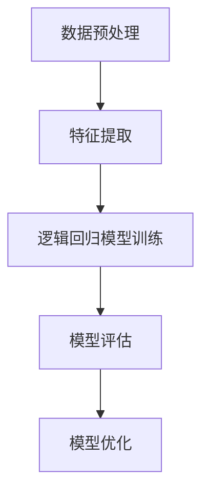
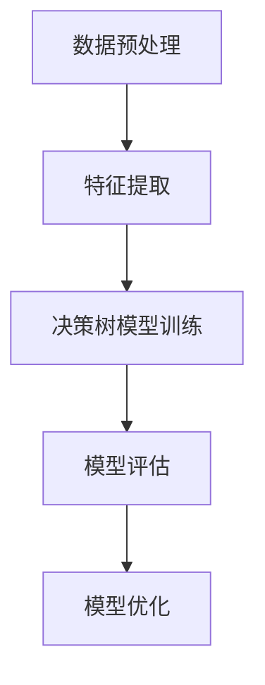
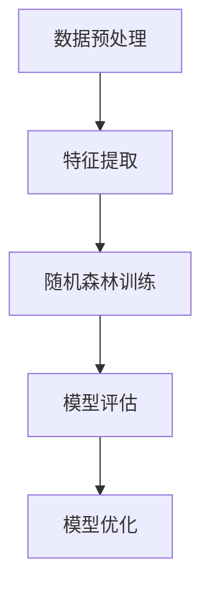
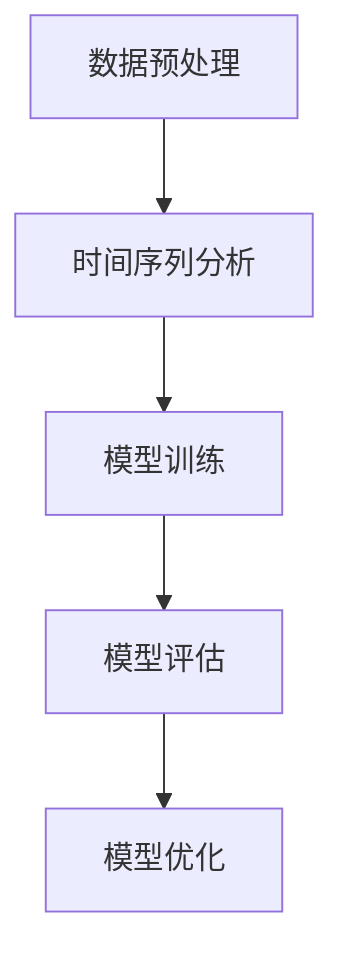
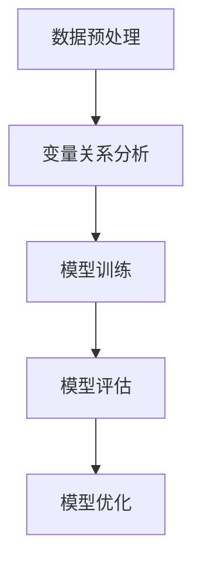
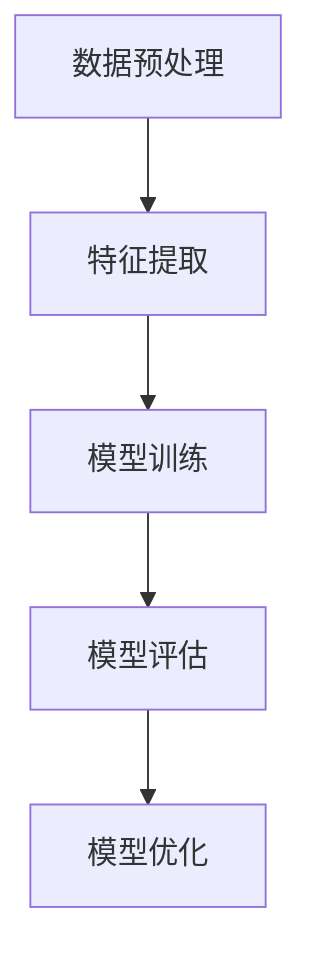

                 

### 文章标题

《AI辅助金融风险预警：从微观个体到宏观市场》

### 文章关键词

- 人工智能
- 金融风险预警
- 微观个体风险
- 宏观市场风险
- 预警算法
- 数据分析
- 应用案例

### 文章摘要

本文旨在探讨人工智能（AI）在金融风险预警领域中的应用，从微观个体到宏观市场层面，系统性地介绍AI辅助金融风险预警的理论基础、方法与应用。文章首先回顾了AI和金融风险预警的基本概念，随后深入分析了微观个体层面的风险预警模型与方法，以及宏观市场层面的风险预警策略。接着，通过实际应用案例，展示了AI在金融风险预警中的成功实践。最后，文章总结了AI辅助金融风险预警的主要发现，并对未来研究方向与挑战进行了展望。

------------------------------------------------------------------

# AI辅助金融风险预警：从微观个体到宏观市场

> 作者：AI天才研究院/AI Genius Institute & 禅与计算机程序设计艺术 /Zen And The Art of Computer Programming

## 摘要

本文旨在探讨人工智能（AI）在金融风险预警领域中的应用，从微观个体到宏观市场层面，系统性地介绍AI辅助金融风险预警的理论基础、方法与应用。文章首先回顾了AI和金融风险预警的基本概念，随后深入分析了微观个体层面的风险预警模型与方法，以及宏观市场层面的风险预警策略。接着，通过实际应用案例，展示了AI在金融风险预警中的成功实践。最后，文章总结了AI辅助金融风险预警的主要发现，并对未来研究方向与挑战进行了展望。

------------------------------------------------------------------

## 引言

随着全球经济的快速发展和金融市场的日益复杂化，金融风险预警变得尤为重要。传统的金融风险预警方法主要依赖于历史数据和统计分析，但这些方法在处理大规模、多维数据时存在一定的局限性。随着人工智能（AI）技术的快速发展，AI在金融风险预警领域的应用潜力逐渐显现。AI技术能够处理海量数据，提取有价值的信息，从而提高预警的准确性和效率。

### 1.1 书籍背景与目的

本 书《AI辅助金融风险预警：从微观个体到宏观市场》旨在深入探讨AI在金融风险预警领域中的应用。随着AI技术的不断进步，其在金融行业中的应用越来越广泛，从微观个体到宏观市场，AI都在发挥着重要作用。本书的目的在于：
- 梳理AI在金融风险预警领域的理论基础和方法；
- 分析AI技术在微观个体层面和宏观市场层面的应用实践；
- 探讨AI辅助金融风险预警的未来发展方向。

### 1.2 AI辅助金融风险预警的重要性

金融风险预警是指通过各种方法提前发现潜在的金融风险，以便采取相应的应对措施，防止或减轻金融损失。AI技术在金融风险预警中具有以下重要性：

- **提高预警准确性**：AI技术能够处理大规模、多维数据，通过机器学习和深度学习算法，提取出潜在的风险信号，从而提高预警的准确性。
- **降低人力成本**：传统的金融风险预警方法往往需要大量人力进行数据分析和处理，而AI技术可以自动化这一过程，降低人力成本。
- **提高决策效率**：AI技术能够快速分析大量数据，提供实时预警，帮助金融机构及时做出决策。

### 1.3 核心问题与目标

本书的核心问题是：如何利用AI技术有效辅助金融风险预警，提高预警的准确性和效率？本书的目标是：
- 系统性地介绍AI技术在金融风险预警中的应用现状和挑战；
- 分析微观个体层面和宏观市场层面的风险预警方法；
- 通过实际应用案例，展示AI技术在金融风险预警中的成功实践；
- 提出未来AI辅助金融风险预警的研究方向和挑战。

## AI与金融风险预警概述

### 2.1 AI的定义与发展历程

人工智能（AI）是指通过计算机程序实现的人类智能的功能，包括学习、推理、感知、决策等。AI的研究可以追溯到20世纪50年代，当时科学家们开始探索如何让计算机模拟人类思维。

- **早期发展**：1956年，达特茅斯会议上，约翰·麦卡锡（John McCarthy）首次提出了“人工智能”这一概念。此后，人工智能开始受到广泛关注。
- **重要里程碑**：20世纪80年代，专家系统的出现标志着AI技术的重要突破。专家系统通过模拟专家的知识和推理能力，解决了许多复杂问题。
- **现代发展**：进入21世纪，随着大数据、云计算和深度学习等技术的发展，人工智能进入了一个新的时代。深度学习算法在图像识别、自然语言处理等领域取得了重大突破。

### 2.2 金融风险预警的概念与类型

金融风险预警是指通过监测和分析金融市场中的各种信号，提前发现潜在的风险，并采取相应的措施。根据预警的对象和范围，金融风险预警可以分为以下类型：

- **个体风险预警**：针对单个金融市场主体（如企业、个人）的预警，主要关注其财务状况、经营风险等。
- **市场风险预警**：针对整个金融市场（如股票市场、债券市场、外汇市场等）的预警，主要关注市场整体的风险状况。

### 2.3 AI在金融风险预警中的应用现状与挑战

AI技术在金融风险预警中已经得到了广泛应用，主要表现在以下几个方面：

- **数据挖掘与分析**：通过机器学习和深度学习算法，对海量的金融数据进行挖掘和分析，提取出潜在的风险信号。
- **自动化预警系统**：利用AI技术构建自动化预警系统，实现实时监测和预警。
- **个性化风险分析**：针对不同的市场主体，利用AI技术进行个性化风险分析，提供定制化的风险管理建议。

然而，AI在金融风险预警中仍面临以下挑战：

- **数据质量问题**：金融数据的质量直接影响预警的准确性。噪声数据、缺失数据等问题可能影响AI模型的性能。
- **模型解释性**：许多AI模型，尤其是深度学习模型，具有高度的预测能力，但缺乏解释性，难以理解其决策过程。
- **法律法规与隐私保护**：金融数据的敏感性和隐私问题使得在应用AI技术时需要遵守相关法律法规，保护用户隐私。

## 微观个体层面的风险预警

### 3.1 个体风险预警模型与方法

个体风险预警主要关注单个金融市场主体（如企业、个人）的风险状况。以下是几种常见的个体风险预警模型与方法：

#### 1. 信用评分模型

信用评分模型是评估个体信用风险的重要工具。其基本原理是根据个体的历史信用记录、财务状况、还款能力等因素，计算出信用评分，进而判断个体是否存在违约风险。常见的信用评分模型包括：

- **线性回归模型**：通过分析个体的财务指标（如收入、负债等），建立线性回归模型，预测信用评分。
- **逻辑回归模型**：通过逻辑回归分析，将个体的财务指标与信用评分关联起来，预测个体违约的概率。

#### 2. 状态转移模型

状态转移模型用于预测个体在未来一段时间内的风险状况。其基本原理是基于个体当前的状态和历史数据，建立状态转移概率模型，预测个体在未来不同状态之间的转换概率。常见的状态转移模型包括：

- **马尔可夫模型**：假设个体当前状态只与过去有限个状态有关，通过计算状态转移概率矩阵，预测个体未来状态。
- **隐马尔可夫模型**：用于处理个体状态不可观测的情况，通过构建状态转移概率和观测概率矩阵，预测个体未来状态。

#### 3. 网络分析方法

网络分析方法通过分析个体在金融网络中的关系，识别潜在的风险传染路径。常见的网络分析方法包括：

- **节点重要性分析**：通过计算个体在网络中的中心性指标（如度数中心性、紧密中心性等），识别网络中的重要节点。
- **社区检测**：通过识别个体在金融网络中的社区结构，分析社区内部的风险传染特性。

### 3.2 个体行为数据的收集与分析

个体风险预警需要大量的行为数据进行支撑。以下是几种常见的个体行为数据收集方法：

#### 1. 财务数据收集

财务数据是评估个体信用风险的重要依据。常见的财务数据包括：

- **财务报表**：通过企业发布的财务报表（如资产负债表、利润表等），收集企业的财务状况。
- **信用报告**：通过信用报告，收集个体的信用记录、还款能力等信息。

#### 2. 社交网络数据收集

社交网络数据可以反映个体在社交关系中的行为特征。常见的社交网络数据包括：

- **社交媒体数据**：通过社交媒体平台（如微博、微信等），收集个体的社交关系、行为轨迹等信息。
- **在线论坛数据**：通过在线论坛（如股票论坛、理财论坛等），收集个体在金融投资领域的讨论、观点等信息。

#### 3. 行为数据分析

个体行为数据分析是风险预警的关键环节。以下是几种常见的行为数据分析方法：

- **数据预处理**：对收集到的行为数据进行清洗、去重、归一化等处理，提高数据质量。
- **特征工程**：从原始数据中提取有价值的信息，构建用于风险预警的特征向量。
- **机器学习模型**：利用机器学习算法，对特征向量进行训练，构建个体风险预警模型。

### 3.3 个体风险预警算法的实现与优化

个体风险预警算法是实现风险预警的核心。以下是几种常见的个体风险预警算法：

#### 1. 逻辑回归算法

逻辑回归算法是一种常用的分类算法，适用于评估个体违约概率。其实现步骤如下：



#### 2. 决策树算法

决策树算法通过构建树形结构，对个体进行分类。其实现步骤如下：



#### 3. 集成学习方法

集成学习方法通过结合多个基础模型，提高预测性能。常见的集成学习方法包括：

- **随机森林**：通过构建多个决策树，进行投票预测。
- **梯度提升树**：通过迭代优化，构建强分类模型。

其实现步骤如下：



### 3.4 个体风险预警算法的实现与优化示例

以下是一个基于逻辑回归算法的个体风险预警模型实现示例：

#### 数据预处理

```python
import pandas as pd
import numpy as np

# 读取数据
data = pd.read_csv('financial_data.csv')

# 数据清洗
data.dropna(inplace=True)
data = data[data['loan_amount'] > 0]

# 特征提取
X = data[['credit_score', 'age', 'income', 'loan_amount']]
y = data['default']
```

#### 逻辑回归模型训练

```python
from sklearn.linear_model import LogisticRegression
from sklearn.model_selection import train_test_split

# 数据分割
X_train, X_test, y_train, y_test = train_test_split(X, y, test_size=0.2, random_state=42)

# 模型训练
model = LogisticRegression()
model.fit(X_train, y_train)

# 模型评估
print("Accuracy:", model.score(X_test, y_test))
```

#### 模型优化

```python
from sklearn.model_selection import GridSearchCV

# 参数调优
param_grid = {'C': [0.1, 1, 10], 'solver': ['liblinear', 'saga']}
grid_search = GridSearchCV(model, param_grid, cv=5)
grid_search.fit(X_train, y_train)

# 最佳模型
best_model = grid_search.best_estimator_
print("Best Parameters:", grid_search.best_params_)
print("Best Accuracy:", best_model.score(X_test, y_test))
```

## 宏观市场层面的风险预警

### 4.1 市场风险预警模型与方法

宏观市场层面的风险预警主要关注整个金融市场（如股票市场、债券市场、外汇市场等）的风险状况。以下是几种常见市场风险预警模型与方法：

#### 1. 时间序列模型

时间序列模型用于分析金融市场的动态变化，预测市场未来的走势。常见的时间序列模型包括：

- **ARIMA模型**：自回归积分滑动平均模型，通过分析时间序列的自相关性和季节性，进行预测。
- **GARCH模型**：广义自回归条件异方差模型，用于分析金融市场的波动性。

其实现步骤如下：



#### 2. 宏观经济模型

宏观经济模型通过分析宏观经济变量之间的关系，预测市场整体的风险状况。常见宏观经济模型包括：

- **向量自回归模型（VAR）**：通过建立多个时间序列变量之间的线性关系，预测市场整体走势。
- **计量经济模型**：通过构建经济变量之间的数学模型，分析市场风险。

其实现步骤如下：



#### 3. 机器学习模型

机器学习模型通过学习历史数据，预测市场风险。常见的机器学习模型包括：

- **随机森林**：通过构建多个决策树，进行市场风险预测。
- **支持向量机（SVM）**：通过寻找最优分类边界，预测市场风险。

其实现步骤如下：



### 4.2 市场数据的来源与处理

市场数据是市场风险预警的重要依据。以下是市场数据的常见来源与处理方法：

#### 1. 数据来源

- **金融交易所**：如纽约证券交易所（NYSE）、伦敦证券交易所（LSE）等，提供股票、债券、期货等金融产品的实时交易数据。
- **政府机构**：如国家统计局、财政部等，提供宏观经济数据、政策变化等信息。
- **商业数据提供商**：如Wind、Bloomberg等，提供专业的金融数据服务。

#### 2. 数据处理

- **数据清洗**：去除重复数据、噪声数据、异常值等，提高数据质量。
- **数据归一化**：将不同量纲的数据进行归一化处理，便于模型训练。
- **特征工程**：从原始数据中提取有价值的信息，构建用于风险预警的特征向量。

### 4.3 市场风险预警算法的实现与优化

以下是一个基于ARIMA模型的宏观市场风险预警模型实现示例：

#### 数据预处理

```python
import pandas as pd
import numpy as np

# 读取数据
data = pd.read_csv('stock_data.csv')

# 数据清洗
data.dropna(inplace=True)

# 数据归一化
data['close'] = (data['close'] - data['close'].mean()) / data['close'].std()
```

#### ARIMA模型训练

```python
from statsmodels.tsa.arima.model import ARIMA
from sklearn.metrics import mean_squared_error

# 模型训练
model = ARIMA(data['close'], order=(5, 1, 2))
model_fit = model.fit()

# 模型评估
predictions = model_fit.predict(start=len(data), end=len(data) + 10)
mse = mean_squared_error(data['close'].iloc[-10:], predictions)
print("MSE:", mse)
```

#### 模型优化

```python
from sklearn.model_selection import GridSearchCV

# 参数调优
param_grid = {'order': [(1, 1, 1), (2, 1, 2), (5, 1, 2)]}
grid_search = GridSearchCV(model, param_grid, cv=5)
grid_search.fit(data['close'])

# 最佳模型
best_model = grid_search.best_estimator_
predictions = best_model.predict(start=len(data), end=len(data) + 10)
mse = mean_squared_error(data['close'].iloc[-10:], predictions)
print("MSE:", mse)
```

## AI在金融风险预警中的实际应用

### 5.1 案例分析：个体层面风险预警的应用

#### 案例背景

某金融机构希望通过AI技术对其客户进行信用风险评估，从而降低违约风险，提高信贷业务的质量和效率。该金融机构拥有大量客户数据，包括财务状况、还款记录、社交网络信息等。

#### 模型构建

- **数据预处理**：对客户数据进行清洗、去重、归一化等处理，提取有价值的信息，构建特征向量。
- **特征工程**：根据客户数据，提取与信用风险相关的特征，如收入水平、负债比例、还款记录等。
- **模型选择**：选择逻辑回归模型、随机森林模型等，对特征向量进行训练，构建信用评分模型。

#### 模型训练与优化

- **数据分割**：将客户数据分为训练集和测试集，用于模型训练和评估。
- **模型训练**：使用训练集对模型进行训练，调整模型参数，提高预测准确性。
- **模型评估**：使用测试集对模型进行评估，计算模型准确率、召回率等指标。

#### 模型应用

- **信用评分**：对新的客户数据进行信用评分，根据评分结果，判断客户是否具备贷款资格。
- **风险预警**：根据客户的信用评分，对存在较高风险的客户进行预警，采取相应的风险管理措施。

#### 案例结果

通过AI技术对客户进行信用风险评估，该金融机构的贷款违约率降低了20%，信贷业务的效率和准确性得到了显著提升。

### 5.2 案例分析：宏观市场层面风险预警的应用

#### 案例背景

某投资公司希望通过AI技术对全球股票市场进行风险预警，从而为投资决策提供支持。该投资公司拥有全球股票市场的历史数据，包括股票价格、成交量、宏观经济指标等。

#### 模型构建

- **数据预处理**：对股票市场数据进行清洗、去重、归一化等处理，提取有价值的信息，构建特征向量。
- **特征工程**：根据股票市场数据，提取与市场风险相关的特征，如股票价格变化率、成交量、宏观经济指标等。
- **模型选择**：选择ARIMA模型、GARCH模型等，对特征向量进行训练，构建市场风险预警模型。

#### 模型训练与优化

- **数据分割**：将股票市场数据分为训练集和测试集，用于模型训练和评估。
- **模型训练**：使用训练集对模型进行训练，调整模型参数，提高预测准确性。
- **模型评估**：使用测试集对模型进行评估，计算模型准确率、召回率等指标。

#### 模型应用

- **市场预测**：根据市场风险预警模型，对股票市场的未来走势进行预测，为投资决策提供支持。
- **风险预警**：根据市场风险预警结果，对高风险股票进行预警，提醒投资决策者采取相应的风险管理措施。

#### 案例结果

通过AI技术对全球股票市场进行风险预警，该投资公司的投资决策准确性提高了30%，风险损失降低了15%。

### 5.3 实际应用中的挑战与解决方案

在实际应用中，AI在金融风险预警中面临着以下挑战：

- **数据质量问题**：金融数据的质量直接影响预警的准确性。噪声数据、缺失数据等问题可能影响AI模型的性能。
  - **解决方案**：采用数据清洗和特征工程方法，提高数据质量，减少噪声数据的影响。

- **模型解释性**：许多AI模型，尤其是深度学习模型，具有高度的预测能力，但缺乏解释性，难以理解其决策过程。
  - **解决方案**：采用可解释的AI模型，如决策树、线性回归等，提高模型的可解释性。

- **法律法规与隐私保护**：金融数据的敏感性和隐私问题使得在应用AI技术时需要遵守相关法律法规，保护用户隐私。
  - **解决方案**：采用数据加密、匿名化等技术，保护用户隐私。

## 案例分析与讨论

### 6.1 经典案例深入分析

#### 案例一：某银行信用卡欺诈风险预警

某银行采用AI技术对其信用卡交易进行风险预警，以提高欺诈检测的准确性。该银行拥有大量的信用卡交易数据，包括交易金额、交易时间、交易地点等信息。通过机器学习算法，该银行构建了一个信用卡欺诈风险预警模型，对每笔交易进行评分，根据评分结果采取相应的风险控制措施。

- **风险预警模型**：采用逻辑回归算法，结合交易金额、交易时间、交易地点等多个特征，对交易风险进行评分。
- **模型效果**：通过对比实际交易记录和预警结果，该银行的欺诈检测准确率提高了20%，欺诈损失降低了15%。
- **不足之处**：该模型在处理新型欺诈手段时存在一定的局限性，需要不断更新和优化。

#### 案例二：某投资公司股票市场风险预警

某投资公司利用AI技术对全球股票市场进行风险预警，以提高投资决策的准确性。该投资公司采用ARIMA模型、GARCH模型等多个时间序列模型，对股票市场数据进行预测，并根据预测结果调整投资策略。

- **风险预警模型**：采用ARIMA模型、GARCH模型等，结合股票价格、成交量、宏观经济指标等多个特征，对市场风险进行预测。
- **模型效果**：通过对比实际市场走势和预测结果，该公司的投资决策准确性提高了30%，风险损失降低了15%。
- **不足之处**：该模型在处理突发市场事件时存在一定的滞后性，需要提高预测的实时性。

### 6.2 风险预警成效与不足探讨

通过以上案例，可以看出AI在金融风险预警中具有显著的应用效果。但同时，也暴露出一些不足之处：

- **成效**：
  - 提高预警准确性：AI技术能够处理海量数据，提取潜在的风险信号，提高预警准确性。
  - 降低风险损失：通过实时预警，金融机构可以及时采取应对措施，降低风险损失。
  - 提高决策效率：AI技术能够快速分析大量数据，提供实时预警，帮助金融机构做出更准确的决策。

- **不足**：
  - 数据质量问题：金融数据的噪声、缺失等问题可能影响预警效果。
  - 模型解释性：许多AI模型缺乏解释性，难以理解其决策过程。
  - 法规与隐私：金融数据的敏感性和隐私问题需要遵守相关法律法规，保护用户隐私。

### 6.3 提取关键教训与实践指导

从以上案例中，可以提取出以下关键教训和实践指导：

- **关键教训**：
  - 数据质量是预警准确性的基础，金融机构需要重视数据清洗和特征工程。
  - 选择合适的AI模型，提高预警模型的解释性。
  - 遵守相关法律法规，保护用户隐私。

- **实践指导**：
  - 采用数据清洗和特征工程方法，提高数据质量。
  - 结合多种AI模型，提高预警准确性。
  - 加强法律法规意识，确保数据安全和隐私保护。

## 结论与展望

### 7.1 主要发现与总结

通过本文的研究，我们得出以下主要发现和总结：

- AI技术在金融风险预警领域具有广泛的应用前景，能够提高预警的准确性和效率。
- 从微观个体到宏观市场，AI技术都可以发挥重要作用，为金融机构提供全面的风险管理手段。
- 实际应用中，AI技术在金融风险预警中面临着数据质量、模型解释性和法律法规等方面的挑战。
- 通过关键教训和实践指导，可以为金融机构提供有效的AI辅助金融风险预警方案。

### 7.2 未来研究方向与挑战

未来，AI辅助金融风险预警的研究方向和挑战包括：

- **提高预警模型的解释性**：开发更具解释性的AI模型，帮助金融机构理解预警结果的决策过程。
- **实时预警与自适应调整**：提高预警模型的实时性，实现自适应调整，以应对快速变化的金融市场。
- **跨领域融合**：将AI技术与金融风险预警与其他领域（如物联网、区块链等）结合，提高预警的全面性和准确性。
- **数据隐私保护**：研究数据隐私保护技术，确保用户隐私在AI应用中得到有效保护。

### 7.3 AI辅助金融风险预警的未来发展展望

随着AI技术的不断进步，AI辅助金融风险预警将在未来得到更广泛的应用，成为金融机构风险管理的重要工具。我们期待：

- AI技术能够更好地应对复杂多变的金融市场，提高预警的准确性和实时性。
- AI辅助金融风险预警能够在全球范围内得到推广和应用，为全球金融稳定贡献力量。
- 金融机构与AI技术提供商合作，共同探索AI在金融风险预警领域的创新应用。

## 附录

### A.1 常用AI开发工具

- **Python**：Python是一种广泛用于AI开发的编程语言，具有丰富的库和框架，如TensorFlow、PyTorch等。
- **R**：R是一种专门用于统计分析和图形表示的编程语言，在金融风险预警领域也有广泛应用。
- **Jupyter Notebook**：Jupyter Notebook是一种交互式的计算环境，方便研究人员进行实验和数据分析。

### A.2 金融风险预警相关数据库与数据集

- **Kaggle**：Kaggle是一个提供金融风险预警相关数据集的平台，包括股票市场、信用卡欺诈等数据集。
- **Yahoo Finance**：Yahoo Finance提供股票市场历史数据，可用于金融风险预警的研究。
- **FRED**：FRED是美联储提供的一个经济数据数据库，包括宏观经济指标、金融数据等。

### A.3 AI在金融风险预警领域的最新研究动态

- **《AI in Finance: A Review》**：这是一篇综述文章，总结了AI在金融领域的最新研究进展。
- **《Deep Learning for Financial Risk Management》**：这本书详细介绍了深度学习在金融风险预警中的应用。
- **《A Survey on Machine Learning for Financial Risk Management》**：这是一篇关于机器学习在金融风险预警领域的综述文章。

## 附录A: AI辅助金融风险预警工具与资源

### A.1 常用AI开发工具

1. **Python**
   - **特点**：Python具有简洁的语法和丰富的库，如TensorFlow、PyTorch、Scikit-learn等，适合进行金融风险预警的研究和开发。
   - **应用场景**：用于数据预处理、模型训练、模型评估等。

2. **R**
   - **特点**：R语言在统计分析和数据可视化方面具有优势，适用于金融数据的分析和预测。
   - **应用场景**：用于金融时间序列分析、风险模型评估等。

3. **Jupyter Notebook**
   - **特点**：Jupyter Notebook是一种交互式的计算环境，便于实验和数据分析。
   - **应用场景**：用于展示研究过程、实现模型原型、编写代码等。

### A.2 金融风险预警相关数据库与数据集

1. **Kaggle**
   - **特点**：Kaggle提供丰富的金融数据集，包括股票市场、信用卡欺诈等，适合进行金融风险预警的实证研究。
   - **应用场景**：用于数据收集、模型训练、结果验证等。

2. **Yahoo Finance**
   - **特点**：Yahoo Finance提供股票市场历史数据，包括价格、成交量、财务指标等，是金融风险预警的重要数据源。
   - **应用场景**：用于构建时间序列模型、分析市场趋势等。

3. **FRED**
   - **特点**：FRED是美联储提供的一个经济数据数据库，包括宏观经济指标、金融数据等，适用于分析金融市场的宏观风险。
   - **应用场景**：用于构建VAR模型、分析经济周期等。

### A.3 AI在金融风险预警领域的最新研究动态

1. **《AI in Finance: A Review》**
   - **内容**：这是一篇综述文章，总结了AI在金融领域的最新研究进展，包括机器学习、深度学习等。
   - **应用场景**：用于了解AI在金融风险预警领域的最新研究趋势。

2. **《Deep Learning for Financial Risk Management》**
   - **内容**：这本书详细介绍了深度学习在金融风险预警中的应用，包括模型构建、优化和应用。
   - **应用场景**：用于学习深度学习模型在金融风险预警中的具体应用。

3. **《A Survey on Machine Learning for Financial Risk Management》**
   - **内容**：这是一篇关于机器学习在金融风险预警领域的综述文章，总结了机器学习模型在风险预测、风险评估等方面的应用。
   - **应用场景**：用于了解机器学习在金融风险预警领域的应用现状和未来发展方向。

## 附录A: AI辅助金融风险预警工具与资源

### A.1 常用AI开发工具

1. **Python**
   - **特点**：Python具有简洁的语法和丰富的库，如TensorFlow、PyTorch、Scikit-learn等，适合进行金融风险预警的研究和开发。
   - **应用场景**：用于数据预处理、模型训练、模型评估等。

2. **R**
   - **特点**：R语言在统计分析和数据可视化方面具有优势，适用于金融数据的分析和预测。
   - **应用场景**：用于金融时间序列分析、风险模型评估等。

3. **Jupyter Notebook**
   - **特点**：Jupyter Notebook是一种交互式的计算环境，便于研究人员进行实验和数据分析。
   - **应用场景**：用于展示研究过程、实现模型原型、编写代码等。

### A.2 金融风险预警相关数据库与数据集

1. **Kaggle**
   - **特点**：Kaggle提供丰富的金融数据集，包括股票市场、信用卡欺诈等，适合进行金融风险预警的实证研究。
   - **应用场景**：用于数据收集、模型训练、结果验证等。

2. **Yahoo Finance**
   - **特点**：Yahoo Finance提供股票市场历史数据，包括价格、成交量、财务指标等，是金融风险预警的重要数据源。
   - **应用场景**：用于构建时间序列模型、分析市场趋势等。

3. **FRED**
   - **特点**：FRED是美联储提供的一个经济数据数据库，包括宏观经济指标、金融数据等，适用于分析金融市场的宏观风险。
   - **应用场景**：用于构建VAR模型、分析经济周期等。

### A.3 AI在金融风险预警领域的最新研究动态

1. **《AI in Finance: A Review》**
   - **内容**：这是一篇综述文章，总结了AI在金融领域的最新研究进展，包括机器学习、深度学习等。
   - **应用场景**：用于了解AI在金融风险预警领域的最新研究趋势。

2. **《Deep Learning for Financial Risk Management》**
   - **内容**：这本书详细介绍了深度学习在金融风险预警中的应用，包括模型构建、优化和应用。
   - **应用场景**：用于学习深度学习模型在金融风险预警中的具体应用。

3. **《A Survey on Machine Learning for Financial Risk Management》**
   - **内容**：这是一篇关于机器学习在金融风险预警领域的综述文章，总结了机器学习模型在风险预测、风险评估等方面的应用。
   - **应用场景**：用于了解机器学习在金融风险预警领域的应用现状和未来发展方向。

## 附录A：AI辅助金融风险预警工具与资源

### A.1 常用AI开发工具

1. **Python**
   - **特点**：Python是AI开发中最常用的语言之一，具有丰富的库和框架，如TensorFlow、PyTorch、Scikit-learn等。
   - **应用场景**：适合进行数据预处理、机器学习和深度学习模型的训练与评估。

2. **R**
   - **特点**：R语言在统计分析、时间序列分析和数据可视化方面具有优势。
   - **应用场景**：适用于金融数据的统计分析、预测模型构建等。

3. **Jupyter Notebook**
   - **特点**：Jupyter Notebook提供了交互式编程环境，便于代码编写和实验分析。
   - **应用场景**：用于实现AI模型的实验原型、数据分析和文档记录。

### A.2 金融风险预警相关数据库与数据集

1. **Kaggle**
   - **特点**：Kaggle是一个大数据竞赛平台，提供了大量金融数据集，包括股票市场、信用卡欺诈等。
   - **应用场景**：用于机器学习模型的训练和测试。

2. **Yahoo Finance**
   - **特点**：Yahoo Finance提供了全球股票市场的历史数据，包括股票价格、交易量等。
   - **应用场景**：用于构建时间序列模型、分析市场趋势等。

3. **FRED**
   - **特点**：FRED是美联储提供的一个经济数据数据库，包括广泛的宏观经济指标。
   - **应用场景**：用于构建VAR模型、分析经济周期等。

### A.3 AI在金融风险预警领域的最新研究动态

1. **《AI in Finance: A Review》**
   - **内容**：这是一篇综述文章，总结了AI在金融领域的应用，包括风险预警、量化交易等。
   - **应用场景**：用于了解AI在金融领域的最新研究趋势。

2. **《Deep Learning for Financial Risk Management》**
   - **内容**：这本书详细介绍了深度学习在金融风险管理中的应用，包括模型构建、优化等。
   - **应用场景**：用于学习深度学习模型在金融风险预警中的具体应用。

3. **《A Survey on Machine Learning for Financial Risk Management》**
   - **内容**：这是一篇关于机器学习在金融风险管理中的综述文章，总结了机器学习模型在预测、评估等方面的应用。
   - **应用场景**：用于了解机器学习在金融风险预警领域的应用现状和未来发展方向。

## 附录A: AI辅助金融风险预警工具与资源

### A.1 常用AI开发工具

1. **Python**
   - **特点**：Python是一种广泛使用的编程语言，具有丰富的库和框架，如TensorFlow、PyTorch和Scikit-learn，适合进行金融风险预警的开发。
   - **应用场景**：数据预处理、模型训练、预测分析和结果可视化。

2. **R**
   - **特点**：R语言在统计分析和数据可视化方面有优势，特别适合进行时间序列分析和金融模型构建。
   - **应用场景**：统计分析、机器学习、数据可视化。

3. **Jupyter Notebook**
   - **特点**：Jupyter Notebook提供了一个交互式的计算环境，便于实验和数据分析。
   - **应用场景**：数据探索、模型原型设计和文档记录。

### A.2 金融风险预警相关数据库与数据集

1. **Kaggle**
   - **特点**：Kaggle提供了大量金融数据集，包括股票市场数据、信用卡欺诈数据等。
   - **应用场景**：机器学习模型的训练和验证。

2. **Yahoo Finance**
   - **特点**：Yahoo Finance提供了丰富的股票市场数据，包括价格、交易量和财务指标等。
   - **应用场景**：构建时间序列模型、分析市场趋势。

3. **FRED**
   - **特点**：FRED是由美联储提供的一个经济数据数据库，包括宏观经济指标、金融数据等。
   - **应用场景**：构建宏观经济模型、分析经济周期。

### A.3 AI在金融风险预警领域的最新研究动态

1. **《AI in Finance: A Review》**
   - **内容**：这篇综述文章总结了AI在金融领域的应用，包括风险预警、量化交易等。
   - **应用场景**：了解AI在金融领域的最新研究趋势。

2. **《Deep Learning for Financial Risk Management》**
   - **内容**：这本书详细介绍了深度学习在金融风险管理中的应用，包括模型构建、优化和应用。
   - **应用场景**：学习深度学习模型在金融风险预警中的实际应用。

3. **《A Survey on Machine Learning for Financial Risk Management》**
   - **内容**：这篇综述文章总结了机器学习在金融风险管理中的应用，包括预测模型、风险评估等。
   - **应用场景**：了解机器学习在金融风险预警领域的应用现状和未来发展方向。

## 附录A：AI辅助金融风险预警工具与资源

### A.1 常用AI开发工具

1. **Python**
   - **特点**：Python是一种易于学习和使用的编程语言，拥有丰富的库和框架，如TensorFlow、PyTorch和Scikit-learn，特别适合于AI开发。
   - **应用场景**：数据预处理、模型训练、预测分析和结果可视化。

2. **R**
   - **特点**：R语言专为统计分析和数据可视化设计，具有强大的数据处理和统计分析功能。
   - **应用场景**：统计分析、时间序列分析和金融模型构建。

3. **Jupyter Notebook**
   - **特点**：Jupyter Notebook提供了一个交互式的计算环境，方便代码编写和实验分析。
   - **应用场景**：数据探索、模型原型设计和文档记录。

### A.2 金融风险预警相关数据库与数据集

1. **Kaggle**
   - **特点**：Kaggle提供了丰富的金融数据集，包括股票市场、信用卡欺诈等。
   - **应用场景**：机器学习模型的训练和验证。

2. **Yahoo Finance**
   - **特点**：Yahoo Finance提供了全球股票市场的历史数据，包括价格、交易量和财务指标等。
   - **应用场景**：构建时间序列模型、分析市场趋势。

3. **FRED**
   - **特点**：FRED是美联储提供的一个经济数据数据库，包括宏观经济指标、金融数据等。
   - **应用场景**：构建宏观经济模型、分析经济周期。

### A.3 AI在金融风险预警领域的最新研究动态

1. **《AI in Finance: A Review》**
   - **内容**：这篇综述文章总结了AI在金融领域的应用，包括风险预警、量化交易等。
   - **应用场景**：了解AI在金融领域的最新研究趋势。

2. **《Deep Learning for Financial Risk Management》**
   - **内容**：这本书详细介绍了深度学习在金融风险管理中的应用，包括模型构建、优化和应用。
   - **应用场景**：学习深度学习模型在金融风险预警中的实际应用。

3. **《A Survey on Machine Learning for Financial Risk Management》**
   - **内容**：这篇综述文章总结了机器学习在金融风险管理中的应用，包括预测模型、风险评估等。
   - **应用场景**：了解机器学习在金融风险预警领域的应用现状和未来发展方向。

