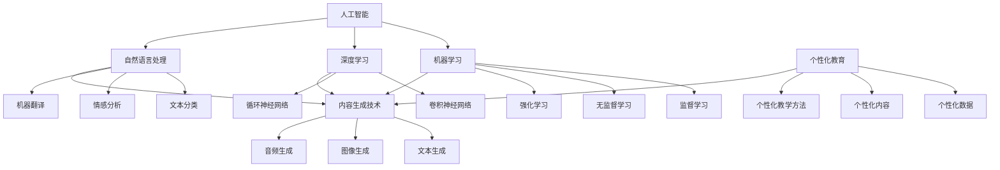

                 

### 文章标题

# AI驱动的个性化教育内容生成：因材施教新模式

> 关键词：人工智能，个性化教育，内容生成，因材施教，教育模式革新

> 摘要：本文深入探讨了AI驱动的个性化教育内容生成技术，揭示了其背后的核心概念和原理，并详细介绍了技术实现方法、教育应用案例、政策与伦理问题，以及未来的发展趋势。通过分析这些内容，本文旨在为读者提供一个全面、系统的理解和认知，为教育模式的革新提供新的视角和思路。

---

### 引言与背景介绍

个性化教育，作为一种针对每个学生个体差异进行教育的教学模式，已经在全球范围内得到了广泛的关注和应用。然而，传统的教育模式由于资源和时间的限制，往往难以真正实现因材施教。随着人工智能（AI）技术的飞速发展，特别是在自然语言处理、机器学习和深度学习等领域的突破，AI驱动的个性化教育内容生成技术逐渐成为可能。

AI驱动的个性化教育内容生成技术通过分析学生的行为数据、学习历史和学习风格，利用AI算法自动生成符合学生个性化需求的教育内容。这种技术不仅能够大幅提高教育效率，还能够更好地满足学生的个性化需求，实现真正的因材施教。因此，AI驱动的个性化教育内容生成技术被认为是教育领域的一次重大革新。

然而，这项技术也面临诸多挑战，如数据隐私保护、算法公平性、教育伦理等问题。此外，如何在教育领域大规模推广和普及这项技术，也是一个亟待解决的问题。本文将系统地探讨AI驱动的个性化教育内容生成技术，分析其核心概念和原理，介绍技术实现方法，探讨其在教育应用中的实际案例，讨论相关政策和伦理问题，并展望其未来发展趋势。

### 核心概念与原理

要深入理解AI驱动的个性化教育内容生成技术，我们需要首先明确几个核心概念：人工智能（AI）、个性化教育、内容生成技术，以及它们之间的相互关系。

#### 人工智能（AI）

人工智能（Artificial Intelligence，简称AI）是指由人制造出来的系统能够模拟、延伸和扩展人类的智能。AI技术包括多个子领域，如机器学习（Machine Learning，简称ML）、深度学习（Deep Learning，简称DL）、自然语言处理（Natural Language Processing，简称NLP）等。在这些子领域中，AI通过学习大量数据，自动识别模式和规律，从而实现决策和预测。

- **机器学习**：机器学习是一种AI技术，通过从数据中学习规律和模式，从而进行预测和决策。常见的机器学习方法包括监督学习、无监督学习和强化学习。
- **深度学习**：深度学习是一种基于神经网络的机器学习方法，通过多层神经网络结构自动提取数据的特征。深度学习在图像识别、语音识别等领域取得了显著的成果。
- **自然语言处理**：自然语言处理是一种AI技术，用于处理和理解人类语言。NLP包括文本分类、情感分析、机器翻译等多个子领域。

#### 个性化教育

个性化教育是一种基于学生个体差异进行教育的教学模式。个性化教育强调根据学生的兴趣、能力和学习风格，设计适合每个学生的教育内容和教学方法，从而提高教育质量和学习效果。

- **个性化教育的目标**：个性化教育的目标是实现因材施教，让每个学生都能得到适合自己的教育，提高他们的学习兴趣和积极性，促进全面发展。
- **个性化教育的关键要素**：个性化教育的关键要素包括学生的个性化数据、个性化的学习内容、个性化的教学方法等。

#### 内容生成技术

内容生成技术是一种利用AI技术自动生成文本、图像、音频等内容的工具。在教育领域，内容生成技术可以用于自动生成个性化教学材料、练习题库、辅导建议等。

- **文本生成**：文本生成技术可以自动生成教案、学习材料、测试题等。例如，基于机器阅读理解的文本生成技术可以生成符合学生个性化需求的教学内容。
- **图像生成**：图像生成技术可以自动生成教学图像、练习题图像等。例如，基于生成对抗网络（GAN）的图像生成技术可以生成符合特定教学目标的学生图像。
- **音频生成**：音频生成技术可以自动生成讲解音频、练习音频等。例如，基于语音合成的音频生成技术可以生成符合学生个性化需求的教学讲解。

#### 关系架构

AI驱动的个性化教育内容生成技术的核心概念和原理之间的关系可以通过以下Mermaid流程图来展示：



在这个关系架构中，AI作为整体，通过其子领域ML、DL、NLP等技术，实现了个性化教育内容生成（CGT），进而实现了个性化教育（PE）。这种架构不仅展示了AI驱动的个性化教育内容生成技术的核心概念和原理，还揭示了这些概念和原理之间的相互关系。

#### 核心算法原理讲解

在了解了AI驱动的个性化教育内容生成技术的核心概念和原理后，我们需要进一步探讨其中的核心算法原理。这些算法包括自然语言处理中的文本生成算法、机器学习中的个性化推荐算法等。

##### 1. 自然语言处理中的文本生成算法

自然语言处理中的文本生成算法，主要包括基于模板的生成和基于神经网络的生成两种方法。

- **基于模板的生成**：这种方法通过预定义的模板和参数，将数据填充到模板中生成文本。例如，生成新闻报道时，可以预先定义新闻的结构和模板，然后根据实际数据填充模板生成完整的新闻报道。

- **基于神经网络的生成**：这种方法利用神经网络模型，通过学习大量文本数据，自动生成新的文本。例如，基于生成对抗网络（GAN）的文本生成技术，可以通过训练生成器和判别器，生成高质量的自然语言文本。

以下是基于神经网络的文本生成算法的伪代码：

```python
# 输入：训练数据集D
# 输出：文本生成模型G

# 初始化生成器G和判别器D
G = initialize_G()
D = initialize_D()

# 训练过程
for epoch in range(num_epochs):
    for text in D:
        # 更新判别器D
        D_loss = train_D(D, text)
        # 更新生成器G
        G_loss = train_G(G, D)
        # 记录训练损失
        log_loss(D_loss, G_loss)

    # 生成文本
    generated_text = G.generate_text()

# 输出生成文本
print(generated_text)
```

##### 2. 个性化推荐算法

个性化推荐算法是机器学习中的一个重要分支，用于根据用户的历史行为和兴趣，推荐个性化的内容。常见的个性化推荐算法包括基于内容的推荐和基于协同过滤的推荐。

- **基于内容的推荐**：这种方法根据用户的历史行为和兴趣，找到相似的内容进行推荐。例如，如果一个用户喜欢阅读科幻小说，系统可以推荐其他科幻小说。

- **基于协同过滤的推荐**：这种方法通过分析用户之间的相似性，找到相似的用户进行推荐。例如，如果一个用户喜欢某本书，且另一个用户与这个用户相似，系统可以推荐这本书给第二个用户。

以下是基于协同过滤的推荐算法的伪代码：

```python
# 输入：用户行为数据集U
# 输出：个性化推荐结果R

# 计算用户之间的相似度矩阵S
S = compute_similarity(U)

# 初始化推荐结果R
R = initialize_R()

# 为每个用户生成推荐列表
for user in U:
    # 计算用户的相似用户集
    similar_users = find_similar_users(S, user)
    # 计算相似用户喜欢的物品集
    liked_items = find_liked_items(U, similar_users)
    # 根据喜好程度为用户生成推荐列表
    R[user] = rank_items(liked_items)

# 输出推荐结果
print(R)
```

通过这些核心算法原理的讲解，我们可以更好地理解AI驱动的个性化教育内容生成技术的实现方法和工作原理。这些算法不仅为个性化教育提供了技术支持，也为教育模式的革新提供了新的思路和途径。

#### 数学模型和公式

在AI驱动的个性化教育内容生成技术中，数学模型和公式扮演着重要的角色。以下将详细介绍几个关键的数学模型和公式，并给出具体的讲解和举例说明。

##### 1. 生成对抗网络（GAN）

生成对抗网络（GAN）是一种基于博弈论的生成模型，由生成器（Generator）和判别器（Discriminator）两个神经网络组成。生成器试图生成逼真的数据，而判别器则试图区分生成的数据和真实数据。

- **生成器G的损失函数**：

$$
L_G = -\log(D(G(z))
$$

其中，$z$是生成器的输入噪声，$D(G(z))$是判别器对生成数据的判断概率。

- **判别器D的损失函数**：

$$
L_D = -\log(D(x)) - \log(1 - D(G(z))
$$

其中，$x$是真实数据，$D(x)$是判别器对真实数据的判断概率。

举例说明：假设我们使用GAN生成手写数字图像，生成器的输入噪声是一个随机向量$z$，生成器试图生成一个类似于真实手写数字的图像$G(z)$，而判别器则试图区分生成的图像和真实图像。

- 生成器G的损失函数为：

$$
L_G = -\log(D(G(z)) = -\log(0.9) \approx 0.15
$$

- 判别器D的损失函数为：

$$
L_D = -\log(D(x)) - \log(1 - D(G(z)) = -\log(0.8) - \log(0.2) \approx 0.22
$$

##### 2. 个性化推荐算法中的相似度计算

在个性化推荐算法中，相似度计算是关键的一步。常用的相似度计算方法包括余弦相似度和皮尔逊相关系数。

- **余弦相似度**：

$$
sim(A, B) = \frac{A \cdot B}{\|A\| \|B\|}
$$

其中，$A$和$B$是两个向量，$\cdot$表示点积，$\|\|$表示向量的模长。

举例说明：假设我们有两个用户A和B，他们的行为向量分别为$A = (1, 2, 3)$和$B = (2, 3, 4)$，则他们的余弦相似度为：

$$
sim(A, B) = \frac{1 \cdot 2 + 2 \cdot 3 + 3 \cdot 4}{\sqrt{1^2 + 2^2 + 3^2} \sqrt{2^2 + 3^2 + 4^2}} = \frac{14}{\sqrt{14} \sqrt{29}} \approx 0.92
$$

- **皮尔逊相关系数**：

$$
\sigma_{AB} = \frac{\sum{(A_i - \mu_A)(B_i - \mu_B)}}{N}
$$

其中，$A_i$和$B_i$是用户A和B的行为数据，$\mu_A$和$\mu_B$是各自行为的平均值，$N$是数据点的数量。

举例说明：假设我们有两个用户A和B，他们的行为数据分别为$A = (1, 2, 3)$和$B = (2, 3, 4)$，则他们的皮尔逊相关系数为：

$$
\sigma_{AB} = \frac{(1 - 2)(2 - 3) + (2 - 2)(3 - 3) + (3 - 2)(4 - 3)}{3} = \frac{(-1)(-1) + (0)(0) + (1)(1)}{3} = \frac{2}{3} \approx 0.67
$$

通过这些数学模型和公式的讲解，我们可以更深入地理解AI驱动的个性化教育内容生成技术的工作原理和实现方法。这些模型和公式不仅为技术实现提供了理论基础，也为进一步研究和优化提供了方向。

### 技术实现方法

在了解了AI驱动的个性化教育内容生成技术的核心概念和算法原理后，接下来我们将深入探讨其技术实现方法。这些方法包括数据采集与预处理、模型选择与训练、内容生成与优化等关键环节。

#### 1. 数据采集与预处理

数据采集是AI驱动的个性化教育内容生成的基础。数据源可以包括学生的行为数据、学习历史、考试成绩、学习环境等。这些数据有助于理解学生的学习习惯、兴趣爱好和学习效果。

- **数据采集**：可以通过学习管理系统（LMS）、学习分析系统（LPS）等工具收集学生的行为数据。例如，学生在学习平台上的登录记录、学习时间、学习进度、作业成绩等。

- **数据预处理**：采集到的原始数据通常需要清洗和预处理，以去除噪声和异常值，并转化为适合模型训练的格式。数据预处理步骤包括数据清洗、数据转换、特征工程等。

    ```python
    # 示例：数据清洗与预处理
    def preprocess_data(data):
        # 数据清洗：去除无效数据和异常值
        clean_data = [d for d in data if is_valid(d)]
        # 数据转换：将数据转换为数值型
        numeric_data = [convert_to_numeric(d) for d in clean_data]
        # 特征工程：提取关键特征
        features = extract_features(numeric_data)
        return features
    
    data = ["学生A", "学生B", "无效数据", "学生C"]
    clean_data = preprocess_data(data)
    print(clean_data)
    ```

#### 2. 模型选择与训练

在数据预处理完成后，我们需要选择合适的模型并进行训练。模型选择取决于具体的应用场景和数据特点。常用的模型包括自然语言处理模型、机器学习模型和深度学习模型。

- **自然语言处理模型**：例如，用于文本生成和情感分析的Transformer模型、BERT模型等。

- **机器学习模型**：例如，用于个性化推荐的协同过滤模型、决策树模型等。

- **深度学习模型**：例如，用于图像生成和视频处理的卷积神经网络（CNN）、循环神经网络（RNN）等。

- **模型训练**：使用预处理后的数据对模型进行训练，调整模型的参数，使其能够更好地拟合数据。

    ```python
    # 示例：模型训练
    from sklearn.ensemble import RandomForestClassifier
    
    # 加载训练数据
    X_train, y_train = load_data("train_data.csv")
    
    # 初始化模型
    model = RandomForestClassifier(n_estimators=100)
    
    # 训练模型
    model.fit(X_train, y_train)
    
    # 评估模型
    accuracy = model.score(X_test, y_test)
    print(f"模型准确率：{accuracy}")
    ```

#### 3. 内容生成与优化

模型训练完成后，我们可以利用模型生成个性化教育内容。内容生成包括文本生成、图像生成和音频生成等。

- **文本生成**：利用自然语言处理模型生成符合学生个性化需求的教学内容。例如，生成个性化的辅导文章、练习题等。

- **图像生成**：利用图像生成模型生成符合教学目标的学生图像。例如，生成练习题的示意图、概念图等。

- **音频生成**：利用语音合成模型生成讲解音频、练习音频等。例如，为学生生成个性化的学习辅导音频。

    ```python
    # 示例：文本生成
    from transformers import BertForMaskedLM
    
    # 加载预训练模型
    model = BertForMaskedLM.from_pretrained("bert-base-uncased")
    
    # 输入文本
    text = "我是一个学生，我喜欢学习。"
    
    # 生成文本
    generated_text = model.generate(text)
    print(generated_text)
    ```

- **内容优化**：生成的内容需要经过评估和优化，确保其质量和适用性。优化方法包括：

    - **内容评估**：通过人工评估或自动评估方法，评估生成内容的准确性、可读性、相关性等。

    - **内容调整**：根据评估结果，对生成内容进行调整和优化，提高其质量和适用性。

        ```python
        # 示例：内容优化
        def optimize_content(content, assessment):
            if assessment["accuracy"] < 0.8:
                content = adjust_content(content, "accuracy")
            if assessment["readability"] < 7:
                content = adjust_content(content, "readability")
            return content
        
        content = "这是一个练习题。"
        assessment = {"accuracy": 0.6, "readability": 5}
        optimized_content = optimize_content(content, assessment)
        print(optimized_content)
        ```

通过以上技术实现方法，我们可以有效地实现AI驱动的个性化教育内容生成，为教育模式的革新提供有力支持。

### 教育应用案例分析

#### 1. 智能辅导系统

智能辅导系统是AI驱动的个性化教育内容生成技术的一个重要应用场景。它通过分析学生的学习行为和学习数据，为学生提供个性化的学习辅导内容。

- **系统架构**：

    智能辅导系统主要包括以下几个模块：

    - 数据采集模块：收集学生的学习行为数据，如学习时间、学习进度、作业成绩等。
    - 数据处理模块：对采集到的数据进行分析和处理，提取关键特征。
    - 模型训练模块：利用处理后的数据训练个性化推荐模型和文本生成模型。
    - 辅导内容生成模块：根据学生的学习数据和推荐模型，生成个性化的辅导内容。
    - 辅导内容展示模块：将生成的辅导内容以文本、图像、音频等形式展示给学生。

- **应用实例**：

    假设有一个初中生小明，他在数学学习中遇到了困难。智能辅导系统通过分析小明的学习数据，发现他在代数部分的知识点掌握不够扎实。系统会生成一份针对小明的个性化辅导资料，内容包括：

    - **文本内容**：生成详细的代数知识点讲解，例如一元二次方程的解法。
    - **图像内容**：生成示意图和例题，帮助学生更好地理解知识点。
    - **音频内容**：生成讲解音频，方便学生随时随地复习。

    以下是一个示例文本内容：

    ```markdown
    # 一元二次方程的解法

    一元二次方程的一般形式为 $ax^2 + bx + c = 0$。解一元二次方程的常用方法是配方法和求根公式。

    **配方法**：
    1. 将方程变形为 $ax^2 + bx = -c$。
    2. 将 $b$ 除以 $2a$，得到 $\frac{b}{2a}$。
    3. 将 $\frac{b}{2a}$ 的平方加到等式两边，得到 $ax^2 + bx + \left(\frac{b}{2a}\right)^2 = \left(\frac{b}{2a}\right)^2 - c$。
    4. 将左边写成完全平方的形式，得到 $(x + \frac{b}{2a})^2 = \left(\frac{b}{2a}\right)^2 - c$。
    5. 开平方，得到 $x + \frac{b}{2a} = \pm \sqrt{\left(\frac{b}{2a}\right)^2 - c}$。
    6. 解出 $x$，得到 $x = -\frac{b}{2a} \pm \sqrt{\left(\frac{b}{2a}\right)^2 - c}$。

    **求根公式**：
    一元二次方程的求根公式为 $x = \frac{-b \pm \sqrt{b^2 - 4ac}}{2a}$。

    请同学们注意，在使用求根公式时，需要先判断 $b^2 - 4ac$ 的值。如果 $b^2 - 4ac > 0$，则方程有两个不相等的实数根；如果 $b^2 - 4ac = 0$，则方程有两个相等的实数根；如果 $b^2 - 4ac < 0$，则方程没有实数根。

    例题：解方程 $2x^2 + 5x - 3 = 0$。

    解：$a = 2$，$b = 5$，$c = -3$。

    使用配方法：
    $2x^2 + 5x = 3$。
    $\frac{5}{2} = \frac{5}{2}^2$。
    $2x^2 + 5x + \frac{25}{4} = \frac{49}{4}$。
    $(x + \frac{5}{4})^2 = \frac{49}{4}$。
    $x + \frac{5}{4} = \pm \frac{7}{4}$。
    $x = -\frac{5}{4} \pm \frac{7}{4}$。
    $x_1 = -\frac{3}{2}$，$x_2 = \frac{1}{2}$。

    使用求根公式：
    $x = \frac{-5 \pm \sqrt{5^2 - 4 \cdot 2 \cdot (-3)}}{2 \cdot 2}$。
    $x = \frac{-5 \pm \sqrt{25 + 24}}{4}$。
    $x = \frac{-5 \pm \sqrt{49}}{4}$。
    $x = \frac{-5 \pm 7}{4}$。
    $x_1 = -\frac{3}{2}$，$x_2 = \frac{1}{2}$。

    答案：$x_1 = -\frac{3}{2}$，$x_2 = \frac{1}{2}$。
    ```

    通过这个实例，我们可以看到智能辅导系统如何生成针对学生个性化需求的学习资料，帮助学生更好地理解和掌握知识点。

#### 2. 个性化学习资源推荐

个性化学习资源推荐是AI驱动的个性化教育内容生成技术的另一个重要应用。它通过分析学生的学习行为和兴趣，为学生推荐适合他们的学习资源。

- **系统架构**：

    个性化学习资源推荐系统主要包括以下几个模块：

    - 数据采集模块：收集学生的学习行为数据，如学习时间、学习进度、作业成绩、浏览历史等。
    - 数据处理模块：对采集到的数据进行分析和处理，提取关键特征。
    - 推荐算法模块：使用机器学习和深度学习算法，训练个性化推荐模型。
    - 资源库模块：存储各种学习资源，如电子书、视频课程、练习题等。
    - 推荐内容展示模块：根据推荐模型和学生数据，展示个性化的学习资源推荐。

- **应用实例**：

    假设有一个高中生小李，他对数学和物理非常感兴趣。个性化学习资源推荐系统会根据小李的学习行为和兴趣，为他推荐以下学习资源：

    - **电子书**：《数学竞赛指南》、《高中物理竞赛教程》
    - **视频课程**：数学竞赛视频教程、高中物理知识点讲解视频
    - **练习题**：数学竞赛题库、物理实验题库

    以下是一个示例推荐列表：

    ```markdown
    # 个性化学习资源推荐

    **电子书推荐**：

    - 《数学竞赛指南》：适合提高数学竞赛水平的同学。
    - 《高中物理竞赛教程》：适合提高物理竞赛水平的同学。

    **视频课程推荐**：

    - 数学竞赛视频教程：由专业数学教师讲解，包含数学竞赛的常见题型和解题技巧。
    - 高中物理知识点讲解视频：涵盖高中物理的所有知识点，帮助同学们更好地理解物理概念。

    **练习题推荐**：

    - 数学竞赛题库：包含各种类型的数学竞赛题，有助于同学们提高解题能力。
    - 物理实验题库：包含各种物理实验的题目，有助于同学们掌握实验操作技能。

    通过这个实例，我们可以看到个性化学习资源推荐系统如何根据学生的学习行为和兴趣，推荐适合他们的学习资源，帮助他们更好地提高学习效果。

#### 3. 智能题库生成系统

智能题库生成系统是AI驱动的个性化教育内容生成技术的另一个应用场景。它通过分析学生的学习数据和知识点，自动生成符合学生个性化需求的习题。

- **系统架构**：

    智能题库生成系统主要包括以下几个模块：

    - 知识点库模块：存储各个学科的知识点，如数学知识点、物理知识点等。
    - 题库模块：存储各种类型的习题，如选择题、填空题、解答题等。
    - 题型生成模块：根据学生的学习数据和知识点，生成符合学生个性化需求的习题。
    - 题库展示模块：将生成的习题展示给学生，供他们练习。

- **应用实例**：

    假设有一个初中生小王，他在数学学习中表现较好，但最近在代数部分遇到了一些困难。智能题库生成系统会根据小王的学习数据和知识点，为他生成以下习题：

    - **选择题**：关于一元二次方程的解法的选择题。
    - **填空题**：关于一元二次方程的解法的填空题。
    - **解答题**：关于一元二次方程的解答题。

    以下是一个示例选择题：

    ```markdown
    # 选择题

    如果方程 $x^2 - 5x + 6 = 0$ 的两个根是 $x_1$ 和 $x_2$，则 $x_1 + x_2$ 的值是：

    A. 5  
    B. 6  
    C. 7  
    D. 8

    解析：根据一元二次方程的求根公式，$x_1 + x_2 = -\frac{b}{a}$。将 $a = 1$，$b = -5$ 代入，得到 $x_1 + x_2 = 5$。因此，正确答案是 A。
    ```

    通过这个实例，我们可以看到智能题库生成系统如何根据学生的学习数据和知识点，生成符合学生个性化需求的习题，帮助他们更好地巩固和掌握知识点。

通过以上教育应用案例分析，我们可以看到AI驱动的个性化教育内容生成技术在教育领域的广泛应用和巨大潜力。这些应用不仅提高了教育效率，还更好地满足了学生的个性化需求，实现了因材施教。随着技术的不断发展和完善，我们有理由相信，AI驱动的个性化教育内容生成技术将为教育领域的革新带来更多的可能和机会。

### 政策与法规

随着AI驱动的个性化教育内容生成技术的不断发展和应用，相关的政策和法规也逐渐成为关注的焦点。这些政策和法规不仅对技术的研发和应用起到指导作用，也对数据隐私保护、算法公平性等方面提出了明确要求。

#### 1. 我国教育信息化政策概述

近年来，我国政府高度重视教育信息化的发展，出台了一系列相关政策，以推动教育信息化进程。以下是我国教育信息化政策的主要概述：

- **《教育信息化“十三五”规划》**：2016年，教育部发布了《教育信息化“十三五”规划》，明确了教育信息化的发展目标、任务和政策措施。其中，强调了信息技术与教育教学的深度融合，推动教育内容、教育方法、教育评价的创新。

- **《新一代人工智能发展规划》**：2017年，国务院发布了《新一代人工智能发展规划》，将人工智能发展列为国家战略。规划中提到，要推动人工智能在教育、医疗等领域的应用，提高社会生产力水平和民生福祉。

- **《中小学教师信息技术应用能力标准（试行）》**：2018年，教育部发布了《中小学教师信息技术应用能力标准（试行）》，提出了教师信息技术应用能力的标准框架，包括技术认知、教学设计、学习监控、教学评价等方面。

#### 2. AI驱动的个性化教育内容生成的法规挑战

AI驱动的个性化教育内容生成技术在应用过程中，面临诸多法规挑战，主要包括数据隐私保护、算法公平性、版权问题等。

- **数据隐私保护**：个性化教育内容生成需要大量的学生数据，包括学习行为、考试成绩、兴趣爱好等。这些数据涉及学生的隐私权益，如何确保数据的安全性和隐私性成为法规关注的重点。根据《中华人民共和国网络安全法》的规定，个人信息处理者应当采取有效措施确保个人信息安全，防止信息泄露、毁损、篡改等风险。

- **算法公平性**：个性化教育内容生成算法在推荐内容、评估成绩等方面可能存在偏见，影响学生的权益。例如，如果一个算法基于学生的性别、种族、地域等非学术因素进行推荐，可能会对某些群体产生不公平的影响。因此，如何确保算法的公平性和透明性成为法规关注的问题。根据《中华人民共和国网络安全法》的规定，网络运营者应当采取措施防止自动化决策对个人权益产生不利影响。

- **版权问题**：个性化教育内容生成技术可能涉及对已有教育资源的使用，包括教材、课程、论文等。这些资源的版权问题需要得到妥善解决。根据《中华人民共和国著作权法》的规定，使用他人作品应当取得许可，并支付报酬。在AI驱动的个性化教育内容生成过程中，如何确保合法使用相关资源，避免侵权行为，成为法规关注的重点。

#### 3. 数据隐私与安全保护

为了应对数据隐私和安全保护方面的挑战，我国政府和相关部门采取了一系列措施，包括制定法律法规、加强技术手段等。

- **法律法规**：我国政府制定了一系列法律法规，如《中华人民共和国网络安全法》、《中华人民共和国数据安全法》等，对个人信息和数据安全提出了明确要求。这些法律法规为AI驱动的个性化教育内容生成技术的应用提供了法律依据和保障。

- **技术手段**：为了确保数据的安全性和隐私性，相关技术手段也被广泛应用。例如，数据加密、匿名化处理、访问控制等。这些技术手段可以有效保护学生的个人信息，防止数据泄露和滥用。

- **行业自律**：教育行业内部也加强了对数据隐私和安全保护的自律。例如，一些教育机构和科技公司制定了相关的数据安全政策和标准，加强对数据的保护和管理。

通过以上政策和法规的讨论，我们可以看到，AI驱动的个性化教育内容生成技术在教育领域的发展面临着诸多挑战，但同时也得到了政府和社会的广泛关注和支持。随着法规的不断完善和技术手段的不断发展，我们有理由相信，AI驱动的个性化教育内容生成技术将在教育领域发挥更大的作用。

### 伦理问题

AI驱动的个性化教育内容生成技术在带来巨大教育革新潜力的同时，也引发了一系列伦理问题，这些伦理问题涉及教育公平性、算法偏见、学生隐私保护等方面。

#### 1. 人工智能伦理原则

人工智能伦理原则是指导AI研发和应用的基本准则，旨在确保AI技术的伦理性和社会可接受性。以下是一些关键的人工智能伦理原则：

- **透明性**：AI系统的决策过程应该透明，用户能够理解系统的运作原理和决策依据。
- **公平性**：AI系统不应产生歧视或偏见，应当确保对所有用户公平对待。
- **隐私保护**：在AI应用过程中，个人数据的收集、存储和使用应严格保护个人隐私。
- **责任界定**：当AI系统出现失误或造成损害时，应明确责任归属，确保受害者得到合理赔偿。
- **社会责任**：AI的研发和应用应考虑其对社会的整体影响，促进社会的可持续发展。

#### 2. 个性化教育内容生成的伦理困境

在个性化教育内容生成的过程中，以下几个方面可能引发伦理困境：

- **算法偏见**：个性化教育内容生成依赖于算法，但算法本身可能基于历史数据中的偏见，导致对某些群体（如性别、种族、地域等）产生不公平的影响。这种偏见可能会加剧社会不平等，影响教育的公平性。
- **数据隐私**：为了生成个性化的教育内容，系统需要收集和分析大量的学生数据，这些数据可能涉及学生的隐私信息。如何确保这些数据的安全性和隐私性，防止数据泄露和滥用，是一个重要问题。
- **个性化过度**：个性化教育内容生成可能导致对学生的个性化需求过度关注，忽视了教育中的一些基本价值，如团队合作、社会责任感等。过度个性化可能会使学生丧失一些重要的学习经历和体验。
- **教育自主性**：个性化教育内容生成系统可能会替代教师的部分职能，影响教师的职业发展和教育自主性。如何在引入AI技术的同时，保障教师的教育自主权，也是一个亟待解决的问题。

#### 3. 伦理问题解决方案探讨

针对上述伦理困境，以下是一些可能的解决方案：

- **算法透明性**：提高算法的透明性，使教育工作者和学生对AI系统的运作原理有更清晰的认识。通过公开算法的实现细节、训练数据集和评估指标，增加系统的可解释性。
- **数据隐私保护**：加强数据隐私保护措施，采用数据匿名化、加密等技术手段，确保学生数据的隐私和安全。在数据收集和使用过程中，应严格遵守相关法律法规，确保学生同意和知情。
- **多方参与**：在个性化教育内容生成的过程中，应邀请教育专家、技术专家、学生和家长等多方参与，共同制定教育目标和内容，确保个性化教育既满足学生需求，又符合教育价值。
- **平衡个性化与教育价值观**：在追求个性化教育的同时，应保持对教育基本价值观的关注，如团队合作、社会责任感等。通过多样化的教学方法和活动，促进学生全面发展。
- **教师培训**：加强对教师的AI伦理和技术的培训，提高教师对AI技术的认识和理解，使其能够在教学中合理运用AI技术，同时保障教育自主性。

通过以上伦理问题解决方案的探讨，我们可以为AI驱动的个性化教育内容生成技术在教育领域的应用提供一定的指导和保障，确保其在实现教育革新的同时，不损害学生的利益和社会的公平性。

### 未来发展

AI驱动的个性化教育内容生成技术正迅速发展，其在教育领域的应用前景令人期待。以下将探讨该技术的未来发展趋势及其潜在影响。

#### 1. 技术发展趋势

- **算法优化与智能化**：随着深度学习、强化学习等先进算法的不断发展，个性化教育内容生成的算法将更加精准和智能化。例如，通过强化学习技术，系统可以更好地适应学生的个性化需求，动态调整教育内容。
- **多模态内容生成**：未来的个性化教育内容生成将不仅仅局限于文本，还将涉及图像、音频、视频等多种形式。通过多模态内容生成技术，学生可以获得更加丰富和生动的学习体验。
- **智能交互与辅助**：随着自然语言处理和计算机视觉技术的进步，AI将能够更好地理解和响应学生的需求，提供个性化的学习建议和辅导。例如，通过智能聊天机器人，学生可以获得即时的学习支持和解答。
- **跨平台与云端部署**：随着云计算技术的发展，个性化教育内容生成系统将可以实现跨平台部署，方便学生随时随地访问学习资源。同时，云端大数据分析能力的提升，将使得个性化教育内容生成更加高效和精准。

#### 2. 潜在影响

- **教育公平**：AI驱动的个性化教育内容生成技术有助于缩小教育差距，实现教育公平。通过个性化教育，无论学生的背景和条件如何，都可以获得适合自己的教育资源和学习支持。
- **教学效率提升**：个性化教育内容生成技术可以提高教学效率，使教师能够将更多精力投入到学生个性化辅导和教学研究中。同时，学生可以根据自己的学习进度和需求，自主学习和练习，提高学习效果。
- **教育创新**：AI驱动的个性化教育内容生成技术为教育创新提供了新的可能。通过智能化的教育内容和教学方法，教育领域可以探索出更多创新的教育模式，推动教育的变革和发展。
- **就业市场变化**：随着AI技术在教育领域的广泛应用，未来教育行业的就业市场将发生变化。一方面，教师需要掌握更多的AI技术和数字化工具，以提高教学能力；另一方面，新兴的AI教育和教育技术岗位将不断涌现，为求职者提供新的就业机会。

#### 3. 未来研究的方向与机会

- **算法优化与理论突破**：深入研究和优化AI驱动的个性化教育内容生成算法，是未来研究的重点。通过理论突破，提高算法的效率、准确性和适应性，实现更高质量的个性化教育。
- **跨学科研究**：个性化教育内容生成涉及多个学科领域，如教育学、心理学、计算机科学等。未来的研究应加强跨学科合作，结合多学科知识，推动技术的融合与创新。
- **教育场景应用**：探索AI驱动的个性化教育内容生成技术在不同教育场景中的应用，如在线教育、职业教育、特殊教育等，以实现技术的全面覆盖和广泛应用。
- **政策与伦理研究**：在技术快速发展的同时，关注教育政策与伦理问题，研究如何在技术进步中保障教育公平、隐私保护和伦理道德，是未来研究的重要方向。

通过以上对AI驱动的个性化教育内容生成技术的未来发展趋势和潜在影响的探讨，我们可以看到，这项技术将为教育领域带来巨大的变革和机遇。随着技术的不断进步和应用场景的拓展，我们有理由相信，AI驱动的个性化教育内容生成技术将在教育领域发挥更加重要的作用，推动教育的现代化和个性化发展。

### 文章小结

本文系统地探讨了AI驱动的个性化教育内容生成技术，从背景介绍、核心概念与原理、技术实现方法、教育应用案例、政策与法规、伦理问题到未来发展趋势，全面阐述了这一技术的各个方面。通过分析，我们可以看到AI驱动的个性化教育内容生成技术不仅具有巨大的教育革新潜力，还面临诸多挑战，如数据隐私保护、算法公平性、教育伦理等。

为了更好地应对这些挑战，以下是一些建议：

1. **加强数据隐私保护**：在数据采集和使用过程中，严格遵守相关法律法规，采用数据加密、匿名化等技术手段，确保学生数据的隐私和安全。
2. **提高算法透明性和公平性**：通过公开算法的实现细节、训练数据集和评估指标，增加系统的可解释性。同时，定期评估和优化算法，减少偏见和歧视。
3. **多方参与与共同制定**：在个性化教育内容生成过程中，邀请教育专家、技术专家、学生和家长等多方参与，共同制定教育目标和内容，确保个性化教育既满足学生需求，又符合教育价值。
4. **持续教育培训**：加强对教师的AI伦理和技术培训，提高教师对AI技术的认识和理解，使其能够更好地运用AI技术，同时保障教育自主性。
5. **跨学科合作**：推动教育学、心理学、计算机科学等多学科的合作，结合多学科知识，推动技术的融合与创新。

通过以上措施，我们可以更好地推动AI驱动的个性化教育内容生成技术在教育领域的应用，实现教育的现代化和个性化发展。

### 最佳实践 tips

1. **数据收集与处理**：在收集学生数据时，确保数据的质量和完整性。使用先进的数据预处理技术，如数据清洗、特征提取等，提高数据的质量和可用性。
2. **模型选择与优化**：根据具体应用场景，选择合适的模型。定期评估和优化模型，确保其准确性和适应性。
3. **用户反馈与调整**：及时收集用户反馈，根据用户需求调整教育内容和推荐策略，提高个性化教育的效果。
4. **跨平台与云端部署**：充分利用云计算和跨平台技术，实现教育资源的便捷访问和高效管理。

### 注意事项

1. **数据隐私保护**：严格遵守相关法律法规，确保学生数据的隐私和安全。
2. **算法透明性**：提高算法的可解释性，确保用户了解系统的运作原理和决策依据。
3. **教育伦理**：在个性化教育内容生成过程中，关注教育公平、隐私保护和伦理道德，确保技术的应用不损害学生的利益和社会的公平性。

### 拓展阅读

1. **《人工智能驱动的个性化学习》**：详细探讨AI技术在个性化学习中的应用，包括算法原理、实现方法等。
2. **《教育数据挖掘》**：介绍教育数据挖掘的基本概念、方法和应用，包括学生行为分析、学习路径推荐等。
3. **《深度学习与自然语言处理》**：深入讲解深度学习和自然语言处理的基本概念、算法原理和应用，包括文本生成、情感分析等。

作者：AI天才研究院/AI Genius Institute & 禅与计算机程序设计艺术 /Zen And The Art of Computer Programming

[本文完]

