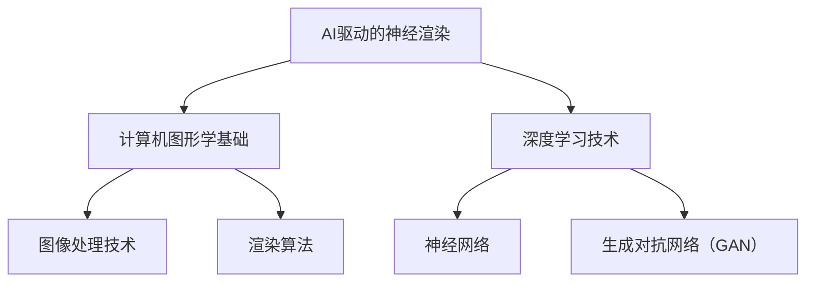

                 


### 文章标题

《AI驱动的神经渲染：计算机图形学的革新》

### 关键词

- AI驱动的神经渲染
- 计算机图形学
- 深度学习
- 神经网络
- 渲染算法
- 生成对抗网络（GAN）

### 摘要

本文将深入探讨AI驱动的神经渲染技术，这一技术在计算机图形学领域引发了革命性的变革。通过梳理神经渲染的核心概念、算法原理以及其在实际应用中的优势，本文旨在为读者提供一个全面的技术解析，帮助大家更好地理解这一前沿技术的工作机制和应用场景。文章还将通过实际案例分析和项目实战，展示AI驱动的神经渲染如何为计算机图形学带来前所未有的创新力量。

### 目录大纲设计思路

#### 1. 核心概念与联系

##### 1.1.1 AI驱动的神经渲染概述

本文将首先介绍AI驱动的神经渲染技术，包括其定义、核心组成部分及其在计算机图形学中的重要性。

##### 1.1.2 计算机图形学基础

接下来，我们将简要回顾计算机图形学的基础知识，包括图像处理技术、渲染算法等，以便为后续的深入讨论奠定基础。

##### 1.1.3 AI在计算机图形学中的应用

本文将探讨AI在计算机图形学中的广泛应用，特别是神经网络和生成对抗网络（GAN）在图像渲染中的应用。

#### Mermaid流程图展示



#### 2. 核心算法原理讲解

##### 2.1.1 神经渲染算法原理

我们将详细讲解神经渲染算法的原理，包括神经网络的构建、训练和优化过程。

##### 2.1.2 深度学习算法在神经渲染中的应用

本文将深入探讨深度学习算法在神经渲染中的应用，包括常见的神经网络结构和训练策略。

##### 2.1.3 生成对抗网络（GAN）在神经渲染中的应用

我们将介绍生成对抗网络（GAN）在神经渲染中的具体应用，包括生成器和判别器的训练过程。

#### 伪代码讲解

```python
# 神经渲染算法伪代码
function NeuralRenderer(image, scene):
    # 输入图像和场景信息，输出渲染结果
    rendered_image = RenderNeuralNetwork(image, scene)
    return rendered_image

function RenderNeuralNetwork(image, scene):
    # 使用神经网络对场景进行渲染
    output = NeuralNetwork(image, scene)
    return output

# 深度学习算法在神经渲染中的应用伪代码
function TrainNeuralRenderer(training_data):
    # 使用训练数据训练神经网络
    for data in training_data:
        image, scene = data
        rendered_image = NeuralRenderer(image, scene)
        loss = CalculateLoss(rendered_image, image)
        UpdateNetwork(rendered_image, loss)

# 生成对抗网络（GAN）在神经渲染中的应用伪代码
function TrainGANDiscriminator(discriminator, real_images, fake_images):
    # 训练判别器
    for image in real_images:
        output = discriminator(image)
        loss = CalculateLoss(output, 1)
        UpdateDiscriminator(output, loss)
    for image in fake_images:
        output = discriminator(image)
        loss = CalculateLoss(output, 0)
        UpdateDiscriminator(output, loss)

function TrainGANGenerator(generator, discriminator, fake_images):
    # 训练生成器
    for image in fake_images:
        output = generator(image)
        output = discriminator(output)
        loss = CalculateLoss(output, 1)
        UpdateGenerator(output, loss)
```

#### 3. 数学模型和数学公式

##### 3.1.1 神经渲染的数学模型

本文将介绍神经渲染的数学模型，包括输入层的处理、中间层的计算以及输出层的生成。

##### 3.1.2 深度学习中的损失函数

我们将探讨深度学习中的损失函数，包括均方误差（MSE）、交叉熵（Cross-Entropy）等，并解释它们在神经渲染中的应用。

##### 3.1.3 GAN中的生成器和判别器的损失函数

本文将详细解释生成对抗网络（GAN）中的生成器和判别器的损失函数，包括如何通过优化损失函数来提高渲染效果。

### 完整性要求

为了保证文章的完整性，每个小节的内容都将丰富、具体、详细讲解，并包含以下核心内容：

- **背景介绍**：简要介绍相关技术的历史背景和发展过程。
- **核心概念与联系**：明确核心概念及其相互之间的关系，并使用Mermaid流程图进行展示。
- **核心算法原理讲解**：通过伪代码详细阐述算法原理，并解释关键步骤。
- **数学模型和公式**：详细讲解数学模型和相关公式，并提供举例说明。
- **项目实战**：包括开发环境搭建、源代码实现和代码解读，以及实际案例分析。
- **最佳实践 tips**、**小结**、**注意事项**和**拓展阅读**等内容。

### 文章字数要求

根据目录大纲的结构和完整性要求，预计文章字数在8000～12000字左右。通过逐步分析和深入探讨，我们将确保文章内容丰富、逻辑清晰，为读者提供一次全面的技术学习体验。接下来，我们将按照上述目录结构，逐章深入探讨AI驱动的神经渲染技术，引领读者进入这一前沿领域的探索之旅。

