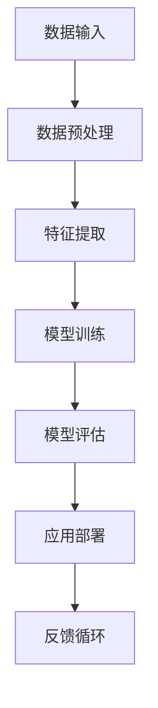

                 


# 文章标题

《AI驱动的程序化内容生成：游戏设计新思路》

## 关键词

AI、程序化内容生成、游戏设计、自然语言处理、深度学习、生成对抗网络（GAN）、游戏AI、图灵测试

## 摘要

本文探讨了人工智能（AI）在游戏设计中的应用，特别是程序化内容生成如何为游戏设计带来新的思路。文章首先介绍了AI的基础知识，包括核心概念和流程，接着详细解析了AI驱动的文本生成、图像生成和声音生成技术。随后，文章讨论了AI在游戏设计中的应用实践，包括游戏内容生成和游戏AI设计。最后，文章展望了AI驱动的游戏设计未来，并提出了面临的挑战和解决方案。本文旨在为游戏开发者提供一套系统化的AI技术应用指南，以激发创新思维，提升游戏设计质量。

----------------------------------------------------------------

## 引言

随着人工智能（AI）技术的迅猛发展，其应用范围日益广泛，涵盖了从医疗诊断到自动驾驶，从金融分析到游戏设计等多个领域。在游戏设计领域，AI的应用正逐渐改变传统的游戏开发模式，为游戏内容的生成和设计提供了全新的可能性。本文将深入探讨AI驱动的程序化内容生成在游戏设计中的应用，并阐述其带来的新思路。

程序化内容生成，顾名思义，是指通过算法和编程自动生成游戏内容，如故事情节、角色、关卡等。传统的游戏开发往往依赖于手工设计，效率低下，且难以应对复杂多变的需求。而AI驱动的程序化内容生成则能够高效、自动地生成丰富多样的游戏内容，从而提高开发效率，降低成本，并提升游戏的可玩性和创新性。

本文的结构如下：

1. **AI概述与游戏设计**：介绍AI在游戏设计中的应用背景和挑战。
2. **AI核心概念与流程图**：详细讲解AI的基础概念和相关流程。
3. **AI驱动的程序化内容生成技术**：分析文本生成、图像生成和声音生成技术。
4. **游戏设计中的应用实践**：讨论AI在游戏内容生成和游戏AI设计中的应用。
5. **未来展望与挑战**：探讨AI驱动的游戏设计的未来趋势和面临的挑战。

通过本文的讨论，我们希望能够为游戏开发者提供一套系统化的AI技术应用指南，以激发创新思维，提升游戏设计质量。同时，本文也将为对AI和游戏设计感兴趣的研究者提供一些有价值的参考。

### AI概述与游戏设计

#### AI在游戏设计中的应用背景

人工智能（AI）作为计算机科学的一个重要分支，其核心在于使计算机能够模拟、延伸和扩展人类的智能行为。随着深度学习、自然语言处理和生成模型等AI技术的不断进步，游戏设计领域迎来了前所未有的变革。AI在游戏设计中的应用，主要体现在以下几个方面：

首先，AI能够自动生成游戏内容。在传统游戏设计中，游戏内容通常是由设计师手工设计的，这个过程既耗时又耗力，且难以应对复杂多变的需求。而AI驱动的程序化内容生成，则可以通过算法和模型自动生成游戏中的各种元素，如故事情节、角色、关卡等。这种生成方式不仅提高了效率，还能够根据玩家的行为和反馈动态调整游戏内容，增强游戏的互动性和可玩性。

其次，AI用于游戏AI角色的智能行为设计。在游戏设计中，智能AI角色是提升游戏挑战性和趣味性的关键。通过AI技术，游戏开发者可以设计出具备自主学习能力的AI角色，这些角色能够根据游戏进程和玩家行为调整自己的策略和行动，从而创造出更加逼真和富有挑战性的游戏体验。

此外，AI在游戏数据分析和玩家行为预测中也发挥着重要作用。通过分析玩家的游戏行为数据，AI可以预测玩家的偏好和需求，为游戏运营提供决策支持。例如，AI可以帮助游戏开发者识别出游戏中的热点内容和问题，及时调整游戏设计和运营策略，提高玩家的满意度和留存率。

#### 游戏设计中的AI挑战

尽管AI在游戏设计中的应用前景广阔，但实际操作中仍面临着诸多挑战。首先，游戏内容的多样性和复杂性对AI算法提出了高要求。游戏内容不仅包括故事情节、角色和关卡，还包括丰富的交互元素和动态环境。如何设计出能够高效、自动生成复杂游戏内容的AI算法，是当前研究中的一个重要课题。

其次，游戏AI的智能行为设计也是一个巨大的挑战。传统AI算法往往依赖于大量数据进行训练，而游戏中的AI角色需要具备高度的自主学习和适应能力，这对算法的复杂度和计算效率提出了更高的要求。如何在保证智能行为真实性的同时，提高AI算法的效率和可扩展性，是游戏AI设计中的一个关键问题。

另外，AI在游戏设计中的应用还面临着法律和伦理问题。例如，自动生成的游戏内容可能会侵犯他人的知识产权，而智能AI角色在游戏中的行为也可能引发道德争议。如何在应用AI技术的同时，遵守相关法律法规，保护玩家的权益，是游戏开发者必须面对的挑战。

#### AI技术对游戏设计的变革

AI技术的引入，无疑为游戏设计带来了深刻的变革。首先，AI能够大幅提升游戏设计的效率。通过程序化内容生成，设计师可以从繁琐的手工劳动中解放出来，将更多精力投入到创意和优化上。同时，AI可以根据玩家的反馈和行为数据，动态调整游戏内容，提高游戏的适配性和用户体验。

其次，AI为游戏设计带来了更多的创新可能性。传统的游戏设计受限于设计师的创意和手艺，而AI则能够通过生成模型和算法，创造出前所未有的游戏元素和体验。例如，自动生成的游戏剧情和角色可以呈现出丰富多彩的故事线，智能AI角色可以带来更加逼真的游戏交互。

最后，AI的应用使得游戏设计更加个性化和定制化。通过分析玩家的行为和偏好，AI可以提供个性化的游戏内容推荐和体验，满足不同玩家的需求。这种定制化的游戏设计不仅能够提高玩家的满意度和留存率，也为游戏开发者带来了更多的商业机会。

总之，AI在游戏设计中的应用，不仅提高了效率和创新性，还为游戏设计带来了全新的思路和可能性。随着AI技术的不断进步，未来游戏设计将迎来更加丰富和多彩的发展前景。

### AI核心概念与流程图

#### AI基础概念

在深入探讨AI驱动的程序化内容生成之前，我们需要先了解一些AI的基础概念。AI的核心概念包括机器学习、深度学习和自然语言处理等。

##### 1. 机器学习

机器学习（Machine Learning）是指通过算法和模型，从数据中学习并自动改进性能的过程。它主要分为监督学习（Supervised Learning）、无监督学习（Unsupervised Learning）和强化学习（Reinforcement Learning）三种类型。

- **监督学习**：在监督学习中，算法使用标记好的训练数据来学习预测模型。例如，在分类问题中，算法通过已标记的数据学习如何将新数据分类到不同的类别中。
  
- **无监督学习**：无监督学习不使用标记数据，其目的是发现数据中的结构和模式。常见的无监督学习算法包括聚类算法（如K-均值聚类）和降维算法（如主成分分析PCA）。

- **强化学习**：强化学习是一种通过试错和奖励机制来学习的算法。它通常用于决策问题，算法通过与环境的互动来学习最优策略。

##### 2. 深度学习

深度学习（Deep Learning）是机器学习的一个子领域，它利用多层神经网络（Neural Networks）来学习复杂的函数。深度学习模型通过不断调整内部参数，以优化输出结果。

- **神经网络**：神经网络由多个神经元（节点）组成，每个神经元都与其他神经元相连。神经网络通过前向传播和反向传播来学习和更新权重。

- **卷积神经网络（CNN）**：卷积神经网络是一种用于图像识别和处理的特殊神经网络，其通过卷积操作提取图像特征。

- **循环神经网络（RNN）**：循环神经网络适用于序列数据，其通过循环连接保持状态，从而捕捉序列中的长期依赖关系。

- **生成对抗网络（GAN）**：生成对抗网络由生成器和判别器两个部分组成，生成器生成数据，判别器判断生成数据的真实性。GAN被广泛应用于图像生成、语音合成等领域。

##### 3. 自然语言处理

自然语言处理（Natural Language Processing，NLP）是AI的一个分支，它涉及计算机理解和生成人类语言的能力。

- **词嵌入**：词嵌入是将词汇映射到高维空间中的向量表示，用于表示文本中的语义信息。常见的词嵌入算法包括Word2Vec和GloVe。

- **序列模型**：序列模型用于处理序列数据，如文本或语音。常见的序列模型包括循环神经网络（RNN）和Transformer。

- **注意力机制**：注意力机制是一种在处理序列数据时，动态关注序列中重要部分的机制。它通过调整模型中的权重，使模型能够关注到序列中的关键信息。

#### AI流程图

为了更好地理解AI的核心概念和流程，我们可以使用Mermaid图形来表示AI的主要流程和组成部分。以下是AI流程图的Mermaid表示：



##### 数据输入

数据输入是AI流程的第一步。数据可以是结构化的，如数据库记录，也可以是非结构化的，如图像、文本和语音。数据的质量直接影响模型的性能，因此数据预处理是至关重要的。

##### 数据预处理

数据预处理包括数据清洗、数据归一化和数据增强等步骤。数据清洗旨在去除噪声和异常值，数据归一化则将不同尺度的数据进行标准化处理，数据增强通过生成变体数据来提高模型的泛化能力。

##### 特征提取

特征提取是从原始数据中提取出对模型训练有用的信息。在图像处理中，特征提取可能包括边缘检测、颜色特征提取等；在文本处理中，特征提取可能包括词袋模型、词嵌入等。

##### 模型训练

模型训练是AI流程的核心步骤，通过使用训练数据来调整模型的参数。训练过程通常包括前向传播和反向传播，其中反向传播是调整模型参数的关键步骤。

##### 模型评估

模型评估用于评估模型的性能，常见的方法包括准确率、召回率、F1分数等。通过交叉验证和测试集，我们可以评估模型在实际应用中的表现。

##### 应用部署

应用部署是将训练好的模型部署到实际环境中，用于解决实际问题。部署可能涉及将模型集成到现有系统中，或部署为独立的API服务。

##### 反馈循环

反馈循环是AI流程中一个关键环节，通过收集实际应用中的反馈，不断优化和调整模型。这种反馈循环使模型能够不断适应新的环境和需求，提高其性能和可靠性。

通过上述流程图，我们可以清晰地看到AI的核心概念和流程。每一个步骤都至关重要，共同构成了一个完整的AI系统。在接下来的章节中，我们将进一步深入探讨AI驱动的程序化内容生成技术，并详细讲解相关的算法原理和实现。

### AI驱动的程序化内容生成技术

#### 文本生成与自然语言处理

文本生成是AI驱动的程序化内容生成技术中的一个重要领域，其核心在于利用机器学习和深度学习算法自动生成文本。自然语言处理（NLP）则为文本生成提供了理论基础和工具。以下是文本生成和NLP的一些核心算法原理：

##### 1. 生成式文本模型

生成式文本模型通过学习输入文本的分布来生成新的文本。这类模型主要包括：

- **循环神经网络（RNN）**：RNN能够处理序列数据，通过递归结构来捕捉文本中的长期依赖关系。其基本原理如下：
  
  - **前向传播**：将输入序列（如单词）作为输入，通过权重矩阵将其映射到隐藏状态。
  - **递归计算**：使用递归函数将前一个隐藏状态与当前输入结合，更新隐藏状态。
  - **输出生成**：隐藏状态经过输出层生成预测的下一个单词或字符。

  伪代码如下：

  ```python
  for each word in input_sequence:
      hidden_state = activation(weight_matrix * [word, previous_hidden_state])
  generate_output(word)
  ```

- **长短期记忆网络（LSTM）**：LSTM是RNN的一种改进，能够更好地处理长序列数据，其核心在于引入了遗忘门、输入门和输出门。以下是一个简化的LSTM单元的伪代码：

  ```python
  input_gate = sigmoid(finput + h上一轮 * Wf)
  forget_gate = sigmoid(finput + h上一轮 * Wf)
  output_gate = sigmoid(input + h上一轮 * Wo)
  
  current遗忘门 = forget_gate \* previous遗忘门
  current输入门 = input_gate \* tanh(new_input * Wi)
  current隐藏状态 = current遗忘门 \* previous隐藏状态 + current输入门
  current输出门 = output_gate \* tanh(current隐藏状态)
  
  generate_output(current隐藏状态)
  ```

- **Transformer**：Transformer是近年来广泛应用的文本生成模型，其核心思想是使用自注意力机制（Self-Attention）来捕捉文本中的依赖关系。以下是一个简化的Transformer编码器单元的伪代码：

  ```python
  for each layer:
      attention_scores = compute_self_attention(input)
      attention_weights = softmax(attention_scores)
      context_vector = weighted_sum(input, attention_weights)
      output = activation(input + context_vector)
  ```

##### 2. 对话系统与聊天机器人

对话系统与聊天机器人是文本生成技术的典型应用，它们能够与用户进行自然语言交互。以下是几种常见的对话系统模型：

- **基于规则的方法**：这种方法使用预定义的规则来生成回复，其优点是实现简单，但缺点是灵活性较差。

- **基于模板的方法**：模板方法使用预定义的模板来生成回复，并填充用户输入的关键词。这种方法在处理常见问答时表现较好。

- **基于统计的方法**：这种方法使用统计模型（如隐马尔可夫模型HMM和条件概率模型）来生成回复，其优点是能够处理复杂的问题和对话。

- **基于神经的方法**：神经网络方法（如序列到序列模型）通过学习输入和输出序列之间的映射关系来生成回复，其优点是能够处理复杂的对话场景。

以下是一个基于序列到序列模型的对话系统伪代码：

```python
for each input_sequence:
  encode_input_sequence
  decode_output_sequence
  generate_response(output_sequence)
```

##### 3. 文本生成算法对比

不同文本生成算法在性能和适用场景上有所差异，以下是一些主要对比：

- **RNN和LSTM**：RNN在处理长序列数据时容易发生梯度消失或爆炸问题，而LSTM通过引入门控机制解决了这些问题。但LSTM的计算复杂度较高，训练时间较长。

- **Transformer**：Transformer通过自注意力机制能够更有效地处理长序列数据，训练速度更快。但其模型参数较多，训练资源需求较高。

- **生成式文本模型与生成对抗网络（GAN）**：生成式文本模型（如RNN和Transformer）通过学习输入数据的分布来生成文本，而GAN通过生成器和判别器的对抗训练来生成高质量的数据。GAN在生成图像和语音方面表现出色，但在文本生成方面仍面临一些挑战。

##### 4. 自然语言处理算法

自然语言处理算法用于处理文本数据，包括词汇表示、序列模型和注意力机制等。

- **词嵌入**：词嵌入是将词汇映射到高维空间中的向量表示，用于表示文本中的语义信息。常见的词嵌入算法包括Word2Vec和GloVe。

- **序列模型**：序列模型用于处理序列数据，如文本或语音。常见的序列模型包括RNN和Transformer。

- **注意力机制**：注意力机制是一种在处理序列数据时，动态关注序列中重要部分的机制。它通过调整模型中的权重，使模型能够关注到序列中的关键信息。

#### 图像生成与生成对抗网络（GAN）

图像生成是AI驱动的程序化内容生成技术中的另一个重要领域。生成对抗网络（GAN）是图像生成领域的一种重要模型，其通过生成器和判别器的对抗训练来生成高质量图像。

##### 1. GAN基本原理

GAN由生成器和判别器两个部分组成，其基本原理如下：

- **生成器**：生成器的目标是生成逼真的图像，使其尽可能难以被判别器区分。生成器通过随机噪声生成潜在空间中的数据，然后通过一系列的转换将这些数据转化为图像。

- **判别器**：判别器的目标是区分生成的图像和真实的图像。判别器通过训练来学习判断图像的真实性。

- **对抗训练**：生成器和判别器通过对抗训练相互博弈。生成器试图生成更逼真的图像，而判别器则试图准确区分图像的真实性。通过这种对抗训练，生成器逐渐改进其生成能力，而判别器逐渐提高其判断能力。

以下是一个简化的GAN训练过程的伪代码：

```python
for each epoch:
  for each real_image in real_images:
   判别器.train_on_real_image(real_image)
  for each noise in noise_samples:
   生成器生成的伪造图像 = 生成器.generate(noise)
   判别器.train_on_fake_image(伪造图像)
```

##### 2. 图像风格迁移

图像风格迁移是一种利用GAN将一种图像的风格应用到另一种图像上的技术。其基本原理如下：

- **内容损失**：内容损失旨在使生成图像在内容上与原始图像相似。
  
- **风格损失**：风格损失旨在使生成图像在风格上与目标风格图像相似。

以下是一个简化的图像风格迁移的伪代码：

```python
for each epoch:
  for each content_image, style_image in image_pairs:
   生成器生成的风格迁移图像 = 生成器.apply_style(content_image, style_image)
   判别器.train_on_image(生成器生成的风格迁移图像)
```

#### 声音生成与语音合成

声音生成是AI驱动的程序化内容生成技术中的另一个重要领域，语音合成是其主要应用之一。语音合成技术通过将文本转化为自然流畅的语音，为智能助手、广播和娱乐等领域提供了重要的支持。

##### 1. 语音合成基本原理

语音合成的基本原理包括以下几个步骤：

- **文本预处理**：将输入文本转换为音素序列。
- **音素到音素的映射**：将音素序列映射到音频信号。
- **音频信号处理**：通过音频信号处理（如滤波和加噪）生成自然流畅的语音。

以下是一个简化的语音合成过程的伪代码：

```python
for each text_input:
  convert_text_to_phonemes(text_input)
  map_phonemes_to_audio_signals(phonemes)
  generate_speech(audio_signals)
```

##### 2. 声音效果处理

声音效果处理是声音生成技术中的一个重要方面，通过添加不同的音效，可以增强语音的自然感和逼真度。常见的声音效果处理包括：

- **混响**：模拟声源在空间中反射和混响的效果。
- **回声**：模拟声源与反射面之间的多次反射效果。
- **变调**：改变语音的音调，使其听起来更自然或更具特色。

以下是一个简化的声音效果处理的伪代码：

```python
for each audio_signal:
  add_reverb(audio_signal)
  add_echo(audio_signal)
  adjust_pitch(audio_signal)
  generate_processed_audio_signal()
```

通过上述技术，AI驱动的程序化内容生成能够在文本、图像和声音等多个领域生成高质量的内容，为游戏设计、虚拟现实、智能助手等领域提供了丰富的应用场景。随着AI技术的不断进步，这些生成技术将不断优化和扩展，为创意和生产力带来更多的可能性。

### 游戏设计中的应用实践

#### 游戏内容生成技术

游戏内容生成技术是AI在游戏设计中的应用之一，通过算法自动生成游戏中的各种元素，如剧情、角色和关卡。这种技术的核心在于利用AI模型和算法从已有的数据中学习并生成新的内容，从而提高游戏设计的效率和多样性。

##### 1. 游戏剧情生成

游戏剧情生成是游戏内容生成中的一个重要方面。通过自然语言处理和生成式文本模型，可以自动生成丰富的游戏剧情。以下是一个简单的游戏剧情生成的流程：

- **数据集准备**：收集大量的游戏剧情文本作为训练数据。
- **文本预处理**：对收集的文本进行清洗、分词和词嵌入等预处理操作。
- **模型训练**：使用生成式文本模型（如GPT-3、BERT等）对预处理后的文本进行训练。
- **剧情生成**：输入基础剧情元素（如角色、地点、事件等），模型输出完整的游戏剧情。

以下是一个简化的剧情生成算法的伪代码：

```python
def generate_story(input_elements):
    story = model.generate(input_elements)
    return story
```

##### 2. 游戏角色生成

游戏角色生成是通过生成模型自动生成游戏中的角色形象和属性。这通常涉及图像生成技术和自然语言处理。以下是一个简单的游戏角色生成流程：

- **数据集准备**：收集大量的角色图像和属性数据（如身高、体重、颜色等）作为训练数据。
- **图像预处理**：对角色图像进行裁剪、缩放和增强等预处理操作。
- **特征提取**：使用卷积神经网络（如GAN、StyleGAN等）提取角色图像的特征。
- **角色生成**：根据输入的属性，生成对应的角色图像。

以下是一个简化的角色生成算法的伪代码：

```python
def generate_character(attributes):
    character_image = generator.generate(attributes)
    return character_image
```

##### 3. 游戏关卡设计

游戏关卡设计是通过算法自动生成游戏中的关卡布局和难度。这通常涉及计算机图形学和机器学习。以下是一个简单的游戏关卡生成流程：

- **数据集准备**：收集大量的关卡设计数据作为训练数据。
- **图形预处理**：对关卡设计中的元素进行分割、分类和特征提取。
- **模型训练**：使用生成模型（如生成对抗网络GAN）对预处理后的数据进行训练。
- **关卡生成**：根据输入的难度和规则，生成对应的关卡布局。

以下是一个简化的关卡生成算法的伪代码：

```python
def generate_level(difficulty, rules):
    level_layout = model.generate(difficulty, rules)
    return level_layout
```

#### 游戏AI设计

游戏AI设计是游戏设计中另一个重要方面，通过算法和模型为游戏角色和NPC（非玩家角色）设计智能行为。游戏AI能够根据玩家的行为和游戏状态，动态调整其行为和决策，从而提高游戏的挑战性和趣味性。

##### 1. 游戏AI角色行为设计

游戏AI角色行为设计是游戏AI设计的基础。通过行为树和行为规划，可以为游戏角色设计出复杂的行为模式。以下是一个简单的游戏AI角色行为设计流程：

- **行为树设计**：定义游戏角色的行为树，包括基本行为（如移动、攻击、躲避等）和条件分支（如玩家接近、玩家距离等）。
- **行为规划**：根据游戏状态和玩家行为，为游戏角色规划最优的行为路径。

以下是一个简化的行为树和行为规划的伪代码：

```python
class BehaviorTree:
    def __init__(self):
        self.conditions = []
        self.actions = []

    def add_condition(self, condition):
        self.conditions.append(condition)

    def add_action(self, action):
        self.actions.append(action)

    def evaluate(self, state):
        for condition in self.conditions:
            if not condition.evaluate(state):
                return False
        for action in self.actions:
            action.execute(state)
        return True

class BehaviorPlanner:
    def __init__(self):
        self.behavior_trees = []

    def add_behavior_tree(self, behavior_tree):
        self.behavior_trees.append(behavior_tree)

    def plan_behavior(self, state):
        for behavior_tree in self.behavior_trees:
            if behavior_tree.evaluate(state):
                return behavior_tree
        return None
```

##### 2. 游戏AI策略设计

游戏AI策略设计是游戏AI设计的高级阶段，通过策略学习为游戏AI角色设计出复杂的策略和决策。以下是一个简单的游戏AI策略设计流程：

- **策略学习**：使用机器学习和深度学习算法，从大量的游戏数据中学习最优策略。
- **策略应用**：将学习到的策略应用到游戏AI角色中，实现复杂的决策和行为。

以下是一个简化的策略学习算法的伪代码：

```python
class Strategy:
    def __init__(self):
        self.actions = []

    def learn(self, game_data):
        # 使用机器学习算法学习游戏策略
        pass

    def apply(self, state):
        # 根据当前游戏状态应用策略
        pass

class StrategyLearner:
    def __init__(self):
        self.strategies = []

    def train(self, game_data):
        for strategy in self.strategies:
            strategy.learn(game_data)

    def evaluate(self, state):
        for strategy in self.strategies:
            action = strategy.apply(state)
            # 根据行动评估策略的有效性
            pass
```

##### 3. 游戏AI交互设计

游戏AI交互设计是游戏设计中一个重要的方面，通过设计合理的AI交互机制，可以为玩家提供更丰富和逼真的游戏体验。以下是一个简单的游戏AI交互设计流程：

- **交互规则设计**：定义游戏角色之间的交互规则，如对话、合作和竞争。
- **交互场景设计**：设计不同的交互场景，为玩家提供丰富的游戏体验。

以下是一个简化的交互设计算法的伪代码：

```python
class InteractionRule:
    def __init__(self, type, conditions, actions):
        self.type = type
        self.conditions = conditions
        self.actions = actions

class InteractionScene:
    def __init__(self):
        self.rules = []

    def add_rule(self, rule):
        self.rules.append(rule)

    def evaluate(self, state):
        for rule in self.rules:
            if rule.evaluate(state):
                rule.execute(state)
                return True
        return False
```

通过上述游戏内容生成和游戏AI设计的方法，AI在游戏设计中的应用变得更加广泛和深入。随着AI技术的不断进步，游戏设计将迎来更多的创新和可能性。

### 案例研究：AI驱动的游戏设计实践

为了更好地理解AI驱动的程序化内容生成在游戏设计中的应用，以下我们将通过两个具体案例来详细剖析AI在游戏内容生成和AI角色设计中的实际应用。

#### 案例一：剧情生成

**案例背景**：某游戏开发公司计划开发一款大型开放世界角色扮演游戏（RPG），目标是创造一个丰富多样的游戏世界，玩家可以探索多个不同的地区和完成任务。为了生成多样化的游戏剧情，公司决定采用AI驱动的程序化内容生成技术。

**技术方案**：

1. **数据集准备**：公司收集了大量经典RPG游戏的剧情文本，包括游戏故事、角色对话和任务描述。这些文本数据被用于训练生成模型。

2. **文本预处理**：对收集的文本进行清洗、分词和词嵌入等预处理操作，将文本转换为适合模型训练的格式。

3. **模型训练**：使用生成式文本模型（如GPT-3）对预处理后的文本进行训练。GPT-3具有强大的文本生成能力，能够根据输入的提示生成连贯且具有逻辑性的文本。

4. **剧情生成**：在游戏开发过程中，开发人员输入基础剧情元素（如主角名称、任务目标、地区名称等），模型根据这些元素生成完整的游戏剧情。

**实现细节**：

- **数据清洗**：去除文本中的噪声和异常值，统一文本格式，如去除标点符号、统一大小写等。
- **分词**：使用分词工具将文本分解为单个词或短语。
- **词嵌入**：使用预训练的词嵌入模型（如Word2Vec、GloVe）将文本转换为向量表示。

**代码解读**：

以下是一个简化的Python代码示例，展示了如何使用GPT-3生成游戏剧情：

```python
import openai

openai.api_key = 'your-api-key'

def generate_story(input_elements):
    response = openai.Completion.create(
        engine="text-davinci-002",
        prompt=input_elements,
        max_tokens=150
    )
    return response.choices[0].text.strip()

# 输入基础剧情元素
input_elements = "游戏中的主角是名叫李雷的冒险家，他正在寻找失落的宝藏。他来到了一个神秘的山洞。"
generated_story = generate_story(input_elements)
print(generated_story)
```

**代码应用解读与分析**：

上述代码通过调用OpenAI的GPT-3 API，使用输入的剧情元素生成完整的游戏剧情。GPT-3的强大能力使得生成的文本具有高度的连贯性和逻辑性，能够根据输入的提示生成丰富多样的剧情内容。这种自动生成的剧情不仅节省了开发人员的时间和精力，还能够根据玩家的行为和游戏进程动态调整剧情，提高游戏的可玩性和互动性。

**实际案例分析**：

在实际开发过程中，公司通过不断地优化和调整GPT-3模型，生成了多种不同的游戏剧情。这些剧情不仅包括主线任务，还包括支线任务、角色对话和任务描述。通过这种自动生成的剧情，游戏世界的多样性和深度得到了显著提升，玩家能够在游戏中体验到更加丰富和独特的冒险故事。

#### 案例二：游戏AI角色设计

**案例背景**：在另一款射击游戏中，开发公司希望通过AI技术为游戏中的NPC角色设计智能行为，使NPC能够根据玩家的行为和游戏状态动态调整其行为，从而提高游戏的挑战性和趣味性。

**技术方案**：

1. **数据集准备**：公司收集了大量真实玩家在不同游戏场景中的行为数据，包括玩家的位置、移动方向、攻击行为等。这些数据被用于训练AI模型。

2. **模型训练**：使用行为树和行为规划算法对NPC角色进行训练。行为树定义了NPC的基本行为和条件分支，而行为规划算法则根据当前游戏状态为NPC规划最优的行为路径。

3. **AI角色部署**：将训练好的AI模型部署到游戏中，NPC角色能够根据玩家的行为和游戏状态动态调整其行为，实现更加智能和真实的游戏交互。

**实现细节**：

- **行为树设计**：定义NPC角色的基本行为（如巡逻、躲藏、攻击等）和条件分支（如玩家接近、玩家距离等）。
- **行为规划**：使用机器学习算法（如决策树、神经网络等）根据当前游戏状态为NPC角色规划最优的行为路径。

**代码解读**：

以下是一个简化的Python代码示例，展示了如何设计NPC角色的行为树和行为规划：

```python
class BehaviorTree:
    def __init__(self):
        self.conditions = []
        self.actions = []

    def add_condition(self, condition):
        self.conditions.append(condition)

    def add_action(self, action):
        self.actions.append(action)

    def evaluate(self, state):
        for condition in self.conditions:
            if not condition.evaluate(state):
                return False
        for action in self.actions:
            action.execute(state)
        return True

class Condition:
    def __init__(self, type, value):
        self.type = type
        self.value = value

    def evaluate(self, state):
        if self.type == "玩家接近":
            return state.player_distance < 10
        elif self.type == "玩家远离":
            return state.player_distance > 10
        return False

class Action:
    def __init__(self, type, value):
        self.type = type
        self.value = value

    def execute(self, state):
        if self.type == "攻击":
            print("NPC正在攻击玩家")
        elif self.type == "躲藏":
            print("NPC正在躲藏")

behavior_tree = BehaviorTree()
behavior_tree.add_condition(Condition("玩家接近", 10))
behavior_tree.add_action(Action("攻击", True))

game_state = {"player_distance": 5}
if behavior_tree.evaluate(game_state):
    print("NPC的行为已执行")
```

**代码应用解读与分析**：

上述代码定义了一个简单的行为树，包括条件分支和相应的行为。根据当前游戏状态，行为树能够评估NPC的行为，并执行相应的行动。通过不断调整行为树和规划算法，NPC角色能够根据玩家的行为动态调整其行为，从而实现更加智能和真实的游戏交互。

**实际案例分析**：

在实际游戏中，通过使用行为树和行为规划算法，NPC角色能够根据玩家的行为和游戏状态动态调整其行为，如巡逻、躲藏、攻击等。这种智能化的NPC设计不仅提高了游戏的挑战性和趣味性，还为玩家提供了更加丰富和多样的游戏体验。

通过上述两个案例，我们可以看到AI驱动的程序化内容生成在游戏设计中的应用具有巨大的潜力和价值。无论是游戏剧情的自动生成，还是游戏AI角色的智能行为设计，AI技术都能够显著提高游戏设计的效率和品质，为玩家带来更加丰富和独特的游戏体验。

### 未来展望与挑战

#### AI驱动的游戏设计未来展望

AI驱动的游戏设计在未来具有广阔的发展前景，主要体现在以下几个方面：

1. **个性化游戏体验**：随着AI技术的不断进步，游戏将能够根据玩家的行为、偏好和历史数据提供高度个性化的游戏内容。这种个性化游戏体验不仅能够提高玩家的满意度，还能够增加游戏的留存率和用户粘性。

2. **动态游戏世界**：AI驱动的游戏内容生成技术能够创建出丰富多样的动态游戏世界。游戏中的剧情、角色和关卡将不再是静态的，而是能够根据玩家的行为和游戏进程实时生成和调整，使游戏世界更加生动和真实。

3. **智能NPC交互**：AI技术将为游戏中的NPC角色带来更高的智能水平。智能NPC能够通过机器学习和自然语言处理与玩家进行更加自然和丰富的交互，提升游戏的互动性和沉浸感。

4. **游戏设计的自动化**：AI驱动的程序化内容生成将大大减少游戏开发中的手工设计工作量，提高开发效率。通过自动化生成游戏内容，开发者可以将更多精力投入到游戏创意和用户体验的优化上。

5. **游戏产业的创新**：AI驱动的游戏设计将为游戏产业带来新的商业模式和创新机会。例如，通过AI技术，游戏公司可以快速迭代和测试游戏设计，从而降低开发风险，提高市场竞争力。

#### 挑战与解决方案

尽管AI驱动的游戏设计具有巨大潜力，但在实际应用中仍面临诸多挑战，需要我们认真应对：

1. **技术复杂性**：AI技术涉及机器学习、深度学习和自然语言处理等多个领域，技术复杂性较高。开发者需要具备较强的技术背景和开发能力，才能有效应用AI技术。

2. **数据隐私与安全**：AI驱动的游戏设计需要大量玩家行为数据来进行训练和优化。然而，数据隐私和安全问题是一个不容忽视的挑战。开发者必须确保玩家数据的隐私和安全，遵守相关法律法规，建立完善的数据保护机制。

3. **计算资源需求**：AI模型训练和推理过程通常需要大量的计算资源。对于中小型游戏公司来说，这可能是一个巨大的负担。通过云计算和边缘计算等技术的应用，可以有效缓解计算资源瓶颈，降低成本。

4. **算法偏见与伦理问题**：AI算法在训练过程中可能会学习到偏见和歧视。这可能会导致游戏中的NPC角色或内容出现不公平或不合理的情况。为了确保游戏的公正性和道德性，开发者需要在算法设计和训练过程中进行严格的伦理审查和优化。

5. **技术成熟度**：尽管AI技术在不断进步，但某些领域（如高级自然语言处理和智能NPC交互）的技术成熟度仍有待提高。开发者需要持续关注和研究前沿技术，以确保游戏设计能够充分利用AI的优势。

#### 持续发展策略

为了推动AI驱动的游戏设计的持续发展，我们可以采取以下策略：

1. **开源合作**：鼓励开发者共享AI游戏设计的技术和经验，通过开源项目和技术社区促进技术交流和合作。

2. **学术与产业合作**：加强学术界和产业界的合作，共同研究和开发具有前瞻性的AI游戏设计技术，推动技术的创新和实际应用。

3. **教育培训**：加大对开发者和技术人员的教育培训力度，提升他们的AI技术水平和应用能力，为AI驱动的游戏设计培养更多专业人才。

4. **政策支持**：政府和企业应加大对AI驱动的游戏设计领域的政策支持，提供资金、技术和市场等方面的扶持，促进该领域的快速发展。

通过上述策略，我们可以推动AI驱动的游戏设计不断进步，为游戏产业带来更多创新和发展机遇。

### 结论

综上所述，AI驱动的程序化内容生成技术为游戏设计带来了前所未有的变革和可能性。从自动生成游戏剧情和角色，到智能设计NPC行为，AI技术不仅提高了游戏开发的效率，还丰富了游戏的内容和体验。本文通过深入探讨AI的基础概念、流程图，以及具体的文本生成、图像生成和声音生成技术，详细解析了AI在游戏设计中的应用实践，并展望了其未来发展趋势和面临的挑战。

展望未来，随着AI技术的不断进步，我们有望看到更加智能化、个性化和动态化的游戏设计。然而，我们也必须认识到，AI技术在游戏设计中的应用仍面临诸多挑战，如技术复杂性、数据隐私和安全等。为了推动这一领域的持续发展，我们需要加强学术与产业合作，提高开发者的技术水平，并建立完善的法律和伦理框架。

让我们共同期待AI驱动的游戏设计在未来能够带来更多创新和惊喜，为游戏产业注入新的活力和动力。同时，我们也呼吁广大开发者和技术人员积极参与到这一领域的研究和应用中，共同推动AI在游戏设计中的广泛应用，开创游戏设计的新时代。

### 附录

在本章节中，我们将总结本文中涉及的一些关键概念和算法，并提供一些拓展阅读资源，以便读者进一步深入了解。

#### 关键概念

1. **机器学习（Machine Learning）**：一种使计算机从数据中学习并自动改进性能的技术。主要类型包括监督学习、无监督学习和强化学习。
2. **深度学习（Deep Learning）**：一种特殊的机器学习技术，使用多层神经网络来学习复杂函数。核心包括神经网络、卷积神经网络（CNN）、循环神经网络（RNN）和生成对抗网络（GAN）。
3. **自然语言处理（Natural Language Processing，NLP）**：计算机理解和生成人类语言的能力。核心算法包括词嵌入、序列模型和注意力机制。
4. **生成式文本模型（Generative Text Models）**：用于生成文本的机器学习模型，如RNN、LSTM和Transformer。
5. **生成对抗网络（Generative Adversarial Networks，GAN）**：一种通过生成器和判别器的对抗训练来生成高质量数据的模型，广泛应用于图像生成和声音合成。

#### 算法原理

1. **循环神经网络（RNN）**：一种处理序列数据的神经网络，通过递归结构来捕捉序列中的长期依赖关系。其基本原理包括前向传播、递归计算和输出生成。
2. **长短期记忆网络（LSTM）**：RNN的一种改进，通过引入门控机制（如遗忘门、输入门和输出门）来更好地处理长序列数据。其基本原理包括遗忘门的更新、输入门的更新、输出门的更新和隐藏状态的更新。
3. **Transformer**：一种基于自注意力机制的序列模型，能够更有效地处理长序列数据。其核心原理包括多头自注意力机制和前馈神经网络。
4. **生成对抗网络（GAN）**：由生成器和判别器两个部分组成，通过对抗训练生成高质量的数据。其基本原理包括生成器的生成过程、判别器的判别过程和对抗训练。
5. **词嵌入（Word Embedding）**：一种将词汇映射到高维空间中的向量表示，用于表示文本中的语义信息。常见算法包括Word2Vec和GloVe。

#### 拓展阅读

1. **《深度学习》（Deep Learning）**：Ian Goodfellow、Yoshua Bengio和Aaron Courville著，详细介绍了深度学习的基本概念和算法。
2. **《自然语言处理综论》（Speech and Language Processing）**：Daniel Jurafsky和James H. Martin著，全面讲解了自然语言处理的核心技术和应用。
3. **《生成对抗网络》（Generative Adversarial Nets）**：Ian Goodfellow等人在2014年提出，为GAN的研究奠定了基础。
4. **《RNN与LSTM：递归神经网络详解》**：Christopher Olah和Dariush Amirhassan著，深入介绍了RNN和LSTM的原理和应用。
5. **《Transformer：适用于序列模型的注意力机制》**：Vaswani等人在2017年提出，为序列处理模型带来了新的视角。

通过阅读这些资料，读者可以更深入地理解AI驱动的程序化内容生成技术，掌握相关算法的原理和应用，从而更好地应用于游戏设计和开发中。此外，读者还可以关注最新的研究论文和开源项目，以保持对该领域的持续关注和学习。

